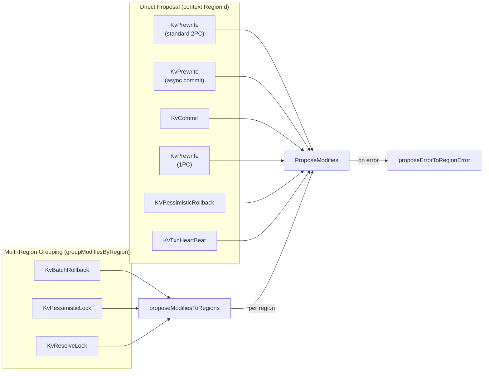
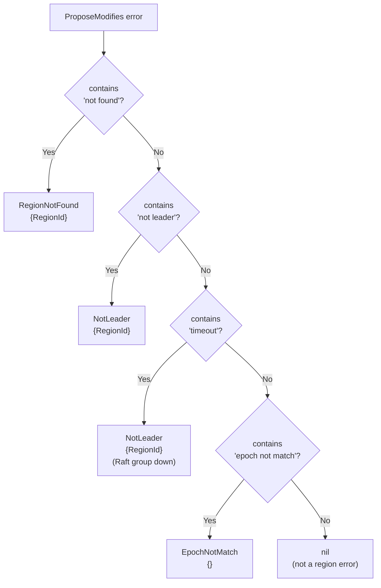
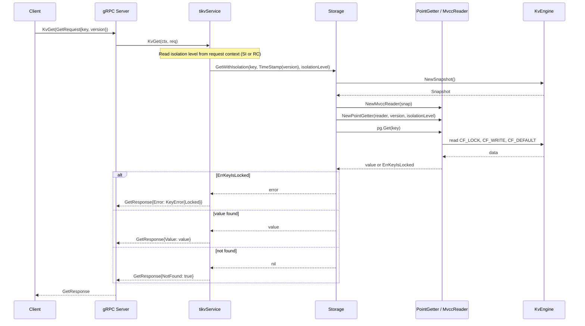
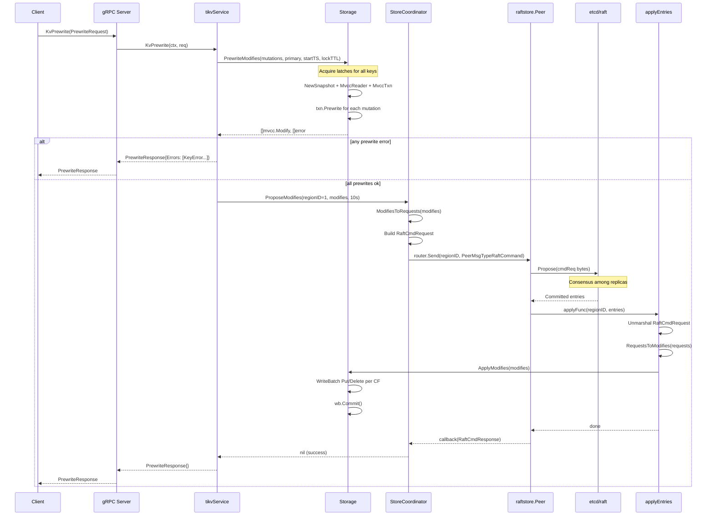

# 04 Server Layer: gRPC Service, Storage Bridge, and Transport

## 1. Overview

The server layer in gookv provides the outward-facing gRPC service and the internal machinery that connects client requests to the transactional storage engine and the Raft replication layer. It is organized into the following sub-components:

| Component | Package | Role |
|---|---|---|
| **Server** | `internal/server` | Owns the gRPC listener, lifecycle, and configuration |
| **tikvService** | `internal/server` | Implements `tikvpb.TikvServer` (the TiKV API) |
| **Storage** | `internal/server` | Bridges gRPC handlers to the MVCC/txn layer |
| **StoreCoordinator** | `internal/server` | Manages Raft peers and proposes writes via Raft |
| **RaftClient** | `internal/server/transport` | Inter-node gRPC transport with connection pooling |
| **Status Server** | `internal/server/status` | HTTP diagnostics: pprof, /metrics, /health, /config |
| **Flow Control** | `internal/server/flow` | ReadPool EWMA, FlowController, MemoryQuota |

The server registers the `Tikv` gRPC service defined in `proto/tikvpb.proto` and enables gRPC server reflection for tooling such as `grpcurl`.

---

## 2. Key Types

### 2.1 Server (`internal/server/server.go`)

```go
type ServerConfig struct {
    ListenAddr string
    ClusterID  uint64
}

type Server struct {
    cfg         ServerConfig
    grpcServer  *grpc.Server
    storage     *Storage
    rawStorage  *RawStorage           // raw KV operations (bypasses MVCC)
    coordinator *StoreCoordinator
    gcWorker    *gc.GCWorker          // background GC of old MVCC versions
    pdClient    pdclient.Client       // optional PD client for TSO allocation
    listener    net.Listener
    ctx         context.Context
    cancel      context.CancelFunc
    wg          sync.WaitGroup
}
```

**Construction** (`NewServer`):
- Creates a `context.WithCancel` for lifecycle control.
- Builds gRPC server options via `buildServerOptions`: `MaxRecvMsgSize=16 MB`, `MaxSendMsgSize=16 MB`, and a `clusterIDInterceptor` (when `ClusterID != 0`).
- Registers the `tikvService` with `tikvpb.RegisterTikvServer`.
- Enables gRPC server reflection via `reflection.Register`.

**Lifecycle methods**:
- `Start()` -- binds a TCP listener and launches `grpcServer.Serve` in a goroutine.
- `Stop()` -- cancels the context and calls `GracefulStop`.
- `SetCoordinator(coord)` -- injects the `StoreCoordinator` for cluster mode (must be called before `Start`).
- `SetPDClient(client)` -- registers PD client for TSO allocation (used by 1PC and async commit).
- `Addr()` -- returns the actual listener address.

### 2.2 tikvService (`internal/server/server.go`)

```go
type tikvService struct {
    tikvpb.UnimplementedTikvServer
    server *Server
}
```

Embeds `UnimplementedTikvServer` for forward compatibility and holds a back-pointer to `Server` to access `storage` and `coordinator`. This struct carries all the gRPC handler methods (see Section 3 and 4).

### 2.3 Storage (`internal/server/storage.go`)

```go
type Storage struct {
    engine    traits.KvEngine
    latches   *latch.Latches      // key-range latch manager (2048 slots)
    concMgr   *concurrency.Manager
    mu        sync.Mutex
    nextCmdID uint64
}
```

**Construction** (`NewStorage`): takes a `traits.KvEngine`, initializes a latch table with 2048 slots, a concurrency manager, and a monotonic command ID counter starting at 1.

**Methods** (details in Section 5):

| Method | Description |
|---|---|
| `Get(key, version)` | Transactional point read (delegates to `GetWithIsolation` with `IsolationLevelSI`) |
| `GetWithIsolation(key, version, level)` | Transactional point read with configurable isolation level (SI or RC) |
| `Scan(startKey, endKey, limit, version, keyOnly)` | Transactional range scan |
| `BatchGet(keys, version)` | Multi-key transactional read |
| `Prewrite(mutations, primary, startTS, lockTTL)` | 2PC phase-1 with direct engine write |
| `PrewriteModifies(...)` | 2PC phase-1 returning `[]mvcc.Modify` (for Raft proposal) |
| `Commit(keys, startTS, commitTS)` | 2PC phase-2 with direct engine write |
| `CommitModifies(keys, startTS, commitTS)` | 2PC phase-2 returning `[]mvcc.Modify` |
| `BatchRollback(keys, startTS)` | Rollback locks |
| `Cleanup(key, startTS)` | Single-key lock cleanup |
| `CheckTxnStatus(primaryKey, startTS)` | Transaction status inquiry (read-only) |
| `CheckTxnStatusWithCleanup(primaryKey, startTS, callerStartTS, rollbackIfNotExist)` | Status check with TTL-based lock cleanup; returns (status, modifies, error) |
| `PessimisticLock(keys, primary, startTS, forUpdateTS, lockTTL)` | Acquire pessimistic locks; returns errors per key |
| `PessimisticLockModifies(keys, primary, startTS, forUpdateTS, lockTTL)` | Returns `[]mvcc.Modify` and errors per key (for Raft proposal) |
| `PessimisticRollbackKeys(keys, startTS, forUpdateTS)` | Release pessimistic locks; returns errors per key |
| `PessimisticRollbackModifies(keys, startTS, forUpdateTS)` | Returns `[]mvcc.Modify`, errors per key, and `LatchGuard` (for Raft proposal) |
| `TxnHeartBeat(primaryKey, startTS, adviseLockTTL)` | Refresh lock TTL; returns updated TTL |
| `TxnHeartBeatModifies(primaryKey, startTS, adviseLockTTL)` | Returns `(ttl, []mvcc.Modify, error, *LatchGuard)` (for Raft proposal) |
| `ResolveLock(startTS, commitTS, keys)` | Commit or rollback all locks for a transaction |
| `ResolveLockModifies(startTS, commitTS, keys)` | Returns `[]mvcc.Modify` for resolve (for Raft proposal) |
| `PrewriteAsyncCommit(mutations, props)` | Async commit prewrite with direct apply |
| `PrewriteAsyncCommitModifies(mutations, props)` | Async commit prewrite returning `[]mvcc.Modify` |
| `Prewrite1PC(mutations, props)` | One-phase commit prewrite with direct apply |
| `Prewrite1PCModifies(mutations, props)` | One-phase commit returning `[]mvcc.Modify` |
| `CheckSecondaryLocks(keys, startTS)` | Inspect locks on async commit secondary keys |
| `ScanLock(startKey, endKey, maxVersion, limit)` | Scan CF_LOCK for locks with startTS <= maxVersion |
| `ApplyModifies(modifies)` | Write `[]mvcc.Modify` to engine atomically |

### 2.4 StoreCoordinator (`internal/server/coordinator.go`)

```go
type StoreCoordinator struct {
    mu               sync.RWMutex
    storeID          uint64
    engine           traits.KvEngine
    storage          *Storage
    router           *router.Router
    client           *transport.RaftClient
    cfg              raftstore.PeerConfig
    peers            map[uint64]*raftstore.Peer       // regionID -> Peer
    cancels          map[uint64]context.CancelFunc    // regionID -> cancel
    dones            map[uint64]chan struct{}          // regionID -> done signal
    splitCheckWorker *split.SplitCheckWorker           // background split detection
    pdClient         pdclient.Client                   // optional PD client for split coordination
    snapWorker       *raftstore.SnapWorker             // background snapshot generation
    snapTaskCh       chan raftstore.GenSnapTask         // snapshot task channel shared with peers
    snapStopCh       chan struct{}                      // stops the snap worker
    pdTaskCh         chan<- interface{}                 // channel to PDWorker for heartbeats
    snapSemaphore    chan struct{}                      // capacity 3; limits concurrent outbound snapshots
    splitResultCh    chan *raftstore.SplitRegionResult  // receives split results from peers after Raft apply
}
```

**Methods**:

| Method | Description |
|---|---|
| `BootstrapRegion(region, allPeers)` | Creates and starts a Raft peer for a region |
| `ProposeModifies(regionID, modifies, timeout, reqEpoch...)` | Serializes modifies as `RaftCmdRequest` (with epoch in header) and proposes via Raft; optionally validates region epoch at propose time; blocks until committed or timeout |
| `HandleRaftMessage(msg)` | Dispatches incoming `RaftMessage` to the correct peer via the router; falls back to `storeCh` on `ErrRegionNotFound` for dynamic peer creation |
| `HandleSnapshotMessage(msg, data)` | Attaches snapshot data to Raft message; creates peer if needed via `maybeCreatePeerForMessage`; routes to peer mailbox |
| `reportSnapshotStatus(regionID, peerID, status)` | Sends `SignificantMsg{SnapshotStatus}` back to the leader peer via the router |
| `reportUnreachable(regionID, peerID)` | Sends `SignificantMsg{Unreachable}` to the peer via the router |
| `Router()` | Returns the coordinator's router (used by `PDWorker.sendScheduleMsg`) |
| `RunStoreWorker(ctx)` | Goroutine that listens on `router.StoreCh()` and handles `CreatePeer`, `DestroyPeer`, and `RaftMessage` for unknown regions |
| `GetPeer(regionID)` | Returns the peer for a region |
| `ResolveRegionForKey(key)` | Routes a key to its containing region; when multiple regions match (e.g., stale parent after split), selects the narrowest match (largest startKey) |
| `CreatePeer(region, peers)` | Creates and starts a new Raft peer; if no persisted Raft state exists (`HasPersistedRaftState` returns false), bootstraps with the region's full peer list so the Raft node knows the correct cluster configuration |
| `RunSplitResultHandler(ctx)` | Goroutine that processes split check results, coordinates with PD (AskBatchSplit), executes splits, bootstraps child regions, and reports splits to PD (ReportBatchSplit) |
| `Stop()` | Cancels all peers, stops split check worker, and unregisters from the router |

Helper functions in `internal/server/raftcmd.go` provide the serialization bridge:
- `ModifiesToRequests([]mvcc.Modify) []*raft_cmdpb.Request` -- leader serialization path. Supports `ModifyTypeDeleteRange` via `CmdType_DeleteRange` with `StartKey`/`EndKey`.
- `RequestsToModifies([]*raft_cmdpb.Request) []mvcc.Modify` -- follower/apply deserialization path. Handles `CmdType_DeleteRange` to reconstruct `ModifyTypeDeleteRange` modifies.

**`sendRaftMessage` behavior:**

The `sendRaftMessage` function converts `raftpb.Message` to `raft_serverpb.RaftMessage` and dispatches based on message type:
- **`MsgSnap`** (snapshot): Acquires the `snapSemaphore` before sending, then uses `RaftClient.SendSnapshot(storeID, raftMsg, snapData)` for streaming transfer. The semaphore is released after the send completes (whether successful or not). This limits concurrent outbound snapshots to 3, preventing snapshot storms when many regions are scheduled to a new store simultaneously. On failure, calls `reportSnapshotStatus` with `SnapshotFailure`.
- **Other messages**: Sends asynchronously via a goroutine to avoid blocking the peer loop on slow or dead stores. On failure, logs at Debug level and calls `reportUnreachable(regionID, peerID)` to notify the leader.

**`HandleRaftMessage` fallback:**

When `HandleRaftMessage` receives a Raft message for an unknown region (router returns `ErrRegionNotFound`), it falls back to sending a `StoreMsgTypeRaftMessage` to `router.StoreCh()`. The `RunStoreWorker` goroutine processes this by calling `maybeCreatePeerForMessage`, which creates a new peer if the message is valid (e.g., a snapshot from a leader for a region this node should join).

### 2.5 PDStoreResolver (`internal/server/pd_resolver.go`)

`PDStoreResolver` implements the `transport.StoreResolver` interface for dynamic store discovery. It resolves store IDs to network addresses by querying PD, with TTL-based caching to avoid excessive RPC calls.

```go
type PDStoreResolver struct {
    pdClient pdclient.Client
    ttl      time.Duration           // default: 30s
    mu       sync.RWMutex
    cache    map[uint64]cacheEntry   // storeID -> {addr, expiry}
}
```

Because the `StoreResolver` interface does not accept a `context.Context` parameter, `PDStoreResolver` creates an internal `context.WithTimeout(context.Background(), 5*time.Second)` for each PD query.

**Methods**:

| Method | Description |
|---|---|
| `NewPDStoreResolver(pdClient, ttl)` | Creates a new resolver with the given PD client and cache TTL |
| `ResolveStore(storeID) (string, error)` | Returns the cached address if still valid, otherwise queries PD via `GetStore()` and caches the result |
| `InvalidateStore(storeID)` | Removes the cached entry for a store, forcing the next `ResolveStore` call to query PD |

`PDStoreResolver` is used in join mode for dynamic store discovery, where new stores can appear at any time. In bootstrap mode, `StaticStoreResolver` is used instead since the full cluster topology is known at startup.

### 2.6 Store Identity Persistence (`internal/server/store_ident.go`)

Store identity persistence ensures that a node retains its store ID across restarts. The store ID is stored as a decimal text file at `<dataDir>/store_ident`.

**Functions**:

| Function | Description |
|---|---|
| `SaveStoreIdent(dataDir string, storeID uint64) error` | Writes the store ID as decimal text to `<dataDir>/store_ident` |
| `LoadStoreIdent(dataDir string) (uint64, error)` | Reads and parses the persisted store ID from `<dataDir>/store_ident` |

In join mode, the store identity lifecycle works as follows:
- **First start**: The store ID is either provided via `--store-id` or allocated from PD via `AllocID()`. The ID is then persisted via `SaveStoreIdent()`.
- **Restart**: The store ID is loaded from disk via `LoadStoreIdent()`, ensuring the node re-registers with PD using the same identity.

### 2.7 Helper: errToKeyError (`internal/server/server.go`)

Converts internal Go errors to protobuf `kvrpcpb.KeyError` structures:

| Error sentinel | KeyError field set |
|---|---|
| `txn.ErrKeyIsLocked` | `Locked` (with empty `LockInfo`) |
| `txn.ErrWriteConflict` | `Conflict` (with empty `WriteConflict`) |
| `txn.ErrTxnLockNotFound` | `TxnLockNotFound` |
| `txn.ErrAlreadyCommitted` | `Abort` (error message string) |
| (other) | `Retryable` (error message string) |

---

## 3. API Definitions (`proto/tikvpb.proto`)

The `Tikv` service declares the full TiKV-compatible API. Below is the implementation status in gookv.

### 3.1 Transactional RPCs

| RPC | Request / Response | Implemented |
|---|---|---|
| `KvGet` | `GetRequest` / `GetResponse` | Yes |
| `KvScan` | `ScanRequest` / `ScanResponse` | Yes |
| `KvPrewrite` | `PrewriteRequest` / `PrewriteResponse` | Yes |
| `KvCommit` | `CommitRequest` / `CommitResponse` | Yes |
| `KvBatchGet` | `BatchGetRequest` / `BatchGetResponse` | Yes |
| `KvBatchRollback` | `BatchRollbackRequest` / `BatchRollbackResponse` | Yes (cluster mode uses `BatchRollbackModifies` + multi-region Raft proposal) |
| `KvCleanup` | `CleanupRequest` / `CleanupResponse` | Yes |
| `KvCheckTxnStatus` | `CheckTxnStatusRequest` / `CheckTxnStatusResponse` | Yes |
| `KvPessimisticLock` | `PessimisticLockRequest` / `PessimisticLockResponse` | Yes (dual-mode: cluster proposes via Raft, standalone applies locally) |
| `KVPessimisticRollback` | `PessimisticRollbackRequest` / `PessimisticRollbackResponse` | Yes (dual-mode: cluster uses `PessimisticRollbackModifies` + `ProposeModifies` via Raft; calls `validateRegionContext`) |
| `KvTxnHeartBeat` | `TxnHeartBeatRequest` / `TxnHeartBeatResponse` | Yes (dual-mode: cluster uses `TxnHeartBeatModifies` + `ProposeModifies` via Raft; calls `validateRegionContext`) |
| `KvCheckSecondaryLocks` | `CheckSecondaryLocksRequest` / `CheckSecondaryLocksResponse` | Yes (inspects locks on secondary keys for async commit resolution) |
| `KvScanLock` | `ScanLockRequest` / `ScanLockResponse` | Yes (iterates CF_LOCK with StartTS <= maxVersion filter, respects limit) |
| `KvResolveLock` | `ResolveLockRequest` / `ResolveLockResponse` | Yes (dual-mode: cluster proposes via Raft, standalone applies locally) |
| `KvGC` | `GCRequest` / `GCResponse` | Yes (schedules GC task with safe point; updates PD safe point via `pdClient.UpdateGCSafePoint` if PD is configured) |
| `KvDeleteRange` | `DeleteRangeRequest` / `DeleteRangeResponse` | Yes (creates `ModifyTypeDeleteRange` modifies for each data CF; uses `req.GetContext().GetRegionId()` for routing in cluster mode, applies directly in standalone) |

### 3.2 Raw RPCs

| RPC | Implemented |
|---|---|
| `RawGet`, `RawPut`, `RawDelete`, `RawScan` | Yes |
| `RawBatchGet`, `RawBatchPut`, `RawBatchDelete` | Yes |
| `RawDeleteRange` | Yes |
| `RawBatchScan` | Yes (multi-range scan with per-range limits) |
| `RawGetKeyTTL` | Yes (returns remaining TTL for a key, with full TTL encoding) |
| `RawCompareAndSwap` | Yes (atomic CAS with TTL awareness) |
| `RawChecksum` | Yes (CRC64 XOR-based checksum over key ranges, filters expired entries) |

All implemented Raw RPCs delegate to the `RawStorage` layer (see Section 5.6). Single-key operations (`RawGet`, `RawPut`, `RawDelete`, `RawScan`) and batch operations (`RawBatchGet`, `RawBatchPut`, `RawBatchDelete`) follow the same pattern: the handler extracts key/value/CF parameters from the request and calls the corresponding `RawStorage` method. `RawDeleteRange` deletes all keys in a given range.

All Raw RPC handlers call `validateRegionContext` before processing, including `RawPut` and `RawDelete` (which validate with the request key).

Write operations (`RawPut`, `RawDelete`, `RawBatchPut`, `RawBatchDelete`, `RawDeleteRange`) support the dual-mode pattern: in cluster mode the handler obtains `[]engine.Modify` from `RawStorage` (via `PutModify`/`DeleteModify`) and proposes them through Raft; in standalone mode the writes are applied directly.

### 3.3 Raft RPCs

| RPC | Signature | Implemented |
|---|---|---|
| `Raft` | `stream RaftMessage` -> `Done` | Yes -- receives messages and dispatches to coordinator |
| `BatchRaft` | `stream BatchRaftMessage` -> `Done` | Yes -- unpacks batch and dispatches each message |
| `Snapshot` | `stream SnapshotChunk` -> `Done` | Yes (receives snapshot chunks, reassembles data, calls `HandleSnapshotMessage` on coordinator) |

### 3.4 Batch Commands

| RPC | Signature | Implemented |
|---|---|---|
| `BatchCommands` | `stream BatchCommandsRequest` <-> `stream BatchCommandsResponse` | Yes |

`BatchCommands` is a bidirectional streaming RPC. The `handleBatchCmd` method routes each sub-command (via a protobuf `oneof cmd`) to the corresponding unary handler (KvGet, KvScan, KvPrewrite, KvCommit, KvBatchGet, KvBatchRollback, KvCleanup, KvCheckTxnStatus). Unsupported command types produce an empty response.

### 3.5 Other RPCs

| RPC | Implemented |
|---|---|
| `SplitRegion` | No |
| `ReadIndex` | No |
| `MvccGetByKey` | No |
| `MvccGetByStartTs` | No |
| `Coprocessor` | Yes (delegates to `coprocessor.Endpoint.Handle`) |
| `CoprocessorStream` | Yes (streaming variant with callback) |
| `BatchCoprocessor` | No |

---

## 4. Request Handling

### 4.1 KvGet Handler Flow

```
KvGet(ctx, GetRequest) -> GetResponse
```

1. Extract `key` and `version` from the `GetRequest`.
2. Read the isolation level from `req.GetContext().GetIsolationLevel()`. If `IsolationLevel_RC`, use `IsolationLevelRC` (Read Committed, skips lock checks); otherwise default to `IsolationLevelSI` (Snapshot Isolation).
3. Call `storage.GetWithIsolation(key, TimeStamp(version), isolationLevel)`.
4. On lock error: use `errors.As(err, &lockErr)` to extract `*mvcc.LockError`, then populate `LockInfo` via `lockToLockInfo(lockErr.Key, lockErr.Lock)` with full lock metadata (`PrimaryLock`, `LockVersion`, `LockTtl`, `TxnSize`, `ForUpdateTs`, `UseAsyncCommit`, `MinCommitTs`, `Secondaries`). This is a *logical* error, not a gRPC error. (Only occurs under SI isolation; RC skips lock checks.)
5. On other errors: return a gRPC `Internal` status error.
6. If `value == nil`: set `resp.NotFound = true`.
7. Otherwise: set `resp.Value = value`.

### 4.2 Region Validation (`validateRegionContext`)

In cluster mode, all Raw KV handlers (both reads and writes, including `RawPut` and `RawDelete`) call `validateRegionContext()` before processing. This method checks:
1. The request's `Context.RegionId` matches a known peer managed by the coordinator.
2. The requesting peer is the current leader of the region.
3. The request keys fall within the region's `[StartKey, EndKey)` range.
4. The region epoch matches (no stale requests after splits/merges).

On failure, a `regionError` is returned to the client (e.g., `NotLeader`, `EpochNotMatch`, `KeyNotInRegion`), enabling the client library to retry with updated routing information.

### 4.3 KvPrewrite Handler Flow (dual mode)

```
KvPrewrite(ctx, PrewriteRequest) -> PrewriteResponse
```

1. Convert proto `Mutation` entries to `txn.Mutation` structs, mapping `Op_Put`/`Op_Insert` to `MutationOpPut`, `Op_Del` to `MutationOpDelete`, and `Op_Lock`/`Op_CheckNotExists` to `MutationOpLock`.
2. Extract `startTS`, `primary`, `lockTTL` from the request.

**Cluster mode** (when `coordinator != nil`):
1. Call `storage.PrewriteModifies(mutations, primary, startTS, lockTTL)` -- this performs MVCC checks and computes `[]mvcc.Modify` without writing to the engine.
2. If any per-mutation errors exist, convert them via `errToKeyError` and return immediately.
3. Extract the region ID from `req.GetContext().GetRegionId()`. If zero (e.g., standalone client), fall back to `resolveRegionID(primary)`.
4. Call `coord.ProposeModifies(regionID, modifies, 10s timeout)` to propose directly to the single target region. This works because the client library groups mutations by region before sending each `PrewriteRequest`.
5. On proposal error, call `proposeErrorToRegionError(err, regionID)` to convert to a structured `regionError` (NotLeader, RegionNotFound, or timeout). Return the response.

**Note:** The async commit path also uses `req.GetContext().GetRegionId()` with direct `ProposeModifies`, matching the standard 2PC pattern. All mutations in a single async commit `PrewriteRequest` are proposed to the primary key's region. The 1PC path similarly uses `resolveRegionID(primary)` with direct `ProposeModifies`.

**Standalone mode** (when `coordinator == nil`):
1. Call `storage.Prewrite(mutations, primary, startTS, lockTTL)` -- this performs MVCC checks, computes modifications, and applies them directly to the engine in a single `WriteBatch.Commit`.
2. Convert any errors and return.

**1PC and Async Commit paths**:
The `KvPrewrite` handler inspects request flags to select the optimal path:
- If `req.UseAsyncCommit` is true and the transaction is eligible, routes to `PrewriteAsyncCommit` / `PrewriteAsyncCommitModifies`. The server uses PD-allocated timestamps (via `pdClient.GetTS()`) for `MaxCommitTS` if a PD client is configured.
- If 1PC is eligible (`Is1PCEligible`), routes to `Prewrite1PC` / `Prewrite1PCModifies`, which skips CF_LOCK entirely and writes commit records directly to CF_WRITE.
- Otherwise, falls through to standard 2PC prewrite.

### 4.4 KvCommit Handler Flow (dual mode)

Follows the same dual-mode pattern as KvPrewrite:
- **Cluster**: `storage.CommitModifies` -> extract region ID from `req.GetContext().GetRegionId()` (falls back to `resolveRegionID(keys[0])` if zero) -> `coord.ProposeModifies(regionID, modifies, ...)` to propose directly to the single target region. On proposal error, converts to structured `regionError` via `proposeErrorToRegionError`. The client groups commit keys by region before sending each request, so multi-region grouping is not needed.
- **Standalone**: `storage.Commit` -> direct engine write.

### 4.5 KvCheckTxnStatus Handler Flow (dual mode)

```
KvCheckTxnStatus(ctx, CheckTxnStatusRequest) -> CheckTxnStatusResponse
```

This handler is now write-capable -- it can clean up expired locks and write protective rollback records.

1. Extract `startTS` (from `LockTs`), `callerStartTS` (from `CallerStartTs`), and `rollbackIfNotExist` (from `RollbackIfNotExist`) from the request.
2. Call `storage.CheckTxnStatusWithCleanup(primaryKey, startTS, callerStartTS, rollbackIfNotExist)`. Returns `(status, modifies, error)`.
3. On error: populate `resp.Error` via `errToKeyError`.
4. If `len(modifies) > 0` (cleanup occurred):
   - **Cluster mode:** Call `proposeModifiesToRegionsWithRegionError(coord, modifies, 10s)` to apply through Raft. Return `RegionError` on routing failure.
   - **Standalone mode:** Call `storage.ApplyModifies(modifies)` directly.
5. Populate response: if locked, set `LockTtl` and `LockInfo`; if committed, set `CommitVersion`; if rolled back, both are zero.

---

## 5. Storage Layer

The `Storage` struct is the central bridge between gRPC handlers and the MVCC transaction processing pipeline. It is located in `internal/server/storage.go`.

### 5.1 Read Path

For read operations (`Get`, `Scan`, `BatchGet`):

1. Create a snapshot from the engine: `engine.NewSnapshot()`.
2. Create an `mvcc.MvccReader` on top of the snapshot.
3. Create an `mvcc.PointGetter` with the read timestamp and `IsolationLevelSI` (snapshot isolation).
4. Call `PointGetter.Get(key)` for each key.
5. Return results or lock-conflict errors.

`Scan` additionally iterates the `CF_WRITE` column family using MVCC-encoded seek keys, deduplicates by user key, and delegates each individual key read to `PointGetter`.

### 5.2 Write Path -- Standalone (Direct)

For `Prewrite`, `Commit`, `BatchRollback`:

1. **Latch acquisition**: Collect all mutation keys, call `latches.GenLock(keys)`, then spin on `latches.Acquire(lock, cmdID)` until acquired. Latches prevent concurrent writes to overlapping key sets.
2. **Snapshot + Reader**: `engine.NewSnapshot()` -> `mvcc.NewMvccReader(snap)`.
3. **MvccTxn creation**: `mvcc.NewMvccTxn(startTS)` -- accumulates modifications in `mvccTxn.Modifies`.
4. **Transaction operation**: Call the appropriate `txn.Prewrite`/`txn.Commit`/`txn.Rollback` function for each key. These functions read existing MVCC data via the reader and append Put/Delete modifications to the txn.
5. **Apply**: Call `ApplyModifies(mvccTxn.Modifies)` which creates a `WriteBatch`, translates each `mvcc.Modify` into a Put or Delete on the appropriate column family, and calls `wb.Commit()`.
6. **Latch release**: Deferred via `latches.Release(lock, cmdID)`.

### 5.3 Write Path -- Cluster (Raft)

For `PrewriteModifies`, `CommitModifies`:

Steps 1-4 are identical to the standalone path, but step 5 is skipped. Instead:
- The method returns `[]mvcc.Modify` to the caller (the gRPC handler).
- **For `KvPrewrite` (standard 2PC) and `KvCommit`:** The handler extracts the region ID from the request context (`req.GetContext().GetRegionId()`) and calls `coord.ProposeModifies(regionID, modifies, timeout)` directly to the single target region. This works because the client library groups mutations by region before sending each request.
- **For `KvPrewrite` (async commit):** The handler uses the same `req.GetContext().GetRegionId()` extraction as standard 2PC, calling `coord.ProposeModifies(regionID, modifies, timeout)` directly. All async commit mutations in a single request are proposed to the primary key's region.
- **For `KVPessimisticRollback` and `KvTxnHeartBeat`:** The handler calls `PessimisticRollbackModifies` / `TxnHeartBeatModifies`, then uses `req.GetContext().GetRegionId()` with direct `coord.ProposeModifies()`. Both call `validateRegionContext` before processing.
- **For `KvBatchRollback`, `KvPessimisticLock`, and `KvResolveLock`:** The handler calls `proposeModifiesToRegionsWithRegionError(coord, modifies, timeout)` which groups modifications by region via `groupModifiesByRegion()` and proposes to each region's leader separately.
- `ProposeModifies` accepts an optional `reqEpoch` parameter. When provided, it validates that the region's current epoch matches (both `Version` and `ConfVer`) before proposing — returning an "epoch not match" error if stale. It embeds the current epoch in the `RaftCmdRequest.Header` for apply-time reference. The request is serialized via `ModifiesToRequests`, wrapped in a `RaftCmdRequest`, and sent as a `PeerMsgTypeRaftCommand` to the peer's mailbox. All transactional RPC handlers pass `req.GetContext().GetRegionEpoch()` to `ProposeModifies`; RawKV handlers omit the epoch parameter.
- The peer proposes the entry to Raft. After consensus, the `applyFunc` callback fires.
- `applyEntriesForPeer` unmarshals each committed entry back to `RaftCmdRequest`, converts the requests to modifies via `RequestsToModifies`, and calls `storage.ApplyModifies` unconditionally. Split admin entries (tag byte `0x02`) and CompactLog entries (tag byte `0x01`) fail protobuf unmarshal and are harmlessly skipped — they are processed separately in `handleReady`'s first committed-entries loop.

### 5.4 CheckTxnStatus / CheckTxnStatusWithCleanup

**`CheckTxnStatus(primaryKey, startTS)`** -- Read-only. Does not acquire latches. Creates a snapshot and reader, then delegates to `txn.CheckTxnStatus`. Returns a `TxnStatus` struct indicating one of three states: Locked (with lock info), Committed (with commitTS), or Rolled back (both LockTtl and CommitVersion are zero).

**`CheckTxnStatusWithCleanup(primaryKey, startTS, callerStartTS, rollbackIfNotExist)`** -- Write-capable. Acquires latches on the primary key. Creates a snapshot, reader, and `MvccTxn` accumulator, then delegates to `txn.CheckTxnStatusWithCleanup`. Returns `(*TxnStatus, []mvcc.Modify, error)`. The modifies are non-empty when the function cleaned up an expired lock (TTL-based rollback) or wrote a protective rollback record (`rollbackIfNotExist`). See `03_transaction.md` Section "CheckTxnStatusWithCleanup" for the algorithm details.

**`Cleanup(key, startTS)`** (renamed to `CleanupModifies` internally) -- Resolves a single key's lock by checking the **primary key's** transaction status. Acquires latches. The algorithm is lock-existence-first:
1. **Check lock:** Load the lock for `key`. If no lock exists or the lock's `StartTS` does not match, check the transaction status via `CheckTxnStatus` and return early (idempotent — the lock was already resolved).
2. **Lock exists:** Extract the `Primary` field from the lock and call `CheckTxnStatus` on the primary key.
3. **Primary committed** → commits this key via `ResolveLock(key, startTS, primaryCommitTS)`.
4. **Primary rolled back, not found, or error** → directly removes the lock via `UnlockKey`, deletes the large value from CF_DEFAULT if applicable (non-short-value Put lock), and writes a `WriteTypeRollback` record via `PutWrite(key, startTS, rollbackWrite)`. This avoids calling the generic `Rollback` function.
5. Returns the collected modifications for Raft proposal (cluster mode) or direct application (standalone mode).

### 5.5 Pessimistic Lock and Resolve Lock Methods

The following methods follow the same latch-acquire / snapshot / MvccTxn pattern as `Prewrite` and `Commit`:

- **PessimisticLock** -- acquires pessimistic locks for the given keys. Creates an `MvccTxn` at `startTS`, calls `txn.PessimisticLock` for each key with `forUpdateTS` and `lockTTL`, then applies the resulting modifications directly.
- **PessimisticLockModifies** -- same logic but returns `[]mvcc.Modify` without writing, for use with `ProposeModifies` in cluster mode.
- **PessimisticRollbackKeys** -- releases pessimistic locks for the given keys at `(startTS, forUpdateTS)`. Applies directly in standalone mode.
- **PessimisticRollbackModifies** -- same logic but returns `[]mvcc.Modify` and a `LatchGuard` for use with `ProposeModifies` in cluster mode. The `KVPessimisticRollback` handler calls `validateRegionContext` and routes through Raft.
- **TxnHeartBeat** -- refreshes the TTL of the lock on `primaryKey` at `startTS` to at least `adviseLockTTL`. Returns the resulting TTL. Applies directly in standalone mode.
- **TxnHeartBeatModifies** -- same logic but returns `(ttl, []mvcc.Modify, error, *LatchGuard)` for use with `ProposeModifies` in cluster mode. The `KvTxnHeartBeat` handler calls `validateRegionContext` and routes through Raft.
- **ResolveLock** -- commits or rolls back all locks belonging to a transaction (`startTS`). If `commitTS > 0` the locks are committed; otherwise they are rolled back. Applies directly.
- **ResolveLockModifies** -- same logic but returns `[]mvcc.Modify` for Raft proposal.

### 5.6 RawStorage (`internal/server/raw_storage.go`)

`RawStorage` provides non-transactional key-value operations that bypass the MVCC layer entirely.

```go
type RawStorage struct {
    engine traits.KvEngine
}
```

**CF resolution**: an empty column-family string is mapped to `CF_DEFAULT`.

**Methods**:

| Method | Description |
|---|---|
| `Get(cf, key)` | Point read from the specified column family |
| `Put(cf, key, value)` | Write a key-value pair directly to the engine |
| `Delete(cf, key)` | Delete a single key |
| `BatchGet(cf, keys)` | Multi-key read; returns values indexed by key |
| `BatchPut(cf, pairs)` | Multi-key write via `WriteBatch` |
| `BatchDelete(cf, keys)` | Multi-key delete via `WriteBatch` |
| `Scan(cf, startKey, endKey, limit)` | Range scan returning key-value pairs |
| `DeleteRange(cf, startKey, endKey)` | Delete all keys in a range via `WriteBatch` |
| `BatchScan(cf, ranges, limits)` | Multi-range scan with per-range result limits |
| `GetKeyTTL(cf, key)` | Returns remaining TTL for a key (0 if no TTL set) |
| `CompareAndSwap(cf, key, value, prevValue, prevNotExist)` | Atomic CAS with TTL-aware value comparison |
| `Checksum(cf, startKey, endKey)` | CRC64 XOR-based checksum over a key range, filtering expired TTL entries |
| `PutModify(cf, key, value)` | Returns an `engine.Modify` (Put) for use with Raft proposals |
| `DeleteModify(cf, key)` | Returns an `engine.Modify` (Delete) for use with Raft proposals |

`PutModify` and `DeleteModify` do not write to the engine themselves. They return `engine.Modify` structs that the gRPC handler collects and passes to `coordinator.ProposeModifies` in cluster mode.

### 5.7 BatchRollbackModifies

```go
func (s *Storage) BatchRollbackModifies(keys [][]byte, startTS txntypes.TimeStamp) ([]mvcc.Modify, error)
```

Returns `[]mvcc.Modify` without applying — used by the `KvBatchRollback` handler in cluster mode to propose rollback modifications via Raft. Acquires latches for the given keys, creates an `MvccTxn`, calls `txn.Rollback` for each key, and returns the collected modifications.

### 5.8 Multi-Region Helpers

The following helper methods on `tikvService` enable cross-region Raft proposals for operations where mutations may span multiple regions:

```go
func (svc *tikvService) groupModifiesByRegion(modifies []mvcc.Modify) map[uint64][]mvcc.Modify
```

Groups modifications by target region. Uses the encoded modify key directly (via `resolveRegionID(m.Key)`) for region lookup. Region boundaries are stored as MVCC-encoded keys, so the encoded modify keys match without decoding. Returns `map[regionID → []Modify]`.

```go
func (svc *tikvService) proposeModifiesToRegions(coord *StoreCoordinator, modifies []mvcc.Modify, timeout time.Duration) error
```

Groups modifications by region and calls `coord.ProposeModifies()` for each region group sequentially. Returns the first error encountered.

```go
func (svc *tikvService) proposeModifiesToRegionsWithRegionError(coord *StoreCoordinator, modifies []mvcc.Modify, timeout time.Duration) (*errorpb.Error, error)
```

Like `proposeModifiesToRegions` but converts proposal errors to structured region errors via `proposeErrorToRegionError()`. Returns `(*errorpb.Error, nil)` for region routing errors (NotLeader, RegionNotFound, timeout) or `(nil, error)` for other errors. Used by `KvPrewrite` (async commit path), `KvBatchRollback`, `KvPessimisticLock`, and `KvResolveLock` handlers in cluster mode. Note: `KvPrewrite` (standard 2PC) and `KvCommit` no longer use this function — they use `req.GetContext().GetRegionId()` with direct `coord.ProposeModifies()` since the client groups mutations by region.

```go
func proposeErrorToRegionError(err error, regionID uint64) *errorpb.Error
```

Converts a `ProposeModifies` error into a structured region error by inspecting the error message string. Returns `nil` if the error is not a recognized region-routing error. Recognized patterns:
- `"not found"` → `RegionNotFound{RegionId}`
- `"not leader"` → `NotLeader{RegionId}`
- `"timeout"` → `NotLeader{RegionId}` (proposal timeout usually indicates the Raft group is non-functional; returning NotLeader triggers client retry with a different store)
- `"epoch not match"` → `EpochNotMatch{}` (region epoch changed between RPC validation and Raft proposal, typically due to a concurrent split; client refreshes region cache and retries)

Used by `proposeModifiesToRegionsWithRegionError`, the direct proposal paths in `KvPrewrite` (standard 2PC, 1PC), `KvCommit`, `KVPessimisticRollback`, `KvTxnHeartBeat`, and Raw KV write handlers.

**Proposal routing strategy overview:**



**Error classification in `proposeErrorToRegionError`:**



### 5.9 lockToLockInfo

```go
func lockToLockInfo(key []byte, lock *txntypes.Lock) *kvrpcpb.LockInfo
```

Converts an internal `Lock` and user key to a protobuf `kvrpcpb.LockInfo` with full metadata: `PrimaryLock`, `LockVersion`, `Key`, `LockTtl`, `TxnSize`, `LockForUpdateTs`, `UseAsyncCommit`, `MinCommitTs`, `Secondaries`. Maps `LockType` to proto `Op` enum (`LockTypePut → Op_Put`, `LockTypeDelete → Op_Del`, etc.). Used by `KvGet`, `KvScan`, and `KvBatchGet` handlers to propagate lock information to clients for lock resolution.

**TTL Support**: `RawStorage` supports per-key TTL (Time-To-Live) with a 9-byte encoding overhead appended to values: 8 bytes for the expiry timestamp (big-endian Unix nanoseconds) + 1 byte flag. All read operations (`Get`, `BatchGet`, `Scan`, `BatchScan`, `Checksum`) automatically filter expired entries. `Put` accepts an optional TTL parameter.

---

## 6. Transport Layer (`internal/server/transport/transport.go`)

### 6.1 RaftClient

```go
type RaftClient struct {
    mu          sync.RWMutex
    connections map[uint64]*connPool    // storeID -> connection pool
    streams     map[uint64]*raftStream  // storeID -> persistent stream
    resolver    StoreResolver
    batchSize   int
    dialTimeout time.Duration
    poolSize    int // configured connection pool size per store
    streamBuf   int // send channel buffer size for streams (default 4096)
}
```

**Long-lived `raftStream`**: Each store has a persistent gRPC `Raft` streaming RPC. The stream is created lazily on first `Send()` via `getOrCreateStream()` and reused for all subsequent messages. A dedicated **send goroutine** (`sendLoop`) reads from a buffered channel (`sendCh`, capacity 4096) and writes to the gRPC stream. If a send error occurs, the stream is marked closed (`atomic.Bool`) and automatically recreated on the next `Send()`.

```go
type raftStream struct {
    storeID uint64
    conn    *grpc.ClientConn
    stream  tikvpb.Tikv_RaftClient
    sendCh  chan *raft_serverpb.RaftMessage  // buffered (4096)
    ctx     context.Context
    cancel  context.CancelFunc
    closed  atomic.Bool
}
```

**StoreResolver interface**:
```go
type StoreResolver interface {
    ResolveStore(storeID uint64) (string, error)
}
```

**Configuration** (`RaftClientConfig`):
- `PoolSize`: connections per store (default 1)
- `BatchSize`: max messages per batch send (default 128)
- `DialTimeout`: connection timeout (default 5s)

### 6.2 Methods

| Method | Description |
|---|---|
| `Send(storeID, msg)` | Enqueues a `RaftMessage` on the persistent stream's buffered send channel. The stream is lazily created and reused. Non-blocking unless the buffer is full. |
| `BatchSend(storeID, msgs)` | Opens a `BatchRaft` stream. Sends messages in batches of `batchSize`. 10s timeout. |
| `SendSnapshot(storeID, msg, data)` | Opens a `Snapshot` stream. Sends data in 1 MB chunks with the `RaftMessage` metadata in the first chunk. 5-minute timeout. |
| `Close()` | Closes all connection pools. |
| `RemoveConnection(storeID)` | Closes and removes the pool for a specific store. |

### 6.3 Connection Pooling

Each store gets a `connPool` with lazily-established gRPC connections. The pool uses **atomic round-robin** (`nextIdx`) to select a connection index:

```go
type connPool struct {
    mu      sync.Mutex
    addr    string
    conns   []*grpc.ClientConn
    size    int
    nextIdx uint64 // round-robin counter
}
```

Connection options:
- `insecure.NewCredentials()` (no TLS)
- Keepalive: `Time=60s`, `Timeout=10s`, `PermitWithoutStream=false`
- Max message sizes: 64 MB send/recv

`HashRegionForConn(regionID, poolSize)` provides FNV-based consistent hashing for selecting a connection index within a pool (currently unused since pool size defaults to 1).

### 6.4 MessageBatcher

```go
type MessageBatcher struct {
    batches map[uint64][]*raft_serverpb.RaftMessage  // storeID -> pending
    client  *RaftClient
    maxSize int
}
```

Accumulates Raft messages per target store and flushes them all at once via `BatchSend`. Methods: `Add(storeID, msg)`, `Flush() map[uint64]error`, `Pending() map[uint64]int`.

---

## 7. Status Server (`internal/server/status/status.go`)

The status server is a standalone HTTP server for diagnostics and monitoring.

### 7.1 Endpoints

| Path | Handler | Description |
|---|---|---|
| `/debug/pprof/` | `pprof.Index` | Go pprof profiling index |
| `/debug/pprof/cmdline` | `pprof.Cmdline` | Command-line profile |
| `/debug/pprof/profile` | `pprof.Profile` | CPU profile |
| `/debug/pprof/symbol` | `pprof.Symbol` | Symbol lookup |
| `/debug/pprof/trace` | `pprof.Trace` | Execution trace |
| `/metrics` | `promhttp.Handler()` | Prometheus metrics |
| `/config` | `handleConfig` | Returns current server config as JSON |
| `/status` | `handleStatus` | Returns `{"status":"ok","version":"gookv-dev"}` |
| `/health` | `handleHealth` | Returns `{"status":"ok"}` (HTTP 200) |

### 7.2 Configuration

```go
type Config struct {
    Addr     string              // e.g. "127.0.0.1:20180"
    ConfigFn func() interface{}  // Returns current config for /config
}
```

HTTP server timeouts: `ReadTimeout=10s`, `WriteTimeout=30s`, `IdleTimeout=60s`. Graceful shutdown with a 5-second deadline.

---

## 8. Flow Control (`internal/server/flow/flow.go`)

### 8.1 ReadPool

A worker pool with EWMA-based busy detection.

| Field | Description |
|---|---|
| `workers` | Number of goroutine workers (default 4) |
| `taskCh` | Buffered channel (`workers*16` capacity) |
| `ewmaSlice` | EWMA of task execution time in nanoseconds (atomic, alpha=0.3) |
| `queueDepth` | Current number of tasks in the queue (atomic) |
| `stopCh` | Channel closed by `Stop()` to signal workers |
| `wg` | `sync.WaitGroup` tracking all worker goroutines |

- `Submit(task)` wraps the task with timing instrumentation and enqueues it.
- `CheckBusy(ctx, thresholdMs)` estimates wait time as `ewma * depth / workers` and returns `ServerIsBusyError` if it exceeds the threshold.
- `Stop()` closes `stopCh` and calls `wg.Wait()` to drain pending tasks before returning. Each worker drains remaining tasks from `taskCh` after `stopCh` is closed, ensuring no in-flight work is lost.

### 8.2 FlowController

Probabilistic request dropping based on compaction pressure.

| Field | Description |
|---|---|
| `discardRatio` | Fixed-point 0-1000 representing drop probability 0.0-1.0 (atomic) |
| `softLimit` | Pending compaction bytes soft limit |
| `hardLimit` | Pending compaction bytes hard limit |

- `ShouldDrop()` returns true with probability equal to `discardRatio / 1000`.
- `UpdatePendingCompactionBytes(pending)` recalculates the ratio via linear interpolation between soft and hard limits. Below soft limit the ratio is 0; at or above hard limit the ratio is 1.0.

### 8.3 MemoryQuota

Lock-free memory quota enforcement using atomic CAS.

| Method | Description |
|---|---|
| `Acquire(size)` | CAS loop; returns `ErrSchedTooBusy` if `used + size > capacity` |
| `Release(size)` | Atomically decrements used |
| `Used()`, `Capacity()`, `Available()` | Introspection methods |

---

## 9. Diagrams

### 9.1 KvGet Request Flow (Sequence)



### 9.2 KvPrewrite in Cluster Mode (Sequence)



### 9.3 Component Relationships (Class Diagram)

```mermaid
classDiagram
    class Server {
        -cfg ServerConfig
        -grpcServer *grpc.Server
        -storage *Storage
        -rawStorage *RawStorage
        -coordinator *StoreCoordinator
        -gcWorker *gc.GCWorker
        -listener net.Listener
        -ctx context.Context
        -cancel context.CancelFunc
        -wg sync.WaitGroup
        +NewServer(cfg, storage) Server
        +SetCoordinator(coord)
        +Start() error
        +Stop()
        +Addr() string
    }

    class tikvService {
        -server *Server
        +KvGet(ctx, req) resp, err
        +KvScan(ctx, req) resp, err
        +KvPrewrite(ctx, req) resp, err
        +KvCommit(ctx, req) resp, err
        +KvBatchGet(ctx, req) resp, err
        +KvBatchRollback(ctx, req) resp, err
        +KvCleanup(ctx, req) resp, err
        +KvCheckTxnStatus(ctx, req) resp, err
        +KvPessimisticLock(ctx, req) resp, err
        +KVPessimisticRollback(ctx, req) resp, err
        +KvTxnHeartBeat(ctx, req) resp, err
        +KvResolveLock(ctx, req) resp, err
        +RawGet(ctx, req) resp, err
        +RawPut(ctx, req) resp, err
        +RawDelete(ctx, req) resp, err
        +RawScan(ctx, req) resp, err
        +RawBatchGet(ctx, req) resp, err
        +RawBatchPut(ctx, req) resp, err
        +RawBatchDelete(ctx, req) resp, err
        +RawDeleteRange(ctx, req) resp, err
        +Coprocessor(ctx, req) resp, err
        +CoprocessorStream(req, stream) error
        +BatchCommands(stream) error
        +Raft(stream) error
        +BatchRaft(stream) error
    }

    class Storage {
        -engine traits.KvEngine
        -latches *latch.Latches
        -concMgr *concurrency.Manager
        -nextCmdID uint64
        +Get(key, version) value, err
        +Scan(...) pairs, err
        +BatchGet(keys, version) pairs, err
        +Prewrite(mutations, ...) errs
        +PrewriteModifies(mutations, ...) modifies, errs
        +Commit(keys, startTS, commitTS) err
        +CommitModifies(keys, ...) modifies, err
        +BatchRollback(keys, startTS) err
        +Cleanup(key, startTS) commitTS, err
        +CheckTxnStatus(key, startTS) status, err
        +PessimisticLock(keys, ...) errs
        +PessimisticLockModifies(keys, ...) modifies, errs
        +PessimisticRollbackKeys(keys, ...) errs
        +TxnHeartBeat(key, startTS, ttl) ttl, err
        +ResolveLock(startTS, commitTS, keys) err
        +ResolveLockModifies(startTS, commitTS, keys) modifies, err
        +ApplyModifies(modifies) err
    }

    class RawStorage {
        -engine traits.KvEngine
        +Get(cf, key) value, err
        +Put(cf, key, value) err
        +Delete(cf, key) err
        +BatchGet(cf, keys) map, err
        +BatchPut(cf, pairs) err
        +BatchDelete(cf, keys) err
        +Scan(cf, start, end, limit) pairs, err
        +DeleteRange(cf, start, end) err
        +PutModify(cf, key, value) Modify
        +DeleteModify(cf, key) Modify
    }

    class StoreCoordinator {
        -storeID uint64
        -engine traits.KvEngine
        -storage *Storage
        -router *router.Router
        -client *transport.RaftClient
        -peers map~uint64, Peer~
        +BootstrapRegion(region, peers) err
        +ProposeModifies(regionID, modifies, timeout) err
        +HandleRaftMessage(msg) err
        +GetPeer(regionID) Peer
        +Stop()
    }

    class RaftClient {
        -connections map~uint64, connPool~
        -resolver StoreResolver
        -batchSize int
        -dialTimeout time.Duration
        +Send(storeID, msg) err
        +BatchSend(storeID, msgs) err
        +SendSnapshot(storeID, msg, data) err
        +Close()
    }

    Server "1" *-- "1" tikvService : registers
    Server "1" *-- "1" Storage : owns
    Server "1" *-- "1" RawStorage : owns
    Server "1" o-- "0..1" StoreCoordinator : optional
    tikvService --> Server : back-pointer
    tikvService --> RawStorage : raw KV ops
    StoreCoordinator --> Storage : calls ApplyModifies
    StoreCoordinator --> RaftClient : sends Raft messages
    StoreCoordinator --> "router.Router" : dispatches peer messages
```
