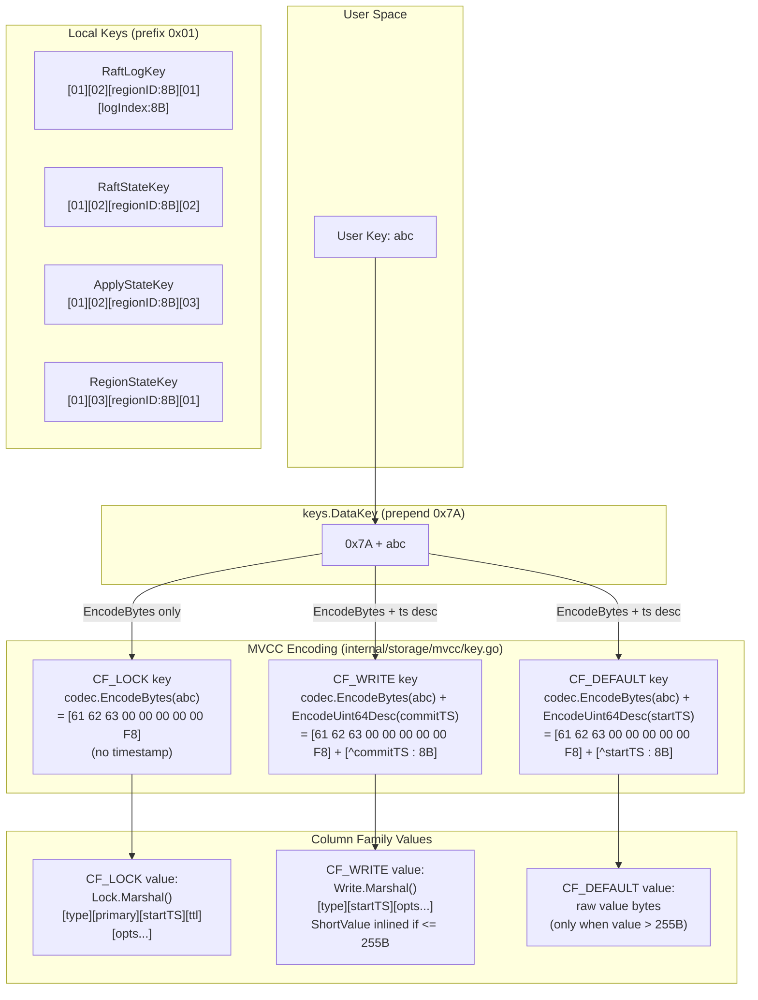

# 07 - Codec and Keys Layer

## 1. Overview

The codec and keys packages form the byte-level encoding layer of gookv. Every key stored in the underlying engine passes through this layer, which guarantees two properties:

1. **Byte-compatibility with TiKV** -- encoded keys and values are byte-identical to what TiKV would produce, so the wire protocol and on-disk format can interoperate.
2. **Correct lexicographic ordering** -- all key encodings are *memcomparable*: comparing encoded byte strings with `bytes.Compare` yields the same result as comparing the original typed values with their natural ordering.

The layer is split into five public packages:

| Package | Path | Purpose |
|---------|------|---------|
| `codec` | `pkg/codec/` | Byte and number encoding primitives |
| `keys` | `pkg/keys/` | Internal key construction (data keys, local/Raft keys) |
| `cfnames` | `pkg/cfnames/` | Column family name constants |
| `txntypes` | `pkg/txntypes/` | Transaction record types (Lock, Write, Mutation, TimeStamp) with binary serialization |
| `mvcc` (internal) | `internal/storage/mvcc/key.go` | MVCC key encoding that combines user key + timestamp |

---

## 2. Byte Encoding (`pkg/codec/bytes.go`)

### Group-based memcomparable encoding

The byte encoder splits input into 8-byte groups. Each group is followed by a single marker byte, producing 9 output bytes per group. The final group is zero-padded and its marker records how many pad bytes were added.

**Constants:**

| Name | Value | Role |
|------|-------|------|
| `encGroupSize` | 8 | Bytes per group |
| `encMarker` | `0xFF` | Marker for a full (non-final) group |
| `encPad` | `0x00` | Padding byte |

### `EncodeBytes(dst, data) []byte`

Ascending-order memcomparable encoding.

1. For each complete 8-byte chunk of `data`, copy the 8 bytes and append marker `0xFF`.
2. For the final chunk (0-8 bytes), copy the remaining bytes, zero-fill to 8, and append `encMarker - padCount` as the marker.
3. The result is appended to `dst` (which may be nil).

The encoded length for input of length `n` is `(n/8 + 1) * 9`, computed by `EncodedBytesLength`.

### `DecodeBytes(data) ([]byte, []byte, error)`

Reverses `EncodeBytes`. Reads 9 bytes at a time:

- If the marker is `0xFF`, the group contains 8 real bytes; continue.
- Otherwise, `padCount = 0xFF - marker`. The real data length is `8 - padCount`. The decoder validates that all padding positions are `0x00`; if not, it returns `ErrInvalidEncodedKey`.

Returns `(decoded, remaining, error)` where `remaining` is the unconsumed tail of the input buffer.

### Fuzz Tests

`pkg/codec/fuzz_test.go` provides 6 fuzz targets using Go's `testing.F` framework, covering `EncodeBytes`/`DecodeBytes`, `EncodeBytesDesc`/`DecodeBytesDesc`, `EncodeUint64`/`DecodeUint64`, `EncodeUint64Desc`/`DecodeUint64Desc`, `EncodeInt64`/`DecodeInt64`, and `EncodeFloat64`/`DecodeFloat64`. Each target verifies round-trip correctness and ordering invariants.

### `EncodeBytesDesc(dst, data) []byte` / `DecodeBytesDesc(data) ([]byte, []byte, error)`

Descending-order variants. `EncodeBytesDesc` calls `EncodeBytes` and then bitwise-inverts every newly appended byte (`^`). `DecodeBytesDesc` inverts each group and marker inline before applying the same group-based decoding logic.

### Error types

- `ErrInsufficientData` -- input buffer is shorter than 9 bytes when a group is expected.
- `ErrInvalidEncodedKey` -- padding bytes are non-zero, or the pad count exceeds `encGroupSize`.

---

## 3. Number Encoding (`pkg/codec/number.go`)

All fixed-width encodings produce exactly 8 bytes (big-endian). Variable-length encodings use Go's `encoding/binary` LEB128 implementation.

### Unsigned integers

| Function | Encoding |
|----------|----------|
| `EncodeUint64(dst, v)` | Big-endian 8 bytes of `v` (ascending order) |
| `EncodeUint64Desc(dst, v)` | Big-endian 8 bytes of `^v` (descending order) |
| `DecodeUint64(data)` | Read 8 big-endian bytes |
| `DecodeUint64Desc(data)` | Read 8 big-endian bytes, return `^value` |

Descending encoding is critical for timestamp encoding in MVCC keys: newer (larger) timestamps must sort *first* under byte comparison.

### Signed integers

`EncodeInt64` flips the sign bit (`v ^ (1 << 63)`) so negative values sort before positive values in unsigned byte comparison, then delegates to `EncodeUint64`. `DecodeInt64` reverses this.

### Floating point

`EncodeFloat64` converts the IEEE 754 bit pattern to a comparable uint64:

- Positive floats: flip the sign bit.
- Negative floats: flip all bits.

This ensures `-2.0 < -1.0 < 0.0 < 1.0 < 2.0` under unsigned byte comparison. `DecodeFloat64` reverses the transformation.

Note: The coprocessor (`internal/coprocessor/endpoint.go`) uses `math.Float64bits`/`math.Float64frombits` directly for IEEE 754 bit-level float encoding in RPN expressions and Datum serialization, without the memcomparable sign-flip transformation (since ordering is not required in value serialization).

### Variable-length integers

| Function | Encoding |
|----------|----------|
| `EncodeVarint(dst, v)` | Unsigned LEB128 (Go `binary.PutUvarint`) |
| `DecodeVarint(data)` | Unsigned LEB128 decode |
| `EncodeSignedVarint(dst, v)` | Signed LEB128 / zigzag (Go `binary.PutVarint`) |
| `DecodeSignedVarint(data)` | Signed LEB128 decode |

`MaxVarintLen64 = 10` is the maximum encoded length for a uint64.

Note: varint encoding is **not** memcomparable. It is used only inside serialized record bodies (Lock/Write values), never in keys.

---

## 4. Key Prefixing (`pkg/keys/`)

The keys package partitions the storage engine's single keyspace into two disjoint regions using a one-byte prefix.

### Prefix constants

| Constant | Value | Description |
|----------|-------|-------------|
| `LocalPrefix` | `0x01` | Internal metadata (Raft logs, region state, store identity) |
| `DataPrefix` | `0x7A` (`'z'`) | User-facing transactional data |

Because `0x01 < 0x7A`, all local keys sort before all data keys.

### Category and suffix constants

| Constant | Value | Used in |
|----------|-------|---------|
| `RegionRaftPrefix` | `0x02` | Raft log, Raft state, apply state |
| `RegionMetaPrefix` | `0x03` | Region metadata |
| `RaftLogSuffix` | `0x01` | Raft log entries |
| `RaftStateSuffix` | `0x02` | Raft hard state |
| `ApplyStateSuffix` | `0x03` | Apply state |
| `RegionStateSuffix` | `0x01` | Region state |
| `StoreIdentKeySuffix` | `0x01` | Store identity |
| `PrepareBootstrapKeySuffix` | `0x02` | Bootstrap preparation marker |

### Data key functions

```
DataKey(key)      -> [0x7A] + key        // prepend DataPrefix
OriginKey(dataKey) -> key                 // strip DataPrefix (no-op if absent)
IsDataKey(key)     -> key[0] == 0x7A
IsLocalKey(key)    -> key[0] == 0x01
```

### Local key builders

Each builder constructs a fixed-layout key. Region IDs and log indices are encoded as 8-byte big-endian.

| Function | Format | Total bytes |
|----------|--------|-------------|
| `RaftLogKey(regionID, logIndex)` | `[0x01][0x02][regionID:8B BE][0x01][logIndex:8B BE]` | 19 |
| `RaftStateKey(regionID)` | `[0x01][0x02][regionID:8B BE][0x02]` | 11 |
| `ApplyStateKey(regionID)` | `[0x01][0x02][regionID:8B BE][0x03]` | 11 |
| `RegionStateKey(regionID)` | `[0x01][0x03][regionID:8B BE][0x01]` | 11 |

**Pre-built keys:**

- `StoreIdentKey` = `[0x01, 0x01]`
- `PrepareBootstrapKey` = `[0x01, 0x02]`

### Key range helpers

- `DataMinKey` = `[0x7A]` -- inclusive lower bound for data iteration.
- `DataMaxKey` = `[0x7B]` -- exclusive upper bound.
- `LocalMinKey` = `[0x01]`, `LocalMaxKey` = `[0x02]`.
- `RaftLogKeyRange(regionID)` returns `[RaftLogKey(regionID, 0), RaftStateKey(regionID))`. This works because `RaftStateSuffix (0x02) > RaftLogSuffix (0x01)`.

### Region ID extraction

- `RegionIDFromRaftKey(key)` -- validates prefix `[0x01][0x02]` then reads `key[2:10]` as big-endian uint64.
- `RegionIDFromMetaKey(key)` -- validates prefix `[0x01][0x03]` then reads `key[2:10]`.

---

## 5. Column Family Names (`pkg/cfnames/`)

Four column families partition data by purpose:

| Constant | String | Content |
|----------|--------|---------|
| `CFDefault` | `"default"` | Large values (when too big for short-value inline) |
| `CFLock` | `"lock"` | Active transaction locks |
| `CFWrite` | `"write"` | Commit/rollback metadata |
| `CFRaft` | `"raft"` | Raft state (logs, hard state) |

Convenience slices:

- `DataCFs = [CFDefault, CFLock, CFWrite]` -- the three CFs involved in MVCC transactions.
- `AllCFs = [CFDefault, CFLock, CFWrite, CFRaft]` -- all four CFs.

---

## 6. Transaction Types (`pkg/txntypes/`)

### 6.1 TimeStamp

`TimeStamp` is a `uint64` representing a hybrid logical clock value from PD's TSO.

**Bit layout:** upper 46 bits are physical time (milliseconds since epoch); lower 18 bits are logical sequence.

| Function / Constant | Description |
|---------------------|-------------|
| `ComposeTS(physical, logical)` | Constructs a TimeStamp from two components |
| `ts.Physical()` | `int64(ts >> 18)` |
| `ts.Logical()` | `int64(ts & 0x3FFFF)` |
| `TSMax` | `math.MaxUint64` |
| `TSZero` | `0` |
| `ts.IsZero()` | `ts == 0` |
| `ts.Prev()` | `ts - 1` (clamped at `TSZero`) |
| `ts.Next()` | `ts + 1` (clamped at `TSMax`) |

`TSLogicalBits = 18`.

### 6.2 Lock

Represents an active transaction lock stored as the **value** in `CF_LOCK`.

**Fields:**

| Field | Type | Description |
|-------|------|-------------|
| `LockType` | `LockType` (byte) | `'P'` Put, `'D'` Delete, `'L'` Lock, `'S'` Pessimistic |
| `Primary` | `[]byte` | Primary key of the transaction |
| `StartTS` | `TimeStamp` | Transaction start timestamp |
| `TTL` | `uint64` | Time-to-live in milliseconds |
| `ShortValue` | `[]byte` | Inlined value (optional, tag `'v'`) |
| `ForUpdateTS` | `TimeStamp` | Pessimistic lock version (optional, tag `'f'`) |
| `TxnSize` | `uint64` | Transaction size hint (optional, tag `'t'`) |
| `MinCommitTS` | `TimeStamp` | Minimum allowed commit timestamp (optional, tag `'c'`) |
| `UseAsyncCommit` | `bool` | Async commit enabled (tag `'a'`) |
| `Secondaries` | `[][]byte` | Secondary keys for async commit |
| `RollbackTS` | `[]TimeStamp` | Collapsed rollback timestamps (optional, tag `'r'`) |
| `LastChange` | `LastChange` | Previous data-changing version info (optional, tag `'l'`) |
| `TxnSource` | `uint64` | Transaction source identifier (optional, tag `'s'`) |
| `PessimisticLockWithConflict` | `bool` | Pessimistic conflict flag (tag `'F'`) |
| `Generation` | `uint64` | Lock generation (optional, tag `'g'`) |

`LastChange` has two fields: `TS TimeStamp` and `EstimatedVersions uint64`.

**Serialization format (`Marshal` / `UnmarshalLock`):**

```
[LockType:1B] [primary:varint-len + bytes] [startTS:varint] [ttl:varint]
  {optional tagged fields in defined order}
```

Required fields are written unconditionally. Optional fields are prefixed by a one-byte tag and written only when non-zero/non-empty. Fixed-width optional fields (ForUpdateTS, TxnSize, MinCommitTS, Generation) use 8-byte big-endian after the tag. ShortValue uses `[tag][length:1B][data]`. List fields (Secondaries, RollbackTS) use `[tag][count:varint][elements...]`.

**`IsExpired(currentTS)`** compares the physical component of `currentTS` against `startTS.Physical() + TTL`.

### 6.3 Write

Represents a committed (or rolled-back) version stored as the **value** in `CF_WRITE`.

**Fields:**

| Field | Type | Description |
|-------|------|-------------|
| `WriteType` | `WriteType` (byte) | `'P'` Put, `'D'` Delete, `'L'` Lock, `'R'` Rollback |
| `StartTS` | `TimeStamp` | Start timestamp of the committed transaction |
| `ShortValue` | `[]byte` | Inlined value (optional, tag `'v'`) |
| `HasOverlappedRollback` | `bool` | Overlapped rollback marker (tag `'R'`) |
| `GCFence` | `*TimeStamp` | GC fence timestamp (optional, tag `'F'`) |
| `LastChange` | `LastChange` | Previous data-changing version (optional, tag `'l'`) |
| `TxnSource` | `uint64` | Transaction source (optional, tag `'S'`) |

`ShortValueMaxLen = 255`.

**Serialization format (`Marshal` / `UnmarshalWrite`):**

```
[WriteType:1B] [startTS:varint] {optional tagged fields}
```

**Helper methods:**

- `NeedValue()` -- returns true when `WriteType == Put` and `ShortValue` is empty, meaning the full value must be fetched from `CF_DEFAULT`.
- `IsDataChanged()` -- returns true for `Put` or `Delete` (not `Lock` or `Rollback`).

### 6.4 Mutation

Represents a client-submitted key mutation in a Prewrite request.

| Field | Type | Description |
|-------|------|-------------|
| `Op` | `MutationOp` (byte) | `Put(0)`, `Delete(1)`, `Lock(2)`, `Insert(3)`, `CheckNotExists(4)` |
| `Key` | `[]byte` | Target key |
| `Value` | `[]byte` | Value (nil for Delete/Lock/CheckNotExists) |
| `Assertion` | `Assertion` (byte) | `None(0)`, `Exist(1)`, `NotExist(2)` |

### 6.5 Serialization utilities (`util.go`)

Internal helpers used by `Lock.Marshal` and `Write.Marshal`:

- `appendUint64BE(b, v)` -- append 8-byte big-endian.
- `appendVarint(b, v)` -- append unsigned LEB128.
- `appendVarBytes(b, data)` -- append varint-prefixed byte slice.
- `readVarint(data)` / `readVarBytes(data)` -- corresponding readers.

---

## 7. MVCC Key Encoding (`internal/storage/mvcc/key.go`)

This is where the codec and keys layers converge. The MVCC layer uses `pkg/codec` to build composite keys that are stored in column families.

### `EncodeKey(key, ts) []byte`

Encodes a user key with a timestamp for storage in `CF_WRITE` or `CF_DEFAULT`:

```
result = codec.EncodeBytes(nil, key) + codec.EncodeUint64Desc(ts)
```

The timestamp is encoded in **descending** order so that newer versions sort first under byte comparison. This allows a forward scan from an encoded key to find the latest version at or before a given timestamp.

### `DecodeKey(encodedKey) (Key, TimeStamp, error)`

Reverses `EncodeKey`: decodes the memcomparable bytes portion, then reads the descending uint64 timestamp from the remaining 8 bytes. If no timestamp suffix exists (fewer than 8 bytes remaining), returns the key with `ts=0` -- this handles `CF_LOCK` keys.

### `EncodeLockKey(key) []byte` / `DecodeLockKey(encodedKey) (Key, error)`

Lock keys in `CF_LOCK` have no timestamp suffix -- just the memcomparable-encoded user key:

```
result = codec.EncodeBytes(nil, key)
```

### `TruncateToUserKey(encodedKey) []byte`

Strips the last 8 bytes (the timestamp suffix) from an encoded MVCC key, returning the encoded user key portion. Used to compare whether two MVCC keys belong to the same user key.

### `SeekBound = 32`

The number of non-data-changing versions (Lock, Rollback write records) the reader will iterate through before falling back to the `LastChange` optimization for skipping.

---

## 8. Key Layout Diagram



### Worked example: writing key `"abc"` with value `"hello"` at commitTS=100, startTS=90

1. **CF_LOCK** (during Prewrite):
   - Key: `EncodeBytes("abc")` = `[61 62 63 00 00 00 00 00 F8]` (3 data bytes + 5 zero-pad, marker = `0xFF - 5 = 0xF8`)
   - Value: `Lock.Marshal()` with type `'P'`, primary, startTS=90, TTL, ShortValue=`"hello"`

2. **CF_WRITE** (during Commit):
   - Key: `EncodeBytes("abc")` + `EncodeUint64Desc(100)` = `[61 62 63 00 00 00 00 00 F8]` + `[FF FF FF FF FF FF FF 9B]`
   - Value: `Write.Marshal()` with type `'P'`, startTS=90, ShortValue=`"hello"` (5 bytes, fits inline)

3. **CF_DEFAULT** (only if value > 255 bytes):
   - Key: `EncodeBytes("abc")` + `EncodeUint64Desc(90)` = `[61 62 63 00 00 00 00 00 F8]` + `[FF FF FF FF FF FF FF A5]`
   - Value: raw `"hello"` bytes

4. **CF_LOCK** is cleaned up (lock deleted) after successful commit.

The descending timestamp encoding means that for user key `"abc"`, a scan from `EncodeKey("abc", TSMax)` forward will encounter versions in newest-first order, enabling efficient point reads at a given snapshot.

---

## 9. Coprocessor Codec Usage (`internal/coprocessor/`)

### Float64 Encoding in Endpoint

The coprocessor endpoint (`internal/coprocessor/endpoint.go`) uses `math.Float64bits` and `math.Float64frombits` for IEEE 754 float-to-uint64 conversion when encoding/decoding Float64 constants in RPN expressions and Datum serialization. This replaces the earlier approach of reading the `I64` field.

### RPN Expression All Constant Types

`EncodeRPNExpression` handles all constant datum kinds:

| Tag byte | Kind | Encoding |
|----------|------|----------|
| `0x02` | Int64 | 8-byte big-endian `uint64(I64)` |
| `0x03` | String | 2-byte big-endian length prefix + UTF-8 bytes |
| `0x04` | Uint64 | 8-byte big-endian `U64` |
| `0x05` | Float64 | 8-byte big-endian `math.Float64bits(F64)` |
| `0x06` | Bytes | 2-byte big-endian length prefix + raw bytes |
| `0x07` | Null | No payload |

`DecodeRPNExpression` reverses this encoding. Column references use tag `0x01` and function calls use tag `0x10`.

### Datum.IsZeroValue

`Datum.IsZeroValue()` (`internal/coprocessor/coprocessor.go`) provides kind-aware truthiness checking:

- `KindInt64`: `I64 == 0`
- `KindUint64`: `U64 == 0`
- `KindFloat64`: `F64 == 0`
- `KindString`: `Str == ""`
- `KindBytes`: `len(Buf) == 0`
- `KindNull`: always true (zero value)

This is used by `SelectionExecutor` to filter rows: a row passes the selection predicate only if the evaluated expression result is non-null and non-zero.

### ReadableSize Parser (`internal/config/`)

`ReadableSize.UnmarshalText` parses human-readable size strings (e.g., `"256MB"`) using `strconv.ParseUint` with base-10, 64-bit validation for the numeric portion. Supported suffixes: `GB`, `MB`, `KB`, `B` (case-insensitive).

---

## 10. Dependencies

### `pkg/codec`

Used by:
- `pkg/keys` -- `ErrInsufficientData`, `ErrInvalidEncodedKey` for validation in `RegionIDFromRaftKey` / `RegionIDFromMetaKey`
- `internal/storage/mvcc/key.go` -- `EncodeBytes`, `DecodeBytes`, `EncodeUint64Desc`, `DecodeUint64Desc` for MVCC key construction
- `internal/storage/mvcc` (broader) -- via the key encoding functions

### `pkg/keys`

Used by:
- `internal/raftstore` -- `RaftLogKey`, `RaftStateKey`, `ApplyStateKey`, `RegionStateKey` for persisting Raft state
- `internal/server` -- `DataKey`, `OriginKey`, `IsDataKey` for request routing
- `cmd/gookv-ctl` -- key construction for admin CLI operations

### `pkg/txntypes`

Used by:
- `internal/storage/mvcc` -- `Lock`, `Write`, `TimeStamp` for MVCC operations
- `internal/storage/txn` -- transaction execution logic
- `internal/server` -- request/response handling with Lock/Write types

### `pkg/cfnames`

Used by:
- `internal/engine` -- column family creation and management
- `internal/storage/mvcc` -- selecting CF for reads/writes
- `internal/raftstore` -- Raft CF operations

### Codec patterns in non-codec packages

- `internal/coprocessor/endpoint.go` -- `math.Float64bits`/`Float64frombits` for IEEE 754 float encoding in RPN expressions and Datum serialization; `encoding/binary.BigEndian` for fixed-width integer encoding
- `internal/config/config.go` -- `strconv.ParseUint` for `ReadableSize` validation
