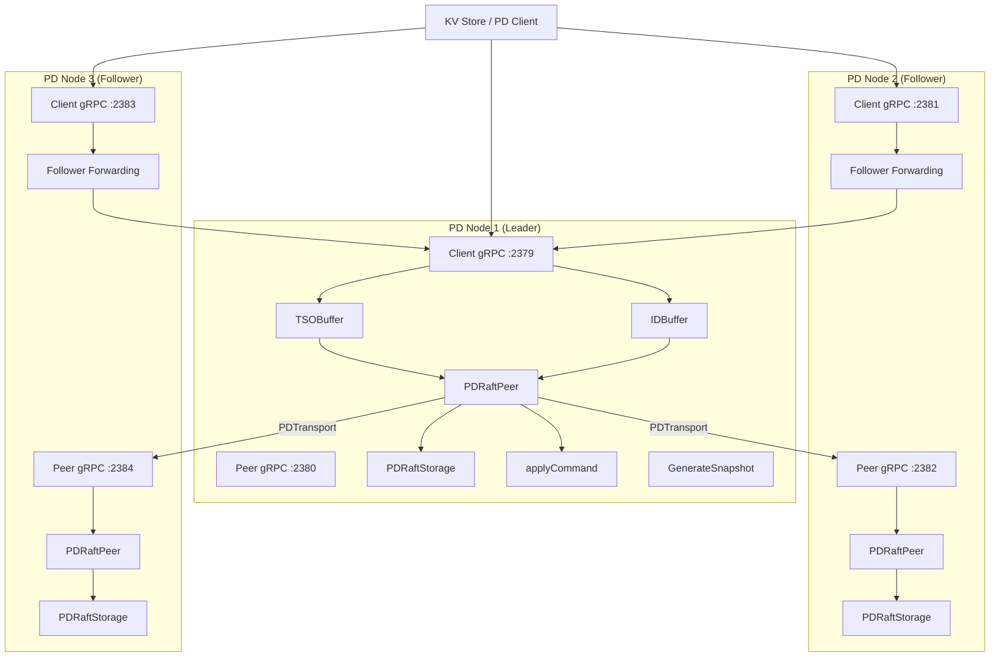
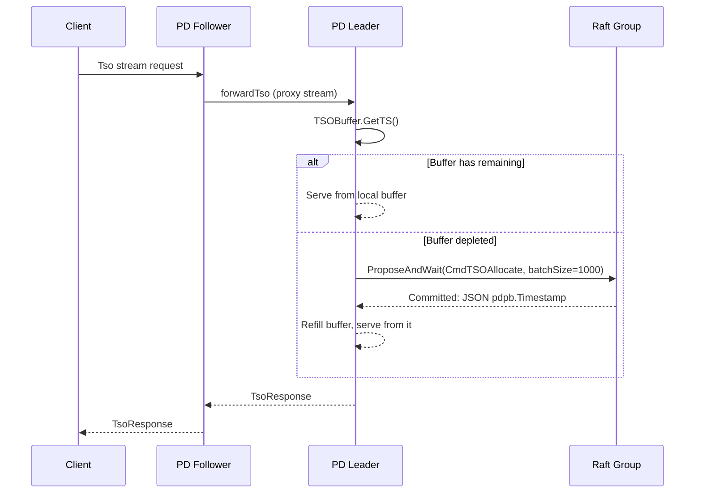
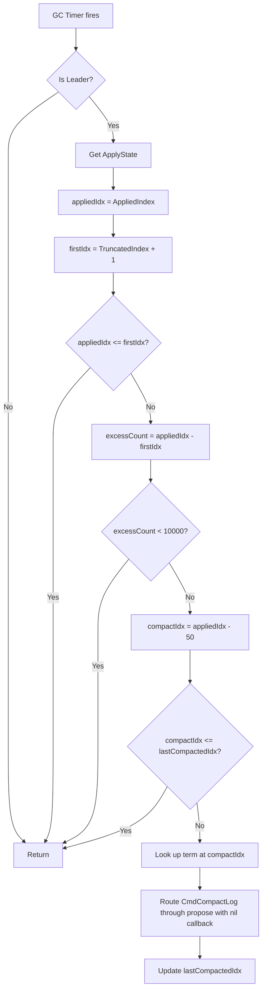

# 08 PD Raft Replication

## 1. Overview

The PD Raft replication feature adds high availability (HA) to the Placement Driver by replicating all PD state mutations through a single Raft consensus group. This is fundamentally different from the per-region Raft groups used in the KV store layer (`internal/raftstore/`): the PD cluster forms **one Raft group** covering the entire PD state machine (metadata, TSO, ID allocator, GC safe point, move tracker).

Key design decisions:

- **Single Raft group**: All PD nodes participate in one Raft group. The leader handles all writes by proposing `PDCommand` entries; followers forward client requests to the leader.
- **Backward compatibility**: When `PDServerConfig.RaftConfig` is `nil`, the server operates in single-node mode with no Raft overhead. All existing single-node behavior is preserved.
- **Buffered allocation**: TSO and ID allocation use local buffers (`TSOBuffer`, `IDBuffer`) that amortize the cost of Raft consensus by pre-allocating batches.
- **Follower forwarding**: Followers transparently proxy both unary RPCs and bidirectional streams to the current leader using cached gRPC connections.

## 2. Architecture Diagram



## 3. File Inventory

| File Path | Description |
|-----------|-------------|
| `internal/pd/command.go` | PDCommand type definitions, 12 command constants, Marshal/Unmarshal wire format |
| `internal/pd/raft_storage.go` | `PDRaftStorage` implementing `raft.Storage`, Pebble-backed persistence with in-memory cache |
| `internal/pd/raft_peer.go` | `PDRaftPeer` event loop, proposal handling, leader change detection, log GC |
| `internal/pd/apply.go` | `applyCommand` switch over 12 command types against PD state machine |
| `internal/pd/snapshot.go` | `PDSnapshot` struct, `GenerateSnapshot` and `ApplySnapshot` for full state transfer |
| `internal/pd/transport.go` | `PDTransport` for inter-PD gRPC Raft message delivery with lazy connection pool |
| `internal/pd/peer_service.go` | Hand-coded gRPC service descriptor for `pd.PDPeer/SendPDRaftMessage` |
| `internal/pd/forward.go` | Leader forwarding for 7 unary RPCs and 2 streaming RPCs, cached leader connection |
| `internal/pd/tso_buffer.go` | `TSOBuffer` for batched TSO allocation via Raft |
| `internal/pd/id_buffer.go` | `IDBuffer` for batched ID allocation via Raft |
| `internal/pd/server.go` *(modified)* | `PDServerRaftConfig`, new Raft fields in `PDServer`, `initRaft`, `startRaft`, `replayRaftLog`, 3-way RPC routing |
| `cmd/gookv-pd/main.go` *(modified)* | New CLI flags: `--pd-id`, `--initial-cluster`, `--peer-port`, `--client-cluster` |
| `pkg/pdclient/client.go` *(modified)* | `discoverLeader()` via `GetMembers`, enhanced `reconnect()` with leader discovery |

## 4. PDCommand (`command.go`)

### Command Types

| Constant | Value | Payload Fields | Target Sub-component |
|----------|-------|---------------|---------------------|
| `CmdSetBootstrapped` | 1 | `Bootstrapped *bool`, `Store *metapb.Store`, `Region *metapb.Region` | `MetadataStore` |
| `CmdPutStore` | 2 | `Store *metapb.Store` | `MetadataStore` |
| `CmdPutRegion` | 3 | `Region *metapb.Region`, `Leader *metapb.Peer` | `MetadataStore` |
| `CmdUpdateStoreStats` | 4 | `StoreID uint64`, `StoreStats *pdpb.StoreStats` | `MetadataStore` |
| `CmdSetStoreState` | 5 | `StoreID uint64`, `StoreState *StoreState` | `MetadataStore` |
| `CmdTSOAllocate` | 6 | `TSOBatchSize int` | `TSOAllocator` |
| `CmdIDAlloc` | 7 | `IDBatchSize int` | `IDAllocator` |
| `CmdUpdateGCSafePoint` | 8 | `GCSafePoint uint64` | `GCSafePointManager` |
| `CmdStartMove` | 9 | `MoveRegionID uint64`, `MoveSourcePeer *metapb.Peer`, `MoveTargetStoreID uint64` | `MoveTracker` |
| `CmdAdvanceMove` | 10 | `MoveRegionID uint64`, `AdvanceRegion *metapb.Region`, `AdvanceLeader *metapb.Peer` | `MoveTracker` |
| `CmdCleanupStaleMove` | 11 | `CleanupTimeout time.Duration` | `MoveTracker` |
| `CmdCompactLog` | 12 | `CompactIndex uint64`, `CompactTerm uint64` | `PDRaftStorage` |

### PDCommand Struct

```go
type PDCommand struct {
    Type PDCommandType `json:"type"`

    Bootstrapped      *bool            `json:"bootstrapped,omitempty"`
    Store             *metapb.Store    `json:"store,omitempty"`
    Region            *metapb.Region   `json:"region,omitempty"`
    Leader            *metapb.Peer     `json:"leader,omitempty"`
    StoreStats        *pdpb.StoreStats `json:"store_stats,omitempty"`
    StoreID           uint64           `json:"store_id,omitempty"`
    StoreState        *StoreState      `json:"store_state,omitempty"`
    TSOBatchSize      int              `json:"tso_batch_size,omitempty"`
    IDBatchSize       int              `json:"id_batch_size,omitempty"`
    GCSafePoint       uint64           `json:"gc_safe_point,omitempty"`
    MoveRegionID      uint64           `json:"move_region_id,omitempty"`
    MoveSourcePeer    *metapb.Peer     `json:"move_source_peer,omitempty"`
    MoveTargetStoreID uint64           `json:"move_target_store_id,omitempty"`
    AdvanceRegion     *metapb.Region   `json:"advance_region,omitempty"`
    AdvanceLeader     *metapb.Peer     `json:"advance_leader,omitempty"`
    CleanupTimeout    time.Duration    `json:"cleanup_timeout,omitempty"`
    CompactIndex      uint64           `json:"compact_index,omitempty"`
    CompactTerm       uint64           `json:"compact_term,omitempty"`
}
```

### Wire Format

Each command is serialized as `[1-byte type prefix] + [JSON payload]`. The type prefix byte is authoritative and overrides any `type` field in the JSON.

```go
func (c *PDCommand) Marshal() ([]byte, error)
func UnmarshalPDCommand(data []byte) (PDCommand, error)
```

`UnmarshalPDCommand` rejects data shorter than 2 bytes or with an unknown type byte (outside `[1, 12]`).

## 5. PDRaftStorage (`raft_storage.go`)

`PDRaftStorage` implements the `raft.Storage` interface from `go.etcd.io/etcd/raft/v3`. It is modeled on `PeerStorage` in `internal/raftstore/storage.go` but uses `clusterID` instead of `regionID` for Pebble key construction.

### Struct Definition

```go
type PDRaftStorage struct {
    mu sync.RWMutex

    clusterID          uint64
    engine             traits.KvEngine
    hardState          raftpb.HardState
    applyState         raftstore.ApplyState
    entries            []raftpb.Entry
    persistedLastIndex uint64

    snapGenFunc func() ([]byte, error)
}
```

### Key Methods

| Method | Description |
|--------|-------------|
| `InitialState() (raftpb.HardState, raftpb.ConfState, error)` | Returns the persisted hard state. Always returns empty `ConfState`. |
| `Entries(lo, hi, maxSize uint64) ([]raftpb.Entry, error)` | Returns entries in `[lo, hi)`, first trying in-memory cache, then falling back to engine reads. Capped at `maxSize` bytes. |
| `Term(i uint64) (uint64, error)` | Returns term for index `i`. Handles `TruncatedIndex` specially. Cache then engine fallback. |
| `LastIndex() (uint64, error)` | Returns the index of the last entry (from cache or `persistedLastIndex`). |
| `FirstIndex() (uint64, error)` | Returns `TruncatedIndex + 1`. |
| `Snapshot() (raftpb.Snapshot, error)` | Generates a snapshot using `snapGenFunc` if set. Snapshot metadata uses `AppliedIndex`. |
| `CreateSnapshot` | Not present -- snapshot generation is delegated to `snapGenFunc`. |
| `SaveReady(rd raft.Ready) error` | Atomically persists hard state and entries via `WriteBatch`. Updates in-memory cache and `persistedLastIndex`. |
| `RecoverFromEngine() error` | Restores hard state from engine. Scans all Raft log entries, rebuilds cache (capped at 1024 entries). |
| `DeleteEntriesTo(endIdx uint64) error` | Deletes persisted entries in `[0, endIdx)` using `engine.DeleteRange`. |
| `CompactTo(compactTo uint64)` | Trims the in-memory cache, removing entries before `compactTo`. |
| `SetSnapshotGenFunc(f func() ([]byte, error))` | Wires the snapshot generation callback (set by `PDServer.initRaft`). |
| `SetDummyEntry()` | Adds a dummy entry at index 0 / term 0 for fresh bootstrap, matching `MemoryStorage` convention. |
| `SetApplyState(state raftstore.ApplyState)` | Updates the apply state (applied index, truncated index/term). |
| `GetApplyState() raftstore.ApplyState` | Returns the current apply state. |

### Pebble Key Construction

Entries are stored in `CF_RAFT` column family using the key functions from `pkg/keys`:

- **Hard state key**: `keys.RaftStateKey(clusterID)`
- **Log entry key**: `keys.RaftLogKey(clusterID, index)`
- **Log entry range**: `keys.RaftLogKeyRange(clusterID)` (for iteration during recovery)

### In-Memory Cache

The cache holds up to 1024 entries (the most recent). `appendToCache` handles overlap by truncating existing entries that conflict with new ones.

## 6. PDRaftPeer (`raft_peer.go`)

### PDRaftConfig

```go
type PDRaftConfig struct {
    RaftTickInterval      time.Duration
    ElectionTimeoutTicks  int
    HeartbeatTicks        int
    MaxInflightMsgs       int
    MaxSizePerMsg         uint64
    MailboxCapacity       int
    RaftLogGCTickInterval time.Duration
    RaftLogGCCountLimit   uint64
    RaftLogGCThreshold    uint64
}
```

| Field | Default |
|-------|---------|
| `RaftTickInterval` | 100ms |
| `ElectionTimeoutTicks` | 10 |
| `HeartbeatTicks` | 2 |
| `MaxInflightMsgs` | 256 |
| `MaxSizePerMsg` | 1 MiB (1 << 20) |
| `MailboxCapacity` | 256 |
| `RaftLogGCTickInterval` | 60s |
| `RaftLogGCCountLimit` | 10000 |
| `RaftLogGCThreshold` | 50 |

### PDRaftPeer Struct

```go
type PDRaftPeer struct {
    nodeID    uint64
    rawNode   *raft.RawNode
    storage   *PDRaftStorage
    peerAddrs map[uint64]string

    Mailbox chan PDRaftMsg

    sendFunc          func([]raftpb.Message)
    pendingProposals  []func([]byte, error)  // FIFO slice; propose() appends, handleReady() dequeues
    applyFunc         func(PDCommand) ([]byte, error)
    applySnapshotFunc func([]byte) error
    leaderChangeFunc  func(isLeader bool)

    isLeader atomic.Bool
    leaderID atomic.Uint64
    stopped  atomic.Bool

    lastCompactedIdx uint64
    cfg              PDRaftConfig
}
```

### Mailbox Message Types

```go
type PDRaftMsgType int

const (
    PDRaftMsgTypeRaftMessage PDRaftMsgType = iota  // carries *raftpb.Message
    PDRaftMsgTypeProposal                           // carries *PDProposal
)

type PDRaftMsg struct {
    Type PDRaftMsgType
    Data interface{}
}

type PDProposal struct {
    Command  PDCommand
    Callback func([]byte, error)
}
```

### Run() Event Loop

The `Run(ctx context.Context)` method is the main event loop, blocking until context cancellation or the peer is stopped. It uses a `select` over three channels:

1. **Raft tick timer** (`ticker.C`): Calls `rawNode.Tick()` every `RaftTickInterval`.
2. **Mailbox** (`p.Mailbox`): Receives `PDRaftMsg` from transport (Raft messages) and from `ProposeAndWait` (proposals).
3. **GC timer** (`gcTickerCh`): Fires every `RaftLogGCTickInterval` (default 60s). Calls `onRaftLogGCTick()`. Disabled if interval is 0.

After every `select` case, `handleReady()` is called to process any pending Raft state.

### handleReady (7 Steps)

1. **Update leader status** from `SoftState`: Compare `rd.SoftState.Lead == nodeID` with previous `isLeader`. Fire `leaderChangeFunc` on transitions.
2. **Apply incoming snapshot** (step 1.5): If `rd.Snapshot` has data, call `applySnapshotFunc` and update `ApplyState` to match snapshot metadata.
3. **Persist entries and hard state**: Call `storage.SaveReady(rd)`.
4. **Send messages**: Dispatch `rd.Messages` via `sendFunc`.
5. **Apply committed entries**: For each committed entry:
   - Skip empty entries (leader election no-ops).
   - Skip `EntryConfChange` / `EntryConfChangeV2` entries.
   - Unmarshal `PDCommand`, call `applyFunc`, dequeue the next pending callback from the front of the FIFO slice (`pendingProposals[0]` / `pendingProposals = pendingProposals[1:]`). Nil callbacks are discarded.
   - Update `AppliedIndex` to the last committed entry.
6. **Advance**: Call `rawNode.Advance(rd)`.

### ProposeAndWait

```go
func (p *PDRaftPeer) ProposeAndWait(ctx context.Context, cmd PDCommand) ([]byte, error)
```

Returns `ErrNotLeader` if this peer is not the leader. Otherwise sends a `PDProposal` to the mailbox with a callback channel and blocks until the proposal is applied or the context is cancelled.

### Leader Change Callback

Set via `SetLeaderChangeFunc`. Called with `true` when this node becomes leader and `false` when it steps down. Used to reset `TSOBuffer` and `IDBuffer` so the new leader starts with fresh batches.

### onRaftLogGCTick

Leader-only. Evaluates whether the Raft log should be compacted:

1. Skip if not leader.
2. Calculate `excessCount = AppliedIndex - (TruncatedIndex + 1)`.
3. If `excessCount < RaftLogGCCountLimit` (10000), skip.
4. Compute `compactIdx = AppliedIndex - RaftLogGCThreshold` (50).
5. Skip if `compactIdx <= lastCompactedIdx`.
6. Look up the term at `compactIdx`, route `CmdCompactLog` through `propose()` with nil callback (fire-and-forget). Routing through `propose()` instead of calling `rawNode.Propose()` directly keeps the FIFO pendingProposals queue aligned.

## 7. Apply (`apply.go`)

```go
func (s *PDServer) applyCommand(cmd PDCommand) ([]byte, error)
```

Applies a single `PDCommand` to the server's in-memory state. The function contains a `switch` over all 12 command types:

| Command | Apply Logic | Returns Result? |
|---------|------------|-----------------|
| `CmdSetBootstrapped` | `s.meta.SetBootstrapped(*cmd.Bootstrapped)` + `PutStore(cmd.Store)` + `PutRegion(cmd.Region, cmd.Leader)` if present (atomic bootstrap) | No |
| `CmdPutStore` | `s.meta.PutStore(cmd.Store)` | No |
| `CmdPutRegion` | `s.meta.PutRegion(cmd.Region, cmd.Leader)` | No |
| `CmdUpdateStoreStats` | `s.meta.UpdateStoreStats(cmd.StoreID, cmd.StoreStats)` | No |
| `CmdSetStoreState` | `s.meta.SetStoreState(cmd.StoreID, *cmd.StoreState)` | No |
| `CmdTSOAllocate` | `s.tso.Allocate(cmd.TSOBatchSize)` | Yes: JSON-encoded `pdpb.Timestamp` |
| `CmdIDAlloc` | Calls `s.idAlloc.Alloc()` `batchSize` times | Yes: 8-byte big-endian last allocated ID |
| `CmdUpdateGCSafePoint` | `s.gcMgr.UpdateSafePoint(cmd.GCSafePoint)` | Yes: 8-byte big-endian new safe point |
| `CmdStartMove` | `s.moveTracker.StartMove(...)` | No |
| `CmdAdvanceMove` | `s.moveTracker.Advance(...)` | No |
| `CmdCleanupStaleMove` | `s.moveTracker.CleanupStale(cmd.CleanupTimeout)` | No |
| `CmdCompactLog` | Updates `TruncatedIndex`/`TruncatedTerm`, calls `CompactTo`, schedules background `DeleteEntriesTo` | No |

For `CmdCompactLog`, the apply function:
1. Checks if `cmd.CompactIndex <= as.TruncatedIndex` (already compacted, no-op).
2. Updates the apply state's `TruncatedIndex` and `TruncatedTerm`.
3. Calls `s.raftStorage.CompactTo(cmd.CompactIndex + 1)` to trim the in-memory cache.
4. Launches `go s.raftStorage.DeleteEntriesTo(cmd.CompactIndex + 1)` as a background goroutine.

## 8. Snapshot (`snapshot.go`)

### PDSnapshot Struct

```go
type PDSnapshot struct {
    Bootstrapped       bool                        `json:"bootstrapped"`
    Stores             map[uint64]*metapb.Store    `json:"stores"`
    Regions            map[uint64]*metapb.Region   `json:"regions"`
    Leaders            map[uint64]*metapb.Peer     `json:"leaders"`
    StoreStats         map[uint64]*pdpb.StoreStats `json:"store_stats"`
    StoreStates        map[uint64]StoreState       `json:"store_states"`
    NextID             uint64                      `json:"next_id"`
    TSOState           TSOSnapshotState            `json:"tso_state"`
    GCSafePoint        uint64                      `json:"gc_safe_point"`
    PendingMoves       map[uint64]*PendingMove     `json:"pending_moves"`
    StoreLastHeartbeat map[uint64]int64            `json:"store_last_heartbeat"`
}

type TSOSnapshotState struct {
    Physical int64 `json:"physical"`
    Logical  int64 `json:"logical"`
}
```

`StoreLastHeartbeat` stores Unix nanosecond timestamps (as `int64`) so that `time.Time` values survive JSON round-trips. `GenerateSnapshot` converts `time.Time` to `int64` via `UnixNano()`, and `ApplySnapshot` converts back via `time.Unix(0, v)`.

### GenerateSnapshot

```go
func (s *PDServer) GenerateSnapshot() ([]byte, error)
```

Captures all mutable PD state by acquiring read locks on each sub-component in sequence:

1. **MetadataStore** (`s.meta.mu.RLock()`): Deep-copies `bootstrapped`, `stores`, `regions`, `leaders`, `storeStats`, `storeStates`, and `storeLastHeartbeat` (converting `time.Time` to `int64` Unix nanos).
2. **TSOAllocator** (`s.tso.mu.Lock()`): Copies `physical` and `logical`.
3. **IDAllocator** (`s.idAlloc.mu.Lock()`): Copies `nextID`.
4. **GCSafePointManager** (`s.gcMgr.mu.Lock()`): Copies `safePoint`.
5. **MoveTracker** (`s.moveTracker.mu.Lock()`): Deep-copies `moves`.

Returns JSON-encoded `PDSnapshot`.

### ApplySnapshot

```go
func (s *PDServer) ApplySnapshot(data []byte) error
```

Replaces the PD server's in-memory state with the snapshot data. Acquires write locks on each sub-component and replaces map fields, nil-checking to ensure maps are initialized. Converts `StoreLastHeartbeat` `int64` values back to `time.Time` via `time.Unix(0, v)`.

## 9. Transport (`transport.go`)

### PDTransport Struct

```go
type PDTransport struct {
    mu    sync.RWMutex
    conns map[uint64]*grpc.ClientConn // peerID -> connection
    addrs map[uint64]string           // peerID -> peer address
}
```

### Send

```go
func (t *PDTransport) Send(peerID uint64, msg raftpb.Message) error
```

1. Obtains (or lazily creates) a gRPC connection to the target peer via `getOrCreateConn`.
2. Converts `raftpb.Message` to `eraftpb.Message` using `raftstore.RaftpbToEraftpb`.
3. Wraps in `raft_serverpb.RaftMessage` with **`RegionId=0`** as the PD sentinel value (distinguishing PD Raft traffic from KV store Raft traffic).
4. Invokes the unary RPC `/pd.PDPeer/SendPDRaftMessage` with a 5-second timeout.
5. On failure, closes the stale connection via `closeConn` so it will be re-created on the next send.

### Lazy Connection Pool (getOrCreateConn)

Uses a double-checked locking pattern:
1. **Fast path**: `RLock` + map lookup.
2. **Slow path**: `Lock` + double-check + `grpc.NewClient` with insecure credentials and keepalive parameters (`Time=60s`, `Timeout=10s`, `PermitWithoutStream=false`).

### WireTransport on PDRaftPeer

`PDRaftPeer.WireTransport(transport)` sets up `sendFunc` to route messages through the transport. Messages addressed to the local node are delivered directly to the peer's own mailbox (bypassing the network).

## 10. Peer gRPC Service (`peer_service.go`)

### Service Interface

```go
type PDPeerServiceServer interface {
    SendPDRaftMessage(ctx context.Context, req *raft_serverpb.RaftMessage) (*raft_serverpb.RaftMessage, error)
}
```

### Handler

`PDPeerService.SendPDRaftMessage` receives a `RaftMessage`, converts the embedded `eraftpb.Message` to `raftpb.Message` using `raftstore.EraftpbToRaftpb`, and delivers it to the local peer's `Mailbox` channel. If the mailbox is full, the message is dropped with a warning log.

### Hand-Coded Service Descriptor

Instead of using protoc-generated code, the service descriptor is defined manually:

```go
var _PDPeer_serviceDesc = grpc.ServiceDesc{
    ServiceName: "pd.PDPeer",
    HandlerType: (*PDPeerServiceServer)(nil),
    Methods: []grpc.MethodDesc{
        {
            MethodName: "SendPDRaftMessage",
            Handler:    _PDPeerService_SendPDRaftMessage_Handler,
        },
    },
    Streams:  []grpc.StreamDesc{},
    Metadata: "pd_peer.proto",
}
```

Registration:

```go
func RegisterPDPeerService(srv *grpc.Server, peer *PDRaftPeer)
```

## 11. Follower Forwarding (`forward.go`)

### getLeaderClient

```go
func (s *PDServer) getLeaderClient() (pdpb.PDClient, error)
```

Maintains a cached gRPC connection to the current Raft leader:

1. Locks `s.leaderConnMu`.
2. Gets `leaderID` from `s.raftPeer.LeaderID()`. Returns `codes.Unavailable` if 0.
3. Reuses cached connection if `s.cachedLeaderID == leaderID`.
4. On leader change: closes old connection, looks up the leader's client address from `s.raftCfg.ClientAddrs`, creates new connection via `grpc.NewClient`.

### Unary Forwarders

| Method | Forwards |
|--------|----------|
| `forwardBootstrap(ctx, req)` | `client.Bootstrap(ctx, req)` |
| `forwardPutStore(ctx, req)` | `client.PutStore(ctx, req)` |
| `forwardAllocID(ctx, req)` | `client.AllocID(ctx, req)` |
| `forwardUpdateGCSafePoint(ctx, req)` | `client.UpdateGCSafePoint(ctx, req)` |
| `forwardStoreHeartbeat(ctx, req)` | `client.StoreHeartbeat(ctx, req)` |
| `forwardAskBatchSplit(ctx, req)` | `client.AskBatchSplit(ctx, req)` |
| `forwardReportBatchSplit(ctx, req)` | `client.ReportBatchSplit(ctx, req)` |

### Streaming Forwarders

| Method | Forwards |
|--------|----------|
| `forwardTso(stream)` | Proxies `PD_TsoServer` <-> leader `PD_TsoClient` |
| `forwardRegionHeartbeat(stream)` | Proxies `PD_RegionHeartbeatServer` <-> leader `PD_RegionHeartbeatClient` |

Both streaming forwarders use the same bidirectional proxy pattern:

1. Open a stream to the leader.
2. Loop: `Recv` from client stream -> `Send` to leader stream -> `Recv` from leader stream -> `Send` to client stream.
3. On client close, call `CloseSend` on leader stream.

### 3-Way RPC Routing Pattern

Every write RPC handler in `PDServer` follows this pattern:

```mermaid
flowchart TD
    A[RPC Handler called] --> B{raftPeer == nil?}
    B -- Yes --> C[Single-node: direct execution]
    B -- No --> D{raftPeer.IsLeader()?}
    D -- No --> E[Follower: forward to leader]
    D -- Yes --> F[Leader: propose via Raft / use buffer]
```

Read-only RPCs (`IsBootstrapped`, `GetStore`, `GetAllStores`, `GetRegion`, `GetRegionByID`, `GetGCSafePoint`) are served directly from local state on any node (leader or follower), since Raft replication keeps all nodes converged.

## 12. Buffered Allocation (`tso_buffer.go`, `id_buffer.go`)

### TSOBuffer

```go
const tsoBatchSize = 1000

type TSOBuffer struct {
    mu       sync.Mutex
    physical int64
    logical  int64
    remain   int
    raftPeer *PDRaftPeer
}
```

**GetTS flow**:
1. Lock mutex.
2. If `remain < count`, call `refill(ctx, max(tsoBatchSize, count))`.
3. `refill` proposes `CmdTSOAllocate` via `raftPeer.ProposeAndWait`, receives JSON-encoded `pdpb.Timestamp` (upper bound).
4. Sets buffer: `physical = ts.Physical`, `logical = ts.Logical - batchSize`, `remain = batchSize`.
5. Serve from local buffer: `logical += count`, `remain -= count`.

**Reset**: Called on leader change. Zeroes `physical`, `logical`, `remain`.

### IDBuffer

```go
const idBatchSize = 100

type IDBuffer struct {
    mu       sync.Mutex
    nextID   uint64
    endID    uint64 // exclusive upper bound
    raftPeer *PDRaftPeer
}
```

**Alloc flow**:
1. Lock mutex.
2. If `nextID >= endID`, call `refill(ctx)`.
3. `refill` proposes `CmdIDAlloc` with `IDBatchSize=100` via `raftPeer.ProposeAndWait`, receives 8-byte big-endian last allocated ID.
4. Sets buffer: `nextID = lastID - batchSize + 1`, `endID = lastID + 1`.
5. Return `nextID`, increment `nextID`.

**Reset**: Called on leader change. Zeroes `nextID`, `endID`.

### TSO Allocation via Follower (Sequence)



## 13. Log Compaction

### onRaftLogGCTick

Leader-only, fires every 60 seconds (configurable via `RaftLogGCTickInterval`).



### CmdCompactLog Apply

When `CmdCompactLog` is applied:

1. If `cmd.CompactIndex <= as.TruncatedIndex`, no-op (already compacted).
2. Update `as.TruncatedIndex = cmd.CompactIndex`.
3. Update `as.TruncatedTerm = cmd.CompactTerm`.
4. Call `s.raftStorage.SetApplyState(as)`.
5. Call `s.raftStorage.CompactTo(cmd.CompactIndex + 1)` -- trims in-memory cache.
6. Launch `go s.raftStorage.DeleteEntriesTo(cmd.CompactIndex + 1)` -- background physical deletion from Pebble via `DeleteRange`.

The `DeleteEntriesTo` method deletes entries in `[0, endIdx)` using `engine.DeleteRange(cfnames.CFRaft, startKey, endKey)`.

## 14. PDServer Integration (`server.go`)

### PDServerRaftConfig

```go
type PDServerRaftConfig struct {
    PDNodeID             uint64            // this node's Raft ID
    InitialCluster       map[uint64]string // peerID -> peer gRPC address
    PeerAddr             string            // listen address for peer-to-peer gRPC
    ClientAddrs          map[uint64]string // peerID -> client gRPC address (for forwarding)
    RaftTickInterval     time.Duration
    ElectionTimeoutTicks int
    HeartbeatTicks       int
}
```

### New PDServer Fields

```go
// Raft replication (nil in single-node mode).
raftPeer       *PDRaftPeer
raftStorage    *PDRaftStorage
transport      *PDTransport
raftCfg        *PDServerRaftConfig
raftEngine     traits.KvEngine      // dedicated engine for PD Raft logs
peerGrpcServer *grpc.Server         // separate gRPC server for peer port
peerListener   net.Listener

// Buffered allocators (non-nil only in Raft mode).
tsoBuffer *TSOBuffer
idBuffer  *IDBuffer

// Leader forwarding (cached connection to current leader for follower forwarding).
leaderConnMu     sync.Mutex
cachedLeaderConn *grpc.ClientConn
cachedLeaderID   uint64
```

### initRaft

`initRaft(rc *PDServerRaftConfig) error` is called from `NewPDServer` when `cfg.RaftConfig != nil`. Steps:

1. **Open dedicated Pebble engine** at `<DataDir>/raft`.
2. **Create `PDRaftStorage`** with `clusterID` and the raft engine.
3. **Build `PDRaftConfig`** from defaults, overriding tick interval, election timeout, and heartbeat ticks from `rc`.
4. **Bootstrap vs recover**: Check `HasPersistedPDRaftState(engine, clusterID)`. If restart, call `RecoverFromEngine()` and pass `nil` peers to `NewPDRaftPeer`. If fresh, build `[]raft.Peer` from `InitialCluster` keys.
5. **Create `PDRaftPeer`** via `NewPDRaftPeer`.
6. **Create `PDTransport`** and call `peer.WireTransport(transport)`.
7. **Wire callbacks**: `peer.SetApplyFunc(s.applyCommand)`, `peer.SetApplySnapshotFunc(s.ApplySnapshot)`, `storage.SetSnapshotGenFunc(s.GenerateSnapshot)`.
8. **Initialize buffers**: Create `TSOBuffer` and `IDBuffer`, set `peer.SetLeaderChangeFunc` to reset both buffers on leader change.
9. **Replay Raft log** on restart: Call `s.replayRaftLog()`.

### startRaft

`startRaft() error` is called from `Start()` when `s.raftPeer != nil`. Steps:

1. Listen on `raftCfg.PeerAddr` for peer-to-peer gRPC.
2. Create a new `grpc.Server`, register `PDPeerService` via `RegisterPDPeerService`.
3. Serve the peer gRPC server in a goroutine.
4. Run the Raft event loop (`s.raftPeer.Run(s.ctx)`) in a goroutine.

### replayRaftLog

`replayRaftLog() error` rebuilds in-memory state after restart:

1. Gets `AppliedIndex` and `LastIndex` from storage.
2. If `appliedIndex >= lastIndex`, no entries to replay.
3. Reads entries from `[appliedIndex+1, lastIndex+1)`.
4. For each entry: skips empty entries and conf changes, unmarshals `PDCommand`, calls `s.applyCommand`.
5. Updates `AppliedIndex = lastIndex`.

### 3-Way RPC Routing

All write RPC handlers follow the pattern shown in section 11. For example, `Bootstrap`:

1. If `raftPeer == nil` -> direct single-node execution.
2. If `!raftPeer.IsLeader()` -> `forwardBootstrap(ctx, req)`.
3. Otherwise (leader) -> validate, then `raftPeer.ProposeAndWait(ctx, cmd)`. Bootstrap uses a single `CmdSetBootstrapped` proposal with `Store` and `Region` fields included for atomic bootstrap.

### Enhanced GetMembers

```go
func (s *PDServer) GetMembers(ctx context.Context, req *pdpb.GetMembersRequest) (*pdpb.GetMembersResponse, error)
```

- **Single-node mode** (`raftCfg == nil`): Returns a single member with `ClientUrls` set to the local listen address.
- **Raft mode**: Iterates `raftCfg.ClientAddrs` to build a `[]*pdpb.Member` list. Each member includes `Name` (format `gookv-pd-{id}`), `MemberId`, `ClientUrls` (from `ClientAddrs`), and `PeerUrls` (from `InitialCluster`). Sets `Leader` to the member matching `raftPeer.LeaderID()`.

## 15. PD Client Changes (`pdclient/client.go`)

### discoverLeader

```go
func (c *grpcClient) discoverLeader() string
```

Queries `GetMembers` on the current connection with a 2-second timeout. Extracts the leader's first `ClientUrl`, strips `http://` or `https://` scheme prefix, and returns the bare `host:port`. Returns empty string on any failure.

### Enhanced reconnect

```go
func (c *grpcClient) reconnect() error
```

Two-phase reconnection strategy:

1. **Leader discovery**: Calls `discoverLeader()` on the current (possibly stale) connection. If a leader address is found, dials it directly with a 5-second timeout.
2. **Fallback round-robin**: If leader discovery fails, iterates all endpoints starting from `(currentIdx + 1)`, attempting each with a 5-second timeout.

### Multi-Endpoint Support

The `Config.Endpoints` field accepts multiple PD addresses. During `NewClient`, the client tries each endpoint in order until one connects. The `withRetry` method handles automatic reconnection with exponential backoff (base interval from config, capped at 5 seconds).

## 16. E2E Test Coverage

All tests are in `e2e/pd_replication_test.go`.

| Test Name | Description |
|-----------|-------------|
| `TestPDReplication_LeaderElection` | Starts 3 PD nodes, verifies exactly one leader is elected |
| `TestPDReplication_WriteForwarding` | PutStore on a follower is forwarded to leader and visible on all nodes |
| `TestPDReplication_Bootstrap` | Bootstrap via any node makes IsBootstrapped true on all nodes |
| `TestPDReplication_TSOMonotonicity` | 100 consecutive GetTS calls produce strictly increasing timestamps |
| `TestPDReplication_LeaderFailover` | Stop leader, verify new leader elected within 15s, operations continue |
| `TestPDReplication_SingleNodeCompat` | Single PD without RaftConfig maintains backward-compatible behavior |
| `TestPDReplication_IDAllocMonotonicity` | 50 consecutive AllocID calls return unique, strictly increasing IDs |
| `TestPDReplication_GCSafePoint` | UpdateGCSafePoint on one node visible on all nodes |
| `TestPDReplication_RegionHeartbeat` | Region heartbeat replicated to all nodes, verified via GetRegionByID |
| `TestPDReplication_AskBatchSplit` | Split ID allocation returns unique region/peer IDs in replicated mode |
| `TestPDReplication_ConcurrentWritesFromMultipleClients` | 3 clients on different nodes concurrently AllocID, all 30 IDs unique |
| `TestPDReplication_TSOViaFollower` | TSO via follower-only client, 10 calls strictly increasing |
| `TestPDReplication_TSOViaFollowerForwarding` | TSO via follower streaming proxy, 20 calls strictly increasing |
| `TestPDReplication_RegionHeartbeatViaFollower` | Region heartbeat via follower forwarded and visible on all nodes |
| `TestPDReplication_5NodeCluster` | 5-node cluster: leader election, PutStore, TSO, GetStore on all nodes |
| `TestPDReplication_CatchUpRecovery` | Stop node 3, write data, restart node 3, verify it catches up via Raft log replay |

Helper functions: `getFreeAddr`, `startPDCluster`, `newPDClusterClient`, `waitForLeader`, `findLeaderIndex`, `bootstrapCluster`.
