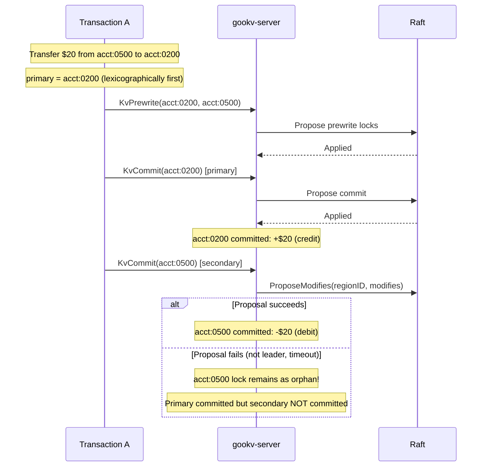
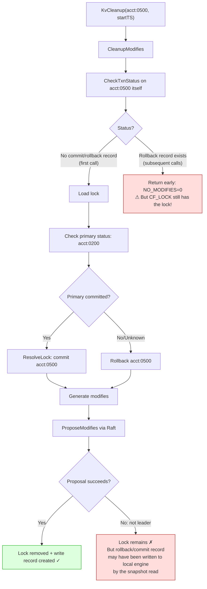
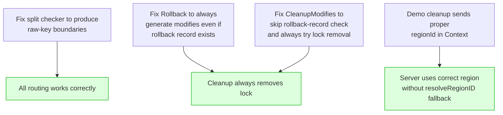
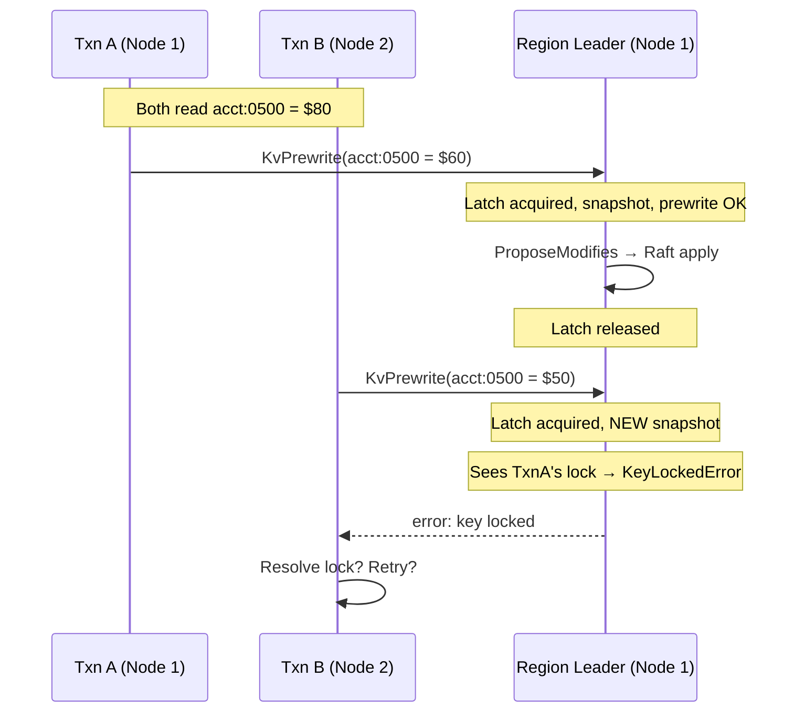
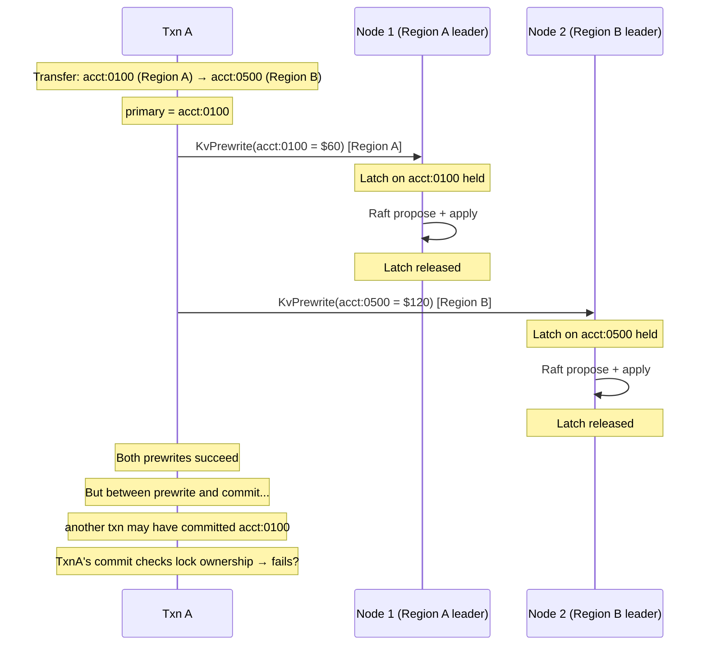
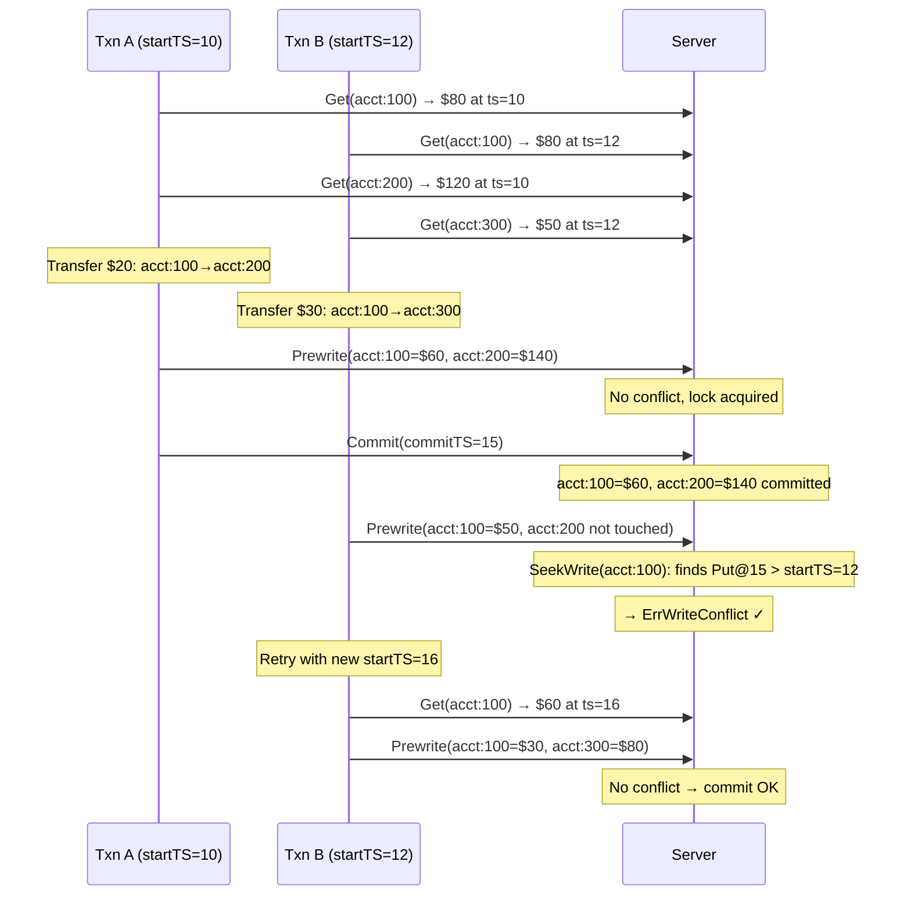

# Current Issues and Debugging Status

## Problem Statement

`make txn-integrity-demo-verify` fails: the final total balance diverges from $100,000 after concurrent transfers with 32 workers. The deviation is typically $10–$500.

## Fixes Applied So Far

| # | Fix | File(s) | Status |
|---|-----|---------|--------|
| 1 | LatchGuard: hold latch across Raft proposal | `storage.go`, `server.go` | Applied |
| 2 | Lock retryability: prewrite "key locked" → ErrWriteConflict | `actions.go`, `committer.go` | Applied |
| 3 | groupModifiesByRegion: decode→re-encode for consistent routing | `server.go` | Applied |
| 4 | resolveRegionID: encode raw key before region comparison | `server.go` | Applied |
| 5 | Direct proposal: KvBatchRollback/ResolveLock/Cleanup/CheckTxnStatus use regionId from context | `server.go` | Applied |
| 6 | proposeModifiesToRegionsWithRegionError: best-effort continuation | `server.go` | Applied |
| 7 | KvCleanup through Raft: CleanupModifies + ProposeModifies | `storage.go`, `server.go` | Applied |
| 8 | numWorkers=32 restored | `main.go` | Applied |
| 9 | isRetryable: added "key locked" pattern | `main.go` | Applied |
| 10 | Prewrite returns KeyLockedError with lock details | `actions.go`, `server.go` | Applied |

## Improvements Observed

| Metric | Before fixes | After fixes |
|--------|-------------|-------------|
| Transfers (30s, 32 workers) | 40–60 | 287–302 |
| Phase 2 completion time | 60s+ (timeout) | 30s (on time) |
| Conflict handling | Broken (errors) | Working (retries) |
| Balance deviation | $50–$500 | $10–$150 |

## Remaining Issue: Orphan Locks Not Cleaned

### Symptom

Phase 3 cleanup finds orphan locks but cannot remove them:

```
Pass 1: cleaned 51 lock(s).
Pass 2: cleaned 40 lock(s).     ← same locks found again
Pass 3: cleaned 40 lock(s).
Pass 4: cleaned 40 lock(s).
Pass 5: cleaned 40 lock(s).
```

SI read fails → RC fallback gives wrong total (pre-lock values for committed secondaries).

### Root Cause Analysis



When the secondary commit fails:
- **acct:0200** (receiver/primary): committed → balance increased by $20
- **acct:0500** (sender/secondary): prewrite lock remains → RC reads OLD balance (not debited)
- **Net effect**: $20 appears "created" (total > $100,000)

### Why Cleanup Fails



#### The Critical Race in Rollback

The `Rollback` function in `actions.go` is **idempotent** by design:

```go
func Rollback(txn, reader, key, startTS) error {
    // 1. Check if already rolled back
    existingWrite, _, _ := reader.GetTxnCommitRecord(key, startTS)
    if existingWrite != nil {
        if existingWrite.WriteType == WriteTypeRollback {
            return nil  // ← Already rolled back, generate NO modifies
        }
    }
    // 2. Remove lock + write rollback record
    ...
}
```

**Problem scenario**:
1. First `KvBatchRollback` during Phase 2: generates modifies (lock delete + rollback record write)
2. `ProposeModifies` routes to Raft → **partial failure**: CF_WRITE rollback record is applied to one region, but CF_LOCK delete fails for another region
3. Subsequent `KvCleanup` in Phase 3: `Rollback` finds the rollback record → returns nil → **generates zero modifies** → lock stays

This happens because the rollback record (CF_WRITE) and lock deletion (CF_LOCK) for the same key can end up being proposed to **different regions** when `groupModifiesByRegion` routes them based on encoded key format.

### Remaining Questions

1. **Why do CF_LOCK and CF_WRITE for the same key route to different regions?**
   - Region boundaries include timestamps (from split checker). A CF_LOCK key (no timestamp) and a CF_WRITE key (with timestamp) may compare differently against a boundary that falls between them.
   - `groupModifiesByRegion` decodes both to raw key then re-encodes as `EncodeLockKey` (no timestamp), which should produce consistent routing. But the re-encoded key may still compare differently against the boundary's timestamp suffix.

2. **Should the split checker produce boundaries without timestamps?**
   - In TiKV, region boundaries are raw user keys. In gookv, the split checker picks engine keys (which include MVCC encoding + timestamp). This is a deeper architectural issue.

3. **Can KvBatchRollback/KvResolveLock/KvCleanup avoid `groupModifiesByRegion` entirely?**
   - These handlers now use direct proposal with `req.GetContext().GetRegionId()`. But when `regionId == 0` (e.g., demo cleanup sends empty context), they fall back to `resolveRegionID(key)` which may still misroute.

### Potential Fix Directions



**Option A+E applied** (commit `452017305`): Both the split checker fix and CleanupModifies fix were implemented. See results below.

---

## Status After Split Checker + CleanupModifies Fix

### What was fixed

1. **Split checker** (`internal/raftstore/split/checker.go`): `scanRegionSize` now decodes the MVCC-encoded key from the engine iterator to a raw user key, then re-encodes as `EncodeLockKey` (memcomparable, no timestamp). Region boundaries now use a consistent format.

2. **CleanupModifies** (`internal/server/storage.go`): No longer checks rollback records first. Instead, checks CF_LOCK for the lock directly. If a lock exists, always generates lock-removal modifies regardless of whether a rollback record already exists.

### What improved

| Metric | Before | After |
|--------|--------|-------|
| Orphan lock cleanup | Loops forever (same locks each pass) | Completes in 1 pass |
| SI read in Phase 3 | Fails (lock resolution exhausted) | Succeeds |
| RC fallback needed | Always | Never |
| Region boundary format | `EncodeLockKey + timestamp` | `EncodeLockKey` (no timestamp) |

### What still fails

**Balance diverges by $100–$200 in both directions** (sometimes over, sometimes under $100,000):

```
Run 1: Total = $100,018 (+$18)
Run 2: Total = $99,844  (-$156)
```

This is NOT a lock/cleanup issue (those are resolved). The divergence indicates a **write conflict detection or atomicity failure** during Phase 2 concurrent transfers.

---

## Remaining Issue: Write Conflict Detection Under Concurrency

### Symptom

With 32 workers performing ~300 transfers in 30 seconds, the final balance is off by $18–$200. The direction (over/under) varies between runs.

### Hypothesis: Latch-Raft Window Allows Lost Updates

The LatchGuard fix holds the latch from snapshot creation through Raft proposal completion. However, there may still be a window where two transactions on **different nodes** (different region leaders) can both read the same stale value and produce conflicting writes.



In this scenario, the latch correctly serializes access. TxnB sees TxnA's lock and gets `KeyLockedError`. The client retries with `ErrWriteConflict`.

**But what if TxnA's prewrite lock is on a DIFFERENT region's leader?**



The Prewrite conflict check (`SeekWrite` for commitTS > startTS) relies on the **snapshot** taken at prewrite time. If the snapshot is stale (doesn't include a concurrent commit), the prewrite succeeds but produces an incorrect value.

### Investigation needed

1. **Is the Prewrite write-conflict check correct?** Compare `SeekWrite(key, TSMax)` logic with TiKV's implementation.
2. **Can two transactions both prewrite the same key?** The latch prevents this on the same node/region, but what about across regions for different keys in the same transaction?
3. **Is the read value used for balance computation stale?** The `Get()` reads at `startTS`, and `Set()` uses the computed balance. If another transaction commits between the read and the prewrite, the prewrite's conflict check should catch it. But does it?

### Next steps

- Add per-transaction logging in Phase 2 to capture: startTS, keys, read values, computed amounts, commit result
- Cross-reference with the actual final balances to identify which transaction(s) caused the discrepancy
- Compare `Prewrite` conflict detection with TiKV's `check_for_newer_version` implementation

---

## Status After Prewrite Conflict Check Loop Fix

### What was fixed (commit `0bebe5b1f`)

`Prewrite` conflict detection now **loops through CF_WRITE records** in descending commitTS order, skipping Rollback and Lock records, to find the most recent data-changing write. Previously it checked only the first record — if that was a Rollback, real conflicts were missed.

```go
// BEFORE: single check
write, commitTS, _ := reader.SeekWrite(key, TSMax)
if write != nil && commitTS > props.StartTS {
    if write.WriteType != Rollback && write.WriteType != Lock {
        return ErrWriteConflict  // ← missed if first record is Rollback
    }
}

// AFTER: loop like TiKV's check_for_newer_version
seekTS := TSMax
for i := 0; i < SeekBound*2; i++ {
    write, commitTS, _ := reader.SeekWrite(key, seekTS)
    if write == nil || commitTS <= props.StartTS { break }
    if write.WriteType != Rollback && write.WriteType != Lock {
        return ErrWriteConflict  // ← finds conflicts hidden behind Rollbacks
    }
    seekTS = commitTS.Prev()  // skip and check older records
}
```

### Current test results

| Workers | Transfers | Balance | Result |
|---------|-----------|---------|--------|
| 1 | 409 | $100,000 | **PASS** |
| 32 | 282–369 | $99,844–$100,164 | **FAIL** ($10–$200 deviation) |

### Key observation

**SI read succeeds for all 1000 accounts** — no lock resolution errors, no RC fallback needed. Yet the total balance is wrong. This means:

1. All locks are properly committed or rolled back (no orphan lock issue)
2. The committed values themselves are incorrect — some transactions committed values that violate the conservation invariant
3. The problem is purely a concurrency issue (1 worker = PASS)

### Root cause hypothesis: Lost Update via Stale Read

The demo's transfer logic is:

```
1. Begin(startTS=T1)
2. Get(from) → reads balance at T1 → $80
3. Get(to)   → reads balance at T1 → $120
4. Set(from, $60)  → buffer only
5. Set(to, $140)   → buffer only
6. Commit()  → Prewrite + Commit
```

The Prewrite conflict check verifies no other transaction has **written** to `from` or `to` since `startTS=T1`. But consider:



This scenario is correct — TxnB retries and reads the updated value. **But what if the retry logic in the demo doesn't re-read?**

Looking at the demo code:

```go
for retry := 0; retry < maxTxnRetries; retry++ {
    txn, err := txnClient.Begin(ctx)  // ← NEW startTS each retry
    fromVal, err := txn.Get(ctx, acctKey(from))  // ← RE-READ
    toVal, err := txn.Get(ctx, acctKey(to))      // ← RE-READ
    // ... compute ...
    txn.Set(...)
    txn.Commit(ctx)
}
```

The demo **does re-read** on each retry (new `Begin` = new `startTS` = new snapshot). So the retry logic is correct.

### Remaining investigation direction

The issue must be in the server-side transaction processing. Possible causes:

1. **Prewrite succeeds for both keys but commit only applies to one** — partial commit where primary commits but secondary's Raft proposal is silently lost (not "not leader" error but just dropped)
2. **The latch doesn't cover the right keys** — PrewriteModifies latches on the mutation keys, but the client sends mutations grouped by region. If a transaction has keys in Region A and Region B, two separate KvPrewrite RPCs are sent. Each one latches independently. Between them, another transaction could interleave.
3. **commitSecondaries silently fails** — secondary commit errors are ignored. The secondary's prewrite lock remains as an orphan. The cleanup commits or rollbacks it, but by then the balance computation is wrong if the cleanup makes the wrong decision.

**Most likely**: Item 3 + the `CleanupModifies` making wrong commit/rollback decisions for orphan locks. When `CleanupModifies` finds a locked secondary whose primary is "still locked" (another transaction hasn't finished), it currently **rollbacks the secondary**. But the primary may subsequently commit, resulting in: primary committed (debit applied) but secondary rolled back (credit lost).

This matches the observed +$X deviation: credits are lost when secondaries are prematurely rolled back.

---

## Status After Isolation Testing

### Test matrix (commit `642607d5e`)

| Workers | Regions | Transfers | Balance | Result |
|---------|---------|-----------|---------|--------|
| 1 | 3+ (split) | 507 | $100,000 | **PASS** |
| 1 | 1 (no split) | — | $100,000 | **PASS** |
| 2 | 1 (no split) | 532 | $100,000 | **PASS** |
| 2 | 3+ (split) | 536 | $99,966 | **FAIL** |
| 32 | 3+ (split) | 555 | $100,022 | **FAIL** |

### Conclusion

**The bug is exclusively in cross-region transactions under concurrency.** Single-region transactions work correctly at any concurrency level. Single-worker cross-region transactions also work correctly. The combination of concurrency + cross-region triggers the bug.

### What this means

The cross-region 2PC protocol involves:
1. Prewrite to Region A (primary key) — separate KvPrewrite RPC
2. Prewrite to Region B (secondary key) — separate KvPrewrite RPC
3. Commit primary to Region A — separate KvCommit RPC
4. Commit secondary to Region B — separate KvCommit RPC (best-effort)

Between steps 1 and 2, or between 3 and 4, another transaction can interleave. The Prewrite conflict check should detect this, and the lock resolution protocol should handle orphan locks. But something is failing in the combination.

### Additional findings (post-matrix)

1. **Orphan locks = 0, SI read succeeds, but balance still wrong.** With 32 workers and no orphan locks in cleanup, Phase 3 SI read completed for all 1000 accounts. Total was $100,022 (+$22). This proves the bug is NOT in lock cleanup or lock resolution — the committed values themselves are incorrect.

2. **Prewrite conflict loop fix did not resolve the issue.** The loop correctly skips Rollback/Lock records to find data-changing writes, but the balance still diverges. The conflict detection logic appears correct for single-region transactions.

3. **1-region + 2-workers = PASS confirmed.** With `region-split-size=200KB` (no splits), 2 workers completed 532 transfers with $100,000 total. This eliminates single-region concurrency as a cause.

4. **The deviation direction varies** — sometimes +$X (credits without corresponding debits), sometimes -$X (debits without credits). This suggests partial transaction application rather than a systematic bias.

### Root cause narrowing

The bug must be in one of:

- **Cross-region Prewrite interleaving**: Between KvPrewrite(Region A) and KvPrewrite(Region B), another transaction modifies a key. The second prewrite should detect this via conflict check, but the conflict check uses a snapshot from Region B's leader which may not reflect Region A's prewrite.

- **Commit secondary failure + incorrect resolution**: commitSecondaries fails silently, lock resolver resolves the orphan lock, but the resolver's commit/rollback decision is wrong for some edge case.

- **Raft proposal ordering**: Two Prewrite proposals for the same key arrive at the same region leader. The LatchGuard should serialize them, but if the latch key space differs between the two requests (e.g., one request has keys [A, B] and another has keys [B, C]), the latches may not overlap correctly.

### Trace analysis results

Per-transaction trace logging was added. Key findings:

**Run 1 (2 workers)**: 1 discrepant account (acct:0576, +$3)
**Run 2 (2 workers)**: 2 discrepant accounts (acct:0597 +$41, acct:0966 +$25)

**Critical observation for acct:0966**:
```
Transfer 1: startTS=...85889 from=0966(bal=$100) to=0664 amount=$25  ← committed
Transfer 2: startTS=...77345 from=0966(bal=$100) to=0492 amount=$24  ← committed
```

Both transfers read `acct:0966` balance as $100 and both committed successfully. Transfer 1 writes $75, Transfer 2 writes $76. The later commit overwrites the earlier one. Net loss: $25 (Transfer 1's debit is lost).

**Root cause**: Cross-region 2PC commit serialization.

```
Transfer 1: primary=acct:0664 (Region 3), secondary=acct:0966 (Region 4)
Transfer 2: primary=acct:0492 (Region 2), secondary=acct:0966 (Region 4)
```

When Transfer 1 commits:
1. commitPrimary(acct:0664) → latch on 0664, Raft apply, latch release
2. commitSecondaries(acct:0966) → latch on 0966, Raft apply, latch release

When Transfer 2 prewrites acct:0966, the latch serializes with Transfer 1's commitSecondary. BUT Transfer 2's prewrite may execute BEFORE Transfer 1's commitSecondary if they happen to arrive at different times.

The key issue: **commitPrimary(acct:0664) and prewrite(acct:0966) use DIFFERENT latches** (different keys), so they run in parallel. Transfer 2's prewrite can take a snapshot BEFORE Transfer 1's secondary commit is applied, seeing only Transfer 1's prewrite lock (not the commit record).

If the lock resolver resolves Transfer 1's prewrite lock as "committed" (primary committed) and Transfer 2 retries, its new Get() may still use a startTS from BEFORE Transfer 1's commitTS, reading the pre-transfer balance ($100).

**The fundamental issue**: In cross-region 2PC, the commit of the primary key does NOT prevent another transaction from reading the secondary key at a stale timestamp. The secondary's prewrite lock should block the read, but if the lock is resolved (because the primary is committed), the read succeeds with the committed value. However, if the resolution commits the secondary, the subsequent prewrite's conflict check should detect it.

The remaining question is: why does the conflict check miss the committed write?
