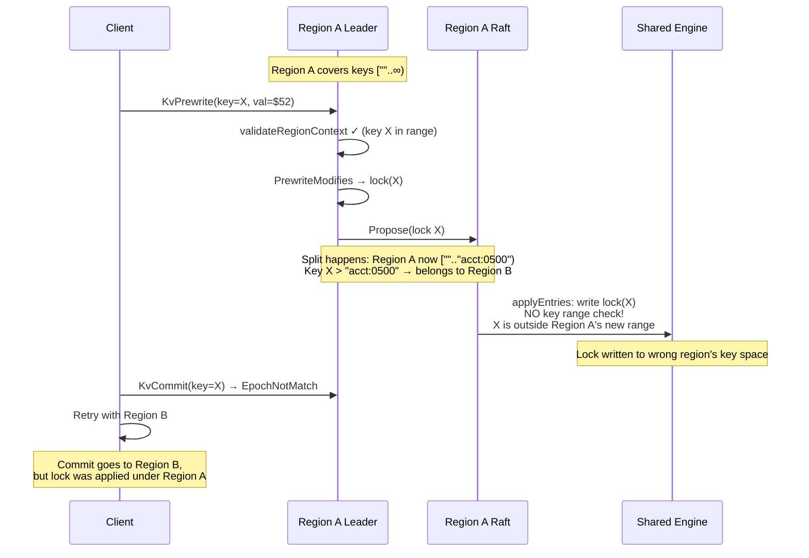
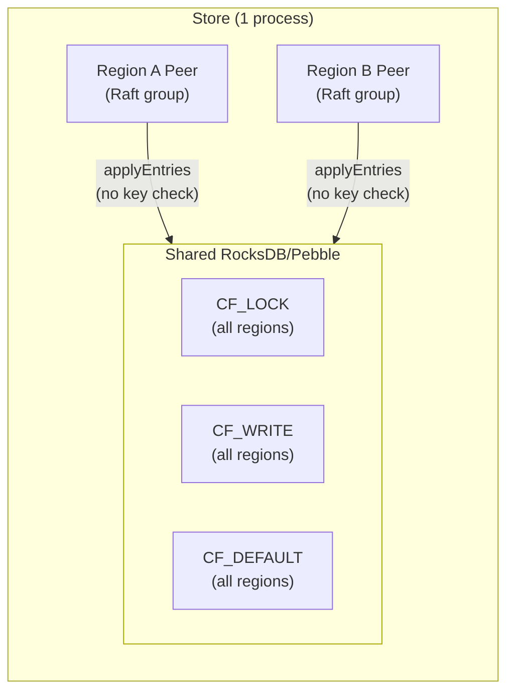
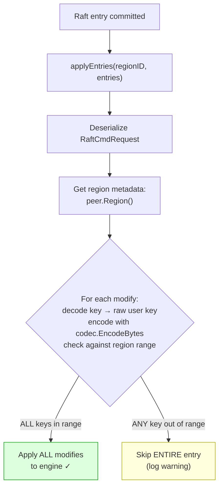

# Bug 13: Cross-Region Write Misrouting After Split — Design Document

## 1. Problem Statement

After Bug 12 fix, the transaction integrity demo still shows $8-$95 balance divergence with 32 workers and 3+ regions. Committed transfers have correct replay totals ($100,000), but actual account balances differ from replayed values. All commit RPCs succeed — no errors logged.

### Observed symptoms

```
DISCREPANCY acct:0274: replayed=$147 actual=$100 diff=-47
DISCREPANCY acct:0892: replayed=$53  actual=$53  diff=0   (from-side OK)
```

The credit to acct:0274 ($100 + $47 = $147) was committed but not actually applied. The debit from acct:0892 ($100 - $47 = $53) was applied correctly. Net effect: $47 "destroyed".

## 2. Root Cause Analysis

### 2.1 The Missing Validation Layer

```mermaid
flowchart TD
    subgraph TiKV["TiKV (correct)"]
        T1["RPC Handler<br/>epoch + key range check"] --> T2["Raft Propose"]
        T2 --> T3["Raft Commit (quorum)"]
        T3 --> T4["Raft Apply<br/><b>check_key_in_region ✓</b>"]
        T4 --> T5["Write to Engine"]
    end

    subgraph gookv["gookv (current)"]
        G1["RPC Handler<br/>validateRegionContext"] --> G2["Raft Propose"]
        G2 --> G3["Raft Commit (quorum)"]
        G3 --> G4["Raft Apply<br/><b>NO validation ✗</b>"]
        G4 --> G5["Write to Engine"]
    end

    style T4 fill:#dfd,stroke:#0a0
    style G4 fill:#fdd,stroke:#a00
```



**gookv's `applyEntries`** (`coordinator.go:183-205`) writes modifications to the shared RocksDB engine **without any key range validation**:

```go
func (sc *StoreCoordinator) applyEntries(entries []raftpb.Entry) {
    modifies := RequestsToModifies(req.Requests)
    _ = sc.storage.ApplyModifies(modifies)  // NO key range check!
}
```

**TiKV's apply layer** (`raftstore/src/store/fsm/apply.rs:1897-1991`) validates key range before every write:

```rust
fn handle_put(&mut self, ctx, req) -> Result<()> {
    check_key_in_region(key, &self.region)?;  // key range
    ctx.kv_wb.put(key, value)?;
    Ok(())
}
```

### 2.2 The Bug Scenario

The problem occurs within a **single Raft group** when a split changes the region's key range between proposal and apply:



The entry was correctly proposed to Region A **before** the split, but by the time the Raft apply runs, Region A's key range has changed. Without apply-level key range validation, the stale-range write is applied blindly.

### 2.3 Shared Engine Architecture



All regions on a store share **one engine instance** (`internal/server/storage.go:30-36`). There is no per-region key space isolation. When `applyEntries` writes to the engine, it doesn't check if the key belongs to the current region.

### 2.4 Why TiKV Doesn't Have This Problem

TiKV has **apply-level key range validation** that gookv lacks:

| Protection | TiKV | gookv |
|-----------|------|-------|
| RPC-level epoch check | `check_region_epoch` | `validateRegionContext` ✓ |
| RPC-level key check | `check_key_in_region` (for single-key RPCs) | partial ✓ |
| Apply-level key range check | `check_key_in_region` in `handle_put`/`handle_delete` | **Missing** |
| Apply delegate with own region copy | `self.region` updated by admin commands | **Missing** |

**Critical architectural difference:** TiKV's apply delegate maintains its own copy of region metadata (`self.region`) that advances in lockstep with applied entries. When a split admin command is applied, the delegate's region metadata is updated atomically. This means TiKV's apply-level `check_key_in_region` always uses the correct region boundaries at the exact point of application — no race condition.

gookv's `applyEntries` reads `peer.Region()` which may have been updated by a concurrent split handler (`handleSplitCheckResult`). This creates a potential race.

**TiKV source references:**
- `tikv/components/raftstore/src/store/fsm/apply.rs:1897-1991` — key range check in `handle_put`/`handle_delete`
- `tikv/components/raftstore/src/store/util.rs:52-77` — `check_key_in_region` helper
- `tikv/components/raftstore/src/store/util.rs:259-305` — `check_region_epoch` helper

## 3. Fix Design

### 3.1 Add key range validation to `applyEntries`

**File:** `internal/server/coordinator.go`, `applyEntries()` method

Pass `regionID` through the existing closure parameter. Before applying, validate that **all** keys in the entry belong to the current region's range. If any key is out of range, **skip the entire entry atomically** (not individual modifies) to preserve transactional consistency.



**Implementation details:**

1. Change `applyEntries` signature to accept `regionID`:
   ```go
   func (sc *StoreCoordinator) applyEntries(regionID uint64, entries []raftpb.Entry)
   ```

2. Update the closure in `BootstrapRegion` and `handleSplitCheckResult`:
   ```go
   peer.SetApplyFunc(func(regionID uint64, entries []raftpb.Entry) {
       sc.applyEntries(regionID, entries)  // pass regionID through
   })
   ```

3. Extract raw user keys from modifies using CF-aware decoding (following the pattern in `groupModifiesByRegion` at server.go:1070-1074):
   - CF_LOCK keys: `mvcc.DecodeLockKey(m.Key)` → raw user key
   - CF_WRITE/CF_DEFAULT keys: `mvcc.DecodeKey(m.Key)` → raw user key + timestamp
   - Then encode with `codec.EncodeBytes(nil, rawKey)` for comparison against region boundaries

4. Atomic accept/reject: if ANY key is out of range, skip the entire entry.

### 3.2 Add per-key validation to KvPrewrite (defense-in-depth)

**File:** `internal/server/server.go`, KvPrewrite handler

Validate that ALL mutation keys belong to the current region. The client already groups mutations by region, so this is defense-in-depth against client-server races during splits:

```go
if coord := svc.server.coordinator; coord != nil && req.GetContext().GetRegionId() != 0 {
    peer := coord.GetPeer(req.GetContext().GetRegionId())
    if peer != nil {
        region := peer.Region()
        for _, m := range req.GetMutations() {
            encodedKey := codec.EncodeBytes(nil, m.GetKey())
            if !keyInEncodedRange(encodedKey, region.GetStartKey(), region.GetEndKey()) {
                resp.RegionError = &errorpb.Error{
                    KeyNotInRegion: &errorpb.KeyNotInRegion{
                        Key: m.GetKey(), RegionId: req.GetContext().GetRegionId(),
                        StartKey: region.GetStartKey(), EndKey: region.GetEndKey(),
                    },
                }
                return resp, nil
            }
        }
    }
}
```

### 3.3 Design decisions

| Decision | Choice | Rationale |
|----------|--------|-----------|
| Epoch check at apply | **No** (key range only) | Epoch may race with split handler; key range is sufficient |
| Embed epoch in Raft header | **No** | regionID is already available via closure; avoids deployment coupling |
| Partial vs. atomic apply | **Atomic** (skip entire entry) | Partial apply breaks transactional invariants (lock + write must be atomic) |
| Key decoding | CF-aware decode | `Modify.Key` is already encoded; must decode to raw key first, then re-encode for boundary comparison |

## 4. Impact Assessment

| Aspect | Before fix | After fix |
|--------|-----------|-----------|
| Apply-level key validation | None | Check all keys against region range |
| Out-of-range writes | Silently applied to engine | Atomically skipped |
| Performance | N/A | Minimal: 1 decode + 1 encode + 2 comparisons per modify |
| Transactional atomicity | Preserved (entries applied as-is) | Preserved (entries accepted or rejected atomically) |
