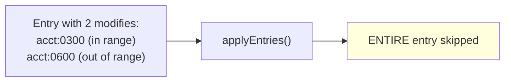
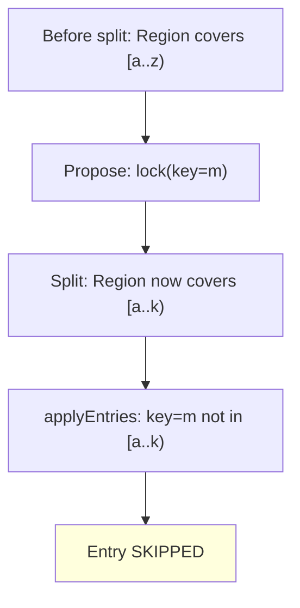
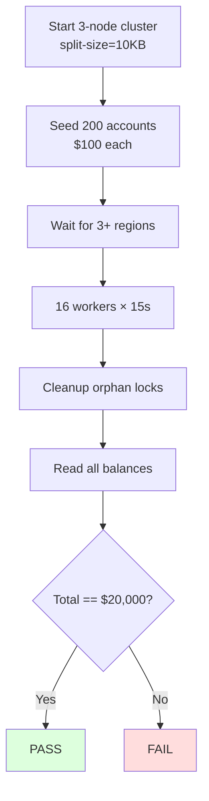
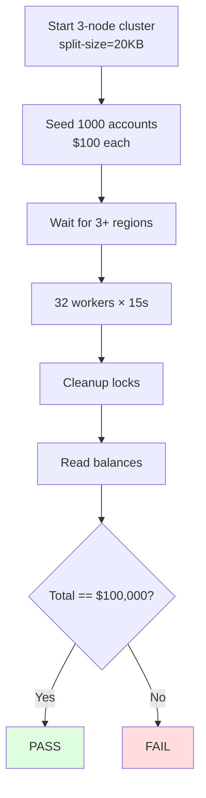

# Bug 13: Cross-Region Write Misrouting — Test Plan

## 1. Unit Tests

### 1.1 `TestApplyEntriesSkipsOutOfRangeEntry`

**File:** `internal/server/coordinator_test.go`

**Purpose:** Verify that `applyEntries` skips an entry when any key is outside the region's current range.

**Setup:**
- Region covers [acct:0200, acct:0500) (encoded boundaries)
- Create a Raft entry with modifies for acct:0300 (in range) and acct:0600 (out of range)

**Assertions:**
- Neither acct:0300 nor acct:0600 is written to engine (atomic rejection)
- No panic or error

### 1.2 `TestApplyEntriesAcceptsInRangeEntry`

**File:** `internal/server/coordinator_test.go`

**Purpose:** Verify that valid entries (all keys in range) are applied normally.

**Setup:**
- Region covers [acct:0200, acct:0500)
- Entry with modifies for acct:0250 and acct:0400

**Assertions:**
- Both keys are written to the engine
- Values match expected

### 1.3 `TestApplyEntriesHandlesMixedCFs`

**File:** `internal/server/coordinator_test.go`

**Purpose:** Verify correct key decoding for different column families (CF_LOCK vs CF_WRITE vs CF_DEFAULT).

**Setup:**
- Region covers [acct:0200, acct:0500)
- Entry with CF_LOCK modify for acct:0300 and CF_WRITE modify for acct:0300

**Assertions:**
- Both modifies applied (same user key, different CFs, both in range)
- Correct key decoding for each CF

### 1.4 `TestApplyEntriesSkipsSplitBoundaryEntry`

**File:** `internal/server/coordinator_test.go`

**Purpose:** Verify that an entry proposed before a split is correctly skipped when the key is no longer in the region's range.

**Setup:**
- Region initially covers [a..z), split to [a..k)
- Entry contains modify for key "m" (now out of range)

**Assertions:**
- Entry is skipped
- No write to engine

### 1.5 `TestKvPrewriteRejectsKeyOutOfRegion`

**File:** `internal/server/server_test.go`

**Purpose:** Verify that KvPrewrite returns `KeyNotInRegion` when a mutation key is outside the region.

**Setup:**
- Region covers [acct:0200, acct:0500)
- KvPrewrite request with mutations: [acct:0300, acct:0600]

**Assertions:**
- Response has RegionError.KeyNotInRegion
- No lock written for either key (atomic reject)

## 2. E2E Tests

### 2.1 `TestApplyValidationDuringSplit`

**File:** `e2e/txn_cross_region_test.go`

**Purpose:** End-to-end test that apply-level validation prevents data corruption during splits.

**Assertions:**
- Total balance exactly $20,000
- At least 30 successful transfers
- Zero errors

### 2.2 `TestTransactionIntegrity32Workers`

**File:** `e2e/txn_cross_region_test.go`

**Purpose:** Full demo scenario as an automated E2E test.

**Assertions:**
- Total balance exactly $100,000
- At least 50 successful transfers
- Orphan lock cleanup completes in <= 3 passes

### 2.3 `TestSplitDuringTransfer`

**File:** `e2e/txn_cross_region_test.go`

**Purpose:** Force the exact bug scenario: transaction spans a split boundary.

**Scenario:**
1. Start 3-node cluster with split disabled
2. Write 2 keys: key_a="hello", key_b="world"
3. Begin transaction: Set key_a="A", Set key_b="B"
4. Before commit, trigger a manual split between key_a and key_b
5. Commit the transaction
6. Verify: key_a="A", key_b="B"

**Assertions:**
- Transaction commits successfully
- Both keys have expected values
- No data corruption

## 3. Regression Tests

| Suite | Command | Expected |
|-------|---------|----------|
| Unit tests | `make test` (×3) | All PASS |
| E2E tests | `make test-e2e` | All PASS |
| go vet | `go vet ./...` | Clean |

### Transaction integrity demo

| Run | Command | Expected |
|-----|---------|----------|
| 1 | `make txn-integrity-demo-verify` | All 3 phases PASS |
| 2 | restart + verify | All 3 phases PASS |
| 3 | restart + verify | All 3 phases PASS |

## 4. Verification Checklist

- [ ] `applyEntries` accepts `regionID` parameter
- [ ] `applyEntries` decodes modify keys using CF-aware logic (DecodeKey/DecodeLockKey)
- [ ] `applyEntries` rejects entire entry atomically if any key is out of range
- [ ] KvPrewrite validates ALL mutation keys against region range
- [ ] Unit tests: 5 new tests pass
- [ ] E2E tests: 3 new tests pass
- [ ] `make test` — 3 consecutive passes
- [ ] `make test-e2e` — all pass
- [ ] Transaction integrity demo — 3 consecutive PASSes
- [ ] No balance divergence in any test run
- [ ] Documentation updated (03_current_issues.md, TODO.md)
