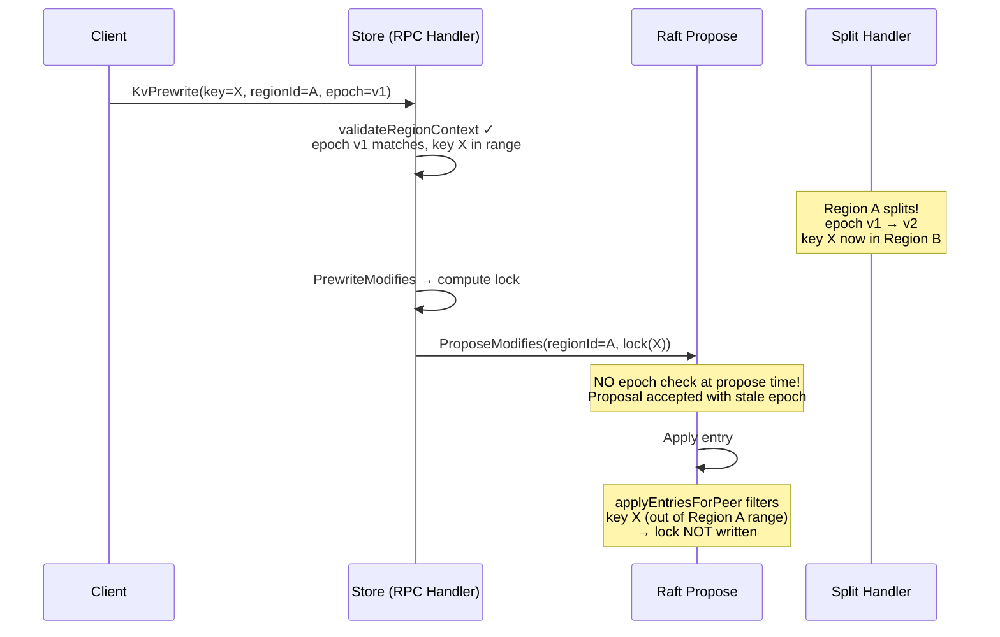
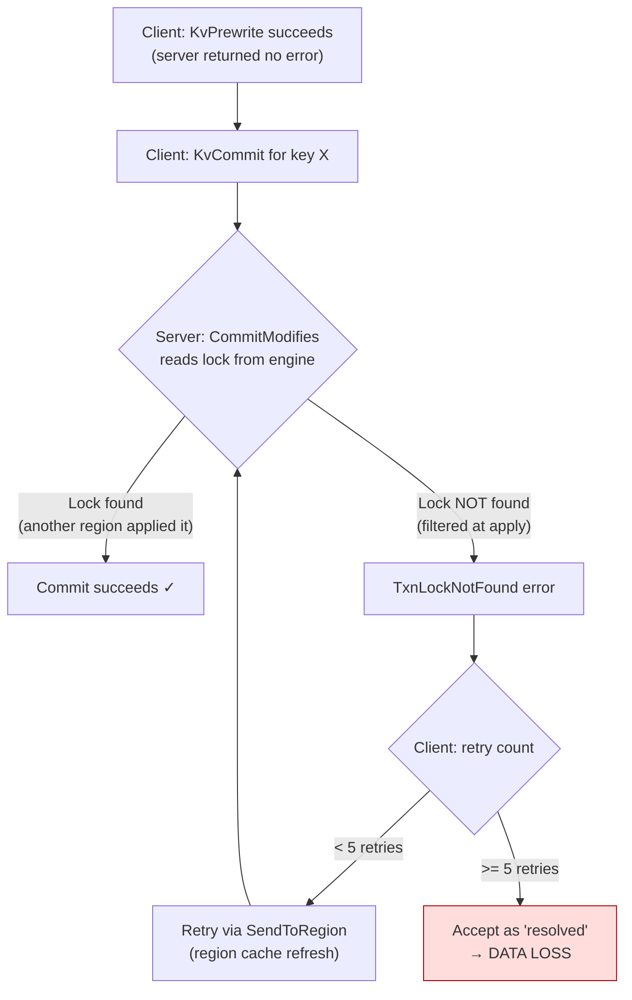
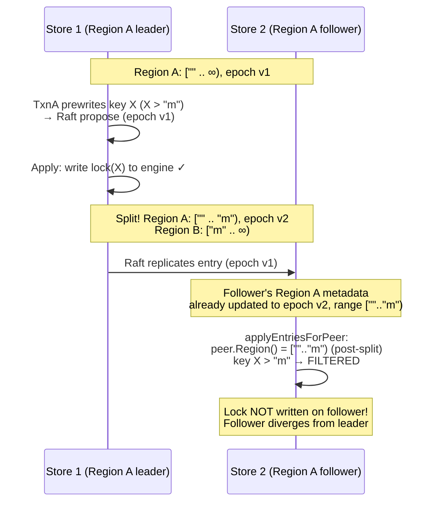

# Cross-Region 2PC Integrity: Problem Analysis

## 1. Problem Statement

The transaction integrity demo shows $50-$100 balance divergence with 32 workers and 3+ regions. All prior fixes (ReadIndex, epoch validation at RPC level, apply-level key filtering, per-key commit routing) have been applied. The replayed total from committed transfers is always $100,000, but actual account balances differ.

### Demo evidence

```
DISCREPANCY acct:0274: replayed=$147 actual=$100 diff=-47
DISCREPANCY acct:0892: replayed=$53  actual=$53  diff=0
```

Transfer credits acct:0274 by $47 (to $147), but actual balance is $100 (initial value). The credit was committed (Raft proposal succeeded) but the write was either filtered at apply time or proposed to the wrong region.

## 2. Root Cause

### 2.1 The timing gap between RPC validation and Raft proposal



The split occurs BETWEEN `validateRegionContext` (which passes) and `ProposeModifies` (which has no epoch check). The entry enters the Raft log for Region A, but the apply-level filter correctly drops it because key X is no longer in Region A's range.

### 2.2 Why the client doesn't recover



After 5 `TxnLockNotFound` retries, the client accepts the error as "lock already resolved by another transaction." But the lock was never written — it was filtered at apply. The primary commit succeeds (different key, different region), but the secondary is lost.

### 2.3 The follower divergence problem

All regions on a store share ONE RocksDB engine. The latch is also store-wide. So:

- Two prewrites for the same key on the same store ARE serialized (latch prevents concurrency)
- The engine snapshot DOES see all regions' data (no per-region isolation)
- Conflict detection works correctly within a single store

The issue is on **follower stores** that apply entries after the region metadata has been updated by the split:



The entry was proposed and applied on the leader BEFORE the split — correctly. But the follower receives the entry AFTER its region metadata was updated by the split handler. The apply-level filter uses post-split metadata (`peer.Region()`) and incorrectly rejects the pre-split entry.

**Note:** `applyEntriesForPeer` only controls whether to call `ApplyModifies` for new entries from `rd.CommittedEntries`. It does NOT delete data that was already written. The issue is that the follower never writes the data in the first place.

## 3. Root Cause Summary

Two interacting bugs:

1. **Apply-level filter uses wrong region metadata** — `peer.Region()` returns post-split range for pre-split entries on followers. The filter should use the epoch from the time of proposal, not the current epoch.

2. **No propose-time epoch check** — stale proposals can enter the Raft log even after the region's epoch has changed. TiKV's `CmdEpochChecker` rejects these before they reach the log.

## 4. The TiKV Solution

TiKV handles this correctly because:

1. **Splits are Raft admin commands** — ordered in the Raft log alongside data entries. Entries before the split admin command are applied with pre-split metadata; entries after are applied with post-split metadata.
2. **Apply delegate maintains its own region copy** (`self.region`) — updated atomically when the split admin command is applied. Pre-split entries see the pre-split range.
3. **Propose-time epoch check** — `CmdEpochChecker` rejects proposals whose epoch conflicts with pending admin commands.

gookv's splits execute outside Raft (via `handleSplitCheckResult` in the coordinator). There is no ordering between split execution and data entry apply. The fix must compensate for this architectural difference by embedding the epoch in each proposal (see `03_design.md`).
