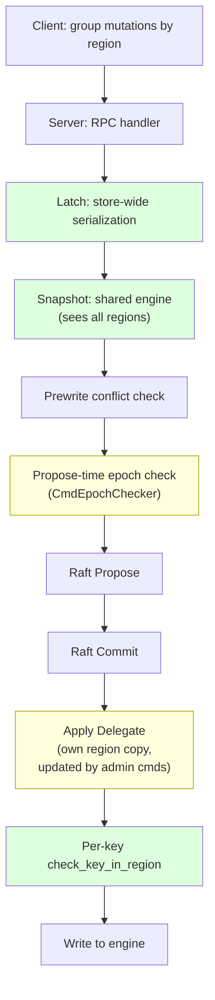
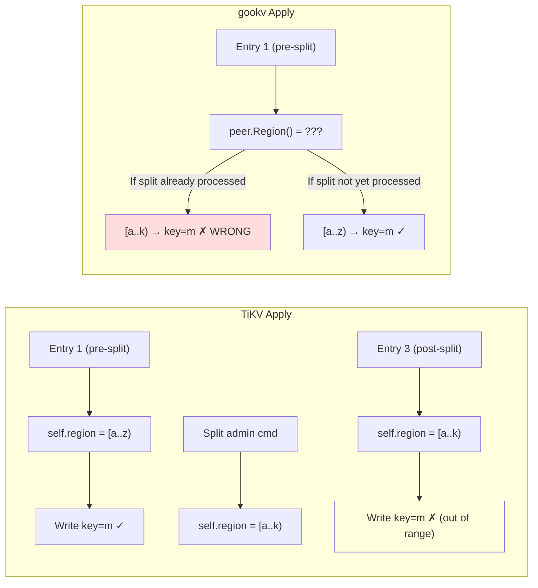

# Cross-Region 2PC Integrity: TiKV Reference

## 1. TiKV's Multi-Layer Protection



### 1.1 Store-Wide Latches (gookv: HAS)

**File:** `tikv/src/storage/txn/latch.rs`

One `Latches` instance per store. Keys hash to slots regardless of region. Two prewrites for the same key are always serialized.

gookv equivalent: `latch.New(2048)` in `internal/server/storage.go:33`. Store-wide. ✓

### 1.2 Shared Engine Snapshot (gookv: HAS)

**File:** `tikv/src/storage/txn/scheduler.rs:751`

Snapshot from the shared RocksDB engine. Conflict detection sees all regions' locks and writes.

gookv equivalent: `s.engine.NewSnapshot()` in `internal/server/storage.go:189`. Shared. ✓

### 1.3 Propose-Time Epoch Check (gookv: MISSING)

**File:** `tikv/components/raftstore/src/store/peer.rs:4723-4731`

```rust
if self.has_applied_to_current_term() {
    if let Some(index) = self
        .cmd_epoch_checker
        .propose_check_epoch(&req, self.term())
    {
        return Ok(Either::Right(index));
    }
}
```

Before proposing a Raft entry, TiKV checks if the request's epoch conflicts with any pending admin commands (splits/merges). If a split has been proposed but not yet applied, new write proposals with the old epoch are rejected.

gookv: `ProposeModifies` in `coordinator.go` does NOT check epoch. Proposals are accepted regardless of pending splits.

### 1.4 Apply Delegate with Own Region Copy (gookv: MISSING)

**File:** `tikv/components/raftstore/src/store/fsm/apply.rs`

TiKV's apply delegate maintains `self.region` — a copy of region metadata that is updated **only** when admin commands (splits/merges) are applied. This means:
- Pre-split entries see the pre-split region range → accepted
- Post-split entries see the post-split region range → filtered



gookv: `applyEntriesForPeer` calls `peer.Region()` which returns the CURRENT region metadata, not a snapshot at the time of each entry. If the split handler updates `peer.Region()` before old entries are applied, pre-split entries are incorrectly filtered.

### 1.5 Per-Key Apply Validation (gookv: HAS)

**File:** `tikv/components/raftstore/src/store/fsm/apply.rs:1897-1944`

```rust
fn handle_put(&mut self, ctx, req) -> Result<()> {
    check_key_in_region(key, &self.region)?;
    ctx.kv_wb.put(key, value)?;
    Ok(())
}
```

gookv equivalent: `applyEntriesForPeer` in `coordinator.go` — per-key CF-aware filtering. ✓ (but uses `peer.Region()` instead of apply-delegate region copy)

## 2. Gap Analysis

| Mechanism | TiKV | gookv | Impact |
|-----------|------|-------|--------|
| Store-wide latches | ✓ | ✓ | Same-key serialization works |
| Shared snapshot | ✓ | ✓ | Conflict detection sees all data |
| Propose-time epoch check | ✓ | ✗ | Stale proposals can enter Raft log |
| Apply delegate region copy | ✓ | ✗ | Pre-split entries incorrectly filtered |
| Per-key apply filtering | ✓ | ✓ | Filters out-of-range keys |
| Client region grouping | ✓ | ✓ | Client sends per-region requests |

The two missing mechanisms compound: without propose-time epoch check, stale proposals enter the log. Without an apply-delegate region copy, the apply filter uses post-split metadata and incorrectly rejects pre-split entries.
