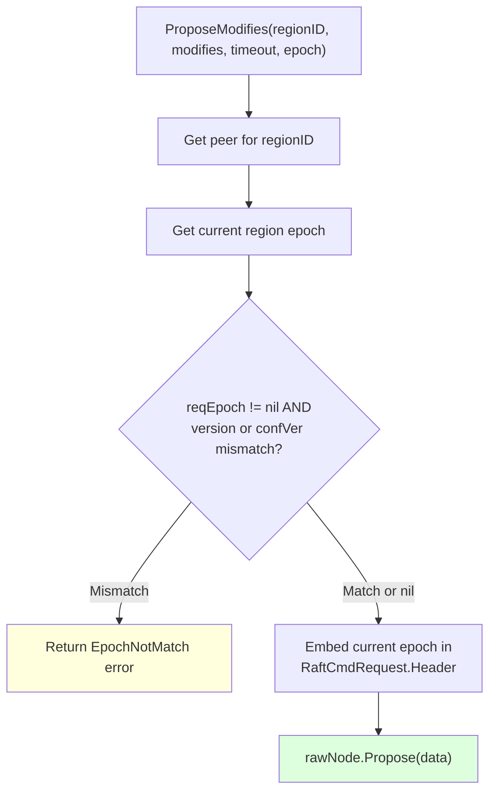
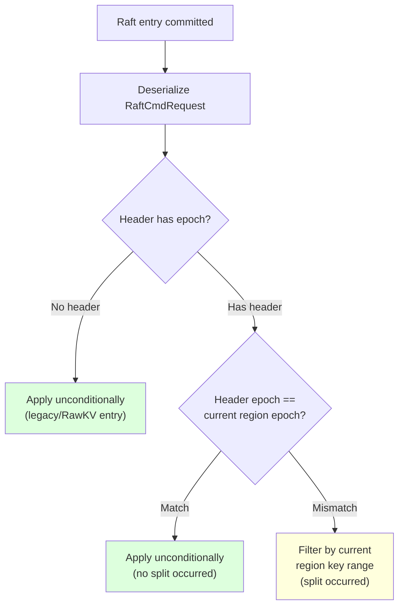

# Cross-Region 2PC Integrity: Fix Design

## 1. Approach

Two changes are needed:

1. **Propose-time epoch check** in `ProposeModifies` — reject proposals whose epoch has changed since the RPC was received
2. **Fix apply-level filtering** — embed region epoch in `RaftCmdRequest.Header` at propose time; at apply time, compare the embedded epoch with the current region. If they match, apply unconditionally. If they differ (split occurred between propose and apply), filter by key range using the current region boundaries.

### Why NOT remove apply-level filtering

gookv's splits are NOT Raft admin commands — they execute outside Raft via `handleSplitCheckResult` (coordinator.go:638). There is no ordering guarantee between "entry proposed" and "split applied." A proposal can enter the Raft log with valid epoch v1, and a split can execute between propose and apply, changing the region to v2. The propose-time check cannot catch this race. Apply-level filtering is needed as a safety net.

However, the current apply-level filter is broken: it reads `peer.Region()` (post-split metadata) for pre-split entries. The fix embeds the epoch at propose time so the apply layer can distinguish pre-split from post-split entries.

## 2. Design

### 2.1 Propose-time epoch check



**File:** `internal/server/coordinator.go`

Change `ProposeModifies` to accept an optional epoch parameter. Check both `Version` and `ConfVer` (matching `validateRegionContext`):

```go
func (sc *StoreCoordinator) ProposeModifies(regionID uint64, modifies []mvcc.Modify, timeout time.Duration, reqEpoch ...*metapb.RegionEpoch) error {
    peer := sc.GetPeer(regionID)
    // ... existing leader check ...

    currentEpoch := peer.Region().GetRegionEpoch()

    // Propose-time epoch check (if epoch provided)
    if len(reqEpoch) > 0 && reqEpoch[0] != nil && currentEpoch != nil {
        re := reqEpoch[0]
        if re.GetVersion() != currentEpoch.GetVersion() ||
           re.GetConfVer() != currentEpoch.GetConfVer() {
            return fmt.Errorf("raftstore: epoch not match for region %d", regionID)
        }
    }

    // Embed current epoch in RaftCmdRequest header for apply-level check
    req := &raft_cmdpb.RaftCmdRequest{
        Header: &raft_cmdpb.RaftRequestHeader{
            RegionId:    regionID,
            RegionEpoch: currentEpoch,
        },
        Requests: ModifiesToRequests(modifies),
    }
    // ... propose via Raft ...
}
```

### 2.2 Fix apply-level filtering with embedded epoch



**File:** `internal/server/coordinator.go`, `applyEntriesForPeer()`

```go
func (sc *StoreCoordinator) applyEntriesForPeer(peer *raftstore.Peer, entries []raftpb.Entry) {
    for _, entry := range entries {
        // ... existing entry type/data checks ...

        var req raft_cmdpb.RaftCmdRequest
        if err := req.Unmarshal(entry.Data); err != nil { continue }

        modifies := RequestsToModifies(req.Requests)
        if len(modifies) == 0 { continue }

        // Check if the entry's epoch matches the current region.
        // If no header (legacy entry) or epochs match: apply unconditionally.
        // If epochs differ (split occurred between propose and apply):
        // filter out-of-range keys using current region boundaries.
        needsFilter := false
        if hdr := req.GetHeader(); hdr != nil && hdr.GetRegionEpoch() != nil {
            currentEpoch := peer.Region().GetRegionEpoch()
            if currentEpoch != nil {
                proposeEpoch := hdr.GetRegionEpoch()
                if proposeEpoch.GetVersion() != currentEpoch.GetVersion() {
                    needsFilter = true
                }
            }
        }

        if needsFilter {
            modifies = filterModifiesByRegion(modifies, peer.Region())
        }

        if len(modifies) > 0 {
            _ = sc.storage.ApplyModifies(modifies)
        }
    }
}
```

The `filterModifiesByRegion` helper performs per-key CF-aware filtering (existing logic extracted into a function).

### 2.3 Add "epoch not match" to `proposeErrorToRegionError`

**File:** `internal/server/server.go`

```go
func proposeErrorToRegionError(err error, regionID uint64) *errorpb.Error {
    msg := err.Error()
    // ... existing "not found", "not leader", "timeout" checks ...
    if strings.Contains(msg, "epoch not match") {
        return &errorpb.Error{
            Message:       msg,
            EpochNotMatch: &errorpb.EpochNotMatch{},
        }
    }
    return nil
}
```

This ensures clients receive `EpochNotMatch` (a retriable region error) and refresh their region cache.

### 2.4 Pass epoch from RPC handlers

**File:** `internal/server/server.go`

All transactional RPC handlers pass `req.GetContext().GetRegionEpoch()` to `ProposeModifies`:

- KvPrewrite (standard, async commit, 1PC paths)
- KvCommit
- KvBatchRollback, KvCleanup, KvCheckTxnStatus, KvPessimisticLock, KvResolveLock

RawKV handlers (RawPut, RawDelete, etc.) continue to call `ProposeModifies` without epoch — these don't use 2PC and don't need epoch protection.

### 2.5 Update `proposeModifiesToRegions`

**File:** `internal/server/server.go`

The multi-region propose helpers (`proposeModifiesToRegions`, `proposeModifiesToRegionsWithRegionError`) should also accept an optional epoch and pass it through. Handlers that use these (KvBatchRollback, KvResolveLock) should pass the epoch.

## 3. Files to Modify

| File | Change |
|------|--------|
| `internal/server/coordinator.go` | `ProposeModifies`: add epoch param + check; embed epoch in header. `applyEntriesForPeer`: epoch-aware filtering |
| `internal/server/server.go` | All txn handlers: pass epoch. `proposeErrorToRegionError`: add epoch mismatch. `proposeModifiesToRegions`: pass epoch |

## 4. Impact on Existing Tests

- **Unit tests**: `ProposeModifies` without epoch param continues to work (variadic)
- **E2E tests**: Tests with empty context (`RegionEpoch=nil`) skip the epoch check → existing behavior preserved
- **Demo**: Should show $100,000 exact — propose-time check rejects stale proposals, epoch-aware apply filter correctly handles pre-split entries

## 5. Long-term: Splits as Raft Admin Commands

The architecturally correct solution (matching TiKV) is to make region splits Raft admin commands. This would:
- Order splits with respect to data entries in the Raft log
- Enable a TiKV-style apply delegate with its own region metadata copy
- Eliminate the race between `handleSplitCheckResult` and `applyEntriesForPeer`

This is deferred as a separate task due to the scope of changes required. The propose-time epoch check + epoch-aware apply filter is a sound intermediate solution.
