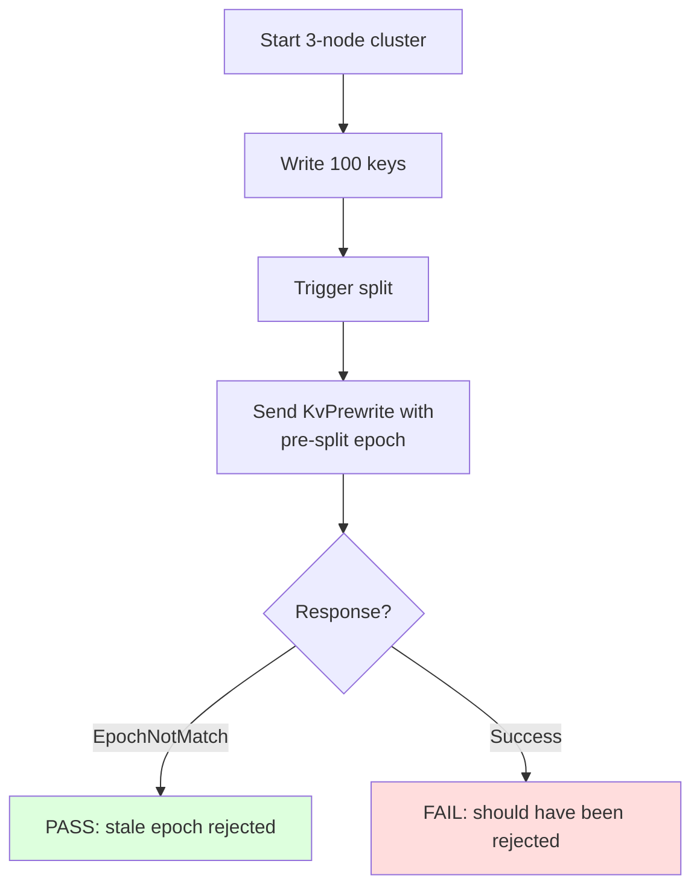

# Cross-Region 2PC Integrity: Test Plan

## 1. Unit Tests

### 1.1 `TestProposeModifiesWithEpochRejectsStaleEpoch`

**File:** `internal/server/coordinator_test.go`

**Purpose:** Verify that `ProposeModifiesWithEpoch` returns `EpochNotMatch` when the request epoch doesn't match the current region epoch.

**Setup:**
- Create a StoreCoordinator with a region at epoch version=2
- Call `ProposeModifiesWithEpoch` with epoch version=1

**Assertions:**
- Error returned contains "epoch not match"
- No Raft proposal created

### 1.2 `TestProposeModifiesWithEpochAcceptsCurrentEpoch`

**File:** `internal/server/coordinator_test.go`

**Purpose:** Verify that proposals with matching epoch are accepted.

**Setup:**
- Region at epoch version=2
- Call `ProposeModifiesWithEpoch` with epoch version=2

**Assertions:**
- No error returned
- Raft proposal created and committed

### 1.3 `TestProposeModifiesWithEpochNilEpochSkipsCheck`

**File:** `internal/server/coordinator_test.go`

**Purpose:** Verify that nil epoch (empty context, e.g., test/internal calls) skips the epoch check.

**Setup:**
- Region at epoch version=2
- Call `ProposeModifiesWithEpoch` with epoch=nil

**Assertions:**
- No error returned (epoch check skipped)
- Raft proposal created and committed

### 1.4 `TestProposeModifiesWithEpochReturnsProposeError`

**File:** `internal/server/coordinator_test.go`

**Purpose:** Verify that the epoch mismatch error is translated to a retriable region error by the caller.

**Setup:**
- Call from KvPrewrite handler with stale epoch
- Verify `proposeErrorToRegionError` converts the error to `EpochNotMatch`

**Assertions:**
- Client receives `RegionError.EpochNotMatch` with current region metadata
- Error is retriable (client refreshes region cache and retries)

## 2. E2E Tests

### 2.1 `TestEpochCheckDuringSplit`

**File:** `e2e/txn_cross_region_test.go`

**Purpose:** Verify that a prewrite proposal is rejected if a split occurs between RPC validation and propose.

**Scenario:**

### 2.2 `TestCrossRegionTransferConservation`

**File:** `e2e/txn_cross_region_test.go`

**Purpose:** Verify balance conservation with concurrent transfers and splits.

**Scenario:**
1. Start 3-node cluster, split-size=10KB
2. Seed 200 accounts with $100 each ($20,000)
3. Wait for 3+ regions
4. Run 16 workers for 15 seconds
5. Cleanup orphan locks
6. Read all balances
7. Verify total = $20,000

**Assertions:**
- Total exactly $20,000
- At least 30 successful transfers
- No errors

### 2.3 `TestTransactionIntegrity32Workers`

**File:** `e2e/txn_cross_region_test.go`

**Purpose:** Full 32-worker stress test matching the demo.

**Scenario:**
1. Start 3-node cluster, split-size=20KB
2. Seed 1000 accounts ($100,000 total)
3. Wait for 3+ regions
4. 32 workers for 15 seconds
5. Cleanup + verify

**Assertions:**
- Total exactly $100,000
- At least 50 successful transfers
- Orphan cleanup <= 3 passes

## 3. Regression Tests

| Suite | Command | Expected |
|-------|---------|----------|
| Unit tests | `make test` (×3) | All PASS |
| E2E tests | `make test-e2e` | All PASS |
| go vet | `go vet ./...` | Clean |

### Transaction integrity demo

| Run | Expected |
|-----|----------|
| 1 | All 3 phases PASS, total = $100,000 |
| 2 | All 3 phases PASS, total = $100,000 |
| 3 | All 3 phases PASS, total = $100,000 |

### 2.4 `TestProposeApplyGapWithSplit`

**File:** `e2e/txn_cross_region_test.go`

**Purpose:** Test the scenario where a proposal enters Raft with valid epoch v1, but a split occurs between propose and apply.

**Scenario:**
1. Start cluster, seed data
2. Begin a transaction, prewrite keys
3. Trigger a split while the prewrite is in-flight
4. Verify the prewrite lock is correctly applied (epoch-aware filter at apply should handle it)

### 2.5 `Test1PCPathWithEpoch`

**File:** `e2e/txn_cross_region_test.go`

**Purpose:** Verify that the 1PC path also passes epoch to `ProposeModifies`.

## 4. Verification Checklist

- [ ] `ProposeModifiesWithEpoch` checks epoch before proposing
- [ ] All transactional RPC handlers pass epoch to `ProposeModifiesWithEpoch`
- [ ] Apply-level key range filtering removed (revert to no-filter)
- [ ] Unit tests: 4 new tests pass
- [ ] E2E tests: 3 new tests pass
- [ ] `make test` — 3 consecutive passes
- [ ] `make test-e2e` — all pass
- [ ] Transaction integrity demo — 3 consecutive PASSes
- [ ] No balance divergence in any test run
