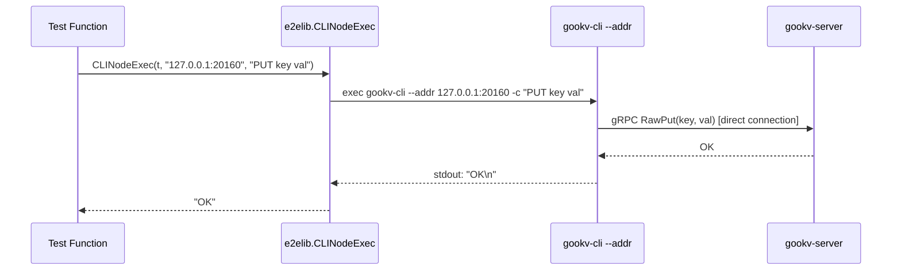
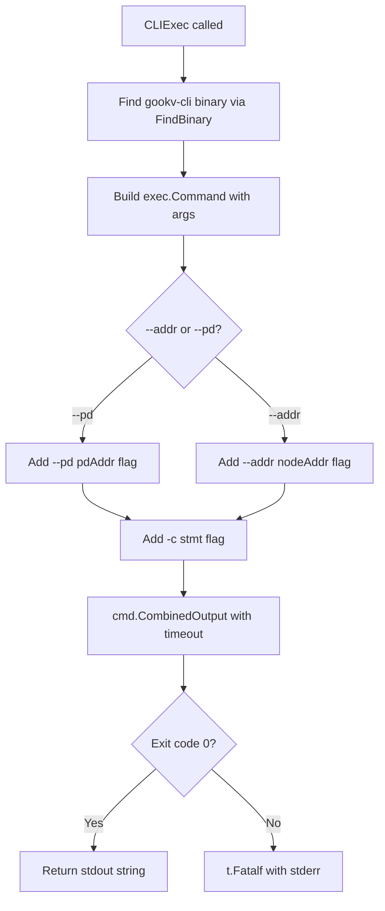

# E2E CLI Migration: Architecture

## 1. Goal & Scope

The e2e CLI migration eliminates `pkg/client` and `pkg/pdclient` imports from **63 of 75** e2e_external tests (84%) by converting test assertions to invoke `gookv-cli` as a subprocess instead of calling Go library APIs directly.

**Key constraints:**

- **12 tests (16%)** permanently stay library-based. These are protocol correctness tests that inspect gRPC response internals (async commit timestamps, lock metadata, prewrite responses) that cannot be meaningfully expressed via CLI output.
- **Process management** (`StopNode`, `RestartNode`, `AddNode`) remains in Go/e2elib. These functions control server processes (SIGTERM, re-exec) and have no CLI equivalent.
- The migration is **behavior-preserving**: every converted test verifies the same invariant as before, only the assertion mechanism changes (CLI stdout parsing instead of Go struct field checks).

## 2. Three-Tier Architecture

```
+------------------------------------------------------------------+
|                     Test Functions (75 total)                      |
|                                                                    |
|  +------------------+ +------------------+ +--------------------+ |
|  | Tier 1: Pure CLI | | Tier 2: Hybrid   | | Tier 3: Library    | |
|  | 32 tests (43%)   | | 31 tests (41%)   | | 12 tests (16%)     | |
|  +--------+---------+ +--------+---------+ +---------+----------+ |
|           |                    |                      |            |
+-----------+--------------------+----------------------+------------+
            |                    |                      |
            v                    v                      v
  +-------------------+  +-------------------+  +------------------+
  | e2elib            |  | e2elib            |  | e2elib           |
  | CLI Wrappers      |  | CLI Wrappers      |  | DialTikvClient   |
  | (CLIExec,         |  |   +               |  | raw gRPC         |
  |  CLIPut, CLIGet)  |  | Process Mgmt      |  | pkg/client       |
  |                   |  | (StopNode, etc.)  |  | pkg/pdclient     |
  +--------+----------+  +--------+----------+  +--------+---------+
           |                      |                      |
           v                      v                      v
  +-----------------------------------------------------------+
  |              gookv-cli binary (subprocess)                  |
  |  --pd <addr>  |  --addr <host:port>  |  -c "CMD"          |
  |                                                             |
  |  Raw KV: PUT GET DELETE SCAN BGET BPUT BDELETE ...         |
  |  Txn:    BEGIN SET GET DELETE BGET COMMIT ROLLBACK         |
  |  Admin:  STORE LIST/STATUS, REGION, TSO, GC SAFEPOINT     |
  |  PD:     BOOTSTRAP, PUT STORE, ALLOC ID, ASK SPLIT, ...   |
  +----------------------------+--------------------------------+
                               |
                               v
  +-----------------------------------------------------------+
  |         gookv-server / gookv-pd (external binaries)        |
  +-----------------------------------------------------------+
```

### Tier 1: Pure CLI (32 tests, 43%)

The entire test body is expressed as CLI commands. No Go library imports are needed beyond `e2elib` cluster setup and CLI wrappers.

**Tests:**
- **client_lib_test.go** (9 tests): All basic KV operations (PUT/GET/DELETE/SCAN/BATCH) are directly expressible as CLI commands.
- **cluster_raw_kv_test.go** (2 tests): Cluster-level raw KV operations verified via CLI.
- **Simple cluster/PD reads** (13 tests): Tests that only read state (STORE LIST, REGION, TSO) and verify it matches expectations.
- **raw_kv_test.go / raw_kv_extended_test.go** (8 tests): Raw KV operations using `--addr` flag to connect directly to a node.

### Tier 2: Hybrid (31 tests, 41%)

Process management (stop/restart/add nodes) is performed via Go/e2elib, while KV and PD assertions use CLI wrappers.

**Tests:**
- **Process management tests** (15 tests): Tests involving `StopNode`, `RestartNode`, `AddNode` — the Go code manages process lifecycle, CLI commands verify data before/after.
- **PD admin tests** (16 tests): Tests that exercise PD-specific operations (BOOTSTRAP, PUT STORE, ASK SPLIT, etc.) using new CLI commands, some combined with process management for failover scenarios.

### Tier 3: Library-only (12 tests, 16%)

These tests inspect protocol-internal gRPC response fields that cannot be meaningfully surfaced through CLI output. They remain permanently library-based.

**Tests:**
- **async_commit_test.go** (4 tests): Inspect `CommitTS`, `MinCommitTS`, and `UseAsyncCommit` fields on prewrite/commit responses.
- **txn_rpc_test.go** (5 tests): Inspect raw gRPC request/response structures (lock info, write conflict details, prewrite results).
- **multi_region_routing_test.go** (3 tests): `Transactions`, `AsyncCommit`, `ScanLock` — cross-region transaction protocol correctness.

## 3. `--addr` Flag Design



The `--addr` flag connects directly to a KV node's gRPC endpoint, **bypassing PD entirely**. This is necessary for tests that target a specific node rather than going through PD-based region routing.

**Properties:**

- Mutually exclusive with `--pd` (error if both specified).
- Creates a `RawKVClient` that sends all requests to the single specified address.
- Only Raw KV and basic admin commands work (no multi-region routing, no PD commands).
- Transaction commands work if the targeted node handles the relevant region.

**Tests using `--addr`:**

| File | Test | Why `--addr` |
|------|------|--------------|
| raw_kv_test.go | `TestRawKVPutGetDelete`, `TestRawKVBatchOperations`, `TestRawKVDeleteRange` | Tests target standalone node directly |
| raw_kv_extended_test.go | `TestRawBatchScan`, `TestRawGetKeyTTL`, `TestRawCompareAndSwap`, `TestRawChecksum` | Tests target standalone node directly |
| cluster_server_test.go | `TestClusterServerCrossNodeReplication` | Verifies data on specific node after replication |

## 4. e2elib CLI Wrapper Layer



### Proposed Functions

```go
// CLIExec runs a CLI statement against the PD-connected cluster.
// Returns trimmed stdout. Fails the test on non-zero exit.
func CLIExec(t *testing.T, pdAddr string, stmt string) string

// CLINodeExec runs a CLI statement against a specific KV node (--addr mode).
// Returns trimmed stdout. Fails the test on non-zero exit.
func CLINodeExec(t *testing.T, nodeAddr string, stmt string) string

// CLIExecMulti runs multiple semicolon-separated statements in one CLI invocation.
// Returns trimmed stdout. Fails the test on non-zero exit.
func CLIExecMulti(t *testing.T, pdAddr string, stmts string) string

// CLIExecRaw runs a CLI statement and returns (stdout, stderr, error) instead of
// calling t.Fatalf. Used by polling helpers that expect transient failures.
func CLIExecRaw(t *testing.T, pdAddr string, stmt string) (string, string, error)

// CLIPut is a convenience wrapper: CLIExec(t, pdAddr, "PUT <key> <val>").
func CLIPut(t *testing.T, pdAddr string, key, value string)

// CLIGet is a convenience wrapper: CLIExec(t, pdAddr, "GET <key>").
// Returns (value, found). If key does not exist, returns ("", false).
func CLIGet(t *testing.T, pdAddr string, key string) (string, bool)

// CLIDelete is a convenience wrapper: CLIExec(t, pdAddr, "DELETE <key>").
func CLIDelete(t *testing.T, pdAddr string, key string)

// CLIScan is a convenience wrapper: CLIExec(t, pdAddr, "SCAN <start> <end> [LIMIT <n>]").
// Returns parsed key-value pairs.
func CLIScan(t *testing.T, pdAddr string, start, end string, limit int) []KVPair

// CLITxnExec runs a transaction block as a single multi-statement CLI invocation.
// stmts should include BEGIN, SET/GET/DELETE operations, and COMMIT/ROLLBACK.
func CLITxnExec(t *testing.T, pdAddr string, stmts string) string

// CLIStoreList runs "STORE LIST" and returns the raw output.
func CLIStoreList(t *testing.T, pdAddr string) string

// CLIRegionList runs "REGION LIST [LIMIT n]" and returns the raw output.
func CLIRegionList(t *testing.T, pdAddr string, limit int) string

// CLITso runs "TSO" and returns the raw output.
func CLITso(t *testing.T, pdAddr string) string

// ParseCLITable parses CLI table-format output into a slice of maps.
// Each map has column-name -> cell-value. Useful for asserting on
// STORE LIST, REGION LIST, BSCAN, etc.
func ParseCLITable(output string) []map[string]string

// ParseCLIScalar extracts a scalar value from CLI output (single-line result).
func ParseCLIScalar(output string) string

// ParseCLIRows parses CLI key-value row output (SCAN, BGET results)
// into a slice of KvPairResult{Key, Value}.
func ParseCLIRows(output string) []KvPairResult
```

## 5. Test Classification Summary Table

| File | Test | Category | Tier |
|------|------|----------|------|
| **client_lib_test.go** | | | |
| | `TestClientRegionCacheMiss` | A | Tier 1 |
| | `TestClientRegionCacheHit` | A | Tier 1 |
| | `TestClientStoreResolution` | A | Tier 1 |
| | `TestClientBatchGetAcrossRegions` | A | Tier 1 |
| | `TestClientBatchPutAcrossRegions` | A | Tier 1 |
| | `TestClientScanAcrossRegions` | A | Tier 1 |
| | `TestClientScanWithLimit` | A | Tier 1 |
| | `TestClientCompareAndSwap` | A | Tier 1 |
| | `TestClientBatchDeleteAcrossRegions` | A | Tier 1 |
| **cluster_raw_kv_test.go** | | | |
| | `TestClusterRawKVOperations` | A | Tier 1 |
| | `TestClusterRawKVBatchPutAndScan` | A | Tier 1 |
| **cluster_server_test.go** | | | |
| | `TestClusterServerLeaderElection` | A | Tier 1 |
| | `TestClusterServerKvOperations` | A | Tier 1 |
| | `TestClusterServerCrossNodeReplication` | B | Tier 1 |
| | `TestClusterServerNodeFailure` | D | Tier 2 |
| | `TestClusterServerLeaderFailover` | D | Tier 2 |
| **add_node_test.go** | | | |
| | `TestAddNode_JoinRegistersWithPD` | D | Tier 2 |
| | `TestAddNode_PDSchedulesRegionToNewStore` | D | Tier 2 |
| | `TestAddNode_FullMoveLifecycle` | D | Tier 2 |
| | `TestAddNode_MultipleJoinNodes` | D | Tier 2 |
| **pd_server_test.go** | | | |
| | `TestPDServerBootstrapAndTSO` | C | Tier 2 |
| | `TestPDServerStoreAndRegionMetadata` | C | Tier 2 |
| | `TestPDAskBatchSplitAndReport` | C | Tier 2 |
| | `TestPDStoreHeartbeat` | C | Tier 2 |
| **pd_cluster_integration_test.go** | | | |
| | `TestPDClusterStoreAndRegionHeartbeat` | A | Tier 1 |
| | `TestPDClusterTSOForTransactions` | A | Tier 1 |
| | `TestPDClusterGCSafePoint` | C | Tier 2 |
| **pd_leader_discovery_test.go** | | | |
| | `TestPDStoreRegistration` | A | Tier 1 |
| | `TestPDRegionLeaderTracking` | A | Tier 1 |
| | `TestPDLeaderFailover` | D | Tier 2 |
| **pd_replication_test.go** | | | |
| | `TestPDReplication_TSOMonotonicity` | A | Tier 1 |
| | `TestPDReplication_RegionHeartbeat` | A | Tier 1 |
| | `TestPDReplication_LeaderElection` | C | Tier 2 |
| | `TestPDReplication_WriteForwarding` | C | Tier 2 |
| | `TestPDReplication_Bootstrap` | C | Tier 2 |
| | `TestPDReplication_SingleNodeCompat` | C | Tier 2 |
| | `TestPDReplication_IDAllocMonotonicity` | C | Tier 2 |
| | `TestPDReplication_GCSafePoint` | C | Tier 2 |
| | `TestPDReplication_AskBatchSplit` | C | Tier 2 |
| | `TestPDReplication_TSOViaFollower` | C | Tier 2 |
| | `TestPDReplication_TSOViaFollowerForwarding` | C | Tier 2 |
| | `TestPDReplication_RegionHeartbeatViaFollower` | C | Tier 2 |
| | `TestPDReplication_5NodeCluster` | C | Tier 2 |
| | `TestPDReplication_LeaderFailover` | D | Tier 2 |
| | `TestPDReplication_ConcurrentWritesFromMultipleClients` | D | Tier 2 |
| | `TestPDReplication_CatchUpRecovery` | D | Tier 2 |
| **region_split_test.go** | | | |
| | `TestRegionSplitWithPD` | C | Tier 2 |
| **multi_region_test.go** | | | |
| | `TestMultiRegionKeyRouting` | A | Tier 1 |
| | `TestMultiRegionIndependentLeaders` | A | Tier 1 |
| | `TestMultiRegionRawKV` | A | Tier 1 |
| **multi_region_routing_test.go** | | | |
| | `TestMultiRegionRawKVBatchScan` | A | Tier 1 |
| | `TestMultiRegionPDCoordinatedSplit` | A | Tier 1 |
| | `TestMultiRegionSplitWithLiveTraffic` | D | Tier 2 |
| | `TestMultiRegionTransactions` | F | Tier 3 |
| | `TestMultiRegionAsyncCommit` | F | Tier 3 |
| | `TestMultiRegionScanLock` | F | Tier 3 |
| **raw_kv_test.go** | | | |
| | `TestRawKVPutGetDelete` | B | Tier 1 |
| | `TestRawKVBatchOperations` | B | Tier 1 |
| | `TestRawKVDeleteRange` | B | Tier 1 |
| **raw_kv_extended_test.go** | | | |
| | `TestRawBatchScan` | B | Tier 1 |
| | `TestRawGetKeyTTL` | B | Tier 1 |
| | `TestRawCompareAndSwap` | B | Tier 1 |
| | `TestRawChecksum` | B | Tier 1 |
| **async_commit_test.go** | | | |
| | `TestAsyncCommit1PCPrewrite` | F | Tier 3 |
| | `TestAsyncCommitPrewrite` | F | Tier 3 |
| | `TestCheckSecondaryLocks` | F | Tier 3 |
| | `TestScanLock` | F | Tier 3 |
| **txn_rpc_test.go** | | | |
| | `TestTxnPessimisticLockAcquire` | F | Tier 3 |
| | `TestTxnPessimisticRollback` | F | Tier 3 |
| | `TestTxnHeartBeat` | F | Tier 3 |
| | `TestTxnResolveLock` | F | Tier 3 |
| | `TestTxnScanWithVersionVisibility` | F | Tier 3 |
| **restart_replay_test.go** | | | |
| | `TestRestartDataSurvives` | D | Tier 2 |
| | `TestRestartLeaderFailoverAndReplay` | D | Tier 2 |
| | `TestRestartAllNodesDataSurvives` | D | Tier 2 |

### Category Legend

| Category | Description | Count |
|----------|-------------|-------|
| A | Pure CLI: standard KV/admin commands via `--pd` | 24 |
| B | Pure CLI with `--addr`: raw KV against standalone node | 8 |
| C | PD admin: new CLI commands (BOOTSTRAP, PUT STORE, etc.) | 16 |
| D | Process management: StopNode/RestartNode/AddNode + CLI | 15 |
| F | Library-only: gRPC protocol internals | 12 |

### Tier Totals

| Tier | Description | Count | % |
|------|-------------|-------|---|
| Tier 1 | Pure CLI | 32 | 43% |
| Tier 2 | Hybrid (CLI + process management) | 31 | 41% |
| Tier 3 | Library-only (permanent) | 12 | 16% |
| **Total** | | **75** | **100%** |

## 6. Invariants & Constraints

1. **Test verification goals must be preserved.** Every converted test must verify the same logical invariant as the original. The assertion mechanism changes (CLI stdout parsing vs. Go struct field checks), but the *what* being verified does not.

2. **Process management stays in Go/e2elib.** `StopNode`, `RestartNode`, and `AddNode` send SIGTERM/re-exec server processes. There is no CLI equivalent and no plan to add one. These operations remain as Go function calls in e2elib.

3. **Tier 3 tests (12) are permanently library-based.** Do NOT attempt to convert these. They inspect gRPC response internals (`CommitTS`, `MinCommitTS`, `LockInfo`, prewrite results) that have no CLI surface.

4. **CLI output parsing must handle both table and plain formats.** The `gookv-cli` formatter supports `table`, `plain`, and `hex` output modes. The e2elib wrappers should use `\format plain` for easier parsing in most cases, falling back to table parsing when structured columns are needed.

5. **gookv-cli binary must be built before running converted tests.** The `make build` target produces all binaries. CI and local test runs must ensure `gookv-cli` is up-to-date. The `FindBinary` function in e2elib already handles binary discovery.

6. **CLI timeout.** All `CLIExec` calls must use `context.WithTimeout` (or `exec.CommandContext`) with a reasonable deadline (default: 30 seconds). Tests that involve slow operations (region splits, leader failover) may need longer timeouts passed as options.

7. **No new external dependencies.** The CLI wrappers use only `os/exec` and string parsing. No test framework changes or new libraries are required.

8. **Backward compatibility.** The existing library-based test code remains functional. Migration can proceed incrementally, one test file at a time, without breaking existing tests.
