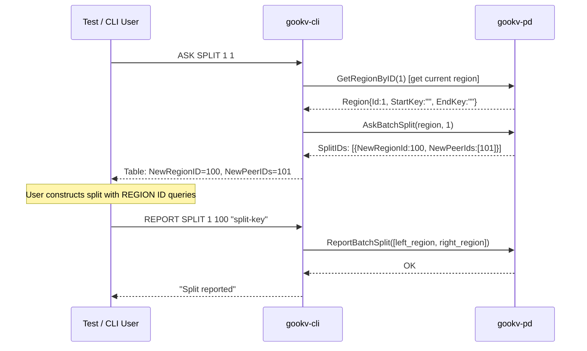

# E2E CLI Migration: CLI Additions

This document specifies all additions to `gookv-cli` required by the e2e migration: the `--addr` flag, 9 new commands, interface extensions, and parser changes.

## 1. `--addr` Flag Specification

### Flag Definition

```go
// In main.go, add alongside existing flags:
addrFlag := flag.String("addr", "", "Connect directly to KV node gRPC endpoint (bypasses PD)")
```

### Mutual Exclusion

`--addr` and `--pd` are mutually exclusive. If both are specified, the CLI exits with an error:

```go
if *addrFlag != "" && *pdFlag != defaultPD {
    fmt.Fprintln(os.Stderr, "error: --addr and --pd are mutually exclusive")
    os.Exit(1)
}
```

Note: The default value of `--pd` is `"127.0.0.1:2379"`. The check compares against `defaultPD` to distinguish "user explicitly set --pd" from "using default". If the user explicitly passes `--pd 127.0.0.1:2379` alongside `--addr`, it still triggers the error. A cleaner approach uses `flag.Visit` to detect whether `--pd` was explicitly set:

```go
pdExplicit := false
flag.Visit(func(f *flag.Flag) {
    if f.Name == "pd" {
        pdExplicit = true
    }
})
if *addrFlag != "" && pdExplicit {
    fmt.Fprintln(os.Stderr, "error: --addr and --pd are mutually exclusive")
    os.Exit(1)
}
```

### Connection Behavior

When `--addr` is set:

1. Create a `client.Client` with a direct connection to the single KV node address.
2. This requires a new constructor or configuration option in `pkg/client`:

```go
if *addrFlag != "" {
    c, err := client.NewDirectClient(ctx, *addrFlag)
    // ...
}
```

3. Only Raw KV commands and basic admin commands work. PD-dependent commands (`STORE LIST`, `REGION LIST`, `TSO`, etc.) return an error since no PD connection exists.
4. Transaction commands work if the targeted node handles the relevant region (the node serves as the sole TiKV endpoint).

### Implementation in main.go

```go
const defaultPD = "127.0.0.1:2379"

func main() {
    pd := flag.String("pd", defaultPD, "PD server address(es), comma-separated")
    addr := flag.String("addr", "", "Connect directly to KV node gRPC endpoint (bypasses PD)")
    batch := flag.String("c", "", "Execute statement(s) and exit")
    hexMode := flag.Bool("hex", false, "Start in hex display mode")
    showVersion := flag.Bool("version", false, "Print version and exit")
    flag.Parse()

    // ... version check ...

    // Mutual exclusion check
    pdExplicit := false
    flag.Visit(func(f *flag.Flag) {
        if f.Name == "pd" {
            pdExplicit = true
        }
    })
    if *addr != "" && pdExplicit {
        fmt.Fprintln(os.Stderr, "error: --addr and --pd are mutually exclusive")
        os.Exit(1)
    }

    ctx, cancel := signal.NotifyContext(context.Background(), os.Interrupt, syscall.SIGTERM)
    defer cancel()

    var c *client.Client
    var err error
    if *addr != "" {
        c, err = client.NewDirectClient(ctx, *addr)
    } else {
        endpoints := splitEndpoints(*pd)
        c, err = client.NewClient(ctx, client.Config{PDAddrs: endpoints})
    }
    if err != nil {
        fmt.Fprintf(os.Stderr, "ERROR: connect: %v\n", err)
        os.Exit(1)
    }
    defer func() { _ = c.Close() }()

    // ... rest unchanged ...
}
```

## 2. New Commands (9 total)

### 2.1 BOOTSTRAP

- **Syntax**: `BOOTSTRAP <storeID> <addr> [<regionID>]`
- **CmdType**: `CmdBootstrap = 34`
- **Parser**: Match `token[0]="BOOTSTRAP"`, require 2-3 args. Parse `storeID` as uint64, `addr` as string, optional `regionID` as uint64 (defaults to 1).
- **Executor handler**: `execBootstrap(ctx, cmd)`
- **Backing API**: `pdClient.Bootstrap(ctx, &metapb.Store{Id: storeID, Address: addr}, &metapb.Region{Id: regionID, ...})`
- **Output**: `ResultOK` with message `"Bootstrapped store <id> at <addr>"`
- **Example**:
  ```
  > BOOTSTRAP 1 127.0.0.1:20160;
  Bootstrapped store 1 at 127.0.0.1:20160
  ```

### 2.2 PUT STORE

- **Syntax**: `PUT STORE <id> <addr>`
- **CmdType**: `CmdPutStore = 35`
- **Parser**: Match `token[0]="PUT"`, `token[1]="STORE"`. Must be checked **before** the existing `PUT key value` dispatch in `parsePut`.
- **Executor handler**: `execPutStore(ctx, cmd)`
- **Backing API**: `pdClient.PutStore(ctx, &metapb.Store{Id: id, Address: addr})`
- **Output**: `ResultOK` with message `"Registered store <id> at <addr>"`
- **Example**:
  ```
  > PUT STORE 2 127.0.0.1:20161;
  Registered store 2 at 127.0.0.1:20161
  ```

### 2.3 ALLOC ID

- **Syntax**: `ALLOC ID`
- **CmdType**: `CmdAllocID = 36`
- **Parser**: Match `token[0]="ALLOC"`, `token[1]="ID"`. No additional args.
- **Executor handler**: `execAllocID(ctx, cmd)`
- **Backing API**: `pdClient.AllocID(ctx)`
- **Output**: `ResultScalar` with `Scalar = fmt.Sprintf("%d", id)`
- **Example**:
  ```
  > ALLOC ID;
  1000
  ```

### 2.4 IS BOOTSTRAPPED

- **Syntax**: `IS BOOTSTRAPPED`
- **CmdType**: `CmdIsBootstrapped = 37`
- **Parser**: Match `token[0]="IS"`, `token[1]="BOOTSTRAPPED"`. No additional args.
- **Executor handler**: `execIsBootstrapped(ctx, cmd)`
- **Backing API**: `pdClient.IsBootstrapped(ctx)`
- **Output**: `ResultScalar` with `Scalar = "true"` or `"false"`
- **Example**:
  ```
  > IS BOOTSTRAPPED;
  true
  ```

### 2.5 ASK SPLIT

- **Syntax**: `ASK SPLIT <regionID> <count>`
- **CmdType**: `CmdAskSplit = 38`
- **Parser**: Match `token[0]="ASK"`, `token[1]="SPLIT"`. Parse `regionID` as uint64, `count` as uint32.
- **Executor handler**: `execAskSplit(ctx, cmd)`
- **Backing API**: First calls `pdClient.GetRegionByID(ctx, regionID)` to get the full region metadata, then calls `pdClient.AskBatchSplit(ctx, region, count)` to allocate new region/peer IDs.
- **Output**: `ResultTable` with columns `["NewRegionID", "NewPeerIDs"]`
- **Example**:
  ```
  > ASK SPLIT 1 1;
  +-------------+------------+
  | NewRegionID | NewPeerIDs |
  +-------------+------------+
  |         100 | 101        |
  +-------------+------------+
  ```

### 2.6 REPORT SPLIT

- **Syntax**: `REPORT SPLIT <leftRegionID> <rightRegionID> <splitKey>`
- **CmdType**: `CmdReportSplit = 39`
- **Parser**: Match `token[0]="REPORT"`, `token[1]="SPLIT"`. Parse `leftRegionID` and `rightRegionID` as uint64, `splitKey` as bytes.
- **Executor handler**: `execReportSplit(ctx, cmd)`
- **Backing API**: Constructs two `metapb.Region` objects (left: existing region with EndKey=splitKey, right: new region with StartKey=splitKey) and calls `pdClient.ReportBatchSplit(ctx, regions)`.
- **Output**: `ResultOK` with message `"Split reported"`
- **Note**: This is a simplified interface. The full split flow requires the caller to construct region metadata from ASK SPLIT output. For test use, region metadata can be fetched via `REGION ID` commands before calling REPORT SPLIT.
- **Example**:
  ```
  > REPORT SPLIT 1 100 "split-key";
  Split reported
  ```

### 2.7 STORE HEARTBEAT

- **Syntax**: `STORE HEARTBEAT <storeID> [REGIONS <count>]`
- **CmdType**: `CmdStoreHeartbeat = 40`
- **Parser**: Match `token[0]="STORE"`, `token[1]="HEARTBEAT"`. Parse `storeID` as uint64. If `token[3]="REGIONS"`, parse `token[4]` as uint32.
- **Executor handler**: `execStoreHeartbeat(ctx, cmd)`
- **Backing API**: `pdClient.StoreHeartbeat(ctx, &pdpb.StoreStats{StoreId: storeID, RegionCount: count})`
- **Output**: `ResultOK`
- **Example**:
  ```
  > STORE HEARTBEAT 1 REGIONS 5;
  OK
  ```

### 2.8 GC SAFEPOINT SET

- **Syntax**: `GC SAFEPOINT SET <timestamp>`
- **CmdType**: Reuse `CmdGCSafepoint = 26` with subcommand detection
- **Parser**: Extend existing `parseGC`: if `token[2]="SET"`, parse `token[3]` as uint64 timestamp. Store the timestamp in `IntArg` and signal SET mode via `StrArg = "SET"`.
- **Executor handler**: Extend `execGCSafePoint` to check `cmd.StrArg == "SET"` and branch to the update path.
- **Backing API**: `pdClient.UpdateGCSafePoint(ctx, timestamp)`
- **Output**: `ResultScalar` with `Scalar = fmt.Sprintf("%d", newSafePoint)`
- **Example**:
  ```
  > GC SAFEPOINT SET 435712483958743040;
  435712483958743040
  ```

### 2.9 BSCAN

- **Syntax**: `BSCAN <start1> <end1> [<start2> <end2> ...] [EACH_LIMIT <n>]`
- **CmdType**: `CmdBatchScan = 41`
- **Parser**: Match `token[0]="BSCAN"`. Collect range pairs (start, end) from subsequent tokens. If `EACH_LIMIT` keyword is found, parse the following token as int. Minimum 1 range pair required.
- **Executor handler**: `execBatchScan(ctx, cmd)`
- **Backing API**: `rawKV.BatchScan(ctx, ranges, eachLimit)` -- this requires adding `BatchScan` to the `rawKVAPI` interface and implementing it in `pkg/client`.
- **Output**: `ResultRows` (same format as SCAN -- key/value pairs)
- **Example**:
  ```
  > BSCAN a c m p EACH_LIMIT 10;
  +---------+---------+
  | Key     | Value   |
  +---------+---------+
  | apple   | red     |
  | banana  | yellow  |
  | mango   | orange  |
  +---------+---------+
  (3 rows)
  ```

## 3. Interface Extensions

### pdAPI Interface

Add to the existing `pdAPI` interface in `executor.go`:

```go
type pdAPI interface {
    // Existing methods
    GetTS(ctx context.Context) (pdclient.TimeStamp, error)
    GetRegion(ctx context.Context, key []byte) (*metapb.Region, *metapb.Peer, error)
    GetRegionByID(ctx context.Context, regionID uint64) (*metapb.Region, *metapb.Peer, error)
    GetStore(ctx context.Context, storeID uint64) (*metapb.Store, error)
    GetAllStores(ctx context.Context) ([]*metapb.Store, error)
    GetGCSafePoint(ctx context.Context) (uint64, error)
    GetClusterID(ctx context.Context) uint64

    // New methods for e2e migration
    Bootstrap(ctx context.Context, store *metapb.Store, region *metapb.Region) (*pdpb.BootstrapResponse, error)
    IsBootstrapped(ctx context.Context) (bool, error)
    PutStore(ctx context.Context, store *metapb.Store) error
    AllocID(ctx context.Context) (uint64, error)
    AskBatchSplit(ctx context.Context, region *metapb.Region, count uint32) (*pdpb.AskBatchSplitResponse, error)
    ReportBatchSplit(ctx context.Context, regions []*metapb.Region) error
    StoreHeartbeat(ctx context.Context, stats *pdpb.StoreStats) error
    UpdateGCSafePoint(ctx context.Context, safePoint uint64) (uint64, error)
}
```

### rawKVAPI Interface

Add to the existing `rawKVAPI` interface in `executor.go`:

```go
type rawKVAPI interface {
    // Existing methods
    Get(ctx context.Context, key []byte) ([]byte, bool, error)
    Put(ctx context.Context, key, value []byte) error
    PutWithTTL(ctx context.Context, key, value []byte, ttl uint64) error
    Delete(ctx context.Context, key []byte) error
    GetKeyTTL(ctx context.Context, key []byte) (uint64, error)
    BatchGet(ctx context.Context, keys [][]byte) ([]client.KvPair, error)
    BatchPut(ctx context.Context, pairs []client.KvPair) error
    BatchDelete(ctx context.Context, keys [][]byte) error
    Scan(ctx context.Context, startKey, endKey []byte, limit int) ([]client.KvPair, error)
    DeleteRange(ctx context.Context, startKey, endKey []byte) error
    CompareAndSwap(ctx context.Context, key, value, prevValue []byte, prevNotExist bool) (bool, []byte, error)
    Checksum(ctx context.Context, startKey, endKey []byte) (uint64, uint64, uint64, error)

    // New method for BSCAN
    BatchScan(ctx context.Context, ranges []client.KeyRange, eachLimit int) ([]client.KvPair, error)
}
```

### New Types in pkg/client

```go
// KeyRange represents a key range for BatchScan.
type KeyRange struct {
    StartKey []byte
    EndKey   []byte
}
```

### pdclient.Client Compatibility

The new `pdAPI` methods must be satisfied by `pdclient.Client`. Verify that these methods already exist on the PD client (they likely do, as they correspond to PD RPCs already implemented for the raftstore). If any are missing from the Go wrapper, they must be added to `pkg/pdclient` as well.

## 4. ASK SPLIT -> REPORT SPLIT Flow

The split workflow requires two CLI commands used together:



### Typical Test Usage

```bash
# 1. Ask PD to allocate IDs for a new region (split region 1 into 1 new region)
gookv-cli --pd 127.0.0.1:2379 -c "ASK SPLIT 1 1;"

# 2. Report the split to PD with the split key
gookv-cli --pd 127.0.0.1:2379 -c 'REPORT SPLIT 1 100 "split-key";'

# 3. Verify the split took effect
gookv-cli --pd 127.0.0.1:2379 -c "REGION LIST;"
```

### Implementation Notes

- `ASK SPLIT` is a read-only operation that allocates IDs. It does not modify region metadata.
- `REPORT SPLIT` tells PD that a split has occurred. The executor fetches current region metadata for both the left (existing) and right (new) regions to construct the `ReportBatchSplit` request.
- For the simplified CLI interface, `REPORT SPLIT` internally calls `GetRegionByID` for the left region to get its current metadata, then constructs the right region from the allocated IDs.

## 5. Command Summary Table

| # | Command | CmdType | Handler | Backing API | Output |
|---|---------|---------|---------|-------------|--------|
| 1 | `--addr <host:port>` | (flag) | main.go | client.NewDirectClient | -- |
| 2 | `BOOTSTRAP <sid> <addr> [<rid>]` | CmdBootstrap (34) | execBootstrap | pdclient.Bootstrap | ResultOK |
| 3 | `PUT STORE <id> <addr>` | CmdPutStore (35) | execPutStore | pdclient.PutStore | ResultOK |
| 4 | `ALLOC ID` | CmdAllocID (36) | execAllocID | pdclient.AllocID | ResultScalar |
| 5 | `IS BOOTSTRAPPED` | CmdIsBootstrapped (37) | execIsBootstrapped | pdclient.IsBootstrapped | ResultScalar |
| 6 | `ASK SPLIT <rid> <count>` | CmdAskSplit (38) | execAskSplit | pdclient.AskBatchSplit | ResultTable |
| 7 | `REPORT SPLIT <left> <right> <key>` | CmdReportSplit (39) | execReportSplit | pdclient.ReportBatchSplit | ResultOK |
| 8 | `STORE HEARTBEAT <sid> [REGIONS <n>]` | CmdStoreHeartbeat (40) | execStoreHeartbeat | pdclient.StoreHeartbeat | ResultOK |
| 9 | `GC SAFEPOINT SET <ts>` | CmdGCSafepoint (26) | execGCSafePoint (ext) | pdclient.UpdateGCSafePoint | ResultScalar |
| 10 | `BSCAN <ranges...> [EACH_LIMIT <n>]` | CmdBatchScan (41) | execBatchScan | rawKV.BatchScan | ResultRows |

## 6. Parser Changes Summary

### New Keyword Dispatches

Add the following cases to the `switch keyword` block in `ParseCommand`:

```go
case "BOOTSTRAP":
    return parseBootstrap(args)
case "ALLOC":
    return parseAlloc(args)
case "IS":
    return parseIs(args)
case "ASK":
    return parseAsk(args)
case "REPORT":
    return parseReport(args)
case "BSCAN":
    return parseBScan(args)
```

### Extended Dispatches

Three existing keyword handlers need modification:

#### PUT: `PUT STORE` vs `PUT key value`

The `parsePut` function must check whether `token[1]` is `"STORE"` before falling through to key-value PUT:

```go
func parsePut(args []Token) (Command, error) {
    if len(args) >= 2 && strings.ToUpper(string(args[0].Value)) == "STORE" {
        return parsePutStore(args[1:])
    }
    // ... existing PUT key value logic ...
}
```

#### STORE: `STORE HEARTBEAT` vs `STORE LIST/STATUS`

The `parseStore` function must add a `"HEARTBEAT"` case:

```go
func parseStore(args []Token) (Command, error) {
    if len(args) == 0 {
        return Command{}, fmt.Errorf("STORE requires a subcommand (LIST, STATUS, or HEARTBEAT)")
    }
    sub := strings.ToUpper(string(args[0].Value))
    switch sub {
    case "LIST":
        // ... existing ...
    case "STATUS":
        // ... existing ...
    case "HEARTBEAT":
        return parseStoreHeartbeat(args[1:])
    default:
        return Command{}, fmt.Errorf("unknown STORE subcommand: %s (expected LIST, STATUS, or HEARTBEAT)", sub)
    }
}
```

#### GC: `GC SAFEPOINT SET` vs `GC SAFEPOINT`

The `parseGC` function must detect the `SET` subcommand:

```go
func parseGC(args []Token) (Command, error) {
    if len(args) == 0 || strings.ToUpper(string(args[0].Value)) != "SAFEPOINT" {
        return Command{}, fmt.Errorf("GC requires subcommand SAFEPOINT")
    }
    if len(args) == 1 {
        // GC SAFEPOINT (read)
        return Command{Type: CmdGCSafepoint}, nil
    }
    if len(args) == 3 && strings.ToUpper(string(args[1].Value)) == "SET" {
        // GC SAFEPOINT SET <timestamp>
        ts, err := strconv.ParseUint(string(args[2].Value), 10, 64)
        if err != nil {
            return Command{}, fmt.Errorf("GC SAFEPOINT SET: invalid timestamp: %s", args[2].Raw)
        }
        return Command{Type: CmdGCSafepoint, IntArg: int64(ts), StrArg: "SET"}, nil
    }
    return Command{}, fmt.Errorf("GC SAFEPOINT: unexpected arguments (expected: GC SAFEPOINT [SET <timestamp>])")
}
```

### New Parser Functions

```go
func parseBootstrap(args []Token) (Command, error)       // BOOTSTRAP <storeID> <addr> [<regionID>]
func parsePutStore(args []Token) (Command, error)         // (after "STORE" detected): <id> <addr>
func parseAlloc(args []Token) (Command, error)            // ALLOC ID
func parseIs(args []Token) (Command, error)               // IS BOOTSTRAPPED
func parseAsk(args []Token) (Command, error)              // ASK SPLIT <regionID> <count>
func parseReport(args []Token) (Command, error)           // REPORT SPLIT <left> <right> <key>
func parseStoreHeartbeat(args []Token) (Command, error)   // (after "HEARTBEAT" detected): <storeID> [REGIONS <n>]
func parseBScan(args []Token) (Command, error)            // BSCAN <ranges...> [EACH_LIMIT <n>]
```

### New CommandType Constants

```go
const (
    // ... existing constants (0-33) ...

    CmdBootstrap      CommandType = 34  // BOOTSTRAP <storeID> <addr> [<regionID>]
    CmdPutStore       CommandType = 35  // PUT STORE <id> <addr>
    CmdAllocID        CommandType = 36  // ALLOC ID
    CmdIsBootstrapped CommandType = 37  // IS BOOTSTRAPPED
    CmdAskSplit       CommandType = 38  // ASK SPLIT <regionID> <count>
    CmdReportSplit    CommandType = 39  // REPORT SPLIT <left> <right> <key>
    CmdStoreHeartbeat CommandType = 40  // STORE HEARTBEAT <storeID> [REGIONS <n>]
    CmdBatchScan      CommandType = 41  // BSCAN <ranges...> [EACH_LIMIT <n>]
)
```

Note: `CmdGCSafepoint` (existing, value 26) is reused for `GC SAFEPOINT SET` with `StrArg = "SET"` as the discriminator, so no new constant is needed for that command.

### Executor Dispatch Additions

Add to the `switch cmd.Type` in `Exec()`:

```go
case CmdBootstrap:
    return e.execBootstrap(ctx, cmd)
case CmdPutStore:
    return e.execPutStore(ctx, cmd)
case CmdAllocID:
    return e.execAllocID(ctx, cmd)
case CmdIsBootstrapped:
    return e.execIsBootstrapped(ctx, cmd)
case CmdAskSplit:
    return e.execAskSplit(ctx, cmd)
case CmdReportSplit:
    return e.execReportSplit(ctx, cmd)
case CmdStoreHeartbeat:
    return e.execStoreHeartbeat(ctx, cmd)
case CmdBatchScan:
    return e.execBatchScan(ctx, cmd)
```

The existing `CmdGCSafepoint` case already dispatches to `execGCSafePoint`, which will be extended to handle the SET subcommand.

### HELP Text Updates

Add new commands to the `helpText` constant:

```
PD Admin Commands:
  BOOTSTRAP <storeID> <addr> [<rid>]  Bootstrap a store with PD
  PUT STORE <id> <addr>               Register a store with PD
  ALLOC ID                            Allocate a unique ID from PD
  IS BOOTSTRAPPED                     Check if cluster is bootstrapped
  ASK SPLIT <regionID> <count>        Request split IDs from PD
  REPORT SPLIT <left> <right> <key>   Report a completed split to PD
  STORE HEARTBEAT <sid> [REGIONS <n>] Send store heartbeat to PD
  GC SAFEPOINT SET <timestamp>        Update GC safe point

Raw KV Commands:
  BSCAN <s1> <e1> ... [EACH_LIMIT <n>]  Batch scan multiple ranges
```
