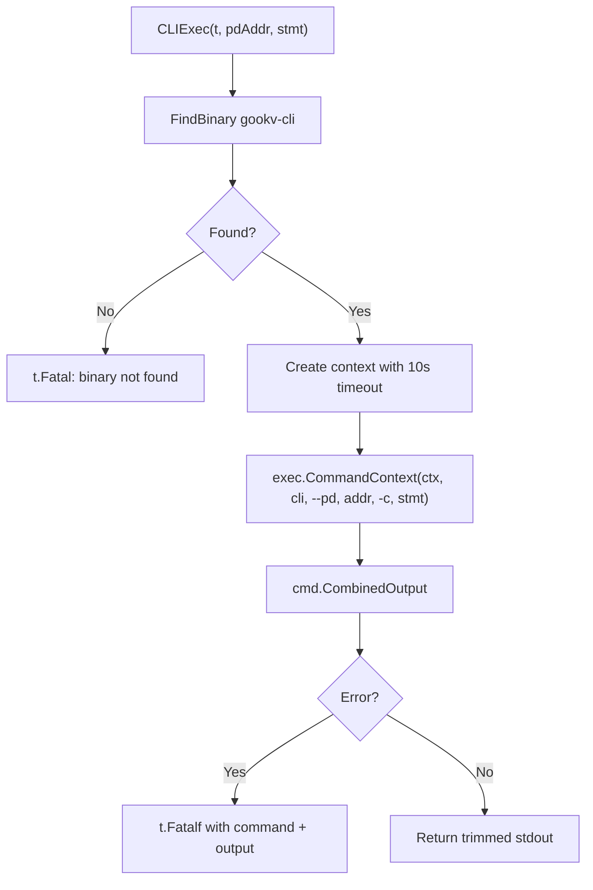
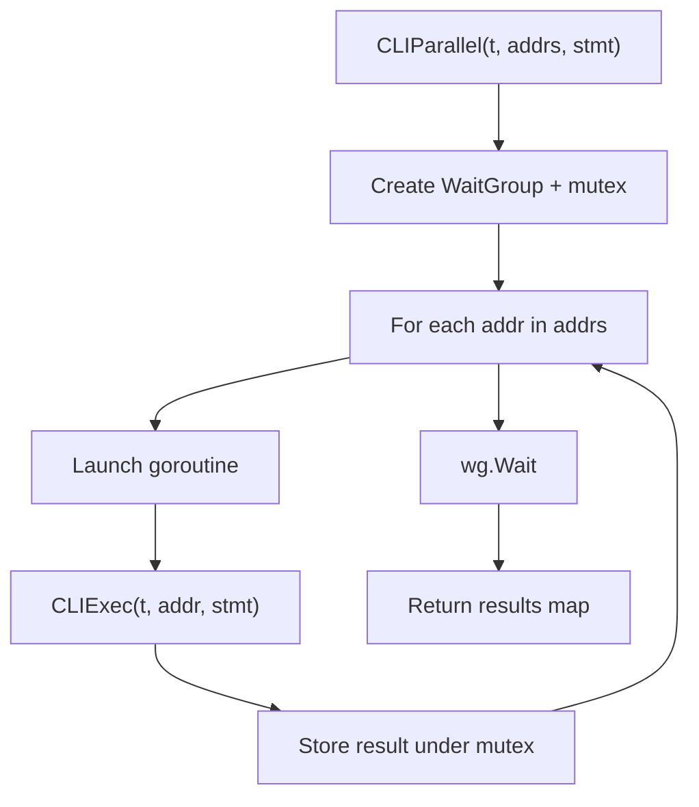

# Document 3: e2elib Enhancements for CLI-Based E2E Testing

This document specifies the new functions and utilities to add to `pkg/e2elib/` that enable e2e tests to interact with the cluster through `gookv-cli` instead of direct gRPC/library calls.

---

## 1. CLI Binary Discovery

Extend the existing `FindBinary` function in `pkg/e2elib/binary.go` to support the `gookv-cli` binary.

Add a new entry to the `envVarNames` map:

```go
var envVarNames = map[string]string{
    "gookv-server": "GOOKV_SERVER_BIN",
    "gookv-pd":     "GOOKV_PD_BIN",
    "gookv-ctl":    "GOOKV_CTL_BIN",
    "gookv-cli":    "GOOKV_CLI_BIN",  // NEW
}
```

`FindBinary` searches the following locations in order:

1. **Environment variable** -- e.g. `GOOKV_CLI_BIN=/usr/local/bin/gookv-cli`
2. **Repository root** -- `<repo-root>/gookv-cli` (built binary next to `go.mod`)
3. **`$PATH`** -- `exec.LookPath("gookv-cli")`

No other changes to `FindBinary` are required; the existing search logic already handles all three strategies. Only the map entry is new.

---

## 2. Core CLI Execution Functions

All new functions live in a new file: `pkg/e2elib/cli.go`.

### 2.1 CLIExec

```go
// CLIExec executes a gookv-cli statement against a PD-connected cluster.
// Returns stdout. Fatals on non-zero exit or timeout.
func CLIExec(t *testing.T, pdAddr string, stmt string) string
```

**Implementation outline:**

```go
func CLIExec(t *testing.T, pdAddr string, stmt string) string {
    t.Helper()
    cliBin := FindBinary("gookv-cli")
    if cliBin == "" {
        t.Fatal("gookv-cli binary not found")
    }
    ctx, cancel := context.WithTimeout(context.Background(), 30*time.Second)
    defer cancel()
    cmd := exec.CommandContext(ctx, cliBin, "--pd", pdAddr, "-c", stmt)
    out, err := cmd.CombinedOutput()
    if err != nil {
        t.Fatalf("CLIExec(%q) failed: %v\nOutput: %s", stmt, err, string(out))
    }
    return strings.TrimSpace(string(out))
}
```

**Flow:**



### 2.2 CLINodeExec

```go
// CLINodeExec executes a gookv-cli statement against a specific KV node (--addr).
// Used for tests that previously used DialTikvClient.
func CLINodeExec(t *testing.T, nodeAddr string, stmt string) string
```

Identical to `CLIExec` except it passes `--addr` instead of `--pd`:

```go
cmd := exec.CommandContext(ctx, cliBin, "--addr", nodeAddr, "-c", stmt)
```

This targets a single TiKV node directly, bypassing PD region routing. Useful for raw KV tests and tests that verify per-node behavior.

### 2.3 CLIExecRaw (optional)

```go
// CLIExecRaw executes and returns (stdout, stderr, error) without fatal.
// Used by polling helpers that expect transient failures.
func CLIExecRaw(t *testing.T, pdAddr string, stmt string) (string, string, error)
```

**Implementation outline:**

```go
func CLIExecRaw(t *testing.T, pdAddr string, stmt string) (string, string, error) {
    t.Helper()
    cliBin := FindBinary("gookv-cli")
    if cliBin == "" {
        t.Fatal("gookv-cli binary not found")
    }
    ctx, cancel := context.WithTimeout(context.Background(), 30*time.Second)
    defer cancel()
    cmd := exec.CommandContext(ctx, cliBin, "--pd", pdAddr, "-c", stmt)
    var stdout, stderr bytes.Buffer
    cmd.Stdout = &stdout
    cmd.Stderr = &stderr
    err := cmd.Run()
    return strings.TrimSpace(stdout.String()), strings.TrimSpace(stderr.String()), err
}
```

This is the foundation for polling helpers -- they call `CLIExecRaw` in a loop and tolerate transient errors until a condition is met or a timeout expires.

---

## 3. Convenience Wrappers

These wrappers encode knowledge of the CLI command syntax and output format so that test code stays concise and readable.

### CLIPut

```go
// CLIPut writes a key-value pair via CLI PUT command.
func CLIPut(t *testing.T, pdAddr string, key, value string) {
    t.Helper()
    CLIExec(t, pdAddr, fmt.Sprintf("PUT %s %s", key, value))
}
```

### CLIGet

```go
// CLIGet reads a key via CLI GET command. Returns (value, found).
func CLIGet(t *testing.T, pdAddr string, key string) (string, bool) {
    t.Helper()
    out := CLIExec(t, pdAddr, fmt.Sprintf("GET %s", key))
    if strings.Contains(out, "not found") {
        return "", false
    }
    return parseScalar(out), true
}
```

**Output parsing logic for CLIGet:**

| CLI output | Return value |
|---|---|
| Contains "not found" | `("", false)` |
| Otherwise | `(parseScalar(out), true)` |

### CLIScan

```go
// CLIScan executes SCAN and returns key-value pairs.
func CLIScan(t *testing.T, pdAddr string, startKey, endKey string, limit int) []KVPair {
    t.Helper()
    stmt := fmt.Sprintf("SCAN %s %s LIMIT %d", startKey, endKey, limit)
    out := CLIExec(t, pdAddr, stmt)
    return parseKVRows(out)
}
```

### CLIBatchGet

```go
// CLIBatchGet executes BGET and returns key-value pairs.
func CLIBatchGet(t *testing.T, pdAddr string, keys ...string) []KVPair {
    t.Helper()
    stmt := fmt.Sprintf("BGET %s", strings.Join(keys, " "))
    out := CLIExec(t, pdAddr, stmt)
    return parseKVRows(out)
}
```

### CLIDelete

```go
// CLIDelete deletes a key via CLI DELETE command.
func CLIDelete(t *testing.T, pdAddr string, key string) {
    t.Helper()
    CLIExec(t, pdAddr, fmt.Sprintf("DELETE %s", key))
}
```

### Node-Targeted Variants

Corresponding `CLINode*` variants use `CLINodeExec` instead of `CLIExec`:

```go
func CLINodePut(t *testing.T, nodeAddr string, key, value string)
func CLINodeGet(t *testing.T, nodeAddr string, key string) (string, bool)
func CLINodeScan(t *testing.T, nodeAddr string, startKey, endKey string, limit int) []KVPair
func CLINodeDelete(t *testing.T, nodeAddr string, key string)
```

These have identical implementations but call `CLINodeExec` (which uses `--addr`) instead of `CLIExec` (which uses `--pd`).

---

## 4. Polling/Waiting Helpers

### CLIWaitForCondition

```go
// CLIWaitForCondition polls a CLI command until checkFn returns true.
// Internally reuses WaitForCondition from helpers.go.
func CLIWaitForCondition(t *testing.T, pdAddr string, stmt string,
    checkFn func(output string) bool, timeout time.Duration) {
    t.Helper()
    WaitForCondition(t, timeout, fmt.Sprintf("CLI: %s", stmt), func() bool {
        out, _, err := CLIExecRaw(t, pdAddr, stmt)
        if err != nil {
            return false // transient failure, retry
        }
        return checkFn(out)
    })
}
```

This bridges the existing `WaitForCondition` infrastructure with CLI-based polling. Transient CLI errors (timeout, connection refused during leader failover) are swallowed and treated as "condition not yet met."

### CLIWaitForStoreCount

```go
// CLIWaitForStoreCount waits until STORE LIST shows at least minCount stores.
// Returns the actual store count once the condition is met.
func CLIWaitForStoreCount(t *testing.T, pdAddr string, minCount int, timeout time.Duration) int
```

**Output parsing:** Count non-header rows in `STORE LIST` output. A data row matches the regex `^\s*\d+` (starts with a store ID number).

### CLIWaitForRegionLeader

```go
// CLIWaitForRegionLeader waits until REGION <key> shows a leader, returns leader store ID.
func CLIWaitForRegionLeader(t *testing.T, pdAddr string, key string, timeout time.Duration) uint64
```

**Output parsing:** Parse `REGION <key>` output for leader store ID. Regex: `store_id=(\d+)`. Returns 0 while no leader is found (treated as "condition not met").

### CLIWaitForRegionCount

```go
// CLIWaitForRegionCount waits until REGION LIST shows at least minCount regions.
// Returns the actual region count once the condition is met.
func CLIWaitForRegionCount(t *testing.T, pdAddr string, minCount int, timeout time.Duration) int
```

**Output parsing:** Count non-header rows in `REGION LIST` output, same approach as store counting.

### Summary of Output Parsing Patterns

| Command | Parsing strategy | Regex / heuristic |
|---|---|---|
| `STORE LIST` | Count data rows | Lines matching `^\s*\d+` |
| `REGION <key>` | Extract leader store ID | `store_id=(\d+)` |
| `REGION LIST` | Count data rows | Lines matching `^\s*\d+` |

---

## 5. Parallel Execution

```go
// CLIParallel executes a CLI statement against multiple PD addresses concurrently.
// Returns results indexed by address.
func CLIParallel(t *testing.T, addrs []string, stmt string) map[string]string
```

**Implementation:**

```go
func CLIParallel(t *testing.T, addrs []string, stmt string) map[string]string {
    t.Helper()
    results := make(map[string]string)
    var mu sync.Mutex
    var wg sync.WaitGroup
    for _, addr := range addrs {
        wg.Add(1)
        go func(a string) {
            defer wg.Done()
            out := CLIExec(t, a, stmt)
            mu.Lock()
            results[a] = out
            mu.Unlock()
        }(addr)
    }
    wg.Wait()
    return results
}
```

**Flow:**



**Use case:** PD replication tests that need to verify the same query against multiple PD nodes (e.g., `TSO` on every follower, `STORE STATUS` on every node).

---

## 6. Output Parsing Utilities

These are internal (unexported) helpers in `pkg/e2elib/cli.go` that parse the structured text output from `gookv-cli`.

### KVPair

```go
// KVPair represents a parsed key-value pair from CLI output.
type KVPair struct {
    Key   string
    Value string
}
```

### parseTableOutput

```go
// parseTableOutput parses gookv-cli table format output into rows.
// Splits on newlines, skips border lines (starting with +---) and header lines.
// Returns a slice of rows, each row being a slice of column values.
func parseTableOutput(output string) [][]string
```

Expected table format from gookv-cli:

```
+-------+--------+
| Key   | Value  |
+-------+--------+
| key1  | val1   |
| key2  | val2   |
+-------+--------+
```

Parsing rules:
1. Split output by newlines
2. Skip lines starting with `+` (border rows)
3. Skip the first `|`-delimited line (header row)
4. For remaining `|`-delimited lines, split by `|` and trim whitespace from each cell

### parseKVRows

```go
// parseKVRows extracts KVPairs from SCAN/BGET table output.
// Assumes columns are: Key, Value (in that order).
func parseKVRows(output string) []KVPair
```

Calls `parseTableOutput` and maps each row to a `KVPair{Key: row[0], Value: row[1]}`.

### parseScalar

```go
// parseScalar extracts a single scalar value from CLI output.
// For simple outputs like GET, strips any prefix label and returns the value.
func parseScalar(output string) string
```

Handles output formats like:
- `value1` (plain value)
- `Value: value1` (labeled value, strip the `Value: ` prefix)

### countTableRows

```go
// countTableRows counts data rows in table output (excludes headers/borders).
func countTableRows(output string) int
```

Returns `len(parseTableOutput(output))`.

---

## 7. Backward-Compatible Migration Path

### Recommendation: Add New Functions, Do Not Modify Existing Ones

Existing helpers like `PutAndVerify`, `ScanAndVerify`, etc. work with `*client.RawKVClient` and will continue to be used by tests that have not yet been migrated.

**Do NOT modify existing helper signatures.** Instead:

- Tests migrated to CLI use the new `CLI*` functions directly.
- Unmigrated tests continue using the old library-based helpers unchanged.
- Category F tests (protocol-level inspection) will never migrate and always use the old helpers.

```go
// Example: PutAndVerify stays unchanged
func PutAndVerify(t *testing.T, rawKV *client.RawKVClient, key, value []byte) {
    // Existing implementation stays unchanged
    // New CLI-based tests use CLIPut + CLIGet directly
}
```

### Coexistence Strategy

| Test category | Helper style | Migration status |
|---|---|---|
| Category A (RawKV via PD) | `CLIPut` / `CLIGet` / `CLIScan` | Migrated |
| Category B (RawKV via node) | `CLINodePut` / `CLINodeGet` | Migrated |
| Category C (PD admin reads) | `CLIExec` with admin commands | Migrated |
| Category D (hybrid) | `CLI*` for KV + Go for process mgmt | Migrated |
| Category C (PD admin) | `CLIExec` with PD write commands | Migrated |
| Category F (protocol-level) | Existing gRPC helpers | Not migrated, stays as-is |

This approach allows incremental migration without breaking anything. Each test file can be migrated independently, and CI runs both old and new tests throughout the transition.

---

## File Layout Summary

| File | Contents |
|---|---|
| `pkg/e2elib/binary.go` | Add `"gookv-cli": "GOOKV_CLI_BIN"` to `envVarNames` |
| `pkg/e2elib/cli.go` | **New file.** All `CLI*` functions, `KVPair`, parse utilities |
| `pkg/e2elib/helpers.go` | Unchanged. `WaitForCondition` reused by `CLIWaitForCondition` |
