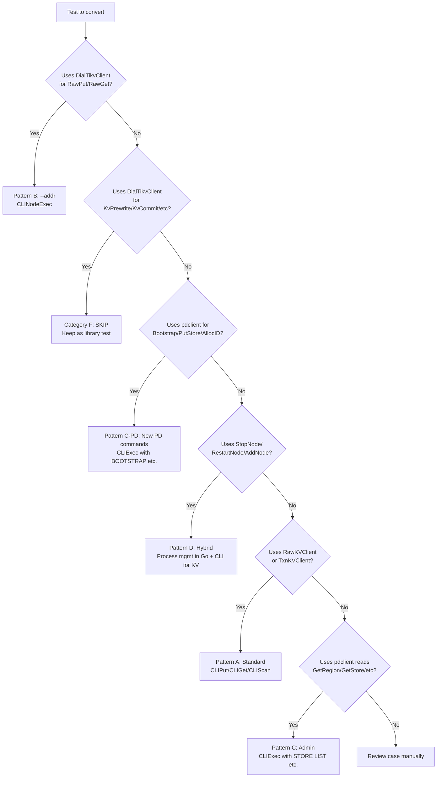

# Document 4: Test Conversion Guide

This document provides the decision tree, conversion patterns, per-file specifications, and phased rollout plan for migrating e2e tests from library-based gRPC calls to CLI-based execution.

---

## 1. Conversion Pattern Decision Tree

Use this flowchart to determine which conversion pattern applies to a given test:



**Reading the tree:**

1. Start at the top with any test function.
2. Follow the first "Yes" branch that matches.
3. The leaf node tells you which conversion pattern to apply (or whether to skip).

---

## 2. Conversion Patterns with Before/After Examples

### Pattern A: RawKVClient to CLI Wrappers

**Applies to:** Tests that use `cluster.RawKV()` or a `RawKVClient` obtained via PD for Put/Get/Scan/Delete operations.

**Before:**

```go
func TestClientRegionCacheMiss(t *testing.T) {
    cluster := newClientCluster(t)
    rawKV := cluster.RawKV()

    err := rawKV.Put(ctx, []byte("key1"), []byte("val1"))
    require.NoError(t, err)

    val, found, err := rawKV.Get(ctx, []byte("key1"))
    require.NoError(t, err)
    require.True(t, found)
    require.Equal(t, []byte("val1"), val)
}
```

**After:**

```go
func TestClientRegionCacheMiss(t *testing.T) {
    cluster := newClientCluster(t)
    pdAddr := cluster.PD().Addr()

    CLIPut(t, pdAddr, "key1", "val1")

    val, found := CLIGet(t, pdAddr, "key1")
    require.True(t, found)
    require.Equal(t, "val1", val)
}
```

**Key changes:**
- Replace `cluster.RawKV()` with `cluster.PD().Addr()`
- Replace `rawKV.Put(ctx, key, val)` with `CLIPut(t, pdAddr, key, val)`
- Replace `rawKV.Get(ctx, key)` with `CLIGet(t, pdAddr, key)`
- No more `err` returns to check -- `CLI*` functions fatal on error
- Keys and values are strings, not `[]byte`

---

### Pattern B: DialTikvClient to CLINodeExec with --addr

**Applies to:** Tests that connect directly to a single TiKV node via `DialTikvClient` for raw KV operations.

**Before:**

```go
func TestRawKVPutGetDelete(t *testing.T) {
    node := e2elib.NewStandaloneNode(t)
    client := e2elib.DialTikvClient(t, node.Addr())

    _, err := client.RawPut(ctx, &kvrpcpb.RawPutRequest{
        Key: []byte("raw-key-1"), Value: []byte("raw-value-1"),
    })
    require.NoError(t, err)

    getResp, err := client.RawGet(ctx, &kvrpcpb.RawGetRequest{
        Key: []byte("raw-key-1"),
    })
    require.NoError(t, err)
    require.Equal(t, []byte("raw-value-1"), getResp.GetValue())
}
```

**After:**

```go
func TestRawKVPutGetDelete(t *testing.T) {
    node := e2elib.NewStandaloneNode(t)
    addr := node.Addr()

    CLINodeExec(t, addr, "PUT raw-key-1 raw-value-1")

    val, found := CLINodeGet(t, addr, "raw-key-1")
    require.True(t, found)
    require.Equal(t, "raw-value-1", val)
}
```

**Key changes:**
- Replace `DialTikvClient(t, addr)` with just using `addr` directly
- Replace `client.RawPut(ctx, &kvrpcpb.RawPutRequest{...})` with `CLINodeExec(t, addr, "PUT ...")`
- Replace `client.RawGet(ctx, &kvrpcpb.RawGetRequest{...})` with `CLINodeGet(t, addr, key)`
- No protobuf imports needed

---

### Pattern C: PD Read Queries to CLI Admin Commands

**Applies to:** Tests that use `pdclient` for read-only queries like `GetAllStores`, `GetRegion`, `GetTS`.

**Before:**

```go
func TestPDStoreRegistration(t *testing.T) {
    cluster := newClusterWithLeader(t)
    pd := cluster.PD().Client()

    stores, err := pd.GetAllStores(ctx)
    require.NoError(t, err)
    require.Equal(t, 3, len(stores))
}
```

**After:**

```go
func TestPDStoreRegistration(t *testing.T) {
    cluster := newClusterWithLeader(t)
    pdAddr := cluster.PD().Addr()

    out := CLIExec(t, pdAddr, "STORE LIST")
    count := countTableRows(out)
    require.Equal(t, 3, count)
}
```

**Key changes:**
- Replace `pd.Client()` with `pd.Addr()`
- Replace `pd.GetAllStores(ctx)` with `CLIExec(t, pdAddr, "STORE LIST")` + `countTableRows`
- Output assertions use string parsing instead of protobuf field access

---

### Pattern D: Process Management Hybrid

**Applies to:** Tests that mix KV operations with process lifecycle management (`StopNode`, `RestartNode`, `AddNode`). Process management stays in Go; only KV and admin queries move to CLI.

**Before:**

```go
func TestClusterServerNodeFailure(t *testing.T) {
    cluster := newClusterWithLeader(t)
    rawKV := cluster.RawKV()

    rawKV.Put(ctx, []byte("fail-key"), []byte("fail-val"))
    cluster.StopNode(2)

    e2elib.WaitForCondition(t, 30*time.Second, "read after failure", func() bool {
        val, found, err := rawKV.Get(ctx, []byte("fail-key"))
        return err == nil && found && string(val) == "fail-val"
    })
}
```

**After:**

```go
func TestClusterServerNodeFailure(t *testing.T) {
    cluster := newClusterWithLeader(t)
    pdAddr := cluster.PD().Addr()

    CLIPut(t, pdAddr, "fail-key", "fail-val")
    cluster.StopNode(2)  // Process management stays in Go

    CLIWaitForCondition(t, pdAddr, "GET fail-key", func(out string) bool {
        return strings.Contains(out, "fail-val")
    }, 30*time.Second)
}
```

**Key changes:**
- `StopNode`, `RestartNode`, `AddNode` remain as Go function calls (no CLI equivalent)
- KV operations (Put, Get) move to `CLIPut`, `CLIGet`
- Polling loops move to `CLIWaitForCondition`

---

### Pattern C-PD: PD Admin Writes via New CLI Commands

**Applies to:** Category C tests that use `pdclient` for write operations like `Bootstrap`, `PutStore`, `AllocID`, `AskBatchSplit`, `ReportSplit`. This is a sub-pattern of Category C (PD admin) focused on new CLI commands.

**Before:**

```go
func TestPDServerBootstrapAndTSO(t *testing.T) {
    pd := startPDOnly(t)
    client := pd.Client()

    bootstrapped, err := client.IsBootstrapped(ctx)
    require.NoError(t, err)
    require.False(t, bootstrapped)

    _, err = client.Bootstrap(ctx, store, region)
    require.NoError(t, err)

    ts, err := client.GetTS(ctx)
    require.NoError(t, err)
    require.True(t, ts.Physical > 0)
}
```

**After:**

```go
func TestPDServerBootstrapAndTSO(t *testing.T) {
    pd := startPDOnly(t)
    pdAddr := pd.Addr()

    out := CLIExec(t, pdAddr, "IS BOOTSTRAPPED")
    require.Equal(t, "false", parseScalar(out))

    CLIExec(t, pdAddr, "BOOTSTRAP 1 127.0.0.1:20160")

    out = CLIExec(t, pdAddr, "TSO")
    // TSO output: "physical=<N> logical=<N>"
    require.NotEmpty(t, out)
}
```

**Key changes:**
- Replace `client.IsBootstrapped(ctx)` with `CLIExec(t, pdAddr, "IS BOOTSTRAPPED")`
- Replace `client.Bootstrap(ctx, ...)` with `CLIExec(t, pdAddr, "BOOTSTRAP ...")`
- Replace `client.GetTS(ctx)` with `CLIExec(t, pdAddr, "TSO")`
- Boolean/scalar results extracted via `parseScalar`

---

### Pattern F: Category F -- DO NOT CONVERT

**Applies to:** Tests that inspect gRPC protocol-level fields (e.g., `OnePcCommitTs`, `MinCommitTs`, lock versions, `KvPrewrite`/`KvCommit` request/response details).

**Example (leave unchanged):**

```go
// TestAsyncCommit1PCPrewrite -- Category F: Inspects OnePcCommitTs
// This test verifies gRPC protocol-level behavior. Keep as library test.
func TestAsyncCommit1PCPrewrite(t *testing.T) {
    // ... uses KvPrewrite with TryOnePc flag
    // ... inspects prewriteResp.GetOnePcCommitTs() > 0
    // REASON: OnePcCommitTs is a protocol-internal field with no CLI equivalent
}
```

**Why these stay:** The CLI presents a user-facing abstraction. These tests verify internal protocol behavior that is intentionally hidden from the CLI surface. Converting them would either require exposing internal details through the CLI (bad design) or losing test coverage (unacceptable).

---

## 3. Per-File Conversion Specification

### client_lib_test.go (9 tests -- ALL convert, Category A)

| Test | Pattern | CLI commands used |
|---|---|---|
| TestClientRegionCacheMiss | A | PUT + GET |
| TestClientRegionCacheHit | A | PUT + GET |
| TestClientStoreResolution | A | PUT + GET |
| TestClientBatchGetAcrossRegions | A | PUT + BGET |
| TestClientBatchPutAcrossRegions | A | BPUT + GET |
| TestClientScanAcrossRegions | A | PUT + SCAN |
| TestClientScanWithLimit | A | PUT + SCAN LIMIT |
| TestClientCompareAndSwap | A | PUT + CAS + GET |
| TestClientBatchDeleteAcrossRegions | A | PUT + BDELETE + GET |

**Helper change:** `newClientCluster` -- add `cluster.PD().Addr()` to get `pdAddr`.

---

### cluster_raw_kv_test.go (2 tests -- ALL convert, Category A)

| Test | Pattern | CLI commands used |
|---|---|---|
| TestClusterRawKVOperations | A | PUT + GET + DELETE |
| TestClusterRawKVBatchPutAndScan | A | BPUT + SCAN |

---

### cluster_server_test.go (5 tests -- 3 convert, 2 stay as hybrid)

| Test | Pattern | Category | CLI commands used |
|---|---|---|---|
| TestClusterServerLeaderElection | C | A | REGION key (check leader) |
| TestClusterServerKvOperations | A | A | PUT + GET + DELETE |
| TestClusterServerCrossNodeReplication | B | B | --addr for per-node GET |
| TestClusterServerNodeFailure | D | D | StopNode in Go + CLIPut/CLIWaitForCondition |
| TestClusterServerLeaderFailover | D | D | StopNode in Go + CLIPut/CLIWaitForRegionLeader |

---

### add_node_test.go (4 tests -- ALL convert, Category D)

| Test | Pattern | CLI commands used |
|---|---|---|
| TestAddNode_JoinRegistersWithPD | D | AddNode in Go + STORE LIST via CLI |
| TestAddNode_PDSchedulesRegionToNewStore | D | AddNode in Go + STORE STATUS via CLI |
| TestAddNode_FullMoveLifecycle | D | AddNode in Go + PUT/GET via CLI |
| TestAddNode_MultipleJoinNodes | D | AddNode in Go + STORE LIST + PUT/GET via CLI |

---

### pd_server_test.go (4 tests -- ALL convert, Category C)

| Test | Pattern | CLI commands used |
|---|---|---|
| TestPDServerBootstrapAndTSO | E | IS BOOTSTRAPPED + BOOTSTRAP + TSO + ALLOC ID |
| TestPDServerStoreAndRegionMetadata | E | BOOTSTRAP + PUT STORE + STORE STATUS + REGION ID + REGION |
| TestPDAskBatchSplitAndReport | E | BOOTSTRAP + ASK SPLIT + REPORT SPLIT + REGION |
| TestPDStoreHeartbeat | E | BOOTSTRAP + STORE HEARTBEAT |

---

### pd_cluster_integration_test.go (3 tests -- ALL convert)

| Test | Pattern | Category | CLI commands used |
|---|---|---|---|
| TestPDClusterStoreAndRegionHeartbeat | C | A | STORE LIST + STORE STATUS + REGION |
| TestPDClusterTSOForTransactions | C | A | TSO |
| TestPDClusterGCSafePoint | E | C | GC SAFEPOINT + GC SAFEPOINT SET |

---

### pd_leader_discovery_test.go (3 tests -- ALL convert)

| Test | Pattern | Category | CLI commands used |
|---|---|---|---|
| TestPDStoreRegistration | C | A | STORE LIST |
| TestPDRegionLeaderTracking | C | A | REGION key + STORE STATUS |
| TestPDLeaderFailover | D | D | StopNode in Go + REGION + STORE STATUS via CLI |

---

### pd_replication_test.go (16 tests -- ALL convert)

| Test | Pattern | Category | CLI commands used |
|---|---|---|---|
| TestPDReplication_TSOMonotonicity | C | A | TSO |
| TestPDReplication_RegionHeartbeat | C | A | REGION ID |
| TestPDReplication_LeaderElection | E | C | IS BOOTSTRAPPED + BOOTSTRAP |
| TestPDReplication_WriteForwarding | E | C | PUT STORE on follower --pd, poll STORE STATUS on leader |
| TestPDReplication_Bootstrap | E | C | IS BOOTSTRAPPED per-node via --pd |
| TestPDReplication_SingleNodeCompat | E | C | BOOTSTRAP + TSO + ALLOC ID |
| TestPDReplication_IDAllocMonotonicity | E | C | ALLOC ID 50x |
| TestPDReplication_GCSafePoint | E | C | GC SAFEPOINT SET + per-node GC SAFEPOINT |
| TestPDReplication_AskBatchSplit | E | C | REGION ID + ASK SPLIT |
| TestPDReplication_TSOViaFollower | C | C | TSO per-node via --pd |
| TestPDReplication_TSOViaFollowerForwarding | C | C | TSO per-node via --pd |
| TestPDReplication_RegionHeartbeatViaFollower | C | C | REGION ID per-node via --pd |
| TestPDReplication_5NodeCluster | E | C | BOOTSTRAP + PUT STORE + TSO |
| TestPDReplication_LeaderFailover | D | D | StopNode + PUT STORE + TSO via CLI |
| TestPDReplication_ConcurrentWritesFromMultipleClients | D | D | CLIParallel with ALLOC ID per-node |
| TestPDReplication_CatchUpRecovery | D | D | StopNode + RestartNode + PUT STORE + STORE STATUS per-node |

---

### region_split_test.go (1 test -- convert, Category C)

| Test | Pattern | CLI commands used |
|---|---|---|
| TestRegionSplitWithPD | E | BOOTSTRAP + ASK SPLIT + REPORT SPLIT + REGION + polling |

---

### multi_region_test.go (3 tests -- ALL convert, Category A)

| Test | Pattern | CLI commands used |
|---|---|---|
| TestMultiRegionKeyRouting | C | REGION key + REGION LIST |
| TestMultiRegionIndependentLeaders | C | REGION key (for leader) |
| TestMultiRegionRawKV | A | PUT + GET with CLIWaitForCondition |

---

### multi_region_routing_test.go (6 tests -- 3 convert, 3 stay)

| Test | Pattern | Category | CLI commands used |
|---|---|---|---|
| TestMultiRegionRawKVBatchScan | A | A | PUT + SCAN |
| TestMultiRegionPDCoordinatedSplit | C | A | REGION LIST |
| TestMultiRegionSplitWithLiveTraffic | D | D | PUT/GET + WaitForSplit via CLI |
| TestMultiRegionTransactions | -- | **F: SKIP** | KvPrewrite + KvCommit with explicit startTS |
| TestMultiRegionAsyncCommit | -- | **F: SKIP** | KvPrewrite with UseAsyncCommit, MinCommitTs inspection |
| TestMultiRegionScanLock | -- | **F: SKIP** | KvPrewrite + KvScanLock, lock version inspection |

---

### raw_kv_test.go (3 tests -- ALL convert, Category B)

| Test | Pattern | CLI commands used |
|---|---|---|
| TestRawKVPutGetDelete | B | --addr for PUT/GET/DELETE |
| TestRawKVBatchOperations | B | --addr for BPUT/BGET/SCAN |
| TestRawKVDeleteRange | B | --addr for PUT/DELETE RANGE/GET |

---

### raw_kv_extended_test.go (4 tests -- ALL convert, Category B)

| Test | Pattern | CLI commands used | Notes |
|---|---|---|---|
| TestRawBatchScan | B | --addr for BSCAN | New BSCAN command needed |
| TestRawGetKeyTTL | B | --addr for PUT/TTL | |
| TestRawCompareAndSwap | B | --addr for CAS + GET | Parse Swapped/PrevVal/PrevNotFound |
| TestRawChecksum | B | --addr for PUT/CHECKSUM | Parse totalKvs/totalBytes/checksum |

---

### async_commit_test.go (4 tests -- ALL SKIP, Category F)

| Test | Reason for skipping |
|---|---|
| TestAsyncCommit1PCPrewrite | Inspects `OnePcCommitTs` protocol field |
| TestAsyncCommitPrewrite | Inspects `MinCommitTs` protocol field |
| TestCheckSecondaryLocks | Uses `KvCheckSecondaryLocks` protocol RPC |
| TestScanLock | Uses `KvScanLock` with `maxVersion` filtering |

---

### txn_rpc_test.go (5 tests -- ALL SKIP, Category F)

| Test | Reason for skipping |
|---|---|
| TestTxnPessimisticLockAcquire | Uses `KvPessimisticLock` protocol |
| TestTxnPessimisticRollback | Uses `KVPessimisticRollback` protocol |
| TestTxnHeartBeat | Inspects `KvTxnHeartBeat` LockTtl field |
| TestTxnResolveLock | Uses `KvResolveLock` + versioned `KvGet` |
| TestTxnScanWithVersionVisibility | Uses `KvScan` with MVCC version filtering |

---

### restart_replay_test.go (3 tests -- ALL convert, Category D)

| Test | Pattern | CLI commands used |
|---|---|---|
| TestRestartDataSurvives | D | RestartNode in Go + PUT/GET via CLI |
| TestRestartLeaderFailoverAndReplay | D | StopNode + RestartNode in Go + CLIWaitForRegionLeader + PUT/GET via CLI |
| TestRestartAllNodesDataSurvives | D | StopNode(3x) + RestartNode(3x) in Go + PUT/GET via CLI |

---

## 4. Conversion Order (Phases)

### Phase 1: Foundation (4 days)

**Goal:** `--addr` flag, e2elib CLI wrappers, convert Category A + B tests (32 tests).

**Tasks:**

1. Implement `--addr` flag in `gookv-cli` (direct node connection mode)
2. Add `BSCAN` command to `gookv-cli`
3. Implement core e2elib functions:
   - `CLIExec`, `CLINodeExec`, `CLIExecRaw`
   - `CLIPut`, `CLIGet`, `CLIScan`, `CLIBatchGet`, `CLIDelete`
   - `CLINodePut`, `CLINodeGet`, `CLINodeScan`, `CLINodeDelete`
   - Output parsing: `parseTableOutput`, `parseKVRows`, `parseScalar`, `countTableRows`
4. Convert tests:
   - `client_lib_test.go` (9 tests)
   - `cluster_raw_kv_test.go` (2 tests)
   - `raw_kv_test.go` (3 tests)
   - `raw_kv_extended_test.go` (4 tests)
   - Remaining Category A tests from other files (14 tests)

**Tests converted:** 32

---

### Phase 2: PD Commands (5 days)

**Goal:** New PD admin CLI commands, convert Category C tests (16 tests).

**Tasks:**

1. Implement new CLI commands:
   - `BOOTSTRAP <store_id> <addr>`
   - `PUT STORE <store_id> <addr>`
   - `ALLOC ID`
   - `IS BOOTSTRAPPED`
   - `ASK SPLIT <regionID> <count>`
   - `REPORT SPLIT <leftRegionID> <rightRegionID> <splitKey>`
   - `STORE HEARTBEAT <store_id>`
   - `GC SAFEPOINT SET <safepoint>`
   - `GC SAFEPOINT`
2. Convert tests:
   - `pd_server_test.go` (4 tests)
   - `pd_replication_test.go` Category C tests (10 tests)
   - `region_split_test.go` (1 test)
   - `pd_cluster_integration_test.go` GCSafePoint (1 test)

**Tests converted:** 16

---

### Phase 3: Hybrid (4 days)

**Goal:** Polling/waiting CLI helpers, convert Category D tests (15 tests).

**Tasks:**

1. Implement polling helpers:
   - `CLIWaitForCondition`
   - `CLIWaitForStoreCount`
   - `CLIWaitForRegionLeader`
   - `CLIWaitForRegionCount`
   - `CLIParallel`
2. Convert tests:
   - `add_node_test.go` (4 tests)
   - `cluster_server_test.go` Category D (2 tests)
   - `restart_replay_test.go` (3 tests)
   - `pd_leader_discovery_test.go` Category D (1 test)
   - `pd_replication_test.go` Category D (4 tests)
   - `multi_region_routing_test.go` SplitWithLiveTraffic (1 test)

**Tests converted:** 15

---

### Summary

| Phase | Days | Tests converted | Cumulative |
|---|---|---|---|
| Phase 1: Foundation | 4 | 32 | 32 |
| Phase 2: PD Commands | 5 | 16 | 48 |
| Phase 3: Hybrid | 4 | 15 | 63 |
| **Total** | **13** | **63 converted** | **84% of 75 total** |

**Remaining:** 12 tests (16%) stay as library-based (Category F). These are protocol-level tests in `async_commit_test.go`, `txn_rpc_test.go`, and 3 tests in `multi_region_routing_test.go`.
