# Storage Engine Layer

## Table of Contents

1. [Purpose](#1-purpose)
2. [Pebble: The Underlying Engine](#2-pebble-the-underlying-engine)
3. [Column Family Emulation](#3-column-family-emulation)
4. [The KvEngine Interface](#4-the-kvengine-interface)
5. [Snapshot: Point-in-Time Reads](#5-snapshot-point-in-time-reads)
6. [WriteBatch: Atomic Multi-Key Writes](#6-writebatch-atomic-multi-key-writes)
7. [Iterator: Ordered Key Traversal](#7-iterator-ordered-key-traversal)
8. [Key Encoding: The Codec Layer](#8-key-encoding-the-codec-layer)
9. [MVCC Key Layout](#9-mvcc-key-layout)
10. [Why Memcomparable Encoding Matters](#10-why-memcomparable-encoding-matters)
11. [Column Family Names and Constants](#11-column-family-names-and-constants)
12. [Transaction Types](#12-transaction-types)
13. [Full Key Layout Diagram](#13-full-key-layout-diagram)
14. [Worked Example](#14-worked-example)

---

## 1. Purpose

The storage engine layer sits at the bottom of the gookv stack. Its job is
simple but critical: store key-value pairs on disk in sorted order, and provide
the primitives that higher layers need -- point reads, range scans, atomic batch
writes, and consistent snapshots.

Every piece of data in gookv -- user values, transaction locks, commit records,
Raft logs -- ultimately lives as bytes in this layer. The engine does not know
about transactions, replication, or regions. It just stores and retrieves
key-value pairs, sorted by key.

The interface is defined in `internal/engine/traits/traits.go`. The
implementation is in `internal/engine/rocks/engine.go`. (The package is named
`rocks` for structural consistency with TiKV, even though the underlying engine
is Pebble, not RocksDB.)

### Relationship to Other Layers

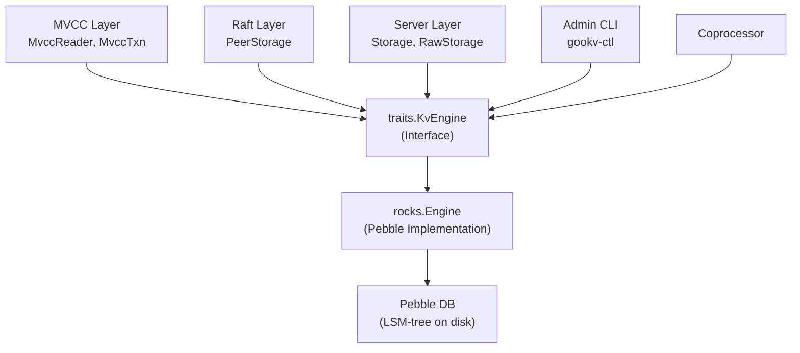

Every consumer -- MVCC reads, Raft state persistence, raw KV operations, admin
tools -- uses the same `KvEngine` interface. This decouples the upper layers
from the storage implementation. If gookv ever needed to switch from Pebble to
a different engine, only the `rocks` package would change.

---

## 2. Pebble: The Underlying Engine

### 2.1 What is Pebble?

Pebble is a key-value storage engine written in pure Go by the CockroachDB
team. It is designed as a drop-in replacement for RocksDB (which is written in
C++) with the following advantages for Go projects:

| Property | Pebble | RocksDB |
|----------|--------|---------|
| Language | Pure Go | C++ (requires CGo) |
| Build | `go build` -- just works | Needs C++ compiler, CGo linking |
| Cross-compile | Trivial | Complex |
| Memory safety | Go GC + bounds checking | Manual memory management |
| API compatibility | RocksDB-inspired | N/A (it is RocksDB) |

### 2.2 How Pebble Stores Data: LSM Trees

Pebble uses a Log-Structured Merge-tree (LSM-tree) internally. Here is a
simplified view of how writes flow through an LSM:

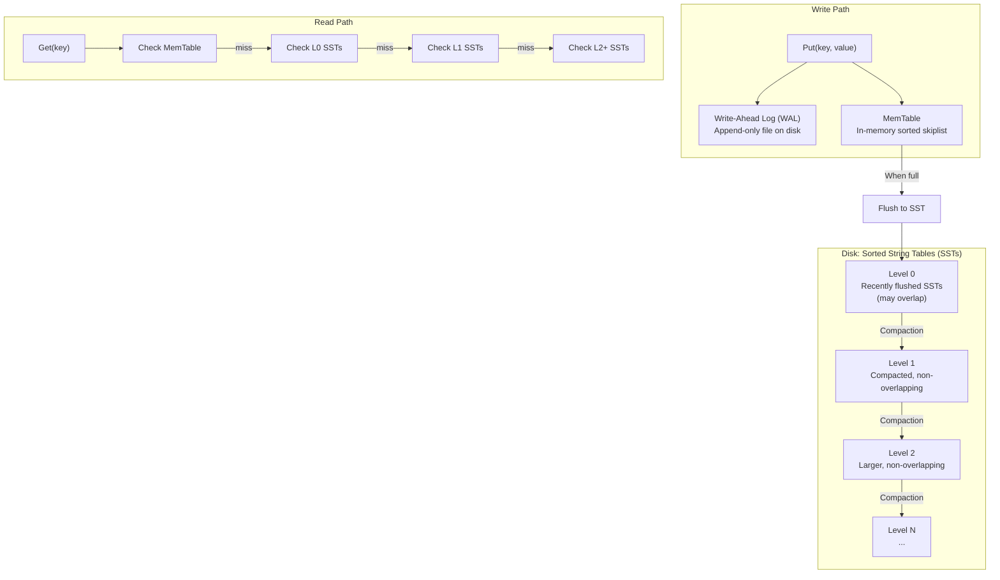

Key properties of LSM trees relevant to gookv:

1. **Writes are fast**: Every write appends to the WAL and inserts into the
   in-memory MemTable. No random I/O on the write path.
2. **Reads check multiple levels**: A point read may need to check the MemTable
   and several SST levels. Bloom filters reduce unnecessary I/O.
3. **Range scans are efficient**: SSTs are sorted, so a range scan merges
   iterators from each level.
4. **Atomic batches**: Multiple writes can be grouped into a `Batch` that is
   applied atomically -- either all writes succeed or none do.
5. **Snapshots**: A snapshot freezes the database state at a point in time.
   Reads from the snapshot always see the same data, even as new writes occur.

### 2.3 Pebble in gookv

gookv opens a single Pebble database at the `--data-dir` path. This one
database stores everything: user data across all regions, Raft logs, hard
state, region metadata, and locks. Column families are emulated on top of
Pebble's single keyspace using key prefixing (see Section 3).

The database is opened by `rocks.Open(path)`:

```go
// internal/engine/rocks/engine.go
func Open(path string) (*Engine, error) {
    opts := &pebble.Options{}
    db, err := pebble.Open(path, opts)
    if err != nil {
        return nil, fmt.Errorf("rocks: open %s: %w", path, err)
    }
    return &Engine{db: db, path: path}, nil
}
```

The `Engine` struct is minimal:

```go
type Engine struct {
    db   *pebble.DB
    path string
}
```

A compile-time assertion ensures the struct satisfies the interface:

```go
var _ traits.KvEngine = (*Engine)(nil)
```

---

## 3. Column Family Emulation

### 3.1 The Problem

TiKV uses RocksDB column families to separate different categories of data.
A column family in RocksDB is essentially an independent key-value namespace
within the same database -- keys in different CFs can be the same byte string
without conflicting, and each CF can have its own tuning parameters.

Pebble does not support column families. It provides a single flat keyspace.

### 3.2 The Solution: Key Prefixing

gookv emulates column families by prepending a single byte to every key before
storing it in Pebble. This byte identifies which column family the key belongs
to.

```go
// internal/engine/rocks/engine.go
var cfPrefixMap = map[string]byte{
    cfnames.CFDefault: 0x00,  // "default" -> 0x00
    cfnames.CFLock:    0x01,  // "lock"    -> 0x01
    cfnames.CFWrite:   0x02,  // "write"   -> 0x02
    cfnames.CFRaft:    0x03,  // "raft"    -> 0x03
}
```

Four logical column families are defined:

| Column Family | String Name | Prefix Byte | Purpose |
|---------------|-------------|-------------|---------|
| CF_DEFAULT    | `"default"` | `0x00`      | Large values (> 255 bytes) for MVCC Put operations |
| CF_LOCK       | `"lock"`    | `0x01`      | Active transaction locks |
| CF_WRITE      | `"write"`   | `0x02`      | Commit/rollback metadata records |
| CF_RAFT       | `"raft"`    | `0x03`      | Raft log entries, hard state, apply state |

### 3.3 How It Works Visually

When gookv writes key `"abc"` with value `"hello"` to column family `"write"`:

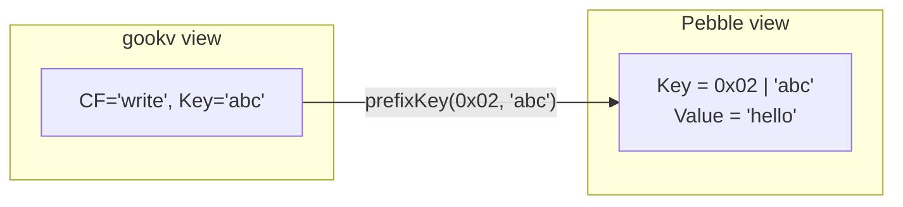

When reading back, the prefix byte is stripped so the caller sees the original
key without the prefix.

### 3.4 Helper Functions

Four helper functions implement the prefix scheme:

**`cfPrefix(cf string) (byte, error)`**

Looks up the prefix byte for a column family name. Returns `ErrCFNotFound` if
the name is unrecognized.

```go
func cfPrefix(cf string) (byte, error) {
    p, ok := cfPrefixMap[cf]
    if !ok {
        return 0, fmt.Errorf("%w: %s", traits.ErrCFNotFound, cf)
    }
    return p, nil
}
```

**`prefixKey(prefix byte, key []byte) []byte`**

Creates a new byte slice with the prefix byte prepended to the user key.

```go
func prefixKey(prefix byte, key []byte) []byte {
    out := make([]byte, 1+len(key))
    out[0] = prefix
    copy(out[1:], key)
    return out
}
```

**`stripPrefix(key []byte) []byte`**

Removes the first byte (the CF prefix) and returns a copy of the remaining
user key. Returns `nil` for keys of length 1 or less.

```go
func stripPrefix(key []byte) []byte {
    if len(key) <= 1 {
        return nil
    }
    out := make([]byte, len(key)-1)
    copy(out, key[1:])
    return out
}
```

**`cfUpperBound(prefix byte) []byte`**

Returns `[]byte{prefix + 1}`. This is used as the exclusive upper bound when
creating iterators, ensuring they stay within one column family's keyspace.

```go
func cfUpperBound(prefix byte) []byte {
    return []byte{prefix + 1}
}
```

### 3.5 Key Ordering Guarantee

Because the prefix bytes are `0x00`, `0x01`, `0x02`, `0x03`, all keys within
one CF are contiguous in Pebble's sorted keyspace, and CFs are ordered:

```
0x00 | key1    <- CF_DEFAULT start
0x00 | key2
0x00 | keyN    <- CF_DEFAULT end
0x01 | key1    <- CF_LOCK start
0x01 | keyN    <- CF_LOCK end
0x02 | key1    <- CF_WRITE start
0x02 | keyN    <- CF_WRITE end
0x03 | key1    <- CF_RAFT start
0x03 | keyN    <- CF_RAFT end
```

This means an iterator bounded to `[0x02, 0x03)` will only see CF_WRITE keys,
and will never accidentally read keys from CF_LOCK or CF_RAFT.

---

## 4. The KvEngine Interface

The `KvEngine` interface (`internal/engine/traits/traits.go`) is the primary
abstraction for all storage operations. Every component that reads or writes
data does so through this interface.

### 4.1 Interface Definition

```go
type KvEngine interface {
    // Point reads
    Get(cf string, key []byte) ([]byte, error)
    GetMsg(cf string, key []byte, msg interface{ Unmarshal([]byte) error }) error

    // Point writes
    Put(cf string, key, value []byte) error
    PutMsg(cf string, key []byte, msg interface{ Marshal() ([]byte, error) }) error
    Delete(cf string, key []byte) error
    DeleteRange(cf string, startKey, endKey []byte) error

    // Factories
    NewSnapshot() Snapshot
    NewWriteBatch() WriteBatch
    NewIterator(cf string, opts IterOptions) Iterator

    // Maintenance
    SyncWAL() error
    GetProperty(cf string, name string) (string, error)
    Close() error
}
```

### 4.2 Method-by-Method Guide

#### Point Reads

**`Get(cf, key) ([]byte, error)`**

Retrieves the value for a single key in the specified column family.

Returns `ErrNotFound` if the key does not exist. The returned byte slice is a
copy -- callers may hold it indefinitely without worrying about buffer reuse.

How it works internally:

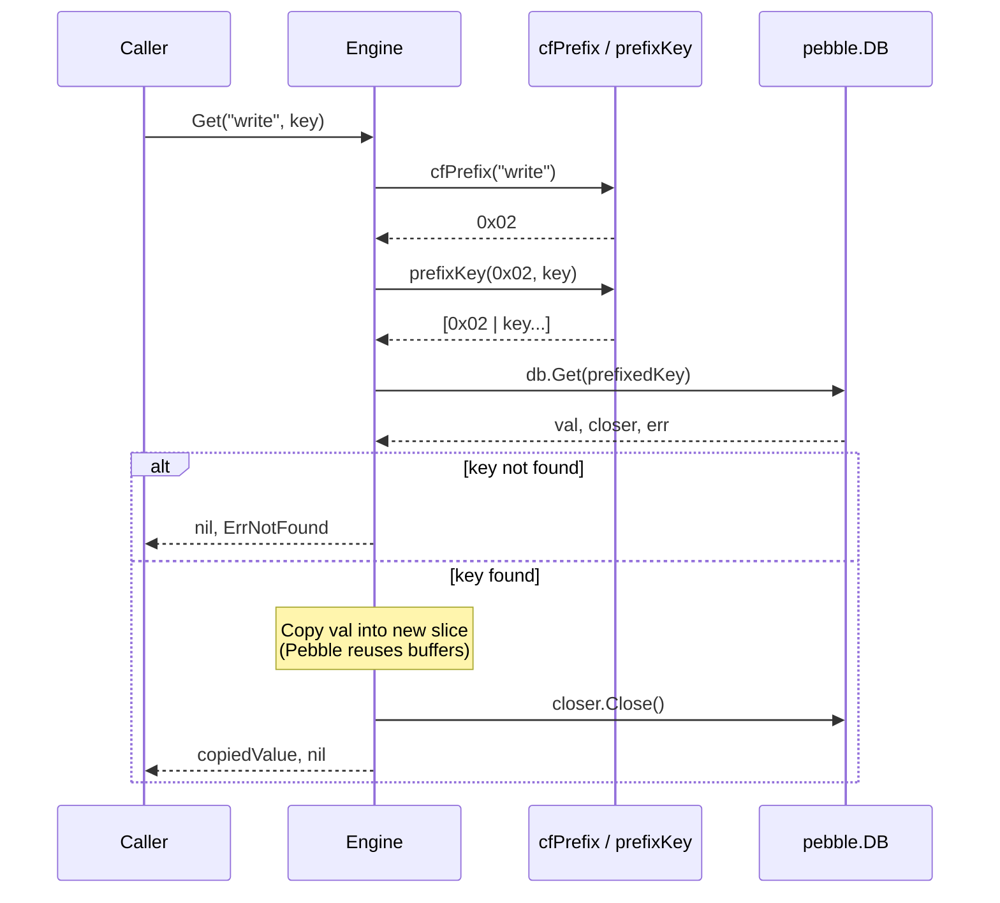

**`GetMsg(cf, key, msg) error`**

Convenience method: reads a value and unmarshals it into a protobuf message in
one call. Used by `PeerStorage` to read `HardState` and `Entry` protobuf
objects from CF_RAFT.

#### Point Writes

**`Put(cf, key, value) error`**

Writes a single key-value pair. The write is synchronous -- when `Put` returns,
the data is durable on disk (uses `pebble.Sync` option).

**`PutMsg(cf, key, msg) error`**

Convenience method: marshals a protobuf message and writes it.

**`Delete(cf, key) error`**

Removes a single key. Also synchronous.

**`DeleteRange(cf, startKey, endKey) error`**

Removes all keys in the range `[startKey, endKey)`. Used by Raft log compaction
to delete old log entries in bulk, and by snapshot application to clear a
region's key range before writing new data.

#### Factories

**`NewSnapshot() Snapshot`**

Creates a point-in-time consistent read view. See Section 5.

**`NewWriteBatch() WriteBatch`**

Creates an atomic write batch. See Section 6.

**`NewIterator(cf, opts) Iterator`**

Creates an ordered key iterator. See Section 7.

#### Maintenance

**`SyncWAL() error`**

In gookv's Pebble implementation, this calls `db.Flush()` rather than a true
WAL sync. `Flush()` forces a MemTable flush to L0 SST files, which is a
stronger (and more expensive) durability guarantee than WAL-only sync.

**`GetProperty(cf, name) (string, error)`**

Returns engine metrics as a formatted string. The Pebble implementation ignores
the `cf` and `name` parameters and always returns the full Pebble metrics dump.

**`Close() error`**

Shuts down the engine, flushing all data and releasing resources.

### 4.3 Error Variables

```go
var ErrNotFound   = errors.New("engine: key not found")
var ErrCFNotFound = errors.New("engine: column family not found")
```

`ErrNotFound` is the standard sentinel for missing keys. `ErrCFNotFound` is
returned when an unrecognized column family name is passed. These are defined
in `internal/engine/traits/traits.go` so that all consumers can check for them
using `errors.Is()`.

---

## 5. Snapshot: Point-in-Time Reads

### 5.1 What is a Snapshot?

A snapshot is a frozen, read-only view of the database at the moment it was
created. After creating a snapshot, any new writes to the database are invisible
to readers using that snapshot. This is essential for MVCC reads: a transaction
needs to see a consistent view of all data at its start timestamp.

### 5.2 Interface

```go
type Snapshot interface {
    Get(cf string, key []byte) ([]byte, error)
    GetMsg(cf string, key []byte, msg interface{ Unmarshal([]byte) error }) error
    NewIterator(cf string, opts IterOptions) Iterator
    Close()
}
```

A `Snapshot` supports the same read operations as `KvEngine` (`Get`, `GetMsg`,
`NewIterator`) but no writes. The caller must call `Close()` when finished to
release the underlying Pebble snapshot resources.

### 5.3 Implementation

```go
// internal/engine/rocks/engine.go
type snapshot struct {
    snap *pebble.Snapshot
}
```

The `snapshot` struct wraps a `*pebble.Snapshot` from Pebble. Its `Get` method
follows the same pattern as `Engine.Get`: prefix the key, call `snap.Get`, copy
the value, close the closer. Its `NewIterator` creates a Pebble iterator with
CF-scoped bounds, identical to the engine-level iterator logic.

### 5.4 Usage Pattern

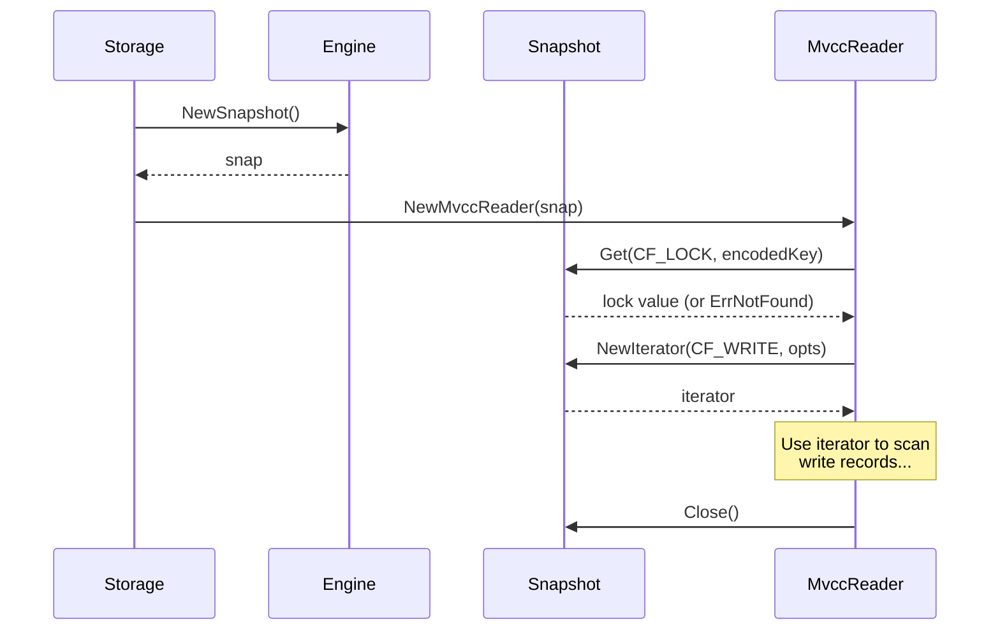

Snapshots are created at the start of every transactional operation. The MVCC
reader uses the snapshot for all its reads, ensuring a consistent view even if
concurrent writes are modifying the engine.

### 5.5 Snapshot Isolation Guarantee

Consider this timeline:

```
Time 0: Snapshot S created
Time 1: Write "key1" = "A" to engine
Time 2: Read "key1" from snapshot S -> ErrNotFound (write at Time 1 invisible)
Time 3: Read "key1" from engine -> "A" (direct read sees the write)
```

The snapshot at Time 0 never sees the write at Time 1. This is how MVCC
provides non-blocking reads.

---

## 6. WriteBatch: Atomic Multi-Key Writes

### 6.1 What is a WriteBatch?

A `WriteBatch` buffers multiple write operations (Put, Delete, DeleteRange) and
applies them all at once in a single atomic commit. Either all operations in the
batch succeed, or none do. There is no intermediate state visible to other
readers.

This is critical for MVCC operations. For example, a Commit must:
1. Write a commit record to CF_WRITE.
2. Delete the lock from CF_LOCK.

These two operations must be atomic. If the commit record is written but the
lock is not deleted, the key appears both committed and locked -- an
inconsistent state. `WriteBatch` prevents this.

### 6.2 Interface

```go
type WriteBatch interface {
    Put(cf string, key, value []byte) error
    PutMsg(cf string, key []byte, msg interface{ Marshal() ([]byte, error) }) error
    Delete(cf string, key []byte) error
    DeleteRange(cf string, startKey, endKey []byte) error
    Count() int
    DataSize() int
    Clear()
    SetSavePoint()
    RollbackToSavePoint() error
    Commit() error
}
```

### 6.3 Method Guide

| Method | Description |
|--------|-------------|
| `Put(cf, key, value)` | Buffer a write operation |
| `PutMsg(cf, key, msg)` | Buffer a protobuf write (marshal + put) |
| `Delete(cf, key)` | Buffer a single-key delete |
| `DeleteRange(cf, start, end)` | Buffer a range delete `[start, end)` |
| `Count()` | Number of buffered operations |
| `DataSize()` | Approximate total bytes of buffered data |
| `Clear()` | Discard all buffered operations |
| `SetSavePoint()` | Mark the current state for potential rollback |
| `RollbackToSavePoint()` | Undo all operations since the last save point |
| `Commit()` | Atomically apply all buffered operations to disk |

### 6.4 Implementation

```go
type writeBatch struct {
    db         *pebble.DB
    batch      *pebble.Batch
    count      int
    dataSize   int
    savePoints []savePointState
    mu         sync.Mutex
}

type savePointState struct {
    repr     []byte  // serialized batch state
    count    int     // operation count at save point
    dataSize int     // data size at save point
}
```

Key implementation details:

- **Thread safety**: All mutation methods acquire `mu` before modifying the
  batch. The `sync.Mutex` prevents data races when multiple goroutines share
  a batch (rare but possible).
- **Synchronous commit**: `Commit()` calls `batch.Commit(pebble.Sync)`,
  ensuring durability. When the method returns, the data is on disk.
- **Save points**: `SetSavePoint()` captures the batch state by calling
  `batch.Repr()` to serialize the entire batch contents. `RollbackToSavePoint()`
  creates a new Pebble batch, calls `newBatch.SetRepr(savedRepr)` to restore
  the serialized state, and discards the old batch.
- **Value copying**: All `Put` operations copy the key and value into the
  batch's internal buffer. Callers can reuse their slices immediately after
  calling `Put`.

### 6.5 Usage Flow

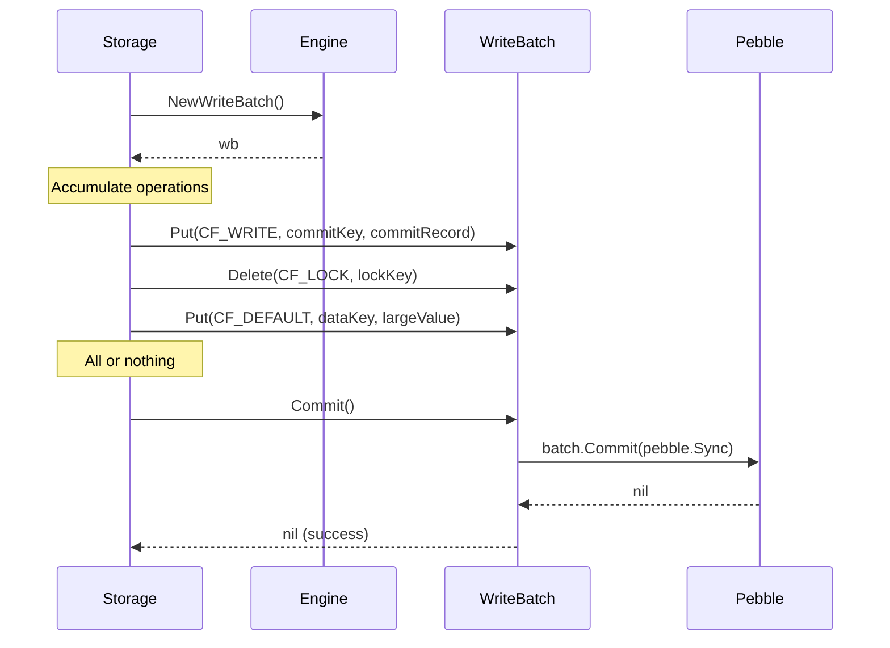

### 6.6 Save Point Example

Save points enable partial rollback of a batch. This is used when a transaction
action fails partway through:

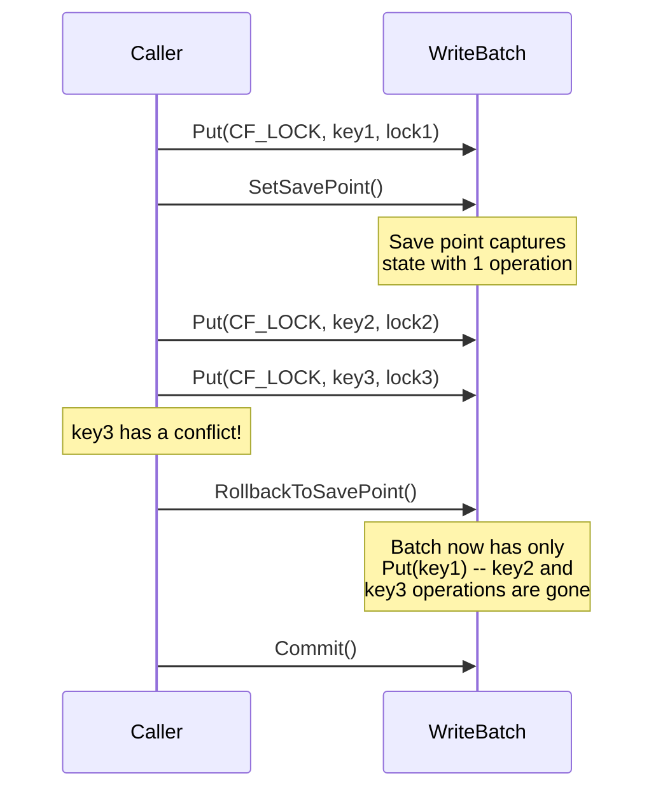

---

## 7. Iterator: Ordered Key Traversal

### 7.1 What is an Iterator?

An iterator provides forward and reverse sequential access to keys within a
column family. It is the foundation for range scans, MVCC version lookups, and
Raft log entry reads.

### 7.2 Interface

```go
type Iterator interface {
    SeekToFirst()
    SeekToLast()
    Seek(target []byte)
    SeekForPrev(target []byte)
    Next()
    Prev()
    Valid() bool
    Key() []byte
    Value() []byte
    Error() error
    Close()
}
```

### 7.3 Method Guide

| Method | Description |
|--------|-------------|
| `SeekToFirst()` | Position at the first key in the iterator's range |
| `SeekToLast()` | Position at the last key in the iterator's range |
| `Seek(target)` | Position at the first key >= target |
| `SeekForPrev(target)` | Position at the last key <= target |
| `Next()` | Move to the next key |
| `Prev()` | Move to the previous key |
| `Valid()` | Returns true if the iterator is positioned at a valid key |
| `Key()` | Returns the current key (valid only when `Valid()` is true) |
| `Value()` | Returns the current value (valid only when `Valid()` is true) |
| `Error()` | Returns any error that occurred during iteration |
| `Close()` | Release iterator resources |

### 7.4 IterOptions

```go
type IterOptions struct {
    LowerBound        []byte // inclusive lower bound (nil = start of CF)
    UpperBound        []byte // exclusive upper bound (nil = end of CF)
    FillCache         bool   // whether reads populate block cache
    PrefixSameAsStart bool   // prefix-based iteration mode
}
```

When creating an iterator, bounds are translated to CF-prefixed bounds:

- If `LowerBound` is nil, it defaults to `[]byte{prefix}` (start of the CF).
- If `UpperBound` is nil, it defaults to `cfUpperBound(prefix)` = `[]byte{prefix + 1}`.
- Otherwise, bounds are prefixed: `prefixKey(prefix, opts.LowerBound)`.

This ensures the iterator stays within the requested column family.

### 7.5 Implementation Details

```go
type iterator struct {
    iter   *pebble.Iterator
    prefix byte
}
```

**Key stripping**: The `Key()` method calls `stripPrefix` on the internal
Pebble key, so callers always see user keys without the CF prefix byte. This
is transparent -- upper layers never need to know about prefixing.

**Value copying**: `Value()` copies the Pebble value into a new slice before
returning. This protects callers from Pebble's internal buffer reuse (Pebble
may invalidate the value buffer on the next `Next()` or `Prev()` call).

**Seek operations**: `Seek(target)` maps to `iter.SeekGE(prefixKey(prefix, target))`.

**SeekForPrev workaround**: Pebble provides `SeekLT` (strictly less than) but
not a direct "seek to last key <= target". gookv implements `SeekForPrev` as:

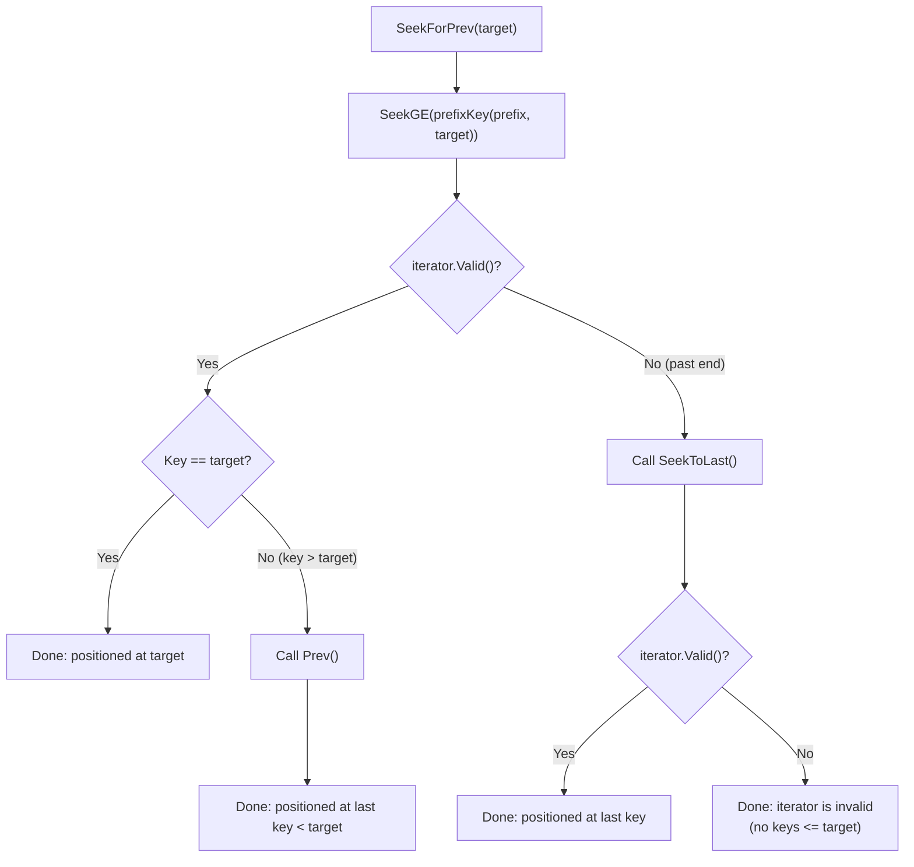

### 7.6 Error Iterator

When iterator creation fails (for example, due to an unrecognized column family
name), `NewIterator` returns an `errorIterator` instead of panicking:

```go
type errorIterator struct {
    err error
}
```

All positioning methods are no-ops. `Valid()` always returns `false`. `Error()`
returns the stored error. This allows callers to use the standard
seek-then-check-valid pattern without special error handling at creation time.

### 7.7 Iterator Usage Pattern

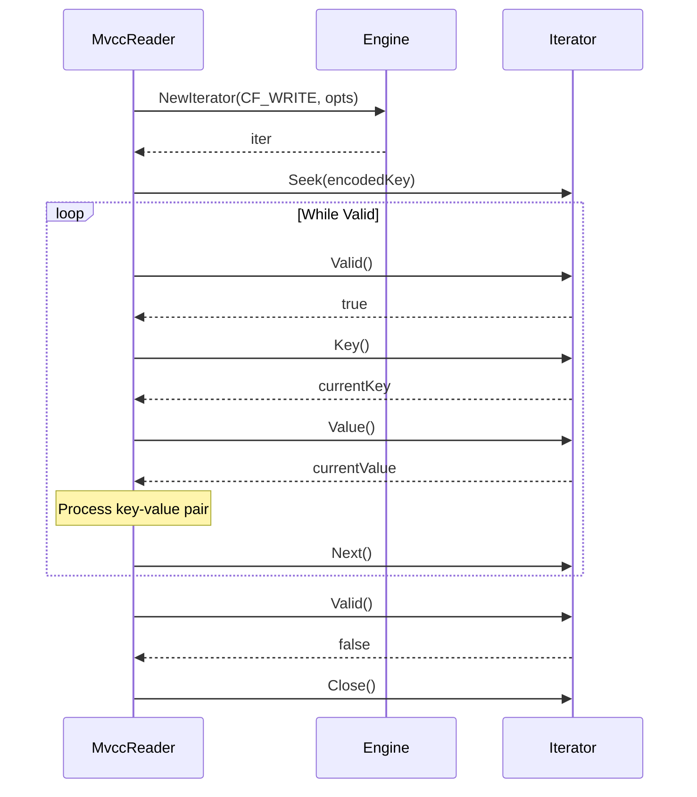

---

## 8. Key Encoding: The Codec Layer

The codec layer (`pkg/codec`) provides encoding functions that transform
arbitrary data types into byte strings that preserve their natural ordering
under byte comparison. This property is called "memcomparable" encoding.

### 8.1 Why Encoding Matters

Pebble stores keys as raw byte strings and sorts them lexicographically (byte
by byte). If we store a user key as-is and a timestamp as raw big-endian bytes,
the combined key would sort correctly for the user key part but the timestamp
part needs special handling:

- We want newer timestamps to sort **before** older ones (so a forward scan
  finds the newest version first).
- We need a way to encode variable-length user keys so that the key `"ab"` does
  not accidentally appear as a prefix of `"abc"` (which would break range
  boundary comparisons).

The codec layer solves both problems.

### 8.2 Byte Encoding: `EncodeBytes` / `DecodeBytes`

**Purpose**: Encode a variable-length byte string into a fixed-format byte
string that preserves lexicographic ordering.

**Algorithm**: Group-based encoding with 8-byte groups.

The input is split into 8-byte groups. Each group is followed by a 1-byte
marker. The marker value indicates whether this is a full group or the final
(possibly partial) group.

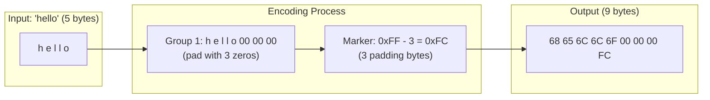

**Rules**:

| Group Type | Data | Marker |
|------------|------|--------|
| Full group (not last) | 8 bytes of data | `0xFF` |
| Last group | 0-8 bytes of data + zero padding | `0xFF - padCount` |

**Constants**:

```go
const (
    encGroupSize = 8      // bytes per group
    encMarker    = 0xFF   // marker for full groups
    encPad       = 0x00   // padding byte
)
```

**Encoded length formula**: For input of length `n`, the encoded length is
`(n/8 + 1) * 9` bytes. The function `EncodedBytesLength(n)` computes this.

**Function signature**:

```go
func EncodeBytes(dst []byte, data []byte) []byte
```

`dst` is the buffer to append to (may be nil). Returns the extended buffer.

**Decoding**: `DecodeBytes(data) ([]byte, []byte, error)` reverses the process.
It reads 9-byte chunks, checks the marker, and reconstructs the original bytes.
Returns `(decoded, remaining, error)` where `remaining` is the unconsumed tail.

**Descending variants**: `EncodeBytesDesc` / `DecodeBytesDesc` produce a
descending-order encoding by bitwise-inverting every byte of the ascending
encoding. Under byte comparison, larger input values sort first.

### 8.3 Number Encoding

All fixed-width number encodings produce exactly 8 bytes in big-endian format.

#### Unsigned Integers

**`EncodeUint64(dst, v) []byte`** -- Big-endian 8 bytes. Ascending order:
smaller values sort first.

**`EncodeUint64Desc(dst, v) []byte`** -- Big-endian 8 bytes of `^v` (bitwise
complement). Descending order: larger values sort first. This is critical for
MVCC timestamp encoding.

```go
func EncodeUint64Desc(dst []byte, v uint64) []byte {
    var buf [8]byte
    binary.BigEndian.PutUint64(buf[:], ^v)
    return append(dst, buf[:]...)
}
```

**Why `^v`?** Bitwise complement reverses the ordering:
- `v = 0` encodes as `0xFFFFFFFFFFFFFFFF` (sorts last in ascending)
- `v = MaxUint64` encodes as `0x0000000000000000` (sorts first in ascending)

So comparing the encoded bytes gives descending order of the original values.

**Decoding**: `DecodeUint64(data)` reads 8 big-endian bytes.
`DecodeUint64Desc(data)` reads 8 bytes and returns `^value`.

#### Signed Integers

**`EncodeInt64(dst, v) []byte`** flips the sign bit (`v ^ (1 << 63)`) before
encoding as uint64. This maps negative numbers below positive numbers in
unsigned comparison:

```
-3 -> 0x7FFFFFFFFFFFFFFD (sorts before positive values)
-2 -> 0x7FFFFFFFFFFFFFFE
-1 -> 0x7FFFFFFFFFFFFFFF
 0 -> 0x8000000000000000
 1 -> 0x8000000000000001
 2 -> 0x8000000000000002
```

#### Floating Point

**`EncodeFloat64(dst, v) []byte`** converts IEEE 754 bits to a comparable
uint64:
- Positive floats: flip the sign bit
- Negative floats: flip all bits

This ensures the natural ordering `-2.0 < -1.0 < 0.0 < 1.0 < 2.0` is
preserved under unsigned byte comparison.

#### Variable-Length Integers

**`EncodeVarint(dst, v) []byte`** uses unsigned LEB128 encoding (Go's
`binary.PutUvarint`). Maximum encoded length: 10 bytes (`MaxVarintLen64`).

**Important**: Varint encoding is **not** memcomparable. It is only used inside
serialized record bodies (Lock and Write values), never in keys.

### 8.4 Encoding Summary Table

| Function | Output Size | Order | Used In |
|----------|------------|-------|---------|
| `EncodeBytes` | `(n/8+1)*9` | Ascending | MVCC keys (user key part) |
| `EncodeBytesDesc` | `(n/8+1)*9` | Descending | Not used in gookv currently |
| `EncodeUint64` | 8 | Ascending | Raft log index, region ID |
| `EncodeUint64Desc` | 8 | Descending | MVCC keys (timestamp part) |
| `EncodeInt64` | 8 | Ascending | Coprocessor expressions |
| `EncodeFloat64` | 8 | Ascending | Coprocessor expressions |
| `EncodeVarint` | 1-10 | Not comparable | Lock/Write value fields |

---

## 9. MVCC Key Layout

The MVCC layer (`internal/storage/mvcc/key.go`) combines the codec primitives
to build the composite keys stored in each column family. Understanding this
layout is essential for debugging and for understanding how range scans work.

### 9.1 CF_WRITE and CF_DEFAULT Keys: `EncodeKey`

```go
func EncodeKey(key Key, ts txntypes.TimeStamp) []byte {
    encoded := codec.EncodeBytes(nil, key)
    return codec.EncodeUint64Desc(encoded, uint64(ts))
}
```

The resulting key has two parts:

```
[  EncodeBytes(userKey)  ] [  EncodeUint64Desc(timestamp)  ]
|<-- variable length -->|  |<--     exactly 8 bytes     -->|
```

The user key is encoded with `EncodeBytes` (ascending, memcomparable). The
timestamp is encoded with `EncodeUint64Desc` (descending). This means:

1. Keys for the same user key are grouped together (same encoded prefix).
2. Within the same user key, newer timestamps sort first (descending timestamp).
3. Different user keys sort in their natural byte order.

**`DecodeKey(encodedKey) (Key, TimeStamp, error)`** reverses the process: first
decodes the memcomparable bytes, then reads the descending uint64 timestamp from
the remaining 8 bytes.

### 9.2 CF_LOCK Keys: `EncodeLockKey`

```go
func EncodeLockKey(key Key) []byte {
    return codec.EncodeBytes(nil, key)
}
```

Lock keys have **no timestamp**. There is at most one lock per user key at any
time (enforced by the transaction protocol), so no timestamp disambiguation is
needed.

**`DecodeLockKey(encodedKey) (Key, error)`** calls `codec.DecodeBytes` to
extract the user key.

### 9.3 `TruncateToUserKey`

```go
func TruncateToUserKey(encodedKey []byte) []byte {
    if len(encodedKey) <= 8 {
        return encodedKey
    }
    return encodedKey[:len(encodedKey)-8]
}
```

Strips the last 8 bytes (the timestamp) from an MVCC key, leaving only the
encoded user key portion. Used by `MvccReader.SeekWrite` to verify that a
found CF_WRITE key belongs to the expected user key (not the next user key).

### 9.4 Three-CF Key Relationship

For a user key `"abc"` with startTS=90 and commitTS=100:

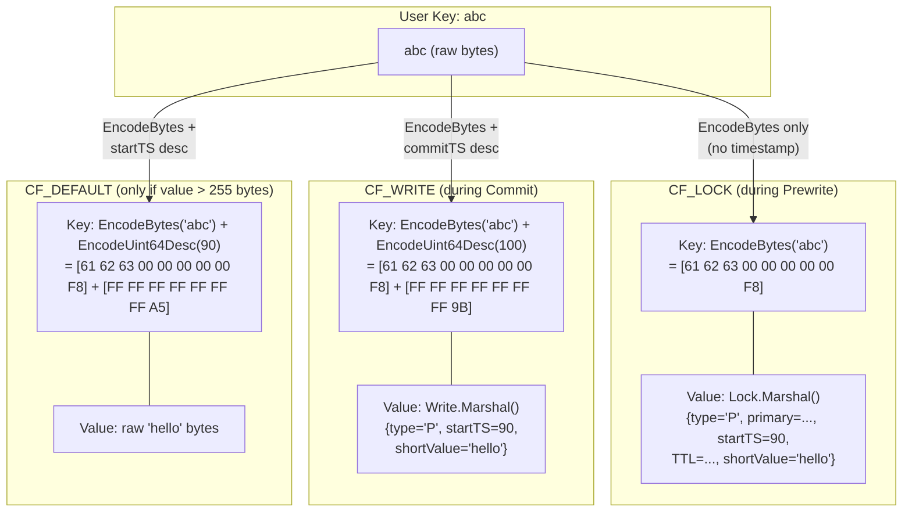

### 9.5 Key Ordering Visualization

Consider three user keys ("a", "b", "c") with multiple versions:

```
CF_WRITE keyspace (sorted):

EncodeBytes("a") + EncodeUint64Desc(100)   <- "a" @ commitTS=100 (newest)
EncodeBytes("a") + EncodeUint64Desc(50)    <- "a" @ commitTS=50  (older)
EncodeBytes("a") + EncodeUint64Desc(10)    <- "a" @ commitTS=10  (oldest)
EncodeBytes("b") + EncodeUint64Desc(90)    <- "b" @ commitTS=90
EncodeBytes("b") + EncodeUint64Desc(40)    <- "b" @ commitTS=40
EncodeBytes("c") + EncodeUint64Desc(80)    <- "c" @ commitTS=80
```

A reader looking for key "b" at timestamp 60 would:
1. Seek to `EncodeKey("b", 60)` (which seeks to the first key >= this).
2. Because of descending timestamps, this lands on `"b" @ 90` (since 90 > 60,
   and desc encoding of 90 is less than desc encoding of 60).
3. But wait -- `commitTS=90 > readTS=60`, so this version is not yet visible.
4. `Next()` to `"b" @ 40`. Now `commitTS=40 <= readTS=60` -- visible!
5. Read the value from this write record.

Actually, the `SeekWrite` function in `MvccReader` seeks to
`EncodeKey(key, readTS)`, which positions at the first CF_WRITE entry for this
key whose commitTS is <= readTS (because of descending encoding). This is the
core trick that makes MVCC reads efficient.

---

## 10. Why Memcomparable Encoding Matters

Memcomparable encoding is not just a nice-to-have -- it is fundamental to
gookv's correctness. Here are the specific reasons:

### 10.1 Range Scans

When a client requests "scan all keys from 'user:100' to 'user:200'", gookv
needs to translate this into a range scan on the storage engine. The scan
boundaries are encoded user keys. If the encoding did not preserve ordering,
the scan might miss keys or include keys outside the range.

### 10.2 Region Boundaries

Each region covers a contiguous range of keys: `[startKey, endKey)`. Region
boundaries are stored as encoded keys. When the system needs to determine which
region a key belongs to, it encodes the key and compares it with the region
boundaries using simple byte comparison. Correct ordering is essential.

### 10.3 Variable-Length Key Safety

Without encoding, the raw key `"ab"` is a byte prefix of `"abc"`. This causes
problems for range boundary comparisons: is `"ab"` less than, equal to, or
greater than `"abc"` as a boundary?

With `EncodeBytes`, the encoded form of `"ab"` has a specific marker byte at the
end that makes it distinct from any prefix of `"abc"`. The two encoded keys
compare correctly.

### 10.4 Timestamp Ordering

MVCC keys include a timestamp after the user key. By encoding the timestamp in
descending order (`EncodeUint64Desc`), a simple forward scan from a seek
position naturally visits versions from newest to oldest. Without descending
encoding, gookv would need reverse iterators or more complex seeking logic.

### 10.5 Cross-CF Consistency

Lock keys (no timestamp) and write keys (with timestamp) use the same
`EncodeBytes` encoding for the user key part. This means that for a given user
key, the encoded prefix is identical in both CF_LOCK and CF_WRITE. The system
can reliably compare and correlate keys across column families.

---

## 11. Column Family Names and Constants

The `pkg/cfnames` package defines the string constants used throughout gookv
to identify column families:

```go
// pkg/cfnames/cfnames.go
const (
    CFDefault = "default"
    CFLock    = "lock"
    CFWrite   = "write"
    CFRaft    = "raft"
)

// DataCFs contains the three column families involved in MVCC transactions.
var DataCFs = []string{CFDefault, CFLock, CFWrite}

// AllCFs contains all four column families.
var AllCFs = []string{CFDefault, CFLock, CFWrite, CFRaft}
```

### Usage

| Constant    | Where Used |
|-------------|------------|
| `CFDefault` | MVCC large value storage; raw KV operations; coprocessor reads |
| `CFLock`    | Transaction lock storage; lock scanning; conflict detection |
| `CFWrite`   | Commit/rollback records; version visibility checks |
| `CFRaft`    | Raft log entries; hard state; apply state; region state |

`DataCFs` is used when an operation needs to touch all MVCC-related CFs (for
example, snapshot generation scans all three data CFs). `AllCFs` is used for
operations that include Raft state (for example, engine-level diagnostics).

---

## 12. Transaction Types

The `pkg/txntypes` package defines the data types that are stored as values in
the column families. These types have TiKV-compatible binary serialization.

### 12.1 Lock

A `Lock` represents an active transaction lock, stored as the value in CF_LOCK.

```go
type Lock struct {
    LockType     LockType      // 'P' Put, 'D' Delete, 'L' Lock, 'S' Pessimistic
    Primary      []byte        // primary key of the transaction
    StartTS      TimeStamp     // transaction start timestamp
    TTL          uint64        // time-to-live in milliseconds
    ShortValue   []byte        // inlined value (optional, <= 255 bytes)
    ForUpdateTS  TimeStamp     // pessimistic lock version (optional)
    TxnSize      uint64        // transaction size hint (optional)
    MinCommitTS  TimeStamp     // minimum allowed commit timestamp (optional)
    UseAsyncCommit bool        // async commit enabled
    Secondaries  [][]byte      // secondary keys for async commit
    RollbackTS   []TimeStamp   // collapsed rollback timestamps (optional)
    LastChange   LastChange    // previous data-changing version info (optional)
    TxnSource    uint64        // transaction source identifier (optional)
}
```

**Serialization format** (`Lock.Marshal()`):

```
[LockType:1B] [primary:varint-len + bytes] [startTS:varint] [ttl:varint]
  {optional tagged fields in defined order}
```

Required fields are written unconditionally. Optional fields use a tag-based
format: a one-byte tag identifies the field, followed by the field data.

| Tag | Field | Encoding |
|-----|-------|----------|
| `'v'` | ShortValue | `[tag][length:1B][data]` |
| `'f'` | ForUpdateTS | `[tag][8B big-endian]` |
| `'t'` | TxnSize | `[tag][8B big-endian]` |
| `'c'` | MinCommitTS | `[tag][8B big-endian]` |
| `'a'` | UseAsyncCommit | `[tag]` (presence = true) |
| `'r'` | RollbackTS | `[tag][count:varint][ts1:8B]...[tsN:8B]` |
| `'l'` | LastChange | `[tag][ts:varint][versions:varint]` |
| `'s'` | TxnSource | `[tag][8B big-endian]` |

### 12.2 Write

A `Write` represents a committed or rolled-back version, stored as the value
in CF_WRITE.

```go
type Write struct {
    WriteType              WriteType   // 'P' Put, 'D' Delete, 'L' Lock, 'R' Rollback
    StartTS                TimeStamp   // start timestamp of the transaction
    ShortValue             []byte      // inlined value (optional, <= 255 bytes)
    HasOverlappedRollback  bool        // overlapped rollback marker
    GCFence                *TimeStamp  // GC fence timestamp (optional)
    LastChange             LastChange  // previous data-changing version (optional)
    TxnSource              uint64      // transaction source (optional)
}
```

**Short value optimization**: `ShortValueMaxLen = 255`. When a value is 255
bytes or fewer, it is stored directly in the Write record's `ShortValue` field
rather than in a separate CF_DEFAULT entry. The `NeedValue()` method returns
true when `WriteType == Put` and `ShortValue` is empty, indicating that the
full value must be fetched from CF_DEFAULT.

**Serialization format** (`Write.Marshal()`):

```
[WriteType:1B] [startTS:varint] {optional tagged fields}
```

| Tag | Field |
|-----|-------|
| `'v'` | ShortValue |
| `'R'` | HasOverlappedRollback |
| `'F'` | GCFence |
| `'l'` | LastChange |
| `'S'` | TxnSource |

### 12.3 Mutation

Represents a client-submitted key mutation in a Prewrite request.

```go
type Mutation struct {
    Op        MutationOp  // Put(0), Delete(1), Lock(2), Insert(3), CheckNotExists(4)
    Key       []byte
    Value     []byte
    Assertion Assertion   // None(0), Exist(1), NotExist(2)
}
```

### 12.4 TimeStamp

```go
type TimeStamp uint64

const (
    TSLogicalBits = 18
    TSMax         = TimeStamp(math.MaxUint64)
    TSZero        = TimeStamp(0)
)

func ComposeTS(physical, logical int64) TimeStamp {
    return TimeStamp(uint64(physical)<<TSLogicalBits | uint64(logical))
}

func (ts TimeStamp) Physical() int64 { return int64(ts >> TSLogicalBits) }
func (ts TimeStamp) Logical() int64  { return int64(ts & ((1 << TSLogicalBits) - 1)) }
```

---

## 13. Full Key Layout Diagram

This diagram shows how all the encoding layers combine to produce the actual
bytes stored in Pebble:

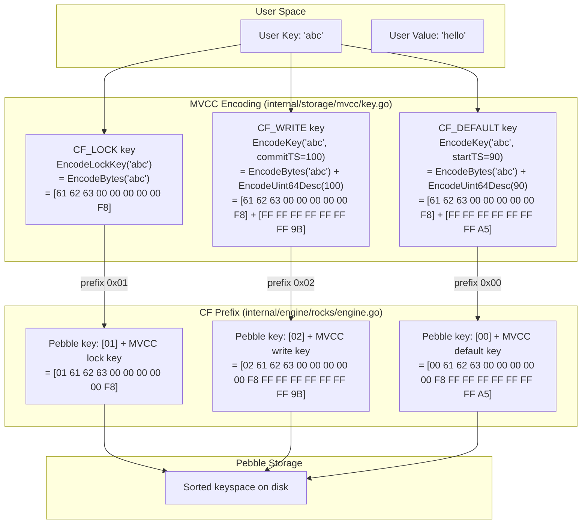

### Key Space Layout in Pebble

The complete sorted keyspace looks like this:

```
[00] + EncodeBytes("a") + EncodeUint64Desc(90)    <- CF_DEFAULT: "a" @ startTS=90
[00] + EncodeBytes("b") + EncodeUint64Desc(90)    <- CF_DEFAULT: "b" @ startTS=90
[01] + EncodeBytes("a")                           <- CF_LOCK: lock on "a"
[01] + EncodeBytes("b")                           <- CF_LOCK: lock on "b"
[02] + EncodeBytes("a") + EncodeUint64Desc(100)   <- CF_WRITE: "a" @ commitTS=100
[02] + EncodeBytes("a") + EncodeUint64Desc(50)    <- CF_WRITE: "a" @ commitTS=50
[02] + EncodeBytes("b") + EncodeUint64Desc(90)    <- CF_WRITE: "b" @ commitTS=90
[03] + RaftLogKey(1, 1)                            <- CF_RAFT: region 1, log index 1
[03] + RaftLogKey(1, 2)                            <- CF_RAFT: region 1, log index 2
[03] + RaftStateKey(1)                             <- CF_RAFT: region 1, hard state
```

Each CF occupies a contiguous range. Within each CF, keys are sorted by their
encoded form -- which preserves the user key ordering and the timestamp ordering
(newest first for MVCC keys).

---

## 14. Worked Example

Let us trace a complete write operation through the storage engine, showing
the exact bytes at each layer.

### Scenario

A transaction with startTS=90 writes key `"abc"` with value `"hello"`, then
commits with commitTS=100.

### Phase 1: Prewrite

During Prewrite, the system writes a lock to CF_LOCK:

**Lock key construction**:
```
EncodeLockKey("abc")
= EncodeBytes(nil, []byte{0x61, 0x62, 0x63})
= [61 62 63 00 00 00 00 00 F8]
  |  a  b  c  -- 5 zero pad -- | marker = 0xFF - 5 = 0xF8
```

**Lock value construction** (simplified):
```
Lock{
    LockType:   'P',           // Put
    Primary:    []byte("abc"),
    StartTS:    90,
    TTL:        3000,
    ShortValue: []byte("hello"),  // 5 bytes, fits inline
}

Marshal():
['P'] [varint(3)] [0x61 0x62 0x63] [varint(90)] [varint(3000)]
['v'] [0x05] [0x68 0x65 0x6C 0x6C 0x6F]
  ^tag   ^len   ^-- "hello" --^
```

**WriteBatch operations**:
```
wb.Put(CF_LOCK, [61 62 63 00 00 00 00 00 F8], lockBytes)
```

After CF prefixing, this becomes in Pebble:
```
Key:   [01 61 62 63 00 00 00 00 00 F8]
Value: [lockBytes...]
```

### Phase 2: Commit

During Commit, two operations happen atomically:

**1. Write commit record to CF_WRITE**:

```
EncodeKey("abc", 100)
= EncodeBytes(nil, "abc") + EncodeUint64Desc(nil, 100)
= [61 62 63 00 00 00 00 00 F8] + [FF FF FF FF FF FF FF 9B]
                                   ^-- ^100 = 0xFFFFFFFFFFFFFF9B
```

Write value:
```
Write{
    WriteType:  'P',    // Put
    StartTS:    90,
    ShortValue: []byte("hello"),  // inlined
}
```

**2. Delete lock from CF_LOCK**:
```
wb.Delete(CF_LOCK, [61 62 63 00 00 00 00 00 F8])
```

**WriteBatch**:
```
wb.Put(CF_WRITE, [61 62 63 00 00 00 00 00 F8 FF FF FF FF FF FF FF 9B], writeBytes)
wb.Delete(CF_LOCK, [61 62 63 00 00 00 00 00 F8])
wb.Commit()  // atomic!
```

### Phase 3: Read

A reader at readTS=110 reads key "abc":

1. **Check CF_LOCK**: Seek to `EncodeLockKey("abc")`. No lock found (it was
   deleted during commit).

2. **Seek CF_WRITE**: Seek to `EncodeKey("abc", 110)`:
   ```
   [61 62 63 00 00 00 00 00 F8] + [FF FF FF FF FF FF FF 91]
                                    ^-- ^110 = ...FF91
   ```
   Because `^110 < ^100` (0xFF91 < 0xFF9B), the seek lands at the first key
   that is >= this encoded key. That is the commit record at commitTS=100
   (since `^100 = 0xFF9B > 0xFF91`).

   Wait, let me reconsider. `EncodeUint64Desc(110)` produces the bitwise
   complement of 110, and `EncodeUint64Desc(100)` produces the complement of
   100. Since `110 > 100`, we have `^110 < ^100` in unsigned comparison.
   So the encoded key for ts=110 sorts BEFORE the encoded key for ts=100.

   When we `Seek(EncodeKey("abc", 110))`, we look for the first key >= this.
   The CF_WRITE entry at commitTS=100 has encoded timestamp `^100 > ^110`, so
   it sorts AFTER our seek target. The seek lands exactly on the commitTS=100
   record. This is the correct version: commitTS=100 <= readTS=110.

3. **Read value**: The Write record has `ShortValue = "hello"`, so no need to
   read CF_DEFAULT. Return `"hello"`.

### Why Short Value Matters

If the value were larger than 255 bytes, the Prewrite would also write to
CF_DEFAULT:

```
EncodeKey("abc", 90)  // key uses startTS, not commitTS
= [61 62 63 00 00 00 00 00 F8] + [FF FF FF FF FF FF FF A5]
                                   ^-- ^90 = ...FFA5
```

The Write record would not contain `ShortValue`, and `NeedValue()` would
return true. The reader would then fetch the value from CF_DEFAULT using the
`startTS` from the Write record.

---

## 15. Local Keys: Raft State Storage

In addition to MVCC data keys, gookv stores internal metadata in "local keys"
-- keys that begin with `LocalPrefix` (`0x01`). These keys live in the CF_RAFT
column family and hold Raft state for each region.

### 15.1 Key Prefix Layout

```
[0x01] = LocalPrefix
   |
   +-- [0x01] = StoreIdentKeySuffix   -> Store identity
   +-- [0x02] = PrepareBootstrapKeySuffix -> Bootstrap marker
   +-- [0x02] = RegionRaftPrefix
   |      |
   |      +-- [regionID:8B BE]
   |             |
   |             +-- [0x01] = RaftLogSuffix      -> Raft log entries
   |             |      |
   |             |      +-- [logIndex:8B BE]     -> Individual entry
   |             |
   |             +-- [0x02] = RaftStateSuffix    -> Hard state
   |             +-- [0x03] = ApplyStateSuffix   -> Apply state
   |
   +-- [0x03] = RegionMetaPrefix
          |
          +-- [regionID:8B BE]
                 |
                 +-- [0x01] = RegionStateSuffix  -> Region metadata
```

### 15.2 Key Construction Functions

The `pkg/keys` package provides functions to construct these keys:

| Function | Key Format | Length |
|----------|-----------|--------|
| `RaftLogKey(regionID, logIndex)` | `[01][02][regionID:8B][01][logIndex:8B]` | 19 bytes |
| `RaftStateKey(regionID)` | `[01][02][regionID:8B][02]` | 11 bytes |
| `ApplyStateKey(regionID)` | `[01][02][regionID:8B][03]` | 11 bytes |
| `RegionStateKey(regionID)` | `[01][03][regionID:8B][01]` | 11 bytes |

Pre-built constants:
- `StoreIdentKey` = `[0x01, 0x01]`
- `PrepareBootstrapKey` = `[0x01, 0x02]`

### 15.3 Data vs Local Key Separation

```go
// pkg/keys/keys.go
const (
    LocalPrefix = byte(0x01)  // Internal metadata
    DataPrefix  = byte(0x7A)  // User-facing data (ASCII 'z')
)
```

Because `0x01 < 0x7A`, all local keys sort before all data keys within the
same column family. This separation means that:

- An iterator scanning data keys never encounters local keys (by setting
  appropriate bounds).
- An iterator scanning local keys never encounters data keys.
- The data key prefix `0x7A` leaves room for future key namespaces between
  `0x02` and `0x79`.

### 15.4 Data Key Functions

```go
func DataKey(key []byte) []byte    // Prepend 0x7A
func OriginKey(dataKey []byte) []byte  // Strip 0x7A (no-op if absent)
func IsDataKey(key []byte) bool    // key[0] == 0x7A
func IsLocalKey(key []byte) bool   // key[0] == 0x01
```

### 15.5 Range Helpers

```go
var DataMinKey = []byte{DataPrefix}      // [0x7A] - inclusive lower bound
var DataMaxKey = []byte{DataPrefix + 1}  // [0x7B] - exclusive upper bound
var LocalMinKey = []byte{LocalPrefix}    // [0x01]
var LocalMaxKey = []byte{LocalPrefix + 1} // [0x02]
```

`RaftLogKeyRange(regionID)` returns `(RaftLogKey(regionID, 0), RaftStateKey(regionID))`.
This works because `RaftStateSuffix (0x02) > RaftLogSuffix (0x01)`, so the
state key sorts after all log keys for the same region.

### 15.6 Region ID Extraction

Two utility functions extract region IDs from encoded keys:

- `RegionIDFromRaftKey(key)`: Validates prefix `[0x01][0x02]`, reads
  `key[2:10]` as big-endian uint64.
- `RegionIDFromMetaKey(key)`: Validates prefix `[0x01][0x03]`, reads
  `key[2:10]` as big-endian uint64.

---

## 16. Engine Lifecycle and Error Handling

### 16.1 Opening the Engine

The engine is opened once at server startup and shared across all components:

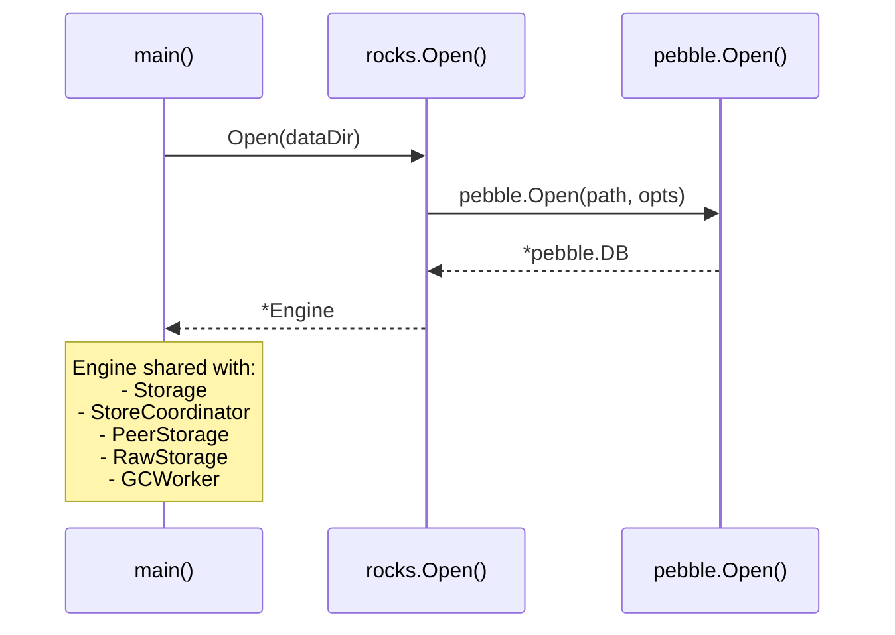

### 16.2 Closing the Engine

The engine is closed last during shutdown (deferred from `main()`). Before
closing, all components that use the engine must be stopped:

1. All Raft peers stop (no more writes to CF_RAFT).
2. The gRPC server stops (no more client operations).
3. The GC worker stops (no more background writes).
4. Then `engine.Close()` is called, which calls `pebble.DB.Close()`.

### 16.3 Error Handling Patterns

The engine layer uses two error handling patterns:

**Sentinel errors**: `ErrNotFound` and `ErrCFNotFound` are package-level error
variables. Callers check for them with `errors.Is()`:

```go
val, err := engine.Get(cfnames.CFDefault, key)
if errors.Is(err, traits.ErrNotFound) {
    // Key does not exist
}
```

**Wrapped errors**: Other errors (I/O failures, corruption) are wrapped with
`fmt.Errorf("...%w", err)` to preserve the original error for debugging.

### 16.4 Thread Safety

The `Engine` struct itself is thread-safe: Pebble handles concurrent access
internally. Multiple goroutines can call `Get`, `Put`, `NewSnapshot`,
`NewWriteBatch`, and `NewIterator` concurrently without external
synchronization.

The `WriteBatch` struct uses a `sync.Mutex` to protect its internal state,
allowing (though not recommended) concurrent additions to the same batch.

Snapshots and iterators are not thread-safe and should be used by a single
goroutine.

---

## 17. Conformance Testing

The `internal/engine/traits/conformance_test.go` file provides 17 test cases
that verify the `KvEngine` interface contract independently of the
implementation. These tests cover:

| Test Category | What is Verified |
|---------------|-----------------|
| Basic CRUD | Get/Put/Delete for each CF |
| WriteBatch atomicity | Multiple operations committed atomically |
| WriteBatch rollback | SetSavePoint/RollbackToSavePoint correctness |
| Snapshot isolation | Snapshot does not see writes after creation |
| Iterator boundaries | LowerBound/UpperBound correctly scoped |
| Cross-CF isolation | Keys in different CFs are independent |
| Concurrent access | Multiple goroutines reading/writing simultaneously |
| DeleteRange | Range deletion boundaries |
| Error handling | ErrNotFound for missing keys, ErrCFNotFound for bad CF names |

### 17.1 Test Architecture

The conformance tests accept a `KvEngine` factory function, making them
reusable for any implementation:

```go
func RunConformanceTests(t *testing.T, factory func(t *testing.T) traits.KvEngine) {
    t.Run("BasicGetPut", func(t *testing.T) {
        engine := factory(t)
        defer engine.Close()
        // ... test logic
    })
    // ... more subtests
}
```

Currently, the Pebble implementation (`rocks.Engine`) is the only
implementation. If gookv ever supported a different backend (e.g., an
in-memory engine for testing), the conformance suite would verify it
immediately.

---

## 18. Performance Considerations

### 18.1 Value Copying

Both `Engine.Get()` and `iterator.Value()` copy values into new slices before
returning. This is necessary because Pebble may reuse its internal buffers on
subsequent operations. The copy adds allocation overhead but prevents subtle
bugs where a caller holds a reference to a buffer that gets overwritten.

### 18.2 Synchronous Writes

All `Put`, `Delete`, and `WriteBatch.Commit` operations use `pebble.Sync`,
meaning the WAL is flushed to disk before the operation returns. This provides
strong durability but impacts write latency. In cluster mode, this is
acceptable because Raft already provides durability through replication -- a
single node's crash is tolerable.

### 18.3 Key Prefix Overhead

Every key stored in Pebble has a 1-byte prefix for the column family. For very
short keys, this adds measurable overhead (12.5% for an 8-byte key). For
typical MVCC keys (which include 9+ bytes of EncodeBytes encoding plus 8 bytes
of timestamp), the overhead is negligible (< 3%).

### 18.4 Iterator Bound Optimization

By setting tight LowerBound and UpperBound on iterators, Pebble can skip
entire SST files that fall outside the bounds. This is particularly effective
for CF-scoped iteration, where the bounds restrict iteration to a single
CF's keyspace.

---

## Summary

The storage engine layer provides the foundation for all data persistence in
gookv. Its key design decisions are:

1. **Pebble** as the underlying LSM-tree engine, avoiding CGo dependencies.
2. **CF prefix emulation** using a single-byte key prefix to partition the
   flat keyspace into four logical column families.
3. **Clean interface** (`KvEngine`) that decouples upper layers from the
   storage implementation.
4. **Memcomparable encoding** that preserves key ordering under byte comparison,
   enabling correct range scans and region boundary comparisons.
5. **Descending timestamp encoding** that places newer MVCC versions before
   older ones, enabling efficient "find latest version" seeks.
6. **Short value optimization** that inlines small values in CF_WRITE records,
   avoiding an extra CF_DEFAULT read in the common case.
7. **Atomic WriteBatch** that ensures multi-CF operations (like commit: write
   to CF_WRITE + delete from CF_LOCK) are all-or-nothing.

These decisions are not arbitrary -- they are inherited from TiKV's proven
design, adapted to Go's strengths (pure Go, no CGo, goroutine-friendly).
