# Raft Consensus Layer

## Table of Contents

1. [The Problem: Consistent Replication](#1-the-problem-consistent-replication)
2. [What is Consensus?](#2-what-is-consensus)
3. [Raft Basics](#3-raft-basics)
4. [How gookv Uses etcd/raft](#4-how-gookv-uses-etcdraft)
5. [The Peer Struct](#5-the-peer-struct)
6. [PeerConfig: Tuning the Raft Group](#6-peerconfig-tuning-the-raft-group)
7. [Message Types](#7-message-types)
8. [Peer Lifecycle](#8-peer-lifecycle)
9. [The Event Loop: Peer.Run](#9-the-event-loop-peerrun)
10. [handleReady: The Heart of Raft Processing](#10-handleready-the-heart-of-raft-processing)
11. [Proposal Flow](#11-proposal-flow)
12. [The propose() Function](#12-the-propose-function)
13. [Admin Commands](#13-admin-commands)
14. [ReadIndex Protocol](#14-readindex-protocol)
15. [PeerStorage: Persistent Raft State](#15-peerstorage-persistent-raft-state)
16. [Log Compaction](#16-log-compaction)
17. [Snapshots](#17-snapshots)
18. [The Router: Message Routing](#18-the-router-message-routing)

---

## 1. The Problem: Consistent Replication

Imagine you have a key-value store on a single machine. It works fine until:

- The machine's disk fails, and all data is lost.
- The machine crashes, and clients cannot read or write until it restarts.
- The load exceeds what one machine can handle.

The natural solution is to store copies of the data on multiple machines. But
this immediately raises a hard question: **how do the copies stay consistent?**

Consider three machines each holding a copy of key `"balance"`. A client sends
a write `balance = 100`. What happens if:

- Machine A receives and applies the write, but crashes before forwarding it to
  B and C? Now A has `balance = 100` but B and C have the old value.
- The network between A and B fails, so A and B both accept writes from
  different clients? Now A and B have conflicting values.
- A write reaches A and B but not C, and then A crashes. Should B alone decide
  the write is committed?

These are the problems that a consensus protocol solves.

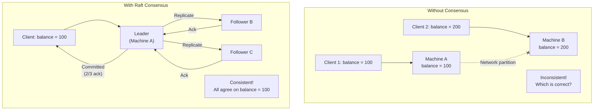

---

## 2. What is Consensus?

Consensus means getting a group of machines to agree on a sequence of values,
even when some machines fail or the network is unreliable. More precisely, a
consensus protocol guarantees:

1. **Agreement**: All non-failed machines eventually agree on the same sequence
   of operations.
2. **Validity**: If a machine decides on a value, that value was actually
   proposed by some client (no fabricated values).
3. **Termination**: As long as a majority of machines are alive, the system can
   make progress (it does not get stuck).

The key insight is **majority voting**: a decision is considered committed when
a majority (more than half) of the replicas have acknowledged it. With 3
replicas, a majority is 2. This means the system tolerates 1 failure. With 5
replicas, a majority is 3, tolerating 2 failures.

Why majority? Because any two majorities must overlap. If a value was
committed by a majority of {A, B}, and later a new leader is elected by a
majority of {B, C}, then B knows about the committed value and can inform C.
No committed data is ever lost.

---

## 3. Raft Basics

Raft is a consensus protocol designed to be understandable. It was published in
2014 by Diego Ongaro and John Ousterhout as an alternative to Paxos (which is
notoriously hard to understand and implement).

Raft works by electing a **leader** that handles all client requests. The leader
replicates operations to **followers** and commits them once a majority
acknowledges. This section explains the three pillars of Raft.

### 3.1 Roles and Terms

Every Raft node is in one of three states:

| State | Description |
|-------|-------------|
| **Leader** | Handles all client requests. Sends heartbeats to followers. Replicates log entries. Only one leader per term. |
| **Follower** | Passive. Responds to leader heartbeats and log replication. Redirects client requests to the leader. |
| **Candidate** | Transitional state during leader election. Requests votes from other nodes. |

Time is divided into **terms** (monotonically increasing integers). Each term
has at most one leader. Terms act as a logical clock: if a node receives a
message with a higher term, it updates its own term and steps down to follower.

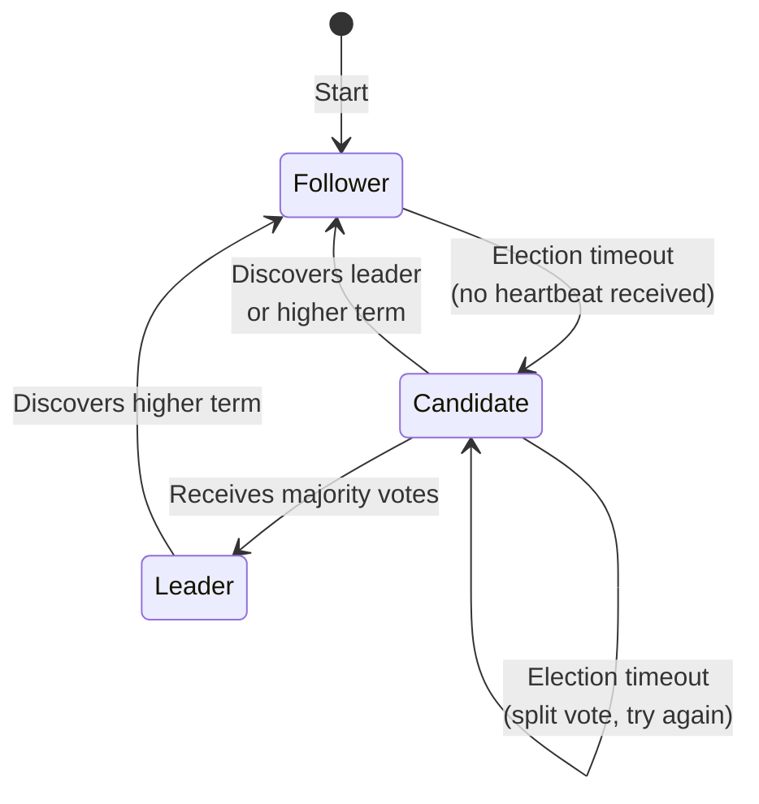

### 3.2 Leader Election

When a follower does not receive a heartbeat from the leader within the
**election timeout**, it suspects the leader has failed and starts an election:

1. The follower increments its term and becomes a **candidate**.
2. It votes for itself and sends `RequestVote` RPCs to all other nodes.
3. Each node votes for at most one candidate per term (first-come-first-served).
4. If the candidate receives votes from a majority, it becomes the **leader**.
5. If another node has already become leader in this term (or a higher term),
   the candidate steps down to follower.
6. If the election times out (no majority), a new election starts with a higher
   term.

Election timeouts are randomized (e.g., 150-300ms) to prevent split votes, where
two candidates start elections simultaneously and neither gets a majority.

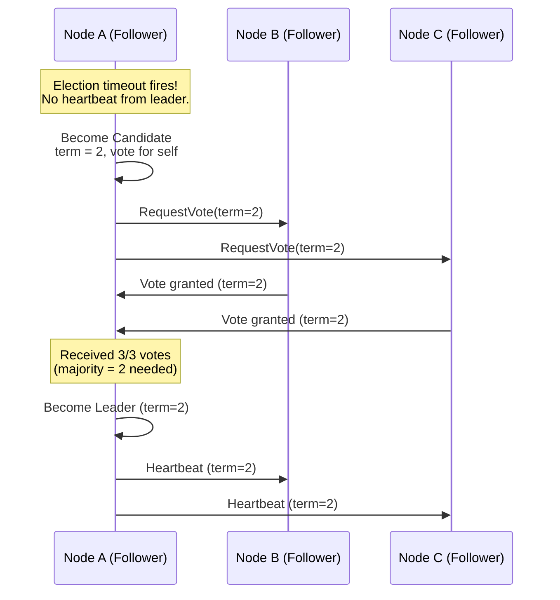

### 3.3 Log Replication

Once elected, the leader handles client requests by appending them to its
**Raft log** -- an ordered sequence of entries. Each entry contains:

- **Index**: Position in the log (1, 2, 3, ...).
- **Term**: The term when the entry was created.
- **Data**: The operation payload (e.g., "set key=abc value=hello").

The leader replicates each entry to followers via `AppendEntries` RPCs:

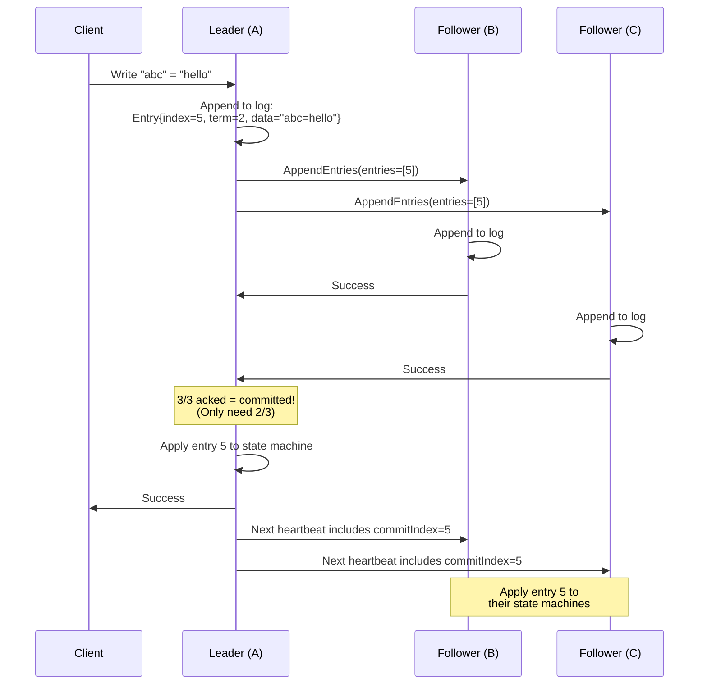

An entry is **committed** when the leader has replicated it to a majority of
nodes. Once committed, the entry will never be lost (even if the leader crashes),
because any future leader must have received votes from at least one node that
has the entry.

### 3.4 Safety

Raft guarantees two key safety properties:

1. **Leader Completeness**: If an entry is committed in a given term, that entry
   will be present in the logs of all leaders for all higher terms. This is
   enforced by the voting rule: a candidate can only win an election if its log
   is at least as up-to-date as the majority.

2. **State Machine Safety**: If a node applies an entry at a given index, no
   other node will ever apply a different entry at that index. This follows from
   Leader Completeness and the fact that entries are applied in order.

### 3.5 PreVote

Standard Raft has a problem: a node that is partitioned from the cluster will
repeatedly time out and increment its term. When it reconnects, its high term
forces the current leader to step down, causing an unnecessary election
disruption.

**PreVote** (also called "prevote") solves this. Before starting a real election,
a candidate first sends "pre-vote" requests without incrementing its term. Only
if a majority grants the pre-vote does the candidate proceed with a real
election. A partitioned node's pre-votes will be rejected (because the majority
already has a leader), so it never increments its term.

gookv enables PreVote by default (`PeerConfig.PreVote = true`).

---

## 4. How gookv Uses etcd/raft

gookv does not implement Raft from scratch. It uses the etcd/raft library
(`go.etcd.io/etcd/raft/v3`), which provides the core Raft state machine as a
library. The key concept is the **RawNode** API.

### 4.1 RawNode API

The etcd/raft library exposes two levels of API:

| API | Description |
|-----|-------------|
| `raft.Node` | High-level: manages its own goroutine, channels, and ready processing. Used by etcd. |
| `raft.RawNode` | Low-level: no goroutines or channels. The caller controls when to tick, step, propose, and process ready state. |

gookv uses `RawNode` because it needs full control over the processing loop.
Each `Peer` goroutine drives its own `RawNode` at its own pace.

### 4.2 The Application's Responsibilities

With `RawNode`, the application (gookv) is responsible for:

| Responsibility | How gookv handles it |
|----------------|---------------------|
| **Calling `Tick()`** periodically | Ticker goroutine fires every 100ms (configurable) |
| **Feeding incoming Raft messages** via `Step()` | Messages arrive via the `Mailbox` channel |
| **Calling `Propose()`** for client requests | `propose()` method serializes and proposes |
| **Processing `Ready()`** batches | `handleReady()` method runs after every event |
| **Persisting entries and hard state** | `PeerStorage.SaveReady()` writes to Pebble |
| **Sending outbound messages** to peers | `sendFunc` callback delivers via gRPC transport |
| **Applying committed entries** to the state machine | `applyFunc` callback writes to the engine |
| **Calling `Advance()`** after processing Ready | Last step in `handleReady()` |

### 4.3 Protobuf Conversion

gookv uses two different Raft protobuf definitions:

- **`raftpb`** (from `go.etcd.io/etcd/raft/v3`): Used internally by etcd/raft.
- **`eraftpb`** (from `github.com/pingcap/kvproto`): Used on the gRPC wire for TiKV compatibility.

Both share the same protobuf wire format, so conversion is done by
marshal/unmarshal in `internal/raftstore/convert.go`:

```go
// EraftpbToRaftpb converts a kvproto eraftpb.Message to etcd raftpb.Message.
func EraftpbToRaftpb(msg *eraftpb.Message) (*raftpb.Message, error) {
    data, err := msg.Marshal()
    if err != nil { return nil, err }
    result := &raftpb.Message{}
    if err := result.Unmarshal(data); err != nil { return nil, err }
    return result, nil
}
```

This conversion happens at the boundary between the gRPC transport layer and
the Raft layer.

---

## 5. The Peer Struct

The `Peer` struct (`internal/raftstore/peer.go`) is the central type in the
Raft layer. Each region replica is a `Peer` instance running in its own
goroutine.

### 5.1 Complete Field Reference

```go
type Peer struct {
    // Identity
    regionID         uint64              // the region this peer belongs to
    peerID           uint64              // this peer's unique ID within the Raft group
    storeID          uint64              // the store (node) this peer runs on
    region           *metapb.Region      // region metadata (start/end key, epoch, peer list)
    regionMu         sync.RWMutex        // protects region (accessed from peer goroutine + gRPC)

    // Raft core
    rawNode          *raft.RawNode       // the etcd/raft state machine
    storage          *PeerStorage        // raft.Storage implementation (persists to engine)
    engine           traits.KvEngine     // the underlying Pebble engine

    // Configuration
    cfg              PeerConfig          // tick intervals, timeouts, thresholds

    // Communication
    Mailbox          chan PeerMsg         // buffered channel for incoming messages
    sendFunc         func([]raftpb.Message)   // outbound Raft message delivery
    applyFunc        func(uint64, []raftpb.Entry)  // committed entry application

    // Proposal tracking
    pendingProposals map[uint64]func([]byte, error)  // log index -> completion callback

    // Log compaction
    raftLogSizeHint  uint64              // estimated bytes in the Raft log
    lastCompactedIdx uint64              // last index sent to the GC worker
    logGCWorkerCh    chan<- RaftLogGCTask // sends tasks to background GC worker

    // PD integration
    pdTaskCh         chan<- interface{}   // sends region heartbeats to PDWorker

    // Split checking
    splitCheckCh     chan<- split.SplitCheckTask  // sends tasks to SplitCheckWorker
    splitResultCh    chan<- *SplitRegionResult     // sends split results to coordinator

    // ReadIndex
    pendingReads     map[string]*pendingRead  // request context -> pending read
    nextReadID       atomic.Uint64            // unique ID generator for read requests

    // Leader lease
    leaseExpiry      time.Time            // when the lease expires
    leaseValid       atomic.Bool          // whether the lease is currently valid

    // State flags
    stopped          atomic.Bool          // whether the peer has been stopped
    isLeader         atomic.Bool          // whether this peer is the Raft leader
    initialized      bool                 // whether initialization is complete
}
```

### 5.2 Relationship Diagram

```mermaid
classDiagram
    class Peer {
        -regionID uint64
        -peerID uint64
        -storeID uint64
        -region *metapb.Region
        -rawNode *raft.RawNode
        -storage *PeerStorage
        -engine traits.KvEngine
        -cfg PeerConfig
        +Mailbox chan PeerMsg
        -sendFunc func([]raftpb.Message)
        -applyFunc func(uint64, []raftpb.Entry)
        -pendingProposals map
        -pendingReads map
        +Run(ctx)
        +Propose(data) error
        +Campaign() error
        +Status() raft.Status
        -handleMessage(msg)
        -propose(cmd)
        -handleReady()
        -onRaftLogGCTick()
        -onSplitCheckTick()
        -handleReadIndexRequest(req)
    }

    class PeerStorage {
        -regionID uint64
        -engine traits.KvEngine
        -hardState raftpb.HardState
        -applyState ApplyState
        -entries []raftpb.Entry
        -persistedLastIndex uint64
        +InitialState()
        +Entries(lo, hi, maxSize)
        +Term(i)
        +LastIndex()
        +FirstIndex()
        +Snapshot()
        +SaveReady(rd)
        +RecoverFromEngine()
    }

    class RawNode {
        +Tick()
        +Step(msg)
        +Propose(data)
        +ReadIndex(ctx)
        +Ready() Ready
        +HasReady() bool
        +Advance(rd)
        +Campaign()
        +Bootstrap(peers)
        +TransferLeader(id)
        +ReportUnreachable(id)
        +ReportSnapshot(id, status)
        +ApplyConfChange(cc)
    }

    class PeerConfig {
        +RaftBaseTickInterval time.Duration
        +RaftElectionTimeoutTicks int
        +RaftHeartbeatTicks int
        +MaxInflightMsgs int
        +MaxSizePerMsg uint64
        +PreVote bool
        +MailboxCapacity int
        +RaftLogGCTickInterval time.Duration
        +RaftLogGCCountLimit uint64
        +RaftLogGCSizeLimit uint64
        +RaftLogGCThreshold uint64
        +SplitCheckTickInterval time.Duration
        +PdHeartbeatTickInterval time.Duration
    }

    Peer --> PeerStorage : storage
    Peer --> RawNode : rawNode
    Peer --> PeerConfig : cfg
    PeerStorage ..|> "raft.Storage" : implements
    RawNode --> "raft.Storage" : reads from
```

---

## 6. PeerConfig: Tuning the Raft Group

`PeerConfig` controls all timing and threshold parameters for a Raft peer.
Here are all fields with their default values and explanations:

| Field | Default | Purpose |
|-------|---------|---------|
| `RaftBaseTickInterval` | 100ms | How often `rawNode.Tick()` is called. This is the "clock" of the Raft state machine. All other Raft timeouts are measured in ticks. |
| `RaftElectionTimeoutTicks` | 10 | Number of ticks (1000ms default) before a follower starts an election. Randomized between 1x and 2x this value by etcd/raft internally. |
| `RaftHeartbeatTicks` | 2 | Number of ticks (200ms default) between leader heartbeats. Must be less than election timeout. |
| `MaxInflightMsgs` | 256 | Maximum number of AppendEntries batches the leader will send to a follower without receiving acknowledgment. Higher values increase throughput at the cost of memory. |
| `MaxSizePerMsg` | 1 MiB | Maximum size of a single Raft message. Entries larger than this are split across messages. |
| `PreVote` | true | Enable the PreVote protocol to prevent disruption from partitioned nodes. |
| `MailboxCapacity` | 256 | Size of the buffered channel (`Mailbox`) for incoming messages. When full, new messages are dropped (non-blocking send). |
| `RaftLogGCTickInterval` | 10s | How often the leader checks whether log compaction is needed. |
| `RaftLogGCCountLimit` | 72000 | Compaction is triggered when the number of entries exceeds this. |
| `RaftLogGCSizeLimit` | 72 MiB | Compaction is triggered when estimated log size exceeds this. |
| `RaftLogGCThreshold` | 50 | Minimum number of entries to keep after compaction. |
| `SplitCheckTickInterval` | 10s | How often the leader scans the region to check if it should split. Set to 0 to disable split checking. |
| `PdHeartbeatTickInterval` | 60s | How often the leader sends a region heartbeat to PD. Set to 0 to only send heartbeats on leadership change. |

These defaults are set by `DefaultPeerConfig()`.

---

## 7. Message Types

Peer goroutines receive messages through their `Mailbox` channel. Each message
has a `Type` field that determines how it is processed.

### 7.1 PeerMsg

```go
type PeerMsg struct {
    Type PeerMsgType
    Data interface{}
}
```

### 7.2 PeerMsgType Table

| Type | Value | Data Type | Action |
|------|-------|-----------|--------|
| `PeerMsgTypeRaftMessage` | 0 | `*raftpb.Message` | Feed to `rawNode.Step()` for Raft protocol processing |
| `PeerMsgTypeRaftCommand` | 1 | `*RaftCommand` | Client read/write request to be proposed via `propose()` |
| `PeerMsgTypeTick` | 2 | (none) | Call `rawNode.Tick()` for an additional tick |
| `PeerMsgTypeApplyResult` | 3 | `*ApplyResult` | Process results from the apply worker via `onApplyResult()` |
| `PeerMsgTypeSignificant` | 4 | `*SignificantMsg` | High-priority control: Unreachable, SnapshotStatus, MergeResult |
| `PeerMsgTypeStart` | 5 | (none) | Peer initialization signal (defined but not currently handled) |
| `PeerMsgTypeDestroy` | 6 | (none) | Stop the peer and close the mailbox |
| `PeerMsgTypeCasual` | 7 | (none) | Low-priority, droppable messages (defined but not handled) |
| `PeerMsgTypeSchedule` | 8 | `*ScheduleMsg` | PD scheduling: TransferLeader, ChangePeer, Merge |
| `PeerMsgTypeReadIndex` | 9 | `*ReadIndexRequest` | Linearizable read index request from coordinator |
| `PeerMsgTypeCancelRead` | 10 | `[]byte` | Cancel a timed-out pending read by request context |

### 7.3 RaftCommand

```go
type RaftCommand struct {
    Request  *raft_cmdpb.RaftCmdRequest
    Callback func(*raft_cmdpb.RaftCmdResponse)
}
```

A `RaftCommand` wraps a client request (serialized as protobuf) with a callback
that is invoked when the request is committed and applied. The `Callback` is
stored in `pendingProposals` by the expected log index.

### 7.4 ReadIndexRequest

```go
type ReadIndexRequest struct {
    RequestCtx []byte       // opaque context for correlating request and response
    Callback   func(error)  // invoked when appliedIndex >= readIndex
}
```

### 7.5 Other Data Structs

| Struct | Fields | Purpose |
|--------|--------|---------|
| `ApplyResult` | `RegionID`, `Results []ExecResult` | Results from applying committed entries |
| `ExecResult` | `Type ExecResultType`, `Data interface{}` | Single execution result |
| `SplitRegionResult` | `Derived *metapb.Region`, `Regions []*metapb.Region` | Split operation output |
| `CompactLogRequest` | `CompactIndex`, `CompactTerm` | Parameters for log compaction |
| `CompactLogResult` | `TruncatedIndex`, `TruncatedTerm`, `FirstIndex` | Result of log compaction |
| `RaftLogGCTask` | `RegionID`, `StartIdx`, `EndIdx` | Background log deletion task |
| `SignificantMsg` | `Type`, `RegionID`, `ToPeerID`, `Status` | High-priority control message |
| `ScheduleMsg` | `Type`, `TransferLeader`, `ChangePeer`, `Merge` | PD scheduling command |

---

## 8. Peer Lifecycle

### 8.1 Initialization: NewPeer

`NewPeer` creates a new `Peer` for a given region. It takes two paths depending
on whether the cluster is being bootstrapped or a node is restarting.

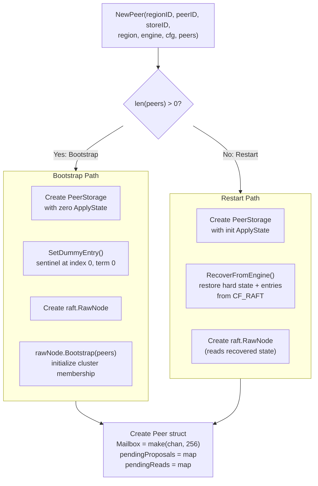

The `raft.Config` passed to `raft.NewRawNode` is configured with:

```go
raftCfg := &raft.Config{
    ID:              peerID,
    ElectionTick:    cfg.RaftElectionTimeoutTicks,  // 10
    HeartbeatTick:   cfg.RaftHeartbeatTicks,         // 2
    Storage:         storage,                        // PeerStorage
    MaxInflightMsgs: cfg.MaxInflightMsgs,            // 256
    MaxSizePerMsg:   cfg.MaxSizePerMsg,               // 1 MiB
    CheckQuorum:     true,                           // leader steps down without quorum
    PreVote:         cfg.PreVote,                     // true
    ReadOnlyOption:  raft.ReadOnlySafe,               // ReadIndex with quorum check
}
```

Key settings:

- **CheckQuorum**: The leader steps down if it does not hear from a majority
  of followers within an election timeout. This prevents a partitioned leader
  from serving stale reads.
- **PreVote**: Prevents disruption from partitioned nodes (see Section 3.5).
- **ReadOnlySafe**: ReadIndex requests require a quorum round-trip to confirm
  leadership (see Section 14).

### 8.2 Wiring

After `NewPeer` returns, the `StoreCoordinator` wires up the peer's callbacks
and channels:

```go
peer.SetSendFunc(coord.sendRaftMessage)      // outbound Raft messages
peer.SetApplyFunc(coord.applyEntriesForPeer) // committed entry application
peer.SetLogGCWorkerCh(gcWorkerCh)            // log compaction tasks
peer.SetPDTaskCh(pdTaskCh)                   // PD heartbeat tasks
peer.SetSplitCheckCh(splitCheckCh)           // split check tasks
peer.SetSplitResultCh(splitResultCh)         // split results
peer.SetSnapTaskCh(snapTaskCh)               // snapshot generation tasks

router.Register(regionID, peer.Mailbox)      // register with router
go peer.Run(ctx)                             // start event loop goroutine
```

### 8.3 Shutdown

A peer stops when:
- Its context is cancelled (graceful shutdown via `coord.Stop()`)
- It receives a `PeerMsgTypeDestroy` message (removal via conf change)
- It detects self-removal during conf change processing
- A merge result sets `stopped = true`

---

## 9. The Event Loop: Peer.Run

`Peer.Run(ctx)` is the main event loop. It blocks until the peer is stopped.
Every event (tick, message, timer) is followed by a `handleReady()` call to
process any pending Raft state changes.

### 9.1 Complete Event Loop

```go
func (p *Peer) Run(ctx context.Context) {
    ticker := time.NewTicker(p.cfg.RaftBaseTickInterval) // 100ms
    defer ticker.Stop()

    // Optional periodic tickers (created only if interval > 0)
    var gcTickerCh <-chan time.Time          // log GC check
    var splitCheckTickerCh <-chan time.Time   // split check
    var pdHeartbeatTickerCh <-chan time.Time  // PD heartbeat

    for {
        select {
        case <-ctx.Done():           // Shutdown
            p.stopped.Store(true)
            return

        case <-ticker.C:             // Raft tick (100ms)
            p.rawNode.Tick()

        case <-gcTickerCh:           // Log GC check (10s)
            p.onRaftLogGCTick()

        case <-splitCheckTickerCh:   // Split check (10s)
            p.onSplitCheckTick()

        case <-pdHeartbeatTickerCh:  // PD heartbeat (60s)
            if p.isLeader.Load() && p.pdTaskCh != nil {
                p.sendRegionHeartbeatToPD()
            }

        case msg, ok := <-p.Mailbox: // Incoming message
            if !ok { return }
            p.handleMessage(msg)
            // Drain up to 63 more queued messages before handleReady
            for i := 0; i < 63; i++ {
                select {
                case msg, ok = <-p.Mailbox:
                    if !ok { return }
                    p.handleMessage(msg)
                default:
                    goto drained
                }
            }
        drained:
        }

        p.handleReady()  // Process Raft Ready after EVERY event
    }
}
```

### 9.2 Event Loop Diagram

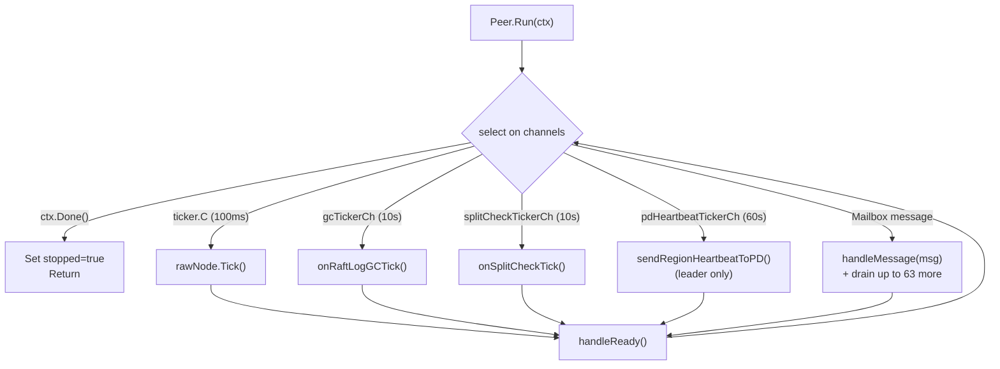

### 9.3 Message Batch Draining

When a message arrives on the mailbox, the peer processes it and then attempts
to drain up to 63 additional messages before calling `handleReady()`. This
batching reduces the overhead of processing `handleReady()` after every single
message, and ensures that heartbeat responses and other time-sensitive messages
queued behind a burst of proposals are processed promptly.

### 9.4 handleMessage Dispatch

```go
func (p *Peer) handleMessage(msg PeerMsg) {
    switch msg.Type {
    case PeerMsgTypeRaftMessage:
        raftMsg := msg.Data.(*raftpb.Message)
        p.rawNode.Step(*raftMsg)

    case PeerMsgTypeRaftCommand:
        cmd := msg.Data.(*RaftCommand)
        p.propose(cmd)

    case PeerMsgTypeTick:
        p.rawNode.Tick()

    case PeerMsgTypeApplyResult:
        result := msg.Data.(*ApplyResult)
        p.onApplyResult(result)

    case PeerMsgTypeSignificant:
        sig := msg.Data.(*SignificantMsg)
        p.handleSignificantMessage(sig)

    case PeerMsgTypeSchedule:
        sched := msg.Data.(*ScheduleMsg)
        p.handleScheduleMessage(sched)

    case PeerMsgTypeDestroy:
        p.stopped.Store(true)
        close(p.Mailbox)

    case PeerMsgTypeReadIndex:
        req := msg.Data.(*ReadIndexRequest)
        p.handleReadIndexRequest(req)

    case PeerMsgTypeCancelRead:
        ctx := msg.Data.([]byte)
        delete(p.pendingReads, string(ctx))
    }
}
```

---

## 10. handleReady: The Heart of Raft Processing

`handleReady()` is the most important function in the Raft layer. It processes
the `raft.Ready` struct returned by `rawNode.Ready()`, which contains all
pending state changes that need to be acted upon.

### 10.1 What is raft.Ready?

`raft.Ready` is a batch of state changes produced by the etcd/raft library:

```go
type Ready struct {
    SoftState        *SoftState        // leader/role changes (not persisted)
    HardState        HardState         // term, vote, commit index (must persist)
    Entries          []Entry           // new entries to persist (not yet committed)
    Snapshot         Snapshot          // snapshot to apply (if received)
    CommittedEntries []Entry           // entries committed since last Ready
    Messages         []Message         // outbound Raft messages to send
    ReadStates       []ReadState       // completed ReadIndex requests
}
```

### 10.2 Step-by-Step Processing

```mermaid
flowchart TD
    Start["handleReady()"] --> Guard{"rawNode.HasReady()?"}
    Guard -->|"No"| Return["Return (nothing to do)"]

    Guard -->|"Yes"| GetReady["rd := rawNode.Ready()"]

    GetReady --> CheckSoftState{"rd.SoftState != nil?"}
    CheckSoftState -->|"Yes"| UpdateLeader["Update isLeader<br/>based on SoftState.Lead == peerID"]
    UpdateLeader --> CheckNewLeader{"Became leader?"}
    CheckNewLeader -->|"Yes"| NotifyPD["sendRegionHeartbeatToPD()<br/>Extend leader lease"]
    CheckNewLeader -->|"No"| CheckStepDown{"Stepped down?"}
    CheckStepDown -->|"Yes"| InvalidateLease["Invalidate lease<br/>Clear pending reads"]
    CheckStepDown -->|"No"| Persist
    NotifyPD --> Persist
    InvalidateLease --> Persist
    CheckSoftState -->|"No"| Persist

    Persist["storage.SaveReady(rd)<br/>Write HardState + Entries to CF_RAFT"]

    Persist --> CheckSnap{"rd.Snapshot non-empty?"}
    CheckSnap -->|"Yes"| ApplySnap["storage.ApplySnapshot(rd.Snapshot)<br/>Apply received snapshot data"]
    CheckSnap -->|"No"| SendMsgs
    ApplySnap --> SendMsgs

    SendMsgs{"Messages to send?"}
    SendMsgs -->|"Yes"| Send["sendFunc(rd.Messages)<br/>Deliver to other peers via gRPC"]
    SendMsgs -->|"No"| CheckCommitted
    Send --> CheckCommitted

    CheckCommitted{"Committed entries?"}
    CheckCommitted -->|"Yes"| ProcessAdmin["Process admin entries first:<br/>ConfChange -> applyConfChangeEntry<br/>SplitAdmin -> applySplitAdminEntry"]
    ProcessAdmin --> ApplyEntries["applyFunc(regionID, entries)<br/>Apply ALL entries to state machine"]
    ApplyEntries --> InvokeCallbacks["Invoke pendingProposals callbacks<br/>for each committed entry index"]
    InvokeCallbacks --> UpdateApplied["Update applied index"]
    CheckCommitted -->|"No"| ProcessReads
    UpdateApplied --> ProcessReads

    ProcessReads{"ReadStates present?"}
    ProcessReads -->|"Yes"| ExtendLease["Extend leader lease<br/>(quorum confirmed)"]
    ExtendLease --> MatchReads["For each ReadState:<br/>Match to pendingReads by context<br/>If appliedIndex >= readIndex,<br/>invoke callback"]
    ProcessReads -->|"No"| SweepReads
    MatchReads --> SweepReads

    SweepReads["Sweep all pendingReads:<br/>complete any now satisfiable"]

    SweepReads --> Advance["rawNode.Advance(rd)<br/>Signal Ready is processed"]

    Advance --> Return
```

### 10.3 Detailed Code Walkthrough

Here is the actual `handleReady` implementation with annotations:

```go
func (p *Peer) handleReady() {
    // Step 1: Guard -- nothing to do if Raft has no pending state changes.
    if !p.rawNode.HasReady() {
        return
    }

    // Step 2: Get the Ready batch.
    rd := p.rawNode.Ready()

    // Step 3: Update leader status.
    if rd.SoftState != nil {
        wasLeader := p.isLeader.Load()
        p.isLeader.Store(rd.SoftState.Lead == p.peerID)

        // On becoming leader: notify PD and extend lease.
        if p.isLeader.Load() && !wasLeader {
            p.sendRegionHeartbeatToPD()
            electionTimeout := time.Duration(p.cfg.RaftElectionTimeoutTicks) *
                p.cfg.RaftBaseTickInterval
            p.leaseExpiry = time.Now().Add(electionTimeout * 4 / 5)
            p.leaseValid.Store(true)
        }

        // On stepping down: invalidate lease, fail pending reads.
        if !p.isLeader.Load() && wasLeader {
            p.leaseValid.Store(false)
        }
        if !p.isLeader.Load() && len(p.pendingReads) > 0 {
            for key, pr := range p.pendingReads {
                pr.callback(fmt.Errorf("not leader for region %d", p.regionID))
                delete(p.pendingReads, key)
            }
        }
    }

    // Step 4: Persist entries and hard state to CF_RAFT.
    if err := p.storage.SaveReady(rd); err != nil {
        return // Fatal: persistence failure
    }

    // Step 5: Apply snapshot if received.
    if !raft.IsEmptySnap(rd.Snapshot) {
        if err := p.storage.ApplySnapshot(rd.Snapshot); err != nil {
            slog.Error("failed to apply snapshot", ...)
        }
    }

    // Step 6: Send outbound Raft messages.
    if p.sendFunc != nil && len(rd.Messages) > 0 {
        p.sendFunc(rd.Messages)
    }

    // Step 7: Apply committed entries.
    if len(rd.CommittedEntries) > 0 {
        // 7a: Process admin commands FIRST (before data entries).
        for _, e := range rd.CommittedEntries {
            if e.Type == raftpb.EntryConfChange || ... {
                p.applyConfChangeEntry(e)
            } else if IsSplitAdmin(e.Data) {
                p.applySplitAdminEntry(&e)
            }
        }

        // 7b: Forward ALL entries to apply worker.
        if p.applyFunc != nil {
            p.applyFunc(p.regionID, rd.CommittedEntries)
        }

        // 7c: Invoke callbacks for committed proposals.
        for _, e := range rd.CommittedEntries {
            if cb, ok := p.pendingProposals[e.Index]; ok {
                cb(e.Data, nil)
                delete(p.pendingProposals, e.Index)
            }
        }

        // 7d: Update applied index.
        lastEntry := rd.CommittedEntries[len(rd.CommittedEntries)-1]
        p.storage.SetAppliedIndex(lastEntry.Index)
    }

    // Step 8: Process ReadIndex results.
    if len(rd.ReadStates) > 0 && p.isLeader.Load() {
        // Extend lease (quorum round-trip just succeeded).
        electionTimeout := time.Duration(p.cfg.RaftElectionTimeoutTicks) *
            p.cfg.RaftBaseTickInterval
        p.leaseExpiry = time.Now().Add(electionTimeout * 4 / 5)
        p.leaseValid.Store(true)
    }
    for _, rs := range rd.ReadStates {
        if pr, ok := p.pendingReads[string(rs.RequestCtx)]; ok {
            pr.readIndex = rs.Index
            if p.storage.AppliedIndex() >= rs.Index {
                pr.callback(nil)
                delete(p.pendingReads, string(rs.RequestCtx))
            }
        }
    }

    // Sweep: committed entries above may have advanced appliedIndex.
    if len(p.pendingReads) > 0 {
        appliedIdx := p.storage.AppliedIndex()
        for key, pr := range p.pendingReads {
            if pr.readIndex > 0 && appliedIdx >= pr.readIndex {
                pr.callback(nil)
                delete(p.pendingReads, key)
            }
        }
    }

    // Step 9: Tell etcd/raft we are done processing this Ready.
    p.rawNode.Advance(rd)
}
```

### 10.4 Admin Entry Ordering

A critical detail: admin commands (ConfChange, SplitAdmin) are processed in the
**first loop** over committed entries, before `applyFunc` is called. This
ensures that region metadata is updated before data entries are applied. For
example, a split changes the region's key range -- data entries must be applied
with the updated range.

When `applyFunc` receives the entries, admin entries (SplitAdmin, CompactLog)
are harmlessly skipped because they fail protobuf unmarshal (they use custom
binary formats, not protobuf).

---

## 11. Proposal Flow

Here is the complete flow of a client write from entry to commitment:

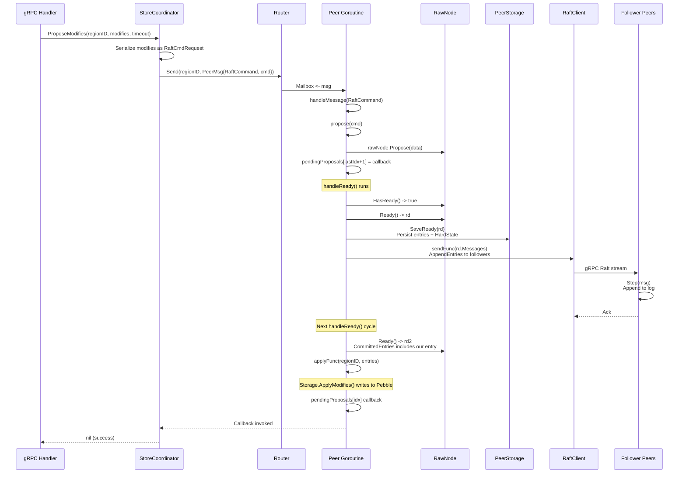

### 11.1 ProposeModifies Details

`StoreCoordinator.ProposeModifies` is the entry point for all Raft proposals:

1. Look up the peer for `regionID`.
2. Verify this peer is the leader.
3. Optionally validate region epoch (prevent proposals to stale regions).
4. Convert `[]mvcc.Modify` to `[]*raft_cmdpb.Request` via `ModifiesToRequests`.
5. Wrap in a `RaftCmdRequest` with the current region epoch in the header.
6. Create a `RaftCommand` with a completion callback.
7. Send the command to the peer's mailbox via the router.
8. Block on the callback or timeout.

---

## 12. The propose() Function

The `propose()` method is where client requests enter the Raft log:

```go
func (p *Peer) propose(cmd *RaftCommand) {
    if cmd.Request == nil {
        return
    }

    data, err := cmd.Request.Marshal()
    if err != nil {
        return
    }

    if err := p.rawNode.Propose(data); err != nil {
        // IMPORTANT: Do NOT call callback on failure.
        // Let ProposeModifies timeout and return error.
        return
    }

    // Track the proposal callback.
    lastIdx, _ := p.storage.LastIndex()
    expectedIdx := lastIdx + 1
    if cmd.Callback != nil {
        p.pendingProposals[expectedIdx] = func(_ []byte, _ error) {
            cmd.Callback(nil)
        }
    }
}
```

### 12.1 Critical Design Decision: No Callback on Propose Failure

When `rawNode.Propose()` fails (for example, because the node is no longer
the leader), the `propose()` function does **not** call the callback. This is
intentional.

If the callback were called with `nil` (success), `ProposeModifies` would
report success even though the entry never entered the Raft log -- a silent
data loss.

If the callback were called with an error, `ProposeModifies` might return
before the timeout, but the error handling would be ambiguous (is this a
transient error? Should the client retry?).

Instead, the proposal simply times out. The caller (`ProposeModifies`) has a
timeout parameter and returns a timeout error, which the gRPC handler converts
to a `NotLeader` region error. The client then refreshes its region cache and
retries with the new leader.

### 12.2 Index Prediction

The callback is stored in `pendingProposals` at `lastIdx + 1` -- the expected
index of the proposed entry. This is a prediction: the actual index might differ
if another proposal was appended concurrently. However, since each `Peer` runs
in a single goroutine, proposals are sequential, and the prediction is reliable.

---

## 13. Admin Commands

Admin commands are special Raft entries that modify the Raft group itself
(compacting the log, splitting the region). They use a tag-byte format to
distinguish them from normal protobuf data entries.

### 13.1 CompactLog (Tag 0x01)

**Purpose**: Truncate old Raft log entries to prevent unbounded storage growth.

**Binary format**:
```
[0x01] [CompactIndex: 8 bytes BE] [CompactTerm: 8 bytes BE]
```

Total: 17 bytes.

**How it is identified**: The first byte is `0x01`. Normal data entries start
with a protobuf `RaftCmdRequest`, whose first byte is `0x0A` (protobuf field
tag for field 1, wire type 2). So there is no collision.

**Lifecycle**:
1. `onRaftLogGCTick()` detects the log is too large.
2. `marshalCompactLogRequest()` serializes the request.
3. `rawNode.Propose(data)` enters it into the Raft log.
4. After commitment, `handleReady` detects it (via `unmarshalCompactLogRequest`).
5. `execCompactLog()` updates the `ApplyState`.
6. `onReadyCompactLog()` sends a `RaftLogGCTask` to the background worker.
7. `RaftLogGCWorker.gcRaftLog()` deletes the old entries from CF_RAFT.

### 13.2 SplitAdmin (Tag 0x02)

**Purpose**: Split a region into two (or more) smaller regions.

**Binary format**:
```
[0x02] [SplitKeyLen: 4 bytes BE] [SplitKey: variable]
[NumNewRegions: 4 bytes BE]
For each new region:
    [RegionID: 8 bytes BE]
    [NumPeerIDs: 4 bytes BE]
    [PeerID1: 8 bytes BE] ... [PeerIDN: 8 bytes BE]
```

**How it is identified**: The first byte is `0x02`.

**Lifecycle**:
1. `onSplitCheckTick()` sends a `SplitCheckTask` to the `SplitCheckWorker`.
2. The worker scans the region's data CFs to estimate its size.
3. If the region exceeds the threshold, a `SplitCheckResult` with a split key
   is returned.
4. The coordinator calls PD's `AskBatchSplit` to get new region/peer IDs.
5. `peer.ProposeSplit()` proposes the split as a Raft admin command.
6. After commitment, `applySplitAdminEntry()` calls `ExecSplitAdmin()`.
7. `ExecBatchSplit()` creates new region metadata and updates the parent.
8. The coordinator bootstraps child regions and reports to PD.

**Why admin commands go through Raft**: Splits must be ordered relative to data
writes. If a split were applied outside the Raft log, a data write could be
proposed with the old region range but applied after the split changes the
range -- leading to data being written to the wrong region.

---

## 14. ReadIndex Protocol

### 14.1 The Problem with Reads

In Raft, only the leader serves client requests. But how does the leader know
it is still the leader? A leader that has been partitioned from the cluster
might not know that a new leader has been elected. If it serves reads, it could
return stale data.

There are several approaches to this problem:

| Approach | Latency | Correctness |
|----------|---------|-------------|
| Read from leader without check | Low | Stale reads possible |
| Replicate reads through Raft | High (full Raft round-trip) | Correct |
| ReadIndex with quorum check | Medium (heartbeat round-trip) | Correct |
| Leader lease | Low | Correct (with clock assumptions) |

gookv uses **ReadIndex** with a leader lease optimization.

### 14.2 How ReadIndex Works

ReadIndex is a lightweight protocol that confirms the leader's authority without
replicating the read through the Raft log:

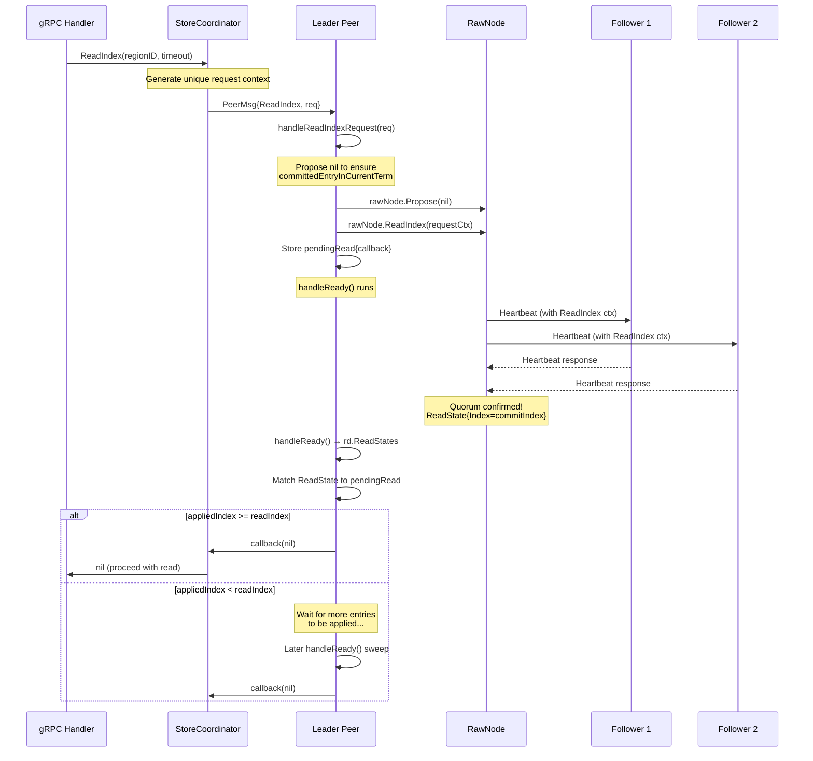

### 14.3 The No-Op Propose Trick

There is a subtlety with ReadIndex in etcd/raft: the leader must have committed
at least one entry in the current term before it can serve ReadIndex requests.
This is because the leader needs to know its commit index is up-to-date, which
is only guaranteed after it has committed an entry of its own.

After a leader transfer or split, the new leader may not have committed any
entries yet. To accelerate this, `handleReadIndexRequest` proposes a `nil`
(no-op) entry before calling `ReadIndex`:

```go
func (p *Peer) handleReadIndexRequest(req *ReadIndexRequest) {
    if !p.isLeader.Load() {
        req.Callback(fmt.Errorf("not leader for region %d", p.regionID))
        return
    }
    // Propose no-op to ensure committedEntryInCurrentTerm is true.
    _ = p.rawNode.Propose(nil)
    p.rawNode.ReadIndex(req.RequestCtx)
    p.pendingReads[string(req.RequestCtx)] = &pendingRead{
        readIndex: 0,
        callback:  req.Callback,
    }
}
```

### 14.4 Leader Lease

ReadIndex requires a heartbeat round-trip for every read, which adds latency.
To optimize this, gookv implements a **leader lease**: a time window during
which the leader can serve reads without a ReadIndex round-trip.

The lease works as follows:

1. When the leader confirms quorum (via ReadIndex ReadStates or on becoming
   leader), it sets `leaseExpiry` to `now + 80% * election_timeout`.
2. The 80% factor is conservative: the lease expires before followers would
   start an election (which happens at 100-200% of election_timeout due to
   randomization).
3. During the lease window, reads can proceed immediately without ReadIndex.

**Current status**: The lease is tracked (`leaseExpiry`, `leaseValid`) but the
fast path is disabled. The coordinator always uses the full ReadIndex protocol.
This is because the lease confirms leadership but does not guarantee that all
committed entries have been applied -- a read during the lease window could see
stale data if entries are committed but not yet applied. A future optimization
will re-enable the lease path by adding an `appliedIndex >= commitIndex` check.

### 14.5 pendingRead Lifecycle

```go
type pendingRead struct {
    readIndex uint64       // the commit index that must be applied
    callback  func(error)  // invoked when safe to read
}
```

A `pendingRead` starts with `readIndex = 0`. When `handleReady` processes the
corresponding `ReadState`, it sets `readIndex` to the confirmed commit index.
If `appliedIndex >= readIndex`, the callback fires immediately. Otherwise, the
read waits until future committed entries advance the applied index past the
read index.

If the leader steps down before the read completes, all pending reads are
cancelled with a "not leader" error.

If the read times out (configured by the caller), `CancelPendingRead` sends a
`PeerMsgTypeCancelRead` message to clean up the stale entry.

---

## 15. PeerStorage: Persistent Raft State

`PeerStorage` (`internal/raftstore/storage.go`) implements the `raft.Storage`
interface required by etcd/raft. It persists Raft state to the `CF_RAFT`
column family and caches recent entries in memory.

### 15.1 Struct Definition

```go
type PeerStorage struct {
    mu                 sync.RWMutex
    regionID           uint64
    engine             traits.KvEngine

    hardState          raftpb.HardState   // term, vote, commit
    applyState         ApplyState         // applied/truncated indices
    entries            []raftpb.Entry     // in-memory cache (last 1024 entries)
    persistedLastIndex uint64             // last index written to engine

    // Snapshot state machine
    snapState          SnapState
    snapReceiver       <-chan GenSnapResult
    snapCanceled       *atomic.Bool
    snapTriedCnt       int
    snapTaskCh         chan<- GenSnapTask
    region             *metapb.Region
}
```

### 15.2 raft.Storage Interface

`PeerStorage` implements all six methods of `raft.Storage`:

| Method | Behavior |
|--------|----------|
| `InitialState()` | Returns the in-memory `hardState` and an empty `ConfState` |
| `Entries(lo, hi, maxSize)` | Serves from cache if range is covered; falls back to per-index engine reads; respects `maxSize` byte cap |
| `Term(i)` | Returns truncated term for `TruncatedIndex`; otherwise checks cache, then engine |
| `LastIndex()` | Returns last cache entry index, or `persistedLastIndex` if cache is empty |
| `FirstIndex()` | Returns `TruncatedIndex + 1` |
| `Snapshot()` | Returns snapshot metadata; may trigger async generation via `SnapWorker` |

### 15.3 Entry Cache

The in-memory cache holds the most recent entries (up to 1024):

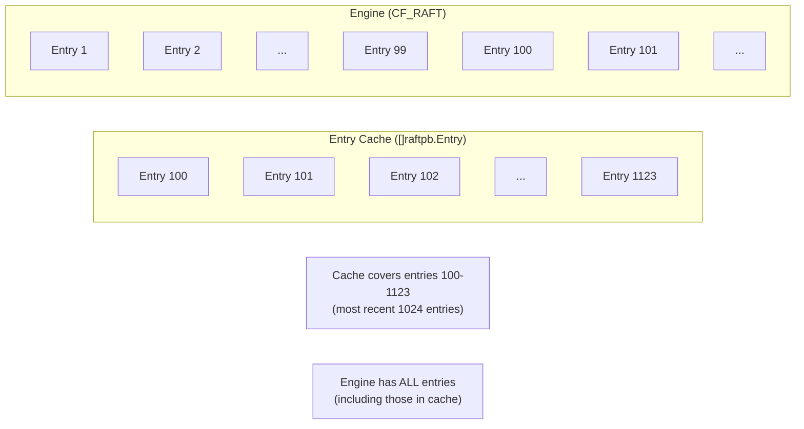

When `Entries(lo, hi, maxSize)` is called:

1. If the requested range `[lo, hi)` falls entirely within the cache, serve
   from the cache directly. This is the fast path.
2. Otherwise, fall back to `readEntriesFromEngine(lo, hi)`, which reads entries
   one at a time from CF_RAFT using `engine.Get(CFRaft, RaftLogKey(regionID, idx))`.

The `appendToCache` method handles overlap when new entries arrive:
- If new entries start at or before the cache's first index, the cache is
  replaced entirely.
- Otherwise, the cache is truncated at the overlap point and new entries are
  appended.
- If the total exceeds 1024 entries, the oldest are discarded.

### 15.4 SaveReady

`SaveReady(rd raft.Ready)` persists a Ready batch atomically:

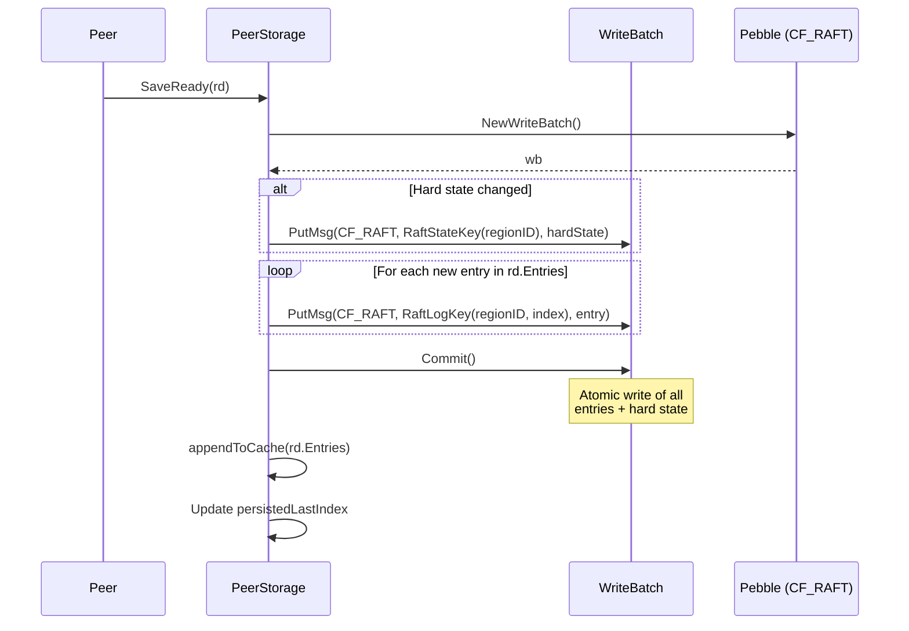

Key layout in CF_RAFT:

| Key | Value |
|-----|-------|
| `[0x01][0x02][regionID:8B][0x02]` | `HardState` protobuf (term, vote, commit) |
| `[0x01][0x02][regionID:8B][0x01][logIndex:8B]` | `Entry` protobuf (index, term, data) |
| `[0x01][0x02][regionID:8B][0x03]` | `ApplyState` (applied/truncated indices) |

### 15.5 RecoverFromEngine

Called on restart (non-bootstrap path):

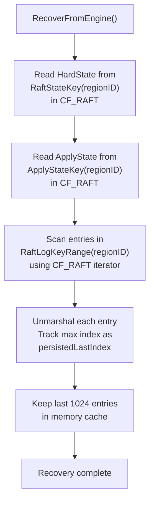

### 15.6 HasPersistedRaftState

A utility function used by `StoreCoordinator.CreatePeer`:

```go
func HasPersistedRaftState(engine traits.KvEngine, regionID uint64) bool
```

Checks if `RaftStateKey(regionID)` exists in CF_RAFT. If it does, the peer
should recover from the engine (`RecoverFromEngine`). If not, the peer is new
and should be bootstrapped with the region's peer list.

### 15.7 Initialization Constants

```go
const (
    RaftInitLogTerm  uint64 = 5
    RaftInitLogIndex uint64 = 5
)
```

These match TiKV conventions. A newly created `PeerStorage` (non-bootstrap)
starts with `AppliedIndex = 5`, `TruncatedIndex = 5`, `TruncatedTerm = 5`.
This avoids edge cases with index 0 and provides a clean starting point.

---

## 16. Log Compaction

### 16.1 The Problem

The Raft log grows without bound as entries are appended. Without compaction,
the log would eventually fill the disk. Additionally, sending the entire log
to a slow or restarting follower would take an impractical amount of time.

### 16.2 Overview

Log compaction removes old entries that have already been applied to the state
machine. gookv uses two mechanisms:

1. **CompactLog admin command**: A Raft entry that records the compaction
   decision. All replicas agree on where to truncate.
2. **RaftLogGCWorker**: A background goroutine that physically deletes the
   old entries from CF_RAFT.

### 16.3 Compaction Decision: onRaftLogGCTick

The leader periodically evaluates whether compaction is needed:

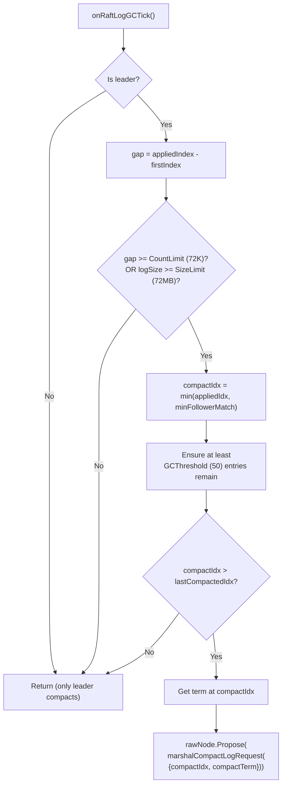

A key detail: the compact index considers the **minimum match index** across all
followers. This ensures we do not compact entries that followers still need.
Compacting past a follower's match index would force a full snapshot transfer
instead of incremental log replication.

### 16.4 Execution: execCompactLog

```go
func execCompactLog(applyState *ApplyState, req CompactLogRequest) (*CompactLogResult, error)
```

Validates the request (compact index must exceed current truncated index and not
exceed applied index) and updates `ApplyState.TruncatedIndex` and
`TruncatedTerm`. Returns a `CompactLogResult` with the old and new indices.

### 16.5 Physical Deletion: RaftLogGCWorker

```go
type RaftLogGCWorker struct {
    engine traits.KvEngine
    taskCh <-chan RaftLogGCTask
    stopCh <-chan struct{}
}
```

The worker runs in a background goroutine, consuming `RaftLogGCTask` from its
channel. Each task deletes entries in `[StartIdx, EndIdx)` using:

```go
engine.DeleteRange(CFRaft, RaftLogKey(regionID, startIdx), RaftLogKey(regionID, endIdx))
```

This is a single `DeleteRange` call that efficiently removes an entire range of
Raft log entries from CF_RAFT. Errors are logged but do not stop the worker
(best-effort deletion).

### 16.6 Complete Log Compaction Flow

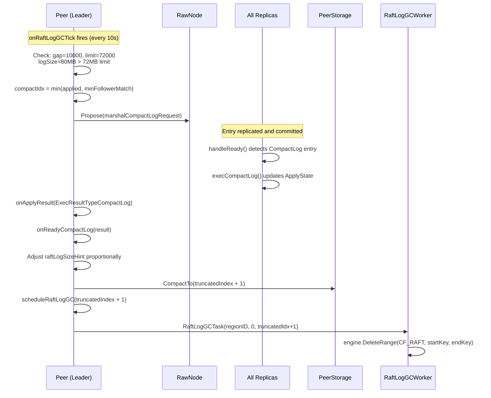

---

## 17. Snapshots

### 17.1 When Snapshots Are Needed

A snapshot is needed when a follower falls too far behind the leader and the
leader no longer has the log entries the follower needs (because they were
compacted). Instead of replaying the entire log, the leader sends a snapshot
of the current state.

Snapshots are also used when a new node joins the cluster and needs to catch
up on all existing data.

### 17.2 Snapshot Data Format

```go
type SnapshotData struct {
    RegionID uint64
    Version  uint64
    CFFiles  []SnapshotCFFile
}

type SnapshotCFFile struct {
    CF       string
    KVPairs  []SnapKVPair
    Checksum uint32           // CRC32 integrity check
}

type SnapKVPair struct {
    Key   []byte
    Value []byte
}
```

A snapshot contains all key-value pairs from the three data CFs (CF_DEFAULT,
CF_LOCK, CF_WRITE) within the region's key range. Each CF's data includes a
CRC32 checksum for integrity verification.

### 17.3 SnapState: Tracking Snapshot Progress

| State | Meaning |
|-------|---------|
| `SnapStateRelax` | No snapshot in progress |
| `SnapStateGenerating` | Background generation running |
| `SnapStateApplying` | Applying a received snapshot |

### 17.4 End-to-End Snapshot Transfer

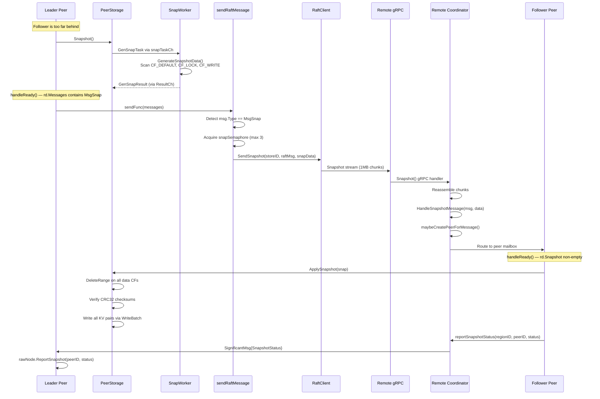

### 17.5 Snapshot Throttling

The `snapSemaphore` in `StoreCoordinator` limits concurrent outbound snapshots
to 3. This prevents "snapshot storms" when many regions are scheduled to a new
node simultaneously. Each `sendRaftMessage` call for a `MsgSnap` acquires the
semaphore before sending and releases it after completion (success or failure).

---

## 18. The Router: Message Routing

### 18.1 Purpose

The `Router` (`internal/raftstore/router/router.go`) maps region IDs to peer
mailbox channels. It is the central dispatch point for all incoming Raft
messages.

### 18.2 Implementation

```go
type Router struct {
    peers   sync.Map              // regionID (uint64) -> chan PeerMsg
    storeCh chan raftstore.StoreMsg // store-level message channel
}
```

The `sync.Map` provides lock-free concurrent access, which is important because
multiple goroutines (gRPC handlers, transport receivers) may route messages
simultaneously.

### 18.3 Methods

**`Register(regionID, ch) error`**

Registers a peer's mailbox channel. Uses `sync.Map.LoadOrStore` to detect
duplicates. Returns `ErrPeerAlreadyRegistered` if the region already exists.

**`Send(regionID, msg) error`**

Looks up the mailbox and performs a **non-blocking send**:

```go
select {
case ch <- msg:
    return nil
default:
    return ErrMailboxFull
}
```

Returns `ErrRegionNotFound` or `ErrMailboxFull`. The non-blocking send prevents
a slow peer from blocking the caller.

**`Broadcast(msg)`**

Iterates all registered peers via `sync.Map.Range` and attempts a non-blocking
send to each. Messages to full mailboxes are silently dropped. Broadcast is
best-effort.

**`SendStore(msg) error`**

Sends a message to the store-level channel. Used for messages that do not
target a specific region (e.g., create peer, destroy peer).

**`Unregister(regionID)`**

Removes a peer from the router. Used when a peer is destroyed.

### 18.4 Mailbox Design

Mailboxes are buffered Go channels with a default capacity of 256. The
non-blocking send pattern means back-pressure is handled by dropping rather
than blocking. This design prevents cascading slowdowns: if one region's peer
is slow (perhaps due to disk I/O), other regions continue processing normally.

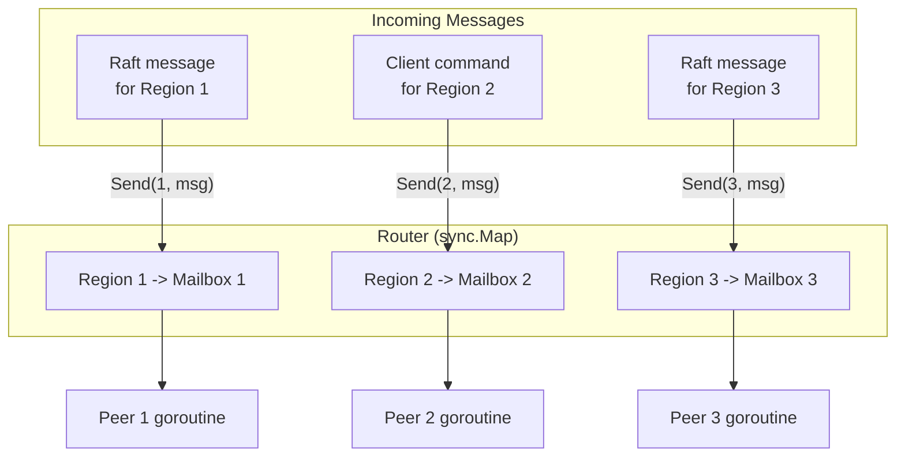

### 18.5 Store-Level Message Handling

When `HandleRaftMessage` receives a message for an unknown region (the router
returns `ErrRegionNotFound`), it falls back to the store-level channel. The
`RunStoreWorker` goroutine processes these messages:

- For `StoreMsgTypeRaftMessage`: calls `maybeCreatePeerForMessage`, which
  creates a new peer if the message is valid (e.g., a snapshot from a leader
  for a region this node should join).
- For `StoreMsgTypeCreatePeer`: creates a new peer with the provided region
  metadata.
- For `StoreMsgTypeDestroyPeer`: destroys an existing peer and cleans up its
  Raft state.

This mechanism enables dynamic peer creation: when PD schedules a new region
replica on a node, the leader sends Raft messages to that node. The messages
initially fail to route (no peer exists yet), but the store worker catches them
and creates the peer on-the-fly.

---

## Summary

The Raft consensus layer in gookv provides consistent data replication across
multiple nodes. Its key design decisions are:

1. **etcd/raft as a library**: Using `RawNode` gives gookv full control over
   the Raft processing loop without reimplementing the core algorithm.

2. **One goroutine per peer**: Each region replica runs in its own goroutine
   with a ticker-driven event loop, eliminating fine-grained locking within
   a peer.

3. **handleReady as the integration point**: All Raft state changes are
   processed in a single method (`handleReady`) that runs after every event,
   providing a clear and auditable pipeline from state change to persistence
   to message delivery.

4. **Admin commands as Raft entries**: Log compaction and region splits are
   proposed through Raft, ensuring they are ordered relative to data writes
   and agreed upon by all replicas.

5. **ReadIndex with no-op propose**: Linearizable reads are served without
   replicating the read through the Raft log, while the no-op propose trick
   ensures the protocol works immediately after leader election.

6. **Non-blocking routing**: The router's non-blocking send pattern prevents
   slow peers from causing cascading delays across the cluster.

7. **Snapshot throttling**: Concurrent outbound snapshots are limited to 3,
   preventing resource exhaustion when many regions need to be transferred
   simultaneously.
