# Chapter 4: Region Management

## Table of Contents

1. [Why Shard Data into Regions?](#why-shard-data-into-regions)
2. [The Region Concept](#the-region-concept)
3. [Region Metadata](#region-metadata)
4. [RegionEpoch: Versioning Region State](#regionepoch-versioning-region-state)
5. [PD Coordination](#pd-coordination)
6. [Split Detection: SplitCheckWorker](#split-detection-splitcheckworker)
7. [Region Split via Raft Admin Command](#region-split-via-raft-admin-command)
8. [Epoch Management: Preventing Stale Requests](#epoch-management-preventing-stale-requests)
9. [Region Routing: ResolveRegionForKey](#region-routing-resolveregionforkeyregion-routing)
10. [Configuration Change: Adding and Removing Peers](#configuration-change-adding-and-removing-peers)

---

## Why Shard Data into Regions?

### The Problem with a Single Node

Imagine you are building a key-value store that must hold terabytes of data and serve thousands of requests per second. A single machine has three fundamental limits:

1. **Storage capacity**: One disk can hold only so much data.
2. **CPU throughput**: One CPU can process only so many requests per second.
3. **Memory**: One machine can cache only so much in RAM.

If all data lives on one machine, you hit all three walls simultaneously. The only way out is to **split the data across multiple machines** -- a technique called **sharding** or **partitioning**.

### What is Sharding?

Sharding divides your dataset into smaller pieces called **shards**. Each shard lives on a different machine. When a client wants to read or write a key, it first determines which shard owns that key, then sends the request to the correct machine.

```
Full Key Space: [A .................... Z]

Shard 1: [A ... G)    -> Machine 1
Shard 2: [G ... N)    -> Machine 2
Shard 3: [N ... Z]    -> Machine 3
```

### Why Range-Based Sharding?

There are two main sharding strategies:

| Strategy | How it works | Pros | Cons |
|----------|-------------|------|------|
| Hash-based | hash(key) mod N = shard | Even distribution | Cannot do range scans |
| Range-based | key falls in [start, end) = shard | Efficient range scans, data locality | Possible hotspots |

gookv uses **range-based sharding**. The entire key space is divided into contiguous, non-overlapping ranges. Each range is called a **Region**. Range-based sharding is essential for a transactional store because:

- **Range scans** (e.g., `SELECT * FROM users WHERE id BETWEEN 100 AND 200`) are efficient: all matching keys are on the same or adjacent regions.
- **Data locality**: keys that are close together in sort order (e.g., rows in the same table) reside in the same region, reducing cross-node traffic.
- **Transactions**: Percolator-style transactions frequently access keys that are nearby (e.g., primary and secondary keys in the same table), benefiting from colocation.

### Three Benefits of Regions

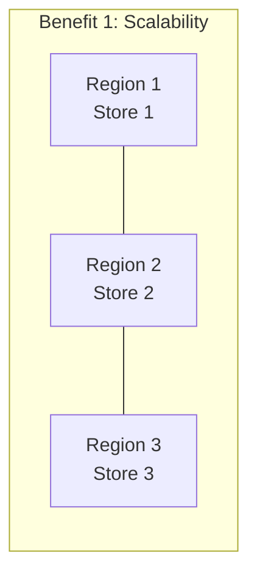

**Scalability**: As data grows, regions split into smaller ranges and spread across more stores. Adding a new store does not require reorganizing the entire dataset -- PD simply schedules some regions to move to the new store.

**Parallel Processing**: Each region has its own Raft group running in its own goroutine. Requests to different regions execute in parallel with zero contention. A cluster with 1000 regions can process 1000 independent Raft groups concurrently.

**Data Locality**: Because regions are contiguous key ranges, a scan operation typically touches one or two regions rather than scattering requests across every machine.

---

## The Region Concept

A region is defined by three things:

1. **A contiguous key range**: `[StartKey, EndKey)` -- all keys greater than or equal to `StartKey` and strictly less than `EndKey`.
2. **A set of replicas**: Each region is stored on multiple stores (typically 3) for fault tolerance.
3. **A Raft group**: The replicas form a Raft consensus group that keeps them synchronized.

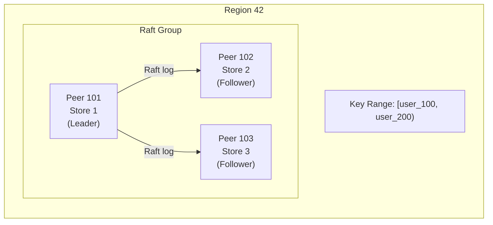

### Key Encoding in Region Boundaries

Region boundaries use **MVCC-encoded keys**. User keys are encoded through `codec.EncodeBytes` (a memcomparable encoding that preserves sort order). This encoding is critical: the encoded bytes sort in the same order as the original user keys, so the engine's byte-level comparisons produce correct results.

In gookv, region boundaries specifically use the **lock key encoding** (via `mvcc.EncodeLockKey`), which is `codec.EncodeBytes(nil, key)` without a timestamp suffix. This ensures that all column family keys for the same user key (CF_LOCK, CF_WRITE, CF_DEFAULT) fall within the same region, regardless of their timestamp.

```
User key:       "user_150"
Lock key:       codec.EncodeBytes(nil, "user_150")          -> 0x7573...  (no timestamp)
Write key:      codec.EncodeBytes(nil, "user_150") + tsDesc  -> 0x7573... + ts  (with timestamp)
Default key:    codec.EncodeBytes(nil, "user_150") + tsDesc  -> 0x7573... + ts  (with timestamp)

All three keys share the same encoded prefix and fall in the same region.
```

### One Goroutine Per Peer

Each peer runs in its own goroutine, managed by the `Peer.Run` method. The goroutine owns the Raft state machine (`raft.RawNode`) and processes messages from its **mailbox** (a buffered channel of type `chan PeerMsg`). This design eliminates the need for mutexes around Raft state -- all state machine operations happen in the single peer goroutine.

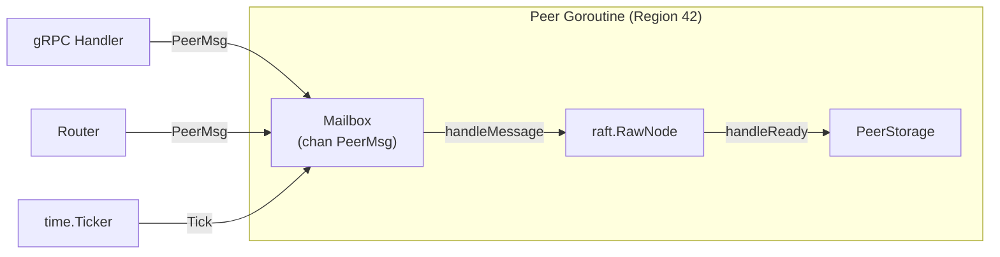

---

## Region Metadata

Region metadata is defined by the protobuf type `metapb.Region` from the `kvproto` package. This structure is the single source of truth for everything about a region.

### metapb.Region Fields

```go
// From kvproto/pkg/metapb
type Region struct {
    Id          uint64         // Globally unique region ID, allocated by PD
    StartKey    []byte         // Start of key range (inclusive, MVCC-encoded)
    EndKey      []byte         // End of key range (exclusive, MVCC-encoded; empty = unbounded)
    Peers       []*Peer        // List of replicas (peer ID + store ID)
    RegionEpoch *RegionEpoch   // Version control for region metadata
}

type Peer struct {
    Id      uint64   // Globally unique peer ID, allocated by PD
    StoreId uint64   // Which store this peer resides on
    Role    PeerRole // Normal, Learner, etc.
}

type RegionEpoch struct {
    ConfVer uint64   // Incremented on every peer membership change
    Version uint64   // Incremented on every split or merge
}
```

### How Region Metadata Flows Through the System

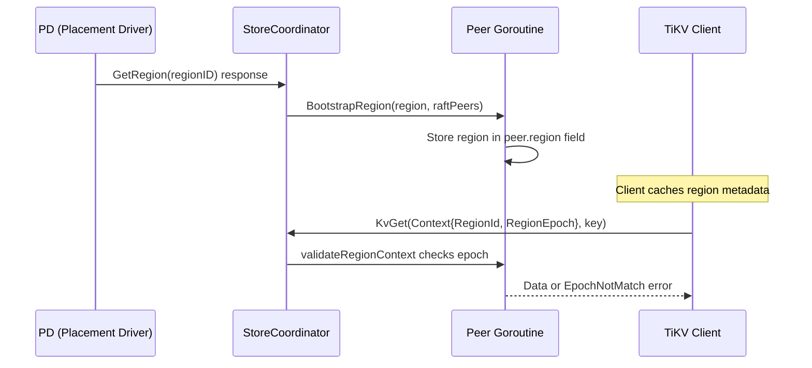

### Where Region Metadata is Stored

Region metadata lives in several places simultaneously:

| Location | Purpose | Accessed by |
|----------|---------|-------------|
| `Peer.region` field | In-memory, hot path for request validation | Peer goroutine, gRPC handlers (via `regionMu`) |
| PD server | Authoritative cluster-wide registry | All stores, all clients |
| Engine (persisted) | Recovery after restart | Store bootstrap |

The `Peer.region` field is protected by `Peer.regionMu` (a `sync.RWMutex`) because it is read by gRPC handlers on arbitrary goroutines but mutated only by the peer goroutine during split or conf change operations.

```go
// Thread-safe read of region metadata
func (p *Peer) Region() *metapb.Region {
    p.regionMu.RLock()
    defer p.regionMu.RUnlock()
    return p.region
}

// Thread-safe update after split or conf change
func (p *Peer) UpdateRegion(r *metapb.Region) {
    p.regionMu.Lock()
    defer p.regionMu.Unlock()
    p.region = r
}
```

---

## RegionEpoch: Versioning Region State

The `RegionEpoch` is the cornerstone of correctness in region management. It is a two-component version number embedded in every `metapb.Region`:

```go
type RegionEpoch struct {
    ConfVer uint64   // Configuration version
    Version uint64   // Data version
}
```

### When Each Component Increments

| Event | ConfVer | Version | Example |
|-------|---------|---------|---------|
| Add a peer | +1 | unchanged | New replica added to store 4 |
| Remove a peer | +1 | unchanged | Replica removed from store 2 |
| Region split | unchanged | +N (N = number of split keys) | Region splits into two |
| Region merge | unchanged | +1 | Two regions merge |

### Why Two Components?

Two separate counters let the system distinguish between two fundamentally different kinds of changes:

- **ConfVer changes** mean the set of nodes holding data has changed. A client that cached "region 42 is on stores {1, 2, 3}" might now be wrong because the peers moved to {1, 3, 4}.
- **Version changes** mean the key range has changed. A client that cached "region 42 covers [A, M)" might now be wrong because the region split and now covers [A, G).

### Epoch in Practice

Every client request carries a `RegionEpoch` in its context. The server compares this against the current epoch:

```go
// From tikvService.validateRegionContext
if reqEpoch.GetVersion() != currentEpoch.GetVersion() ||
    reqEpoch.GetConfVer() != currentEpoch.GetConfVer() {
    return &errorpb.Error{
        EpochNotMatch: &errorpb.EpochNotMatch{
            CurrentRegions: []*metapb.Region{peer.Region()},
        },
    }
}
```

When the client receives an `EpochNotMatch` error, the response includes the **current** region metadata. The client updates its cache and retries the request with the correct region.

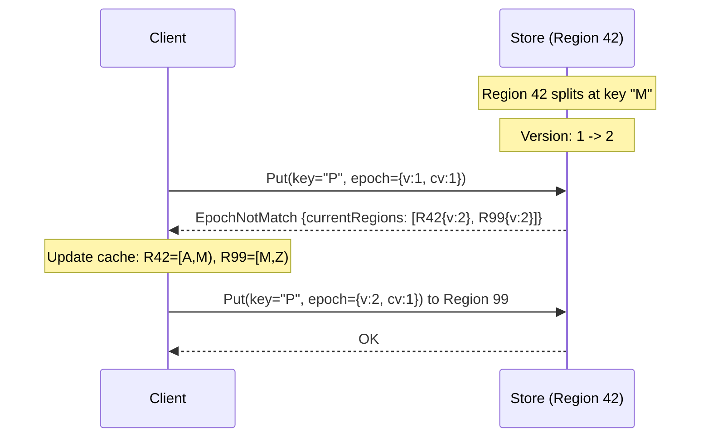

---

## PD Coordination

PD (Placement Driver) is the cluster's metadata and scheduling coordinator. For region management, PD provides four critical APIs:

### GetRegion and GetRegionByID

These APIs let any node look up the current state of a region:

```go
// Look up a region by its numeric ID
func (c pdclient.Client) GetRegionByID(ctx context.Context, regionID uint64) (*metapb.Region, *metapb.Peer, error)

// Look up which region contains a given key
func (c pdclient.Client) GetRegionByKey(ctx context.Context, key []byte) (*metapb.Region, *metapb.Peer, error)
```

In gookv, `GetRegionByID` is used in `StoreCoordinator.maybeCreatePeerForMessage` when a Raft message arrives for an unknown region. The coordinator queries PD to get the full region metadata before creating the peer:

```go
func (sc *StoreCoordinator) maybeCreatePeerForMessage(msg *raft_serverpb.RaftMessage) {
    regionID := msg.GetRegionId()
    if sc.router.HasRegion(regionID) {
        return
    }

    var region *metapb.Region
    if sc.pdClient != nil {
        resp, _, err := sc.pdClient.GetRegionByID(ctx, regionID)
        if err == nil && resp != nil {
            region = resp
        }
    }

    // Fallback: construct minimal region from the message
    if region == nil {
        region = &metapb.Region{
            Id:    regionID,
            Peers: []*metapb.Peer{msg.GetFromPeer(), msg.GetToPeer()},
        }
    }

    sc.CreatePeer(&raftstore.CreatePeerRequest{Region: region, PeerID: msg.GetToPeer().GetId()})
}
```

### AskBatchSplit

Before a region can split, it needs new IDs for the child region and its peers. PD is the sole allocator of globally unique IDs:

```go
func (c pdclient.Client) AskBatchSplit(ctx context.Context, region *metapb.Region, count int) (*pdpb.AskBatchSplitResponse, error)
```

The response contains:
- `NewRegionId`: A unique ID for each new region
- `NewPeerIds`: A unique peer ID for each replica in each new region

These IDs must be globally unique across the entire cluster to prevent conflicts.

### ReportBatchSplit

After a split completes, the store reports the result back to PD so PD can update its metadata:

```go
func (c pdclient.Client) ReportBatchSplit(ctx context.Context, regions []*metapb.Region) error
```

The report includes both the parent region (with its updated key range) and the new child region(s).

### PD Coordination Flow

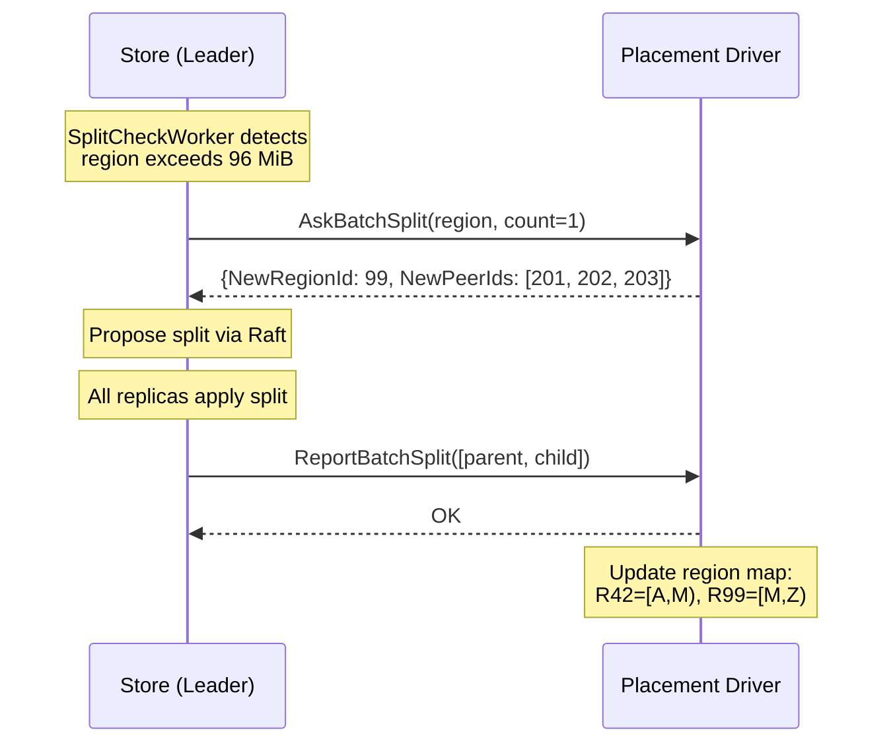

---

## Split Detection: SplitCheckWorker

### Purpose

The `SplitCheckWorker` is a background goroutine that periodically scans regions to estimate their size. When a region exceeds a configurable threshold, the worker produces a `SplitCheckResult` containing a candidate split key.

### Configuration

```go
type SplitCheckWorkerConfig struct {
    SplitSize uint64 // Threshold to trigger split (default: 96 MiB)
    MaxSize   uint64 // Hard limit (default: 144 MiB)
    SplitKeys uint64 // Key count threshold (unused)
    MaxKeys   uint64 // Key count hard limit (unused)
}
```

The default configuration splits regions at 96 MiB with a hard limit of 144 MiB.

### Architecture

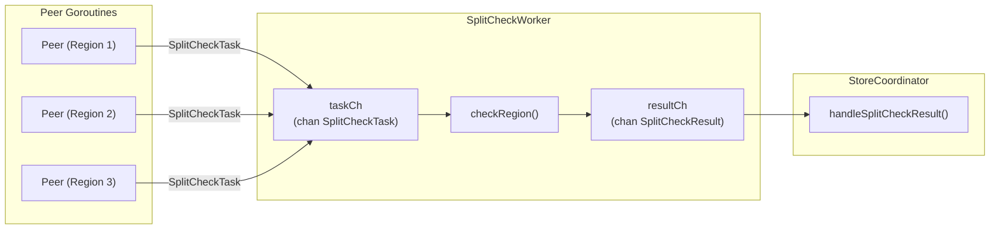

### How Split Checks are Triggered

Only the **leader** of each region initiates split checks. The peer's main event loop includes a periodic split check ticker:

```go
// In Peer.Run()
var splitCheckTickerCh <-chan time.Time
if p.cfg.SplitCheckTickInterval > 0 {
    splitCheckTicker := time.NewTicker(p.cfg.SplitCheckTickInterval) // default: 10s
    defer splitCheckTicker.Stop()
    splitCheckTickerCh = splitCheckTicker.C
}

// In the event loop:
case <-splitCheckTickerCh:
    p.onSplitCheckTick()
```

The `onSplitCheckTick` method sends a task to the worker only if this peer is the leader:

```go
func (p *Peer) onSplitCheckTick() {
    if !p.isLeader.Load() || p.splitCheckCh == nil {
        return
    }
    task := split.SplitCheckTask{
        RegionID: p.regionID,
        Region:   p.region,
        StartKey: p.region.GetStartKey(),
        EndKey:   p.region.GetEndKey(),
        Policy:   split.CheckPolicyScan,
    }
    select {
    case p.splitCheckCh <- task:
    default: // Non-blocking: skip if channel is full
    }
}
```

### Scanning Region Size

The `scanRegionSize` method iterates through all three data column families (CF_DEFAULT, CF_WRITE, CF_LOCK) within the region's key range, accumulating the total size of all keys and values.

```go
func (w *SplitCheckWorker) scanRegionSize(startKey, endKey []byte) (uint64, []byte, error) {
    var totalSize uint64
    var splitKey []byte
    halfSize := w.cfg.SplitSize / 2  // 48 MiB

    for _, cf := range []string{cfnames.CFDefault, cfnames.CFWrite, cfnames.CFLock} {
        iter := w.engine.NewIterator(cf, opts)
        for iter.SeekToFirst(); iter.Valid(); iter.Next() {
            entrySize := uint64(len(iter.Key()) + len(iter.Value()))
            totalSize += entrySize

            // Record split key at the approximate midpoint
            if splitKey == nil && totalSize >= halfSize {
                rawKey, _, decErr := mvcc.DecodeKey(iter.Key())
                if decErr == nil && rawKey != nil {
                    splitKey = mvcc.EncodeLockKey(rawKey)  // Lock-key format for boundaries
                }
            }

            if totalSize >= w.cfg.MaxSize {
                iter.Close()
                return totalSize, splitKey, nil
            }
        }
        iter.Close()
    }
    return totalSize, splitKey, nil
}
```

### Split Key Selection

The split key is chosen at approximately the **midpoint by data size**. When the cumulative size reaches half the split threshold (~48 MiB with defaults), the current key is recorded as the split candidate.

The split key is always stored in **lock-key encoding** (`mvcc.EncodeLockKey`), regardless of which column family the midpoint key was found in. This ensures that region boundaries use a consistent format that works correctly with all routing operations.

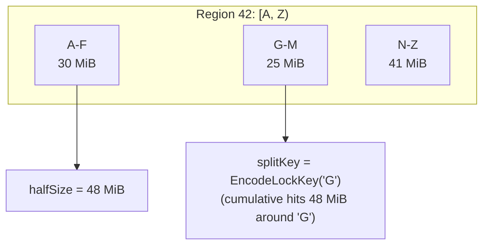

---

## Region Split via Raft Admin Command

A region split is one of the most complex operations in gookv. It must be executed **atomically on all replicas** through Raft consensus to maintain consistency. This section walks through the entire process from detection to completion.

### Overview

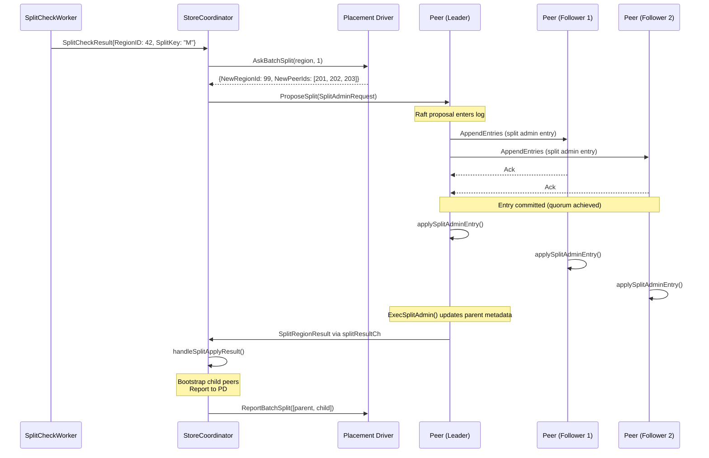

### Step 1: SplitAdminRequest Format

The split command is serialized as a binary admin entry in the Raft log. It uses tag byte `0x02` to distinguish it from normal entries and CompactLog commands (tag `0x01`).

```go
const TagSplitAdmin byte = 0x02

type SplitAdminRequest struct {
    SplitKey      []byte     // The key at which to split
    NewRegionIDs  []uint64   // PD-allocated IDs for new regions
    NewPeerIDSets [][]uint64 // PD-allocated peer IDs for each new region
}
```

The binary format is:

```
[tag: 1 byte] [splitKeyLen: 4 bytes] [splitKey: N bytes]
[numRegions: 4 bytes]
  [regionID: 8 bytes] [numPeers: 4 bytes] [peerID: 8 bytes]...
  ...
```

The tag byte `0x02` is safe from collision with normal protobuf entries because protobuf field 1 with wire type 2 (length-delimited, which `RaftCmdRequest` uses) starts with byte `0x0A`.

### Step 2: handleSplitCheckResult -- Propose via Raft

When the `StoreCoordinator` receives a `SplitCheckResult` indicating a split is needed, it:

1. Verifies the peer exists and is the leader
2. Asks PD for new region/peer IDs
3. Proposes the split through Raft

```go
func (sc *StoreCoordinator) handleSplitCheckResult(result split.SplitCheckResult) {
    if result.SplitKey == nil {
        return
    }
    peer := sc.GetPeer(result.RegionID)
    if peer == nil || !peer.IsLeader() {
        return
    }

    // Ask PD for new IDs
    resp, err := sc.pdClient.AskBatchSplit(context.Background(), peer.Region(), 1)
    if err != nil {
        return
    }

    // Build the split request
    ids := resp.GetIds()
    newRegionIDs := make([]uint64, len(ids))
    newPeerIDSets := make([][]uint64, len(ids))
    for i, splitID := range ids {
        newRegionIDs[i] = splitID.GetNewRegionId()
        newPeerIDSets[i] = splitID.GetNewPeerIds()
    }

    // Propose through Raft (fire-and-forget)
    req := raftstore.SplitAdminRequest{
        SplitKey:      result.SplitKey,
        NewRegionIDs:  newRegionIDs,
        NewPeerIDSets: newPeerIDSets,
    }
    peer.ProposeSplit(req)
}
```

The `ProposeSplit` method serializes the request and proposes it as raw bytes to the Raft group:

```go
func (p *Peer) ProposeSplit(req SplitAdminRequest) error {
    data := MarshalSplitAdminRequest(req)
    return p.rawNode.Propose(data)
}
```

### Step 3: ExecSplitAdmin in handleReady

When the Raft entry is committed, every peer (leader and followers) applies it in `handleReady`. The key code path is:

```go
// In Peer.handleReady()
for _, e := range rd.CommittedEntries {
    if e.Type == raftpb.EntryNormal && IsSplitAdmin(e.Data) {
        eCopy := e
        p.applySplitAdminEntry(&eCopy)
    }
}
```

The `applySplitAdminEntry` method deserializes the request and calls `ExecSplitAdmin`:

```go
func (p *Peer) applySplitAdminEntry(e *raftpb.Entry) {
    req, err := UnmarshalSplitAdminRequest(e.Data)
    if err != nil {
        return
    }

    result, err := ExecSplitAdmin(p, req)
    if err != nil {
        return
    }

    // Only the leader sends the result for child bootstrapping
    if p.isLeader.Load() && p.splitResultCh != nil {
        select {
        case p.splitResultCh <- result:
        default:
        }
    }
}
```

### Step 4: ExecBatchSplit -- The Core Logic

The `split.ExecBatchSplit` function performs the actual metadata transformation:

```go
func ExecBatchSplit(
    region *metapb.Region,
    splitKeys [][]byte,
    newRegionIDs []uint64,
    newPeerIDSets [][]uint64,
) (*SplitRegionResult, error) {
```

Given a parent region `[A, Z)` splitting at key `M`:

**Before split:**
```
Region 42: [A ........................ Z)
            StartKey              EndKey
            Epoch: {Version: 1, ConfVer: 1}
            Peers: [{ID:101, Store:1}, {ID:102, Store:2}, {ID:103, Store:3}]
```

**After split:**
```
Region 42 (derived/parent): [A ......... M)
            StartKey              EndKey  (was Z, now M)
            Epoch: {Version: 2, ConfVer: 1}  (Version incremented)
            Peers: [{ID:101, Store:1}, {ID:102, Store:2}, {ID:103, Store:3}]

Region 99 (new child):      [M ......... Z)
            StartKey              EndKey
            Epoch: {Version: 2, ConfVer: 1}  (inherits from parent)
            Peers: [{ID:201, Store:1}, {ID:202, Store:2}, {ID:203, Store:3}]
```

Key rules:
- The **parent keeps the left half** `[original.StartKey, splitKey)`
- The **child gets the right half** `[splitKey, original.EndKey)`
- The epoch `Version` is incremented by the number of split keys
- The child region gets **new peer IDs** but resides on the **same stores** as the parent

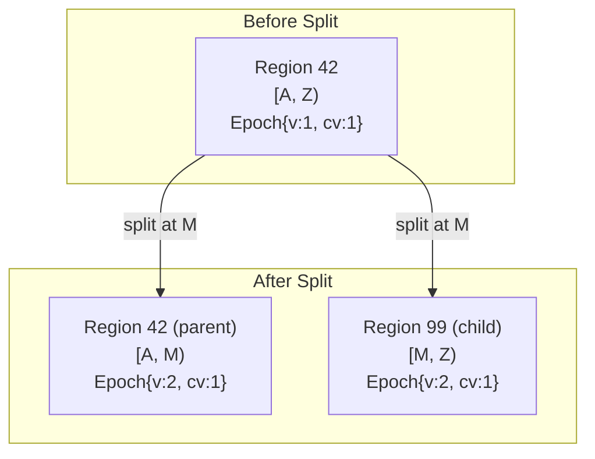

### Step 5: handleSplitApplyResult -- Bootstrap Children

After the leader's `ExecSplitAdmin` produces a result, it sends it through `splitResultCh` to the `StoreCoordinator`, which runs `handleSplitApplyResult`:

```go
func (sc *StoreCoordinator) handleSplitApplyResult(result *raftstore.SplitRegionResult) {
    // Bootstrap each child region
    for _, newRegion := range result.Regions {
        raftPeers := make([]raft.Peer, 0, len(newRegion.GetPeers()))
        for _, p := range newRegion.GetPeers() {
            raftPeers = append(raftPeers, raft.Peer{ID: p.GetId()})
        }
        sc.BootstrapRegion(newRegion, raftPeers)

        // Kick Raft activity to trigger follower peer creation
        sc.router.Send(newRegion.GetId(), raftstore.PeerMsg{Type: raftstore.PeerMsgTypeTick})
    }

    // Report to PD
    if sc.pdClient != nil {
        allRegions := append([]*metapb.Region{result.Derived}, result.Regions...)
        sc.pdClient.ReportBatchSplit(context.Background(), allRegions)
    }
}
```

The `BootstrapRegion` call creates a new `Peer` goroutine for the child region, with all the same wiring (send function, apply function, PD task channel, split check channel, snapshot channel, split result channel) as the parent. The child peer is registered in the router so it can receive messages.

### Step 6: Follower Behavior -- maybeCreatePeerForMessage

On follower stores, the child region's peer does not exist yet when the split entry is applied. The followers also execute `ExecSplitAdmin` to update the parent's metadata, but they are not the leader, so they do not send a result to `splitResultCh`.

Instead, when the leader's newly bootstrapped child peer starts sending Raft messages to the followers, the followers receive messages for an unknown region. The `StoreCoordinator.HandleRaftMessage` method routes these to the store worker:

```go
func (sc *StoreCoordinator) HandleRaftMessage(msg *raft_serverpb.RaftMessage) error {
    regionID := msg.GetRegionId()
    // ... convert message ...
    err = sc.router.Send(regionID, peerMsg)
    if err == router.ErrRegionNotFound {
        // Route to store worker for potential peer creation
        return sc.router.SendStore(raftstore.StoreMsg{
            Type: raftstore.StoreMsgTypeRaftMessage,
            Data: msg,
        })
    }
    return err
}
```

The store worker calls `maybeCreatePeerForMessage`, which queries PD for the full region metadata and creates the peer:

```go
func (sc *StoreCoordinator) maybeCreatePeerForMessage(msg *raft_serverpb.RaftMessage) {
    regionID := msg.GetRegionId()
    if sc.router.HasRegion(regionID) {
        return
    }

    // Try PD for full metadata
    var region *metapb.Region
    if sc.pdClient != nil {
        resp, _, err := sc.pdClient.GetRegionByID(ctx, regionID)
        if err == nil && resp != nil {
            region = resp
        }
    }

    // Fallback: minimal region from message
    if region == nil {
        region = &metapb.Region{
            Id:    regionID,
            Peers: []*metapb.Peer{msg.GetFromPeer(), msg.GetToPeer()},
        }
    }

    sc.CreatePeer(&raftstore.CreatePeerRequest{Region: region, PeerID: msg.GetToPeer().GetId()})
}
```

### Complete Split Flow Diagram

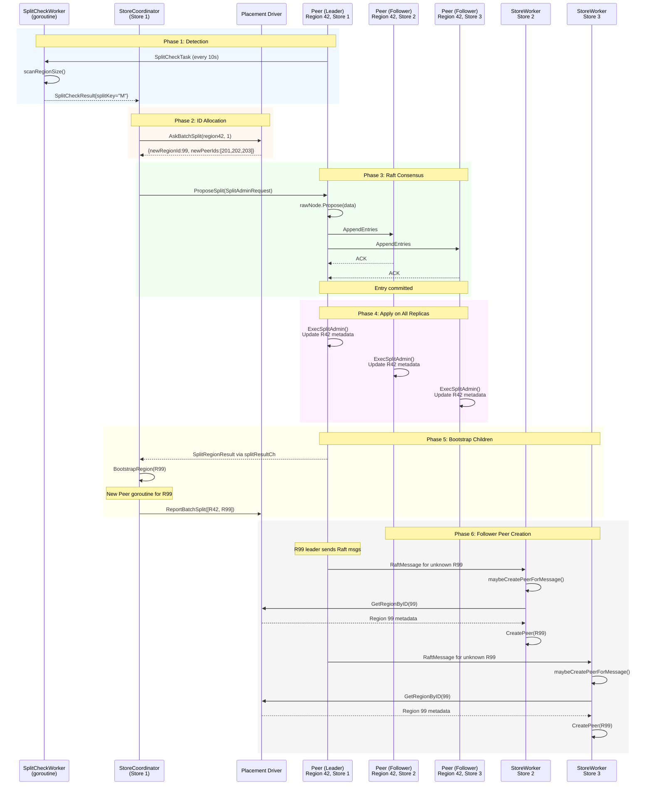

### Data Safety During Split

A critical observation: the split operation **does not move any data**. The engine contains all the key-value pairs regardless of region boundaries. Region boundaries are purely logical -- they define which peer is responsible for which key range. After a split, the child region can immediately serve reads because the data is already in the engine.

This is possible because gookv uses a **shared engine** model: all regions on a store share the same underlying storage engine. Region boundaries are enforced at the routing layer, not the storage layer.

---

## Epoch Management: Preventing Stale Requests

### The Problem

Consider this race condition:

1. Client reads region 42 metadata: `[A, Z)`, epoch `{v:1, cv:1}`
2. Region 42 splits at `M`: epoch becomes `{v:2, cv:1}`
3. Client sends a write for key `P` to region 42 (which now covers `[A, M)`)

Without epoch checking, the write for key `P` would be applied to region 42 even though `P` is now owned by the child region 99. This would cause data to be written to the wrong region.

### Two Layers of Epoch Checking

gookv checks epochs at two points:

**Layer 1: RPC Validation** (`validateRegionContext`)

Every incoming RPC is checked before any work begins:

```go
func (svc *tikvService) validateRegionContext(reqCtx *kvrpcpb.Context, key []byte) *errorpb.Error {
    // 1. Check region exists
    peer := coord.GetPeer(regionID)
    if peer == nil {
        return RegionNotFound
    }

    // 2. Check this node is the leader
    if !peer.IsLeader() {
        return NotLeader
    }

    // 3. Check epoch matches
    if reqEpoch.GetVersion() != currentEpoch.GetVersion() ||
        reqEpoch.GetConfVer() != currentEpoch.GetConfVer() {
        return EpochNotMatch
    }

    // 4. Check key is within region range
    if key is outside [startKey, endKey) {
        return KeyNotInRegion
    }
}
```

**Layer 2: Propose-Time Epoch Check** (`ProposeModifies`)

Even if the RPC passes validation, a split might occur between validation and the Raft proposal. The `ProposeModifies` method checks the epoch again just before proposing:

```go
func (sc *StoreCoordinator) ProposeModifies(regionID uint64, modifies []mvcc.Modify, timeout time.Duration, reqEpoch ...*metapb.RegionEpoch) error {
    // ... leader check ...

    // Propose-time epoch check
    currentEpoch := peer.Region().GetRegionEpoch()
    if len(reqEpoch) > 0 && reqEpoch[0] != nil && currentEpoch != nil {
        re := reqEpoch[0]
        if re.GetVersion() != currentEpoch.GetVersion() ||
            re.GetConfVer() != currentEpoch.GetConfVer() {
            return fmt.Errorf("raftstore: epoch not match for region %d", regionID)
        }
    }

    // ... proceed with Raft proposal ...
}
```

### Epoch Flow Through the Request Lifecycle

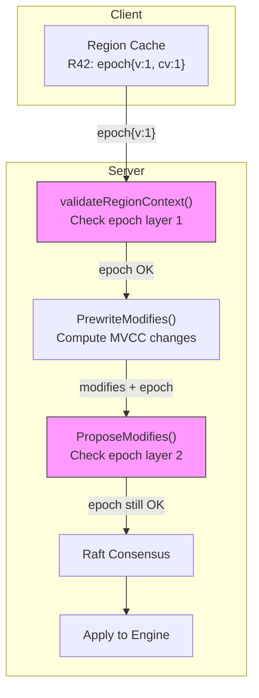

### Error Translation: proposeErrorToRegionError

When a `ProposeModifies` call fails, the error is translated into a structured region error that the client understands:

```go
func proposeErrorToRegionError(err error, regionID uint64) *errorpb.Error {
    msg := err.Error()
    if strings.Contains(msg, "not found")    -> RegionNotFound
    if strings.Contains(msg, "not leader")   -> NotLeader
    if strings.Contains(msg, "timeout")      -> NotLeader (triggers client retry)
    if strings.Contains(msg, "epoch not match") -> EpochNotMatch
    return nil  // Not a region error
}
```

---

## Region Routing: ResolveRegionForKey

### Purpose

When the server receives a request without a region ID (or needs to route a modify to the correct region), it must determine which region owns a given key. The `ResolveRegionForKey` method performs this lookup.

### Algorithm

The method iterates all peers on this store and finds the region whose key range contains the target key. When multiple regions match (possible during a split when the parent's metadata is momentarily stale), it selects the **narrowest match** -- the region with the largest `StartKey`:

```go
func (sc *StoreCoordinator) ResolveRegionForKey(key []byte) uint64 {
    sc.mu.RLock()
    defer sc.mu.RUnlock()

    var bestID uint64
    var bestStartKey []byte
    bestStartSet := false

    for regionID, peer := range sc.peers {
        region := peer.Region()
        startKey := region.GetStartKey()
        endKey := region.GetEndKey()

        // Check if key >= startKey
        if len(startKey) > 0 && bytes.Compare(key, startKey) < 0 {
            continue
        }
        // Check if key < endKey (empty = unbounded)
        if len(endKey) > 0 && bytes.Compare(key, endKey) >= 0 {
            continue
        }

        // Pick the narrowest match (largest startKey)
        if !bestStartSet || bytes.Compare(startKey, bestStartKey) > 0 {
            bestID = regionID
            bestStartKey = startKey
            bestStartSet = true
        }
    }
    return bestID
}
```

### Why Narrowest Match?

Consider what happens during a split of region 42 `[A, Z)` at key `M`:

1. The parent region 42 updates its metadata to `[A, M)` (atomically via `Peer.UpdateRegion`)
2. The child region 99 is bootstrapped with `[M, Z)`
3. For a brief moment, both regions exist

If a request arrives for key `P` during this transition:
- Region 42 `[A, M)`: `P` is NOT in range (P >= M)
- Region 99 `[M, Z)`: `P` IS in range

But if the parent's metadata update has not propagated yet to a concurrent reader:
- Region 42 `[A, Z)`: `P` IS in range (stale)
- Region 99 `[M, Z)`: `P` IS in range

In this case, region 99 has `StartKey = M`, which is greater than region 42's `StartKey = A`. The narrowest match (99) is the correct choice because it reflects the post-split state.

### Key Encoding for Routing

When resolving a region for a raw user key, the key must first be encoded to match the region boundary format:

```go
func (svc *tikvService) resolveRegionID(key []byte) uint64 {
    if coord := svc.server.coordinator; coord != nil {
        encodedKey := mvcc.EncodeLockKey(key)  // codec.EncodeBytes format
        if rid := coord.ResolveRegionForKey(encodedKey); rid != 0 {
            return rid
        }
    }
    return 1 // Fallback to region 1
}
```

---

## Configuration Change: Adding and Removing Peers

### Purpose

Configuration changes (conf changes) modify a region's peer membership -- adding new replicas or removing existing ones. This is how PD achieves data rebalancing across stores and recovers from store failures.

### ConfChange via Raft

Raft has built-in support for configuration changes through `ConfChange` entries. In gookv, the `ProposeConfChange` method proposes a membership change:

```go
func (p *Peer) ProposeConfChange(changeType raftpb.ConfChangeType, peerID uint64, storeID uint64) error {
    cc := raftpb.ConfChange{
        Type:    changeType,    // AddNode, RemoveNode, AddLearnerNode
        NodeID:  peerID,
        Context: EncodePeerContext(storeID),  // 8-byte big-endian store ID
    }
    return p.rawNode.ProposeConfChange(cc)
}
```

### Processing ConfChange Entries

When a `ConfChange` entry is committed, the peer processes it in `applyConfChangeEntry`:

```go
func (p *Peer) applyConfChangeEntry(e raftpb.Entry) *ChangePeerResult {
    var cc raftpb.ConfChange
    cc.Unmarshal(e.Data)

    // Tell Raft about the configuration change
    p.rawNode.ApplyConfChange(cc)

    // Update region metadata
    return p.processConfChange(cc.Type, cc.NodeID, e.Index, cc.Context)
}
```

The `processConfChange` method updates the peer list and increments `ConfVer`:

```go
func (p *Peer) processConfChange(changeType raftpb.ConfChangeType, nodeID uint64, index uint64, context []byte) *ChangePeerResult {
    region := cloneRegion(p.region)
    region.RegionEpoch.ConfVer++  // Always increment ConfVer

    switch changeType {
    case raftpb.ConfChangeAddNode:
        targetPeer := decodePeerFromContext(context, nodeID)
        region.Peers = append(region.Peers, targetPeer)

    case raftpb.ConfChangeRemoveNode:
        removed, newPeers := removePeerByNodeID(region.Peers, nodeID)
        region.Peers = newPeers

        // Self-removal: mark peer for destruction
        if nodeID == p.peerID {
            p.stopped.Store(true)
        }
    }

    p.region = region  // Protected by regionMu
    return &ChangePeerResult{...}
}
```

### PD-Initiated ConfChange

PD schedules configuration changes through the `ScheduleMsg` mechanism:

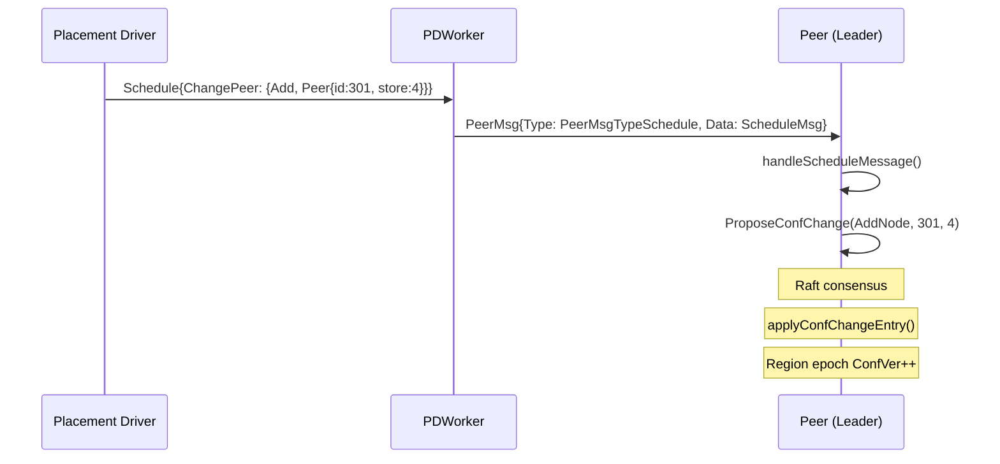

The `handleScheduleMessage` method in the peer processes three types of scheduling commands:

```go
func (p *Peer) handleScheduleMessage(msg *ScheduleMsg) {
    if !p.isLeader.Load() {
        return
    }
    switch msg.Type {
    case ScheduleMsgTransferLeader:
        p.rawNode.TransferLeader(targetPeerID)
    case ScheduleMsgChangePeer:
        p.ProposeConfChange(changeType, peerID, storeID)
    case ScheduleMsgMerge:
        // Not yet implemented
    }
}
```

### Adding a Peer: Full Sequence

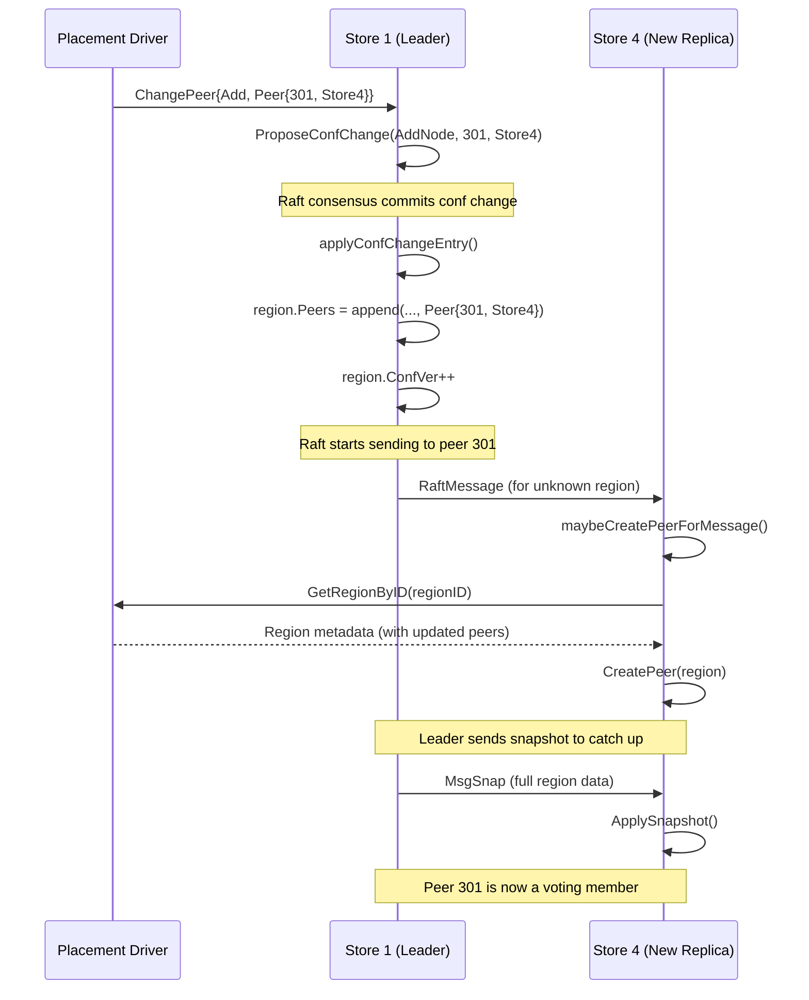

### Removing a Peer

When a peer is removed, it detects self-removal in `processConfChange`:

```go
case raftpb.ConfChangeRemoveNode:
    removed, newPeers := removePeerByNodeID(region.Peers, nodeID)
    region.Peers = newPeers

    if nodeID == p.peerID {
        p.stopped.Store(true)  // Mark self for destruction
    }
```

The peer stops its goroutine, and the `StoreCoordinator` can then clean up the persisted data via `DestroyPeer`:

```go
func (sc *StoreCoordinator) DestroyPeer(req *raftstore.DestroyPeerRequest) error {
    cancel()                                    // Stop peer goroutine
    sc.router.Unregister(regionID)              // Remove from router
    delete(sc.peers, regionID)                  // Remove from coordinator
    raftstore.CleanupRegionData(sc.engine, regionID) // Delete persisted state
    return nil
}
```

The `CleanupRegionData` function removes all persisted Raft state for the region from the engine:
- Raft log entries
- Raft hard state
- Apply state
- Region state

### Context Encoding

The conf change context carries the store ID of the peer being added or removed. This is encoded as an 8-byte big-endian integer:

```go
func EncodePeerContext(storeID uint64) []byte {
    buf := make([]byte, 8)
    binary.BigEndian.PutUint64(buf, storeID)
    return buf
}

func decodePeerFromContext(context []byte, nodeID uint64) *metapb.Peer {
    if len(context) >= 8 {
        storeID := binary.BigEndian.Uint64(context[:8])
        return &metapb.Peer{Id: nodeID, StoreId: storeID}
    }
    return nil
}
```

---

## Summary: Region Management Data Flow

The following diagram shows how all the region management components connect:

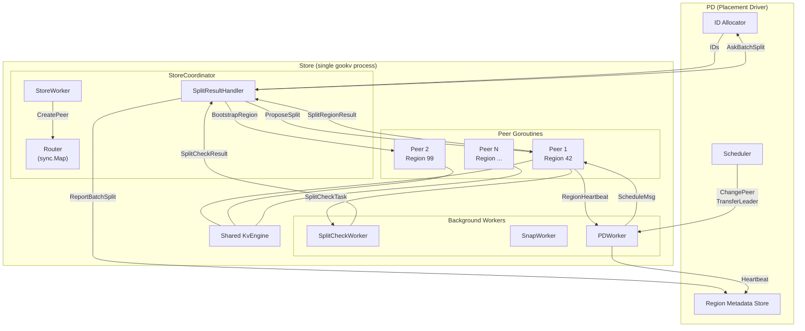

---

## Appendix A: Region Lifecycle State Machine

A region goes through several states during its lifetime:

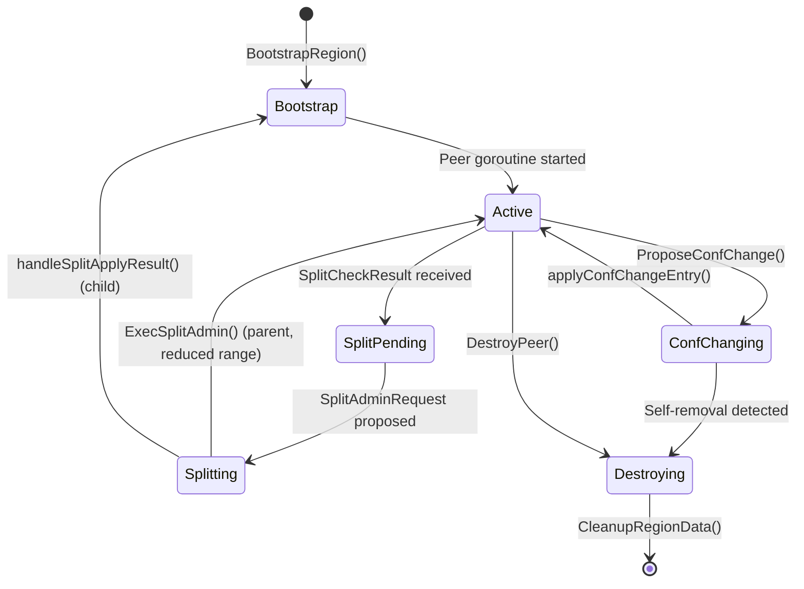

### Bootstrap

A region is bootstrapped when:
1. The cluster starts up and initializes the first region (region 1)
2. A split creates a child region
3. A Raft message arrives for an unknown region (`maybeCreatePeerForMessage`)

The `BootstrapRegion` method creates the peer, registers it in the router, and starts the goroutine:

```go
func (sc *StoreCoordinator) BootstrapRegion(region *metapb.Region, allPeers []raft.Peer) error {
    peer, err := raftstore.NewPeer(regionID, peerID, sc.storeID, region, sc.engine, sc.cfg, allPeers)
    // Wire all channels (sendFunc, applyFunc, pdTaskCh, splitCheckCh, snapTaskCh, splitResultCh)
    sc.router.Register(regionID, peer.Mailbox)
    ctx, cancel := context.WithCancel(context.Background())
    go peer.Run(ctx)
    return nil
}
```

### Active

In the active state, the peer processes Raft messages, handles client requests (through the coordinator), and performs periodic maintenance:
- Raft ticks (heartbeats, elections)
- Raft log GC
- Split check scheduling
- PD region heartbeats

### Destroying

A peer is destroyed when:
1. It is removed from the region's peer list via ConfChange (self-removal)
2. The `DestroyPeer` method is called explicitly

Destruction involves:
1. Canceling the peer goroutine's context
2. Waiting for the goroutine to stop
3. Unregistering from the router
4. Cleaning up persisted Raft state

---

## Appendix B: Region Split Edge Cases

### Split During In-Flight Request

Consider a `KvPrewrite` request that arrives just before a split:

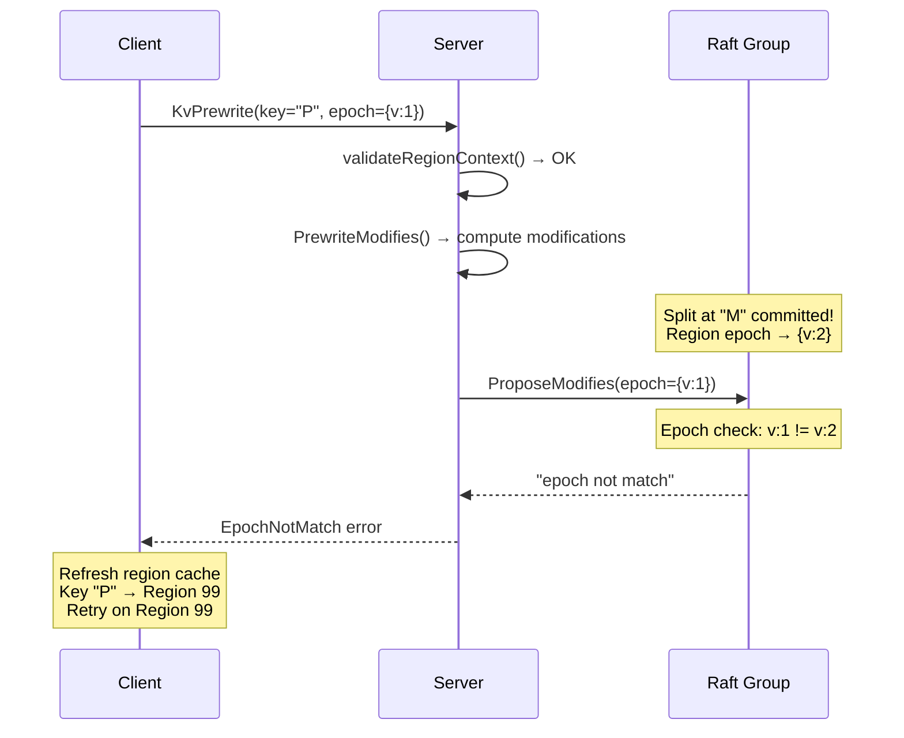

The propose-time epoch check catches this race condition. The client receives an `EpochNotMatch` error with the current regions and can retry correctly.

### Split with Pending Raft Entries

When a split happens, there may be uncommitted Raft entries in the log that were proposed before the split. These entries contain data for keys that may now belong to the child region.

gookv handles this by applying all committed entries unconditionally, regardless of epoch. The epoch check at propose time prevents new stale entries from entering the log, while already-committed entries are safe to apply because:

1. They were proposed when the epoch was valid
2. The Raft log guarantees strict ordering -- the split entry comes after them
3. Applying them to the engine is safe because the engine is shared across regions

### Concurrent Splits

Two split check results might arrive for the same region before the first split completes. The second `AskBatchSplit` will see the updated (post-split) region metadata and produce a split for the new, smaller key range. If both proposals enter the Raft log:

1. The first split executes, incrementing the epoch version
2. The second split's `ExecBatchSplit` validates that the split key is within the region's (now smaller) range
3. If the split key is outside the new range, `ExecBatchSplit` returns an error and the split is skipped

### Region with Empty Key Range

When a region's `EndKey` is empty, it represents the "right-most" region -- the region that extends to positive infinity. After splitting region `[A, "")` at key `M`:

- Parent: `[A, M)` -- EndKey changes from empty to `M`
- Child: `[M, "")` -- EndKey is empty (inherits unbounded right edge)

---

## Appendix C: Message Routing Details

### Router Implementation

The `Router` (defined in `internal/raftstore/router/router.go`) uses Go's `sync.Map` for concurrent access without global locks:

```go
type Router struct {
    peers   sync.Map         // regionID -> chan<- PeerMsg
    storeCh chan StoreMsg     // store-level messages
}
```

Key properties:
- **O(1) lookups**: `sync.Map.Load` is lock-free for reads after initial population
- **Non-blocking sends**: `Router.Send` uses a `select` with `default` to never block the caller
- **Best-effort broadcast**: `Router.Broadcast` silently drops messages for full mailboxes

### Message Priority

Messages have implicit priority based on their type and how they are delivered:

| Priority | Message Type | Behavior on Full Mailbox |
|----------|-------------|-------------------------|
| High | RaftMessage (consensus) | Retry 3 times with 1ms delay |
| Normal | RaftCommand (client request) | Return `ErrMailboxFull` |
| Low | Tick, CancelRead | Drop silently |

For consensus-critical messages (Raft AppendEntries, heartbeats), the coordinator retries briefly:

```go
err = sc.router.Send(regionID, peerMsg)
if err == router.ErrMailboxFull {
    for i := 0; i < 3; i++ {
        time.Sleep(time.Millisecond)
        err = sc.router.Send(regionID, peerMsg)
        if err != router.ErrMailboxFull {
            break
        }
    }
}
```

### Loopback Optimization

When a Raft message's target peer is on the same store, the coordinator delivers it directly through the router instead of going through gRPC:

```go
if toStoreID == sc.storeID {
    // Direct delivery via router (no gRPC overhead)
    peerMsg := raftstore.PeerMsg{Type: raftstore.PeerMsgTypeRaftMessage, Data: msg}
    sc.router.Send(regionID, peerMsg)
    return
}
```

This is critical for `ReadIndex` (ReadOnlySafe mode), which requires heartbeat responses from local follower peers. Without loopback, these responses would need to traverse gRPC even when source and target are in the same process.

---

## Appendix D: PD Region Heartbeat

Leaders periodically send region heartbeats to PD so that PD has an up-to-date view of the cluster:

```go
type RegionHeartbeatInfo struct {
    Region *metapb.Region
    Peer   *metapb.Peer
}

func (p *Peer) sendRegionHeartbeatToPD() {
    if p.pdTaskCh == nil {
        return
    }
    info := &RegionHeartbeatInfo{
        Region: p.region,
        Peer:   &metapb.Peer{Id: p.peerID, StoreId: p.storeID},
    }
    select {
    case p.pdTaskCh <- info:
    default: // Non-blocking
    }
}
```

Heartbeats are sent:
1. **On leadership change**: immediately when a peer becomes leader
2. **Periodically**: every `PdHeartbeatTickInterval` (default: 60 seconds)

PD uses heartbeats to:
- Track which store is the leader for each region
- Monitor region health (detect missing heartbeats)
- Schedule rebalancing operations (move regions to less loaded stores)

### Key Takeaways

1. **Regions are logical partitions** of a contiguous key range, replicated across multiple stores via Raft.
2. **RegionEpoch** provides two-dimensional versioning: `Version` for key-range changes (split/merge) and `ConfVer` for membership changes.
3. **PD coordinates** all region lifecycle events by allocating IDs and tracking metadata.
4. **Split detection** runs asynchronously in the `SplitCheckWorker`, scanning region sizes periodically.
5. **Splits are Raft admin commands**: they are proposed, replicated, and applied deterministically on all replicas.
6. **Epoch checking** happens at two layers (RPC validation and propose-time) to prevent stale requests.
7. **Region routing** uses narrowest-match semantics to handle the brief overlap during splits.
8. **ConfChange** modifies peer membership through Raft's built-in configuration change mechanism.
