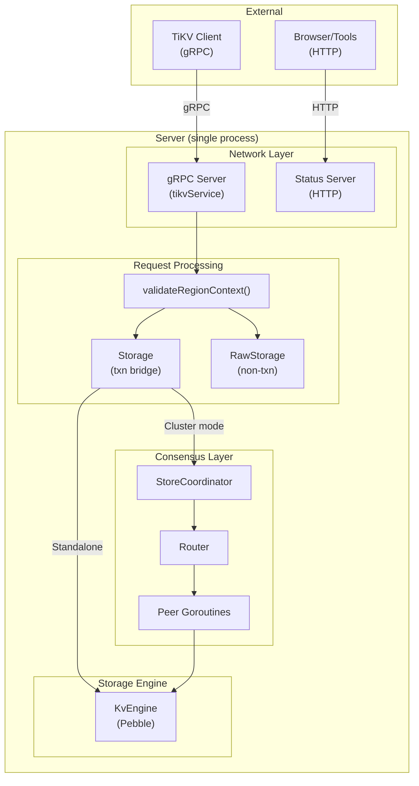
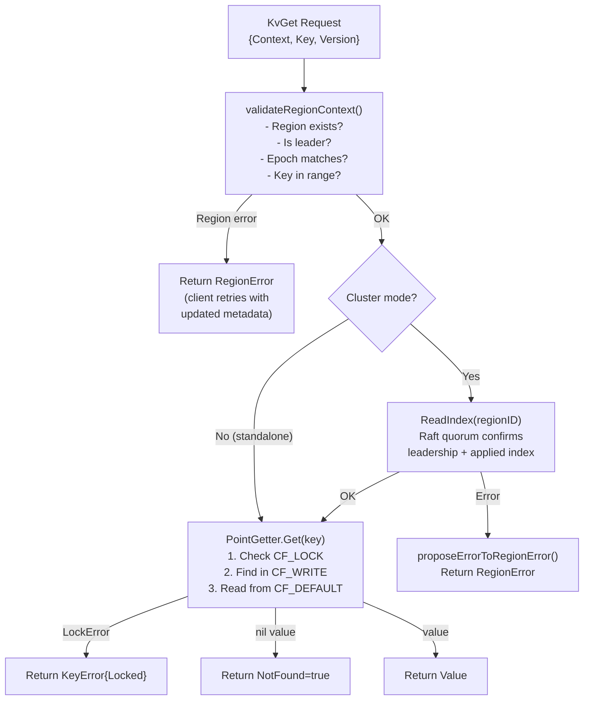
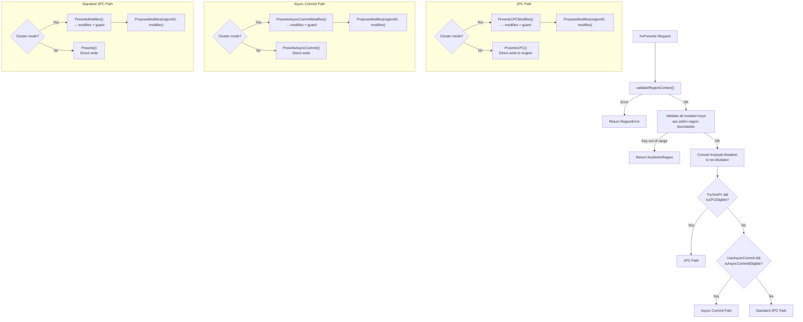
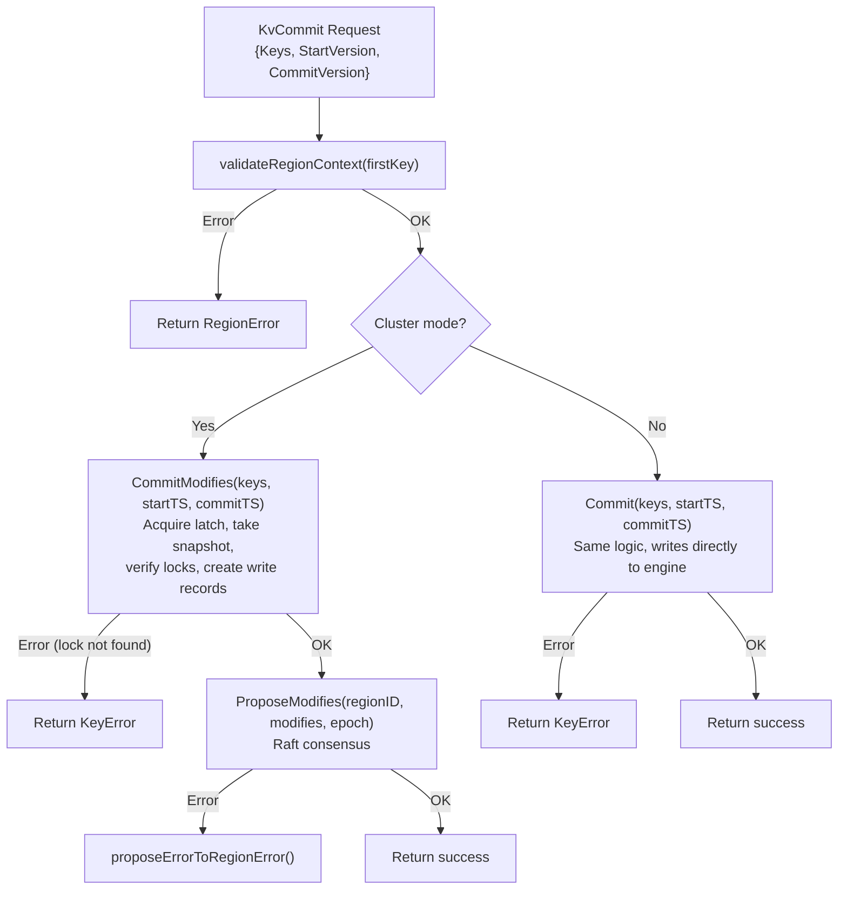
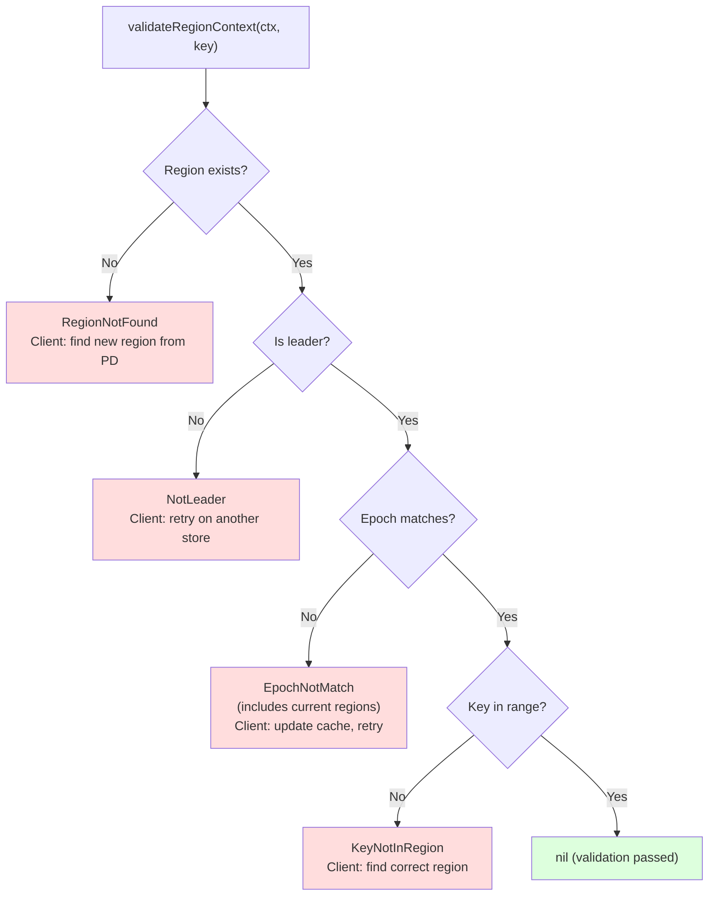
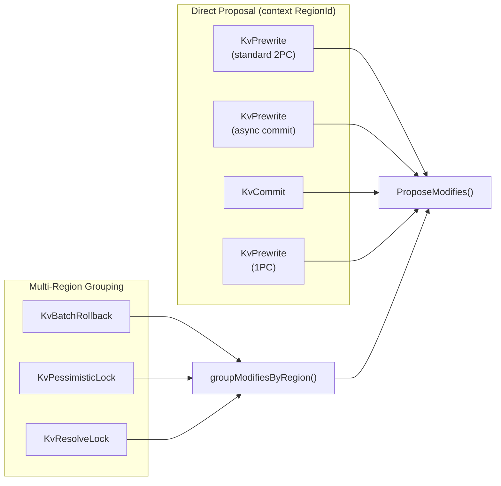
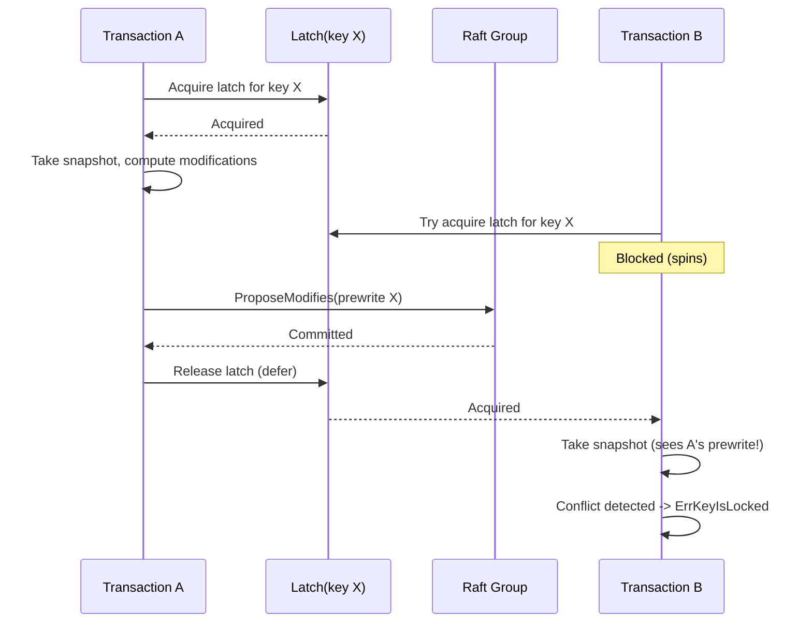
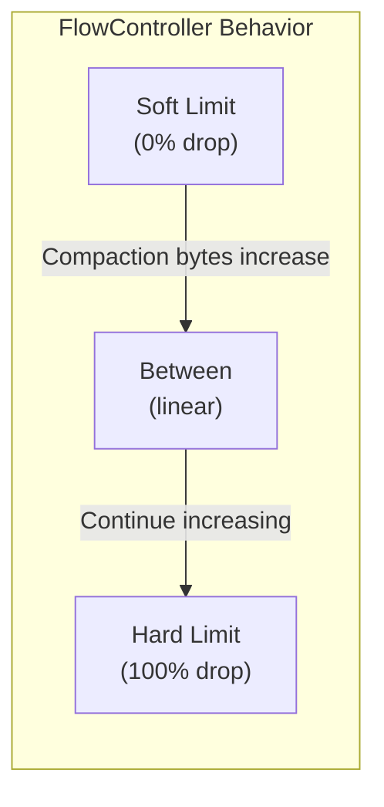
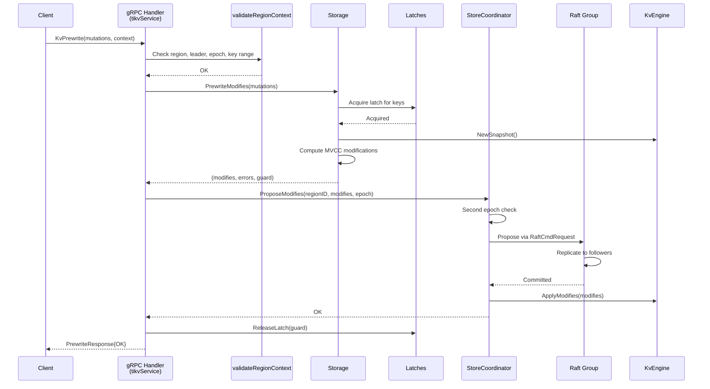

# Chapter 6: Server Architecture and RPC Handling

## Table of Contents

1. [Server Architecture Overview](#server-architecture-overview)
2. [gRPC Service: TiKV API Compatibility](#grpc-service-tikv-api-compatibility)
3. [RPC Handler Flow: KvGet](#rpc-handler-flow-kvget)
4. [RPC Handler Flow: KvPrewrite](#rpc-handler-flow-kvprewrite)
5. [RPC Handler Flow: KvCommit](#rpc-handler-flow-kvcommit)
6. [validateRegionContext: The First Line of Defense](#validateregioncontext-the-first-line-of-defense)
7. [Propose-Time Epoch Check](#propose-time-epoch-check)
8. [proposeErrorToRegionError: Error Translation](#proposeerrortoregionerror-error-translation)
9. [LatchGuard Pattern](#latchguard-pattern)
10. [Storage Bridge: *Modifies Methods vs Direct Methods](#storage-bridge-modifies-methods-vs-direct-methods)
11. [Cluster Mode vs Standalone Mode](#cluster-mode-vs-standalone-mode)
12. [Raw KV: Bypassing MVCC](#raw-kv-bypassing-mvcc)
13. [Flow Control: ReadPool and MemoryQuota](#flow-control-readpool-and-memoryquota)
14. [Status Server: HTTP Diagnostics](#status-server-http-diagnostics)

---

## Server Architecture Overview

### The Big Picture

The gookv server is composed of several layers, each with a clear responsibility:



### Key Components

| Component | Go Type | File | Purpose |
|-----------|---------|------|---------|
| Server | `server.Server` | `internal/server/server.go` | Top-level container; owns gRPC server, Storage, and lifecycle |
| tikvService | `server.tikvService` | `internal/server/server.go` | Implements `tikvpb.TikvServer` interface; handles all RPCs |
| Storage | `server.Storage` | `internal/server/storage.go` | Transaction-aware bridge between RPCs and the engine |
| RawStorage | `server.RawStorage` | `internal/server/raw_storage.go` | Non-transactional direct KV operations |
| StoreCoordinator | `server.StoreCoordinator` | `internal/server/coordinator.go` | Manages Raft peers; bridges consensus and storage |
| GCWorker | `gc.GCWorker` | `internal/storage/gc/gc.go` | Background MVCC garbage collection |
| StatusServer | `status.Server` | `internal/server/status/status.go` | HTTP diagnostics and profiling |

### Server Struct

```go
type Server struct {
    cfg         ServerConfig
    grpcServer  *grpc.Server
    storage     *Storage
    rawStorage  *RawStorage
    gcWorker    *gc.GCWorker
    coordinator *StoreCoordinator  // nil in standalone mode
    pdClient    pdclient.Client    // nil when no PD configured
    listener    net.Listener
    ctx         context.Context
    cancel      context.CancelFunc
    wg          sync.WaitGroup
}
```

The `coordinator` field determines the server's mode:
- **`coordinator == nil`**: Standalone mode. All reads and writes go directly to the engine.
- **`coordinator != nil`**: Cluster mode. Writes go through Raft consensus; reads use ReadIndex for linearizability.

### Server Initialization

```go
func NewServer(cfg ServerConfig, storage *Storage) *Server {
    grpcSrv := grpc.NewServer(opts...)

    // Start GC worker
    gcWorker := gc.NewGCWorker(storage.Engine(), gc.DefaultGCConfig())
    gcWorker.Start()

    s := &Server{
        cfg:        cfg,
        grpcServer: grpcSrv,
        storage:    storage,
        rawStorage: NewRawStorage(storage.Engine()),
        gcWorker:   gcWorker,
    }

    // Register TiKV service
    tikvpb.RegisterTikvServer(grpcSrv, &tikvService{server: s})

    // Enable gRPC reflection
    reflection.Register(grpcSrv)

    return s
}
```

### Startup and Shutdown

```go
func (s *Server) Start() error {
    lis, err := net.Listen("tcp", s.cfg.ListenAddr)
    s.listener = lis
    go s.grpcServer.Serve(lis)
    return nil
}

func (s *Server) Stop() {
    s.cancel()
    s.gcWorker.Stop()
    s.grpcServer.GracefulStop()
    s.wg.Wait()
}
```

---

## gRPC Service: TiKV API Compatibility

### Service Definition

gookv implements the `tikvpb.TikvServer` interface, which is defined in the `kvproto` protobuf package. This makes gookv wire-compatible with TiKV clients (including the official Go client `tikv/client-go`).

```go
type tikvService struct {
    tikvpb.UnimplementedTikvServer  // Provides default implementations
    server *Server
}
```

The `UnimplementedTikvServer` embedding provides safe defaults for unimplemented RPCs -- they return `codes.Unimplemented` instead of panicking.

### Implemented RPCs

| Category | RPC | Description |
|----------|-----|-------------|
| **Read** | `KvGet` | Single-key transactional read |
| | `KvScan` | Range scan with MVCC |
| | `KvBatchGet` | Multi-key transactional read |
| **Write** | `KvPrewrite` | Phase 1 of 2PC (with async commit and 1PC) |
| | `KvCommit` | Phase 2 of 2PC |
| | `KvBatchRollback` | Batch rollback |
| | `KvCleanup` | Single-key lock cleanup |
| **Lock Management** | `KvCheckTxnStatus` | Transaction status with cleanup |
| | `KvResolveLock` | Resolve locks by commit/rollback |
| | `KvScanLock` | Scan for locks below a version |
| | `KvTxnHeartBeat` | Extend lock TTL |
| **Pessimistic** | `KvPessimisticLock` | Acquire pessimistic locks |
| | `KVPessimisticRollback` | Remove pessimistic locks |
| **Async Commit** | `KvCheckSecondaryLocks` | Check secondary lock status |
| **Raw KV** | `RawGet` | Direct key read (no MVCC) |
| | `RawPut` | Direct key write |
| | `RawDelete` | Direct key delete |
| | `RawScan` | Direct range scan |
| | `RawBatchGet` | Direct multi-key read |
| | `RawBatchPut` | Direct multi-key write |
| | `RawBatchDelete` | Direct multi-key delete |
| | `RawBatchScan` | Multi-range direct scan |
| | `RawGetKeyTTL` | Get remaining TTL |
| | `RawCompareAndSwap` | Atomic compare-and-swap |
| | `RawChecksum` | Compute CRC64 checksum |
| **Raft** | `Raft` | Bidirectional Raft message stream |
| | `Snapshot` | Streaming snapshot transfer |
| **Coprocessor** | `Coprocessor` | Push-down computation |
| **GC** | `KvGC` | Trigger GC with safe point |

### Reflection Support

gRPC reflection is enabled, allowing tools like `grpcurl` and `grpcui` to introspect the service:

```go
reflection.Register(grpcSrv)
```

This makes it possible to query the server's capabilities and test RPCs without a compiled client:

```bash
# List all services
grpcurl -plaintext localhost:20160 list

# Describe a method
grpcurl -plaintext localhost:20160 describe tikvpb.Tikv.KvGet
```

---

## RPC Handler Flow: KvGet

`KvGet` is the simplest transactional read. Understanding its flow reveals the pattern used by all RPCs.

### The Code

```go
func (svc *tikvService) KvGet(ctx context.Context, req *kvrpcpb.GetRequest) (*kvrpcpb.GetResponse, error) {
    resp := &kvrpcpb.GetResponse{}

    // Step 1: Validate region context (epoch check, leader check, key range check)
    if regErr := svc.validateRegionContext(req.GetContext(), req.GetKey()); regErr != nil {
        resp.RegionError = regErr
        return resp, nil
    }

    // Step 2: ReadIndex for linearizable reads in cluster mode
    if coord := svc.server.coordinator; coord != nil && req.GetContext().GetRegionId() != 0 {
        regionID := req.GetContext().GetRegionId()
        if err := coord.ReadIndex(regionID, 2*time.Second); err != nil {
            if regErr := proposeErrorToRegionError(err, regionID); regErr != nil {
                resp.RegionError = regErr
                return resp, nil
            }
            resp.RegionError = &errorpb.Error{Message: err.Error()}
            return resp, nil
        }
    }

    // Step 3: Respect isolation level from request context
    isolationLevel := mvcc.IsolationLevelSI
    if req.GetContext().GetIsolationLevel() == kvrpcpb.IsolationLevel_RC {
        isolationLevel = mvcc.IsolationLevelRC
    }

    // Step 4: Perform the MVCC read via PointGetter
    value, err := svc.server.storage.GetWithIsolation(
        req.GetKey(), txntypes.TimeStamp(req.GetVersion()), isolationLevel,
    )
    if err != nil {
        var lockErr *mvcc.LockError
        if errors.As(err, &lockErr) {
            resp.Error = &kvrpcpb.KeyError{Locked: lockToLockInfo(...)}
            return resp, nil
        }
        return nil, status.Errorf(codes.Internal, "get failed: %v", err)
    }

    // Step 5: Build response
    if value == nil {
        resp.NotFound = true
    } else {
        resp.Value = value
    }
    return resp, nil
}
```

### Flow Diagram



### Storage.GetWithIsolation

The `Storage.GetWithIsolation` method creates a snapshot, builds a reader and PointGetter, and performs the read:

```go
func (s *Storage) GetWithIsolation(key []byte, version txntypes.TimeStamp, level mvcc.IsolationLevel) ([]byte, error) {
    snap := s.engine.NewSnapshot()
    reader := mvcc.NewMvccReader(snap)
    defer reader.Close()

    pg := mvcc.NewPointGetter(reader, version, level)
    return pg.Get(key)
}
```

---

## RPC Handler Flow: KvPrewrite

`KvPrewrite` is the most complex RPC because it supports three different transaction paths: standard 2PC, async commit, and 1PC.

### Three Paths



### Mutation Key Validation

In cluster mode, the handler performs an additional check: all mutation keys must fall within the region's boundaries. This prevents stale client routing from writing to the wrong region after a split:

```go
if coord := svc.server.coordinator; coord != nil {
    peer := coord.GetPeer(req.GetContext().GetRegionId())
    if peer != nil {
        region := peer.Region()
        startKey := region.GetStartKey()
        endKey := region.GetEndKey()
        for _, m := range req.GetMutations() {
            encodedKey := codec.EncodeBytes(nil, m.GetKey())
            if len(startKey) > 0 && bytes.Compare(encodedKey, startKey) < 0 {
                return KeyNotInRegion error
            }
            if len(endKey) > 0 && bytes.Compare(encodedKey, endKey) >= 0 {
                return KeyNotInRegion error
            }
        }
    }
}
```

### Standard 2PC Path (Cluster Mode)

```go
// Compute modifications (acquire latch, take snapshot, run prewrite logic)
modifies, errs, guard := svc.server.storage.PrewriteModifies(mutations, primary, startTS, lockTTL)
defer svc.server.storage.ReleaseLatch(guard)  // Release latch AFTER Raft proposal

// Check for prewrite errors
for _, err := range errs {
    if err != nil {
        resp.Errors = append(resp.Errors, errToKeyError(err))
    }
}
if len(resp.Errors) > 0 || len(modifies) == 0 {
    return resp, nil
}

// Propose modifications via Raft
regionID := req.GetContext().GetRegionId()
if err := coord.ProposeModifies(regionID, modifies, 10*time.Second, req.GetContext().GetRegionEpoch()); err != nil {
    if regErr := proposeErrorToRegionError(err, regionID); regErr != nil {
        resp.RegionError = regErr
        return resp, nil
    }
    return nil, status.Errorf(codes.Internal, "raft propose failed: %v", err)
}
```

### 1PC Path

```go
commitTS := startTS + 1
// Use PD TSO if available
if svc.server.pdClient != nil {
    pdTS, err := svc.server.pdClient.GetTS(ctx)
    if err == nil {
        commitTS = txntypes.TimeStamp(pdTS.ToUint64())
    }
}

modifies, errs, onePCCommitTS, guard := svc.server.storage.Prewrite1PCModifies(
    mutations, primary, startTS, commitTS, lockTTL,
)
defer svc.server.storage.ReleaseLatch(guard)

// ... error checking ...

coord.ProposeModifies(regionID, modifies, 10*time.Second, req.GetContext().GetRegionEpoch())
resp.OnePcCommitTs = uint64(onePCCommitTS)
```

### Region ID Resolution

The handler uses the request's `Context.RegionId` when available (client-grouped). Otherwise, it resolves using the first mutation key:

```go
regionID := req.GetContext().GetRegionId()
if regionID == 0 && len(mutations) > 0 {
    regionID = svc.resolveRegionID(mutations[0].Key)
}
```

The `resolveRegionID` method encodes the raw key and calls `StoreCoordinator.ResolveRegionForKey`:

```go
func (svc *tikvService) resolveRegionID(key []byte) uint64 {
    if coord := svc.server.coordinator; coord != nil {
        encodedKey := mvcc.EncodeLockKey(key)
        if rid := coord.ResolveRegionForKey(encodedKey); rid != 0 {
            return rid
        }
    }
    return 1  // Fallback
}
```

---

## RPC Handler Flow: KvCommit

### The Code

```go
func (svc *tikvService) KvCommit(ctx context.Context, req *kvrpcpb.CommitRequest) (*kvrpcpb.CommitResponse, error) {
    resp := &kvrpcpb.CommitResponse{}

    // Validate with the first key for region boundary checking
    var validateKey []byte
    if len(req.GetKeys()) > 0 {
        validateKey = req.GetKeys()[0]
    }
    if regErr := svc.validateRegionContext(req.GetContext(), validateKey); regErr != nil {
        resp.RegionError = regErr
        return resp, nil
    }

    keys := req.GetKeys()
    startTS := txntypes.TimeStamp(req.GetStartVersion())
    commitTS := txntypes.TimeStamp(req.GetCommitVersion())

    if coord := svc.server.coordinator; coord != nil {
        // Cluster mode: compute modifications then propose via Raft
        modifies, err, guard := svc.server.storage.CommitModifies(keys, startTS, commitTS)
        defer svc.server.storage.ReleaseLatch(guard)

        if err != nil {
            resp.Error = errToKeyError(err)
            return resp, nil
        }
        if len(modifies) > 0 {
            regionID := req.GetContext().GetRegionId()
            if regionID == 0 && len(keys) > 0 {
                regionID = svc.resolveRegionID(keys[0])
            }
            coord.ProposeModifies(regionID, modifies, 10*time.Second, req.GetContext().GetRegionEpoch())
        }
        return resp, nil
    }

    // Standalone mode: direct write
    err := svc.server.storage.Commit(keys, startTS, commitTS)
    if err != nil {
        resp.Error = errToKeyError(err)
    }
    return resp, nil
}
```

### Commit Flow Diagram



### Why Validate with the First Key

The comment in the code explains:

> Validate with the first key so that after a region split, a commit sent to the wrong region returns `KeyNotInRegion` (retriable) instead of proceeding and getting `TxnLockNotFound` (non-retriable).

`KeyNotInRegion` tells the client to refresh its region cache and retry. `TxnLockNotFound` could cause the client to abort the entire transaction unnecessarily.

---

## validateRegionContext: The First Line of Defense

### Purpose

Every RPC handler calls `validateRegionContext` before doing any work. This function performs four checks in order:

### The Four Checks

```go
func (svc *tikvService) validateRegionContext(reqCtx *kvrpcpb.Context, key []byte) *errorpb.Error {
    // Skip validation if no region context (backward compatibility)
    if reqCtx == nil || reqCtx.GetRegionId() == 0 {
        return nil
    }

    coord := svc.server.coordinator
    if coord == nil {
        return nil  // Standalone mode: no regions
    }

    regionID := reqCtx.GetRegionId()
    peer := coord.GetPeer(regionID)

    // Check 1: Region exists on this store
    if peer == nil {
        return &errorpb.Error{
            RegionNotFound: &errorpb.RegionNotFound{RegionId: regionID},
        }
    }

    // Check 2: This node is the leader
    if !peer.IsLeader() {
        return &errorpb.Error{
            NotLeader: &errorpb.NotLeader{RegionId: regionID},
        }
    }

    // Check 3: Epoch matches
    if reqEpoch := reqCtx.GetRegionEpoch(); reqEpoch != nil {
        currentEpoch := peer.Region().GetRegionEpoch()
        if currentEpoch != nil {
            if reqEpoch.GetVersion() != currentEpoch.GetVersion() ||
                reqEpoch.GetConfVer() != currentEpoch.GetConfVer() {
                return &errorpb.Error{
                    EpochNotMatch: &errorpb.EpochNotMatch{
                        CurrentRegions: []*metapb.Region{peer.Region()},
                    },
                }
            }
        }
    }

    // Check 4: Key is within region range
    if key != nil {
        region := peer.Region()
        encodedKey := codec.EncodeBytes(nil, key)  // Encode to match boundary format
        if len(region.GetStartKey()) > 0 && bytes.Compare(encodedKey, region.GetStartKey()) < 0 {
            return &errorpb.Error{
                KeyNotInRegion: &errorpb.KeyNotInRegion{...},
            }
        }
        if len(region.GetEndKey()) > 0 && bytes.Compare(encodedKey, region.GetEndKey()) >= 0 {
            return &errorpb.Error{
                KeyNotInRegion: &errorpb.KeyNotInRegion{...},
            }
        }
    }

    return nil
}
```

### Validation Error Types



### Important: Key Encoding

The key comparison uses `codec.EncodeBytes(nil, key)` to match the region boundary format. Region boundaries are stored in memcomparable encoding, so raw user keys must be encoded before comparison:

```go
encodedKey := codec.EncodeBytes(nil, key)
if bytes.Compare(encodedKey, region.GetStartKey()) < 0 {
    // Key is before this region's start
}
```

---

## Propose-Time Epoch Check

### Why a Second Check?

A race condition exists between `validateRegionContext` and the Raft proposal:

```
Time 0: validateRegionContext passes (epoch {v:1})
Time 1: Region splits (epoch becomes {v:2})
Time 2: ProposeModifies is called with stale epoch
```

Without the second check, the modification would enter the Raft log for a region that no longer owns those keys.

### Implementation in ProposeModifies

```go
func (sc *StoreCoordinator) ProposeModifies(regionID uint64, modifies []mvcc.Modify, timeout time.Duration, reqEpoch ...*metapb.RegionEpoch) error {
    peer, ok := sc.peers[regionID]
    if !ok {
        return fmt.Errorf("raftstore: region %d not found", regionID)
    }
    if !peer.IsLeader() {
        return fmt.Errorf("raftstore: not leader for region %d", regionID)
    }

    // SECOND epoch check, right before proposing
    currentEpoch := peer.Region().GetRegionEpoch()
    if len(reqEpoch) > 0 && reqEpoch[0] != nil && currentEpoch != nil {
        re := reqEpoch[0]
        if re.GetVersion() != currentEpoch.GetVersion() ||
            re.GetConfVer() != currentEpoch.GetConfVer() {
            return fmt.Errorf("raftstore: epoch not match for region %d", regionID)
        }
    }

    // Build RaftCmdRequest with epoch in header
    cmdReq := &raft_cmdpb.RaftCmdRequest{
        Header: &raft_cmdpb.RaftRequestHeader{
            RegionId:    regionID,
            RegionEpoch: currentEpoch,
        },
        Requests: ModifiesToRequests(modifies),
    }

    // Propose via Raft and wait for commit
    // ...
}
```

### Epoch Carried in Raft Entry

The epoch is stored in the `RaftCmdRequest.Header.RegionEpoch`. This allows the apply step to detect whether the entry was proposed before or after a split, though gookv currently applies all committed entries unconditionally (the epoch check at propose time is sufficient for correctness).

---

## proposeErrorToRegionError: Error Translation

### Purpose

When `ProposeModifies` fails, the error is a plain Go error with a string message. The `proposeErrorToRegionError` function translates it into a structured `errorpb.Error` that the TiKV client protocol understands:

```go
func proposeErrorToRegionError(err error, regionID uint64) *errorpb.Error {
    msg := err.Error()

    if strings.Contains(msg, "not found") {
        return &errorpb.Error{
            Message:        msg,
            RegionNotFound: &errorpb.RegionNotFound{RegionId: regionID},
        }
    }

    if strings.Contains(msg, "not leader") {
        return &errorpb.Error{
            Message:   msg,
            NotLeader: &errorpb.NotLeader{RegionId: regionID},
        }
    }

    if strings.Contains(msg, "timeout") {
        // Proposal timeout: Raft group is non-functional
        // Return NotLeader so client retries on a different store
        return &errorpb.Error{
            Message:   msg,
            NotLeader: &errorpb.NotLeader{RegionId: regionID},
        }
    }

    if strings.Contains(msg, "epoch not match") {
        return &errorpb.Error{
            Message:       msg,
            EpochNotMatch: &errorpb.EpochNotMatch{},
        }
    }

    return nil  // Not a region error (internal failure)
}
```

### Error Translation Table

| Error Contains | Translated To | Client Action |
|---------------|--------------|---------------|
| "not found" | `RegionNotFound` | Refresh region from PD |
| "not leader" | `NotLeader` | Retry on another store |
| "timeout" | `NotLeader` | Retry on another store |
| "epoch not match" | `EpochNotMatch` | Refresh region, retry |
| (other) | `nil` (returns gRPC error) | Application-level error |

### Proposal Routing Strategy



Some RPCs operate on keys that may span multiple regions. These use `groupModifiesByRegion` to split modifications by region and propose each group separately:

```go
func (svc *tikvService) groupModifiesByRegion(modifies []mvcc.Modify) map[uint64][]mvcc.Modify {
    groups := make(map[uint64][]mvcc.Modify)
    for _, m := range modifies {
        // Decode the modify key to raw user key, re-encode as lock key
        rawKey, _, _ := mvcc.DecodeKey(m.Key)
        routingKey := m.Key
        if rawKey != nil {
            routingKey = mvcc.EncodeLockKey(rawKey)
        }
        regionID := svc.resolveRegionID(routingKey)
        groups[regionID] = append(groups[regionID], m)
    }
    return groups
}
```

---

## LatchGuard Pattern

### The Problem

In cluster mode, there is a gap between computing MVCC modifications and having those modifications applied through Raft:

```
Time 0: Txn A reads snapshot, sees no lock on key X
Time 1: Txn A computes PrewriteModifies for key X
Time 2: Txn B reads snapshot, sees no lock on key X (Txn A's prewrite not yet applied!)
Time 3: Txn A's Raft proposal is committed and applied
Time 4: Txn B's Raft proposal is committed and applied
Result: Both transactions prewrote key X -> data corruption!
```

### The Solution: Latches

A **latch** is a lightweight lock on a set of keys. The `LatchGuard` pattern ensures that the latch is held from the moment a snapshot is taken until after the Raft proposal completes:

```go
type LatchGuard struct {
    lock  *latch.Lock
    cmdID uint64
}

func (s *Storage) ReleaseLatch(g *LatchGuard) {
    if g != nil {
        s.latches.Release(g.lock, g.cmdID)
    }
}
```

### How It Works

The `*Modifies` methods acquire the latch before taking a snapshot and return the guard to the caller:

```go
func (s *Storage) PrewriteModifies(mutations []txn.Mutation, primary []byte, startTS txntypes.TimeStamp, lockTTL uint64) ([]mvcc.Modify, []error, *LatchGuard) {
    // 1. Compute keys for latching
    keys := make([][]byte, len(mutations))
    for i, m := range mutations {
        keys[i] = m.Key
    }

    // 2. Acquire latch (blocks other transactions on same keys)
    cmdID := s.allocCmdID()
    lock := s.latches.GenLock(keys)
    for !s.latches.Acquire(lock, cmdID) {
        // Spin until acquired
    }
    guard := &LatchGuard{lock: lock, cmdID: cmdID}

    // 3. Take snapshot AFTER acquiring latch
    snap := s.engine.NewSnapshot()
    reader := mvcc.NewMvccReader(snap)
    defer reader.Close()

    // 4. Compute modifications
    mvccTxn := mvcc.NewMvccTxn(startTS)
    for i, mut := range mutations {
        errs[i] = txn.Prewrite(mvccTxn, reader, props, mut)
    }

    // 5. Return guard (caller MUST release it after Raft proposal)
    return mvccTxn.Modifies, errs, guard
}
```

The RPC handler holds the guard across the Raft proposal:

```go
modifies, errs, guard := svc.server.storage.PrewriteModifies(...)
defer svc.server.storage.ReleaseLatch(guard)  // Released AFTER ProposeModifies returns

// ... error checking ...

coord.ProposeModifies(regionID, modifies, 10*time.Second, epoch)
```

### Latch Timeline



### Standalone Mode: No Guard Needed

In standalone mode, the `Prewrite` method acquires and releases the latch within the same function call:

```go
func (s *Storage) Prewrite(mutations []txn.Mutation, ...) []error {
    cmdID := s.allocCmdID()
    lock := s.latches.GenLock(keys)
    for !s.latches.Acquire(lock, cmdID) {}
    defer s.latches.Release(lock, cmdID)  // Released immediately after write

    // ... compute and apply modifications directly ...
    s.ApplyModifies(mvccTxn.Modifies)
    return errs
}
```

---

## Storage Bridge: *Modifies Methods vs Direct Methods

### Two Interfaces for Each Operation

The `Storage` struct provides two versions of each transaction operation:

| Direct Method | Modifies Method | Used By |
|--------------|-----------------|---------|
| `Prewrite(...)` | `PrewriteModifies(...)` | Standalone / Cluster |
| `Commit(...)` | `CommitModifies(...)` | Standalone / Cluster |
| `BatchRollback(...)` | `BatchRollbackModifies(...)` | Standalone / Cluster |
| `Cleanup(...)` | `CleanupModifies(...)` | Standalone / Cluster |
| `ResolveLock(...)` | `ResolveLockModifies(...)` | Standalone / Cluster |
| `PessimisticLock(...)` | `PessimisticLockModifies(...)` | Standalone / Cluster |

### Direct Methods

Direct methods acquire a latch, compute modifications, apply them to the engine, and release the latch -- all in one function:

```go
func (s *Storage) Commit(keys [][]byte, startTS, commitTS txntypes.TimeStamp) error {
    cmdID := s.allocCmdID()
    lock := s.latches.GenLock(keys)
    for !s.latches.Acquire(lock, cmdID) {}
    defer s.latches.Release(lock, cmdID)

    snap := s.engine.NewSnapshot()
    reader := mvcc.NewMvccReader(snap)
    defer reader.Close()

    mvccTxn := mvcc.NewMvccTxn(startTS)
    for _, key := range keys {
        if err := txn.Commit(mvccTxn, reader, key, startTS, commitTS); err != nil {
            return err
        }
    }

    return s.ApplyModifies(mvccTxn.Modifies)  // Write directly to engine
}
```

### *Modifies Methods

The `*Modifies` variants do everything except apply the modifications. They return the modifications and a `LatchGuard` for the caller to manage:

```go
func (s *Storage) CommitModifies(keys [][]byte, startTS, commitTS txntypes.TimeStamp) ([]mvcc.Modify, error, *LatchGuard) {
    cmdID := s.allocCmdID()
    lock := s.latches.GenLock(keys)
    for !s.latches.Acquire(lock, cmdID) {}
    guard := &LatchGuard{lock: lock, cmdID: cmdID}

    snap := s.engine.NewSnapshot()
    reader := mvcc.NewMvccReader(snap)
    defer reader.Close()

    mvccTxn := mvcc.NewMvccTxn(startTS)
    for _, key := range keys {
        if err := txn.Commit(mvccTxn, reader, key, startTS, commitTS); err != nil {
            return nil, err, guard
        }
    }

    return mvccTxn.Modifies, nil, guard  // Caller applies via Raft
}
```

### ApplyModifies

Both paths eventually call `ApplyModifies` to write to the engine:

```go
func (s *Storage) ApplyModifies(modifies []mvcc.Modify) error {
    wb := s.engine.NewWriteBatch()
    for _, m := range modifies {
        switch m.Type {
        case mvcc.ModifyTypePut:
            wb.Put(m.CF, m.Key, m.Value)
        case mvcc.ModifyTypeDelete:
            wb.Delete(m.CF, m.Key)
        case mvcc.ModifyTypeDeleteRange:
            wb.DeleteRange(m.CF, m.Key, m.EndKey)
        }
    }
    return wb.Commit()
}
```

In cluster mode, `ApplyModifies` is called by the `StoreCoordinator.applyEntriesForPeer` function after Raft entries are committed.

### Modify Serialization for Raft

When modifications travel through Raft, they are serialized as `raft_cmdpb.Request` protobufs (via `ModifiesToRequests`) and deserialized back (via `RequestsToModifies`):

```go
// Serialization: leader -> Raft log
func ModifiesToRequests(modifies []mvcc.Modify) []*raft_cmdpb.Request {
    for _, m := range modifies {
        switch m.Type {
        case mvcc.ModifyTypePut:
            reqs = append(reqs, &raft_cmdpb.Request{
                CmdType: raft_cmdpb.CmdType_Put,
                Put: &raft_cmdpb.PutRequest{Cf: m.CF, Key: m.Key, Value: m.Value},
            })
        case mvcc.ModifyTypeDelete:
            // ...
        }
    }
    return reqs
}

// Deserialization: all nodes apply committed entries
func RequestsToModifies(reqs []*raft_cmdpb.Request) []mvcc.Modify {
    for _, r := range reqs {
        switch r.CmdType {
        case raft_cmdpb.CmdType_Put:
            modifies = append(modifies, mvcc.Modify{
                Type: mvcc.ModifyTypePut, CF: r.Put.Cf, Key: r.Put.Key, Value: r.Put.Value,
            })
        // ...
        }
    }
    return modifies
}
```

---

## Cluster Mode vs Standalone Mode

### Decision Point

The server's behavior is determined by whether a `StoreCoordinator` is set:

```go
// Set coordinator for cluster mode
func (s *Server) SetCoordinator(coord *StoreCoordinator) {
    s.coordinator = coord
}
```

### Comparison

| Feature | Standalone Mode | Cluster Mode |
|---------|----------------|--------------|
| Writes | Direct to engine | Through Raft consensus |
| Reads | Direct from engine | ReadIndex then read from engine |
| Region validation | Skipped | Full validation (4 checks) |
| Fault tolerance | None | Raft replication |
| Latching | Acquire-compute-apply-release | Acquire-compute-propose-release |
| Epoch checking | Not applicable | Two-layer (RPC + propose-time) |
| Coordinator | `nil` | `*StoreCoordinator` |

### Pattern in Every RPC Handler

Every write RPC follows this pattern:

```go
func (svc *tikvService) KvSomeWrite(ctx context.Context, req *...) (*..., error) {
    // 1. Validate region context
    if regErr := svc.validateRegionContext(req.GetContext(), key); regErr != nil {
        return regErr
    }

    // 2. Branch on mode
    if coord := svc.server.coordinator; coord != nil {
        // CLUSTER: compute modifications, propose via Raft
        modifies, err, guard := svc.server.storage.SomeOperationModifies(...)
        defer svc.server.storage.ReleaseLatch(guard)
        // ... error check ...
        coord.ProposeModifies(regionID, modifies, timeout, epoch)
    } else {
        // STANDALONE: direct write
        svc.server.storage.SomeOperation(...)
    }
}
```

### ReadIndex in Cluster Mode

All read RPCs in cluster mode call `ReadIndex` before reading:

```go
if coord := svc.server.coordinator; coord != nil && req.GetContext().GetRegionId() != 0 {
    regionID := req.GetContext().GetRegionId()
    if err := coord.ReadIndex(regionID, 2*time.Second); err != nil {
        resp.RegionError = proposeErrorToRegionError(err, regionID)
        return resp, nil
    }
}
```

`ReadIndex` contacts a quorum of peers to confirm leadership, then waits for the applied index to reach the committed index. This prevents stale reads from a deposed leader.

---

## Raw KV: Bypassing MVCC

### Purpose

Raw KV provides non-transactional key-value operations that bypass the MVCC layer entirely. This is useful for:
- Simple caching workloads
- Non-transactional data (counters, session state)
- Compatibility with applications that do not need transactions

### RawStorage

```go
type RawStorage struct {
    engine traits.KvEngine
    casMu  sync.Mutex  // Global mutex for CAS atomicity
}
```

### Operations

| Method | Description |
|--------|-------------|
| `Get(cf, key)` | Read a single key |
| `Put(cf, key, value, ttl...)` | Write a key with optional TTL |
| `Delete(cf, key)` | Delete a key |
| `BatchGet(cf, keys)` | Read multiple keys from a consistent snapshot |
| `BatchPut(cf, pairs)` | Atomically write multiple keys |
| `BatchDelete(cf, keys)` | Atomically delete multiple keys |
| `Scan(cf, start, end, limit, keyOnly, reverse)` | Range scan |
| `BatchScan(cf, ranges, eachLimit, keyOnly, reverse)` | Multi-range scan |
| `DeleteRange(cf, startKey, endKey)` | Delete all keys in range |
| `GetKeyTTL(cf, key)` | Get remaining TTL |
| `CompareAndSwap(cf, key, value, prev, ...)` | Atomic CAS |
| `Checksum(cf, ranges)` | CRC64-XOR checksum |

### TTL Support

Raw KV supports per-key TTL (Time-To-Live). The TTL is encoded by appending 9 bytes to the value:

```
[user value bytes] [8-byte expire timestamp (big-endian)] [flag byte 0x01]
```

```go
func encodeValueWithTTL(value []byte, ttl uint64) []byte {
    if ttl == 0 {
        return value  // No TTL
    }
    expireTS := uint64(time.Now().Unix()) + ttl
    buf := make([]byte, len(value)+9)
    copy(buf, value)
    binary.BigEndian.PutUint64(buf[len(value):], expireTS)
    buf[len(buf)-1] = 0x01  // TTL flag
    return buf
}
```

Reads check for TTL expiry by examining the last byte. If it is `0x01`, the preceding 8 bytes are the expiry timestamp. Expired keys are treated as not found.

### Compare-And-Swap

`CompareAndSwap` provides atomic read-modify-write semantics using a global mutex:

```go
func (rs *RawStorage) CompareAndSwap(cf string, key, value, prevValue []byte, prevNotExist bool, isDelete bool, ttl uint64) (...) {
    rs.casMu.Lock()
    defer rs.casMu.Unlock()

    // Read current value
    currentValue, expired := ...

    // Compare with expected
    if prevNotExist {
        match = currentNotExist
    } else {
        match = bytesEqual(currentValue, prevValue)
    }

    if !match {
        return false, currentNotExist, currentValue, nil
    }

    // Apply change
    if isDelete {
        rs.engine.Delete(cf, key)
    } else {
        rs.engine.Put(cf, key, encodeValueWithTTL(value, ttl))
    }
    return true, currentNotExist, currentValue, nil
}
```

### Cluster Mode for Raw KV

In cluster mode, Raw KV write RPCs use `RawStorage.PutModify` and `RawStorage.DeleteModify` to create `Modify` objects that are proposed through Raft:

```go
func (rs *RawStorage) PutModify(cf string, key, value []byte, ttl ...uint64) mvcc.Modify {
    encoded := encodeValueWithTTL(value, t)
    return mvcc.Modify{Type: mvcc.ModifyTypePut, CF: cf, Key: key, Value: encoded}
}
```

---

## Flow Control: ReadPool and MemoryQuota

### ReadPool

The `ReadPool` (defined in `internal/server/flow/flow.go`) manages a fixed pool of worker goroutines for read requests and provides backpressure via EWMA-based wait time estimation:

```go
type ReadPool struct {
    workers    int
    taskCh     chan func()
    ewmaSlice  atomic.Int64  // EWMA of task execution time (nanoseconds)
    queueDepth atomic.Int64  // Current tasks queued
    alpha      float64       // EWMA smoothing factor (0.3)
}
```

The pool estimates wait time and rejects requests that would exceed a client-specified threshold:

```go
func (rp *ReadPool) CheckBusy(ctx context.Context, thresholdMs uint32) error {
    ewma := rp.ewmaSlice.Load()
    depth := rp.queueDepth.Load()
    estimatedWait := ewma * depth / int64(rp.workers)

    if estimatedWait > int64(thresholdMs)*int64(time.Millisecond) {
        return &ServerIsBusyError{
            Reason:          "estimated wait time exceeds threshold",
            EstimatedWaitMs: uint32(estimatedWait / int64(time.Millisecond)),
        }
    }
    return nil
}
```

### FlowController

The `FlowController` monitors write pressure and implements probabilistic request dropping based on compaction pressure:

```go
type FlowController struct {
    discardRatio atomic.Uint32  // Fixed-point 0-1000
    softLimit    int64          // Pending compaction bytes soft limit
    hardLimit    int64          // Pending compaction bytes hard limit
}
```

The discard ratio linearly interpolates between soft and hard limits:

```go
func (fc *FlowController) UpdatePendingCompactionBytes(pending int64) {
    if pending < fc.softLimit {
        fc.discardRatio.Store(0)        // No backpressure
    } else if pending >= fc.hardLimit {
        fc.discardRatio.Store(1000)     // Drop all writes
    } else {
        ratio := float64(pending-fc.softLimit) / float64(fc.hardLimit-fc.softLimit)
        fc.discardRatio.Store(uint32(ratio * 1000))
    }
}

func (fc *FlowController) ShouldDrop() bool {
    ratio := float64(fc.discardRatio.Load()) / 1000.0
    return ratio > 0 && rand.Float64() < ratio
}
```



### MemoryQuota

The `MemoryQuota` enforces a memory limit on the scheduler using lock-free atomic CAS:

```go
type MemoryQuota struct {
    capacity int64
    used     atomic.Int64
}

func (mq *MemoryQuota) Acquire(size int64) error {
    for {
        old := mq.used.Load()
        if old+size > mq.capacity {
            return ErrSchedTooBusy
        }
        if mq.used.CompareAndSwap(old, old+size) {
            return nil
        }
    }
}

func (mq *MemoryQuota) Release(size int64) {
    mq.used.Add(-size)
}
```

---

## Status Server: HTTP Diagnostics

### Purpose

The status server provides HTTP endpoints for monitoring, debugging, and profiling. It runs on a separate port from the gRPC server.

### Architecture

```go
type Server struct {
    httpServer *http.Server
    listener   net.Listener
    addr       string
    configFn   func() interface{}
}
```

### Endpoints

| Endpoint | Method | Description |
|----------|--------|-------------|
| `/status` | GET | Returns `{"status": "ok", "version": "gookv-dev"}` |
| `/health` | GET | Health check: `{"status": "ok"}` |
| `/config` | GET | Returns current server configuration as JSON |
| `/metrics` | GET | Prometheus metrics (via `promhttp.Handler()`) |
| `/debug/pprof/` | GET | Go pprof index (goroutine, heap, etc.) |
| `/debug/pprof/profile` | GET | CPU profile |
| `/debug/pprof/trace` | GET | Execution trace |
| `/debug/pprof/symbol` | GET | Symbol lookup |

### Usage Examples

```bash
# Health check
curl http://localhost:20180/health

# View current configuration
curl http://localhost:20180/config

# Capture 30-second CPU profile
go tool pprof http://localhost:20180/debug/pprof/profile?seconds=30

# View goroutine stack dump
curl http://localhost:20180/debug/pprof/goroutine?debug=2

# Prometheus metrics
curl http://localhost:20180/metrics
```

### Configuration

```go
func New(cfg Config) *Server {
    mux := http.NewServeMux()

    // pprof
    mux.HandleFunc("/debug/pprof/", pprof.Index)
    mux.HandleFunc("/debug/pprof/profile", pprof.Profile)
    // ...

    // Prometheus
    mux.Handle("/metrics", promhttp.Handler())

    // Application
    mux.HandleFunc("/config", s.handleConfig)
    mux.HandleFunc("/status", s.handleStatus)
    mux.HandleFunc("/health", s.handleHealth)

    s.httpServer = &http.Server{
        Handler:      mux,
        ReadTimeout:  10 * time.Second,
        WriteTimeout: 30 * time.Second,
        IdleTimeout:  60 * time.Second,
    }
}
```

---

## Summary: Request Processing Architecture

### Complete Request Flow (Cluster Mode Write)



---

## Appendix A: Concurrency Manager

### Purpose

The `ConcurrencyManager` (defined in `internal/storage/txn/concurrency/manager.go`) tracks two things for async commit correctness:

1. **max_ts**: The maximum observed timestamp across all reads on this store
2. **In-memory lock table**: A record of active transaction locks

### max_ts Tracking

When an async commit prewrite sets `MinCommitTS`, it must be at least `max_ts + 1` to ensure no reader at `max_ts` can miss the write:

```go
type Manager struct {
    maxTS     atomic.Uint64
    lockTable sync.Map  // key (string) -> *LockHandle
}

func (m *Manager) UpdateMaxTS(ts txntypes.TimeStamp) {
    for {
        current := m.maxTS.Load()
        if uint64(ts) <= current {
            return
        }
        if m.maxTS.CompareAndSwap(current, uint64(ts)) {
            return
        }
    }
}
```

### In-Memory Lock Table

The lock table provides fast in-memory conflict detection without disk I/O:

```go
type LockHandle struct {
    Key     []byte
    StartTS txntypes.TimeStamp
}

type KeyHandleGuard struct {
    mgr *Manager
    key string
}

func (g *KeyHandleGuard) Release() {
    g.mgr.lockTable.Delete(g.key)
}
```

The guard pattern ensures locks are cleaned up even if the transaction fails:

```go
guard := manager.LockKey(key, startTS)
defer guard.Release()
// ... do work ...
```

### GlobalMinLock

For GC coordination, the manager provides the minimum start_ts across all in-memory locks:

```go
func (m *Manager) GlobalMinLock() *txntypes.TimeStamp {
    var minTS *txntypes.TimeStamp
    m.lockTable.Range(func(_, value interface{}) bool {
        handle := value.(*LockHandle)
        if minTS == nil || handle.StartTS < *minTS {
            ts := handle.StartTS
            minTS = &ts
        }
        return true
    })
    return minTS
}
```

---

## Appendix B: Latch Implementation Details

### Hash-Based Latching

The `latch.Latches` implementation (defined in `internal/storage/txn/latch/latch.go`) uses hash-based slot assignment to reduce contention:

```go
type Latches struct {
    slots   []slot
    slotNum int
}
```

Each key is hashed to a slot. A transaction must acquire all slots for its keys in a consistent order (sorted by slot index) to prevent deadlocks.

```go
func (l *Latches) GenLock(keys [][]byte) *Lock {
    // Hash each key to a slot index
    // Sort slot indices to prevent deadlock
    // Return Lock with sorted slot indices
}

func (l *Latches) Acquire(lock *Lock, cmdID uint64) bool {
    // Try to acquire all slots in order
    // If any slot is held by another cmdID, release all and return false
    // If all acquired, return true
}
```

### Deadlock Prevention

Latch acquisition follows a strict ordering: slots are always acquired in ascending index order. This prevents the classic ABBA deadlock:

```
Transaction A: needs slots [3, 7]    -> acquires 3, then 7
Transaction B: needs slots [7, 3]    -> sorted to [3, 7], acquires 3, then 7
```

Without sorting, Transaction A could hold slot 3 while Transaction B holds slot 7, each waiting for the other.

---

## Appendix C: Store Identity

### StoreIdent

The `StoreIdent` (defined in `internal/server/store_ident.go`) persists the store's identity in the engine. This is used to verify that a store connects to the correct cluster after a restart:

| Field | Purpose |
|-------|---------|
| `StoreID` | Unique identifier for this store within the cluster |
| `ClusterID` | Cluster identifier for multi-cluster isolation |

The store identity is written once during bootstrap and verified on every subsequent startup.

---

## Appendix D: Transport Layer

### RaftClient

The `RaftClient` (defined in `internal/server/transport/transport.go`) manages gRPC connections to other stores for Raft message delivery:

```go
type StoreResolver interface {
    ResolveStore(storeID uint64) (string, error)
}
```

Two resolver implementations exist:

| Resolver | Use Case | Resolution Method |
|----------|----------|------------------|
| `PDStoreResolver` | Production with PD | Queries PD with TTL cache (30s) |
| `StaticStoreResolver` | Testing, manual clusters | In-memory map |

### PDStoreResolver

```go
type PDStoreResolver struct {
    pdClient pdclient.Client
    stores   map[uint64]*pdStoreEntry  // Cache
    ttl      time.Duration             // Default: 30s
}

func (r *PDStoreResolver) ResolveStore(storeID uint64) (string, error) {
    // Check cache first
    if cached && !expired {
        return cached.addr, nil
    }
    // Query PD (5-second timeout)
    store, err := r.pdClient.GetStore(ctx, storeID)
    // Update cache
    return store.GetAddress(), nil
}
```

### Snapshot Transfer

Large snapshots are sent via streaming RPC to avoid blocking the regular message channel:

```go
func (sc *StoreCoordinator) sendRaftMessage(...) {
    if msg.Type == raftpb.MsgSnap {
        go func() {
            sc.snapSemaphore <- struct{}{} // Acquire (max 3 concurrent)
            defer func() { <-sc.snapSemaphore }()

            if err := sc.client.SendSnapshot(toStoreID, raftMessage, snapData); err != nil {
                sc.reportSnapshotStatus(regionID, msg.To, raft.SnapshotFailure)
            } else {
                sc.reportSnapshotStatus(regionID, msg.To, raft.SnapshotFinish)
            }
        }()
        return
    }
    // Regular messages sent asynchronously
    go sc.client.Send(toStoreID, raftMessage)
}
```

The `snapSemaphore` limits concurrent snapshot transfers to 3, preventing snapshot storms from saturating the network.

---

## Appendix E: Error Handling Patterns

### Two Error Domains

gookv uses two distinct error domains:

**Region errors** (`errorpb.Error`): Routing failures that the client can automatically retry after refreshing its region cache. These are returned in the response body, not as gRPC errors:

```go
resp.RegionError = &errorpb.Error{
    NotLeader: &errorpb.NotLeader{RegionId: regionID},
}
return resp, nil  // Note: nil gRPC error
```

**Key errors** (`kvrpcpb.KeyError`): Transaction-level failures (lock conflicts, write conflicts) that the client must handle at the application level:

```go
resp.Error = &kvrpcpb.KeyError{
    Locked: lockToLockInfo(key, lock),
}
return resp, nil
```

**gRPC errors**: Internal failures that indicate a server bug. These are returned as actual gRPC errors:

```go
return nil, status.Errorf(codes.Internal, "unexpected failure: %v", err)
```

### Error Conversion: errToKeyError

Every write RPC converts Go errors to `kvrpcpb.KeyError` proto messages:

```go
func errToKeyError(err error) *kvrpcpb.KeyError {
    var keyLockedErr *txn.KeyLockedError
    if errors.As(err, &keyLockedErr) {
        return &kvrpcpb.KeyError{
            Locked: lockToLockInfo(keyLockedErr.Key, keyLockedErr.Lock),
        }
    }
    if errors.Is(err, txn.ErrWriteConflict) {
        return &kvrpcpb.KeyError{Conflict: &kvrpcpb.WriteConflict{}}
    }
    if errors.Is(err, txn.ErrTxnLockNotFound) {
        return &kvrpcpb.KeyError{TxnNotFound: &kvrpcpb.TxnNotFound{}}
    }
    if errors.Is(err, txn.ErrAlreadyCommitted) {
        return &kvrpcpb.KeyError{AlreadyCommitted: true}
    }
    return &kvrpcpb.KeyError{Abort: err.Error()}
}
```

### lockToLockInfo Conversion

Lock information is converted from the internal `txntypes.Lock` format to the protobuf `kvrpcpb.LockInfo` format:

```go
func lockToLockInfo(key []byte, lock *txntypes.Lock) *kvrpcpb.LockInfo {
    info := &kvrpcpb.LockInfo{
        PrimaryLock:     lock.Primary,
        LockVersion:     uint64(lock.StartTS),
        Key:             key,
        LockTtl:         lock.TTL,
        TxnSize:         lock.TxnSize,
        LockForUpdateTs: uint64(lock.ForUpdateTS),
        UseAsyncCommit:  lock.UseAsyncCommit,
        MinCommitTs:     uint64(lock.MinCommitTS),
        Secondaries:     lock.Secondaries,
    }
    // Map internal LockType to proto Op
    switch lock.LockType {
    case txntypes.LockTypePut:         info.LockType = kvrpcpb.Op_Put
    case txntypes.LockTypeDelete:      info.LockType = kvrpcpb.Op_Del
    case txntypes.LockTypeLock:        info.LockType = kvrpcpb.Op_Lock
    case txntypes.LockTypePessimistic: info.LockType = kvrpcpb.Op_PessimisticLock
    }
    return info
}
```

---

## Appendix F: gRPC Configuration

### Message Size Limits

gookv configures gRPC with 16 MB message limits:

```go
opts = append(opts,
    grpc.MaxRecvMsgSize(16*1024*1024), // 16 MB
    grpc.MaxSendMsgSize(16*1024*1024), // 16 MB
)
```

This accommodates large snapshots and batch operations while preventing unbounded memory consumption.

### Cluster ID Interceptor

When a cluster ID is configured, a unary interceptor validates it on every request:

```go
func clusterIDInterceptor(expectedID uint64) grpc.UnaryServerInterceptor {
    return func(ctx context.Context, req interface{}, info *grpc.UnaryServerInfo,
        handler grpc.UnaryHandler) (interface{}, error) {
        // Extract and validate cluster ID from request context
        return handler(ctx, req)
    }
}
```

This prevents clients from accidentally connecting to the wrong cluster, which could cause data corruption.

### Key Takeaways

1. **`Server`** is the top-level container that owns the gRPC server, Storage, RawStorage, GCWorker, and optionally a StoreCoordinator.

2. **`tikvService`** implements the TiKV gRPC interface, making gookv wire-compatible with TiKV clients.

3. **`validateRegionContext`** performs four checks (region exists, is leader, epoch matches, key in range) before every RPC.

4. **Propose-time epoch check** in `ProposeModifies` prevents stale proposals from entering the Raft log after a split.

5. **`proposeErrorToRegionError`** translates Go errors into structured TiKV protocol errors that clients can handle.

6. **`LatchGuard`** ensures latches are held across the Raft proposal gap, preventing concurrent transactions from reading stale snapshots.

7. **`Storage`** provides dual interfaces: direct methods (standalone) and `*Modifies` methods (cluster) for each transaction operation.

8. **Cluster vs standalone** mode is determined by whether `coordinator` is set. Every write RPC branches on this to choose between Raft consensus and direct engine writes.

9. **Raw KV** bypasses MVCC entirely for non-transactional workloads, with optional TTL support.

10. **Flow control** uses EWMA-based read pool estimation, compaction-based write flow control, and CAS-based memory quota to prevent overload.

11. **Status server** provides HTTP diagnostics including pprof, Prometheus metrics, and configuration inspection.
