# 08. Placement Driver (PD) and Scheduling

## 1. Purpose

The Placement Driver (PD) is the centralized metadata and coordination service for a gookv cluster. It is the single source of truth for:

- **What exists**: which stores and regions make up the cluster
- **Where things are**: which store hosts which region, and who is the leader
- **What time it is**: globally unique, monotonically increasing timestamps for transactions
- **What should happen next**: scheduling decisions like replicating under-replicated regions, balancing load, and coordinating splits

Without PD, KV stores cannot discover each other, transactions cannot get timestamps, and regions cannot split or rebalance. PD is the brain of the cluster.

For high availability, PD itself can run as a Raft-replicated cluster (typically 3 or 5 nodes), where all state mutations are proposed and committed through Raft consensus.

---

## 2. Architecture Overview

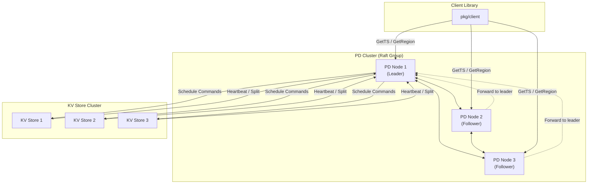
```mermaid
graph TB
    subgraph "PD Cluster (Raft Group)"
        PD1["PD Node 1<br/>(Leader)"]
        PD2["PD Node 2<br/>(Follower)"]
        PD3["PD Node 3<br/>(Follower)"]
        PD1 <--> PD2
        PD1 <--> PD3
        PD2 <--> PD3
    end

    subgraph "KV Store Cluster"
        KVS1["KV Store 1"]
        KVS2["KV Store 2"]
        KVS3["KV Store 3"]
    end

    subgraph "Client Library"
        CLIENT["pkg/client"]
    end

    KVS1 -- "Heartbeat / Split" --> PD1
    KVS2 -- "Heartbeat / Split" --> PD1
    KVS3 -- "Heartbeat / Split" --> PD1

    PD1 -- "Schedule Commands" --> KVS1
    PD1 -- "Schedule Commands" --> KVS2
    PD1 -- "Schedule Commands" --> KVS3

    CLIENT -- "GetTS / GetRegion" --> PD1
    CLIENT -- "GetTS / GetRegion" --> PD2
    CLIENT -- "GetTS / GetRegion" --> PD3

    PD2 -. "Forward to leader" .-> PD1
    PD3 -. "Forward to leader" .-> PD1
```

---

## 3. PD Responsibilities

| Responsibility | Description | Key RPCs |
|---------------|-------------|----------|
| **TSO Allocation** | Provide globally unique, monotonically increasing timestamps | `Tso` (streaming) |
| **Region Metadata** | Store and serve region-to-store mappings | `GetRegion`, `GetRegionByID`, `RegionHeartbeat` |
| **Store Management** | Track store lifecycle (Up/Disconnected/Down/Tombstone) | `PutStore`, `GetStore`, `GetAllStores`, `StoreHeartbeat` |
| **Split Coordination** | Allocate IDs for new regions during splits | `AskBatchSplit`, `ReportBatchSplit` |
| **ID Allocation** | Provide globally unique IDs for stores, regions, and peers | `AllocID` |
| **Scheduling** | Balance regions and leaders across stores | Via `RegionHeartbeat` responses |
| **GC Safe Point** | Track the global GC safe point | `GetGCSafePoint`, `UpdateGCSafePoint` |
| **Cluster Bootstrap** | Initialize the first store and region | `Bootstrap`, `IsBootstrapped` |

---

## 4. PD Server Architecture

### 4.1 PDServer Struct

`PDServer` in `internal/pd/server.go` is the main server struct:

```go
type PDServer struct {
    pdpb.UnimplementedPDServer

    cfg       PDServerConfig
    clusterID uint64

    tso         *TSOAllocator        // timestamp generation
    meta        *MetadataStore       // stores, regions, leaders
    idAlloc     *IDAllocator         // unique ID generator
    gcMgr       *GCSafePointManager  // GC safe point tracking
    scheduler   *Scheduler           // scheduling decisions
    moveTracker *MoveTracker         // multi-step region moves

    grpcServer *grpc.Server
    listener   net.Listener

    // Raft replication (nil in single-node mode)
    raftPeer       *PDRaftPeer
    raftStorage    *PDRaftStorage
    transport      *PDTransport
    tsoBuffer      *TSOBuffer
    idBuffer       *IDBuffer
    // ... forwarding fields ...
}
```

### 4.2 Configuration

```go
type PDServerConfig struct {
    ListenAddr string        // gRPC listen address (default: "0.0.0.0:2379")
    DataDir    string        // data directory (default: "/tmp/gookv-pd")
    ClusterID  uint64        // cluster identifier (default: 1)

    TSOSaveInterval           time.Duration  // TSO persistence interval (default: 3s)
    TSOUpdatePhysicalInterval time.Duration  // physical clock update interval (default: 50ms)
    MaxPeerCount              int            // target replicas per region (default: 3)

    StoreDisconnectDuration time.Duration  // time before store is Disconnected (default: 30s)
    StoreDownDuration       time.Duration  // time before store is Down (default: 30min)

    RegionBalanceThreshold float64  // imbalance threshold (default: 0.05 = 5%)
    RegionBalanceRateLimit int      // max concurrent region moves (default: 4)

    RaftConfig *PDServerRaftConfig  // nil = single-node mode
}
```

### 4.3 Two Operating Modes

PD runs in one of two modes:

**Single-node mode** (when `RaftConfig == nil`):
- All state is stored in memory only.
- Writes are applied directly to the in-memory data structures.
- No high availability; if the PD process crashes, all state is lost.
- Suitable for development and testing.

**Raft-replicated mode** (when `RaftConfig != nil`):
- A single Raft group replicates all PD state across multiple nodes.
- The leader handles all writes by proposing `PDCommand` entries through Raft.
- Followers forward client requests to the leader.
- State is persisted in a dedicated Pebble engine and can be recovered on restart.
- Suitable for production deployments.

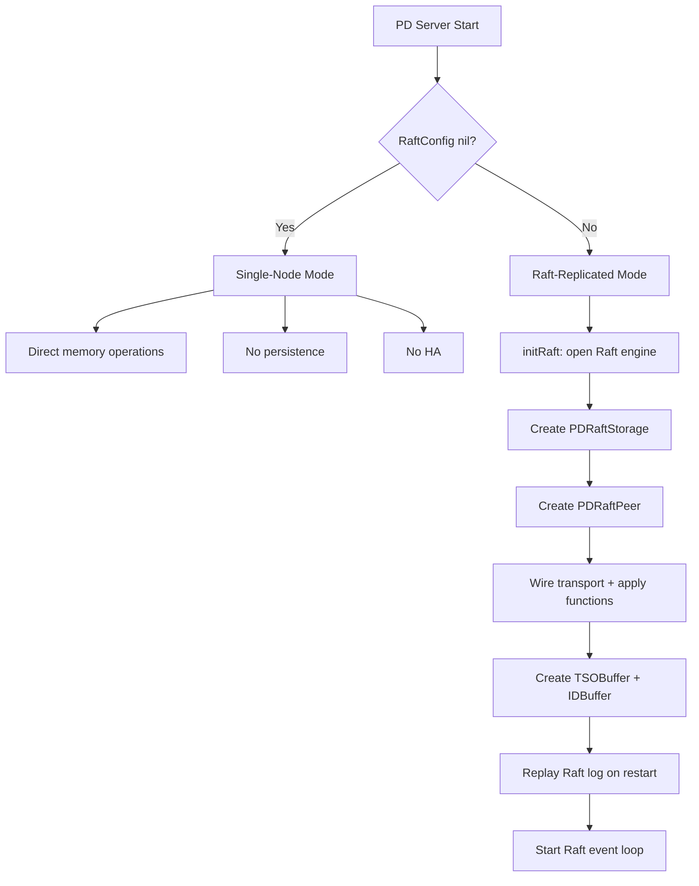
```mermaid
flowchart TD
    A[PD Server Start] --> B{RaftConfig nil?}
    B -->|Yes| C[Single-Node Mode]
    B -->|No| D[Raft-Replicated Mode]

    C --> C1[Direct memory operations]
    C --> C2[No persistence]
    C --> C3[No HA]

    D --> D1[initRaft: open Raft engine]
    D1 --> D2[Create PDRaftStorage]
    D2 --> D3[Create PDRaftPeer]
    D3 --> D4[Wire transport + apply functions]
    D4 --> D5[Create TSOBuffer + IDBuffer]
    D5 --> D6[Replay Raft log on restart]
    D6 --> D7[Start Raft event loop]
```

---

## 5. TSO Allocation

### 5.1 Why Monotonically Increasing Timestamps Matter

gookv uses multi-version concurrency control (MVCC). Every transaction gets a start timestamp and a commit timestamp. The correctness of snapshot isolation depends on one critical property: **if transaction B starts after transaction A commits, then B's start timestamp must be greater than A's commit timestamp**. This means TSO must produce monotonically increasing values.

If timestamps could go backward (e.g., due to clock skew between nodes), a transaction could read stale data or miss committed writes, violating snapshot isolation.

### 5.2 Hybrid Logical Clock

PD timestamps use a hybrid logical clock (HLC) encoding:

```
┌──────────────────────────────────┬────────────────────┐
│       Physical (46 bits)          │   Logical (18 bits) │
│   Milliseconds since Unix epoch   │   Sequence counter  │
└──────────────────────────────────┴────────────────────┘
```

The physical component advances with wall-clock time. The logical component is a sequence counter that increments within the same millisecond, allowing up to 262,144 timestamps per millisecond.

The combined 64-bit value is computed as:

```
uint64 = Physical << 18 | Logical
```

This encoding preserves temporal ordering: comparing two timestamps as unsigned 64-bit integers gives the correct chronological order.

### 5.3 TSOAllocator (Single-Node Mode)

In single-node mode, `TSOAllocator` handles direct allocation:

```go
type TSOAllocator struct {
    mu       sync.Mutex
    physical int64
    logical  int64
}
```

`Allocate(count int)` returns a batch of `count` timestamps:
1. Read the current wall-clock time in milliseconds.
2. If the physical time has advanced, reset logical to 0 and update physical.
3. If the physical time has NOT advanced (same millisecond), increment logical.
4. Add `count` to logical and return the resulting timestamp.
5. If logical exceeds 2^18, wait for the next millisecond.

### 5.4 TSOBuffer (Raft Mode)

In Raft mode, every TSO allocation would require a Raft proposal, which takes at least one round-trip to a quorum of nodes. To avoid this overhead on every `GetTS` call, `TSOBuffer` pre-allocates batches of timestamps:

```go
type TSOBuffer struct {
    mu       sync.Mutex
    physical int64
    logical  int64
    remain   int
    raftPeer *PDRaftPeer
}
```

**Batch size**: 1000 timestamps per Raft proposal.

**Allocation flow**:

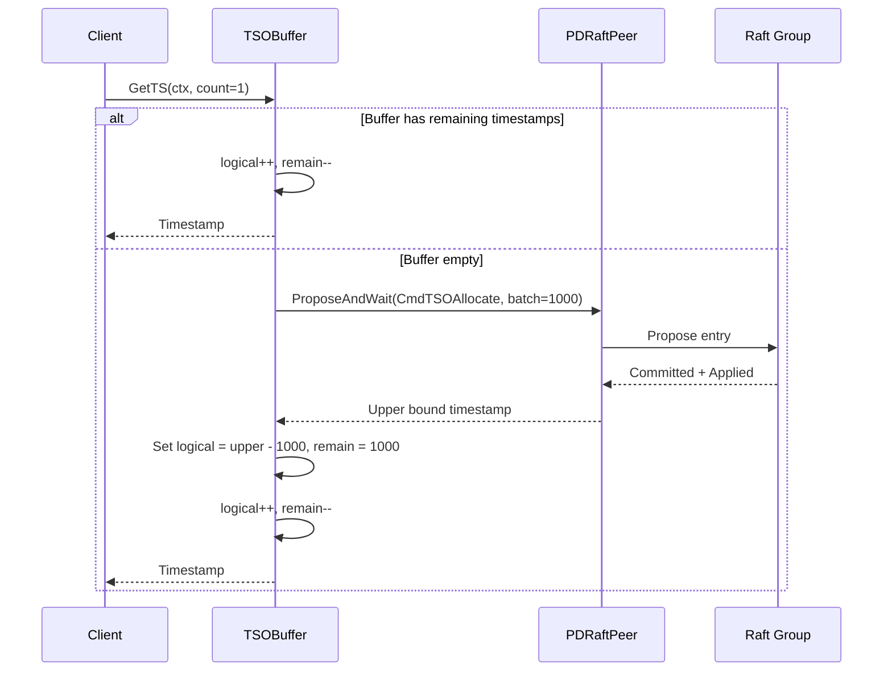
```mermaid
sequenceDiagram
    participant Client
    participant TB as TSOBuffer
    participant RP as PDRaftPeer
    participant Raft as Raft Group

    Client->>TB: GetTS(ctx, count=1)

    alt Buffer has remaining timestamps
        TB->>TB: logical++, remain--
        TB-->>Client: Timestamp
    else Buffer empty
        TB->>RP: ProposeAndWait(CmdTSOAllocate, batch=1000)
        RP->>Raft: Propose entry
        Raft-->>RP: Committed + Applied
        RP-->>TB: Upper bound timestamp
        TB->>TB: Set logical = upper - 1000, remain = 1000
        TB->>TB: logical++, remain--
        TB-->>Client: Timestamp
    end
```

The Raft proposal carries a `CmdTSOAllocate` command with `TSOBatchSize = 1000`. When applied, the `TSOAllocator` advances its state by 1000 timestamps and returns the upper bound. The buffer then serves subsequent requests from the local range `[upper - 999, upper]` without further Raft proposals.

**Leader change handling**: When the PD Raft leader changes, all buffers are reset via `Reset()`. The new leader proposes a fresh batch to ensure timestamps remain monotonically increasing across leader changes. Without this reset, the old leader's buffer might contain timestamps that the new leader has already allocated.

### 5.5 TSO gRPC Handler

The `Tso` handler routes requests based on the operating mode:

```go
func (s *PDServer) Tso(stream pdpb.PD_TsoServer) error {
    if s.raftPeer != nil && !s.raftPeer.IsLeader() {
        return s.forwardTso(stream)   // follower: forward to leader
    }

    for {
        req, err := stream.Recv()
        // ...
        if s.raftPeer == nil {
            ts, _ := s.tso.Allocate(int(count))  // single-node: direct
        } else {
            ts, _ := s.tsoBuffer.GetTS(ctx, int(count))  // leader: buffered
        }
        stream.Send(resp)
    }
}
```

This three-way routing pattern (follower forward / single-node direct / leader buffered) is used consistently across all PD write handlers.

---

## 6. ID Allocation

### 6.1 IDAllocator

`IDAllocator` provides globally unique, monotonically increasing IDs. It is used for allocating store IDs, region IDs, and peer IDs.

```go
type IDAllocator struct {
    mu     sync.Mutex
    nextID uint64
}
```

`Alloc()` returns the next ID and increments the counter. This is the simplest possible allocator -- just an incrementing counter.

### 6.2 IDBuffer (Raft Mode)

Like `TSOBuffer`, `IDBuffer` amortizes the cost of Raft consensus by pre-allocating ID ranges:

```go
type IDBuffer struct {
    mu       sync.Mutex
    nextID   uint64
    endID    uint64   // exclusive upper bound
    raftPeer *PDRaftPeer
}
```

**Batch size**: 100 IDs per Raft proposal.

**Allocation flow**:

1. If `nextID >= endID` (buffer depleted):
   - Propose `CmdIDAlloc` with `IDBatchSize = 100` via Raft.
   - The apply function calls `idAlloc.Alloc()` 100 times and returns the last ID.
   - Set `nextID = lastID - 99`, `endID = lastID + 1`.
2. Return `nextID`, increment `nextID`.

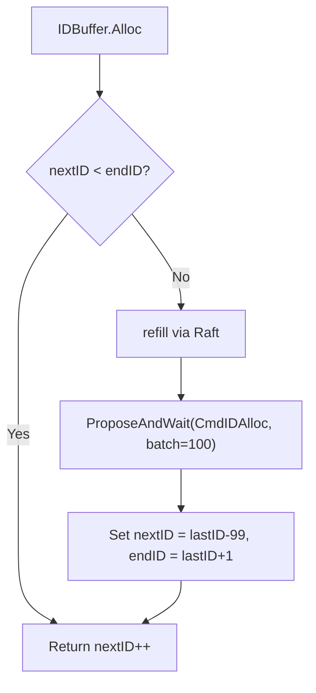
```mermaid
flowchart TD
    A[IDBuffer.Alloc] --> B{nextID < endID?}
    B -->|Yes| C[Return nextID++]
    B -->|No| D[refill via Raft]
    D --> E["ProposeAndWait(CmdIDAlloc, batch=100)"]
    E --> F[Set nextID = lastID-99, endID = lastID+1]
    F --> C
```

Like `TSOBuffer`, `IDBuffer` is reset on leader change to prevent ID conflicts.

---

## 7. Region Management

### 7.1 MetadataStore

`MetadataStore` is the in-memory store for all cluster metadata:

```go
type MetadataStore struct {
    mu           sync.RWMutex
    clusterID    uint64
    bootstrapped bool

    stores       map[uint64]*metapb.Store
    regions      map[uint64]*metapb.Region
    leaders      map[uint64]*metapb.Peer

    storeStats         map[uint64]*pdpb.StoreStats
    storeStates        map[uint64]StoreState
    storeLastHeartbeat map[uint64]time.Time

    disconnectDuration time.Duration
    downDuration       time.Duration
}
```

### 7.2 PutRegion

```go
func (m *MetadataStore) PutRegion(region *metapb.Region, leader *metapb.Peer)
```

Called when a region heartbeat arrives. Stores (or updates) the region metadata and its current leader. The region's `Id` is used as the map key.

### 7.3 GetRegion / GetRegionByKey

**GetRegionByID**: Direct map lookup by region ID.

**GetRegionByKey**: Iterates all regions to find the one whose key range contains the given key. If multiple regions match (stale parent regions after splits), returns the most specific one (the region with the largest start key). This narrowest-match strategy ensures correct routing after splits.

```go
func (m *MetadataStore) GetRegionByKey(key []byte) (*metapb.Region, *metapb.Peer) {
    // Find the region with the largest startKey that still contains key
    var bestRegion *metapb.Region
    var bestLeader *metapb.Peer
    for _, region := range m.regions {
        if keyInRegion(key, region) {
            if bestRegion == nil || bytes.Compare(region.StartKey, bestRegion.StartKey) > 0 {
                bestRegion = region
                bestLeader = m.leaders[region.Id]
            }
        }
    }
    return bestRegion, bestLeader
}
```

### 7.4 Region Heartbeat

Region heartbeats are the primary communication channel from KV stores to PD. Each region leader periodically sends a `RegionHeartbeatRequest` containing:

- `Region`: full region metadata (ID, start/end key, epoch, peers)
- `Leader`: the current leader peer
- `DownPeers`: peers that are unreachable
- `PendingPeers`: peers that are catching up via snapshot
- Traffic statistics: bytes written, keys read, etc.

PD processes each heartbeat by:
1. Storing the region metadata via `PutRegion`.
2. Running the `Scheduler` to decide if any action is needed.
3. Returning a `RegionHeartbeatResponse` with scheduling commands (if any).

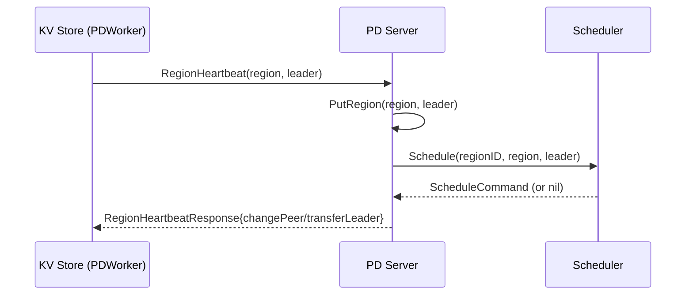
```mermaid
sequenceDiagram
    participant KVS as KV Store (PDWorker)
    participant PD as PD Server
    participant Sched as Scheduler

    KVS->>PD: RegionHeartbeat(region, leader)
    PD->>PD: PutRegion(region, leader)
    PD->>Sched: Schedule(regionID, region, leader)
    Sched-->>PD: ScheduleCommand (or nil)
    PD-->>KVS: RegionHeartbeatResponse{changePeer/transferLeader}
```

---

## 8. Store Management

### 8.1 Store Lifecycle

Each KV store in the cluster goes through a state machine:

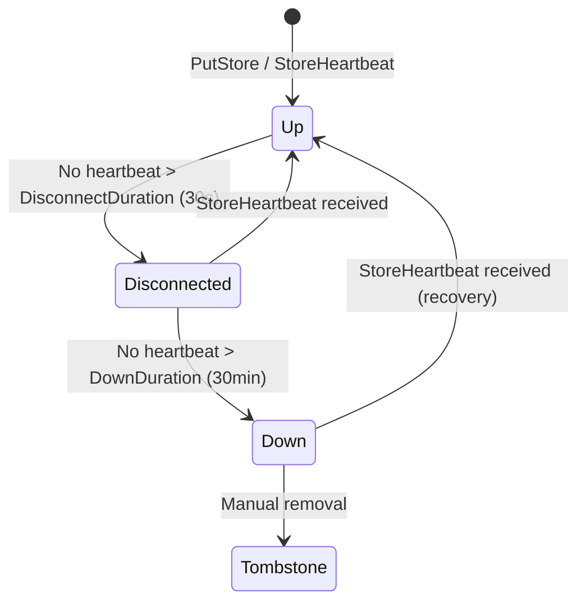
```mermaid
stateDiagram-v2
    [*] --> Up : PutStore / StoreHeartbeat
    Up --> Disconnected : No heartbeat > DisconnectDuration (30s)
    Disconnected --> Up : StoreHeartbeat received
    Disconnected --> Down : No heartbeat > DownDuration (30min)
    Down --> Tombstone : Manual removal
    Down --> Up : StoreHeartbeat received (recovery)
```

| State | Meaning | Scheduling Impact |
|-------|---------|-------------------|
| `Up` | Heartbeat within threshold | Normal: can host new regions |
| `Disconnected` | Missed heartbeats for > 30s | Not schedulable: won't receive new regions, but existing regions not yet considered lost |
| `Down` | Missed heartbeats for > 30min | Regions are repaired: replicas on this store are considered lost and re-created elsewhere |
| `Tombstone` | Permanently removed | Ignored completely |

### 8.2 PutStore

```go
func (s *PDServer) PutStore(ctx context.Context, req *pdpb.PutStoreRequest) (*pdpb.PutStoreResponse, error)
```

Registers or updates a store in PD. Called by KV stores during startup. In Raft mode, the write is proposed via `CmdPutStore`.

### 8.3 GetStore / GetAllStores

Read-only operations that can be served by any PD node (leader or follower) since they read from the local in-memory state which is replicated via Raft.

### 8.4 StoreHeartbeat

```go
func (s *PDServer) StoreHeartbeat(ctx context.Context, req *pdpb.StoreHeartbeatRequest) (*pdpb.StoreHeartbeatResponse, error)
```

Receives periodic heartbeats from KV stores. Each heartbeat updates:
- The store's last heartbeat timestamp (used for state machine transitions).
- The store's stats (capacity, available space, region count, etc.).

### 8.5 Store State Worker

A background goroutine (`runStoreStateWorker`) runs every 10 seconds to:
1. Check each store's last heartbeat timestamp and transition states:
   - `Up` -> `Disconnected` if no heartbeat for > `StoreDisconnectDuration`
   - `Disconnected` -> `Down` if no heartbeat for > `StoreDownDuration`
2. Clean up stale pending moves (moves that have been in progress for > 10 minutes).

---

## 9. Split Coordination

### 9.1 The Split Problem

When a region grows too large (measured by data size or key count), it needs to be split into two smaller regions. The split requires coordination with PD because:
1. New regions need globally unique IDs.
2. New peers need globally unique IDs.
3. PD needs to know about the new regions for routing and scheduling.

### 9.2 AskBatchSplit

```go
func (s *PDServer) AskBatchSplit(ctx context.Context, req *pdpb.AskBatchSplitRequest) (*pdpb.AskBatchSplitResponse, error)
```

Called by a KV store when it detects a region needs splitting. PD allocates:
- A new region ID for each split.
- A set of new peer IDs (one per store in the cluster, up to `MaxPeerCount`).

The response contains `SplitID` entries, each with `NewRegionId` and `NewPeerIds`.

### 9.3 ReportBatchSplit

```go
func (s *PDServer) ReportBatchSplit(ctx context.Context, req *pdpb.ReportBatchSplitRequest) (*pdpb.ReportBatchSplitResponse, error)
```

Called by the KV store after the split is complete. PD registers the new regions via `PutRegion`.

### 9.4 Split Flow

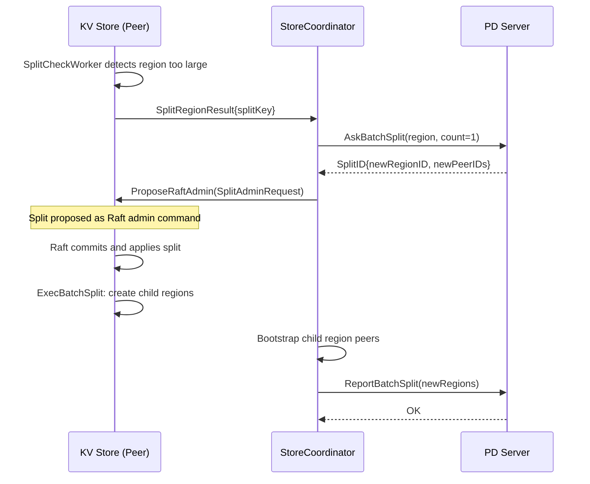
```mermaid
sequenceDiagram
    participant Peer as KV Store (Peer)
    participant Coord as StoreCoordinator
    participant PD as PD Server

    Peer->>Peer: SplitCheckWorker detects region too large
    Peer->>Coord: SplitRegionResult{splitKey}
    Coord->>PD: AskBatchSplit(region, count=1)
    PD-->>Coord: SplitID{newRegionID, newPeerIDs}
    Coord->>Peer: ProposeRaftAdmin(SplitAdminRequest)
    Note over Peer: Split proposed as Raft admin command
    Peer->>Peer: Raft commits and applies split
    Peer->>Peer: ExecBatchSplit: create child regions
    Coord->>Coord: Bootstrap child region peers
    Coord->>PD: ReportBatchSplit(newRegions)
    PD-->>Coord: OK
```

The split is executed as a Raft admin command (tag byte `0x02` in the Raft log), ensuring strict ordering between data entries and split operations. This eliminates race conditions where data writes could be applied to the wrong region during a split.

---

## 10. Scheduler

### 10.1 Purpose

The `Scheduler` analyzes cluster state on every region heartbeat and produces scheduling commands to maintain three invariants:

1. **Replica count**: Every region has exactly `MaxPeerCount` replicas (default: 3).
2. **Leader balance**: Leaders are evenly distributed across stores.
3. **Region balance**: Regions are evenly distributed across stores.

### 10.2 Scheduler Struct

```go
type Scheduler struct {
    meta                   *MetadataStore
    idAlloc                *IDAllocator
    maxPeerCount           int
    regionBalanceThreshold float64  // imbalance threshold (default: 5%)
    regionBalanceRateLimit int      // max concurrent moves (default: 4)
    moveTracker            MoveTrackerInterface
}
```

### 10.3 Schedule: Priority-Based Evaluation

```go
func (s *Scheduler) Schedule(regionID uint64, region *metapb.Region, leader *metapb.Peer) *ScheduleCommand
```

Each heartbeat triggers a priority-ordered evaluation. The first strategy that produces a command wins:

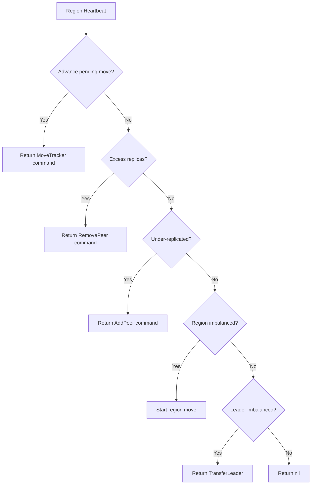
```mermaid
flowchart TD
    A[Region Heartbeat] --> B{Advance pending move?}
    B -->|Yes| C[Return MoveTracker command]
    B -->|No| D{Excess replicas?}
    D -->|Yes| E[Return RemovePeer command]
    D -->|No| F{Under-replicated?}
    F -->|Yes| G[Return AddPeer command]
    F -->|No| H{Region imbalanced?}
    H -->|Yes| I[Start region move]
    H -->|No| J{Leader imbalanced?}
    J -->|Yes| K[Return TransferLeader]
    J -->|No| L[Return nil]
```

### 10.4 scheduleReplicaRepair: Ensuring Replica Count

```go
func (s *Scheduler) scheduleReplicaRepair(regionID uint64, region *metapb.Region) *ScheduleCommand
```

Checks if a region has fewer healthy replicas than `maxPeerCount`. A peer is healthy if its store is `Up` or `Disconnected` (but not `Down` or `Tombstone`).

If the region is under-replicated:
1. Find a schedulable store that does not already host this region.
2. Allocate a new peer ID.
3. Return an `AddNode` ChangePeer command.

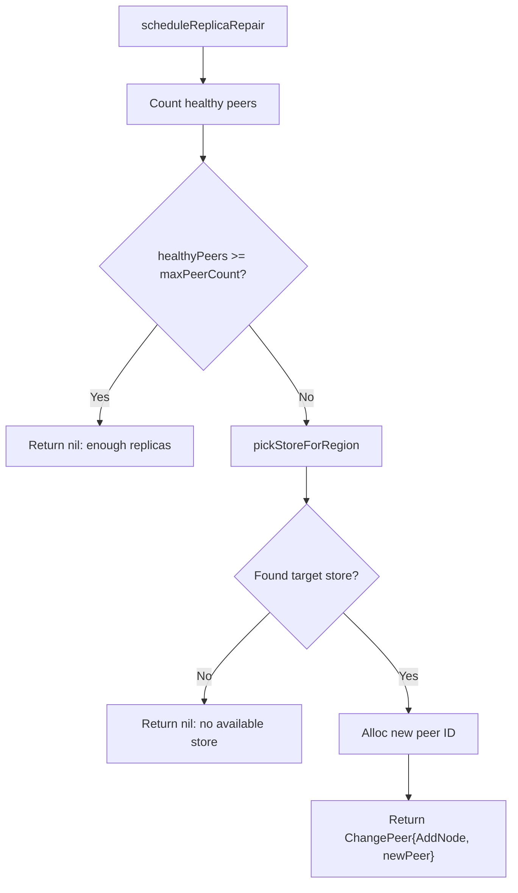
```mermaid
flowchart TD
    A[scheduleReplicaRepair] --> B[Count healthy peers]
    B --> C{healthyPeers >= maxPeerCount?}
    C -->|Yes| D[Return nil: enough replicas]
    C -->|No| E[pickStoreForRegion]
    E --> F{Found target store?}
    F -->|No| G[Return nil: no available store]
    F -->|Yes| H[Alloc new peer ID]
    H --> I["Return ChangePeer{AddNode, newPeer}"]
```

### 10.5 scheduleLeaderBalance: Distributing Leaders

```go
func (s *Scheduler) scheduleLeaderBalance(regionID uint64, region *metapb.Region, leader *metapb.Peer) *ScheduleCommand
```

Leaders generate more work than followers (they handle all reads and writes). Distributing leaders evenly across stores prevents hotspots.

Algorithm:
1. Get the leader count per store.
2. Find the store with the minimum leaders among this region's peers.
3. If the difference between the current leader's count and the minimum count is > 1, transfer the leader.

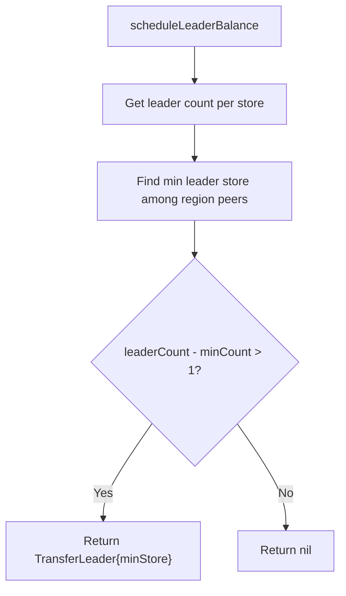
```mermaid
flowchart TD
    A[scheduleLeaderBalance] --> B[Get leader count per store]
    B --> C[Find min leader store among region peers]
    C --> D{leaderCount - minCount > 1?}
    D -->|Yes| E["Return TransferLeader{minStore}"]
    D -->|No| F[Return nil]
```

### 10.6 scheduleExcessReplicaShedding: Removing Extra Replicas

```go
func (s *Scheduler) scheduleExcessReplicaShedding(regionID uint64, region *metapb.Region) *ScheduleCommand
```

After adding a new replica (e.g., during region balance), the region temporarily has more peers than `maxPeerCount`. This strategy removes the excess peer on the store with the highest region count.

Algorithm:
1. If `len(peers) <= maxPeerCount`, return nil.
2. Get region count per store.
3. Find the peer on the store with the most regions.
4. Return a `RemoveNode` ChangePeer command for that peer.

### 10.7 scheduleRegionBalance: Moving Regions Between Stores

```go
func (s *Scheduler) scheduleRegionBalance(regionID uint64, region *metapb.Region, leader *metapb.Peer) *ScheduleCommand
```

This is the most complex scheduling strategy. It detects when a store is overloaded (has significantly more regions than average) and moves a region to an underloaded store.

Algorithm:
1. **Rate limit check**: If the number of active moves >= `regionBalanceRateLimit` (default: 4), skip.
2. **Pending move check**: If this region already has a pending move, skip.
3. **Compute mean**: Calculate the average region count across all schedulable stores.
4. **Overload detection**: Check if any of the region's peer stores has a region count > `mean * (1 + threshold)`.
5. **Target selection**: Find a schedulable store NOT already hosting this region with region count < `mean * (1 - threshold)`.
6. **Start move**: Allocate a new peer ID and begin tracking the move via `MoveTracker`.
7. **Return AddNode**: The first step of a multi-step move is always AddNode.

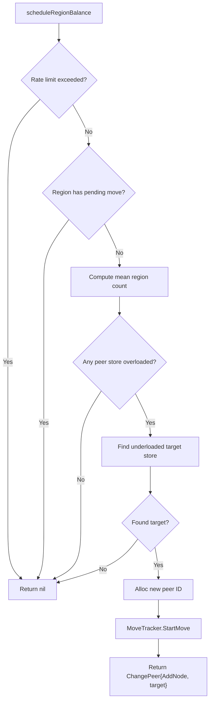
```mermaid
flowchart TD
    A[scheduleRegionBalance] --> B{Rate limit exceeded?}
    B -->|Yes| Z[Return nil]
    B -->|No| C{Region has pending move?}
    C -->|Yes| Z
    C -->|No| D[Compute mean region count]
    D --> E{Any peer store overloaded?}
    E -->|No| Z
    E -->|Yes| F[Find underloaded target store]
    F --> G{Found target?}
    G -->|No| Z
    G -->|Yes| H[Alloc new peer ID]
    H --> I[MoveTracker.StartMove]
    I --> J["Return ChangePeer{AddNode, target}"]
```

---

## 11. MoveTracker: Multi-Step Region Moves

### 11.1 The Problem with Simple Moves

Moving a region from store A to store B cannot be done atomically. If we remove the peer on A before the peer on B is ready, we lose a replica. If A is the leader, we also lose availability. The move must be a carefully orchestrated multi-step process.

### 11.2 Three-Phase Move Protocol

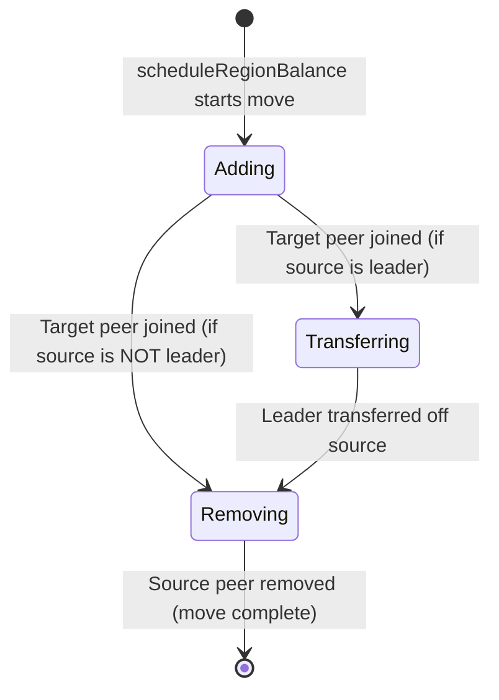
```mermaid
stateDiagram-v2
    [*] --> Adding : scheduleRegionBalance starts move
    Adding --> Transferring : Target peer joined (if source is leader)
    Adding --> Removing : Target peer joined (if source is NOT leader)
    Transferring --> Removing : Leader transferred off source
    Removing --> [*] : Source peer removed (move complete)
```

The three phases:

**Phase 1: Adding** (`MoveStateAdding`)
- PD returns an `AddNode` ChangePeer command.
- The KV store adds a new peer on the target store.
- On the next heartbeat, `MoveTracker.Advance` checks if the target store now has a peer in the region.

**Phase 2: Transferring** (`MoveStateTransferring`)
- Only entered if the source peer is the leader.
- PD returns a `TransferLeader` command to move leadership to another peer.
- On the next heartbeat, `Advance` checks if the leader has moved off the source store.
- If there is no suitable transfer target, this phase is skipped and we go directly to Removing.

**Phase 3: Removing** (`MoveStateRemoving`)
- PD returns a `RemoveNode` ChangePeer command for the source peer.
- On the next heartbeat, `Advance` checks if the source peer is gone from the region.
- If the source peer is still present, the `RemoveNode` command is retried.
- When the source peer is finally gone, the move is complete and removed from the tracker.

### 11.3 MoveTracker Struct

```go
type MoveTracker struct {
    mu    sync.Mutex
    moves map[uint64]*PendingMove  // regionID -> pending move
}

type PendingMove struct {
    RegionID      uint64
    SourcePeer    *metapb.Peer
    TargetStoreID uint64
    TargetPeerID  uint64
    State         MoveState
    StartedAt     time.Time
}
```

### 11.4 Advance: State Machine Progression

```go
func (t *MoveTracker) Advance(regionID uint64, region *metapb.Region, leader *metapb.Peer) *ScheduleCommand
```

Called on every heartbeat for regions with pending moves. The logic for each state:

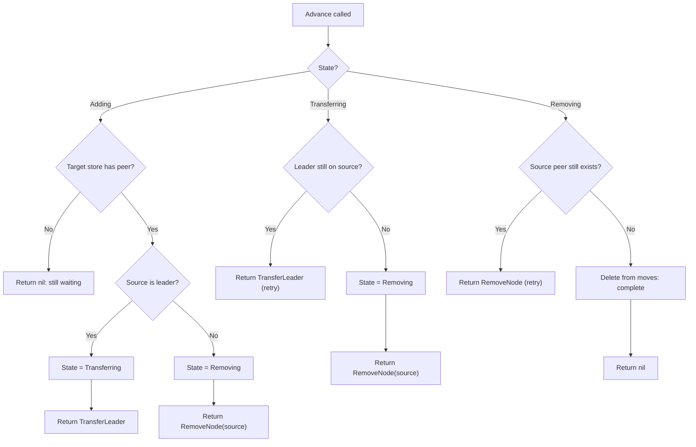
```mermaid
flowchart TD
    A[Advance called] --> B{State?}

    B -->|Adding| C{Target store has peer?}
    C -->|No| D[Return nil: still waiting]
    C -->|Yes| E{Source is leader?}
    E -->|Yes| F[State = Transferring]
    F --> G["Return TransferLeader"]
    E -->|No| H[State = Removing]
    H --> I["Return RemoveNode(source)"]

    B -->|Transferring| J{Leader still on source?}
    J -->|Yes| K["Return TransferLeader (retry)"]
    J -->|No| L[State = Removing]
    L --> M["Return RemoveNode(source)"]

    B -->|Removing| N{Source peer still exists?}
    N -->|Yes| O["Return RemoveNode (retry)"]
    N -->|No| P[Delete from moves: complete]
    P --> Q[Return nil]
```

### 11.5 Stale Move Cleanup

Moves that take longer than 10 minutes are automatically cleaned up by `CleanupStale`, called from the `runStoreStateWorker` goroutine. This prevents indefinitely stuck moves.

---

## 12. PD Raft Replication

### 12.1 Why Replicate PD?

In single-node mode, PD is a single point of failure. If the PD process crashes:
- No timestamps can be allocated, halting all transactions.
- No region metadata is available, halting all client requests.
- No scheduling commands are issued, degrading cluster health.

Raft replication provides high availability: any PD node can fail, and the remaining majority continues operating.

### 12.2 Single Raft Group

Unlike KV stores (which have one Raft group per region), PD uses a **single Raft group** for its entire state. This is appropriate because:
- PD state is relatively small (metadata for stores, regions, and a few allocators).
- PD write throughput is modest (heartbeats, occasional splits).
- Simplicity: one Raft group is much easier to reason about than multiple.

### 12.3 Architecture

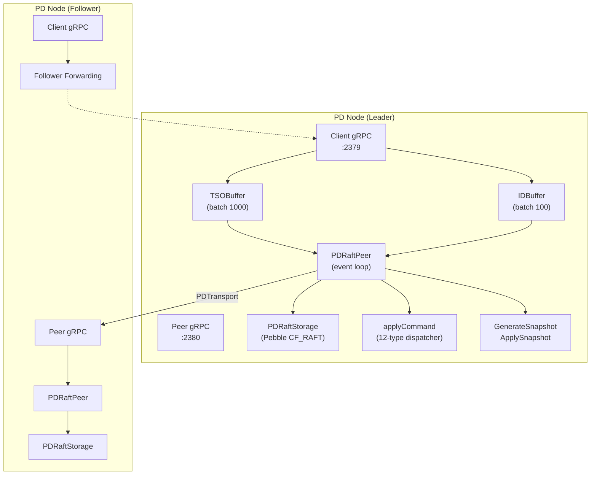
```mermaid
graph TB
    subgraph "PD Node (Leader)"
        CG["Client gRPC<br/>:2379"]
        PG["Peer gRPC<br/>:2380"]
        RP["PDRaftPeer<br/>(event loop)"]
        RS["PDRaftStorage<br/>(Pebble CF_RAFT)"]
        TB["TSOBuffer<br/>(batch 1000)"]
        IB["IDBuffer<br/>(batch 100)"]
        AP["applyCommand<br/>(12-type dispatcher)"]
        SN["GenerateSnapshot<br/>ApplySnapshot"]

        CG --> TB --> RP
        CG --> IB --> RP
        RP --> AP
        RP --> RS
        RP --> SN
    end

    subgraph "PD Node (Follower)"
        CG2["Client gRPC"]
        PG2["Peer gRPC"]
        RP2["PDRaftPeer"]
        RS2["PDRaftStorage"]
        FW["Follower Forwarding"]

        CG2 --> FW
        FW -.-> CG
        PG2 --> RP2
        RP2 --> RS2
    end

    RP -- "PDTransport" --> PG2
```

### 12.4 PDRaftPeer

`PDRaftPeer` (`internal/pd/raft_peer.go`) manages a single Raft node in the PD cluster:

```go
type PDRaftPeer struct {
    nodeID    uint64
    rawNode   *raft.RawNode
    storage   *PDRaftStorage
    peerAddrs map[uint64]string

    Mailbox chan PDRaftMsg

    sendFunc         func([]raftpb.Message)
    pendingProposals map[uint64]func([]byte, error)
    applyFunc        func(PDCommand) ([]byte, error)
    applySnapshotFunc func([]byte) error
    leaderChangeFunc  func(bool)
    // ...
}
```

The event loop (`Run`) processes:
- **Raft ticks** (100ms interval): drives leader election and heartbeats.
- **Mailbox messages**: incoming Raft messages from other peers and proposals from gRPC handlers.
- **Ready results**: committed entries to apply, messages to send, snapshots to process.
- **Log GC ticks** (60s interval): triggers Raft log compaction.

### 12.5 PDRaftStorage

`PDRaftStorage` (`internal/pd/raft_storage.go`) implements `raft.Storage` for the PD Raft group:

```go
type PDRaftStorage struct {
    clusterID          uint64
    engine             traits.KvEngine   // dedicated Pebble engine
    hardState          raftpb.HardState
    applyState         raftstore.ApplyState
    entries            []raftpb.Entry     // in-memory entry cache
    persistedLastIndex uint64

    snapGenFunc func() ([]byte, error)
}
```

It is modeled on `PeerStorage` from `internal/raftstore/storage.go` but simplified:
- Uses `clusterID` instead of `regionID` as the key namespace.
- No region epoch management.
- No configuration change tracking.

The Raft log entries are stored in `CF_RAFT` of a dedicated Pebble engine (separate from the KV data engine). HardState and ApplyState are also persisted in `CF_RAFT`.

### 12.6 PDCommand Types

All PD state mutations are encoded as `PDCommand` entries in the Raft log. There are 12 command types:

| Constant | Value | Purpose | Target Component |
|----------|-------|---------|-----------------|
| `CmdSetBootstrapped` | 1 | Mark cluster as bootstrapped | MetadataStore |
| `CmdPutStore` | 2 | Register or update a store | MetadataStore |
| `CmdPutRegion` | 3 | Store or update region metadata | MetadataStore |
| `CmdUpdateStoreStats` | 4 | Update store health statistics | MetadataStore |
| `CmdSetStoreState` | 5 | Change store lifecycle state | MetadataStore |
| `CmdTSOAllocate` | 6 | Allocate a batch of timestamps | TSOAllocator |
| `CmdIDAlloc` | 7 | Allocate a batch of IDs | IDAllocator |
| `CmdUpdateGCSafePoint` | 8 | Advance the GC safe point | GCSafePointManager |
| `CmdStartMove` | 9 | Begin tracking a region move | MoveTracker |
| `CmdAdvanceMove` | 10 | Advance a region move's state | MoveTracker |
| `CmdCleanupStaleMove` | 11 | Remove timed-out moves | MoveTracker |
| `CmdCompactLog` | 12 | Compact Raft log entries | PDRaftStorage |

### 12.7 Wire Format

Each `PDCommand` is serialized as:

```
┌──────────┬──────────────────────┐
│ Type (1B) │ JSON Payload (N bytes)│
└──────────┴──────────────────────┘
```

The 1-byte type prefix allows fast command identification without parsing the JSON. The JSON payload contains only the fields relevant to that command type (using `omitempty` tags).

### 12.8 Apply: State Machine Dispatcher

`applyCommand` in `internal/pd/apply.go` is a switch statement over all 12 command types:

```go
func (s *PDServer) applyCommand(cmd PDCommand) ([]byte, error) {
    switch cmd.Type {
    case CmdSetBootstrapped:
        s.meta.SetBootstrapped(*cmd.Bootstrapped)
        return nil, nil
    case CmdPutStore:
        s.meta.PutStore(cmd.Store)
        return nil, nil
    case CmdTSOAllocate:
        ts, err := s.tso.Allocate(cmd.TSOBatchSize)
        data, _ := json.Marshal(ts)
        return data, err
    case CmdIDAlloc:
        var id uint64
        for i := 0; i < cmd.IDBatchSize; i++ {
            id = s.idAlloc.Alloc()
        }
        buf := make([]byte, 8)
        binary.BigEndian.PutUint64(buf, id)
        return buf, nil
    case CmdCompactLog:
        // Update apply state, compact entries, background delete
        // ...
    // ... 8 more cases ...
    }
}
```

Commands that produce results (TSO allocation, ID allocation, GC safe point update) return a byte slice that is delivered to the original proposer via the `pendingProposals` callback.

### 12.9 Snapshot: Full-State Transfer

When a PD follower falls too far behind, the leader sends a snapshot containing the entire PD state.

**GenerateSnapshot** (`internal/pd/snapshot.go`):

```go
type PDSnapshot struct {
    Bootstrapped bool
    Stores       map[uint64]*metapb.Store
    Regions      map[uint64]*metapb.Region
    Leaders      map[uint64]*metapb.Peer
    StoreStats   map[uint64]*pdpb.StoreStats
    StoreStates  map[uint64]StoreState
    NextID       uint64
    TSOState     TSOSnapshotState
    GCSafePoint  uint64
    PendingMoves map[uint64]*PendingMove
}
```

`GenerateSnapshot` acquires read locks on all sub-components, deep-copies their state into a `PDSnapshot` struct, and JSON-encodes it.

**ApplySnapshot** deserializes the JSON and replaces the in-memory state of all sub-components. It acquires write locks on each component and sets all fields.

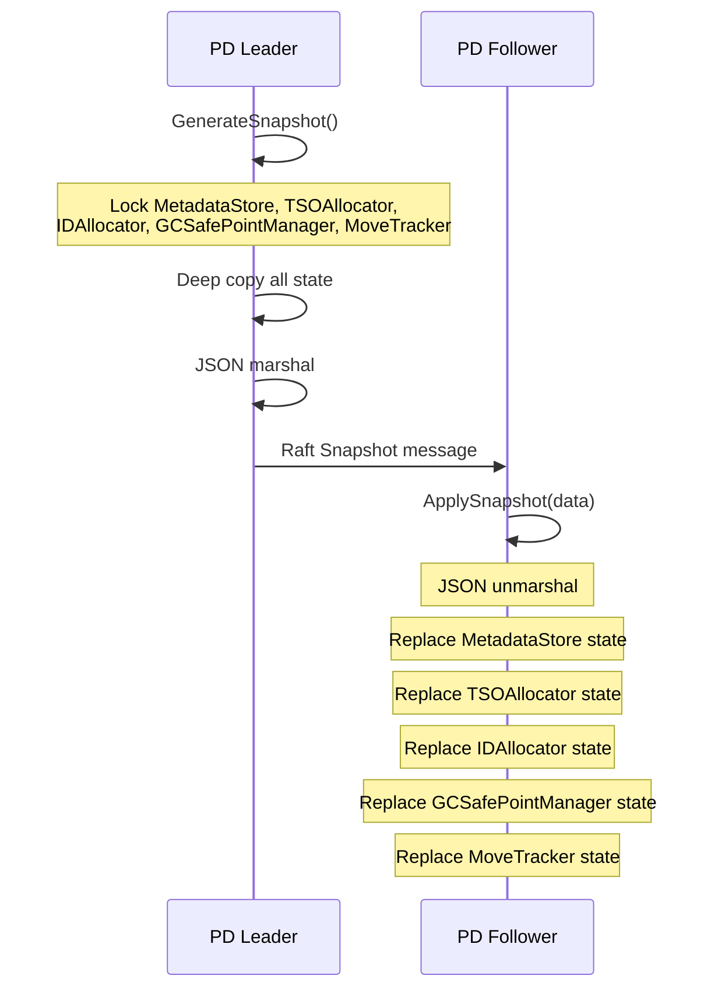
```mermaid
sequenceDiagram
    participant Leader as PD Leader
    participant Follower as PD Follower

    Leader->>Leader: GenerateSnapshot()
    Note over Leader: Lock MetadataStore, TSOAllocator,<br/>IDAllocator, GCSafePointManager, MoveTracker
    Leader->>Leader: Deep copy all state
    Leader->>Leader: JSON marshal
    Leader->>Follower: Raft Snapshot message

    Follower->>Follower: ApplySnapshot(data)
    Note over Follower: JSON unmarshal
    Note over Follower: Replace MetadataStore state
    Note over Follower: Replace TSOAllocator state
    Note over Follower: Replace IDAllocator state
    Note over Follower: Replace GCSafePointManager state
    Note over Follower: Replace MoveTracker state
```

### 12.10 PDTransport

`PDTransport` (`internal/pd/transport.go`) manages gRPC connections to other PD peers:

```go
type PDTransport struct {
    mu    sync.RWMutex
    conns map[uint64]*grpc.ClientConn  // peerID -> connection
    addrs map[uint64]string            // peerID -> peer address
}
```

Connections are lazy: created on first message to a peer. Messages are converted from `raftpb.Message` (used by the etcd Raft library) to `eraftpb.Message` (used by the kvproto wire format) before sending.

### 12.11 PDPeerService

`PDPeerService` (`internal/pd/peer_service.go`) handles incoming Raft messages from other PD peers. It is a hand-coded gRPC service (not auto-generated from proto) that implements a single unary RPC:

```go
func (s *PDPeerService) SendPDRaftMessage(ctx context.Context, req *raft_serverpb.RaftMessage) (*raft_serverpb.RaftMessage, error)
```

This converts the incoming `eraftpb.Message` to `raftpb.Message` and delivers it to the local peer's mailbox channel. The peer gRPC server listens on a separate port from the client gRPC server.

### 12.12 Follower Forwarding

When a follower receives a write request, it transparently forwards it to the current leader. The forwarding layer (`internal/pd/forward.go`) handles:

**7 Unary RPCs:**
- `Bootstrap`
- `PutStore`
- `AllocID`
- `StoreHeartbeat`
- `AskBatchSplit`
- `ReportBatchSplit`
- `UpdateGCSafePoint`

**2 Streaming RPCs:**
- `Tso` (bidirectional)
- `RegionHeartbeat` (bidirectional)

The follower maintains a cached gRPC connection to the current leader:

```go
func (s *PDServer) getLeaderClient() (pdpb.PDClient, error) {
    leaderID := s.raftPeer.LeaderID()
    // Reuse cached connection if leader hasn't changed
    if s.cachedLeaderConn != nil && s.cachedLeaderID == leaderID {
        return pdpb.NewPDClient(s.cachedLeaderConn), nil
    }
    // Leader changed: close old connection, dial new leader
    addr := s.raftCfg.ClientAddrs[leaderID]
    conn, _ := grpc.Dial(addr, ...)
    s.cachedLeaderConn = conn
    s.cachedLeaderID = leaderID
    return pdpb.NewPDClient(conn), nil
}
```

Read-only RPCs (`GetRegion`, `GetRegionByID`, `GetStore`, `GetAllStores`, `IsBootstrapped`, `GetMembers`, `GetGCSafePoint`) are served locally by all nodes since the Raft-replicated state is eventually consistent for reads.

### 12.13 Three-Way RPC Routing

Every PD write handler follows the same three-way routing pattern:

```go
func (s *PDServer) SomeWriteRPC(ctx context.Context, req *Request) (*Response, error) {
    if s.raftPeer == nil {
        // Single-node mode: apply directly
        return s.applyDirectly(req)
    }
    if !s.raftPeer.IsLeader() {
        // Follower: forward to leader
        return s.forwardSomeWriteRPC(ctx, req)
    }
    // Leader: propose via Raft
    cmd := PDCommand{Type: CmdXxx, ...}
    result, err := s.raftPeer.ProposeAndWait(ctx, cmd)
    return buildResponse(result), err
}
```

### 12.14 Startup and Recovery

**Fresh start** (no persisted state):
1. Open a dedicated Pebble engine for Raft logs.
2. Build peer list from `InitialCluster`.
3. Create `PDRaftPeer` with bootstrap peers (triggers Raft election).
4. Wire transport, apply functions, and buffered allocators.
5. Start the Raft event loop and peer gRPC server.

**Restart** (persisted state exists):
1. Open the existing Pebble engine.
2. Recover Raft storage from engine (load HardState, ApplyState, entries).
3. Create `PDRaftPeer` without bootstrap peers (resumes from persisted state).
4. Wire transport, apply functions, and buffered allocators.
5. **Replay Raft log**: apply all committed entries from `appliedIndex + 1` to `lastIndex` to rebuild in-memory state.
6. Start the Raft event loop and peer gRPC server.

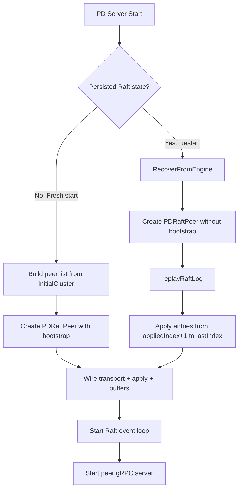
```mermaid
flowchart TD
    A[PD Server Start] --> B{Persisted Raft state?}
    B -->|No: Fresh start| C[Build peer list from InitialCluster]
    C --> D[Create PDRaftPeer with bootstrap]
    B -->|Yes: Restart| E[RecoverFromEngine]
    E --> F[Create PDRaftPeer without bootstrap]
    F --> G[replayRaftLog]
    G --> H[Apply entries from appliedIndex+1 to lastIndex]
    D --> I[Wire transport + apply + buffers]
    H --> I
    I --> J[Start Raft event loop]
    J --> K[Start peer gRPC server]
```

---

## 13. Dynamic Node Addition

### 13.1 Join Mode

New KV store nodes can join an existing cluster without knowing the full cluster topology in advance. The node only needs the PD endpoints:

```bash
gookv-server --pd-endpoints "pd1:2379,pd2:2379,pd3:2379" --addr "0.0.0.0:20163" --data-dir /data/kvs4
```

### 13.2 Join Flow

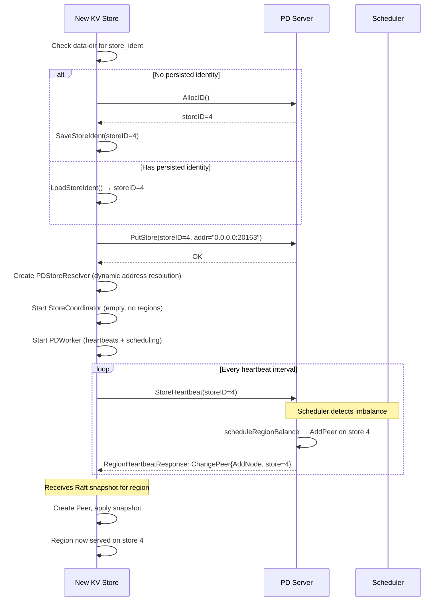
```mermaid
sequenceDiagram
    participant New as New KV Store
    participant PD as PD Server
    participant Sched as Scheduler

    New->>New: Check data-dir for store_ident
    alt No persisted identity
        New->>PD: AllocID()
        PD-->>New: storeID=4
        New->>New: SaveStoreIdent(storeID=4)
    else Has persisted identity
        New->>New: LoadStoreIdent() → storeID=4
    end

    New->>PD: PutStore(storeID=4, addr="0.0.0.0:20163")
    PD-->>New: OK

    New->>New: Create PDStoreResolver (dynamic address resolution)
    New->>New: Start StoreCoordinator (empty, no regions)
    New->>New: Start PDWorker (heartbeats + scheduling)

    loop Every heartbeat interval
        New->>PD: StoreHeartbeat(storeID=4)
        Note over PD,Sched: Scheduler detects imbalance
        PD->>PD: scheduleRegionBalance → AddPeer on store 4
        PD-->>New: RegionHeartbeatResponse: ChangePeer{AddNode, store=4}
    end

    Note over New: Receives Raft snapshot for region
    New->>New: Create Peer, apply snapshot
    New->>New: Region now served on store 4
```

### 13.3 Store Identity Persistence

`StoreIdent` (`internal/server/store_ident.go`) manages the mapping between a node's data directory and its cluster identity:

```go
func SaveStoreIdent(dataDir string, storeID uint64, clusterID uint64) error
func LoadStoreIdent(dataDir string) (storeID uint64, clusterID uint64, err error)
```

The identity is persisted to a file in the data directory. On restart, the node loads its store ID from this file instead of allocating a new one from PD.

### 13.4 PDStoreResolver

In join mode, the node does not have a static cluster map. Instead, `PDStoreResolver` (`internal/server/pd_resolver.go`) resolves peer store addresses dynamically from PD:

```go
type PDStoreResolver struct {
    pdClient pdclient.Client
    ttl      time.Duration
    cache    map[uint64]resolvedStore
}
```

When the Raft transport needs to send a message to a peer on another store, it calls `Resolve(storeID)` which queries PD for the store's address. The result is cached with a TTL.

---

## 14. PD Client

### 14.1 Client Interface

The `pdclient.Client` interface (`pkg/pdclient/client.go`) defines 16 methods:

| Method | Type | Description |
|--------|------|-------------|
| `GetTS` | Streaming | Allocate a globally unique timestamp |
| `GetRegion` | Unary | Look up region by key |
| `GetRegionByID` | Unary | Look up region by ID |
| `GetStore` | Unary | Get store metadata |
| `GetAllStores` | Unary | Get all stores |
| `Bootstrap` | Unary | Initialize cluster |
| `IsBootstrapped` | Unary | Check bootstrap status |
| `PutStore` | Unary | Register/update store |
| `AllocID` | Unary | Allocate unique ID |
| `ReportRegionHeartbeat` | Streaming | Send region heartbeat |
| `StoreHeartbeat` | Unary | Send store heartbeat |
| `AskBatchSplit` | Unary | Request split IDs |
| `ReportBatchSplit` | Unary | Report split completion |
| `GetGCSafePoint` | Unary | Get GC safe point |
| `UpdateGCSafePoint` | Unary | Update GC safe point |
| `GetClusterID` | Local | Return cached cluster ID |
| `Close` | Local | Shutdown client |

### 14.2 Connection Management

The `grpcClient` implementation maintains a single gRPC connection to one PD endpoint:

```go
type grpcClient struct {
    conn        *grpc.ClientConn
    client      pdpb.PDClient
    endpoints   []string
    currentIdx  int
    clusterID   uint64
}
```

**Multi-endpoint failover**: On connection failure, `reconnect` closes the current connection and dials the next endpoint in round-robin order. All endpoints are tried once before giving up.

**Leader discovery**: After connecting, `discoverLeader` calls `GetMembers` to find the current PD leader. If the connected node is not the leader, the client disconnects and reconnects to the leader's address. This ensures the client always talks to the PD leader for write operations.

**Retry logic**: All RPC calls are wrapped with `withRetry` which retries failed operations with a configurable interval (default: 500ms) and count (default: 3).

### 14.3 TSO Protocol

`GetTS` opens a bidirectional `Tso` stream, sends a single `TsoRequest{Count: 1}`, and receives the response. The response contains `Physical` (milliseconds) and `Logical` (sequence number), which are composed into a `pdclient.TimeStamp`:

```go
type TimeStamp struct {
    Physical int64
    Logical  int64
}

func (ts TimeStamp) ToUint64() uint64 {
    return uint64(ts.Physical)<<18 | uint64(ts.Logical)
}
```

This is then cast to `txntypes.TimeStamp` (which is simply `uint64`) for use in the MVCC layer.

---

## 15. GC Safe Point Management

### 15.1 Purpose

The GC safe point tracks the oldest timestamp that any active transaction might still need to read. Data versions older than this timestamp can be safely garbage collected.

### 15.2 GCSafePointManager

```go
type GCSafePointManager struct {
    mu        sync.Mutex
    safePoint uint64
}
```

`UpdateSafePoint(newSP uint64) uint64`: Advances the safe point forward only (max of current and new). Returns the resulting safe point.

`GetSafePoint() uint64`: Returns the current safe point.

### 15.3 Integration with KV Stores

After a KV store's `GCWorker` completes a GC run, it reports the new safe point to PD via `UpdateGCSafePoint`. PD takes the maximum of all reported safe points. Other stores can then query `GetGCSafePoint` to know how far they can safely GC.

---

## 16. PDWorker: KV Store to PD Bridge

### 16.1 Purpose

`PDWorker` (`internal/server/pd_worker.go`) bridges KV store peers with PD. It runs as a background goroutine in each KV store process.

### 16.2 Responsibilities

1. **Store heartbeat loop**: Periodically sends `StoreHeartbeat` to PD with the store's statistics.
2. **Region heartbeat forwarding**: When a Peer sends a region heartbeat task (via the shared `pdTaskCh` channel), PDWorker forwards it to PD via `ReportRegionHeartbeat`.
3. **Scheduling command delivery**: When a `RegionHeartbeatResponse` contains scheduling commands (TransferLeader, ChangePeer, Merge), PDWorker delivers them to the appropriate Peer via the router.
4. **Split reporting**: After a split completes, PDWorker sends `ReportBatchSplit` to PD.

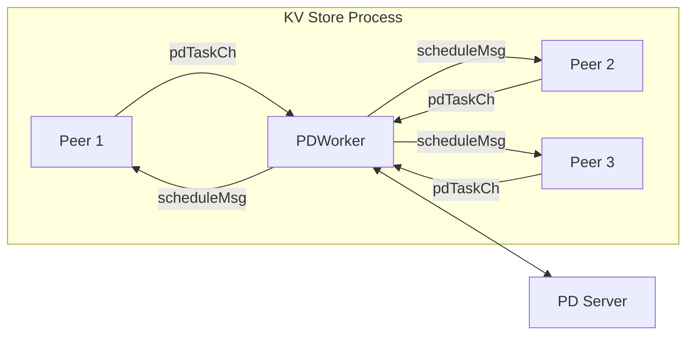
```mermaid
flowchart LR
    subgraph "KV Store Process"
        P1[Peer 1] --> |pdTaskCh| PDW[PDWorker]
        P2[Peer 2] --> |pdTaskCh| PDW
        P3[Peer 3] --> |pdTaskCh| PDW

        PDW --> |scheduleMsg| P1
        PDW --> |scheduleMsg| P2
        PDW --> |scheduleMsg| P3
    end

    PDW <--> PD[PD Server]
```

---

## 17. Complete Scheduling Flow Example

This traces a complete region balancing scenario from detection to completion.

### 17.1 Scenario

- 3-node cluster with stores 1, 2, 3.
- Store 1 has 10 regions, Store 2 has 10 regions, Store 3 has 4 regions (recently added).
- Region 5 is on stores 1 and 2. Store 1 is the leader.

### 17.2 Flow

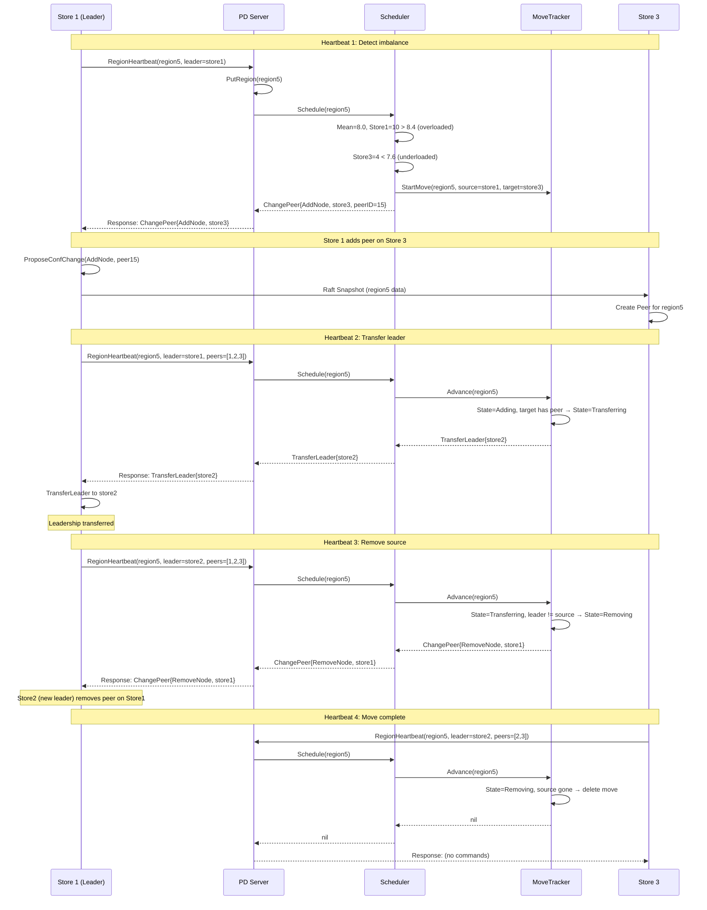
```mermaid
sequenceDiagram
    participant KVS1 as Store 1 (Leader)
    participant PD as PD Server
    participant Sched as Scheduler
    participant MT as MoveTracker
    participant KVS3 as Store 3

    Note over KVS1,KVS3: Heartbeat 1: Detect imbalance

    KVS1->>PD: RegionHeartbeat(region5, leader=store1)
    PD->>PD: PutRegion(region5)
    PD->>Sched: Schedule(region5)
    Sched->>Sched: Mean=8.0, Store1=10 > 8.4 (overloaded)
    Sched->>Sched: Store3=4 < 7.6 (underloaded)
    Sched->>MT: StartMove(region5, source=store1, target=store3)
    Sched-->>PD: ChangePeer{AddNode, store3, peerID=15}
    PD-->>KVS1: Response: ChangePeer{AddNode, store3}

    Note over KVS1,KVS3: Store 1 adds peer on Store 3

    KVS1->>KVS1: ProposeConfChange(AddNode, peer15)
    KVS1->>KVS3: Raft Snapshot (region5 data)
    KVS3->>KVS3: Create Peer for region5

    Note over KVS1,KVS3: Heartbeat 2: Transfer leader

    KVS1->>PD: RegionHeartbeat(region5, leader=store1, peers=[1,2,3])
    PD->>Sched: Schedule(region5)
    Sched->>MT: Advance(region5)
    MT->>MT: State=Adding, target has peer → State=Transferring
    MT-->>Sched: TransferLeader{store2}
    Sched-->>PD: TransferLeader{store2}
    PD-->>KVS1: Response: TransferLeader{store2}

    KVS1->>KVS1: TransferLeader to store2
    Note over KVS1: Leadership transferred

    Note over KVS1,KVS3: Heartbeat 3: Remove source

    KVS1->>PD: RegionHeartbeat(region5, leader=store2, peers=[1,2,3])
    PD->>Sched: Schedule(region5)
    Sched->>MT: Advance(region5)
    MT->>MT: State=Transferring, leader != source → State=Removing
    MT-->>Sched: ChangePeer{RemoveNode, store1}
    Sched-->>PD: ChangePeer{RemoveNode, store1}
    PD-->>KVS1: Response: ChangePeer{RemoveNode, store1}

    Note over KVS1: Store2 (new leader) removes peer on Store1

    Note over KVS1,KVS3: Heartbeat 4: Move complete

    KVS3->>PD: RegionHeartbeat(region5, leader=store2, peers=[2,3])
    PD->>Sched: Schedule(region5)
    Sched->>MT: Advance(region5)
    MT->>MT: State=Removing, source gone → delete move
    MT-->>Sched: nil
    Sched-->>PD: nil
    PD-->>KVS3: Response: (no commands)
```

---

## 18. File Inventory

| File | Key Types | Purpose |
|------|-----------|---------|
| `internal/pd/server.go` | `PDServer`, `PDServerConfig`, `PDServerRaftConfig` | Main PD server, gRPC handlers, 3-way routing |
| `internal/pd/scheduler.go` | `Scheduler`, `ScheduleCommand` | Scheduling decisions (replica repair, leader balance, region balance) |
| `internal/pd/move_tracker.go` | `MoveTracker`, `PendingMove`, `MoveState` | Multi-step region move state machine |
| `internal/pd/command.go` | `PDCommand`, `PDCommandType` | 12 replicated command types, wire format |
| `internal/pd/apply.go` | (method on PDServer) | Command dispatcher: switch over 12 types |
| `internal/pd/snapshot.go` | `PDSnapshot`, `TSOSnapshotState` | Full-state snapshot for Raft transfer |
| `internal/pd/raft_peer.go` | `PDRaftPeer`, `PDRaftConfig`, `PDRaftMsg` | Raft event loop, proposal handling |
| `internal/pd/raft_storage.go` | `PDRaftStorage` | `raft.Storage` impl backed by Pebble |
| `internal/pd/transport.go` | `PDTransport` | Inter-PD gRPC connection pool |
| `internal/pd/peer_service.go` | `PDPeerService` | Incoming PD Raft message handler |
| `internal/pd/forward.go` | (methods on PDServer) | Follower-to-leader RPC forwarding |
| `internal/pd/tso_buffer.go` | `TSOBuffer` | Batched TSO allocation via Raft |
| `internal/pd/id_buffer.go` | `IDBuffer` | Batched ID allocation via Raft |
| `internal/server/pd_worker.go` | `PDWorker` | KV store to PD bridge (heartbeats, scheduling) |
| `internal/server/pd_resolver.go` | `PDStoreResolver` | Dynamic store address resolution via PD |
| `internal/server/store_ident.go` | `StoreIdent` | Store ID persistence for join mode |
| `pkg/pdclient/client.go` | `Client` interface, `grpcClient` | PD gRPC client with failover |
| `cmd/gookv-pd/main.go` | (CLI entry point) | PD server binary with Raft CLI flags |

---

## 19. PD CLI Entry Point

### 19.1 gookv-pd Binary

The `cmd/gookv-pd/main.go` binary starts the PD server. It supports two modes via CLI flags:

**Single-node mode** (minimal flags):

```bash
gookv-pd --addr 0.0.0.0:2379 --data-dir /data/pd
```

**Raft-replicated mode** (full flags):

```bash
gookv-pd \
  --addr 0.0.0.0:2379 \
  --data-dir /data/pd1 \
  --pd-id 1 \
  --initial-cluster "1=127.0.0.1:2380,2=127.0.0.1:2382,3=127.0.0.1:2384" \
  --peer-port 2380 \
  --client-cluster "1=127.0.0.1:2379,2=127.0.0.1:2381,3=127.0.0.1:2383"
```

### 19.2 CLI Flags

| Flag | Type | Default | Description |
|------|------|---------|-------------|
| `--addr` | string | `"0.0.0.0:2379"` | Client gRPC listen address |
| `--data-dir` | string | `"/tmp/gookv-pd"` | Data directory for PD state |
| `--cluster-id` | uint64 | `1` | Cluster identifier |
| `--pd-id` | uint64 | `0` | This node's Raft ID (enables Raft mode when > 0) |
| `--initial-cluster` | string | `""` | Peer addresses: `"id=addr,id=addr,..."` |
| `--peer-port` | int | `2380` | Peer-to-peer gRPC listen port |
| `--client-cluster` | string | `""` | Client addresses for forwarding: `"id=addr,..."` |

### 19.3 Startup Sequence

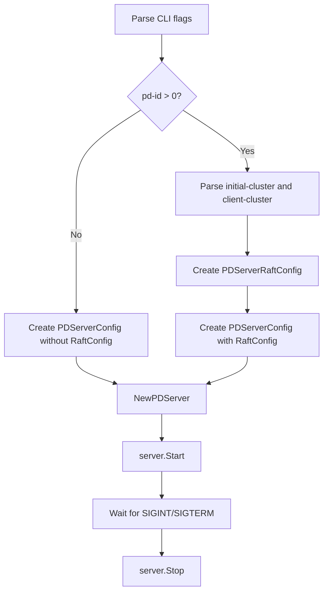
```mermaid
flowchart TD
    A[Parse CLI flags] --> B{pd-id > 0?}
    B -->|No| C[Create PDServerConfig without RaftConfig]
    B -->|Yes| D[Parse initial-cluster and client-cluster]
    D --> E[Create PDServerRaftConfig]
    E --> F[Create PDServerConfig with RaftConfig]
    C --> G[NewPDServer]
    F --> G
    G --> H[server.Start]
    H --> I[Wait for SIGINT/SIGTERM]
    I --> J[server.Stop]
```

---

## 20. MetadataStore Internal Details

### 20.1 Thread Safety

All `MetadataStore` methods acquire the `sync.RWMutex`:
- Read operations (`GetStore`, `GetRegionByKey`, `GetLeaderCountPerStore`) take a read lock.
- Write operations (`PutStore`, `PutRegion`, `SetBootstrapped`) take a write lock.

This allows concurrent reads (from multiple heartbeat handlers) while serializing writes.

### 20.2 Store State Tracking

The `MetadataStore` tracks three timestamps per store:

```go
storeLastHeartbeat map[uint64]time.Time
storeStates        map[uint64]StoreState
```

The `updateStoreStates` method (called every 10 seconds by the store state worker) iterates all stores and applies the state machine transitions:

```go
func (m *MetadataStore) updateStoreStates() {
    m.mu.Lock()
    defer m.mu.Unlock()
    now := time.Now()
    for storeID, lastHB := range m.storeLastHeartbeat {
        elapsed := now.Sub(lastHB)
        currentState := m.storeStates[storeID]
        switch {
        case elapsed > m.downDuration && currentState != StoreStateDown:
            m.storeStates[storeID] = StoreStateDown
        case elapsed > m.disconnectDuration && currentState == StoreStateUp:
            m.storeStates[storeID] = StoreStateDisconnected
        }
    }
}
```

### 20.3 IsStoreSchedulable

A store is schedulable (can receive new regions) if:
- Its state is `Up`
- It is not `Disconnected`, `Down`, or `Tombstone`

```go
func (m *MetadataStore) IsStoreSchedulable(storeID uint64) bool {
    state := m.GetStoreState(storeID)
    return state == StoreStateUp
}
```

This prevents the scheduler from sending regions to stores that might be failing.

### 20.4 GetRegionCountPerStore / GetLeaderCountPerStore

These methods iterate all regions and count how many peers/leaders each store has. They return `map[uint64]int` (storeID -> count). The scheduler uses these counts for balance decisions.

---

## 21. Raft Log Compaction in PD

### 21.1 Why Compact

The PD Raft log grows continuously as commands are proposed and committed. Without compaction:
- Disk usage increases indefinitely.
- Entries call takes longer to recover from.
- Snapshot generation is needed for followers that lag too far behind.

### 21.2 Compaction Trigger

The `PDRaftPeer` runs a log GC tick every 60 seconds (`RaftLogGCTickInterval`). When it fires:

1. Calculate `excess = lastIndex - appliedIndex`.
2. If `excess > RaftLogGCCountLimit` (default: 10000):
   - Set `compactIndex = appliedIndex - RaftLogGCThreshold` (keep 50 recent entries).
   - Propose a `CmdCompactLog` command via Raft.
3. When applied, the command:
   - Updates `ApplyState.TruncatedIndex` and `TruncatedTerm`.
   - Calls `CompactTo` to remove in-memory entries below the compact index.
   - Spawns a background goroutine to delete persisted entries from the Pebble engine.

### 21.3 Relationship to Snapshots

When a follower's last applied index falls below the leader's truncated index, the leader cannot send the missing entries (they have been compacted). Instead, the leader sends a full snapshot via `GenerateSnapshot`. After the follower applies the snapshot, it can resume normal Raft replication from the snapshot index.

---

## 22. Error Handling in PD

### 22.1 Error Response Format

PD uses the `pdpb` error header pattern:

```go
func (s *PDServer) header() *pdpb.ResponseHeader {
    return &pdpb.ResponseHeader{ClusterId: s.clusterID}
}

func (s *PDServer) errorHeader(msg string) *pdpb.ResponseHeader {
    return &pdpb.ResponseHeader{
        ClusterId: s.clusterID,
        Error:     &pdpb.Error{Message: msg},
    }
}
```

Errors are embedded in the response header, not as gRPC status codes. This is consistent with TiKV's PD protocol.

### 22.2 Raft Proposal Errors

When a Raft proposal fails (e.g., the node loses leadership during the proposal):
- `ProposeAndWait` returns an error.
- The gRPC handler propagates this as a gRPC-level error.
- The PD client retries against another endpoint.

### 22.3 Forwarding Errors

When a follower cannot forward to the leader:
- `getLeaderClient` returns an error if no leader is known (`leaderID == 0`).
- The error is returned as a gRPC `codes.Unavailable` status.
- The PD client rotates to the next endpoint.

---

## 23. Timestamp Ordering Guarantees

### 23.1 Within a Single PD Node

In single-node mode, `TSOAllocator` guarantees monotonically increasing timestamps because:
- All allocations are serialized via `sync.Mutex`.
- The physical component never goes backward (it uses `max(current, wallclock)`).
- The logical component increments within the same millisecond.

### 23.2 Across PD Leader Changes

In Raft mode, timestamp ordering across leader changes is guaranteed by:
1. The `TSOBuffer` is reset on leader change, discarding any pre-allocated timestamps.
2. The new leader proposes a fresh `CmdTSOAllocate` batch via Raft.
3. The `TSOAllocator`'s state is replicated via Raft, so the new leader starts from at least the same physical+logical as the old leader.
4. The new allocation advances the state forward, ensuring the new timestamps are greater than all previously allocated timestamps.

### 23.3 Practical Example

```
Leader A allocates timestamps [100, 1099] (batch of 1000)
Leader A serves ts=100, ts=101, ..., ts=500

-- Leader change: A loses leadership, B becomes leader --

B's TSOBuffer.Reset() clears its buffer
B proposes CmdTSOAllocate(batch=1000)
TSOAllocator state: physical=P, logical=1099 (replicated from A)
TSOAllocator advances to: physical=P, logical=2099
B serves ts=1100, ts=1101, ...

All of B's timestamps are > all of A's timestamps.
```

---

## 24. Integration with KV Store Lifecycle

### 24.1 KV Store Startup → PD Registration

```mermaid
sequenceDiagram
    participant KVS as KV Store
    participant PD as PD Server

    KVS->>PD: PutStore(storeID=1, addr="host:20160")
    PD->>PD: meta.PutStore({Id:1, Address:"host:20160"})
    PD-->>KVS: OK

    KVS->>KVS: Start PDWorker
    loop Every 10s
        KVS->>PD: StoreHeartbeat(storeID=1, stats)
        PD->>PD: Update storeLastHeartbeat[1] = now
        PD-->>KVS: OK
    end
```

### 24.2 Region Lifecycle

```mermaid
flowchart TD
    A[Region Created] --> B[Heartbeats sent to PD]
    B --> C{Too large?}
    C -->|Yes| D[Split via AskBatchSplit]
    D --> E[Two child regions]
    E --> B

    C -->|No| F{Peers balanced?}
    F -->|No| G[Move via Scheduler]
    G --> B
    F -->|Yes| H{Leaders balanced?}
    H -->|No| I[TransferLeader]
    I --> B
    H -->|Yes| B
```

### 24.3 KV Store Failure → Recovery

```mermaid
sequenceDiagram
    participant KVS1 as Store 1 (fails)
    participant PD as PD Server
    participant KVS2 as Store 2
    participant KVS3 as Store 3

    Note over KVS1: Process crashes

    loop Every 10s
        PD->>PD: updateStoreStates()
    end

    Note over PD: After 30s: Store 1 → Disconnected
    Note over PD: After 30min: Store 1 → Down

    KVS2->>PD: RegionHeartbeat(region5, leader=store2)
    PD->>PD: Schedule(region5)
    Note over PD: scheduleReplicaRepair detects<br/>region5 has peer on Down store 1
    PD-->>KVS2: ChangePeer{AddNode, store3}

    Note over KVS2,KVS3: Region 5 replicated to Store 3
    Note over PD: Region 5 now has replicas<br/>on Store 2 + Store 3 (not Store 1)
```
