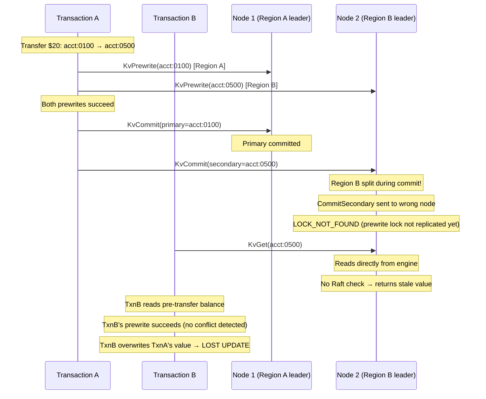
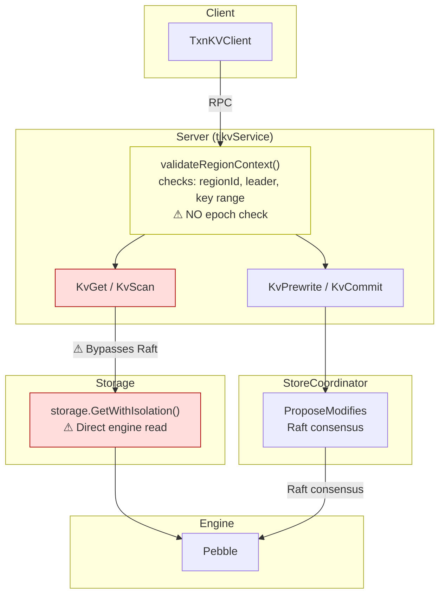
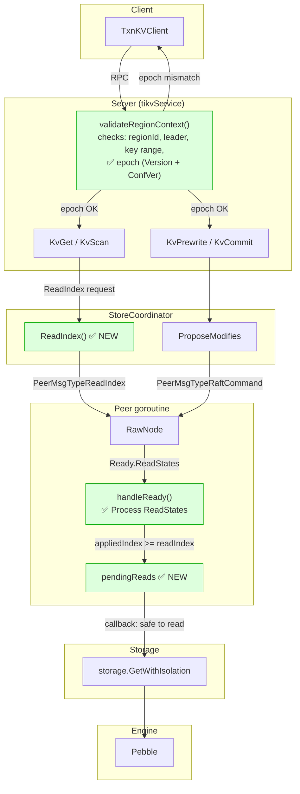

# Read Index and Region Epoch: Architecture Overview

## 1. Problem Statement

gookv's transaction integrity demo fails under concurrent cross-region workloads because of two missing safety mechanisms:

1. **Reads bypass Raft**: `KvGet`, `KvScan`, `KvBatchGet` read directly from the Pebble engine without confirming that the server is the current leader or that all committed writes have been applied. This violates linearizability.

2. **Region epoch is not validated**: After a region split, RPCs carrying stale region metadata (old epoch) are not rejected. This allows writes to be proposed to the wrong region and reads to return data from an outdated key range.

### Failure Scenario

## 2. Current Architecture (Broken Read Path)

**Problems:**
- Reads go directly to engine without Raft coordination
- No leader confirmation before serving reads
- No epoch validation → stale RPCs succeed after splits

## 3. Target Architecture

**Improvements:**
- Reads go through ReadIndex → Raft confirms leadership → wait for applied index
- Epoch validated on ALL RPCs → stale requests rejected immediately
- Client retries with fresh region metadata on EpochNotMatch

## 4. Two Features

| Feature | Purpose | Mechanism |
|---------|---------|-----------|
| **Region Epoch** | Reject stale RPCs after split/merge/conf-change | Compare `{Version, ConfVer}` in request context against current region |
| **Read Index** | Ensure reads see all committed writes (linearizability) | Leader contacts quorum via `rawNode.ReadIndex()`, waits for `appliedIndex >= readIndex` |

## 5. TiKV Reference

Both features are standard in TiKV:
- **Region Epoch**: `check_region_epoch()` in `raftstore/src/store/util.rs`
- **Read Index**: `async_snapshot()` in `server/raftkv/mod.rs`, with optional Leader Lease optimization

gookv uses the same protobuf types (`metapb.RegionEpoch`, `errorpb.EpochNotMatch`, `kvrpcpb.Context.RegionEpoch`) and the same Raft library (`go.etcd.io/etcd/raft/v3` which supports `RawNode.ReadIndex()` and `Ready.ReadStates`).
