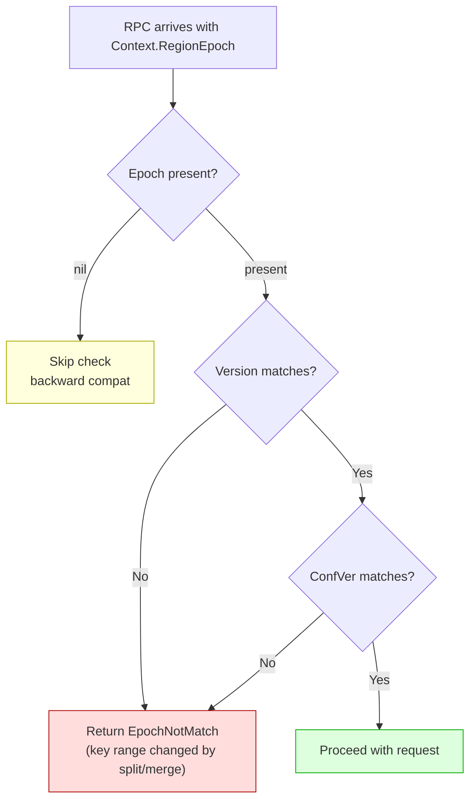
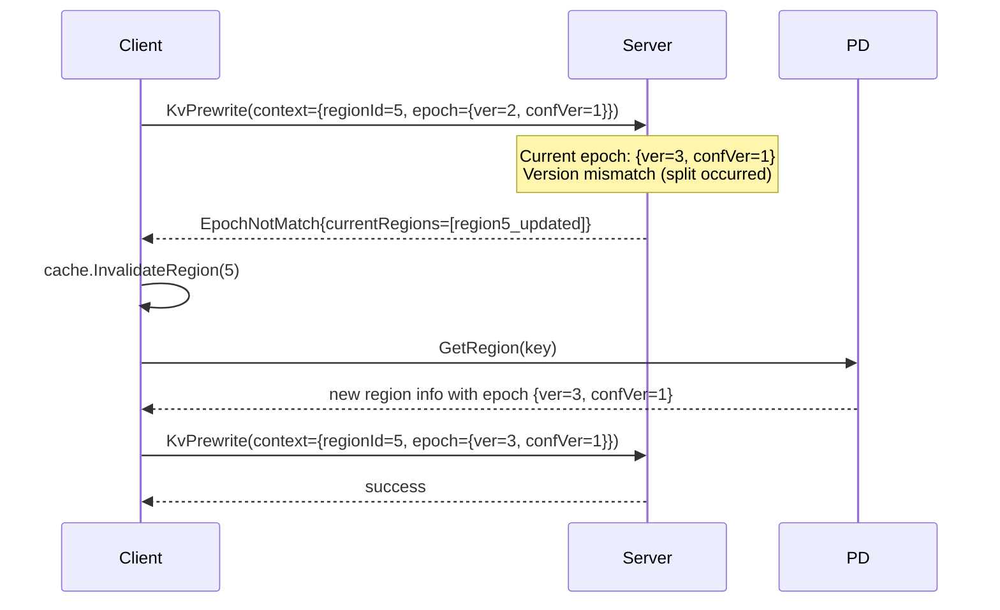

# Region Epoch Validation Design

## 1. What is Region Epoch?

`metapb.RegionEpoch` is a two-component version vector that tracks region metadata changes:

```protobuf
message RegionEpoch {
    uint64 conf_ver = 1;  // Incremented on peer add/remove (conf change)
    uint64 version = 2;   // Incremented on split/merge (key range change)
}
```

## 2. When Does Each Component Increment?

| Event | `version` | `conf_ver` | gookv Location |
|-------|-----------|------------|----------------|
| Region Split | +1 | — | `split/checker.go:ExecBatchSplit` (epoch increment at line 235) |
| Region Merge Prepare | +1 | +1 | `merge.go:ExecPrepareMerge` |
| Region Merge Commit | +1 | — | `merge.go:ExecCommitMerge` |
| Merge Rollback | +1 | — | `merge.go:ExecRollbackMerge` |
| Add/Remove Peer | — | +1 | `conf_change.go:processConfChange` (epoch increment at line 69) |

## 3. Epoch Check Rules



For normal read/write RPCs, checking both `Version` and `ConfVer` ensures the client's region cache is consistent with the server's current state.

## 4. Changes to `validateRegionContext()`

**File:** `internal/server/server.go`

Current implementation checks: regionId existence, leader status, key range. Add epoch check after leader check:

```go
// Check region epoch.
if reqEpoch := reqCtx.GetRegionEpoch(); reqEpoch != nil {
    currentEpoch := peer.Region().GetRegionEpoch()
    if currentEpoch != nil {
        if reqEpoch.GetVersion() != currentEpoch.GetVersion() ||
            reqEpoch.GetConfVer() != currentEpoch.GetConfVer() {
            return &errorpb.Error{
                Message: fmt.Sprintf(
                    "epoch not match: req {ver=%d, confVer=%d}, current {ver=%d, confVer=%d}",
                    reqEpoch.GetVersion(), reqEpoch.GetConfVer(),
                    currentEpoch.GetVersion(), currentEpoch.GetConfVer()),
                EpochNotMatch: &errorpb.EpochNotMatch{
                    CurrentRegions: []*metapb.Region{peer.Region()},
                },
            }
        }
    }
}
```

## 5. RPC Handlers That Need Epoch Validation

All transactional and raw KV handlers that accept `kvrpcpb.Context`:

| Handler | Key for Validation | Currently Has Validation? |
|---------|-------------------|---------------------------|
| `KvGet` | `req.GetKey()` | No |
| `KvScan` | `req.GetStartKey()` | No |
| `KvBatchGet` | `nil` (multi-key) | No |
| `KvPrewrite` | `req.GetPrimaryLock()` | No |
| `KvCommit` | `keys[0]` | No |
| `KvBatchRollback` | `keys[0]` | No |
| `KvCleanup` | `req.GetKey()` | No |
| `KvCheckTxnStatus` | `req.GetPrimaryKey()` | No |
| `KvPessimisticLock` | primary key | No |
| `KvResolveLock` | first key | No |
| `KvScanLock` | `req.GetStartKey()` | No |
| `RawGet` | `req.GetKey()` | Yes (via `validateRegionContext`) |
| `RawPut` | `req.GetKey()` | Yes |
| `RawDelete` | `req.GetKey()` | Yes |

Each handler adds at the beginning:

```go
if regErr := svc.validateRegionContext(req.GetContext(), key); regErr != nil {
    resp.RegionError = regErr
    return resp, nil
}
```

## 6. Client-Side Handling

The client already handles `EpochNotMatch` in `pkg/client/request_sender.go`:

```go
func (s *RegionRequestSender) handleRegionError(ctx context.Context, info *RegionInfo, regionErr *errorpb.Error) bool {
    // ...
    if regionErr.GetEpochNotMatch() != nil ||
        regionErr.GetRegionNotFound() != nil ||
        regionErr.GetKeyNotInRegion() != nil {
        s.cache.InvalidateRegion(regionID)
        return true  // retriable
    }
}
```

No client changes needed. The client invalidates its region cache and retries with fresh metadata from PD.

## 7. Error Response Format



The `EpochNotMatch` error includes `CurrentRegions` so the client can update its cache without an extra PD round-trip in many cases.

## 8. Backward Compatibility

- If `reqCtx.GetRegionEpoch()` is nil, epoch validation is skipped entirely
- Old clients without epoch awareness continue to work (without protection)
- Standalone mode (no coordinator) is unaffected — `validateRegionContext` is only called when coordinator is present for some handlers, and the epoch check is part of the validation logic
