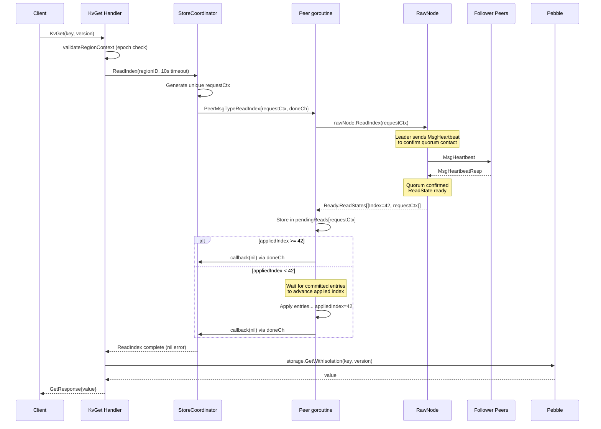
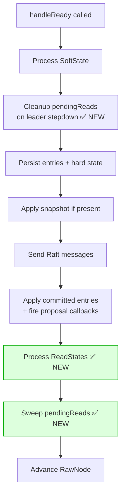
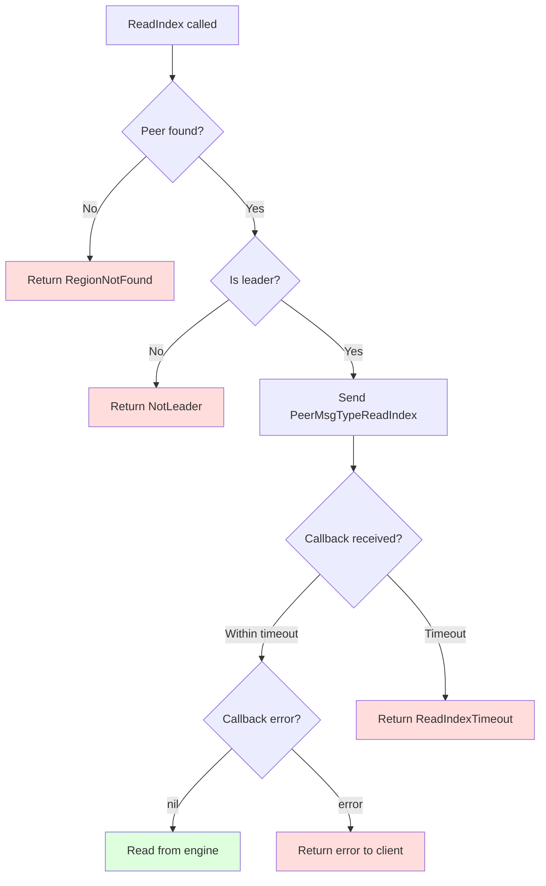

# Read Index Protocol Design

## 1. Why Read Index?

gookv's current read path bypasses Raft entirely — `KvGet` reads directly from the Pebble engine snapshot. This is unsafe because:

- The server may no longer be the leader (partitioned, deposed)
- Committed writes may not yet be applied to the engine (Raft replication delay)
- A write committed on another node may not be visible in this node's snapshot

Read Index ensures **linearizable reads** by confirming that the leader is still the leader and that all committed writes are applied before serving the read.

## 2. etcd Raft Library API

The `go.etcd.io/etcd/raft/v3` library provides native ReadIndex support:

```go
// Request a linearizable read index
rawNode.ReadIndex(requestCtx []byte)

// The result arrives in the next Ready batch
type Ready struct {
    ReadStates []ReadState  // ← Read index results
    // ... other fields
}

type ReadState struct {
    Index      uint64   // Committed index at which the read is safe
    RequestCtx []byte   // Correlates with the ReadIndex request
}
```

**Semantics**: Once `appliedIndex >= ReadState.Index`, all writes committed at or before the read request are visible in the engine. The read is safe to serve.

## 3. Protocol Flow



## 4. New Message Type

**File:** `internal/raftstore/msg.go`

```go
// Add to PeerMsgType constants:
PeerMsgTypeReadIndex  // Linearizable read index request

// New struct:
type ReadIndexRequest struct {
    RequestCtx []byte       // Unique identifier for this read request
    Callback   func(error)  // Called when read is safe (appliedIndex >= readIndex)
}
```

## 5. Peer Changes

**File:** `internal/raftstore/peer.go`

### New Fields

```go
type Peer struct {
    // ... existing fields ...

    // pendingReads tracks in-flight read index requests.
    // Key: string(requestCtx), Value: *pendingRead
    pendingReads map[string]*pendingRead

    // nextReadID generates unique request contexts.
    nextReadID atomic.Uint64
}

type pendingRead struct {
    readIndex uint64       // Set when ReadState arrives
    callback  func(error)  // Called when appliedIndex >= readIndex
}
```

### handleMessage() Addition

```go
case PeerMsgTypeReadIndex:
    req := msg.Data.(*ReadIndexRequest)
    p.handleReadIndexRequest(req)
```

### New Method: handleReadIndexRequest

```go
func (p *Peer) handleReadIndexRequest(req *ReadIndexRequest) {
    if !p.isLeader.Load() {
        req.Callback(fmt.Errorf("not leader for region %d", p.regionID))
        return
    }
    p.rawNode.ReadIndex(req.RequestCtx)
    p.pendingReads[string(req.RequestCtx)] = &pendingRead{
        readIndex: 0,
        callback:  req.Callback,
    }
}
```

### handleReady() Changes



After applying committed entries (which advances the applied index), add:

```go
// Process ReadStates from ReadIndex.
for _, rs := range rd.ReadStates {
    key := string(rs.RequestCtx)
    if pr, ok := p.pendingReads[key]; ok {
        pr.readIndex = rs.Index
        if p.storage.AppliedIndex() >= rs.Index {
            pr.callback(nil)
            delete(p.pendingReads, key)
        }
    }
}

// Sweep pendingReads for any that are now satisfiable.
if len(p.pendingReads) > 0 {
    appliedIdx := p.storage.AppliedIndex()
    for key, pr := range p.pendingReads {
        if pr.readIndex > 0 && appliedIdx >= pr.readIndex {
            pr.callback(nil)
            delete(p.pendingReads, key)
        }
    }
}
```

## 6. StoreCoordinator Changes

**File:** `internal/server/coordinator.go`

### New Method: ReadIndex

```go
func (sc *StoreCoordinator) ReadIndex(regionID uint64, timeout time.Duration) error {
    sc.mu.RLock()
    peer, ok := sc.peers[regionID]
    sc.mu.RUnlock()

    if !ok {
        return fmt.Errorf("raftstore: region %d not found", regionID)
    }
    if !peer.IsLeader() {
        return fmt.Errorf("raftstore: not leader for region %d", regionID)
    }

    // Generate unique request context.
    id := peer.NextReadID()
    requestCtx := make([]byte, 8)
    binary.BigEndian.PutUint64(requestCtx, id)

    doneCh := make(chan error, 1)
    req := &raftstore.ReadIndexRequest{
        RequestCtx: requestCtx,
        Callback:   func(err error) { doneCh <- err },
    }

    msg := raftstore.PeerMsg{
        Type: raftstore.PeerMsgTypeReadIndex,
        Data: req,
    }
    if err := sc.router.Send(regionID, msg); err != nil {
        return fmt.Errorf("raftstore: send read index: %w", err)
    }

    select {
    case err := <-doneCh:
        return err
    case <-time.After(timeout):
        return fmt.Errorf("raftstore: read index timeout for region %d", regionID)
    }
}
```

## 7. RPC Handler Changes

**File:** `internal/server/server.go`

### KvGet (exemplar for all read handlers)

```go
func (svc *tikvService) KvGet(ctx context.Context, req *kvrpcpb.GetRequest) (*kvrpcpb.GetResponse, error) {
    resp := &kvrpcpb.GetResponse{}

    // 1. Validate region context (includes epoch check).
    if regErr := svc.validateRegionContext(req.GetContext(), req.GetKey()); regErr != nil {
        resp.RegionError = regErr
        return resp, nil
    }

    // 2. ReadIndex: ensure linearizable read in cluster mode.
    if coord := svc.server.coordinator; coord != nil {
        regionID := req.GetContext().GetRegionId()
        if regionID == 0 {
            regionID = svc.resolveRegionID(req.GetKey())
        }
        if err := coord.ReadIndex(regionID, 10*time.Second); err != nil {
            if regErr := proposeErrorToRegionError(err, regionID); regErr != nil {
                resp.RegionError = regErr
                return resp, nil
            }
            return nil, status.Errorf(codes.Internal, "read index failed: %v", err)
        }
    }

    // 3. Read from engine (now safe).
    // ... existing code ...
}
```

### Handlers That Need ReadIndex

| Handler | Needs ReadIndex? | Reason |
|---------|-----------------|--------|
| `KvGet` | **Yes** | Transactional point read |
| `KvScan` | **Yes** | Transactional range scan |
| `KvBatchGet` | **Yes** | Multi-key transactional read |
| `KvCheckSecondaryLocks` | Deferred | Lock resolution (idempotent, best-effort) |
| `KvScanLock` | Deferred | Lock scanning (idempotent) |
| `KvPrewrite` | No | Goes through ProposeModifies (write path) |
| `KvCommit` | No | Goes through ProposeModifies (write path) |

## 8. Standalone Mode

When no coordinator is present (standalone server), reads continue to be served directly from the engine. The `if coord := svc.server.coordinator; coord != nil` check gates all ReadIndex calls.

## 9. Timeout and Error Handling



## 10. Design Considerations

### 10.1 Async Apply Timing

In the current architecture, `applyFunc` (which calls `sc.applyEntries`) is invoked synchronously within `handleReady()`, so `p.storage.AppliedIndex()` reflects all applied entries by the time ReadStates are processed. If the apply path is ever made asynchronous, the ReadIndex callback must wait for the async apply to complete before firing. The current synchronous design avoids this issue.

### 10.2 Pending Reads Cleanup on Leader Stepdown

When `rd.SoftState` indicates a leader change (`SoftState.Lead != p.peerID` or `RoleFollower`), all pending reads must be failed immediately:

```go
// In handleReady(), after SoftState processing:
if rd.SoftState != nil && rd.SoftState.RaftState != raft.StateLeader {
    for key, pr := range p.pendingReads {
        pr.callback(fmt.Errorf("not leader for region %d", p.regionID))
        delete(p.pendingReads, key)
    }
}
```

Without this, pending reads would leak and their callers would only discover the failure via the 10-second timeout.

### 10.3 Data Race on `p.region`

The `Peer.region` field is accessed from both the peer goroutine (on split/conf-change) and gRPC handler goroutines (via `validateRegionContext` → `peer.Region()`). The `Region()` method should use `atomic.Value` or a read-write mutex to prevent data races. This is a pre-existing issue but must be addressed as part of the epoch validation work since the epoch check reads `p.region.RegionEpoch`.

### 10.4 KvCheckSecondaryLocks Deferred Justification

`KvCheckSecondaryLocks` and `KvScanLock` are used for lock resolution, which is an idempotent, best-effort operation. A stale lock scan may report locks that have already been resolved (false positive) or miss recently created locks (false negative). Both cases are handled by the retry logic in the lock resolver. Stale reads in this path do not violate transaction safety because the lock resolver's `checkTxnStatus` + `resolveLock` flow is self-correcting. However, if a stale read causes the lock resolver to rollback a secondary whose primary was actually committed (because the commit record is not yet visible), this would be a correctness violation. This edge case should be re-evaluated after ReadIndex is implemented for the primary read path — if the primary problem (lost updates in the demo) is resolved, deferring ReadIndex for lock-scanning RPCs is acceptable.

## 11. Future: Leader Lease Optimization

The Read Index protocol adds a Raft round-trip to every read. In production, TiKV optimizes this with **Leader Lease**: when the leader has recently confirmed its leadership via heartbeats (within `electionTimeout * 0.8`), it serves reads directly without ReadIndex.

This is explicitly out of scope for the initial implementation. If read latency becomes a concern, it can be added as:

```go
// In ReadIndex():
if peer.IsLeaseValid() {
    return nil  // Skip ReadIndex, serve directly
}
// ... fall through to ReadIndex ...
```
