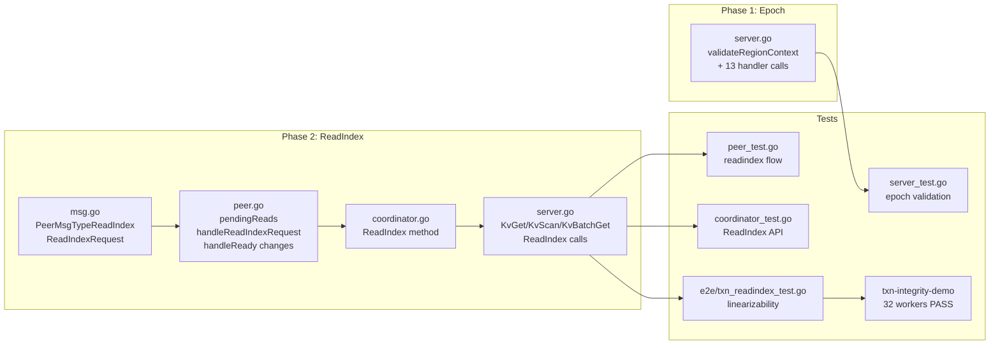

# Implementation Plan

## Phase 1: Region Epoch Validation

**Risk:** Low. Self-contained change. No behavioral change for clients that already send correct epoch.

### Step 1.1: Enhance `validateRegionContext()`

**File:** `internal/server/server.go`

Add epoch comparison after the existing leader check. Return `EpochNotMatch` with current region on mismatch. Skip if request epoch is nil (backward compat).

### Step 1.2: Add `validateRegionContext` to Transactional Handlers

**File:** `internal/server/server.go`

Add `validateRegionContext(req.GetContext(), key)` call at the top of each transactional RPC handler that does not already have it (11 handlers listed in `02_region_epoch.md` Section 5 — excluding RawGet, RawPut, RawDelete which already call `validateRegionContext`). Each handler returns `resp.RegionError` on mismatch.

### Step 1.3: Client Verification

**File:** `pkg/client/request_sender.go`

Verify that `handleRegionError` already handles `EpochNotMatch` → invalidate cache + return `true` (retriable). Currently at line 109-113. **No changes expected.**

**File:** `pkg/client/client.go`

Verify that `buildContext()` populates `RegionEpoch` from the cached `RegionInfo`. **No changes expected.**

### Step 1.4: Tests

- Unit tests for epoch mismatch scenarios in `validateRegionContext`
- Integration test: split region, send RPC with old epoch, verify rejection

**Estimated:** ~100 lines production code, ~150 lines test code.

---

## Phase 2: Read Index Protocol

**Risk:** Medium. Changes the read latency characteristics. Requires async coordination between RPC handler and Raft peer goroutine.

### Step 2.1: New Message Types

**File:** `internal/raftstore/msg.go`

- Add `PeerMsgTypeReadIndex` constant
- Add `ReadIndexRequest` struct with `RequestCtx []byte` and `Callback func(error)`

### Step 2.2: Peer ReadIndex Handling

**File:** `internal/raftstore/peer.go`

- Add `pendingReads map[string]*pendingRead` field to `Peer`
- Add `nextReadID atomic.Uint64` field
- Add `pendingRead` struct with `readIndex uint64` and `callback func(error)`
- Initialize `pendingReads` in `NewPeer()`
- Add `NextReadID()` method
- Add `handleReadIndexRequest()` method
- Add case for `PeerMsgTypeReadIndex` in message dispatch (handleMessage)
- Add ReadStates processing in `handleReady()`:
  - After committed entries processing, process `rd.ReadStates`
  - Set `readIndex` on matching pending reads
  - Fire callbacks when `appliedIndex >= readIndex`
- Add pending reads sweep after committed entries advance applied index

### Step 2.3: StoreCoordinator ReadIndex

**File:** `internal/server/coordinator.go`

- Add `ReadIndex(regionID uint64, timeout time.Duration) error` method
- Generates unique request context via `peer.NextReadID()`
- Sends `PeerMsgTypeReadIndex` to peer via router
- Blocks on `doneCh` with timeout

### Step 2.4: Read Handler Wiring

**File:** `internal/server/server.go`

- Modify `KvGet`: add `coord.ReadIndex()` before `storage.GetWithIsolation()`
- Modify `KvScan`: add `coord.ReadIndex()` before `storage.Scan()`
- Modify `KvBatchGet`: add `coord.ReadIndex()` before `storage.BatchGet()`
- Gate all ReadIndex calls on `coord != nil` (standalone mode bypass)

### Step 2.5: Tests

- Unit tests for Peer ReadIndex flow
- Unit tests for Coordinator ReadIndex timeout/error cases
- Integration test: write then read, verify linearizability
- E2E test: transaction integrity demo passes with 32 workers

**Estimated:** ~200 lines production code, ~300 lines test code.

---

## Phase 3: Leader Lease (Future, Optional)

**Deferred.** Only implement if read latency under ReadIndex becomes unacceptable.

---

## File Change Summary

## Rollout Sequence

1. **Phase 1 first**: Deploy epoch validation. Purely defensive — no behavioral change for correct clients.
2. **Phase 2 after Phase 1 verified**: Deploy ReadIndex. Changes read latency. Monitor P99 read latency.
3. Run transaction integrity demo as validation gate before each phase is considered complete.
