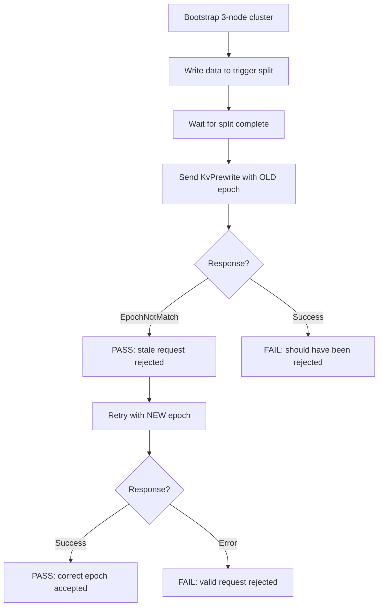

# Test Plan

## 1. Unit Tests

### 1.1 Epoch Validation

**File:** `internal/server/epoch_test.go` (new)

| Test Case | Description | Expected |
|-----------|-------------|----------|
| `TestEpochMatch` | Request epoch matches current | nil (pass) |
| `TestVersionMismatch` | Version differs (post-split) | EpochNotMatch with current region |
| `TestConfVerMismatch` | ConfVer differs (post-confchange) | EpochNotMatch with current region |
| `TestBothMismatch` | Both Version and ConfVer differ | EpochNotMatch |
| `TestNilRequestEpoch` | Request has nil RegionEpoch | nil (skip check, backward compat) |
| `TestNilCurrentEpoch` | Server region has nil epoch | nil (skip check) |
| `TestEpochNotMatchContainsCurrentRegion` | Error response includes current region metadata | CurrentRegions has 1 element |

### 1.2 ReadIndex Peer Handling

**File:** `internal/raftstore/readindex_test.go` (new)

| Test Case | Description | Expected |
|-----------|-------------|----------|
| `TestReadIndex_Basic` | Submit ReadIndex, simulate Raft Ready with ReadState, verify callback | Callback called with nil error |
| `TestReadIndex_AlreadyApplied` | ReadState.Index <= current appliedIndex | Callback fires immediately |
| `TestReadIndex_WaitForApply` | ReadState.Index > appliedIndex, then apply entries | Callback fires after entries applied |
| `TestReadIndex_NotLeader` | ReadIndex on non-leader peer | Callback called with "not leader" error |
| `TestReadIndex_MultipleConcurrent` | Multiple ReadIndex requests in flight | All callbacks fire correctly |
| `TestReadIndex_LeaderChange` | Leader steps down during pending read | All pending reads fail with "not leader" error, map cleaned |
| `TestReadIndex_Timeout` | Peer never responds within timeout | StoreCoordinator returns timeout error |
| `TestReadIndex_DuringSplit` | Region splits while ReadIndex is pending | Pending read fails or resolves correctly |
| `TestReadIndex_NewPostSplitPeer` | ReadIndex on newly created peer (post-split) before it becomes leader | Returns "not leader" error |

### 1.3 Coordinator ReadIndex

**File:** `internal/server/coordinator_readindex_test.go` (new)

| Test Case | Description | Expected |
|-----------|-------------|----------|
| `TestCoordReadIndex_Success` | ReadIndex on leader region | Returns nil |
| `TestCoordReadIndex_Timeout` | Peer never responds | Returns timeout error |
| `TestCoordReadIndex_NotLeader` | ReadIndex on follower region | Returns not-leader error |
| `TestCoordReadIndex_RegionNotFound` | ReadIndex on unknown region | Returns region-not-found error |

---

## 2. Integration Tests

### 2.1 Epoch Integration

**File:** `e2e/epoch_test.go` (new)



| Test Case | Description |
|-----------|-------------|
| `TestEpochAfterSplit` | Split region, verify old-epoch RPC rejected, new-epoch RPC succeeds |
| `TestEpochAfterConfChange` | Add peer, verify old-confver RPC rejected |
| `TestEpochClientAutoRetry` | Client automatically retries on EpochNotMatch (end-to-end) |

### 2.2 ReadIndex Integration

**File:** `e2e/readindex_test.go` (new)

| Test Case | Description |
|-----------|-------------|
| `TestReadIndexLinearizability` | Write then read on same leader — value is visible |
| `TestReadIndexAfterSplit` | Write, split, read — value still visible in correct region |
| `TestReadIndexConcurrentWriteRead` | Concurrent writes and reads — reads always see latest committed value |

### 2.3 Combined Integration

**File:** `e2e/epoch_readindex_test.go` (new)

| Test Case | Description |
|-----------|-------------|
| `TestSplitDuringTransaction` | Start a cross-region txn, trigger split mid-flight, verify commit either succeeds or is properly rejected and retried |
| `TestConcurrentSplitAndReadWrite` | Multiple goroutines read/write while splits occur — no stale reads |

---

## 3. End-to-End Tests

### 3.1 Transaction Integrity Demo

**File:** `scripts/txn-integrity-demo-verify/main.go` (existing)

This is the primary E2E validation gate. After implementing Read Index and Region Epoch, the demo must pass reliably:

| Test Scenario | Workers | Regions | Expected |
|---------------|---------|---------|----------|
| Single worker, single region | 1 | 1 | PASS (baseline) |
| Single worker, 3+ regions | 1 | 3+ | PASS |
| 2 workers, 3+ regions | 2 | 3+ | PASS |
| 4 workers, 3+ regions | 4 | 3+ | PASS |
| **32 workers, 3+ regions** | **32** | **3+** | **PASS** |

**Acceptance criteria:**
- 3 consecutive runs all PASS
- Total balance = $100,000 exactly
- No VERIFY MISMATCH errors
- No `max retries exhausted` errors
- Phase 2 completes within 30 seconds (no excessive latch contention)

### 3.2 Bank Transfer Stress Test (New)

**File:** `e2e/bank_transfer_test.go` (new)

A Go test version of the demo, suitable for `make test-e2e`:

```go
func TestBankTransferConservation(t *testing.T) {
    // 1. Bootstrap 3-node cluster
    // 2. Create 100 accounts with $100 each
    // 3. Wait for region splits (>=3 regions)
    // 4. Run 8 goroutines for 10 seconds doing random transfers
    // 5. Read all balances
    // 6. Assert total == $10,000
}
```

Parameters (smaller than demo for faster CI):
- 100 accounts (not 1000)
- 8 workers (not 32)
- 10 seconds (not 30)
- $10,000 total (not $100,000)

### 3.3 Concurrent Split + Transaction Test

**File:** `e2e/split_txn_test.go` (new)

```go
func TestTransactionDuringSplit(t *testing.T) {
    // 1. Bootstrap 3-node cluster with low split threshold
    // 2. Start 4 goroutines doing random key writes
    // 3. Simultaneously trigger region splits by writing large values
    // 4. After 10 seconds, read all keys and verify values are consistent
    // 5. No "region not found" or "lock not found" errors
}
```

---

## 4. Backward Compatibility Tests

### 4.1 Standalone Mode

**File:** `e2e/standalone_compat_test.go` (new)

| Test Case | Description |
|-----------|-------------|
| `TestStandaloneReadNoReadIndex` | Single-node without coordinator: KvGet works without ReadIndex |
| `TestStandaloneNoEpochCheck` | Single-node: KvPrewrite works without epoch in context |

### 4.2 Nil Context/Epoch

**File:** `internal/server/server_test.go` (extend)

| Test Case | Description |
|-----------|-------------|
| `TestNilContext` | RPC with nil Context: no crash, request processed normally |
| `TestZeroRegionId` | RegionId=0 in context: falls back to resolveRegionID |
| `TestNilEpoch` | Context present but RegionEpoch nil: epoch check skipped |

---

## 5. Test Execution

### CI Pipeline

```bash
# Unit tests
make test

# E2E tests (includes new bank transfer + split + epoch tests)
make test-e2e

# Transaction integrity demo (manual or CI)
make txn-integrity-demo-start
sleep 5
make txn-integrity-demo-verify  # Must exit 0
make txn-integrity-demo-stop
```

### Acceptance Gate

Both Phase 1 and Phase 2 must pass ALL of the following before being considered complete:

1. `make test` — 0 failures, deterministic (run 3 times)
2. `make test-e2e` — 0 failures, deterministic (run 3 times)
3. `make txn-integrity-demo-verify` — PASS with 32 workers, 3 consecutive runs

Any flaky test must be fixed before the phase is considered complete (per project convention: tests that change between success and failure without code changes are unacceptable).
