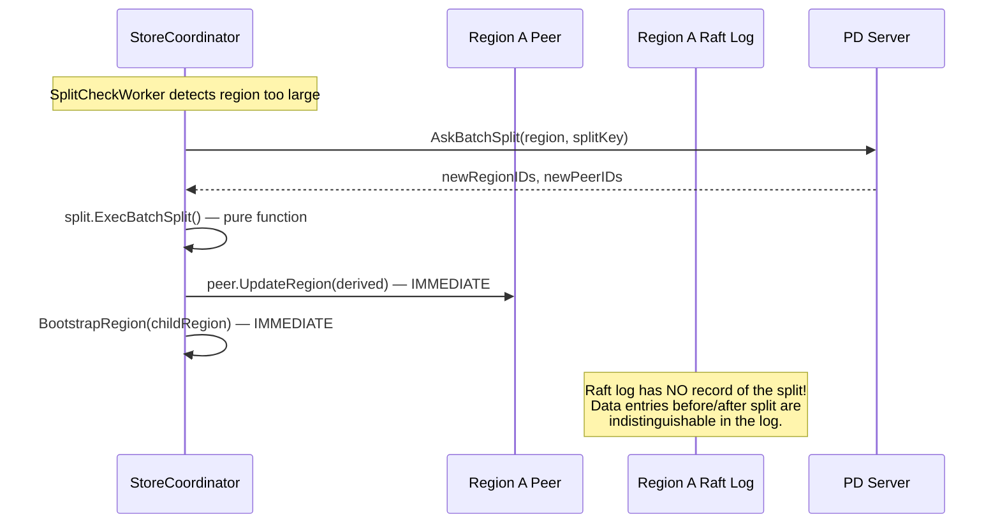
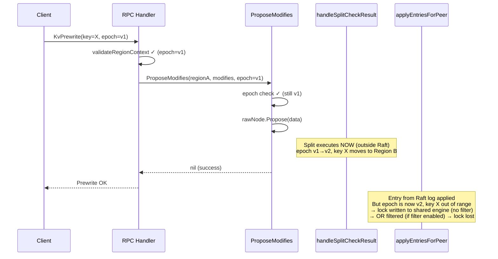
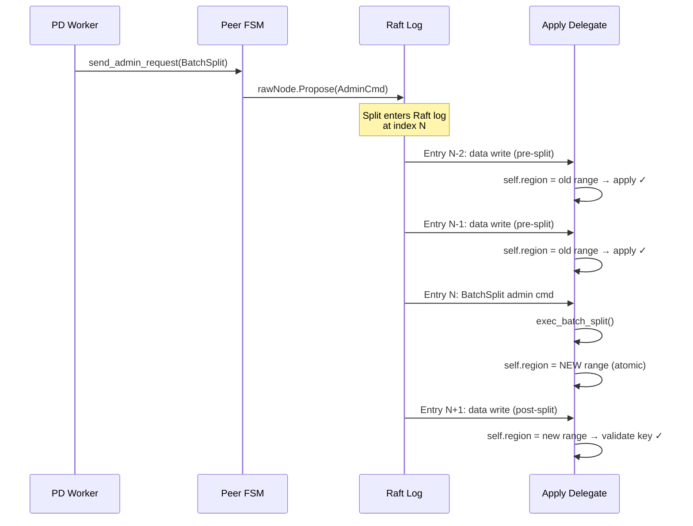
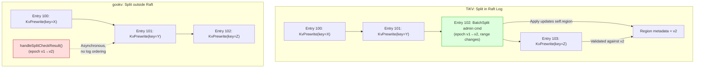

# Split as Raft Admin Command — Problem Analysis and TiKV Reference

## 1. Problem Statement

gookv's region splits execute outside the Raft log. This creates a timing gap between data entry proposals and split execution, causing data integrity failures at high concurrency (32 workers, 1000 accounts: $33-$100 balance divergence).

### Current gookv split flow

### The timing gap

Both outcomes are problematic:
- **Without apply filter**: lock is written but belongs to wrong region logically
- **With apply filter**: lock is silently dropped, prewrite reports success but lock is lost

### Evidence from demo runs

| Scale | Total Balance | Discrepancy |
|-------|-------------|-------------|
| 8w/100a | $10,000 (3/3 PASS) | 0 |
| 16w/500a | $50,000 (3/3 PASS) | 0 |
| 32w/1000a | $99,967 (FAIL) | −$33 (1 account) |

The discrepancy increases with scale because more splits occur during active transactions.

## 2. TiKV's Solution: Split as Raft Admin Command

### TiKV split flow

### Key TiKV source references

| Component | File | Lines | Purpose |
|-----------|------|-------|---------|
| Split proposal creation | `tikv/components/raftstore/src/store/worker/pd.rs` | 2630-2651 | `new_batch_split_region_request()` |
| Propose to Raft | `tikv/components/raftstore/src/store/peer.rs` | 4763-4784 | `propose_normal()` serializes and proposes |
| Apply exec_batch_split | `tikv/components/raftstore/src/store/fsm/apply.rs` | 2632-2841 | Split execution during Raft apply |
| Region update in delegate | `tikv/components/raftstore/src/store/fsm/apply.rs` | 1641 | `self.region = derived.clone()` |
| Child peer creation | `tikv/components/raftstore/src/store/fsm/peer.rs` | 4643-4894 | `on_ready_split_region()` |
| Key range validation | `tikv/components/raftstore/src/store/fsm/apply.rs` | 1897-1902 | `check_key_in_region()` per entry |

### Why this eliminates the timing gap

1. **Strict ordering**: The split admin command has a specific index in the Raft log. All entries before it are applied with pre-split metadata; all entries after with post-split metadata.
2. **Atomic region update**: The apply delegate's `self.region` is updated when the split command is applied — not asynchronously by a coordinator.
3. **No race condition**: Since both data writes and splits go through the same Raft log, there is no window where a data write can be proposed with one epoch and applied with another.

## 3. Architecture Gap Summary

