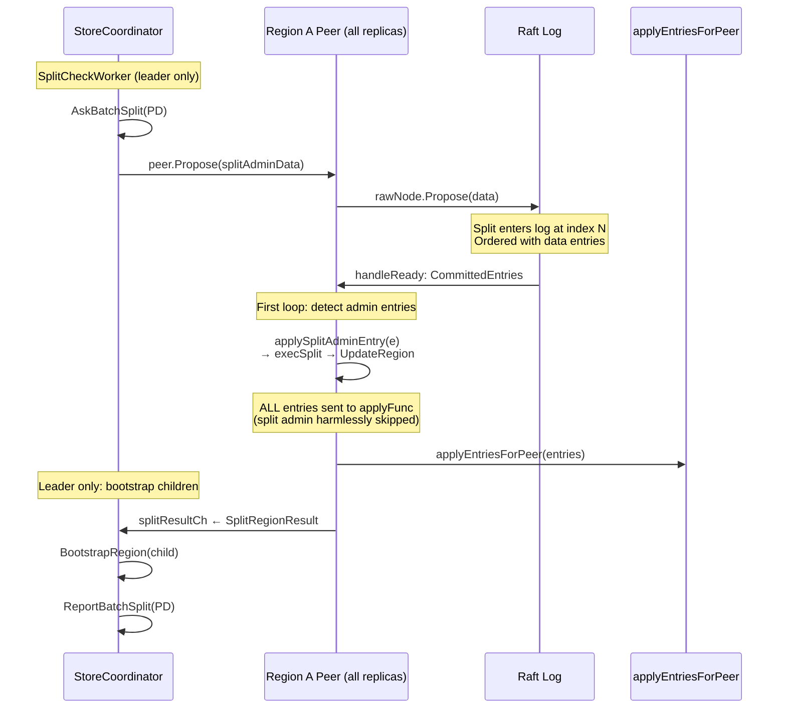
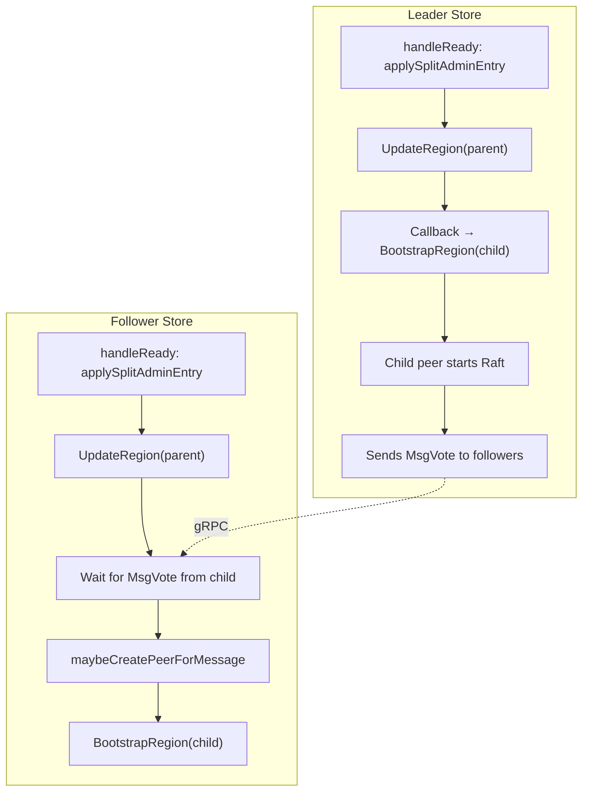
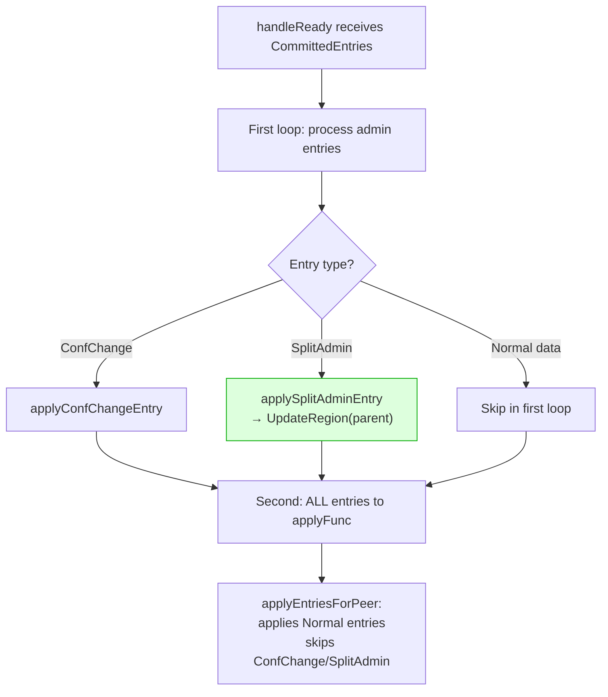

# Split as Raft Admin Command — Detailed Design

## 1. Overview

Convert region splits from coordinator-driven (outside Raft) to Raft admin command (inside Raft log). This ensures strict ordering between data writes and splits, eliminating the timing gap that causes data integrity failures.

### Design principles

- Follow gookv's existing admin command pattern (CompactLog: tag-byte binary format, `rawNode.Propose`)
- Reuse existing types: `SplitRegionResult` (msg.go:96-99), `ExecResultTypeSplitRegion` (msg.go:90)
- Split execution happens in `handleReady` (same loop as ConfChange), NOT in the coordinator
- ALL entries (including split admin) flow through `applyFunc` — split admin entries are harmlessly skipped at protobuf unmarshal
- Coordinator only PROPOSES the split; execution is deferred to Raft apply time
- Child region creation happens AFTER apply, via the coordinator

## 2. Architecture

### New split flow



### Follower behavior

On follower stores, the same `handleReady` loop detects and applies the split admin entry, updating the parent region's metadata. Child regions are NOT created by the follower directly — they are created via `maybeCreatePeerForMessage` when the leader's child region sends Raft messages (existing mechanism).



## 3. Data Structures

### SplitAdminRequest (binary format)

Tag byte 0x02 (CompactLog uses 0x01). Safe from collision with protobuf RaftCmdRequest (which starts with 0x0A).

```
Tag:            1 byte  (0x02)
SplitKeyLen:    4 bytes (uint32, big-endian)
SplitKey:       variable bytes
NumNewRegions:  4 bytes (uint32)
For each new region:
  NewRegionID:  8 bytes (uint64)
  NumPeerIDs:   4 bytes (uint32)
  PeerIDs:      8 bytes × NumPeerIDs (uint64 each)
```

```go
// internal/raftstore/split_admin.go (NEW FILE)
const TagSplitAdmin byte = 0x02

type SplitAdminRequest struct {
    SplitKey      []byte
    NewRegionIDs  []uint64
    NewPeerIDSets [][]uint64
}
```

### Reused types (msg.go)

```go
// Already defined in msg.go:
type SplitRegionResult struct {
    Derived *metapb.Region   // updated parent region
    Regions []*metapb.Region // new child regions
}
const ExecResultTypeSplitRegion ExecResultType = 1
```

## 4. Implementation Steps

### Step 1: Create `split_admin.go`

**File:** `internal/raftstore/split_admin.go` (NEW)

- `SplitAdminRequest` struct and marshal/unmarshal
- `IsSplitAdmin(data []byte) bool` — checks tag byte
- `ExecSplitAdmin(peer *Peer, req SplitAdminRequest) (*SplitRegionResult, error)` — calls `split.ExecBatchSplit`, updates parent region

### Step 2: Propose split via Raft

**File:** `internal/server/coordinator.go`, `handleSplitCheckResult()`

Replace direct split execution with Raft proposal:

```go
func (sc *StoreCoordinator) handleSplitCheckResult(result split.SplitCheckResult) {
    // Keep: AskBatchSplit (PD interaction) — unchanged
    // ...

    // NEW: Propose split via Raft instead of executing directly
    req := raftstore.SplitAdminRequest{
        SplitKey:      result.SplitKey,
        NewRegionIDs:  newRegionIDs,
        NewPeerIDSets: newPeerIDSets,
    }
    data := raftstore.MarshalSplitAdminRequest(req)
    peer.Propose(data)  // uses existing Peer.Propose() method

    // REMOVED: split.ExecBatchSplit(), peer.UpdateRegion(), BootstrapRegion()
    // These now happen in handleReady (apply time)
}
```

No callback registration (fire-and-forget, same as CompactLog).

### Step 3: Detect and execute split in handleReady

**File:** `internal/raftstore/peer.go`, `handleReady()`

Add split admin detection in the EXISTING first loop (alongside ConfChange):

```go
// In handleReady(), the committed entries processing loop:
for _, e := range rd.CommittedEntries {
    if e.Type == raftpb.EntryConfChange || e.Type == raftpb.EntryConfChangeV2 {
        p.applyConfChangeEntry(e)
    } else if e.Type == raftpb.EntryNormal && IsSplitAdmin(e.Data) {
        p.applySplitAdminEntry(e)
    }
}

// Then ALL entries go to applyFunc (unchanged — split admin entries
// are harmlessly skipped because they fail protobuf unmarshal)
if p.applyFunc != nil {
    p.applyFunc(p.regionID, rd.CommittedEntries)
}
```

`applySplitAdminEntry`:
1. Unmarshal `SplitAdminRequest`
2. Call `ExecSplitAdmin(p, req)` → updates `p.region` via `UpdateRegion`
3. Send result to coordinator via `splitResultCh` (leader only)

### Step 4: Handle split result in coordinator (leader only)

**File:** `internal/server/coordinator.go`

Add a channel or callback mechanism for the coordinator to receive split results:

```go
// In Peer struct (peer.go):
splitResultCh chan<- *SplitRegionResult  // set by coordinator

// In applySplitAdminEntry:
if p.isLeader.Load() && p.splitResultCh != nil {
    p.splitResultCh <- result
}
```

The coordinator receives the result and:
1. Calls `BootstrapRegion` for each child region
2. Reports to PD via `ReportBatchSplit`
3. Sends `PeerMsgTypeTick` to child regions

### Step 5: Remove direct split execution from coordinator

Remove from `handleSplitCheckResult`:
- `split.ExecBatchSplit()` call
- `peer.UpdateRegion()` call
- Direct `BootstrapRegion()` calls
- `ReportBatchSplit()` call (moved to split result handler)

## 5. Apply ordering guarantee



**Key guarantee**: `applySplitAdminEntry` updates `peer.region` BEFORE `applyFunc` is called. This means data entries AFTER the split in the same Ready batch will be applied with the post-split region metadata. Since `applyEntriesForPeer` applies unconditionally (no range filter), these entries write to the shared engine regardless — the propose-time epoch check ensures only valid entries enter the log.

## 6. Notes

- **`filterModifiesByRegion`** (coordinator.go:222-252): Currently unused (apply is unconditional). With splits as Raft admin commands, ordering guarantees replace runtime filtering. This function can be removed.
- **Split metadata persistence**: `UpdateRegion` only updates in-memory state. If the node crashes between split apply and the next snapshot, the split is lost. This is acceptable because Raft log replay will re-apply the split entry on recovery.
- **Stale split proposals**: If the region epoch changes before the split entry is applied (e.g., ConfChange), `ExecSplitAdmin` should validate the epoch and skip if stale.

## 7. Files to Modify

| File | Change |
|------|--------|
| `internal/raftstore/split_admin.go` | **NEW**: SplitAdminRequest, marshal/unmarshal, IsSplitAdmin, ExecSplitAdmin |
| `internal/raftstore/peer.go` | Add `applySplitAdminEntry`, `splitResultCh`; detect in handleReady |
| `internal/server/coordinator.go` | Rewrite `handleSplitCheckResult` to propose; add split result handler |
| `internal/raftstore/msg.go` | (existing types reused, no changes expected) |
