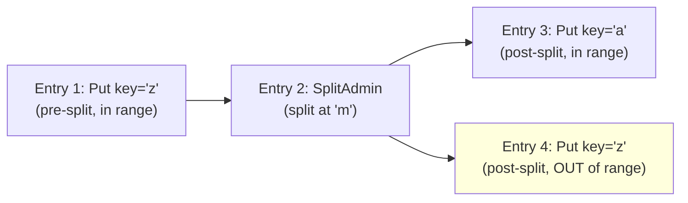
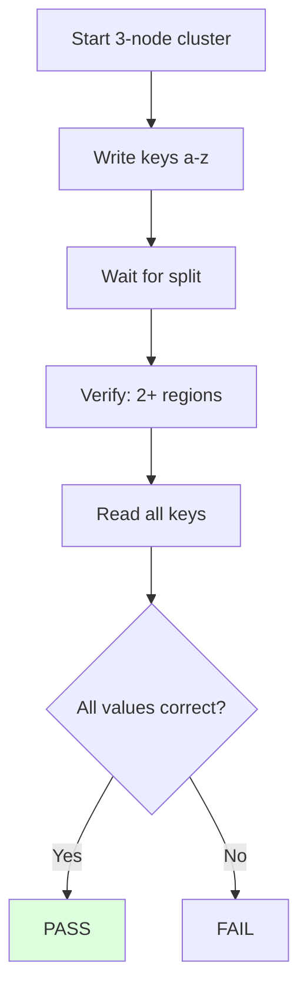

# Split as Raft Admin Command — Test Plan

## 1. Unit Tests

### 1.1 `TestMarshalUnmarshalSplitAdminRequest`

**File:** `internal/raftstore/split_admin_test.go`

**Purpose:** Verify binary serialization round-trip for SplitAdminRequest.

**Cases:**
- Single split key, single new region
- Multiple split keys (multi-split)
- Empty split key (edge case)
- Large split key (256+ bytes)

### 1.2 `TestExecSplitUpdatesParentRegion`

**File:** `internal/raftstore/split_admin_test.go`

**Purpose:** Verify that `execSplit` correctly updates the parent region's epoch and key range.

**Assertions:**
- Parent region epoch version incremented
- Parent region end key updated to split key
- Child region start key = split key
- Child region end key = parent's original end key

### 1.3 `TestApplySplitAdminEntry`

**File:** `internal/raftstore/peer_test.go` or `split_admin_test.go`

**Purpose:** Verify that a split admin entry in the Raft log is correctly detected and applied.

**Setup:**
- Create a peer with region covering ["", "")
- Propose a split admin entry with split key "m"
- Wait for commit and apply

**Assertions:**
- Parent region now covers ["", "m")
- Split result contains child region covering ["m", "")

### 1.4 `TestSplitOrderingWithDataEntries`

**File:** `internal/raftstore/split_admin_test.go`

**Purpose:** Verify that data entries before the split are applied with pre-split region metadata, and entries after with post-split metadata.

**Assertions:**
- Entry 1: applied (key 'z' in pre-split range ["", ""))
- Entry 2: split executed, parent range → ["", "m")
- Entry 3: applied (key 'a' in post-split range ["", "m"))
- Entry 4: NOT applied (key 'z' outside post-split range ["", "m"))

### 1.5 `TestIsAdminCommand`

**File:** `internal/raftstore/split_admin_test.go`

**Purpose:** Verify admin command tag detection.

**Cases:**
- Tag 0x01 (CompactLog) → true
- Tag 0x02 (SplitAdmin) → true
- Regular RaftCmdRequest data → false
- Empty data → false

## 2. E2E Tests

### 2.1 `TestSplitViaRaftAdmin`

**File:** `e2e/split_admin_test.go`

**Purpose:** Verify that a region split executed via Raft admin command works correctly across a 3-node cluster.

### 2.2 `TestDataIntegrityDuringSplit`

**File:** `e2e/split_admin_test.go`

**Purpose:** Verify that concurrent transactions maintain data integrity during Raft-based splits.

**Scenario:**
1. Start 3-node cluster (split-size=10KB)
2. Seed 200 accounts ($100 each = $20,000)
3. Wait for 3+ regions
4. Run 16 workers for 15 seconds
5. Cleanup orphan locks
6. Verify total = $20,000

### 2.3 `TestTransactionIntegrity32Workers`

**File:** `e2e/split_admin_test.go`

**Purpose:** Full-scale stress test matching the demo.

**Scenario:**
1. Start 3-node cluster (split-size=20KB)
2. Seed 1000 accounts ($100,000)
3. Wait for 3+ regions
4. 32 workers for 30 seconds
5. Cleanup + verify total = $100,000

### 2.4 `TestSplitDoesNotLosePrewriteLocks`

**File:** `e2e/split_admin_test.go`

**Purpose:** Verify that prewrite locks proposed before a split are correctly applied (the specific bug that motivated this change).

**Scenario:**
1. Start cluster, write initial data
2. Begin transaction: prewrite key X
3. Trigger split so key X moves to child region
4. Commit key X
5. Verify: commit succeeds (lock was preserved through split)

### 2.5 `TestFollowerAppliesSplitEntry`

**File:** `e2e/split_admin_test.go`

**Purpose:** Verify that all follower nodes update their parent region metadata when the split entry is committed via Raft.

**Scenario:**
1. Start 3-node cluster, write data
2. Wait for split
3. On each node, verify parent region's key range has been updated

### 2.6 `TestSplitIdempotency`

**File:** `e2e/split_admin_test.go`

**Purpose:** If a child region already exists (e.g., created via `maybeCreatePeerForMessage` before the split result is processed), `BootstrapRegion` should not panic.

### 2.7 `TestSplitWithStaleEpoch`

**File:** `internal/raftstore/split_admin_test.go`

**Purpose:** If the region epoch changes (ConfChange) between split propose and apply, `ExecSplitAdmin` should detect the stale epoch and skip gracefully.

### 2.8 `TestCompactLogAndSplitInSameBatch`

**File:** `internal/raftstore/split_admin_test.go`

**Purpose:** Both CompactLog and SplitAdmin entries in the same Ready batch. Verify correct processing order and no interference.

## 3. Regression Tests

| Suite | Command | Expected |
|-------|---------|----------|
| Unit tests | `make test` (×3) | All PASS |
| E2E tests | `make test-e2e` | All PASS |
| go vet | `go vet ./...` | Clean |

### Transaction integrity demo

| Scale | Command | Expected |
|-------|---------|----------|
| 16w/500a | `./txn-integrity-demo-verify --accounts 500 --workers 16 --duration 15s` | PASS ($50,000) |
| 32w/1000a | `./txn-integrity-demo-verify --accounts 1000 --workers 32 --duration 30s` | PASS ($100,000) |

Each run 3 consecutive times.

## 4. Verification Checklist

- [ ] SplitAdminRequest marshal/unmarshal works
- [ ] Split admin entry detected in handleReady
- [ ] execSplit updates parent region atomically during apply
- [ ] Data entries before split applied with pre-split metadata
- [ ] Data entries after split applied with post-split metadata
- [ ] Child regions bootstrapped after split apply (not before)
- [ ] Propose-time epoch check still functional
- [ ] No apply-level key range filter needed (ordering guarantees sufficient)
- [ ] Unit tests: 5 new tests pass
- [ ] E2E tests: 4 new tests pass
- [ ] `make test` — 3 consecutive passes
- [ ] `make test-e2e` — all pass
- [ ] 16w/500a demo — 3 consecutive PASSes
- [ ] 32w/1000a demo — 3 consecutive PASSes
