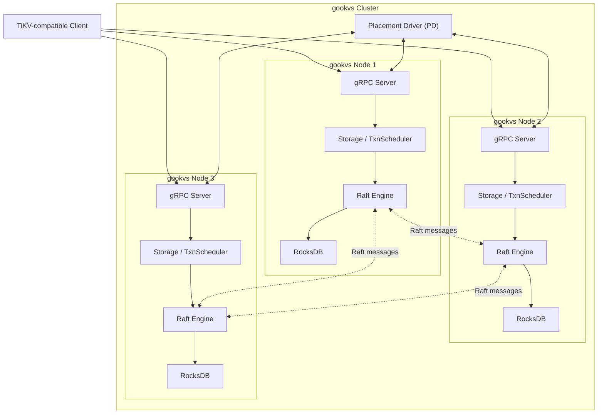
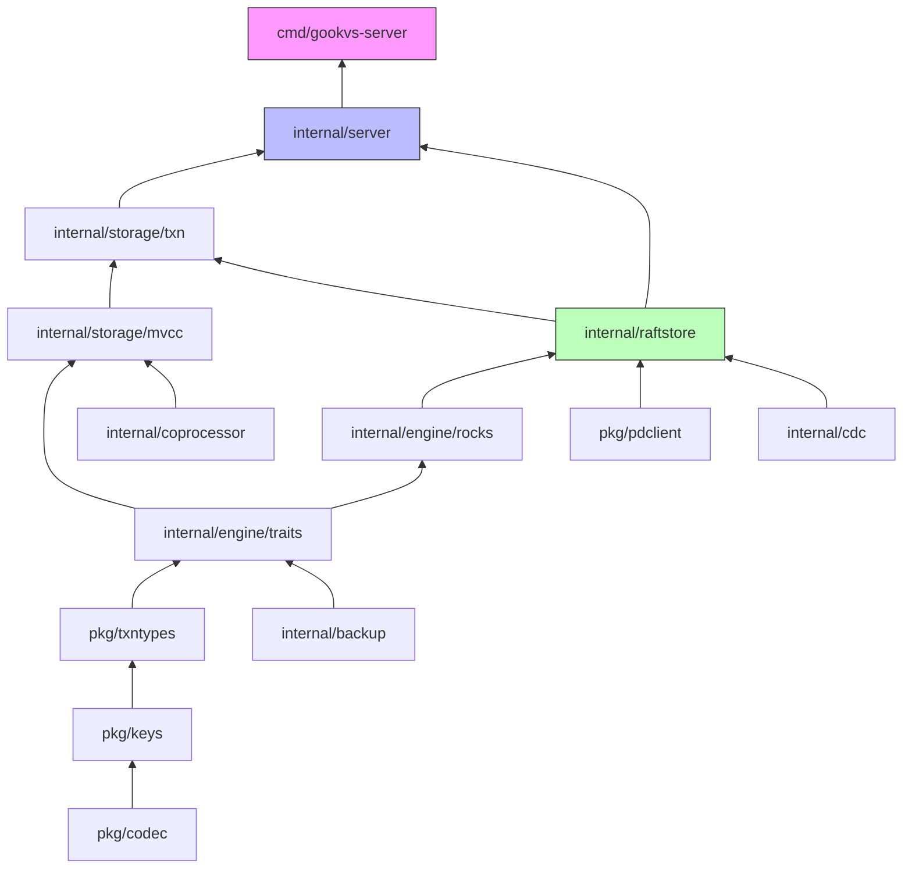
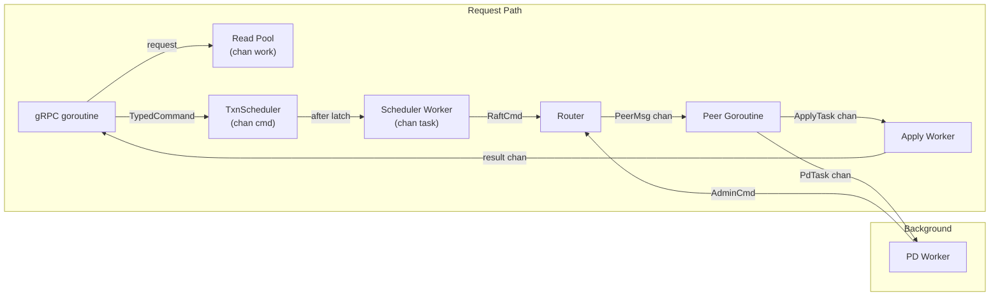
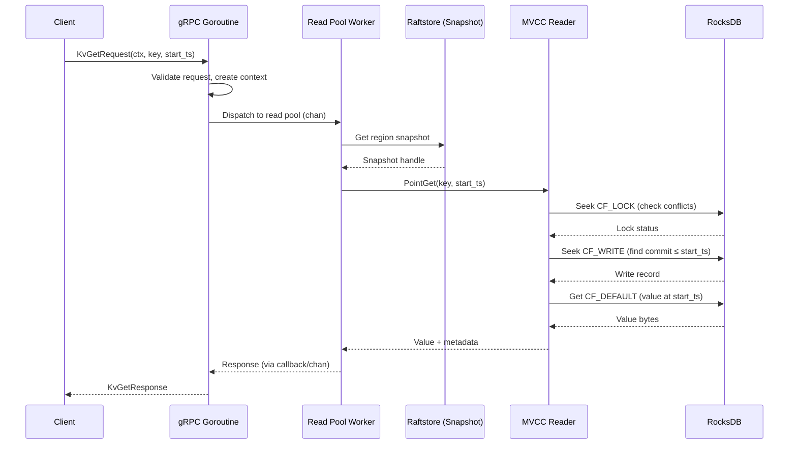
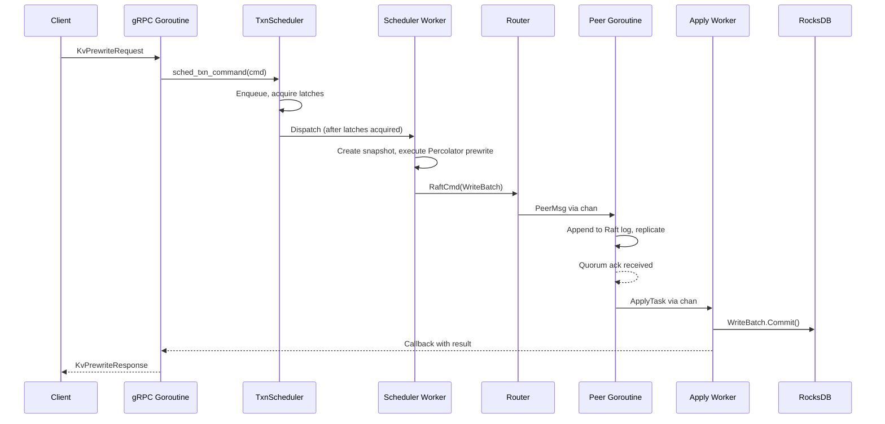

# gookvs Architecture Overview

This document provides a comprehensive architecture overview of gookvs, a Go-based distributed transactional key-value store modeled after TiKV. It serves as the entry point for understanding the system design before diving into subsystem-specific documents.

> **Reference**: [impl_docs/architecture_overview.md](../impl_docs/architecture_overview.md) — TiKV's Rust-based architecture that gookvs draws from.

## 1. System Overview

gookvs is a distributed, transactional key-value database implemented in Go. It provides:

- **ACID-compliant distributed transactions** using a Percolator-based two-phase commit protocol
- **Horizontal scalability** via automatic region-based sharding
- **Strong consistency** through Multi-Raft consensus (one Raft group per region)
- **Multi-Version Concurrency Control (MVCC)** for snapshot isolation reads
- **TiKV client compatibility** — the external gRPC API is wire-compatible with TiKV

gookvs is designed to be a functionally equivalent, idiomatic Go implementation of TiKV's core architecture, leveraging Go's concurrency primitives (goroutines, channels, `sync` package) in place of TiKV's Rust-specific patterns (batch-system FSMs, YATP thread pools, `crossbeam` channels).



## 2. Component Dependency Graph

### 2.1 Go Package Structure

gookvs follows idiomatic Go project layout conventions:

```
gookvs/
├── cmd/                              # Binary entry points
│   ├── gookvs-server/                # Main server binary
│   │   └── main.go
│   └── gookvs-ctl/                   # Admin/diagnostic CLI
│       └── main.go
├── pkg/                              # Public library packages (importable by external tools)
│   ├── codec/                        # Memcomparable byte encoding, number encoding
│   ├── keys/                         # Key encoding/decoding (user key ↔ internal key)
│   ├── txntypes/                     # Transaction type definitions (Lock, Write, Mutation)
│   └── pdclient/                     # Placement Driver client (heartbeats, TSO)
├── internal/                         # Private implementation packages
│   ├── config/                       # Configuration definitions (struct hierarchy, online config)
│   ├── engine/                       # Storage engine abstraction and RocksDB backend
│   │   ├── traits/                   # Engine interface definitions
│   │   └── rocks/                    # RocksDB implementation (via grocksdb)
│   ├── raftstore/                    # Raft consensus & region management
│   │   ├── peer.go                   # Peer goroutine: Raft tick, propose, apply
│   │   ├── store.go                  # Store-level coordination
│   │   ├── router.go                 # Region-based message routing
│   │   └── snap.go                   # Snapshot generation/application
│   ├── storage/                      # Transaction layer, MVCC, scheduler
│   │   ├── mvcc/                     # Multi-Version Concurrency Control
│   │   └── txn/                      # Transaction processing (Percolator actions)
│   ├── server/                       # gRPC server, services, transport
│   │   ├── service.go                # TiKV-compatible gRPC service
│   │   ├── transport.go              # Inter-node Raft message transport
│   │   └── status.go                 # HTTP status/diagnostics server
│   ├── coprocessor/                  # TiDB push-down query execution
│   ├── cdc/                          # Change Data Capture
│   ├── backup/                       # Full backup and log backup (PITR)
│   ├── resource/                     # Resource group QoS and quota control
│   ├── security/                     # TLS, encryption at rest
│   └── util/                         # Shared utilities
├── proto/                            # Protobuf definitions (reuse kvproto)
├── tests/                            # Integration tests
└── go.mod
```

**Divergence from TiKV**: TiKV's 80+ Rust workspace crates are consolidated into Go's simpler `cmd/`/`pkg/`/`internal/` layout. Go's package visibility rules (`internal/` is unexportable) replace Rust's crate-level encapsulation. The `pkg/` directory exposes types needed by external tooling (e.g., backup utilities, CLI tools).

### 2.2 Dependency Layers

Packages are organized in a layered dependency hierarchy (bottom-up):

| Layer | Packages | Role |
|-------|----------|------|
| **L1: Foundational** | `pkg/codec`, `internal/util`, `pkg/keys` | Encoding primitives, shared utilities |
| **L2: Types** | `pkg/txntypes`, `proto/` | Transaction types, protobuf definitions |
| **L3: Security** | `internal/security` | Encryption, TLS, key management |
| **L4: Engine Abstraction** | `internal/engine/traits` | Storage engine interface (Go interfaces) |
| **L5: Engine Impl** | `internal/engine/rocks` | RocksDB backend via grocksdb |
| **L6: Concurrency** | `internal/storage/mvcc` | Lock table, MVCC coordination |
| **L7: Consensus** | `internal/raftstore` | Raft replication, region management |
| **L8: Coordination** | `pkg/pdclient` | PD client, TSO, cluster coordination |
| **L9: Transaction** | `internal/storage/txn` | Percolator protocol, transaction scheduler |
| **L10: Features** | `internal/cdc`, `internal/backup`, `internal/resource` | CDC, backup, resource control |
| **L11: Query** | `internal/coprocessor` | Push-down query execution |
| **L12: Server** | `internal/server` | gRPC server, HTTP status, transport |
| **L13: Application** | `cmd/gookvs-server`, `cmd/gookvs-ctl` | Binary entry points |



## 3. Goroutine Model

gookvs replaces TiKV's dedicated thread pools and batch-system FSMs with goroutines and channels, leveraging Go's runtime scheduler for cooperative multiplexing.

**Divergence from TiKV**: TiKV uses a custom batch-system with PeerFsm/StoreFsm and YATP thread pools. gookvs uses one goroutine per peer (region replica) and worker pools implemented via buffered channels. Go's goroutine scheduler provides the batching and multiplexing that TiKV implements manually.

### 3.1 Goroutine Groups

| Goroutine Group | Cardinality | Purpose | Communication |
|----------------|-------------|---------|---------------|
| **gRPC server goroutines** | Per-connection + per-stream | Handle gRPC I/O | Managed by grpc-go |
| **Read pool workers** | Configurable pool size | All read operations (storage + coprocessor) | Buffered channel work queue |
| **Peer goroutines** | One per region replica | Raft tick, propose, message handling | Per-peer channel (mailbox) |
| **Apply workers** | Configurable pool size | Apply committed Raft entries to RocksDB | Buffered channel from peer goroutines |
| **TxnScheduler workers** | Configurable pool size | Execute transaction commands after latch acquisition | Channel-based task dispatch |
| **PD worker** | 1 | PD heartbeats, split requests, scheduling | Channel-based task queue |
| **CDC worker** | 1 per downstream | Change Data Capture event streaming | Channel with memory quota |
| **Background workers** | Configurable | GC, compaction, statistics | Channel-based task queue |
| **Transport sender** | Per-store connection | Batch and send Raft messages to peers | Buffered channel per store |
| **Status HTTP server** | Per-connection | Diagnostics, metrics, profiling | Standard `net/http` |

### 3.2 Communication Patterns



- **Per-peer channels**: Each peer goroutine owns a buffered `chan PeerMsg` acting as its mailbox. The `Router` maps `region_id → channel` for message dispatch.
- **Apply channel**: Peer goroutines send `ApplyTask` structs through a shared buffered channel consumed by the apply worker pool.
- **Result callbacks**: Write operations use a callback pattern (`func(result)`) or Go channels to signal completion back to the gRPC goroutine.
- **Context cancellation**: `context.Context` propagates deadlines and cancellation from gRPC through the entire request path.

### 3.3 Goroutine-Local State

- **Read pool workers** maintain a goroutine-local engine snapshot reference (passed via closure, not TLS like TiKV).
- **Peer goroutines** exclusively own their `PeerState`, eliminating the need for locks on per-region state.
- **Memory tracking** uses `runtime.MemStats` and per-goroutine allocation estimates for quota enforcement.

## 4. Request Lifecycle

### 4.1 KV Read Request (e.g., `KvGet`)



**Key timing measurements**: `schedule_wait_time` (queue wait in read pool channel), `snapshot_wait_time` (region snapshot acquisition), `process_wall_time` (MVCC execution).

### 4.2 KV Write Request (e.g., `KvPrewrite` — Phase 1 of Percolator 2PC)



### 4.3 KV Commit (Phase 2)

Same flow as prewrite, but:
- Writes **commit record** to CF_WRITE (instead of lock to CF_LOCK)
- **Removes lock** from CF_LOCK
- Returns `TxnStatus::Committed { commit_ts }`

## 5. Cluster Topology

### 5.1 PD-Based Discovery

gookvs nodes do **not** discover each other directly. All coordination flows through the **Placement Driver (PD)** — the same PD used by TiKV/TiDB:

- **Initial bootstrap**: gookvs connects to PD via configured `pd_endpoints`. PD returns cluster membership, store IDs, and the initial region map.
- **Store heartbeats**: Each gookvs node periodically reports store-level stats (capacity, usage, I/O rates, CPU) to PD.
- **Region heartbeats**: Each region leader reports region stats (size, keys, throughput, down/pending peers) to PD.
- **Address resolution**: A PD store address resolver maps store IDs to network addresses, with caching and auto-refresh.

### 5.2 Region Assignment

- PD maintains the authoritative mapping of regions → stores.
- Regions are contiguous key ranges, each replicated across multiple stores as a Raft group.
- Region metadata includes: region ID, key range `[start_key, end_key)`, peer list, region epoch (`conf_ver` + `version`).
- PD balances regions across stores based on reported statistics.

### 5.3 Leader Balancing and Scheduling

PD embeds scheduling instructions in heartbeat responses:

| Operation | Trigger | Effect |
|-----------|---------|--------|
| **Add Peer** | Under-replicated region | Grows replication factor |
| **Remove Peer** | Over-replicated or offline peer | Shrinks replication factor |
| **Transfer Leader** | Load imbalance | Recommends new leader via Raft |
| **Split Region** | Region exceeds size/key threshold | Splits into two regions |
| **Merge Regions** | Adjacent small regions | Merges into one region |

### 5.4 Timestamp Oracle (TSO)

PD provides a globally unique, monotonically increasing timestamp service. gookvs acquires `start_ts` and `commit_ts` from PD's TSO for transaction ordering. The PD client maintains a persistent gRPC stream for TSO requests with automatic batching and reconnection.

## 6. Key Design Decisions: Where gookvs Diverges from TiKV

### 6.1 Goroutines + Channels Instead of Batch-System FSMs

| Aspect | TiKV (Rust) | gookvs (Go) | Rationale |
|--------|-------------|-------------|-----------|
| **Raft message processing** | Batch-system with PeerFsm/StoreFsm, dedicated thread pool, DashMap-based Router | One goroutine per peer, channel-based mailbox, `sync.Map`-based Router | Go's goroutine scheduler provides lightweight M:N scheduling natively; explicit FSM batching is unnecessary |
| **Apply pipeline** | Separate Apply batch-system thread pool | Apply worker pool consuming from shared channel | Same separation of concerns, simpler implementation |
| **Read pool** | YATP thread pool with priority lanes | `goroutine` worker pool with priority channel selection | Go's scheduler + `select` provides equivalent functionality |
| **Background workers** | `WorkerBuilder`-based MPSC, `LazyWorker` | Goroutines with `chan` task queues | Direct mapping; Go channels replace MPSC |

**Trade-off**: Go's goroutine model is simpler but sacrifices TiKV's fine-grained batch processing control. For most workloads the Go runtime scheduler provides sufficient throughput; hot-path optimization (e.g., message coalescing before Raft propose) can be added where profiling indicates need.

### 6.2 Go Interfaces Instead of Rust Traits with Associated Types

TiKV's `engine_traits` uses Rust's associated types for zero-cost abstraction:
```rust
trait KvEngine: Send + Sync {
    type Snapshot: Snapshot;
    type WriteBatch: WriteBatch;
}
```

gookvs uses Go interfaces:
```go
type KvEngine interface {
    NewSnapshot() Snapshot
    NewWriteBatch() WriteBatch
}
```

**Trade-off**: Go interfaces are simpler but involve dynamic dispatch (interface method calls). For the storage engine hot path, concrete type assertions can recover performance where needed.

### 6.3 `context.Context` for Request Lifecycle

TiKV uses `Tracker` structs and manual callback chains. gookvs uses Go's `context.Context` for:
- Deadline propagation from gRPC through the entire request path
- Cancellation on client disconnect
- Request-scoped values (region info, trace ID)

### 6.4 Error Handling

TiKV uses Rust's `Result<T, E>` with custom error enums. gookvs uses Go's `error` interface with wrapped errors (`fmt.Errorf("...: %w", err)`) and sentinel errors for well-known conditions (e.g., `ErrKeyIsLocked`, `ErrWriteConflict`).

## 7. Library Options for Key Infrastructure

### 7.1 gRPC Framework

| Option | Pros | Cons |
|--------|------|------|
| **google.golang.org/grpc** (grpc-go) | Official Go gRPC; extensive ecosystem; TiKV client already uses it; streaming support; interceptor middleware | Large dependency; some performance overhead vs. hand-rolled HTTP/2 |
| **connectrpc.com/connect** | Modern, idiomatic Go; supports gRPC, gRPC-Web, Connect protocols; simpler API | Newer ecosystem; would require custom TiKV proto service mapping; less battle-tested at scale |
| **drpc (storj.io/drpc)** | Lightweight, fast; minimal allocations | Not wire-compatible with standard gRPC; clients would need adaptation |

**Recommendation**: **grpc-go** — wire compatibility with TiKV clients is a hard requirement, and grpc-go's interceptor model provides the middleware hooks needed for flow control, auth, and metrics.

### 7.2 Logging

| Option | Pros | Cons |
|--------|------|------|
| **log/slog** (stdlib) | Zero external dependency; structured logging; Go team maintained; `Handler` interface for custom backends | Newer (Go 1.21+); fewer community handlers; no built-in rotation |
| **go.uber.org/zap** | Very fast (zero-alloc in hot path); battle-tested at scale; rich ecosystem of sinks | External dependency; slightly more complex API |
| **rs/zerolog** | Zero-allocation JSON logging; very simple API | Less flexible output formats; smaller ecosystem than zap |

**Recommendation**: **zap** for production logging (performance-critical paths) with **slog** as the public interface (using a zap backend). This provides stdlib compatibility for library consumers while retaining zap's performance.

### 7.3 Metrics / Observability

| Option | Pros | Cons |
|--------|------|------|
| **prometheus/client_golang** | Industry standard; direct compatibility with Prometheus/Grafana; TiKV ecosystem uses Prometheus | Global registry pattern; some allocation overhead |
| **go.opentelemetry.io/otel** | Unified traces + metrics + logs; vendor-neutral; growing ecosystem | More complex setup; metrics API still maturing |
| **VictoriaMetrics/metrics** | Lightweight; fast; simple API | Less ecosystem support; non-standard exposition |

**Recommendation**: **prometheus/client_golang** — aligns with TiKV ecosystem tooling and enables reuse of existing Grafana dashboards.

## 8. Cross-References

| Subsystem | Document |
|-----------|----------|
| Key encoding, MVCC formats, column families | [Key Encoding and Data Formats](01_key_encoding_and_data_formats.md) |
| Raft protocol, region lifecycle, raftstore | [Raft and Replication](02_raft_and_replication.md) |
| Percolator protocol, MVCC, lock types, GC | [Transaction and MVCC](03_transaction_and_mvcc.md) |
| Coprocessor, DAG executors, expressions | [Coprocessor](04_coprocessor.md) |
| gRPC services, routing, flow control | [gRPC API and Server](05_grpc_api_and_server.md) |
| CDC, backup, PITR, observer pattern | [CDC and Backup](06_cdc_and_backup.md) |
| Resource control, encryption, TLS, config | [Resource Control, Security, and Config](07_resource_control_security_config.md) |
| Priority ranking, implementation order | [Priority and Scope](08_priority_and_scope.md) |
