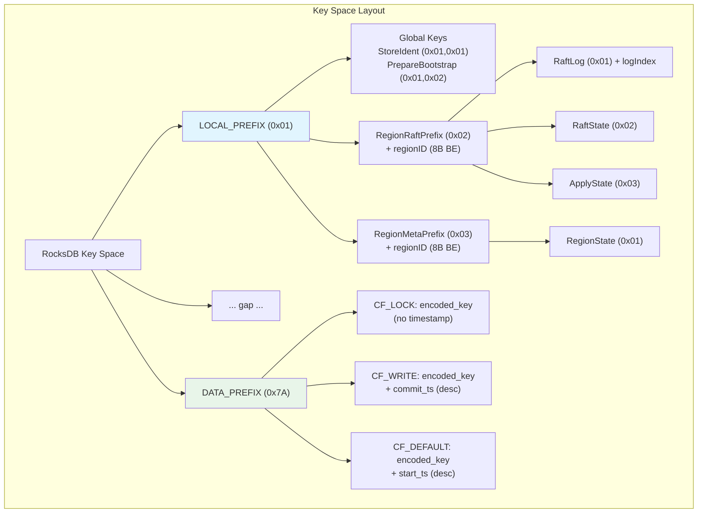
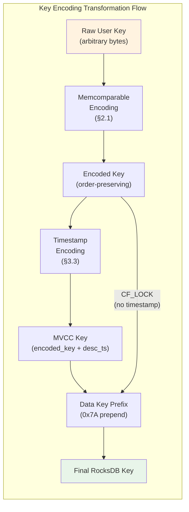
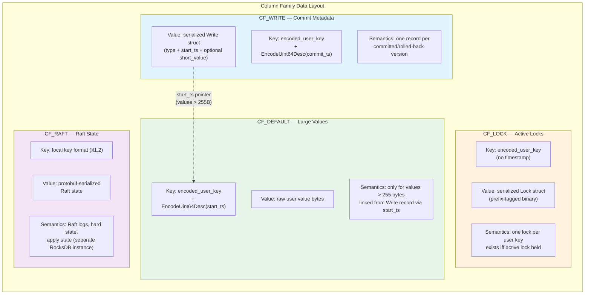

# Key Encoding and Data Formats

This document specifies byte-level key encoding schemes and data formats for gookvs. It provides the foundation for implementing storage layers compatible with TiKV's external key format, enabling client-level wire compatibility.

> **Reference**: [impl_docs/key_encoding_and_data_formats.md](../impl_docs/key_encoding_and_data_formats.md) — TiKV's Rust-based encoding specifications that gookvs replicates at the byte level.

---

## 1. Key Space Organization

gookvs divides its entire key space into two non-overlapping regions using a single-byte prefix, identical to TiKV:

| Prefix | Byte | Range | Purpose |
|--------|------|-------|---------|
| `LOCAL_PREFIX` | `0x01` | `[0x01, 0x02)` | Internal metadata: Raft state, region info, apply state |
| `DATA_PREFIX` | `0x7A` (`'z'`) | `[0x7A, 0x7B)` | User data keys (transaction and raw KV data) |

This prefix scheme is **not a design choice** — it is a compatibility requirement. TiKV clients expect this exact key layout.

### 1.1 Data Key Encoding

User keys are prefixed with `DATA_PREFIX` to form data keys:

```
DataKey(userKey) = [0x7A] + userKey
OriginKey(dataKey) = dataKey[1:]  // strip prefix
```

### 1.2 Local Key Layout

Local keys store Raft and region metadata with a structured prefix hierarchy:

```
LocalKey = [0x01] + [categoryPrefix] + [regionID: 8B BE] + [suffix: 1B] [+ optional subID: 8B BE]
```

**Category prefixes:**

| Category | Byte | Purpose |
|----------|------|---------|
| `RegionRaftPrefix` | `0x02` | Raft logs and hard state |
| `RegionMetaPrefix` | `0x03` | Region metadata (region state) |

**Suffixes under `RegionRaftPrefix`:**

| Suffix | Byte | Key Length | Content |
|--------|------|------------|---------|
| `RaftLogSuffix` | `0x01` | 19 bytes | Raft log entry (subID = logIndex) |
| `RaftStateSuffix` | `0x02` | 11 bytes | Raft hard state (term, vote, commit) |
| `ApplyStateSuffix` | `0x03` | 11 bytes | Apply state (applied_index, truncated_state) |

**Suffixes under `RegionMetaPrefix`:**

| Suffix | Byte | Key Length | Content |
|--------|------|------------|---------|
| `RegionStateSuffix` | `0x01` | 11 bytes | Region state (peers, key range, epoch) |

**Global local keys (no regionID):**

| Key | Bytes | Purpose |
|-----|-------|---------|
| `StoreIdentKey` | `[0x01, 0x01]` | Store identity (cluster_id, store_id) |
| `PrepareBootstrapKey` | `[0x01, 0x02]` | Bootstrap preparation marker |



---

## 2. Memcomparable Byte Encoding

Raw user keys are encoded into a format that preserves lexicographic ordering under byte comparison. This encoding is critical — it enables RocksDB's byte-comparison-based sorting to respect the logical ordering of user keys.

### 2.1 Encoding Algorithm (Ascending Order)

**Constants:**
- `EncGroupSize = 8` — bytes per group
- `EncMarker = 0xFF` — separator/terminator for complete groups
- Padding byte: `0x00`

**Algorithm:**
1. Split input into 8-byte chunks
2. For each **complete** 8-byte chunk: emit 8 bytes + marker `0xFF`
3. For the **final** chunk (0–8 bytes remaining):
   - Pad to 8 bytes with `0x00`
   - Calculate `padCount = 8 - remainingBytes`
   - Emit 8 padded bytes + marker `(0xFF - padCount)`

**Encoded length:** `((len(input) / 8) + 1) * 9` bytes

**Example — encoding `"hello"` (5 bytes):**
```
Input:    [0x68, 0x65, 0x6C, 0x6C, 0x6F]                          (5 bytes)
Padded:   [0x68, 0x65, 0x6C, 0x6C, 0x6F, 0x00, 0x00, 0x00]       (padCount = 3)
Marker:   0xFF - 3 = 0xFC
Encoded:  [0x68, 0x65, 0x6C, 0x6C, 0x6F, 0x00, 0x00, 0x00, 0xFC] (9 bytes)
```

### 2.2 Descending Order Encoding

For descending order (used in timestamp encoding), every byte of the encoded output is bitwise-inverted (`^0xFF`). This ensures larger values sort before smaller ones under unsigned byte comparison.

### 2.3 Ordering Guarantee

For any raw byte sequences `a` and `b`: `a < b` (lexicographic) ⟺ `Encode(a) < Encode(b)` (byte comparison).



---

## 3. Number Encoding

### 3.1 Fixed-Width Integer Encoding

| Type | Size | Encoding | Ordering |
|------|------|----------|----------|
| `uint8` | 1 byte | Direct byte | Ascending |
| `uint16` | 2 bytes | Big-endian | Ascending |
| `uint32` | 4 bytes | Big-endian | Ascending |
| `uint64` | 8 bytes | Big-endian | Ascending |
| `uint64Desc` | 8 bytes | Big-endian of `^v` (bitwise NOT) | Descending |
| `int64` | 8 bytes | Big-endian, sign bit flipped | Comparable ascending |
| `float64` | 8 bytes | Custom bit reordering | Comparable ascending |

### 3.2 Variable-Length Integer Encoding (VarInt)

Used in Lock and Write record serialization for space efficiency:

- Standard LEB128-style encoding
- Maximum encoded length: 10 bytes for uint64
- Used for: `startTS`, `ttl`, counts, and other metadata fields in Lock/Write records

### 3.3 Descending uint64 Encoding

```go
func EncodeUint64Desc(v uint64) [8]byte {
    return binary.BigEndian.PutUint64(^v) // Big-endian of bitwise NOT
}
```

Used for MVCC timestamp encoding in keys — **newer versions (larger timestamps) sort before older ones** in RocksDB's ascending key order.

---

## 4. MVCC Key Format

### 4.1 The Key Type

The `Key` type represents an encoded user key, optionally with an appended timestamp:

```
Key = MemcomparableEncode(rawUserKey) [+ EncodeUint64Desc(timestamp)]
```

### 4.2 Full MVCC Key Layout

```
┌─────────────────────────────────────────────────────────┐
│ memcomparable_encoded_user_key  │  timestamp (8B desc)  │
│      (variable length)          │  (^ts as big-endian)  │
└─────────────────────────────────────────────────────────┘
```

**Byte-level example — user key `"k1"` at timestamp 400:**
```
MemcomparableEncode("k1"):  [0x6B, 0x31, 0x00, 0x00, 0x00, 0x00, 0x00, 0x00, 0xF9]  (9 bytes)
EncodeUint64Desc(400):      [0xFF, 0xFF, 0xFF, 0xFF, 0xFF, 0xFF, 0xFE, 0x6F]         (8 bytes)
Full MVCC key:              [9 bytes encoded key] + [8 bytes inverted ts]              (17 bytes)
```

### 4.3 Timestamp (TimeStamp)

A `TimeStamp` is a `uint64` composed of two parts:

```
TimeStamp = (physicalMS << 18) | logical
```

- **Physical** (upper 46 bits): Unix timestamp in milliseconds
- **Logical** (lower 18 bits): Sequence counter within the same millisecond (up to 262,144 per ms)

Timestamps are obtained from PD's Timestamp Oracle (TSO), which guarantees monotonic allocation across the cluster.

### 4.4 Key Ordering Properties

1. **Same user key, different timestamps:** Newer versions (larger ts) sort **before** older versions — descending timestamp encoding
2. **Different user keys:** Ordered by raw user key — memcomparable preserves order
3. **CF_LOCK keys have no timestamp suffix** — one entry per user key
4. **CF_WRITE and CF_DEFAULT keys include the timestamp** — supporting multiple versions

This ordering enables efficient MVCC reads: a forward seek from `Encode(userKey) + EncodeUint64Desc(readTS)` naturally encounters the most recent visible version first.

---

## 5. Column Family Layouts

gookvs uses four RocksDB column families, matching TiKV's layout exactly for wire compatibility.

```go
const (
    CFDefault = "default"
    CFLock    = "lock"
    CFWrite   = "write"
    CFRaft    = "raft"
)

var DataCFs = []string{CFDefault, CFLock, CFWrite}   // transaction data CFs
var AllCFs  = []string{CFDefault, CFLock, CFWrite, CFRaft}
```



### 5.1 CF_DEFAULT — Value Storage

| Aspect | Detail |
|--------|--------|
| **Key format** | `encoded_user_key + EncodeUint64Desc(start_ts)` |
| **Value** | Raw user value bytes |
| **Purpose** | Stores values exceeding `ShortValueMaxLen` (255 bytes) |
| **When used** | Only when value > 255 bytes; smaller values are inlined in CF_WRITE |

### 5.2 CF_LOCK — Lock Storage

| Aspect | Detail |
|--------|--------|
| **Key format** | `encoded_user_key` (no timestamp) |
| **Value** | Serialized `Lock` struct (§6) |
| **Purpose** | Active transaction locks for concurrency control |
| **Semantics** | Key exists iff there is an active lock; enforces single-writer per key |

### 5.3 CF_WRITE — Write Record Storage

| Aspect | Detail |
|--------|--------|
| **Key format** | `encoded_user_key + EncodeUint64Desc(commit_ts)` |
| **Value** | Serialized `Write` struct (§7) |
| **Purpose** | Commit metadata and version history |
| **Contains** | One record per committed (or rolled-back) version |

### 5.4 CF_RAFT — Raft State Storage

| Aspect | Detail |
|--------|--------|
| **Key format** | Local key format (§1.2) |
| **Value** | Protobuf-serialized Raft state |
| **Purpose** | Raft log entries, hard state, apply state |
| **Note** | Stored in a separate RocksDB instance for independent compaction |

---

## 6. Lock Record Format

### 6.1 Lock Struct

```go
// Lock represents an active transaction lock on a user key.
type Lock struct {
    LockType    LockType
    Primary     []byte      // Primary key of the transaction
    StartTS     TimeStamp   // Transaction start timestamp
    TTL         uint64      // Time-to-live in milliseconds
    ShortValue  []byte      // Inlined value (≤255 bytes), nil if absent
    ForUpdateTS TimeStamp   // Pessimistic lock timestamp
    TxnSize     uint64      // Hint for transaction size
    MinCommitTS TimeStamp   // Minimum allowed commit timestamp
    UseAsyncCommit bool     // Async commit protocol flag
    Secondaries [][]byte    // Secondary keys for async commit
    RollbackTS  []TimeStamp // Collapsed rollback timestamps
    LastChange  LastChange  // MVCC optimization hint
    TxnSource   uint64      // Transaction origin identifier
    PessimisticLockWithConflict bool
    Generation  uint64      // Pipelined DML generation
}

// LastChange records information about the previous data-changing version
// for MVCC read optimization (skip over Lock/Rollback records).
type LastChange struct {
    TS                TimeStamp
    EstimatedVersions uint64
}
```

### 6.2 Lock Type Constants

```go
type LockType byte

const (
    LockTypePut        LockType = 'P' // 0x50 — Write intent (optimistic)
    LockTypeDelete     LockType = 'D' // 0x44 — Delete intent
    LockTypeLock       LockType = 'L' // 0x4C — Read lock (SELECT FOR UPDATE, no modification)
    LockTypePessimistic LockType = 'S' // 0x53 — Pessimistic lock placeholder
)
```

### 6.3 Serialized Layout

The Lock is serialized as a variable-length byte sequence with prefix-tagged optional fields. This format is **byte-identical** to TiKV's for storage compatibility.

```
┌────────────────────────────────────────────────────────────────────┐
│ Required fields (always present):                                  │
│   [lockType: 1B]                                                   │
│   [primaryLen: varint] [primaryBytes: N bytes]                     │
│   [startTS: varint]                                                │
│   [ttl: varint]                                                    │
├────────────────────────────────────────────────────────────────────┤
│ Optional fields (prefix-tagged, order-dependent):                  │
│   'v' (0x76) [len: 1B] [value: len bytes]    — short_value        │
│   'f' (0x66) [forUpdateTS: 8B BE]            — pessimistic ts     │
│   't' (0x74) [txnSize: 8B BE]               — transaction size    │
│   'c' (0x63) [minCommitTS: 8B BE]           — min commit ts       │
│   'a' (0x61) [count: varint] {[len: varint] [key: N bytes]}*      │
│                                              — async commit keys   │
│   'r' (0x72) [count: varint] [ts: 8B BE]*   — rollback ts list    │
│   'l' (0x6C) [ts: 8B BE] [versions: varint] — last change hint    │
│   's' (0x73) [source: varint]               — txn source           │
│   'F' (0x46)                                 — pessimistic w/      │
│                                                conflict flag       │
│   'g' (0x67) [generation: 8B BE]            — pipelined gen       │
└────────────────────────────────────────────────────────────────────┘
```

### 6.4 Key Method Signatures

```go
// MarshalLock serializes a Lock into the TiKV-compatible binary format.
func (l *Lock) Marshal() []byte

// UnmarshalLock deserializes a Lock from the TiKV-compatible binary format.
func UnmarshalLock(data []byte) (*Lock, error)

// ToLockInfo converts a Lock to the protobuf LockInfo for client responses.
func (l *Lock) ToLockInfo(key []byte) *kvrpcpb.LockInfo

// IsExpired checks whether the lock has exceeded its TTL.
func (l *Lock) IsExpired(currentTS TimeStamp) bool
```

---

## 7. Write Record Format

### 7.1 Write Struct

```go
// Write represents a committed (or rolled-back) version of a user key.
type Write struct {
    WriteType            WriteType
    StartTS              TimeStamp  // Transaction start timestamp (points to CF_DEFAULT for large values)
    ShortValue           []byte     // Inlined value (≤255 bytes), nil if absent
    HasOverlappedRollback bool      // Indicates an overlapped rollback was detected
    GCFence              *TimeStamp // GC safety boundary (nil if absent)
    LastChange           LastChange // MVCC read optimization hint
    TxnSource            uint64     // Transaction origin identifier
}
```

### 7.2 Write Type Constants

```go
type WriteType byte

const (
    WriteTypePut      WriteType = 'P' // 0x50 — Data was written
    WriteTypeDelete   WriteType = 'D' // 0x44 — Data was deleted
    WriteTypeLock     WriteType = 'L' // 0x4C — Lock-only transaction (no data change)
    WriteTypeRollback WriteType = 'R' // 0x52 — Transaction was rolled back
)
```

### 7.3 Serialized Layout

```
┌────────────────────────────────────────────────────────────────────┐
│ Required fields:                                                   │
│   [writeType: 1B]                                                  │
│   [startTS: varint]                                                │
├────────────────────────────────────────────────────────────────────┤
│ Optional fields (prefix-tagged):                                   │
│   'v' (0x76) [len: 1B] [value: len bytes]    — short_value        │
│   'R' (0x52)                                  — overlapped rollback│
│   'F' (0x46) [gcFence: 8B BE]               — GC fence timestamp  │
│   'l' (0x6C) [ts: 8B BE] [versions: varint] — last change hint    │
│   'S' (0x53) [source: varint]               — txn source           │
└────────────────────────────────────────────────────────────────────┘
```

### 7.4 Short Value Optimization

```go
const (
    ShortValueMaxLen = 255
    ShortValuePrefix = byte('v') // 0x76
)
```

- Values ≤ 255 bytes are stored **inline** in the Write record under the `'v'` prefix
- Values > 255 bytes are stored in **CF_DEFAULT** keyed by `(encoded_user_key, start_ts)`
- The Write record's `StartTS` field serves as the pointer to locate the full value in CF_DEFAULT

This avoids a second CF lookup for the majority of small values (typical in OLTP workloads).

### 7.5 Key Method Signatures

```go
// Marshal serializes a Write into the TiKV-compatible binary format.
func (w *Write) Marshal() []byte

// UnmarshalWrite deserializes a Write from the TiKV-compatible binary format.
func UnmarshalWrite(data []byte) (*Write, error)

// NeedValue returns true if the value must be fetched from CF_DEFAULT.
func (w *Write) NeedValue() bool

// IsDataChanged returns true if this write represents a Put or Delete (not Lock/Rollback).
func (w *Write) IsDataChanged() bool
```

---

## 8. Go Struct Definitions for Internal Data Representations

### 8.1 Key Type

```go
// Key represents an encoded user key, optionally with a timestamp suffix.
// The underlying bytes are memcomparable-encoded for order-preserving storage.
type Key []byte

// FromRaw creates a Key by memcomparable-encoding the raw user key bytes.
func KeyFromRaw(raw []byte) Key

// ToRaw decodes the Key back to the original raw user key bytes.
func (k Key) ToRaw() ([]byte, error)

// AppendTS appends a descending-encoded timestamp to the key for MVCC versioning.
func (k Key) AppendTS(ts TimeStamp) Key

// SplitTS splits the key into the encoded user key portion and the timestamp.
func (k Key) SplitTS() (Key, TimeStamp, error)

// HasTS returns true if the key has a timestamp suffix (len >= 8 + minimum encoded length).
func (k Key) HasTS() bool

// Cmp compares two keys lexicographically.
func (k Key) Cmp(other Key) int
```

### 8.2 TimeStamp Type

```go
// TimeStamp represents a hybrid logical clock value from PD's TSO.
type TimeStamp uint64

const (
    TSLogicalBits = 18
    TSMax         = TimeStamp(math.MaxUint64)
    TSZero        = TimeStamp(0)
)

// Physical returns the physical (millisecond) component.
func (ts TimeStamp) Physical() int64

// Logical returns the logical (sequence) component.
func (ts TimeStamp) Logical() int64

// Compose creates a TimeStamp from physical and logical components.
func ComposeTS(physical int64, logical int64) TimeStamp

// IsZero returns true if the timestamp is zero (unset).
func (ts TimeStamp) IsZero() bool

// Prev returns the immediately preceding timestamp.
func (ts TimeStamp) Prev() TimeStamp

// Next returns the immediately following timestamp.
func (ts TimeStamp) Next() TimeStamp
```

### 8.3 Mutation Type

```go
// Mutation represents a client-submitted key mutation, converted from kvrpcpb.Mutation.
type Mutation struct {
    Op        MutationOp
    Key       Key
    Value     []byte     // nil for Delete/Lock/CheckNotExists
    Assertion Assertion
}

type MutationOp byte

const (
    MutationPut             MutationOp = iota // Write a value
    MutationDelete                            // Delete a key
    MutationLock                              // Acquire read lock (no data change)
    MutationInsert                            // Put with key-not-exists constraint
    MutationCheckNotExists                    // Assert key does not exist
)

type Assertion byte

const (
    AssertionNone     Assertion = iota
    AssertionExist              // Key must exist
    AssertionNotExist           // Key must not exist
)
```

### 8.4 Local Key Builders

```go
// Package keys provides functions for constructing internal key encodings.

// DataKey prepends DATA_PREFIX to a user key for storage in data CFs.
func DataKey(key []byte) []byte

// OriginKey strips DATA_PREFIX from a data key to recover the user key.
func OriginKey(dataKey []byte) []byte

// RaftLogKey builds the local key for a Raft log entry.
func RaftLogKey(regionID uint64, logIndex uint64) []byte

// RaftStateKey builds the local key for a region's Raft hard state.
func RaftStateKey(regionID uint64) []byte

// ApplyStateKey builds the local key for a region's apply state.
func ApplyStateKey(regionID uint64) []byte

// RegionStateKey builds the local key for a region's metadata.
func RegionStateKey(regionID uint64) []byte
```

---

## 9. MVCC Read Path — Key Format in Action

To illustrate how these formats work together, here is the key lookup sequence for an MVCC point read at `readTS`:

```
1. Check lock:     CF_LOCK[Encode(userKey)]
                   → If lock exists with ts ≤ readTS, report conflict

2. Find version:   Seek CF_WRITE to Encode(userKey) + EncodeUint64Desc(readTS)
                   → Scan forward (descending ts) to find first Write with commitTS ≤ readTS
                   → Read Write record: extract writeType and startTS

3. Read value:     If writeType == Put:
                     If shortValue present → return inline value
                     Else → CF_DEFAULT[Encode(userKey) + EncodeUint64Desc(startTS)]
                   If writeType == Delete → return "not found"
```

This design ensures:
- Lock checks are O(1) point lookups (no timestamp in lock keys)
- Version scans naturally find the newest visible version first (descending timestamp order)
- Small values require only one CF lookup (short value optimization)

---

## 10. Protobuf Message Handling

### 10.1 Reuse of TiKV's Proto Definitions

gookvs **reuses TiKV's `.proto` definitions** from the [kvproto](https://github.com/pingcap/kvproto) repository. This is essential for wire compatibility with TiKV clients and the PD cluster.

Key proto packages used in the storage/encoding layer:

| Proto Package | Purpose | Key Types |
|---------------|---------|-----------|
| `kvrpcpb` | KV RPC protocol | `Mutation`, `Op`, `LockInfo`, `WriteConflictReason`, `Assertion`, `IsolationLevel` |
| `metapb` | Cluster metadata | `Region`, `Peer`, `RegionEpoch` |
| `eraftpb` | Raft protocol | `Entry`, `HardState`, `Snapshot`, `Message` |
| `raft_serverpb` | Raft server | `RaftMessage`, `RegionLocalState`, `RaftApplyState` |

### 10.2 Proto-to-Internal Conversion Pattern

gookvs follows the same boundary as TiKV: protobuf types live at the RPC boundary, while internal types use Go-native representations for performance and ergonomics.

```go
// Convert from protobuf to internal representation
func MutationFromProto(pb *kvrpcpb.Mutation) Mutation

// Convert from internal representation to protobuf (for responses)
func (l *Lock) ToLockInfo(key []byte) *kvrpcpb.LockInfo
```

### 10.3 Serialization Conventions

| Data Type | Encoding | Reason |
|-----------|----------|--------|
| Raft state, region metadata, RPC messages | Protobuf binary | Standard interchange format |
| Lock and Write records | Custom prefix-tagged binary (§6, §7) | Space efficiency in hot path |
| User keys in storage | Memcomparable byte encoding (§2) | Order-preserving for RocksDB |
| Numeric fields in keys | Big-endian fixed-width (§3) | Byte-comparable ordering |
| Numeric fields in values | VarInt (§3.2) | Space efficiency |

**Design decision**: Lock and Write records use a custom compact binary format (not protobuf) because they are the most frequently serialized/deserialized data structures in the system. The prefix-tagged format provides forward compatibility while being significantly more compact than protobuf for these small, fixed-schema records.

---

## 11. RocksDB Go Binding Options

gookvs requires a Go binding for RocksDB that supports column families, custom comparators, write batches, snapshots, and SST file operations.

| Criteria | [grocksdb](https://github.com/linxGnu/grocksdb) | [gorocksdb](https://github.com/tecbot/gorocksdb) | [pebble](https://github.com/cockroachdb/pebble) |
|----------|-----------|------------|--------|
| **Binding type** | CGo wrapper around RocksDB C API | CGo wrapper around RocksDB C API | Pure Go (RocksDB-compatible) |
| **Maintenance** | Actively maintained, tracks RocksDB releases | Unmaintained (archived) | Actively maintained by CockroachDB team |
| **Column families** | Full support | Full support | Full support (since v2) |
| **Snapshots** | Full support | Full support | Full support |
| **SST import/export** | Full support | Partial | Full support |
| **Write batches** | Full support | Full support | Full support |
| **RocksDB version** | Tracks latest (8.x+) | Stuck on old version | N/A (own format, RocksDB-compatible reads) |
| **Build complexity** | Requires RocksDB C library | Requires RocksDB C library | Pure Go, no CGo required |
| **Performance** | Native RocksDB performance | Native RocksDB performance | ~90-95% of RocksDB for most workloads |
| **Cross-compilation** | Difficult (CGo + C++ deps) | Difficult (CGo + C++ deps) | Easy (pure Go) |
| **Community** | Go TiKV ecosystem uses this | Legacy, not recommended | Large production user (CockroachDB) |
| **Compaction filter** | Supported via C API | Limited | Custom table-level operations |

### Recommendation

**Primary: grocksdb** — The closest match to TiKV's storage model. Provides full RocksDB feature parity including compaction filters (needed for GC), precise CF control, and SST operations. The Go TiKV client ecosystem already uses this library.

**Alternative: pebble** — Worth considering if CGo build complexity becomes a significant pain point. Pure Go with excellent performance. However, some advanced RocksDB features (compaction filters, certain tuning options) work differently, requiring adaptation.

**Not recommended: gorocksdb** — Archived and unmaintained. No path forward for bug fixes or RocksDB version updates.

---

## 12. Go Codec Package Design

The `pkg/codec` package provides the encoding primitives used throughout gookvs:

```go
// Package codec provides memcomparable encoding and number encoding functions.
// These encodings are byte-identical to TiKV's for wire and storage compatibility.
package codec

// EncodeBytes encodes a byte slice using memcomparable encoding (ascending order).
// The encoded output preserves lexicographic ordering under byte comparison.
func EncodeBytes(dst []byte, data []byte) []byte

// EncodeBytesDesc encodes a byte slice using memcomparable encoding (descending order).
func EncodeBytesDesc(dst []byte, data []byte) []byte

// DecodeBytes decodes a memcomparable-encoded byte slice. Returns remaining bytes after decode.
func DecodeBytes(data []byte) ([]byte, []byte, error)

// DecodeBytesDesc decodes a descending memcomparable-encoded byte slice.
func DecodeBytesDesc(data []byte) ([]byte, []byte, error)

// EncodeUint64 encodes a uint64 in big-endian (ascending) order.
func EncodeUint64(dst []byte, v uint64) []byte

// EncodeUint64Desc encodes a uint64 in descending order (big-endian of ^v).
func EncodeUint64Desc(dst []byte, v uint64) []byte

// DecodeUint64 decodes a big-endian uint64. Returns remaining bytes.
func DecodeUint64(data []byte) (uint64, []byte, error)

// DecodeUint64Desc decodes a descending uint64. Returns remaining bytes.
func DecodeUint64Desc(data []byte) (uint64, []byte, error)

// EncodeVarint encodes a uint64 using LEB128 variable-length encoding.
func EncodeVarint(dst []byte, v uint64) []byte

// DecodeVarint decodes a LEB128 variable-length uint64. Returns remaining bytes.
func DecodeVarint(data []byte) (uint64, []byte, error)
```

---

## Design Divergences from TiKV

| Aspect | TiKV (Rust) | gookvs (Go) | Rationale |
|--------|-------------|-------------|-----------|
| **Key type** | `Key` is `Vec<u8>` wrapper with methods | `Key` is `[]byte` type alias | Go's slice semantics provide the same functionality |
| **Encoding return style** | Returns `Result<Vec<u8>>` | Appends to `dst []byte`, returns `[]byte` | Go convention: reuse buffers to reduce GC pressure |
| **VarInt implementation** | Custom LEB128 in `components/codec` | Use `encoding/binary.PutUvarint` where possible, custom for compatibility | Leverage Go stdlib where byte-compatible |
| **Error handling** | `Result<T, E>` types | `(T, error)` returns | Go idiom |
| **Lock/Write serialization** | Custom binary format in `txn_types` | Byte-identical custom binary format | Must match TiKV's format exactly for storage compatibility |

---

## Cross-References

- **Architecture Overview**: [00_architecture_overview.md](00_architecture_overview.md) — system context and request lifecycle
- **Raft and Replication**: `design_docs/02_raft_and_replication.md` (planned) — Raft state stored in local keys and CF_RAFT
- **Transaction and MVCC**: `design_docs/03_transaction_and_mvcc.md` (planned) — Percolator protocol, conflict detection, GC
- **Priority and Scope**: [08_priority_and_scope.md](08_priority_and_scope.md) — component prioritization including key encoding subsystem
