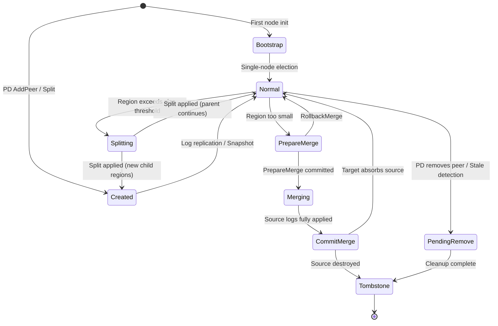
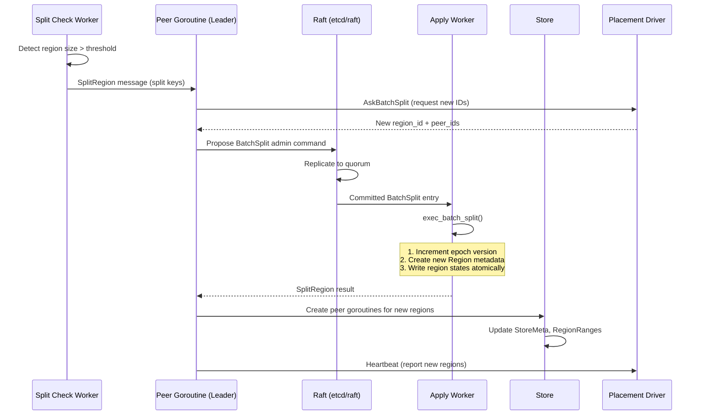
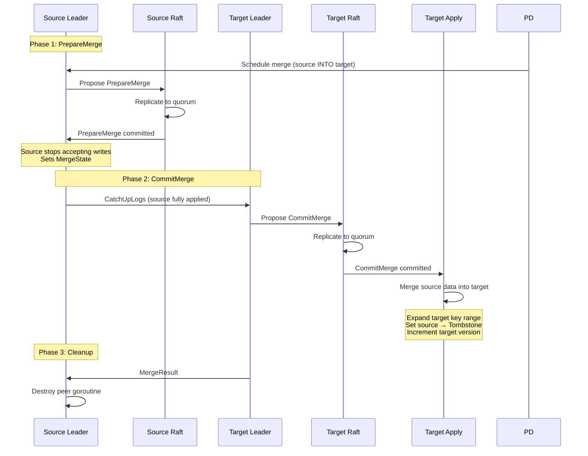
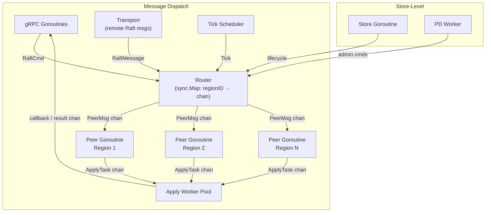
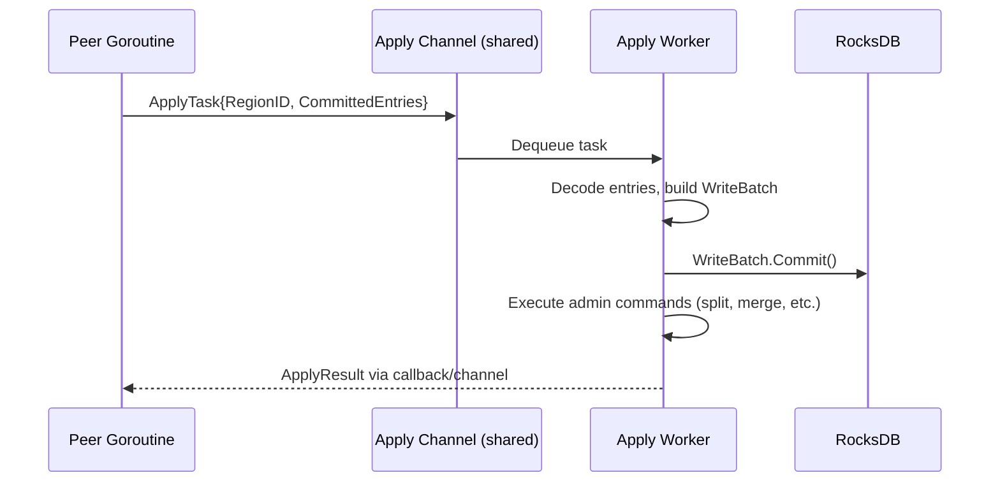
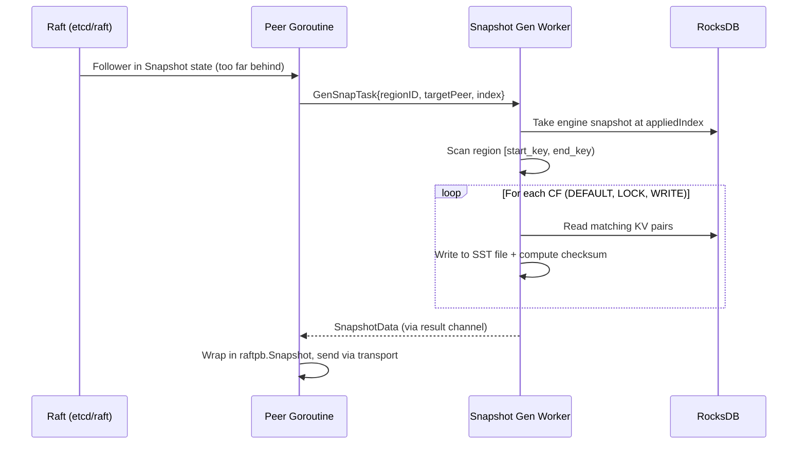

# Raft and Replication

This document specifies the Raft consensus, region management, and replication layer for gookvs. It covers the Go Raft library selection, region abstraction, region lifecycle (creation, split, merge), channel-based message dispatch (replacing TiKV's batch-system), snapshot mechanics, and safety invariants.

> **Reference**: [impl_docs/raft_and_replication.md](../impl_docs/raft_and_replication.md) — TiKV's Rust-based raftstore that gookvs draws from, adapted to Go's concurrency model.

---

## 1. Go Raft Library Selection

gookvs wraps an external Raft library for core consensus — it does **not** reimplement the Raft algorithm. The library must provide: leader election, log replication, membership changes (including joint consensus), snapshotting, and a poll-based `Ready` API.

### 1.1 Library Options

| Option | Pros | Cons |
|--------|------|------|
| **etcd/raft** (`go.etcd.io/raft/v3`) | Battle-tested (etcd, CockroachDB); poll-based `Ready` API matching TiKV's raft-rs pattern; supports PreVote, joint consensus (`ConfChangeV2`), learners, non-voting members; actively maintained by etcd team; extensive test suite | Lower-level API requires more integration work; no built-in transport; documentation could be better |
| **hashicorp/raft** | Higher-level API with built-in transport, snapshots, and log storage; widely used (Consul, Nomad, Vault); good documentation | Opinionated architecture (owns goroutines, transport, storage); `Future`-based API doesn't map to TiKV's `Ready` pattern; no joint consensus support; harder to implement region-per-group model |
| **dragonboat** (`github.com/lni/dragonboat`) | Multi-group Raft out of the box; high performance; built-in snapshot streaming and log storage | Opinionated runtime (owns goroutine scheduling); less control over per-region lifecycle; smaller community; harder to customize for TiKV-compatible semantics |

**Recommendation**: **etcd/raft** — its poll-based `Ready` API is structurally identical to raft-rs (which TiKV uses), enabling a near 1:1 mapping of the raftstore integration logic. The lack of built-in transport is actually an advantage: gookvs needs custom region-aware message routing that no library provides out of the box.

### 1.2 Key Types from etcd/raft

| Type | Purpose |
|------|---------|
| `raft.RawNode` | Main Raft state machine; accepts proposals, steps messages, produces `Ready` |
| `raft.Ready` | Bundle of pending state changes: entries, committed entries, messages, snapshots, hard/soft state |
| `raft.Storage` (interface) | gookvs implements this to provide persistent log access |
| `raftpb.Message` | Raft protocol messages (MsgApp, MsgVote, MsgHeartbeat, etc.) |
| `raftpb.Entry` | Log entry: `(Term, Index, Type, Data)` |
| `raftpb.HardState` | Persistent Raft state: `(Term, Vote, Commit)` |
| `raftpb.ConfState` | Cluster membership: Voters and Learners |
| `raftpb.Snapshot` | Snapshot metadata and data blob |

### 1.3 RawNode Lifecycle in Go

The `RawNode` API drives the Raft state machine through a poll-based loop, run inside each peer goroutine:

```go
func (p *Peer) run(ctx context.Context) {
    ticker := time.NewTicker(p.cfg.RaftBaseTickInterval)
    defer ticker.Stop()

    for {
        select {
        case <-ctx.Done():
            return
        case <-ticker.C:
            p.rawNode.Tick()
        case msg := <-p.mailbox:
            p.handleMessage(msg)
        }

        if p.rawNode.HasReady() {
            rd := p.rawNode.Ready()

            // 1. Persist entries and hard state
            p.storage.SaveReady(rd)

            // 2. Send messages to peers via router
            p.sendMessages(rd.Messages)

            // 3. Apply committed entries
            p.sendToApply(rd.CommittedEntries)

            // 4. Install snapshot if present
            if !raft.IsEmptySnap(rd.Snapshot) {
                p.applySnapshot(rd.Snapshot)
            }

            // 5. Advance the state machine
            p.rawNode.Advance(rd)
        }
    }
}
```

**Divergence from TiKV**: TiKV drives `RawNode` from a batch-system poll handler that processes multiple peers per thread. gookvs runs one goroutine per peer, with the Go runtime scheduler providing the multiplexing that TiKV implements manually via its batch-system.

### 1.4 Storage Interface Implementation

gookvs implements `raft.Storage` via a `PeerStorage` struct:

```go
// PeerStorage implements raft.Storage for a single region.
type PeerStorage struct {
    regionID    uint64
    raftEngine  engine.RaftEngine       // Persistent Raft log storage
    cache       *EntryCache             // In-memory LRU cache of recent entries
    raftState   raftpb.HardState        // Persisted: term, vote, commit
    applyState  ApplyState              // Persisted: applied_index, truncated_state
}

// raft.Storage interface
func (s *PeerStorage) InitialState() (raftpb.HardState, raftpb.ConfState, error)
func (s *PeerStorage) Entries(lo, hi, maxSize uint64) ([]raftpb.Entry, error)
func (s *PeerStorage) Term(i uint64) (uint64, error)
func (s *PeerStorage) LastIndex() (uint64, error)
func (s *PeerStorage) FirstIndex() (uint64, error)
func (s *PeerStorage) Snapshot() (raftpb.Snapshot, error)
```

**Key index invariants** (same as TiKV):

```
truncatedIndex < firstIndex <= appliedIndex <= commitIndex <= lastIndex
```

- `truncatedIndex`: Oldest retained log entry (entries before this are GC'd)
- `firstIndex`: `truncatedIndex + 1` (first available entry)
- `appliedIndex`: Highest entry applied to state machine
- `commitIndex`: Highest entry replicated on a majority
- `lastIndex`: Highest entry in the log

### 1.5 Raft Configuration

| Parameter | Default | Description |
|-----------|---------|-------------|
| `RaftBaseTickInterval` | 100ms | Base unit for all tick intervals |
| `RaftHeartbeatTicks` | 2 | Heartbeat every 2 ticks (200ms) |
| `RaftElectionTimeoutTicks` | 10 | Election timeout is 10 ticks (1000ms) |
| `RaftMaxInflightMsgs` | 256 | Max unacknowledged messages in flight |
| `RaftMaxSizePerMsg` | 1 MiB | Maximum size of individual Raft messages |
| `RaftEntryMaxSize` | 8 MiB | Maximum single entry size |
| `CheckQuorum` | true | Leader must maintain quorum contact |
| `PreVote` | true | Enable PreVote phase for safer elections |

```go
func (cfg *RaftstoreConfig) toRaftConfig(peerID uint64) *raft.Config {
    return &raft.Config{
        ID:              peerID,
        ElectionTick:    cfg.RaftElectionTimeoutTicks,
        HeartbeatTick:   cfg.RaftHeartbeatTicks,
        MaxInflightMsgs: cfg.RaftMaxInflightMsgs,
        MaxSizePerMsg:   cfg.RaftMaxSizePerMsg,
        CheckQuorum:     true,
        PreVote:         cfg.PreVote,
        Storage:         peerStorage,
    }
}
```

---

## 2. Region Abstraction

### 2.1 Region Definition

A **region** is a contiguous key range managed by a single Raft group. Defined in kvproto (reused from TiKV):

```protobuf
message Region {
    uint64 id = 1;                      // Unique region ID (assigned by PD)
    bytes start_key = 2;                // Inclusive start key
    bytes end_key = 3;                  // Exclusive end key (empty = +∞)
    RegionEpoch region_epoch = 4;       // Versioning for staleness detection
    repeated Peer peers = 5;            // All replicas in this Raft group
}

message RegionEpoch {
    uint64 conf_ver = 1;                // Incremented on membership change
    uint64 version = 2;                 // Incremented on split/merge
}

message Peer {
    uint64 id = 1;                      // Unique peer ID (assigned by PD)
    uint64 store_id = 2;                // Which store hosts this peer
    PeerRole role = 3;                  // Voter / Learner / IncomingVoter / DemotingVoter
    bool is_witness = 4;                // Witness peer (no data, only votes)
}
```

**Key range semantics**: A key `k` belongs to region `R` iff `R.start_key <= k < R.end_key`. Empty `end_key` means unbounded (extends to +infinity).

### 2.2 Region Epoch Semantics

The epoch is a two-component version vector preventing stale operations:

- **`version`**: Incremented on **split** and **merge** — tracks key range changes
- **`conf_ver`**: Incremented on **membership change** (add/remove peer) — tracks replica set changes

**Which operations check/change which epoch component:**

| Admin Command | Check ver | Check conf_ver | Change ver | Change conf_ver |
|---------------|-----------|----------------|------------|-----------------|
| `ChangePeer` | | yes | | yes |
| `Split` / `BatchSplit` | yes | yes | yes | |
| `PrepareMerge` | yes | yes | yes | yes |
| `CommitMerge` | yes | yes | yes | |
| `RollbackMerge` | yes | yes | yes | |
| `TransferLeader` | | | | |
| `CompactLog` | | | | |

**Request validation**: Client sends request with cached `RegionEpoch`. Server compares via `CheckRegionEpoch()`. If stale, returns `EpochNotMatch` error with current region info. Client updates cache and retries. Normal read/write requests only check `version` (key range validity), not `conf_ver`.

```go
// CheckRegionEpoch validates that the request's epoch is not stale.
func CheckRegionEpoch(reqEpoch, currentEpoch *metapb.RegionEpoch, checkConfVer bool) error
```

### 2.3 Go Interface Definitions

```go
// Region represents a Raft group managing a contiguous key range.
type Region struct {
    Meta       metapb.Region       // Protobuf region metadata
    LeaderID   uint64              // Current leader peer ID (0 if unknown)
}

// RaftNode wraps etcd/raft.RawNode with region-aware application logic.
type RaftNode struct {
    rawNode    *raft.RawNode
    storage    *PeerStorage
    regionID   uint64
    peerID     uint64
    term       uint64              // Current term (cached from RawNode)
    leaderID   uint64              // Current leader (0 if unknown)
    proposals  *ProposalQueue      // Tracks in-flight client proposals
    lease      *Lease              // Leader lease for local reads
}

// MessageRouter dispatches Raft messages to peer goroutines and remote stores.
type MessageRouter interface {
    // Send delivers a message to a local peer's mailbox.
    // Returns ErrRegionNotFound if the region is not on this store.
    Send(regionID uint64, msg PeerMsg) error

    // SendRaftMessage delivers a Raft protocol message.
    // Routes locally if the target peer is on this store, otherwise to transport.
    SendRaftMessage(msg *raftpb.Message) error

    // Broadcast sends a message to all local peer mailboxes.
    Broadcast(msg PeerMsg)
}
```

### 2.4 Region Metadata Storage

**In-memory** — `StoreMeta`:

```go
// StoreMeta holds store-level region metadata, protected by sync.RWMutex.
type StoreMeta struct {
    mu            sync.RWMutex
    StoreID       uint64
    RegionRanges  *btree.BTreeG[RegionRangeItem]  // end_key -> region_id (ordered)
    Regions       map[uint64]*metapb.Region         // region_id -> Region
    Readers       map[uint64]*ReadDelegate           // region_id -> read delegate
    PendingMsgs   []*raftpb.Message                  // Messages for not-yet-created peers
}
```

**On-disk** — Persisted per-region (same key layout as [Key Encoding](01_key_encoding_and_data_formats.md) §1.2):

| Key | Value | Purpose |
|-----|-------|---------|
| `RegionStateKey(regionID)` | `RegionLocalState` | Region metadata + peer state (Normal/Applying/Merging/Tombstone) |
| `RaftStateKey(regionID)` | `RaftLocalState` | Hard state + last log index |
| `ApplyStateKey(regionID)` | `ApplyState` | Applied index + truncated state |

---

## 3. Region Lifecycle



### 3.1 Initial Bootstrap

When a gookvs cluster starts fresh:

1. First node initializes with a single region covering the entire key space `["", "")` (region 1)
2. PD assigns `region_id=1` and peer IDs
3. Node creates `PeerStorage` with empty Raft log
4. `RaftLocalState` initialized: `term=RAFT_INIT_LOG_TERM(5), vote=0, lastIndex=RAFT_INIT_LOG_INDEX(5)`
5. First election: single-node immediately becomes leader
6. Additional nodes join via conf-change (PD schedules AddPeer)

The initial term/index constants (both 5) distinguish bootstrapped state from zero-value defaults.

### 3.2 Peer Creation

New peers are created in two scenarios:

**From PD scheduling** (AddPeer conf-change):
1. PD sends `ChangePeer` schedule to leader
2. Leader proposes `ConfChange` entry
3. On apply: region metadata updated with new peer
4. Leader starts sending Raft messages to new store
5. New store receives `raftpb.Message` for unknown region → creates uninitialized peer goroutine
6. New peer catches up via log replication or snapshot

**From region split** (see §3.3):
1. Parent region applies split command
2. Creates initialization data for each new peer
3. Store creates new peer goroutines for derived regions
4. New peers initialized from split data (no snapshot needed)

### 3.3 Region Split

Split divides one region into multiple regions with non-overlapping key ranges. Triggered when a region exceeds the size threshold (default ~96 MiB, detected by a background split-check worker).



**Split apply algorithm** (`execBatchSplit`):

1. Increment region epoch `version` by the number of new regions
2. For each split key, create a new `metapb.Region`:
   - Assign new `region_id` and peers (from PD allocation)
   - Set key range: `[prev_split_key, split_key)`
   - Copy epoch from parent (with incremented version)
3. Derived region (parent) gets the remaining key range
4. Write all region states atomically to KV engine
5. Return `ExecResult::SplitRegion { regions, derived }`

**Post-apply**:
1. Parent peer updates in-memory metadata (`StoreMeta`)
2. Update `RegionRanges` BTree with new boundaries
3. Create peer goroutines for each new region on this store
4. If parent was leader: new peers campaign immediately
5. Report new regions to PD via heartbeat

### 3.4 Region Merge

Merge combines two adjacent regions into one. Triggered when a region is too small (typically < 20 MiB). This is the most complex admin operation — a three-phase protocol with rollback support.



**Merge rollback**: If the leader changes during merge or the merge times out:
1. New leader proposes `RollbackMerge` admin command
2. Source returns to normal operation
3. Version incremented to prevent duplicate rollback
4. Write proposals resume

**Safety invariant**: `CommitMerge` is only applied when the target region has verified that the source region's logs are fully applied. This prevents data loss from partially-applied merges.

### 3.5 Region Destruction

Regions are destroyed in these scenarios:

| Trigger | Process |
|---------|---------|
| Merge complete (source) | Source receives `MergeResult`, clears state, goroutine exits |
| PD removes peer | Peer receives `ConfChange` remove, drains in-flight ops, clears state |
| Stale peer detection | Peer receives message with higher epoch, detects self is stale, self-destructs |

**Destruction sequence**:
1. Mark `pendingRemove = true`
2. Reject all new read/write proposals
3. Wait for in-flight apply tasks to complete
4. Clear Raft state and region metadata from both KV and Raft engines
5. Remove from `StoreMeta.Regions` and `RegionRanges`
6. Close peer mailbox channel; goroutine returns

---

## 4. Channel-Based Message Dispatch

**Divergence from TiKV**: TiKV uses a custom batch-system (`components/batch-system/`) with `DashMap`-based Router, PeerFsm/StoreFsm, and dedicated poll threads. gookvs replaces this with one goroutine per peer and Go channels for message routing. Go's runtime scheduler provides the batching and multiplexing that TiKV implements manually.



### 4.1 Router

The Router maps region IDs to peer goroutine mailboxes:

```go
// Router routes messages to peer goroutines by region ID.
type Router struct {
    peers     sync.Map    // map[uint64]chan<- PeerMsg  (regionID → mailbox)
    storeCh   chan StoreMsg
    transport Transport   // for remote Raft messages
}

func (r *Router) Send(regionID uint64, msg PeerMsg) error {
    v, ok := r.peers.Load(regionID)
    if !ok {
        return ErrRegionNotFound
    }
    ch := v.(chan PeerMsg)
    select {
    case ch <- msg:
        return nil
    default:
        return ErrMailboxFull
    }
}

func (r *Router) SendRaftMessage(msg *raftpb.Message) error {
    // If target peer is local, route to mailbox
    // Otherwise, send via transport to remote store
}

func (r *Router) Register(regionID uint64, ch chan PeerMsg)
func (r *Router) Unregister(regionID uint64)
```

**Divergence from TiKV**: TiKV's Router uses `DashMap` (concurrent hashmap) with `BasicMailbox` per peer FSM and atomic `FsmState` (IDLE/NOTIFIED/DROP) for scheduling. gookvs uses `sync.Map` with buffered channels — Go's channel send/receive provides the equivalent notification/scheduling semantics natively.

### 4.2 Message Types

```go
// PeerMsg is any message delivered to a peer goroutine's mailbox.
type PeerMsg struct {
    Type    PeerMsgType
    Data    interface{}  // Type-specific payload
}

type PeerMsgType int

const (
    PeerMsgTypeRaftMessage    PeerMsgType = iota  // Raft protocol message from peer
    PeerMsgTypeRaftCommand                         // Client read/write request
    PeerMsgTypeTick                                // Timer tick
    PeerMsgTypeApplyResult                         // Result from apply worker
    PeerMsgTypeSignificant                         // High-priority control message
    PeerMsgTypeStart                               // Initialize peer
    PeerMsgTypeDestroy                             // Destroy this peer
    PeerMsgTypeCasual                              // Low-priority, droppable message
)
```

**Message reliability guarantees**:
- **Must deliver**: `RaftMessage`, `RaftCommand`, `ApplyResult`, `Significant` — dropping causes correctness issues
- **Best effort**: `Casual`, `Tick` — can be dropped under pressure

#### StoreMsg — Messages to the store goroutine

```go
type StoreMsgType int

const (
    StoreMsgTypeRaftMessage       StoreMsgType = iota  // Message for unknown region
    StoreMsgTypeStoreUnreachable                        // Remote store unreachable
    StoreMsgTypeTick                                    // Store-level timer tick
    StoreMsgTypeStart                                   // Bootstrap the store
    StoreMsgTypeCreatePeer                              // Create new peer (from split/PD)
    StoreMsgTypeDestroyPeer                             // Destroy peer (cleanup)
)
```

#### SignificantMsg — High-priority control messages

```go
type SignificantMsgType int

const (
    SignificantMsgTypeSnapshotStatus   SignificantMsgType = iota
    SignificantMsgTypeUnreachable
    SignificantMsgTypeCatchUpLogs       // For merge: source catches up
    SignificantMsgTypeMergeResult       // Merge outcome
    SignificantMsgTypeCaptureChange     // CDC observer registration
    SignificantMsgTypeLeaderCallback    // Execute callback on leader
)
```

### 4.3 Peer Goroutine Message Handling

Each peer goroutine processes messages from its buffered channel:

```go
func (p *Peer) handleMessage(msg PeerMsg) {
    switch msg.Type {
    case PeerMsgTypeRaftMessage:
        p.onRaftMessage(msg.Data.(*raftpb.Message))
    case PeerMsgTypeRaftCommand:
        cmd := msg.Data.(*RaftCommand)
        p.proposeRaftCommand(cmd.Request, cmd.Callback)
    case PeerMsgTypeTick:
        p.onTick(msg.Data.(PeerTickType))
    case PeerMsgTypeApplyResult:
        p.onApplyResult(msg.Data.(*ApplyResult))
    case PeerMsgTypeSignificant:
        p.onSignificantMsg(msg.Data)
    case PeerMsgTypeCasual:
        p.onCasualMsg(msg.Data)
    case PeerMsgTypeStart:
        p.start()
    case PeerMsgTypeDestroy:
        p.maybeDestroy()
    }
}
```

After message handling, the peer checks `rawNode.HasReady()` and drives the Raft state machine as shown in §1.3.

### 4.4 Tick System

Both Peer and Store goroutines are driven by periodic ticks:

**PeerTick:**

| Tick | Purpose | Default Interval |
|------|---------|-----------------|
| `Raft` | Heartbeat and election timeout | `RaftBaseTickInterval` (100ms) |
| `RaftLogGc` | Log garbage collection | 10s |
| `SplitRegionCheck` | Check region size for split | 10s |
| `PdHeartbeat` | Report region info to PD | 60s |
| `CheckMerge` | Check merge proposal status | 2s |
| `CheckPeerStaleState` | Detect stale leadership | 5min |
| `EntryCacheEvict` | Evict cold entries from cache | 1min |

**StoreTick:**

| Tick | Purpose |
|------|---------|
| `PdStoreHeartbeat` | Report store-level stats to PD |
| `SnapGc` | Clean up stale snapshot files |
| `CompactLockCf` | Compact CF_LOCK periodically |

**Implementation**: A single tick scheduler goroutine sends tick messages to peer channels at the configured intervals, using `time.Ticker` per tick type. This replaces TiKV's per-FSM tick registry.

### 4.5 Apply Worker Pool

The apply worker pool is separate from peer goroutines to prevent I/O-bound RocksDB writes from blocking Raft ticking and message processing.



```go
// ApplyTask represents committed entries to apply to the state machine.
type ApplyTask struct {
    RegionID         uint64
    Term             uint64
    CommittedEntries []raftpb.Entry
    // Callback for signaling completion back to peer goroutine
    ResultCh         chan<- *ApplyResult
}

// ApplyResult contains the outcome of applying entries.
type ApplyResult struct {
    RegionID    uint64
    ApplyState  ApplyState
    ExecResults []ExecResult  // Admin command results (split, merge, etc.)
    Metrics     ApplyMetrics
}

// ExecResult represents the outcome of an admin command.
type ExecResult interface{ execResult() }

type ExecResultSplitRegion struct {
    Regions []metapb.Region
    Derived int  // Index of the region that continues parent data
}

type ExecResultPrepareMerge struct {
    Region metapb.Region
    State  MergeState
}

type ExecResultCommitMerge struct {
    Region metapb.Region
    Source metapb.Region
}
```

---

## 5. Snapshot Generation and Application

### 5.1 Snapshot State Machine

```go
type SnapState int

const (
    SnapStateRelax      SnapState = iota  // No snapshot activity
    SnapStateGenerating                    // Async generation in progress
    SnapStateApplying                      // Being applied by this peer
    SnapStateAborted                       // Application failed
)
```

### 5.2 Snapshot Data Format

Snapshots contain per-CF SST files for the region's key range:

```go
// SnapshotData wraps the region metadata and SST files for transfer.
type SnapshotData struct {
    Region   metapb.Region       // Region metadata at snapshot point
    Version  uint64              // Snapshot format version
    CfFiles  []SnapshotCfFile   // Per-CF SST file metadata
}

// SnapshotKey uniquely identifies a snapshot.
type SnapshotKey struct {
    RegionID uint64
    Term     uint64
    Index    uint64  // Applied index at snapshot point
}
```

Snapshot CFs: `[CF_DEFAULT, CF_LOCK, CF_WRITE]` — CF_RAFT is excluded (Raft state is not part of snapshot data).

### 5.3 Generation Flow



### 5.4 Application Flow

1. Follower receives complete snapshot
2. Validate: region matches (region_id, epoch), snapshot index >= current state, term matches
3. Set `SnapState` to `Applying`
4. Apply worker processes installation:
   a. Validate checksums on all SST files
   b. Clear existing data for this region in KV engine
   c. Ingest SST files into KV engine (atomic bulk load via `IngestExternalFile`)
   d. Update persisted state atomically:
      - `HardState.Commit = snapshotIndex`
      - `LastIndex = snapshotIndex`
      - `ApplyState.AppliedIndex = snapshotIndex`
      - `ApplyState.TruncatedState.Index = snapshotIndex`
      - `RegionLocalState` with snapshot's region metadata
5. Peer resumes as follower, synced with leader at `snapshotIndex`

### 5.5 Transfer Protocol

Snapshots are transferred via chunked gRPC streaming:

- Snapshot data split into chunks (configurable, typically 1 MiB)
- Sent via dedicated gRPC snapshot stream (separate from batch Raft message stream)
- Receiver reassembles chunks, validates checksums
- On completion: sends `SignificantMsg::SnapshotStatus` back to leader

### 5.6 Snapshot Garbage Collection

Old snapshots are cleaned up periodically:
- Triggered by `StoreTick::SnapGc`
- Removes snapshot files that have been successfully applied or are too old
- Background worker scans snapshot directory and removes stale files

---

## 6. Safety Invariants

### 6.1 Consistency Invariants

**Log safety** (guaranteed by etcd/raft):
- If two entries have the same index and term, they contain the same data
- If an entry is committed, all entries before it are committed
- A committed entry will eventually be present in the log of every non-crashed server

**Apply ordering**:
- `appliedIndex` is monotonically increasing
- Entries are applied in log order (index 1, 2, 3, ...)
- Applied entries must be identical across all replicas of a region
- No entry can be applied unless committed (replicated to majority)

**Epoch linearization**:
- Commands that check epoch: validate BEFORE processing
- Commands that change epoch: update AFTER proposal is committed and applied
- This prevents the "multiple regions covering the same key range" anomaly during splits

### 6.2 Durability Guarantees

**Atomic write semantics** — When persisting Raft state:

1. Create `WriteBatch` for KV engine and `RaftLogBatch` for Raft engine
2. Bundle all state changes (entries, hard state, apply state) into a single batch
3. Write batch atomically (either all succeed or all fail)
4. On recovery: detect and fill gaps from crash-incomplete writes

**Critical rule**: Hard state (term, vote) MUST be persisted before sending any messages at the new term. Violating this can cause split-brain.

### 6.3 Leader Lease

The leader lease enables local reads without Raft round-trips:

```go
// Lease tracks the leader lease for local reads.
type Lease struct {
    bound    time.Time     // Lease expiry timestamp
    state    LeaseState    // Current lease validity
    maxLease time.Duration // Maximum lease duration (default: 9s)
}

type LeaseState int

const (
    LeaseStateSuspect LeaseState = iota  // May be invalid (no quorum confirmation yet)
    LeaseStateValid                       // Lease proven valid (quorum heartbeat received)
    LeaseStateExpired                     // Lease time elapsed
)
```

**Lease semantics**:
- When a leader sends a heartbeat, it starts a lease timer
- When it receives a quorum of heartbeat responses, the lease is marked `Valid`
- Lease duration bounded by `maxLease` (must be < election timeout)
- While lease is `Valid`, leader can serve reads locally without ReadIndex
- After leadership change, lease enters `Suspect` until quorum contact is re-established

**Safety guarantee**: If the lease is valid, no other node can have become leader (they would need to wait for election timeout, which is longer than `maxLease`).

### 6.4 Proposal Tracking

```go
// Proposal tracks an in-flight client request through Raft.
type Proposal struct {
    Index    uint64       // Raft log index
    Term     uint64       // Raft term when proposed
    Callback Callback     // Client callback
}

// ProposalQueue ensures every client request gets a response.
type ProposalQueue struct {
    queue []Proposal
    term  uint64
}
```

**Stale proposal detection**: When a proposal's term doesn't match the current term at apply time, it is rejected (the leader changed, so the proposal may not have been committed).

### 6.5 CmdEpochChecker

Prevents conflicting admin commands from being proposed concurrently:

```go
// CmdEpochChecker limits concurrent epoch-changing admin commands.
type CmdEpochChecker struct {
    pendingAdminCmds []ProposedAdminCmd  // At most 2 pending
    term             uint64
}
```

**Invariant**: At most two epoch-changing admin commands can be in flight simultaneously (one version-changing and one conf_ver-changing). New proposals are rejected if they would conflict with pending ones.

### 6.6 Stale Peer Detection

| Mechanism | Timeout | Action |
|-----------|---------|--------|
| `CheckPeerStaleState` tick | 5 min | Report peer down status to PD |
| `abnormalLeaderMissingDuration` | 5 min | Alert monitoring |
| `maxLeaderMissingDuration` | 10 min | Ask PD if this peer is still valid |
| Epoch-based detection | immediate | Peer receives message with higher epoch → self-destroys |

---

## 7. Configuration Changes

gookvs supports both simple and joint-consensus configuration changes (both supported by etcd/raft):

### 7.1 Simple Conf-Change (single peer add/remove)

1. Leader proposes `ConfChange` entry
2. Entry is replicated and committed via normal Raft
3. On apply: update membership, increment `conf_ver` in region epoch
4. Raft applies the configuration change internally

### 7.2 Joint Consensus (multiple changes atomically)

1. Leader proposes `ConfChangeV2` with `EnterJoint` transition
2. On apply: enter joint config (`C_old ∪ C_new`), quorum requires majority of both old and new
3. Leader proposes `ConfChangeV2` with `LeaveJoint` transition
4. On apply: finalize to `C_new` only

**Peer roles during joint consensus:**

| Role | Meaning |
|------|---------|
| `Voter` | Full voting member |
| `Learner` | Receives replication but does not vote |
| `IncomingVoter` | New voter during joint consensus (votes in C_new) |
| `DemotingVoter` | Departing voter during joint consensus (votes in C_old) |

---

## 8. Background Workers

The raftstore relies on background worker goroutines for async processing:

| Worker | Responsibility |
|--------|---------------|
| Snapshot generation worker | Async snapshot generation (SST file export) |
| Raft log GC worker | Raft log garbage collection |
| Split check worker | Monitor region size, trigger splits |
| Region cleanup worker | Clean up peer data during destruction |
| Snapshot GC worker | Remove stale snapshot files |
| Compact worker | RocksDB manual compaction |
| PD worker | PD communication (heartbeats, reporting) |
| Consistency check worker | Hash-based consistency verification |

**Raft log GC** — triggered by `PeerTick::RaftLogGc`:

```
Conditions for compaction:
  - Entry count > raftLogGcCountLimit (default: 10000 entries)
  - Log size > raftLogGcSizeLimit (default: 200 MiB)
  - truncatedIndex + 1 < appliedIndex (there are entries to compact)

Algorithm:
  1. Compute compactIndex = max(appliedIndex - trailingCount, truncatedIndex + 1)
  2. Propose CompactLog admin command
  3. On apply: update truncated state, purge entries from Raft engine
```

---

## 9. Hibernation

Regions with no activity hibernate to reduce CPU overhead:

```go
type GroupState int

const (
    GroupStateOrdered  GroupState = iota  // Active, processing messages and ticks
    GroupStateChaos                        // Pre-campaign state (randomized election timeout)
    GroupStateIdle                         // Temporarily idle
    GroupStatePreChaos                     // Transitioning to Chaos
)
```

**Hibernate flow**:
1. Leader detects no write/read activity for configurable duration
2. Leader sends `MsgCheckQuorum` → followers respond
3. If all followers respond: entire group enters hibernation
4. Tick intervals extended, reducing CPU usage
5. On new request: group awakened, resumes normal ticking

Hibernation is a key optimization for clusters with many regions but uneven write distribution — common in TiDB workloads where some tables are hot and others cold.

---

## 10. Design Divergences from TiKV

| Aspect | TiKV (Rust) | gookvs (Go) | Rationale |
|--------|-------------|-------------|-----------|
| **Raft library** | raft-rs (forked, Rust) | etcd/raft (Go) | Same poll-based `Ready` API; native Go ecosystem |
| **Message dispatch** | Batch-system with PeerFsm/StoreFsm, DashMap Router, dedicated poll threads | One goroutine per peer, channel mailbox, `sync.Map` Router | Go's goroutine scheduler provides lightweight M:N scheduling natively |
| **Apply pipeline** | Separate Apply batch-system thread pool | Apply worker pool consuming from shared channel | Same separation of concerns, simpler implementation |
| **Tick scheduling** | Per-FSM tick registry in batch-system | Centralized tick scheduler goroutine sending to peer channels | Simpler; Go `time.Ticker` replaces manual tick registration |
| **Per-region storage** | Shared RocksDB (v1) or per-region tablet (v2) | Shared RocksDB (initial), per-region tablet as future optimization | Start simple; v2 tablet model can be adopted if needed |
| **FSM state tracking** | Atomic CAS `FsmState` (IDLE/NOTIFIED/DROP) | Channel send/receive semantics | Go channels provide equivalent notification natively |
| **Metadata protection** | `RwLock` on `StoreMeta` | `sync.RWMutex` on `StoreMeta` | Direct mapping |
| **Cancellation** | `Arc<AtomicBool>` cancellation flags | `context.Context` propagation | Go-idiomatic; integrates with gRPC context deadlines |

**Trade-off**: Go's goroutine-per-peer model is simpler but sacrifices TiKV's fine-grained batch processing control. For most workloads, Go's runtime scheduler provides sufficient throughput; hot-path optimization (e.g., message coalescing before Raft propose) can be added where profiling indicates need.

---

## 11. Cross-References

| Subsystem | Document |
|-----------|----------|
| Key encoding, local key layout, column families | [Key Encoding and Data Formats](01_key_encoding_and_data_formats.md) |
| System architecture, goroutine model, package layout | [Architecture Overview](00_architecture_overview.md) |
| Percolator protocol, MVCC, lock types, GC | [Transaction and MVCC](03_transaction_and_mvcc.md) |
| gRPC services, inter-node transport | [gRPC API and Server](05_grpc_api_and_server.md) |
| Priority ranking, implementation order | [Priority and Scope](08_priority_and_scope.md) |
