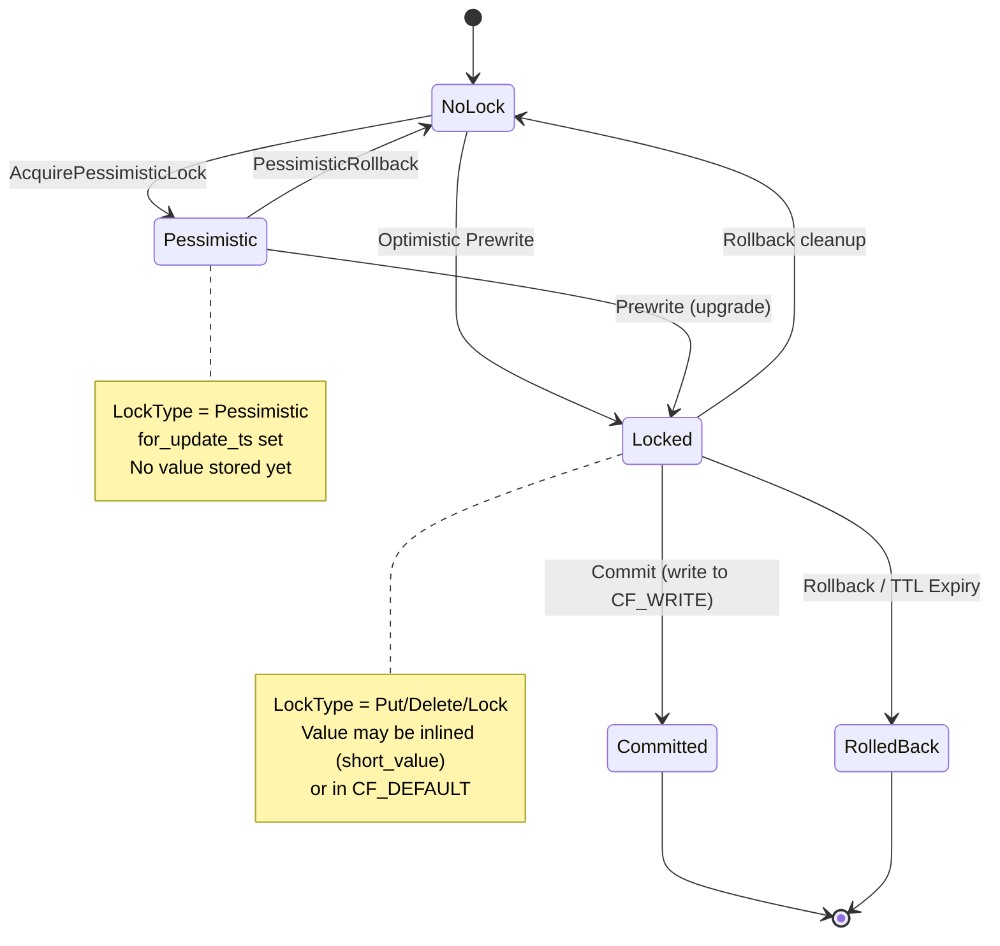
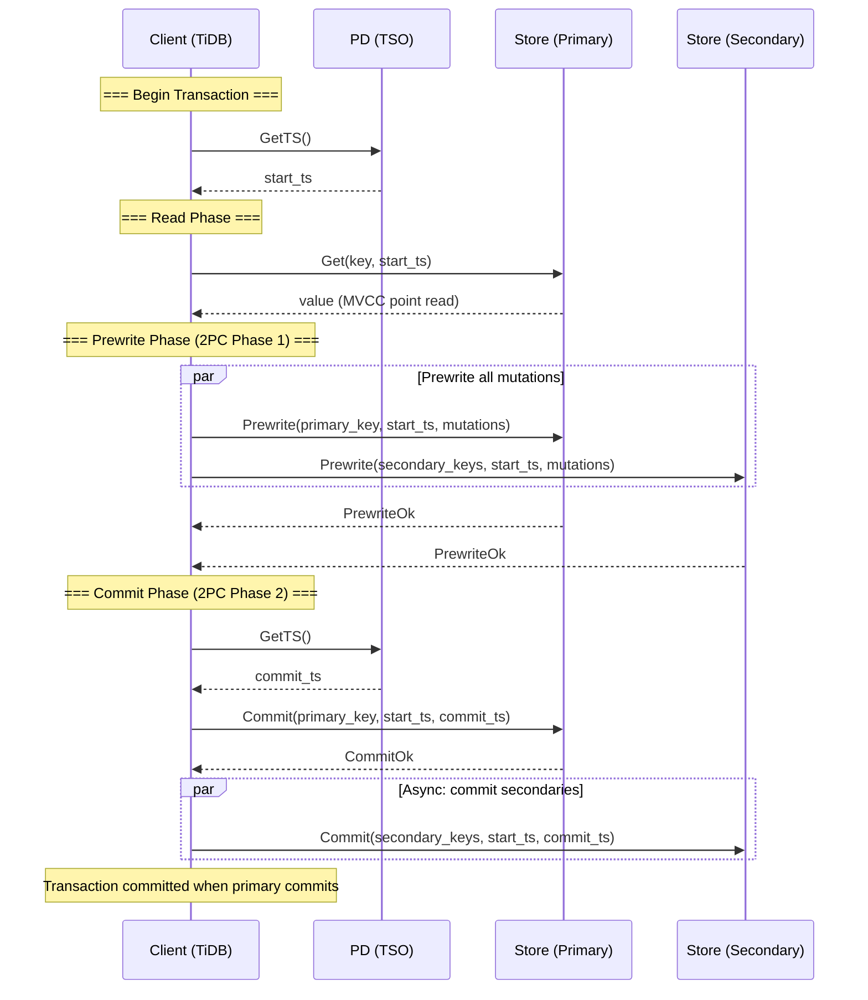
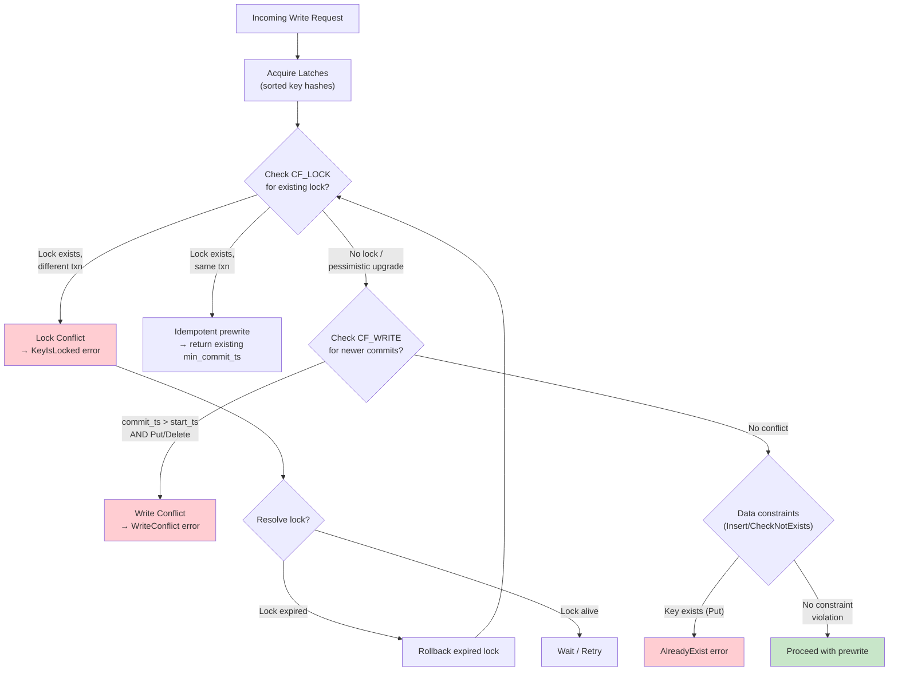
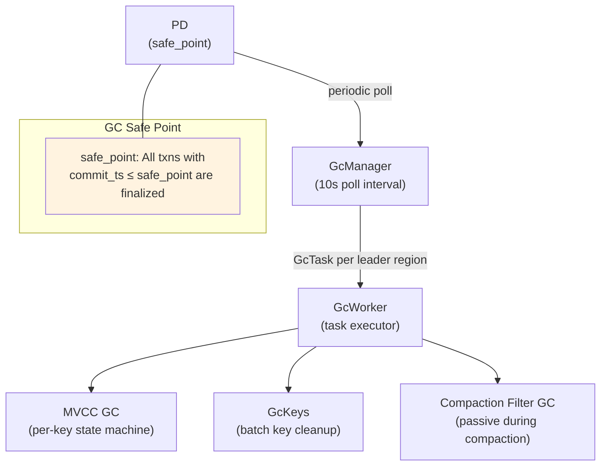

# Transaction and MVCC

This document specifies the transaction layer for gookvs, including the Percolator two-phase commit protocol, MVCC (Multi-Version Concurrency Control), lock and write types, conflict detection, concurrency control, GC, and resolved timestamps. It provides Go interface definitions and algorithms sufficient for implementing the complete transaction subsystem.

> **Reference**: [impl_docs/transaction_and_mvcc.md](../impl_docs/transaction_and_mvcc.md) — TiKV's Rust-based transaction layer that gookvs replicates in Go.

---

## 1. Overview of the Transaction Model

gookvs implements the **Percolator** distributed transaction protocol (Google, 2010), adapted for a Raft-replicated, region-sharded storage engine. Key properties:

- **Snapshot Isolation (SI)** by default, with optional Read Committed (RC) mode
- **Optimistic and pessimistic** transaction modes
- **Distributed two-phase commit (2PC)** with async commit and one-phase commit (1PC) optimizations
- **MVCC** using three RocksDB column families: `CF_LOCK`, `CF_WRITE`, `CF_DEFAULT`
- **Timestamp Oracle** via Placement Driver (PD) for globally ordered `start_ts` and `commit_ts`

### 1.1 Timestamp Semantics

| Timestamp | Source | Purpose |
|-----------|--------|---------|
| `start_ts` | PD TSO at txn begin | Defines the MVCC snapshot; used as version for values in CF_DEFAULT |
| `commit_ts` | PD TSO at commit (or calculated for async commit) | Used as version for write records in CF_WRITE; determines visibility |
| `for_update_ts` | PD TSO at pessimistic lock acquisition | Determines which write conflicts to detect for pessimistic locking |
| `min_commit_ts` | Calculated during prewrite | Lower bound on `commit_ts`; ensures no reader misses uncommitted data |

All timestamps are 64-bit, encoding `(physical_ms << 18) | logical_counter` (see [Key Encoding §4.3](01_key_encoding_and_data_formats.md)). They are totally ordered and monotonically increasing, obtained from PD's Timestamp Oracle (TSO).

### 1.2 Timestamp Oracle Interaction

gookvs obtains timestamps from PD via a bidirectional gRPC stream:

```go
// TSOClient manages timestamp allocation from PD.
type TSOClient interface {
    // GetTS returns a new monotonically increasing timestamp.
    // Batches requests internally for throughput.
    GetTS(ctx context.Context) (TimeStamp, error)

    // GetTSAsync returns a future for a timestamp (non-blocking).
    GetTSAsync(ctx context.Context) TSFuture
}
```

**Batching**: TSO requests are batched (up to 64 per batch) over a single bidirectional stream to amortize RPC overhead. The client maintains a bounded channel (max 65,536 pending requests) feeding a batching worker.

**Guarantees**: PD guarantees that all timestamps returned are strictly increasing. If PD restarts, it uses persisted state to ensure no timestamp regression.

### 1.3 Column Family Layout (Transaction Perspective)

| CF | Key Format | Value | Lifetime |
|----|-----------|-------|----------|
| `CF_LOCK` | `encoded_user_key` (no timestamp) | Compact binary `Lock` record | Created at prewrite, removed at commit/rollback |
| `CF_WRITE` | `encoded_user_key + commit_ts (desc)` | Compact binary `Write` record | Permanent until GC |
| `CF_DEFAULT` | `encoded_user_key + start_ts (desc)` | Raw user value bytes | Only for values > 255 bytes; permanent until GC |

> See [Key Encoding and Data Formats](01_key_encoding_and_data_formats.md) for byte-level encoding details.

---

## 2. Lock Types and State Machine

### 2.1 LockType

```go
type LockType byte

const (
    LockTypePut        LockType = 'P' // 0x50 — Write intent (optimistic prewrite)
    LockTypeDelete     LockType = 'D' // 0x44 — Delete intent
    LockTypeLock       LockType = 'L' // 0x4C — Read lock (SELECT FOR UPDATE, no value change)
    LockTypePessimistic LockType = 'S' // 0x53 — Pessimistic lock placeholder
)
```

### 2.2 Lock Record

```go
// Lock represents an active transaction lock on a user key.
// Stored in CF_LOCK with compact binary serialization (byte-identical to TiKV).
type Lock struct {
    LockType       LockType
    Primary        []byte        // Primary key of the transaction
    StartTS        TimeStamp     // Transaction start timestamp
    TTL            uint64        // Time-to-live in milliseconds
    ShortValue     []byte        // Inlined value (≤255 bytes), nil if absent
    ForUpdateTS    TimeStamp     // Pessimistic lock timestamp (0 for optimistic)
    TxnSize        uint64        // Hint for transaction size
    MinCommitTS    TimeStamp     // Minimum allowed commit timestamp
    UseAsyncCommit bool          // Async commit protocol flag
    Secondaries    [][]byte      // Secondary keys for async commit
    RollbackTS     []TimeStamp   // Collapsed rollback timestamps
    LastChange     LastChange    // MVCC optimization hint
    TxnSource      uint64        // Transaction origin identifier
    Generation     uint64        // Pipelined DML generation
}
```

### 2.3 Lock State Machine



**Key invariants:**
- A pessimistic lock MUST be upgraded to a prewrite lock before commit
- A pessimistic lock that isn't upgraded is rolled back at commit time (not committed)
- Lock TTL is checked as: `lock.StartTS.Physical() + lock.TTL < currentTS.Physical()`
- Only one lock per user key at any time (enforced by CF_LOCK key format)

### 2.4 Lock Method Signatures

```go
// Marshal serializes a Lock into the TiKV-compatible binary format.
func (l *Lock) Marshal() []byte

// UnmarshalLock deserializes a Lock from the TiKV-compatible binary format.
func UnmarshalLock(data []byte) (*Lock, error)

// ToLockInfo converts a Lock to the protobuf LockInfo for client responses.
func (l *Lock) ToLockInfo(key []byte) *kvrpcpb.LockInfo

// IsExpired checks whether the lock has exceeded its TTL.
func (l *Lock) IsExpired(currentTS TimeStamp) bool

// IsPessimistic returns true if this is a pessimistic lock placeholder.
func (l *Lock) IsPessimistic() bool
```

---

## 3. Write Record Types and Semantics

### 3.1 WriteType

```go
type WriteType byte

const (
    WriteTypePut      WriteType = 'P' // 0x50 — Data was written
    WriteTypeDelete   WriteType = 'D' // 0x44 — Data was deleted
    WriteTypeLock     WriteType = 'L' // 0x4C — Lock-only (no value change)
    WriteTypeRollback WriteType = 'R' // 0x52 — Transaction was rolled back
)
```

### 3.2 Write Record

```go
// Write represents a committed (or rolled-back) version of a user key.
// Stored in CF_WRITE with compact binary serialization (byte-identical to TiKV).
type Write struct {
    WriteType            WriteType
    StartTS              TimeStamp    // Transaction start timestamp
    ShortValue           []byte       // Inlined value (≤255 bytes), nil if absent
    HasOverlappedRollback bool        // A rollback was merged into this record
    GCFence              *TimeStamp   // GC safety boundary (nil if absent)
    LastChange           LastChange   // MVCC read optimization hint
    TxnSource            uint64       // CDC source identifier
}
```

### 3.3 GC Fence Mechanism

When a rollback overlaps with an existing commit record (`HasOverlappedRollback = true`), GC may delete the overlapped version. The `GCFence` field stores the `commit_ts` of the *next* version, preventing stale reads:

```go
func (w *Write) CheckGCFenceAsLatestVersion(gcFenceLimit *TimeStamp) bool {
    if w.GCFence == nil {
        return true  // No fence, version is valid
    }
    if w.GCFence.IsZero() {
        return false // Version was GC'd
    }
    if gcFenceLimit != nil && *w.GCFence > *gcFenceLimit {
        return false // Fence beyond read horizon
    }
    return true
}
```

### 3.4 LastChange Optimization

For `Lock` and `Rollback` write records (which carry no data), `LastChange` enables readers to skip directly to the last data-changing version:

```go
// LastChange records information about the previous data-changing version.
type LastChange struct {
    TS                TimeStamp
    EstimatedVersions uint64  // Number of versions to skip
}
```

When `EstimatedVersions >= SeekBound (32)`, readers seek directly to `LastChange.TS` instead of iterating through intermediate Lock/Rollback records.

### 3.5 Write Method Signatures

```go
// Marshal serializes a Write into the TiKV-compatible binary format.
func (w *Write) Marshal() []byte

// UnmarshalWrite deserializes a Write from the TiKV-compatible binary format.
func UnmarshalWrite(data []byte) (*Write, error)

// NeedValue returns true if the value must be fetched from CF_DEFAULT.
func (w *Write) NeedValue() bool

// IsDataChanged returns true for Put or Delete (not Lock/Rollback).
func (w *Write) IsDataChanged() bool
```

---

## 4. Percolator Protocol: Algorithms

### 4.1 Transaction Lifecycle



### 4.2 Prewrite (First Phase of 2PC)

```
FUNCTION Prewrite(txn, reader, props, mutation, pessimisticAction):
    key = mutation.Key

    // 1. For Insert operations, update max_ts for linearizability
    IF mutation.ShouldNotExist:
        concurrencyManager.UpdateMaxTS(props.StartTS)

    // 2. Check existing lock on this key
    lockStatus = checkLock(reader, key, props, pessimisticAction)
    MATCH lockStatus:
        Locked(minCommitTS):
            RETURN (minCommitTS, oldValue)   // Already prewrote (idempotent)
        Conflict(lockInfo):
            RETURN KeyIsLocked error
        None | Pessimistic:
            CONTINUE

    // 3. Check for write conflicts (newer writes since start_ts)
    (write, commitTS) = reader.SeekWrite(key, TimeStamp.Max)
    IF write IS NOT NIL AND commitTS > props.StartTS:
        IF write.WriteType != Rollback AND write.WriteType != Lock:
            RETURN WriteConflict error

    // 4. For pessimistic transactions, check for_update_ts
    IF props.IsPessimistic AND pessimisticAction == DoPessimisticCheck:
        IF commitTS > props.ForUpdateTS:
            RETURN WriteConflict error

    // 5. Check data constraints (Insert must not exist)
    IF mutation.ShouldNotExist:
        checkDataConstraint(reader, key, write)

    // 6. Calculate min_commit_ts
    minCommitTS = props.StartTS + 1
    IF commitKind IS Async(maxCommitTS) OR OnePc(maxCommitTS):
        minCommitTS = MAX(props.MinCommitTS, concurrencyManager.MaxTS() + 1)
        IF minCommitTS > maxCommitTS:
            RETURN CommitTsTooLarge error

    // 7. Write lock and value
    lock = Lock{
        LockType:    mutationTypeToLockType(mutation.Op),
        Primary:     props.Primary,
        StartTS:     props.StartTS,
        TTL:         props.LockTTL,
        ShortValue:  IF isShortValue(value) THEN value ELSE nil,
        ForUpdateTS: props.ForUpdateTS,
        MinCommitTS: minCommitTS,
        ...
    }

    IF NOT isShortValue(value):
        txn.PutValue(key, props.StartTS, value)   // Write to CF_DEFAULT

    IF commitKind IS OnePc:
        txn.locksFor1PC = append(txn.locksFor1PC, lockEntry{key, lock})
    ELSE:
        txn.PutLock(key, lock)                     // Write to CF_LOCK

    RETURN (minCommitTS, oldValue)
```

### 4.3 Commit (Second Phase of 2PC)

```
FUNCTION Commit(txn, reader, key, startTS, commitTS):
    lock = reader.LoadLock(key)

    // 1. Validate lock ownership
    IF lock IS NIL OR lock.StartTS != startTS:
        RETURN TxnLockNotFound error

    // 2. Check min_commit_ts constraint
    IF commitTS < lock.MinCommitTS:
        IF lock.UseAsyncCommit:
            commitTS = lock.MinCommitTS
        ELSE:
            RETURN error

    // 3. Handle pessimistic lock that wasn't prewrote
    IF lock.LockType == LockTypePessimistic:
        txn.UnlockKey(key, true)   // Delete pessimistic lock, no write record
        RETURN

    // 4. Remove lock
    txn.UnlockKey(key, false)

    // 5. Write commit record
    write = Write{
        WriteType:  lockTypeToWriteType(lock.LockType),
        StartTS:    lock.StartTS,
        ShortValue: lock.ShortValue,
    }
    txn.PutWrite(key, commitTS, write)   // Write to CF_WRITE

    RETURN
```

### 4.4 Rollback

```
FUNCTION RollbackLock(txn, reader, key, lock, isPessimistic, collapsePrev):
    // 1. Remove the lock
    txn.UnlockKey(key, isPessimistic)

    // 2. Check for existing rollback record to avoid duplicates
    overlappedWrite = reader.GetTxnCommitRecord(key, lock.StartTS)
    IF overlappedWrite IS SingleRecord:
        // Overlapped rollback: mark existing write record
        overlappedWrite.HasOverlappedRollback = true
        txn.PutWrite(key, overlappedWrite.CommitTS, overlappedWrite.Write)
        RETURN

    // 3. Collapse previous rollback if allowed (saves space)
    IF collapsePrev:
        collapsePrevRollback(txn, reader, key)

    // 4. Write rollback marker
    write = NewRollbackWrite(lock.StartTS, protected=isPessimistic)
    txn.PutWrite(key, lock.StartTS, write)   // Rollback uses start_ts as commit_ts
```

**Rollback collapse**: A new rollback deletes the immediately prior rollback record for the same key. Protected rollbacks (from pessimistic transactions) carry a `"p"` marker in `ShortValue` and are not collapsed.

### 4.5 CheckTxnStatus

Used by the transaction coordinator to determine the fate of a transaction when resolving locks. Called on the **primary key**.

```
FUNCTION CheckTxnStatus(txn, reader, primaryKey, lockTS, callerStartTS,
                        currentTS, rollbackIfNotExist, forceSyncCommit):
    concurrencyManager.UpdateMaxTS(MAX(lockTS, currentTS, callerStartTS))

    lock = reader.LoadLock(primaryKey)

    IF lock IS NOT NIL AND lock.StartTS == lockTS:
        RETURN checkTxnStatusLockExists(txn, reader, primaryKey, lock, currentTS, forceSyncCommit)
    ELSE:
        RETURN checkTxnStatusMissingLock(txn, reader, primaryKey, lockTS, rollbackIfNotExist)

FUNCTION checkTxnStatusLockExists(txn, reader, key, lock, currentTS, forceSyncCommit):
    // 1. Force sync commit if requested (disable async commit)
    IF forceSyncCommit AND lock.UseAsyncCommit:
        lock.UseAsyncCommit = false
        lock.Secondaries = nil
        txn.PutLock(key, lock)

    // 2. Check TTL expiration
    IF lock.StartTS.Physical() + lock.TTL < currentTS.Physical():
        RollbackLock(txn, reader, key, lock, ...)
        RETURN TxnStatus{TTLExpired}
    ELSE:
        RETURN TxnStatus{Uncommitted, lock}

FUNCTION checkTxnStatusMissingLock(txn, reader, key, lockTS, rollbackIfNotExist):
    commitRecord = reader.GetTxnCommitRecord(key, lockTS)
    MATCH commitRecord:
        SingleRecord{commitTS, write}:
            IF write.WriteType != Rollback:
                RETURN TxnStatus{Committed, commitTS}
            ELSE:
                RETURN TxnStatus{RolledBack}
        OverlappedRollback:
            RETURN TxnStatus{RolledBack}
        None:
            IF rollbackIfNotExist:
                writeRollbackRecord(txn, reader, key, lockTS)
            RETURN TxnStatus{LockNotExist}
```

---

## 5. MVCC Writer: MvccTxn

`MvccTxn` is a **write-only** accumulator that collects all modifications during a transaction action (prewrite, commit, rollback, etc.) and flushes them as a single atomic batch write.

```go
// MvccTxn accumulates MVCC writes for atomic batch execution.
type MvccTxn struct {
    StartTS            TimeStamp
    Modifies           []Modify              // Pending CF writes
    LocksFor1PC        []LockEntry           // Cached locks for 1PC optimization
    WriteSize          int                   // Accumulated write bytes
    ConcurrencyManager *ConcurrencyManager   // In-memory lock table
    Guards             []KeyHandleGuard      // Lock handle guards (released on drop)
}

// Modify represents a single CF operation.
type Modify struct {
    Type ModifyType   // Put or Delete
    CF   string       // Target column family
    Key  []byte       // Encoded key
    Value []byte      // Value (nil for Delete)
}

type ModifyType int

const (
    ModifyTypePut    ModifyType = iota
    ModifyTypeDelete
)
```

### 5.1 Key Methods

| Method | CF | Key Format | Purpose |
|--------|----|------------|---------|
| `PutLock(key, lock)` | CF_LOCK | `encoded_user_key` | Write a lock record |
| `UnlockKey(key, pessimistic)` | CF_LOCK | `encoded_user_key` | Delete lock, return `ReleasedLock` |
| `PutValue(key, startTS, value)` | CF_DEFAULT | `encoded_user_key{startTS}` | Write large value |
| `DeleteValue(key, startTS)` | CF_DEFAULT | `encoded_user_key{startTS}` | Delete value (GC/rollback) |
| `PutWrite(key, commitTS, write)` | CF_WRITE | `encoded_user_key{commitTS}` | Write commit/rollback record |
| `DeleteWrite(key, commitTS)` | CF_WRITE | `encoded_user_key{commitTS}` | Delete write record (GC) |

```go
func (txn *MvccTxn) PutLock(key Key, lock *Lock) {
    txn.Modifies = append(txn.Modifies, Modify{
        Type:  ModifyTypePut,
        CF:    CFLock,
        Key:   key,
        Value: lock.Marshal(),
    })
    // Register with ConcurrencyManager for in-memory lock tracking
    guard := txn.ConcurrencyManager.LockKey(key)
    txn.Guards = append(txn.Guards, guard)
}

func (txn *MvccTxn) UnlockKey(key Key, isPessimistic bool) *ReleasedLock {
    txn.Modifies = append(txn.Modifies, Modify{
        Type: ModifyTypeDelete,
        CF:   CFLock,
        Key:  key,
    })
    // Return released lock info for lock manager wake-up
    return &ReleasedLock{Key: key, StartTS: txn.StartTS, IsPessimistic: isPessimistic}
}
```

All modifications are collected in `Modifies` and written atomically via `engine.Write(modifies)` after the action completes.

---

## 6. MVCC Reader

### 6.1 MvccReader

```go
// MvccReader provides MVCC-aware reads across column families.
type MvccReader struct {
    snapshot    engine.Snapshot
    lockCursor  engine.Iterator      // CF_LOCK (lazy-initialized)
    writeCursor engine.Iterator      // CF_WRITE (lazy-initialized)
    dataCursor  engine.Iterator      // CF_DEFAULT (lazy-initialized)
    scanMode    ScanMode             // Forward / Backward / Mixed
    hintMinTS   *TimeStamp           // Write CF timestamp filter
    Statistics  *Statistics          // Per-CF read metrics
}

type ScanMode int

const (
    ScanModeForward  ScanMode = iota
    ScanModeBackward
    ScanModeMixed
)
```

### 6.2 SnapshotReader

```go
// SnapshotReader wraps MvccReader with a fixed start_ts for MVCC reads.
type SnapshotReader struct {
    Reader  *MvccReader
    StartTS TimeStamp
}
```

### 6.3 Key Read Operations

```go
// LoadLock reads the lock record for a key.
// Checks in-memory pessimistic locks first, then CF_LOCK.
func (r *MvccReader) LoadLock(key Key) (*Lock, error)

// SeekWrite finds the first write record for key with commitTS <= ts.
func (r *MvccReader) SeekWrite(key Key, ts TimeStamp) (*Write, TimeStamp, error)

// GetWrite finds the latest data-changing write for key visible at ts.
// Skips Lock and Rollback records, using LastChange optimization.
func (r *MvccReader) GetWrite(key Key, ts TimeStamp, gcFenceLimit *TimeStamp) (*Write, error)

// GetTxnCommitRecord finds a transaction's commit record by matching start_ts.
func (r *MvccReader) GetTxnCommitRecord(key Key, startTS TimeStamp) (TxnCommitRecord, error)
```

**GetWrite algorithm:**

```
FUNCTION GetWrite(key, ts, gcFenceLimit):
    LOOP:
        (write, commitTS) = SeekWrite(key, ts)
        IF write IS NIL: RETURN nil

        MATCH write.WriteType:
            Put:
                IF NOT write.CheckGCFenceAsLatestVersion(gcFenceLimit):
                    RETURN nil
                RETURN write
            Delete:
                RETURN nil
            Lock | Rollback:
                IF write.LastChange.EstimatedVersions >= SeekBound:
                    ts = write.LastChange.TS   // Jump to last data version
                ELSE:
                    ts = commitTS - 1          // Try next older version
                CONTINUE
```

**GetTxnCommitRecord:**

```go
type TxnCommitRecord struct {
    Type     TxnCommitRecordType
    CommitTS TimeStamp
    Write    *Write
}

type TxnCommitRecordType int

const (
    TxnCommitRecordNone              TxnCommitRecordType = iota
    TxnCommitRecordSingleRecord                          // Found exact match
    TxnCommitRecordOverlappedRollback                    // Found overlapped rollback
)
```

### 6.4 PointGetter — Optimized Single-Key Read

```go
// PointGetter performs optimized single-key MVCC reads.
type PointGetter struct {
    snapshot       engine.Snapshot
    ts             TimeStamp
    isolationLevel IsolationLevel
    bypassLocks    *TSSet           // Locks to ignore (e.g., own transaction)
    accessLocks    *TSSet           // Locks to read through
    writeCursor    engine.Iterator
    statistics     *Statistics
}

func NewPointGetter(snap engine.Snapshot, ts TimeStamp, level IsolationLevel) *PointGetter

// Get reads the value for key at the configured timestamp.
func (pg *PointGetter) Get(key Key) ([]byte, error)
```

**Point read algorithm:**

```
FUNCTION Get(key):
    // 1. Check for blocking locks (SI mode only)
    IF isolationLevel == SI:
        lock = loadLock(key)
        IF lock IS NOT NIL AND lock.StartTS NOT IN bypassLocks:
            IF lock.StartTS IN accessLocks:
                RETURN loadDataFromLock(key, lock)  // Read through
            ELSE:
                RETURN KeyIsLocked error

    // 2. Find visible write record
    Seek write cursor to key{ts}
    LOOP:
        write = readWriteRecord()
        IF write IS NIL: RETURN nil
        MATCH write.WriteType:
            Put:
                IF write.ShortValue IS NOT NIL:
                    RETURN write.ShortValue
                ELSE:
                    RETURN snapshot.Get(CFDefault, key.AppendTS(write.StartTS))
            Delete:
                RETURN nil
            Lock | Rollback:
                // Use LastChange optimization or iterate
                CONTINUE to next older version
```

### 6.5 Scanner — Range Scans

```go
// ForwardScanner performs forward MVCC range scans.
type ForwardScanner struct {
    reader        *MvccReader
    ts            TimeStamp
    policy        ScanPolicy
    writeCursor   engine.Iterator
    lockCursor    engine.Iterator
    defaultCursor engine.Iterator   // Lazy-initialized
    statistics    *Statistics
}

func NewForwardScanner(reader *MvccReader, ts TimeStamp, policy ScanPolicy) *ForwardScanner

// Next returns the next (key, value) pair visible at the scanner's timestamp.
func (s *ForwardScanner) Next() (Key, []byte, error)

// BackwardScanner performs backward MVCC range scans.
type BackwardScanner struct {
    reader      *MvccReader
    ts          TimeStamp
    writeCursor engine.Iterator
    lockCursor  engine.Iterator
    statistics  *Statistics
}

func NewBackwardScanner(reader *MvccReader, ts TimeStamp) *BackwardScanner

func (s *BackwardScanner) Next() (Key, []byte, error)
```

**SEEK_BOUND optimization**: When scanning through versions, the scanner first tries `Next()` up to `SeekBound` (32) times. If the target version is not found within 32 iterations, it falls back to `Seek()` for a direct jump. This avoids expensive seek operations for short version chains.

**Scan policies** (pluggable):

```go
// ScanPolicy defines how the scanner handles locks and writes.
type ScanPolicy interface {
    HandleLock(key Key, lock *Lock) HandleResult
    HandleWrite(key Key, write *Write) HandleResult
}

type HandleResult int

const (
    HandleResultReturn     HandleResult = iota  // Return this entry
    HandleResultSkip                             // Skip this key
    HandleResultMoveToNext                       // Continue scanning
)
```

| Policy | Purpose | Use Case |
|--------|---------|----------|
| `LatestKvPolicy` | Returns latest `(Key, Value)` pairs | Standard reads |
| `LatestEntryPolicy` | Returns `TxnEntry` with metadata | CDC initial scan |
| `DeltaEntryPolicy` | Returns per-version changes | CDC incremental scan |

---

## 7. Conflict Detection and Resolution

### 7.1 Conflict Detection Flow



### 7.2 Write Conflicts

Detected during **prewrite** by checking CF_WRITE for commits after `start_ts`:

```go
// WriteConflict is returned when a newer committed write conflicts with the transaction.
type WriteConflict struct {
    StartTS         TimeStamp
    ConflictStartTS TimeStamp  // start_ts of the conflicting transaction
    ConflictCommitTS TimeStamp // commit_ts of the conflicting transaction
    Key             Key
    Primary         []byte
    Reason          WriteConflictReason
}
```

For **optimistic transactions**: conflict if `commitTS > startTS`
For **pessimistic transactions**: conflict if `commitTS > forUpdateTS`

### 7.3 Lock Conflicts

When a transaction encounters another transaction's lock:

**During prewrite**: If a lock exists with a different `start_ts`, return `KeyIsLocked` with the lock info. The client can then resolve the lock (by checking the primary key's status).

**During read (SI mode)**: If a lock's `start_ts` is not in the bypass set and not in the access set, return `KeyIsLocked`. The client retries after resolving.

### 7.4 Lock Resolution Protocol

When a reader or writer encounters a foreign lock:

1. **CheckTxnStatus** on the primary key to determine the transaction's fate
2. If committed → **resolve lock** by writing the commit record and removing the lock
3. If rolled back or expired → **rollback** the lock
4. Client retries the original operation

This is safe because `CheckTxnStatus` is idempotent and the resolution actions are deterministic based on the primary key's state.

---

## 8. Concurrency Control

### 8.1 Storage and Scheduler Architecture

```go
// Storage is the entry point for all KV operations.
type Storage struct {
    engine    engine.RaftKv
    scheduler *TxnScheduler
    readPool  *WorkerPool
}

// TxnScheduler serializes commands on overlapping keys using latches.
type TxnScheduler struct {
    latches    *Latches
    workerPool *WorkerPool
    memoryQuota int64    // Maximum pending write bytes (default: 256 MiB)
}
```

**Request flow:**

```
gRPC → Storage API → TxnScheduler (latch acquisition) → Worker Pool (execute command)
    → MvccTxn + MvccReader (MVCC operations) → engine.Write(modifies) → Raft replication
```

### 8.2 Latch System

The latch system serializes commands that touch overlapping keys, preventing concurrent modification of the same keys:

```go
// Latches provides deadlock-free key serialization.
type Latches struct {
    slots []latchSlot   // Power-of-2 hash slots
    size  int           // Number of slots
}

// LatchLock tracks latch acquisition progress for a command.
type LatchLock struct {
    RequiredHashes []uint64  // Sorted, deduplicated key hashes
    OwnedCount     int       // How many latches acquired so far
}
```

**Deadlock-free acquisition**: Key hashes are sorted before acquisition. Since all commands acquire latches in the same sorted order, deadlock is impossible (total ordering on lock acquisition).

```go
// Acquire attempts to acquire all latches for a command.
// Returns true if all latches acquired; false if the command must wait.
func (l *Latches) Acquire(lock *LatchLock, commandID uint64) bool

// Release releases all latches held by a command, waking waiters.
func (l *Latches) Release(lock *LatchLock, commandID uint64) []uint64
```

### 8.3 ConcurrencyManager — In-Memory Lock Table

```go
// ConcurrencyManager tracks in-memory locks and max_ts for async commit correctness.
type ConcurrencyManager struct {
    maxTS     atomic.Uint64        // Maximum observed timestamp
    lockTable *LockTable           // In-memory lock registry
}
```

**Responsibilities:**

1. **`maxTS` tracking**: Updated by prewrite, check_txn_status, and PD TSO sync. Ensures that `minCommitTS > maxTS` for async commit correctness.

2. **In-memory lock table**: Stores active locks so readers can check for conflicts without CF_LOCK reads. Critical for async commit where `minCommitTS` must account for concurrent reads.

3. **`GlobalMinLock()`**: Returns the minimum `start_ts` across all in-memory locks. Used by resolved timestamp computation.

```go
// UpdateMaxTS atomically updates the maximum observed timestamp.
func (cm *ConcurrencyManager) UpdateMaxTS(ts TimeStamp)

// MaxTS returns the current maximum observed timestamp.
func (cm *ConcurrencyManager) MaxTS() TimeStamp

// LockKey registers a lock in the in-memory lock table.
func (cm *ConcurrencyManager) LockKey(key Key) KeyHandleGuard

// GlobalMinLock returns the minimum start_ts of all in-memory locks.
func (cm *ConcurrencyManager) GlobalMinLock() *TimeStamp
```

---

## 9. Async Commit and 1PC Optimizations

### 9.1 Async Commit Protocol

**Purpose**: Reduce commit latency by allowing the client to consider the transaction committed once all prewrite locks are written, without waiting for a separate commit phase.

```go
// CommitKind determines the commit protocol.
type CommitKind int

const (
    CommitKindTwoPc CommitKind = iota  // Standard 2-phase commit
    CommitKindOnePc                     // Single-phase commit
    CommitKindAsync                     // Async commit
)
```

**Async commit prewrite**: The primary lock stores secondary key list. `min_commit_ts` is calculated as `MAX(props.MinCommitTS, concurrencyManager.MaxTS() + 1)`. If `min_commit_ts > max_commit_ts`, the transaction falls back to standard 2PC.

**Async commit resolution**: When a reader encounters an async-commit lock, it determines the transaction's commit status by checking all locks (primary + secondaries):

```
commitTS = MAX(primary.MinCommitTS, MAX(secondary.MinCommitTS for each secondary))
```

**Fallback**: If `forceSyncCommit` is set during `CheckTxnStatus`, the async commit flag is cleared and the transaction falls back to standard 2PC.

### 9.2 One-Phase Commit (1PC)

**Purpose**: For single-region transactions, skip the lock phase entirely and write commit records directly.

```
FUNCTION Handle1PCLocks(txn):
    FOR EACH entry IN txn.LocksFor1PC:
        commitTS = entry.Lock.MinCommitTS
        write = Write{
            WriteType:  lockTypeToWriteType(entry.Lock.LockType),
            StartTS:    entry.Lock.StartTS,
            ShortValue: entry.Lock.ShortValue,
        }
        txn.PutWrite(entry.Key, commitTS, write)   // Direct to CF_WRITE
    // No CF_LOCK writes at all — single atomic batch
```

**Trade-off**: 1PC eliminates the lock phase and commit phase latency, but is only applicable when all mutations reside in a single region. If the region changes during prewrite (e.g., due to split), the transaction falls back to 2PC.

---

## 10. Pessimistic Transactions

### 10.1 Pessimistic Lock Acquisition

Before prewrite, pessimistic transactions acquire locks to prevent write-write conflicts early:

```go
// AcquirePessimisticLock acquires a pessimistic lock before prewrite.
func AcquirePessimisticLock(txn *MvccTxn, reader *SnapshotReader,
    key Key, startTS, forUpdateTS TimeStamp) error
```

**Algorithm:**

```
FUNCTION AcquirePessimisticLock(txn, reader, key, startTS, forUpdateTS):
    // 1. Check for conflicting writes after for_update_ts
    (write, commitTS) = reader.SeekWrite(key, TimeStamp.Max)
    IF commitTS > forUpdateTS:
        RETURN WriteConflict

    // 2. Check for existing lock
    lock = reader.LoadLock(key)
    IF lock IS NOT NIL AND lock.StartTS != startTS:
        RETURN KeyIsLocked

    // 3. Write pessimistic lock
    lock = Lock{
        LockType:    LockTypePessimistic,
        StartTS:     startTS,
        ForUpdateTS: forUpdateTS,
        Primary:     primary,
        TTL:         ttl,
    }
    txn.PutLock(key, lock)
```

### 10.2 Pessimistic Prewrite (Lock Upgrade)

When prewriting a key that already has a pessimistic lock, the lock is **upgraded** from `LockTypePessimistic` to the actual write type (`Put`/`Delete`/`Lock`). The old pessimistic lock is replaced.

### 10.3 Pessimistic Rollback

```go
// PessimisticRollback releases a pessimistic lock without writing a rollback marker.
func PessimisticRollback(txn *MvccTxn, reader *SnapshotReader,
    key Key, startTS, forUpdateTS TimeStamp) error
```

Pessimistic locks are invisible to readers (they don't check for `LockTypePessimistic` during reads), so no rollback marker is needed.

---

## 11. Isolation Levels

```go
type IsolationLevel int

const (
    IsolationLevelSI        IsolationLevel = iota  // Snapshot Isolation (default)
    IsolationLevelRC                                // Read Committed
    IsolationLevelRcCheckTs                         // RC with staleness check
)
```

| Level | Lock Checking | Version Visibility | Use Case |
|-------|--------------|-------------------|----------|
| **SI** | Yes — blocks on locks from other txns | Latest committed version ≤ `start_ts` | Default for transactions |
| **RC** | No — ignores all locks | Latest committed version ≤ `start_ts` | Non-transactional reads |
| **RcCheckTs** | Returns error if newer writes exist | Latest committed version ≤ `start_ts` | Optimistic read validation |

---

## 12. GC Mechanism

### 12.1 Architecture



### 12.2 Safe Point Semantics

The **safe point** is a timestamp obtained from PD:
- All transactions with `commit_ts ≤ safe_point` have fully committed or been rolled back
- MVCC versions before the safe point can be deleted (keeping the latest per key)

```go
// GcManager orchestrates automatic GC across all leader regions.
type GcManager struct {
    pdClient      PDClient
    gcWorker      *GcWorker
    lastSafePoint TimeStamp
}

// Run polls PD for safe point updates and schedules GC tasks.
func (gm *GcManager) Run(ctx context.Context)
```

### 12.3 Per-Key GC Algorithm

Uses a three-state machine to determine which versions to keep/delete:

```
FUNCTION GC(reader, key, safePoint):
    state = Rewind

    LOOP:
        (commitTS, write) = reader.SeekWrite(key, cursorTS)
        IF write IS NIL: BREAK

        MATCH state:
            Rewind:
                IF commitTS > safePoint:
                    cursorTS = commitTS - 1
                    CONTINUE
                ELSE:
                    state = RemoveIdempotent

            RemoveIdempotent:
                MATCH write.WriteType:
                    Rollback | Lock:
                        DELETE write at (key, commitTS)
                    Put:
                        // Keep this version (latest before safe_point)
                        state = RemoveAll
                    Delete:
                        // Keep delete marker; remove everything older
                        state = RemoveAll

            RemoveAll:
                DELETE write at (key, commitTS)
                IF write.WriteType IN {Put, Delete} AND write.ShortValue IS NIL:
                    DELETE value at (key, write.StartTS) from CF_DEFAULT

        cursorTS = commitTS - 1
```

**States:**
- **Rewind**: Skip versions above safe_point (must be kept)
- **RemoveIdempotent**: Remove Rollback/Lock records; keep first Put/Delete as the retained version
- **RemoveAll**: Delete all remaining older versions and their CF_DEFAULT values

### 12.4 Compaction Filter GC

When enabled, GC runs passively during RocksDB compaction of CF_WRITE, using the same state machine as the per-key GC:

```go
// WriteCompactionFilter runs MVCC GC during RocksDB compaction.
type WriteCompactionFilter struct {
    safePoint TimeStamp
    engine    engine.KvEngine
    state     compactionFilterState  // Per user-key state machine
}
```

This avoids the need for separate GC scans — old versions are cleaned up as part of normal RocksDB compaction. The compaction filter schedules `GcKeys` tasks for CF_DEFAULT cleanup when it encounters `Delete` records at the bottommost compaction level.

### 12.5 Lock TTL and Cleanup

Abandoned locks are cleaned via TTL expiration during `CheckTxnStatus`:

```go
// Cleanup removes an expired lock and writes a rollback marker.
func Cleanup(txn *MvccTxn, reader *SnapshotReader, key Key,
    currentTS TimeStamp, protectRollback bool) (TxnStatus, error)
```

---

## 13. Resolved Timestamp

### 13.1 Definition

The **resolved timestamp** is a per-region watermark:
- **No future commits below it**: All transactions that will commit with `commit_ts ≤ resolved_ts` have already done so
- **Safe for snapshot reads**: A consistent snapshot at `resolved_ts` will never be invalidated by a future commit

### 13.2 Per-Region Resolver

```go
// Resolver tracks locks to compute the resolved timestamp for a region.
type Resolver struct {
    locksByKey  map[string]TimeStamp              // key → start_ts
    lockTSHeap  *btree.BTreeG[lockTSEntry]        // BTree for O(1) min lookup
    largeTxns   map[TimeStamp]*TxnLocks           // Large txn optimization
    resolvedTS  TimeStamp
    minTS       TimeStamp
}
```

### 13.3 Computation Algorithm

```go
// Resolve advances the resolved timestamp given the current min_ts.
func (r *Resolver) Resolve(minTS TimeStamp) TimeStamp {
    // minTS = MIN(pd_tso, concurrencyManager.GlobalMinLock())
    minLockTS := r.lockTSHeap.Min()  // O(1) via BTree

    var newResolvedTS TimeStamp
    if minLockTS != nil {
        newResolvedTS = min(*minLockTS, minTS)
    } else {
        newResolvedTS = minTS
    }

    if newResolvedTS > r.resolvedTS {
        r.resolvedTS = newResolvedTS
    }
    return r.resolvedTS
}
```

### 13.4 Lock Tracking

The resolver receives lock change events from the raftstore observer:

```go
// TrackLock registers a new lock for resolved TS tracking.
func (r *Resolver) TrackLock(key []byte, startTS TimeStamp)

// UntrackLock removes a lock from tracking (on commit/rollback).
func (r *Resolver) UntrackLock(key []byte)
```

**Dual tracking**: Normal locks are tracked in the BTree for O(1) min lookup. Large transactions (many locks) use a separate `HashMap` with `TxnStatusCache` for `min_commit_ts` to avoid BTree overhead.

### 13.5 AdvanceTsWorker

Periodically advances `min_ts` using PD TSO:

```go
// AdvanceTsWorker periodically advances resolved timestamps for all observed regions.
type AdvanceTsWorker struct {
    pdClient           PDClient
    concurrencyManager *ConcurrencyManager
    resolvers          map[uint64]*Resolver  // regionID → Resolver
}

// AdvanceTS fetches current TSO and advances all region resolvers.
func (w *AdvanceTsWorker) AdvanceTS(ctx context.Context)
```

### 13.6 Consumers

| Consumer | Usage |
|----------|-------|
| **CDC** | Events are safe to emit once `resolved_ts` advances past their `commit_ts` |
| **Stale reads** | A follower can serve reads at timestamp `t` if `t ≤ safe_ts` (derived from resolved_ts) |

---

## 14. Concurrency Control Summary

```
Layer               Mechanism                         Granularity
─────────────────── ───────────────────────────────── ──────────────────
gRPC                Request queuing, backpressure      Per-connection
Storage API         TxnScheduler + Latches             Per-key hash slot
MVCC                Lock records in CF_LOCK            Per-user-key
                    ConcurrencyManager in-memory locks Per-user-key
Raft                Proposal serialization per region  Per-region
Engine (RocksDB)    Internal concurrency control       Per-CF
```

**Key invariant chain:**
1. Latches prevent two commands from operating on the same keys simultaneously
2. MVCC locks prevent two transactions from writing the same key simultaneously
3. `min_commit_ts > max_ts` prevents a committed-but-not-yet-visible write from being missed by a concurrent reader
4. Resolved timestamp provides a safe read point for CDC and stale reads

---

## 15. Design Divergences from TiKV

| Aspect | TiKV (Rust) | gookvs (Go) | Rationale |
|--------|-------------|-------------|-----------|
| **Write accumulator** | `MvccTxn` with `Vec<Modify>` | `MvccTxn` with `[]Modify` slice | Direct mapping; Go slices are equivalent |
| **Reader cursors** | `Cursor<S::Iter>` with generics | Interface-based `engine.Iterator` | Go uses interfaces instead of generics for polymorphism |
| **Latch slots** | `Vec<CachePadded<Mutex<Latch>>>` | `[]latchSlot` with `sync.Mutex` per slot | Go's `sync.Mutex` is lightweight; cache padding via struct alignment |
| **ConcurrencyManager** | `Arc<AtomicU64>` for max_ts | `atomic.Uint64` | Go 1.19+ provides `atomic.Uint64` |
| **Lock table** | `LockTable` with `DashMap` | `sync.Map` or sharded map | `sync.Map` for read-heavy workloads; shard for write-heavy |
| **Action functions** | Standalone functions taking `(txn, reader, ...)` | Same pattern: standalone functions | Matches TiKV's architecture — actions are not methods on a struct |
| **Scanner policies** | `ScanPolicy` trait with associated types | `ScanPolicy` interface | Go interface replaces Rust trait |
| **Error types** | `enum ErrorInner` | Error types implementing `error` interface | Go-idiomatic error handling |
| **GC compaction filter** | RocksDB `CompactionFilter` trait impl | grocksdb `CompactionFilter` callback | grocksdb supports custom compaction filters via C API |
| **Resolved TS lock tracking** | `BTreeMap<TimeStamp, TxnLocks>` | `btree.BTreeG[lockTSEntry]` (tidwall/btree or similar) | Go lacks stdlib BTreeMap; use third-party |

---

## Cross-References

| Subsystem | Document |
|-----------|----------|
| Key encoding, CF layouts, binary serialization | [Key Encoding and Data Formats](01_key_encoding_and_data_formats.md) |
| Raft replication, region management | [Raft and Replication](02_raft_and_replication.md) |
| System architecture, goroutine model | [Architecture Overview](00_architecture_overview.md) |
| gRPC services, request routing | [gRPC API and Server](05_grpc_api_and_server.md) (planned) |
| Priority ranking, implementation order | [Priority and Scope](08_priority_and_scope.md) |
