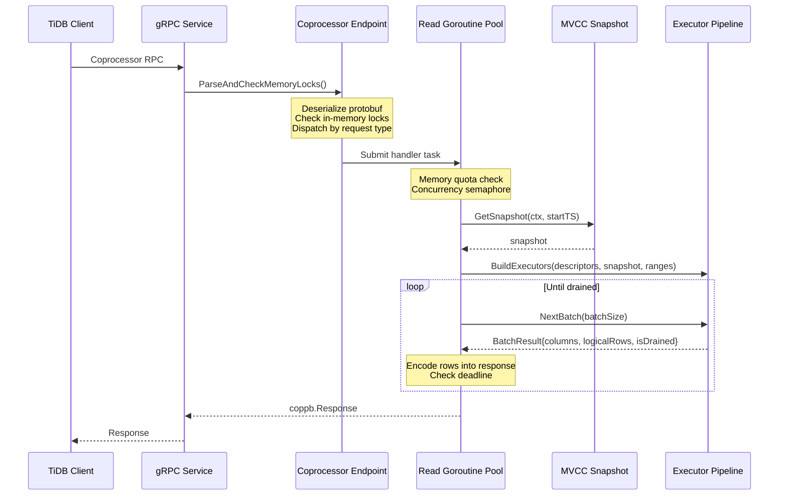
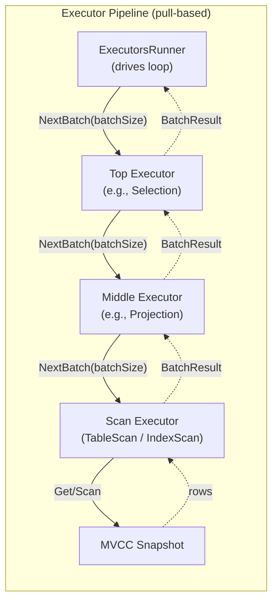

# Coprocessor: Push-Down Computation

This document specifies the coprocessor subsystem for gookvs — the mechanism by which TiDB pushes query computation down to the storage layer. It covers the request model, DAG executor pipeline, expression evaluation framework, aggregation functions, statistics collection, the plugin system, and resource enforcement, all designed with Go interfaces and concurrency patterns.

> **Reference**: [impl_docs/coprocessor.md](../impl_docs/coprocessor.md) — TiKV's Rust-based coprocessor that gookvs replicates in Go.

---

## 1. Coprocessor Request Model

### 1.1 How TiDB Pushes Down Computation

TiDB compiles SQL queries into physical plans. For operations executable close to the data — table scans, index scans, filtering, aggregation, top-N — TiDB serializes a sub-plan as a protobuf `DagRequest` and sends it to gookvs as a coprocessor request. gookvs executes the sub-plan against its local data and returns encoded rows, avoiding the cost of transferring raw data to TiDB for processing.

### 1.2 Request Types

Three request types are dispatched based on `coppb.Request.Tp`:

| Type Code | Name | Purpose |
|-----------|------|---------|
| `REQ_TYPE_DAG` (103) | DAG Request | Query execution — the primary path |
| `REQ_TYPE_ANALYZE` (104) | Analyze Request | Table/index statistics collection for the optimizer |
| `REQ_TYPE_CHECKSUM` (105) | Checksum Request | Data integrity verification |

A raw `coppb.Request` contains:
- **`Context`**: Request metadata — region ID, peer, isolation level, timestamps
- **`Data`**: Serialized protobuf payload (`DagRequest`, `AnalyzeReq`, or `ChecksumRequest`)
- **`Ranges`**: Key ranges to scan (region-local)
- **`StartTs`**: Transaction start timestamp for MVCC reads

### 1.3 DagRequest Structure

The `DagRequest` (defined in `tipb` protobuf) carries:

| Field | Description |
|-------|-------------|
| `Executors` | Ordered array of executor descriptors forming the execution pipeline |
| `OutputOffsets` | Which output columns TiDB wants returned |
| `StartTsFallback` | Fallback timestamp if `StartTs` is 0 in the outer request |
| `EncodeType` | Result encoding format (row-by-row or chunk) |
| `CollectExecutionSummaries` | Whether to collect per-executor performance statistics |
| `PagingSize` | Optional pagination size for incremental result delivery |
| `IsCacheEnabled` | Whether query result caching is active |

### 1.4 Request Processing Flow



### 1.5 Go Entry Point

```go
// Endpoint handles coprocessor requests dispatched from the gRPC service layer.
type Endpoint struct {
    engine      engine.Engine
    concurrency *semaphore.Weighted  // limits concurrent requests
    memQuota    *MemoryQuota         // global memory budget
    cfg         *Config              // runtime-tunable configuration

    // For coprocessor V2 plugin support.
    pluginRegistry *PluginRegistry
}

// HandleRequest processes a unary coprocessor request.
// It acquires a concurrency permit, obtains an MVCC snapshot,
// builds the executor pipeline, and drives it to completion.
func (ep *Endpoint) HandleRequest(ctx context.Context, req *coppb.Request) (*coppb.Response, error)

// HandleStreamRequest processes a streaming coprocessor request,
// sending batches of rows through the stream as they are produced.
func (ep *Endpoint) HandleStreamRequest(ctx context.Context, req *coppb.Request, stream StreamSender) error
```

### 1.6 Streaming Requests

When streaming is enabled, the endpoint calls `HandleStreamRequest()` which invokes the executor pipeline's `NextBatch()` repeatedly, sending each batch through the gRPC stream as it becomes available. This supports cursor-style result delivery for large result sets. Streaming uses `StreamBatchRowLimit` (rather than `BatchRowLimit`) and supports paging via `PagingSize` for resumable scans.

### 1.7 Handler Builder Pattern

The endpoint uses a lazy builder pattern: it creates a handler builder closure that captures the parsed request but defers handler construction until after the snapshot is retrieved. This decouples snapshot acquisition (may block on Raft read index) from handler construction (synchronous, cheap).

```go
// HandlerBuilder creates a RequestHandler once a snapshot is available.
// This defers handler construction until after snapshot acquisition.
type HandlerBuilder func(snap engine.Snapshot) (RequestHandler, error)

// RequestHandler processes coprocessor requests against a storage snapshot.
type RequestHandler interface {
    // HandleRequest processes the entire request and returns the response.
    HandleRequest(ctx context.Context) (*coppb.Response, error)

    // HandleStreamRequest returns the next batch for streaming.
    // Returns (response, finished).
    HandleStreamRequest(ctx context.Context) (*coppb.Response, bool, error)
}
```

---

## 2. DAG Executor Pipeline

### 2.1 Executor Types

All executors implement the `BatchExecutor` interface (§3.1) and form a pull-based pipeline. The first executor must be a scan (leaf) operator; subsequent executors wrap their predecessor.

**Leaf (Scan) Executors:**

| Executor | Description |
|----------|-------------|
| `TableScanExecutor` | Scans base table rows from CF_DEFAULT/CF_WRITE. Handles row format decoding, column defaults, primary key extraction. Supports forward and backward scanning. |
| `IndexScanExecutor` | Scans index entries. Decodes index key structure, supports unique index optimization for point lookups, and fills common handle keys for index-lookup joins. |

**Processing Executors:**

| Executor | Description |
|----------|-------------|
| `SelectionExecutor` | WHERE clause filtering. Evaluates RPN predicate expressions and modifies `logicalRows` to exclude non-matching rows — no data copying. |
| `ProjectionExecutor` | SELECT column extraction/transformation. Evaluates RPN expressions to compute output columns. Optimization: column-ref-only projections skip copying. |
| `LimitExecutor` | LIMIT/OFFSET. Truncates `logicalRows` without touching physical data. When the source is a scan executor, the limit is pushed down to avoid over-reading. |
| `TopNExecutor` | ORDER BY ... LIMIT. Uses a heap (`container/heap`) to select top-N rows efficiently. |
| `PartitionTopNExecutor` | Partitioned top-N for window function support. |

**Aggregation Executors:**

| Executor | Description |
|----------|-------------|
| `SimpleAggrExecutor` | Non-grouped aggregation (GROUP BY absent). Produces a single output row with aggregate values (COUNT, SUM, AVG, etc.). |
| `FastHashAggrExecutor` | Hash-based GROUP BY — fast path. Uses direct-mapped hash tables optimized for integer group keys. Chosen when all aggregate functions support it. |
| `SlowHashAggrExecutor` | Hash-based GROUP BY — generic fallback. Handles complex data types and unsupported fast-path cases. |
| `StreamAggrExecutor` | GROUP BY over pre-sorted input. More memory-efficient than hash aggregation when data arrives ordered by group keys. |

### 2.2 Executor Composition



Executors are built bottom-up from the `DagRequest.Executors` array by `BuildExecutors()`:

```go
// BuildExecutors constructs the executor pipeline from protobuf descriptors.
// The first descriptor must be TableScan or IndexScan (leaf).
// Each subsequent descriptor wraps the previous executor as its source.
func BuildExecutors(
    descriptors []*tipb.Executor,
    snap engine.Snapshot,
    ranges []kv.KeyRange,
    ctx *ExecContext,
) (BatchExecutor, error)
```

The resulting structure is a nested chain: the top executor pulls from its child, which pulls from its child, down to the scan executor that reads from the storage engine.

### 2.3 Executor Support Checking

Before building, `CheckSupported()` validates that all executor descriptors in the request are implementable. Unsupported operators (e.g., Join, Window, Sort without limit) cause the request to be rejected — TiDB falls back to executing those operators locally.

```go
// CheckSupported validates that all executor descriptors can be built.
// Returns an error if any descriptor is unsupported.
func CheckSupported(descriptors []*tipb.Executor) error
```

### 2.4 Execution Loop

The `ExecutorsRunner` drives the pipeline in a loop:

```go
// ExecutorsRunner drives the executor pipeline and encodes results.
type ExecutorsRunner struct {
    executor  BatchExecutor
    batchSize int
    deadline  time.Time
    encoder   ResponseEncoder
}

// Run drives the executor pipeline to completion.
// Batch size starts small and grows by factor of 2
// to amortize startup cost while avoiding excessive memory use.
//
// Pseudocode:
//   batchSize := initialBatchSize
//   for {
//       result := executor.NextBatch(batchSize)
//       encoder.Encode(result.PhysicalColumns, result.LogicalRows)
//       if result.IsDrained != Remain { break }
//       if time.Now().After(deadline) { return DeadlineExceeded }
//       batchSize = min(batchSize * 2, maxBatchSize)
//   }
func (r *ExecutorsRunner) Run(ctx context.Context) (*coppb.Response, error)
```

---

## 3. Batch Execution Model

### 3.1 BatchExecutor Interface

All executors implement this interface:

```go
// BatchExecutor is the core interface for all coprocessor executors.
// It processes data in column-oriented batches for vectorized evaluation.
type BatchExecutor interface {
    // Schema returns the output column types.
    Schema() []*types.FieldType

    // NextBatch pulls the next batch of rows.
    // scanRows hints how many rows to attempt reading from storage.
    NextBatch(scanRows int) (*BatchResult, error)

    // CollectExecStats collects per-executor execution statistics.
    CollectExecStats(dest *ExecStats)

    // CollectStorageStats collects storage-level statistics (scanned keys, etc.).
    CollectStorageStats(dest *StorageStats)

    // ScannedRange returns the key range scanned so far.
    ScannedRange() kv.KeyRange

    // CanBeCached returns whether results can be cached.
    CanBeCached() bool

    // Close releases resources held by the executor.
    Close() error
}
```

### 3.2 BatchResult

Each `NextBatch()` call returns:

```go
// BatchResult holds the result of a single NextBatch() call.
type BatchResult struct {
    // PhysicalColumns holds column-oriented data storage.
    PhysicalColumns *ColumnVec

    // LogicalRows holds indices of valid rows within PhysicalColumns (post-filtering).
    LogicalRows []int

    // IsDrained indicates whether the source is exhausted.
    IsDrained DrainState
}

// DrainState indicates whether more data is available from the executor.
type DrainState int

const (
    DrainRemain    DrainState = iota // More data available
    DrainComplete                     // Source exhausted
    DrainPaging                       // Paging boundary reached
)
```

### 3.3 Column-Oriented Storage

Data is stored column-by-column in `ColumnVec`, not as row tuples. Each column is a `Column` that supports lazy decoding — raw bytes are only decoded to typed values when an executor actually accesses them. This design enables:

- **Vectorized operations**: Functions process entire column vectors at once
- **Cache efficiency**: Sequential access within a column is cache-friendly
- **Reduced allocation**: Columns are reusable buffers; `sync.Pool` for column recycling

```go
// ColumnVec holds column-oriented batch data.
// Each column stores values for all rows in the batch.
type ColumnVec struct {
    columns []*Column
}

// Column represents a single column of batch data with lazy decoding.
type Column struct {
    fieldType *types.FieldType
    // Raw encoded bytes — decoded lazily on first access.
    rawData   []byte
    // Decoded typed values (populated on demand).
    decoded   []Datum
    // Null bitmap — bit i is set if row i is NULL.
    nulls     *bitmap.Bitmap
    length    int
}
```

### 3.4 Logical Rows Optimization

The `LogicalRows []int` field is a key optimization. Rather than copying surviving rows after a filter, the `SelectionExecutor` simply produces a new `LogicalRows` slice containing the indices of rows that passed the predicate. Downstream executors iterate using these indices, avoiding data movement entirely. This is particularly effective for filter-heavy workloads.

### 3.5 Batch vs Row-Based Execution

gookvs uses **batch execution exclusively** (no row-at-a-time path):

| Aspect | Row-Based | Batch (gookvs model) |
|--------|-----------|---------------------|
| Granularity | One row per `Next()` call | 32–256+ rows per `NextBatch()` call |
| Data layout | Row tuples | Column vectors (`ColumnVec`) |
| Filtering | Copy surviving rows | Modify `LogicalRows` indices |
| Expression eval | Per-row function calls | Vectorized over entire batch |
| Function call overhead | High (per row) | Amortized across batch |

---

## 4. Expression Evaluation Framework

### 4.1 RPN (Reverse Polish Notation) Model

TiDB expression trees are converted to a flat RPN (postfix) representation for efficient batch evaluation. This conversion happens in `BuildRPNExpression()`.

```go
// RPNExpression is a flat postfix representation of an expression tree,
// designed for efficient stack-based batch evaluation.
type RPNExpression struct {
    nodes []RPNNode
}

// RPNNode is a single node in an RPN expression.
type RPNNode interface {
    // sealed interface — only the three types below implement it.
    rpnNode()
}

// RPNFnCall represents a function invocation that pops arguments from the stack.
type RPNFnCall struct {
    Meta      RPNFnMeta   // Function implementation
    ArgsLen   int         // Number of arguments to pop from stack
    FieldType *types.FieldType
    Metadata  interface{} // Pre-computed function metadata (e.g., compiled regex)
}

// RPNConstant represents a literal value pushed onto the stack.
type RPNConstant struct {
    Value     Datum
    FieldType *types.FieldType
}

// RPNColumnRef represents a reference to an input column.
type RPNColumnRef struct {
    Offset int // Column index in input schema
}
```

### 4.2 Stack-Based Evaluation

```go
// Eval evaluates the RPN expression against a batch of rows.
// Uses a stack-based evaluator that processes all rows in the batch at once.
//
// Algorithm:
//   stack := []StackNode{}
//   for _, node := range expr.nodes {
//       switch n := node.(type) {
//       case *RPNColumnRef:
//           stack = append(stack, columns[n.Offset])  // reference, not copy
//       case *RPNConstant:
//           stack = append(stack, broadcast(n.Value))  // scalar → all rows
//       case *RPNFnCall:
//           args := stack[len(stack)-n.ArgsLen:]
//           stack = stack[:len(stack)-n.ArgsLen]
//           result := n.Meta.EvalFn(ctx, logicalRows, args, n.Metadata)
//           stack = append(stack, result)
//       }
//   }
//   return stack[0]  // final result
func (expr *RPNExpression) Eval(
    ctx *EvalContext,
    schema []*types.FieldType,
    columns *ColumnVec,
    logicalRows []int,
) (*Column, error)
```

The evaluator operates on entire batches: each function call processes all rows in the batch at once, enabling vectorized implementations.

### 4.3 RPNFnMeta: Function Metadata

Each built-in function is described by an `RPNFnMeta` struct:

```go
// RPNFnMeta describes a built-in scalar function's implementation.
type RPNFnMeta struct {
    // Name is the function name (for debugging/metrics).
    Name string

    // ValidateFn validates argument types at expression build time.
    ValidateFn func(args []*types.FieldType) error

    // MetadataFn pre-computes metadata from the expression tree
    // (e.g., compiled regex patterns, parsed format strings).
    MetadataFn func(expr *tipb.Expr) (interface{}, error)

    // EvalFn is the actual evaluation function, operating on batched arguments.
    // It processes all rows indicated by logicalRows at once.
    EvalFn func(
        ctx *EvalContext,
        logicalRows []int,
        args []StackNode,
        metadata interface{},
    ) (*Column, error)
}
```

- **`ValidateFn`**: Validates argument types at expression build time
- **`MetadataFn`**: Pre-computes metadata from the expression tree (e.g., compiled regex patterns)
- **`EvalFn`**: The actual evaluation function, operating on batched arguments

### 4.4 Function Arguments

Functions receive arguments as `StackNode` values, which may be:

- **Scalar**: A single value that broadcasts to all rows (from `RPNConstant`)
- **Vector**: A per-row column with NULL tracking via bitmap (from `RPNColumnRef` or prior function output)

```go
// StackNode represents a value on the RPN evaluation stack.
// It may be a scalar (broadcasts to all rows) or a vector (per-row values).
type StackNode struct {
    scalar *Datum   // non-nil for scalar values
    vector *Column  // non-nil for vector values
}

// GetValue returns the value for a given row index.
// For scalars, returns the same value regardless of row.
func (n *StackNode) GetValue(rowIdx int) (Datum, bool)
```

### 4.5 Built-in Function Registry

The function dispatcher `MapExprToRPNFn()` maps `ScalarFuncSig` protobuf enum values to `RPNFnMeta` implementations. There are **1500+ function variants** (including type-specialized versions) organized by domain:

| Domain | Examples |
|--------|----------|
| **Arithmetic** | `PlusInt` (4 variants by signedness), `MinusInt`, `MultiplyInt`, `DivideReal`, `ModInt` |
| **Comparison** | `LtInt`, `LeReal`, `GtDecimal`, `GeString`, `EqJson`, `NullEq` |
| **String** | `Concat`, `Length`, `LTrim`, `Upper`, `Lower`, `Substr`, `Replace`, `Like` (per collation) |
| **Math** | `Sin`, `Cos`, `Log`, `Sqrt`, `Pow`, `Abs`, `Ceil`, `Floor`, `Round` |
| **Time/Date** | `DateFormat`, `DayOfWeek`, `TimestampDiff`, `AddDatetime`, `ExtractDatetime` |
| **JSON** | `JsonExtract`, `JsonSet`, `JsonMerge`, `JsonType`, `JsonContains` |
| **Control Flow** | `If`, `IfNull`, `CaseWhen`, `Coalesce` |
| **Type Casting** | `CastIntAsReal`, `CastStringAsDecimal`, `CastJsonAsString` (~70+ cast combinations) |
| **Encryption** | `Md5`, `Sha1`, `AesEncrypt`, `AesDecrypt` |

Many functions are polymorphic — dispatched to type-specialized implementations based on field type, signedness, charset, or collation.

### 4.6 Adding New Built-in Functions

The pattern for adding a new scalar function in Go:

1. **Implement the function** in the appropriate file under `internal/coprocessor/expr/`:

```go
// plusIntUU evaluates addition of two unsigned integers.
func plusIntUU(ctx *EvalContext, logicalRows []int, args []StackNode, _ interface{}) (*Column, error) {
    left, right := args[0], args[1]
    result := NewColumn(types.ETInt, len(logicalRows))
    for i, row := range logicalRows {
        l, lNull := left.GetValue(row)
        r, rNull := right.GetValue(row)
        if lNull || rNull {
            result.SetNull(i)
            continue
        }
        result.SetInt(i, l.GetUint64()+r.GetUint64())
    }
    return result, nil
}
```

2. **Create the RPNFnMeta**:

```go
var plusIntUUMeta = RPNFnMeta{
    Name:       "PlusIntUU",
    ValidateFn: validateTwoIntArgs,
    MetadataFn: noMetadata,
    EvalFn:     plusIntUU,
}
```

3. **Register in the dispatcher**:

```go
func MapExprToRPNFn(sig tipb.ScalarFuncSig) (RPNFnMeta, error) {
    switch sig {
    case tipb.ScalarFuncSig_PlusIntUnsignedUnsigned:
        return plusIntUUMeta, nil
    // ...
    }
}
```

**Go-specific note**: Unlike TiKV's `#[rpn_fn]` procedural macro that generates boilerplate, gookvs uses a code generation tool (`go generate`) to produce type-specialized dispatch wrappers from function signatures annotated with `//go:generate` directives. Alternatively, a simpler approach uses generic helper functions:

```go
// MakeBinaryFn creates an RPNFnMeta for a binary function with automatic
// null propagation and type dispatch.
func MakeBinaryFn[L, R, O any](
    name string,
    fn func(ctx *EvalContext, left L, right R) (O, error),
) RPNFnMeta
```

---

## 5. Aggregation Functions

### 5.1 Aggregation Interface Hierarchy

Aggregation functions use a two-interface pattern:

```
AggrFunction              ← Factory: creates state objects
  └─ AggrFunctionState    ← Per-group state (type-erased, accumulates values)
```

```go
// AggrFunction is a factory that creates per-group aggregation state.
type AggrFunction interface {
    // CreateState creates a new aggregation state for a group.
    CreateState() AggrFunctionState

    // ResultFieldType returns the output field type of this aggregation.
    ResultFieldType() *types.FieldType
}

// AggrFunctionState accumulates values for a single group.
type AggrFunctionState interface {
    // UpdateRow updates the state with a single row value.
    UpdateRow(ctx *EvalContext, value Datum, isNull bool) error

    // UpdateVector updates the state with a batch of values.
    // logicalRows specifies which rows in the column are valid.
    UpdateVector(ctx *EvalContext, col *Column, logicalRows []int) error

    // UpdateRepeat updates the state with a repeated value.
    // Optimization for broadcast scalars.
    UpdateRepeat(ctx *EvalContext, value Datum, isNull bool, count int) error

    // PushResult pushes the final aggregation result to the output column.
    PushResult(ctx *EvalContext, target *Column) error
}
```

### 5.2 Built-in Aggregation Functions

| Function | Description |
|----------|-------------|
| `COUNT` | Counts non-NULL values |
| `SUM` | Accumulates numeric values |
| `AVG` | Computes average (sum + count internally) |
| `MIN` / `MAX` | Tracks extreme values |
| `FIRST_VALUE` | Retains first value in group (for stream aggregation) |
| `BIT_AND` / `BIT_OR` / `BIT_XOR` | Bitwise aggregation operations |
| `VARIANCE` / `STD_DEV` | Statistical variance and standard deviation |
| `GROUP_CONCAT` | String concatenation with separator within groups |

### 5.3 Aggregation Executor Selection

The executor is chosen based on the query shape:

```
No GROUP BY                    → SimpleAggrExecutor
GROUP BY, input not sorted:
  All group keys are integers  → FastHashAggrExecutor  (fast path)
  Otherwise                    → SlowHashAggrExecutor  (generic)
GROUP BY, input pre-sorted     → StreamAggrExecutor
```

`FastHashAggrExecutor` uses direct-mapped hash tables (`map[int64][]AggrFunctionState`) for integer keys, avoiding hashing overhead. `SlowHashAggrExecutor` handles arbitrary key types with a generic hash map keyed by serialized group key bytes.

### 5.4 Adding a New Aggregation Function

1. **Define the state struct** implementing `AggrFunctionState`:

```go
type countState struct {
    count int64
}

func (s *countState) UpdateRow(_ *EvalContext, _ Datum, isNull bool) error {
    if !isNull {
        s.count++
    }
    return nil
}

func (s *countState) UpdateVector(_ *EvalContext, col *Column, logicalRows []int) error {
    for _, row := range logicalRows {
        if !col.IsNull(row) {
            s.count++
        }
    }
    return nil
}

func (s *countState) UpdateRepeat(_ *EvalContext, _ Datum, isNull bool, count int) error {
    if !isNull {
        s.count += int64(count)
    }
    return nil
}

func (s *countState) PushResult(_ *EvalContext, target *Column) error {
    target.AppendInt(s.count)
    return nil
}
```

2. **Define the factory** implementing `AggrFunction`:

```go
type countFunction struct {
    resultType *types.FieldType
}

func (f *countFunction) CreateState() AggrFunctionState {
    return &countState{}
}

func (f *countFunction) ResultFieldType() *types.FieldType {
    return f.resultType
}
```

3. **Register in the aggregation parser**:

```go
func ParseAggrFunction(desc *tipb.Expr) (AggrFunction, error) {
    switch desc.Tp {
    case tipb.ExprType_Count:
        return &countFunction{resultType: intFieldType}, nil
    // ...
    }
}
```

---

## 6. Statistics Collection (Analyze)

The `AnalyzeHandler` processes `REQ_TYPE_ANALYZE` requests for optimizer statistics.

### 6.1 Analyze Types

| Type | Description |
|------|-------------|
| `TypeColumn` | Column-level statistics (histograms, NDV) |
| `TypeIndex` | Index-level statistics |
| `TypeMixed` | Both column and index statistics in one pass |
| `TypeFullSampling` | Complete table scan for comprehensive statistics |

### 6.2 Statistics Data Structures

```go
// Histogram represents an equi-depth histogram for value distribution estimation.
type Histogram struct {
    Buckets []Bucket
    NDV     int64 // Number of distinct values
}

// CMSketch is a Count-Min sketch for cardinality and frequency estimation.
type CMSketch struct {
    table   [][]uint32
    width   int
    depth   int
    count   uint64
}

// FMSketch is a Flajolet-Martin sketch for distinct value estimation.
type FMSketch struct {
    hashset map[uint64]struct{}
    mask    uint64
    maxSize int
}
```

These data structures are serialized and sent back to TiDB for storage in the `mysql.stats_*` system tables.

---

## 7. Coprocessor V2: Plugin System

### 7.1 Overview

Coprocessor V2 provides a plugin-based extension system for custom computation on gookvs nodes. Unlike the built-in coprocessor which executes TiDB's fixed set of SQL operators, V2 allows loading Go plugins that operate on raw key-value data.

### 7.2 Plugin Loading

```go
// PluginRegistry manages loaded coprocessor plugins.
type PluginRegistry struct {
    mu      sync.RWMutex
    plugins map[string]CoprocessorPlugin
    watcher *fsnotify.Watcher // for hot-reload
}

// LoadPlugin loads a Go plugin from the given path.
// It validates API version compatibility and registers the plugin by name.
func (r *PluginRegistry) LoadPlugin(path string) (string, error)

// GetPlugin retrieves a loaded plugin by name.
func (r *PluginRegistry) GetPlugin(name string) (CoprocessorPlugin, bool)
```

**Hot-Reloading** (using `fsnotify`):

`StartHotReload(pluginDir)` spawns a goroutine that monitors a directory for `.so` files:
- **File created**: Automatically load the plugin
- **File renamed**: Update the registered path
- **File deleted/modified**: Log warning (plugin remains loaded)

**Go-specific note**: Go's `plugin` package (Linux/macOS only) is used for loading `.so` files. Unlike TiKV's `libloading` with strict ABI compatibility, Go plugins must be built with the same Go toolchain version and compatible module dependencies.

### 7.3 Plugin API Surface

Plugins implement the `CoprocessorPlugin` interface:

```go
// CoprocessorPlugin is implemented by V2 coprocessor plugins.
type CoprocessorPlugin interface {
    // Name returns the plugin's registered name.
    Name() string

    // OnRawCoprocessorRequest handles a raw coprocessor request.
    OnRawCoprocessorRequest(
        ctx context.Context,
        ranges []kv.KeyRange,
        request []byte,
        storage RawStorage,
    ) ([]byte, error)
}

// RawStorage provides key-value access scoped to the request's region.
type RawStorage interface {
    Get(ctx context.Context, key []byte) ([]byte, error)
    BatchGet(ctx context.Context, keys [][]byte) ([]kv.Pair, error)
    Scan(ctx context.Context, start, end []byte, limit int) ([]kv.Pair, error)
    Put(ctx context.Context, key, value []byte) error
    BatchPut(ctx context.Context, pairs []kv.Pair) error
    Delete(ctx context.Context, key []byte) error
    BatchDelete(ctx context.Context, keys [][]byte) error
    DeleteRange(ctx context.Context, start, end []byte) error
}
```

### 7.4 Sandboxing Approach

Coprocessor V2 uses **process-level isolation** (not OS-level sandboxing):

- **ABI compatibility**: Go plugin must be built with same Go version and module graph
- **Storage boundary**: Plugins access data only through the `RawStorage` interface, not raw engine handles
- **Region boundary**: Storage operations are scoped to the request's region
- **Error propagation**: Plugin panics are recovered via `recover()` and returned as errors
- **Context cancellation**: Plugin operations respect `context.Context` for timeout enforcement

**Limitations:**
- Go plugins are Linux/macOS only (`plugin` package)
- No process-level sandbox (plugins run in the gookvs process)
- No automatic CPU/memory resource limits on plugin execution
- Plugin dependencies must be compatible with gookvs's module graph

### 7.5 Plugin Option: WASM Alternative

For cross-platform plugin support and stronger isolation, gookvs may consider a WASM-based plugin system as an alternative:

| Approach | Pros | Cons |
|----------|------|------|
| Go `plugin` package | Native performance, full Go stdlib access, simple FFI | Linux/macOS only, fragile ABI, no sandbox |
| WASM (wazero) | Cross-platform, sandboxed memory, language-agnostic plugins | Performance overhead (~2-5x), limited host API, no goroutines in guest |
| WASM (wasmtime-go) | Mature runtime, strong sandbox, good performance | CGo dependency, larger binary, more complex integration |

**Recommendation**: Start with Go `plugin` for initial implementation (simplicity, native performance). Evaluate WASM (wazero preferred for pure-Go) if cross-platform or security isolation becomes a requirement.

---

## 8. Memory and Time Quota Enforcement

### 8.1 Memory Quota

```go
// MemoryQuota tracks global memory usage across all concurrent coprocessor requests.
type MemoryQuota struct {
    mu       sync.Mutex
    capacity int64
    used     int64
}

// Acquire attempts to allocate the given number of bytes.
// Returns ErrMemoryQuotaExceeded if the global limit would be exceeded.
func (q *MemoryQuota) Acquire(bytes int64) error

// Release returns allocated bytes to the quota.
func (q *MemoryQuota) Release(bytes int64)
```

**Enforcement:**
- `HandleRequest()` checks quota before scheduling execution
- Returns `ErrMemoryQuotaExceeded` if the global limit is reached
- Memory tracking wraps the response, releasing tracked memory when the response is sent via `defer`

### 8.2 Time Quota (Deadline)

Each request carries a deadline computed as `request_start + maxHandleDuration`:

| Configuration | Default | Description |
|---------------|---------|-------------|
| `MaxHandleDuration` | 60s | Maximum execution time per request |
| `SlowLogThreshold` | 1s | Threshold for slow request logging |

**Enforcement points:**
1. Snapshot acquisition — wrapped in `context.WithTimeout()`
2. After each batch in the executor loop — `ctx.Err()` checked for cancellation/deadline
3. gRPC layer — request-level timeout via `context.Context`

```go
// checkDeadline verifies the request hasn't exceeded its time budget.
// Called after each NextBatch() in the execution loop.
func checkDeadline(ctx context.Context) error {
    if err := ctx.Err(); err != nil {
        return ErrDeadlineExceeded
    }
    return nil
}
```

### 8.3 Concurrency Control

**Semaphore-based limiting** using `golang.org/x/sync/semaphore`:

```go
// concurrency is a weighted semaphore with maxConcurrency permits.
concurrency *semaphore.Weighted
```

- **Light task optimization**: Requests estimated to take < 5ms bypass the semaphore, avoiding queueing delay for cheap operations
- Heavy tasks must acquire a permit before execution

### 8.4 Resource Control Integration

For resource group QoS:
- Resource group metadata is extracted from the request context
- The goroutine pool respects resource group priority via `TaskPriorityProvider`
- Rate limiting is applied per resource group for background tasks

---

## 9. Query Result Caching

When `IsCacheEnabled=true` in the request, the coprocessor supports client-side cache validation:

- **Cache key**: Derived from request data, key ranges, and data version
- **`CacheIfMatchVersion`**: Client sends its cached version; if it matches the current data version, gookvs returns a cache-hit response without re-executing
- **`CacheLastVersion`**: Server returns the current version so the client can cache results

```go
// CachedRequestHandler intercepts requests to serve cached results.
// If the client's cached version matches current data version,
// returns a cache-hit response without building the executor pipeline.
type CachedRequestHandler struct {
    inner   HandlerBuilder
    cacheID uint64
    version uint64
}
```

---

## 10. Configuration

Key coprocessor configuration parameters:

| Parameter | Default | Description |
|-----------|---------|-------------|
| `BatchRowLimit` | 1024 | Maximum rows per batch for unary requests |
| `StreamBatchRowLimit` | 256 | Maximum rows per batch for streaming requests |
| `StreamChannelSize` | 8 | Channel capacity for streaming response delivery |
| `MaxConcurrency` | 8 | Maximum concurrent coprocessor requests (semaphore permits) |
| `MemoryQuota` | 0 (unlimited) | Total memory limit across all concurrent requests |
| `RecursionLimit` | 100 | Protobuf deserialization recursion depth limit |
| `MaxHandleDuration` | 60s | Maximum execution time per request |
| `SlowLogThreshold` | 1s | Threshold for logging slow requests |

```go
// Config holds coprocessor configuration, supporting runtime updates
// via the online config system.
type Config struct {
    BatchRowLimit       int           `toml:"batch-row-limit"`
    StreamBatchRowLimit int           `toml:"stream-batch-row-limit"`
    StreamChannelSize   int           `toml:"stream-channel-size"`
    MaxConcurrency      int           `toml:"max-concurrency"`
    MemoryQuota         int64         `toml:"memory-quota"`
    RecursionLimit      int           `toml:"recursion-limit"`
    MaxHandleDuration   time.Duration `toml:"max-handle-duration"`
    SlowLogThreshold    time.Duration `toml:"slow-log-threshold"`
}
```

---

## 11. Design Divergences from TiKV

| Area | TiKV (Rust) | gookvs (Go) | Rationale |
|------|-------------|-------------|-----------|
| **Code generation** | `#[rpn_fn]` procedural macro generates dispatch wrappers | `go generate` or generic helpers (`MakeBinaryFn[L,R,O]`) | Go lacks proc macros; generics (Go 1.18+) provide similar type-safe dispatch |
| **Aggregation bridging** | `#[derive(AggrFunction)]` macro bridges trait hierarchy | Manual implementation or code generation | Two-interface pattern is idiomatic Go without needing macro magic |
| **Column storage** | `LazyBatchColumnVec` with Rust ownership/borrowing | `ColumnVec` with `sync.Pool` for buffer recycling | Go GC manages memory; `sync.Pool` reduces allocation pressure |
| **Concurrency** | YATP thread pool with async tasks | Goroutine pool with `semaphore.Weighted` | Go's runtime scheduler provides lightweight concurrency natively |
| **Plugin system** | `libloading` cdylib with strict ABI matching | Go `plugin` package (or WASM via wazero) | Go plugins require same toolchain; WASM provides stronger isolation |
| **Deadline enforcement** | Custom `Deadline` struct with `check()` | `context.Context` with `WithDeadline` | Go's context pattern provides idiomatic cancellation and deadline propagation |
| **Expression types** | Enum-based `RpnExpressionNode` | Interface-based `RPNNode` | Go interfaces are idiomatic for sum-type patterns |
| **Batch size growth** | `BATCH_GROW_FACTOR = 2` constant | Same factor, configurable if needed | Same amortized strategy works across languages |

---

## 12. Library Options

### 12.1 Expression/Query Engine

| Option | Pros | Cons | Recommendation |
|--------|------|------|----------------|
| Custom (hand-written) | Full control, matches TiKV semantics exactly, no external dependency | Large implementation effort (~1500 functions) | **Recommended** — compatibility requires matching TiDB's exact function behavior |
| `vitess/sqlparser` | Mature SQL parser | Different expression model (not RPN), doesn't match TiDB semantics | Not suitable — expression evaluation must match TiDB exactly |

### 12.2 Hash Tables for Aggregation

| Option | Pros | Cons | Recommendation |
|--------|------|------|----------------|
| Built-in `map` | Simple, well-tested, GC-integrated | No control over hash function, higher memory overhead | **Recommended for initial implementation** |
| `swiss` (github.com/dolthub/swiss) | Swiss-table algorithm, faster for large maps | External dependency | Consider for FastHashAggr if performance profiling shows map bottleneck |

### 12.3 Plugin Runtime (for V2)

| Option | Pros | Cons | Recommendation |
|--------|------|------|----------------|
| Go `plugin` | Native performance, full stdlib | Linux/macOS only, fragile ABI | **Recommended for initial** — simplest path |
| wazero | Pure Go, sandboxed, cross-platform | Performance overhead, limited host API | **Evaluate later** for isolation needs |
| wasmtime-go | Mature, fast WASM runtime | CGo dependency | Alternative to wazero if CGo is acceptable |
