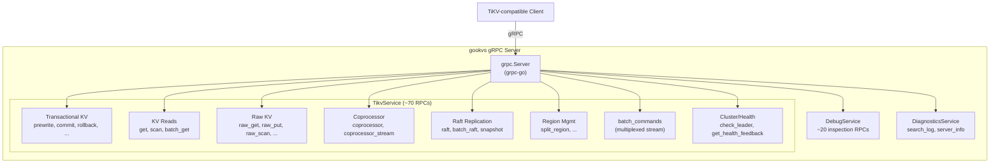
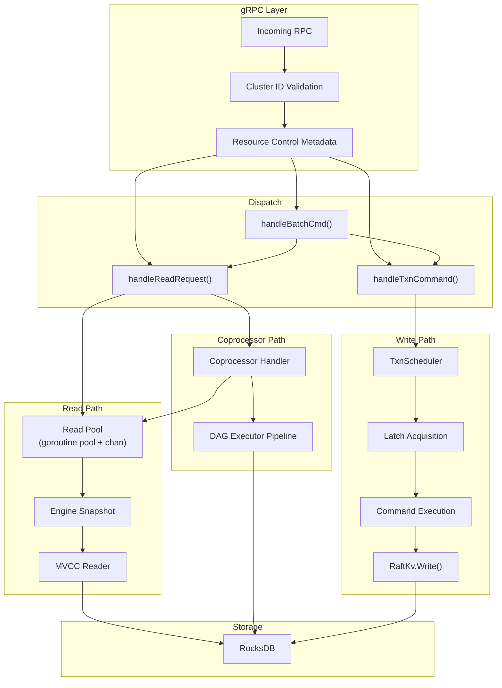

# gRPC API and Server

This document specifies gookvs's gRPC server layer: all services and RPCs, request routing to internal subsystems, flow control and backpressure mechanisms, connection management, the HTTP status server, the PD client protocol, and inter-node Raft message transport.

> **Reference**: [impl_docs/grpc_api_and_server.md](../impl_docs/grpc_api_and_server.md) — TiKV's Rust-based server layer that gookvs draws from.

**Cross-references**: [Architecture Overview](00_architecture_overview.md), [Raft and Replication](02_raft_and_replication.md), [Transaction and MVCC](03_transaction_and_mvcc.md), [Coprocessor](04_coprocessor.md)

---

## 1. gRPC Services Overview

gookvs exposes three gRPC services on a single `grpc.Server` instance, wire-compatible with TiKV's external API:

| Service | Package | Purpose |
|---------|---------|---------|
| **TikvService** | `internal/server` | Primary KV operations, transactions, replication, coprocessor |
| **DebugService** | `internal/server` | Internal debugging and state inspection |
| **DiagnosticsService** | `internal/server` | System info, log searching |

All RPCs validate the cluster ID from request context before processing. Mismatched cluster IDs are rejected immediately with an `InvalidClusterID` error.



---

## 2. TikvService RPCs

The TikvService contains ~70 RPCs organized into categories. Three dispatch patterns handle request routing.

### 2.1 Dispatch Patterns

gookvs uses three dispatch helper functions (replacing TiKV's macro-based dispatch):

| Dispatch Pattern | Go Implementation | Used By |
|------------------|-------------------|---------|
| **handleReadRequest** | Validates cluster ID, extracts resource metadata, dispatches to read pool goroutine | `KvGet`, `KvScan`, `RawGet`, `Coprocessor`, etc. |
| **handleTxnCommand** | Converts gRPC request to `TypedCommand`, routes through `Storage.SchedTxnCommand()` | `KvPrewrite`, `KvCommit`, `KvCleanup`, etc. |
| **handleBatchCmd** | Routes sub-commands within `BatchCommands` streaming RPC | All sub-request types |

**Divergence from TiKV**: TiKV uses Rust macros (`handle_request!`, `txn_command_future!`, `handle_cmd!`) for dispatch code generation. gookvs uses regular Go helper functions with generics where appropriate, since Go lacks procedural macros.

### 2.2 KV Transactional RPCs

| RPC | TypedCommand | Description |
|-----|-------------|-------------|
| `KvPrewrite` | `Prewrite` | Percolator prewrite: acquires locks, writes provisional data |
| `KvCommit` | `Commit` | Converts locks to write records |
| `KvCleanup` | `Cleanup` | Cleans up a timed-out transaction's lock |
| `KvBatchRollback` | `BatchRollback` | Rolls back locks for a list of keys |
| `KvTxnHeartBeat` | `TxnHeartBeat` | Extends lock TTL to prevent premature cleanup |
| `KvCheckTxnStatus` | `CheckTxnStatus` | Checks transaction state, resolves expired locks |
| `KvCheckSecondaryLocks` | `CheckSecondaryLocks` | Checks secondary lock status for async commit |

### 2.3 Pessimistic Lock RPCs

| RPC | TypedCommand | Description |
|-----|-------------|-------------|
| `KvPessimisticLock` | `AcquirePessimisticLock` | Acquires pessimistic locks before prewrite |
| `KvPessimisticRollback` | `PessimisticRollback` | Releases pessimistic locks on abort |

### 2.4 Lock Resolution RPCs

| RPC | Internal Routing | Description |
|-----|-----------------|-------------|
| `KvResolveLock` | `ResolveLock` command → scheduler | Batch-resolves locks for a transaction |
| `KvScanLock` | `storage.ScanLock()` | Scans locks within a key range (used by GC) |

### 2.5 KV Read RPCs

| RPC | Internal Routing | Description |
|-----|-----------------|-------------|
| `KvGet` | `storage.Get()` | Point read with MVCC snapshot |
| `KvScan` | `storage.Scan()` | Range scan with MVCC snapshot |
| `KvBatchGet` | `storage.BatchGet()` | Multi-key batch read |
| `KvBufferBatchGet` | Buffered batch get | Batch get with buffering optimization |
| `MvccGetByKey` | MVCC introspection | Returns MVCC info for a key |
| `MvccGetByStartTs` | MVCC introspection | Returns MVCC info for a transaction's start_ts |

### 2.6 Raw KV RPCs

Raw KV operations bypass the transaction layer, operating directly on the storage engine:

| RPC | Description |
|-----|-------------|
| `RawGet` / `RawBatchGet` | Point and batch reads |
| `RawPut` / `RawBatchPut` | Point and batch writes |
| `RawDelete` / `RawBatchDelete` | Point and batch deletes |
| `RawScan` / `RawBatchScan` | Forward range scans |
| `RawDeleteRange` | Deletes all keys in a range |
| `RawGetKeyTtl` | Gets TTL for a raw key |
| `RawCompareAndSwap` | Atomic CAS operation |
| `RawChecksum` | Computes checksum over a key range |

### 2.7 Coprocessor RPCs

| RPC | Internal Routing | Description |
|-----|-----------------|-------------|
| `Coprocessor` | `copr.ParseAndHandleUnaryRequest()` | Push-down DAG/Analyze/Checksum execution |
| `CoprocessorStream` | Streaming coprocessor | Server-streaming variant for large results |
| `RawCoprocessor` | Plugin dispatch | Runs V2 plugin code against raw KV |

### 2.8 Raft Replication RPCs

| RPC | Internal Routing | Description |
|-----|-----------------|-------------|
| `Raft` | `handleRaftMessage()` → raft router | Individual Raft messages (legacy) |
| `BatchRaft` | `handleRaftMessage()` per msg → raft router | Batched Raft messages (default) |
| `Snapshot` | `SnapTask` → snap worker | Receives snapshot chunk stream |

### 2.9 Region Management RPCs

| RPC | Description |
|-----|-------------|
| `SplitRegion` | Triggers region split |
| `UnsafeDestroyRange` | Destroys all data in a range (admin) |

### 2.10 Batch Operations

| RPC | Description |
|-----|-------------|
| `BatchCommands` | Multiplexed bidirectional stream carrying sub-requests |

`BatchCommands` is the primary transport for TiDB→gookvs communication. It carries a stream of `BatchCommandsRequest` messages, each containing multiple sub-requests. A `ReqBatcher` aggregates compatible get/raw-get sub-requests to reduce per-request overhead.

### 2.11 Cluster and Health RPCs

| RPC | Description |
|-----|-------------|
| `CheckLeader` | Checks region leader status for stale reads |
| `GetStoreSafeTs` | Returns store-level safe timestamp |
| `GetLockWaitInfo` | Returns current pessimistic lock wait chains |
| `GetHealthFeedback` | Returns health status for client-side load balancing |

### 2.12 DebugService RPCs (~20)

Internal state inspection: Raft log/region info queries, direct engine operations (get, scan_mvcc, compact), store/cluster info, Prometheus metrics retrieval, consistency checks, recovery operations.

### 2.13 DiagnosticsService RPCs

| RPC | Description |
|-----|-------------|
| `SearchLog` | Server-streaming log search with regex, time range, log level filters |
| `ServerInfo` | System diagnostics: hardware, load, system info |

---

## 3. Request Routing Architecture



### 3.1 Read Path

```
gRPC goroutine
  → handleReadRequest() (validation, metrics, resource control)
    → storage.Get() / storage.Scan() / storage.BatchGet()
      → readPool <- readTask  (dispatch to read pool goroutine)
        → engine.NewSnapshot()
          → mvccReader.PointGet() / mvccReader.Scan()
            → RocksDB point lookup or range iteration
```

Read requests are dispatched to the **read pool** (a goroutine worker pool consuming from a buffered channel). The pool supports a busy threshold check (§4.1) that can reject requests before queueing.

### 3.2 Write Path (Transactional)

```
gRPC goroutine
  → handleTxnCommand() (converts request to TypedCommand)
    → storage.SchedTxnCommand(cmd)
      → txnScheduler.RunCmd(cmd)
        → memoryQuota.Acquire() check
        → flowController.ShouldDrop() check
        → latch.Acquire(sortedKeyHashes)
          → execute command (prewrite/commit/rollback/etc.)
            → mvccTxn accumulates writes
            → raftKv.Write(writeBatch)
              → Raft proposal → commit → apply → RocksDB
```

### 3.3 Coprocessor Path

```
gRPC goroutine
  → handleReadRequest()
    → copr.ParseAndHandleUnaryRequest()
      → busyThreshold check
      → readPool <- coprTask
        → DAGRequest parsing → executor pipeline
          → BatchExecutor chain (TableScan → Selection → ...)
            → RPN expression evaluation
```

Coprocessor requests share the read pool with KV reads and undergo the same busy threshold check. The "light task" optimization (requests < 5ms) bypasses the concurrency semaphore.

---

## 4. Flow Control and Backpressure

gookvs implements multi-layered overload protection, translating TiKV's mechanisms to Go-idiomatic patterns.

### 4.1 Read Pool Busy Threshold

```go
// ReadPool estimates wait time using EWMA of task execution time.
type ReadPool struct {
    workers     int
    taskCh      chan readTask
    ewmaSlice   atomic.Int64   // EWMA of task execution time (nanoseconds)
    queueDepth  atomic.Int64   // current tasks queued
}

// CheckBusy rejects the request if estimated wait exceeds the client's threshold.
func (rp *ReadPool) CheckBusy(ctx context.Context, thresholdMs uint32) error {
    estimatedWait := rp.ewmaSlice.Load() * rp.queueDepth.Load() / int64(rp.workers)
    if thresholdMs > 0 && estimatedWait > int64(thresholdMs)*int64(time.Millisecond) {
        return &ServerIsBusyError{
            Reason:          "estimated wait time exceeds threshold",
            EstimatedWaitMs: uint32(estimatedWait / int64(time.Millisecond)),
        }
    }
    return nil
}
```

- EWMA updated every 200ms
- Clients specify `busy_threshold_ms` in request context
- Both KV reads and coprocessor requests check this threshold

### 4.2 Write Flow Controller

The flow controller monitors RocksDB compaction pressure and applies two mechanisms:

#### 4.2.1 Probabilistic Request Dropping

```go
type FlowController struct {
    discardRatio atomic.Uint32  // stored as fixed-point 0–1000 (0.0–1.0)
}

// ShouldDrop probabilistically drops requests based on compaction pressure.
func (fc *FlowController) ShouldDrop() bool {
    ratio := float64(fc.discardRatio.Load()) / 1000.0
    if ratio > 0 && rand.Float64() < ratio {
        return true
    }
    return false
}
```

The discard ratio is computed from RocksDB pending compaction bytes:
```
if pending_compaction_bytes in [soft_limit, hard_limit]:
    discard_ratio = (pending - soft) / (hard - soft)
```

#### 4.2.2 Write Rate Limiting

```go
// Consume returns a Duration the caller must wait before proceeding.
func (fc *FlowController) Consume(regionID uint64, bytes int64) time.Duration
```

Adapts dynamically based on five RocksDB signals: memtable fullness, L0 file accumulation, L0 production flow, L0 consumption flow, and pending compaction bytes. Minimum wait granularity is 1ms.

### 4.3 Scheduler Memory Quota

```go
type MemoryQuota struct {
    capacity  int64           // default: 256 MB
    used      atomic.Int64
}

// Acquire allocates memory for a task. Returns error if quota exhausted.
func (mq *MemoryQuota) Acquire(size int64) error {
    for {
        old := mq.used.Load()
        if old+size > mq.capacity {
            return ErrSchedTooBusy
        }
        if mq.used.CompareAndSwap(old, old+size) {
            return nil
        }
    }
}

// Release frees memory when a task completes.
func (mq *MemoryQuota) Release(size int64) {
    mq.used.Add(-size)
}
```

Each task allocates from the quota **before** acquiring latches. If exhausted, rejected with `ServerIsBusy` ("scheduler is busy").

### 4.4 Raft Message Rejection on Memory Pressure

```go
func (s *TikvService) needsRejectRaftAppend() bool {
    if !memoryUsageReachesHighWater() {
        return false
    }
    raftUsage := raftEntriesMemUsage() + raftMessagesMemUsage()
    totalUsage := totalMemoryUsage()
    return float64(raftUsage) > float64(totalUsage) * s.rejectRatio
}
```

When system memory is under pressure and Raft-related memory exceeds the configured ratio, incoming `MsgAppend` messages are dropped. The sender retries via Raft protocol.

### 4.5 gRPC-Level Resource Limits

| Parameter | Default | Purpose |
|-----------|---------|---------|
| `GrpcConcurrentStream` | 1024 | Max concurrent HTTP/2 streams per connection |
| `GrpcStreamInitialWindowSize` | 2 MB | HTTP/2 flow control window per stream |

**Divergence from TiKV**: TiKV uses grpcio's `ResourceQuota` for memory control. grpc-go manages memory differently — use `grpc.MaxRecvMsgSize()` and `grpc.MaxSendMsgSize()` server options instead.

### 4.6 Quota Limiter (CPU, Bandwidth)

```go
// QuotaLimiter enforces per-operation CPU and bandwidth quotas.
type QuotaLimiter struct {
    cpuLimiter       *rate.Limiter   // millicpu tokens, 100ms refill
    writeBWLimiter   *rate.Limiter   // bytes per write, 1ms refill
    readBWLimiter    *rate.Limiter   // bytes per read, 1ms refill
}

// Consume returns the delay duration the caller should wait.
func (ql *QuotaLimiter) Consume(cpuTime time.Duration, readBytes, writeBytes int64) time.Duration
```

Separate foreground and background limiters allow prioritizing user traffic over GC/compaction.

### 4.7 Error Propagation

All busy/overload conditions produce structured errors flowing back to clients:

| Condition | Error | Reason |
|-----------|-------|--------|
| Read pool overloaded | `ServerIsBusy` | "estimated wait time exceeds threshold" + `estimated_wait_ms` |
| Scheduler memory full | `ServerIsBusy` | "scheduler is busy" |
| GC worker overloaded | `ServerIsBusy` | "gc worker is busy" |
| Flow controller drop | Request dropped | Client retries |
| Raft message rejected | Message dropped | Sender retries via Raft |

---

## 5. Go gRPC Server Design

### 5.1 Server Struct

```go
// Server encapsulates the gRPC server and all server-side components.
type Server struct {
    grpcServer       *grpc.Server
    listenAddr       string
    securityMgr      *SecurityManager
    healthController *HealthController

    // Service dependencies
    storage          *Storage
    coprocessor      *Coprocessor
    raftRouter       Router
    snapWorker       *SnapWorker
    pdClient         PDClient
    debugger         *Debugger

    // Transport
    raftClient       *RaftClient
    resolver         StoreAddrResolver

    // Metrics
    grpcThreadLoad   *ThreadLoadTracker

    // Lifecycle
    ctx              context.Context
    cancel           context.CancelFunc
    wg               sync.WaitGroup
}
```

### 5.2 Server Lifecycle

```go
// NewServer creates a Server with all dependencies.
func NewServer(cfg ServerConfig, deps ServerDeps) (*Server, error)

// Start binds the gRPC server and begins accepting connections.
func (s *Server) Start() error {
    // 1. Configure gRPC server options (TLS, interceptors, limits)
    // 2. Register TikvService, DebugService, DiagnosticsService
    // 3. Start snap worker goroutine
    // 4. Start status HTTP server goroutine
    // 5. Start gRPC server (grpcServer.Serve)
    // 6. Set health controller to "serving"
}

// Stop gracefully shuts down all server components.
func (s *Server) Stop() {
    // 1. Set health controller to "not serving"
    // 2. GracefulStop gRPC server
    // 3. Stop snap worker
    // 4. Stop status HTTP server
    // 5. Cancel context, wait for goroutines
}
```

### 5.3 TLS Configuration

```go
// SecurityManager handles TLS certificate loading and client validation.
type SecurityManager struct {
    certFile    string
    keyFile     string
    caFile      string
    allowedCNs  map[string]struct{}
    mu          sync.RWMutex
    tlsConfig   *tls.Config
}

// ServerCredentials returns grpc.ServerOption for TLS.
func (sm *SecurityManager) ServerCredentials() grpc.ServerOption

// ClientCredentials returns grpc.DialOption for outgoing connections.
func (sm *SecurityManager) ClientCredentials() grpc.DialOption

// CheckCN validates the peer certificate's Common Name.
func (sm *SecurityManager) CheckCN(ctx context.Context) error
```

Certificate hot-reload is implemented by periodically checking file modification times (not filesystem watchers), reloading the `tls.Config` under `mu` when changed. The `tls.Config.GetCertificate` callback enables seamless rotation.

---

## 6. gRPC Middleware / Interceptor Design

### 6.1 Interceptor Stack

gookvs uses grpc-go's interceptor chain for cross-cutting concerns:

```go
func buildServerOptions(cfg ServerConfig, sm *SecurityManager) []grpc.ServerOption {
    return []grpc.ServerOption{
        grpc.ChainUnaryInterceptor(
            clusterIDInterceptor(cfg.ClusterID),
            resourceControlInterceptor(),
            metricsInterceptor(),
            quotaLimiterInterceptor(cfg.QuotaLimiter),
        ),
        grpc.ChainStreamInterceptor(
            clusterIDStreamInterceptor(cfg.ClusterID),
            metricsStreamInterceptor(),
        ),
        grpc.MaxRecvMsgSize(cfg.MaxRecvMsgSize),
        grpc.MaxSendMsgSize(cfg.MaxSendMsgSize),
        grpc.MaxConcurrentStreams(uint32(cfg.ConcurrentStreams)),
        grpc.KeepaliveParams(keepalive.ServerParameters{
            Time:    cfg.KeepaliveTime,
            Timeout: cfg.KeepaliveTimeout,
        }),
        sm.ServerCredentials(),
    }
}
```

### 6.2 Key Interceptors

```go
// clusterIDInterceptor validates cluster ID on every request.
func clusterIDInterceptor(expectedID uint64) grpc.UnaryServerInterceptor {
    return func(ctx context.Context, req any, info *grpc.UnaryServerInfo,
        handler grpc.UnaryHandler) (any, error) {
        if clusterID := extractClusterID(req); clusterID != expectedID {
            return nil, status.Errorf(codes.FailedPrecondition,
                "invalid cluster id %d, expected %d", clusterID, expectedID)
        }
        return handler(ctx, req)
    }
}

// resourceControlInterceptor extracts resource group metadata for priority scheduling.
func resourceControlInterceptor() grpc.UnaryServerInterceptor

// metricsInterceptor records per-RPC latency and error rate metrics.
func metricsInterceptor() grpc.UnaryServerInterceptor

// quotaLimiterInterceptor enforces CPU/bandwidth quotas.
func quotaLimiterInterceptor(ql *QuotaLimiter) grpc.UnaryServerInterceptor
```

### 6.3 Middleware Pattern Options

| Option | Pros | Cons | Recommendation |
|--------|------|------|----------------|
| **grpc-go native interceptors** | Built-in, zero dependency; `ChainUnaryInterceptor`/`ChainStreamInterceptor` support ordering; type-safe | Limited to unary/stream distinction; no per-method filtering without manual check | **Recommended** — sufficient for gookvs's needs |
| **go-grpc-middleware (grpc-ecosystem)** | Rich library of pre-built interceptors (logging, recovery, auth, retry); `selector` for per-method filtering; community maintained | External dependency; some interceptors may not match gookvs's exact needs | Good for rapid prototyping; consider for logging/recovery interceptors |
| **connect-go interceptors** | Unified HTTP + gRPC middleware; simpler API; works with standard `net/http` middleware | Requires connect-go framework; not wire-compatible with grpc-go services without adapter | Not recommended — gookvs uses grpc-go |

**Decision**: Use **grpc-go native interceptors** for core concerns (cluster ID, metrics, quota). Optionally adopt **go-grpc-middleware** for recovery (panic handling) and structured logging interceptors to avoid reimplementing well-solved patterns.

---

## 7. Status Server (HTTP)

gookvs runs a separate HTTP server alongside gRPC for metrics, profiling, and administration:

```go
// StatusServer provides HTTP endpoints for observability and admin.
type StatusServer struct {
    httpServer   *http.Server
    addr         string
    securityMgr  *SecurityManager
    cfgCtrl      *ConfigController
}
```

**Divergence from TiKV**: TiKV uses Hyper (Rust HTTP). gookvs uses Go's `net/http` stdlib, which is simpler and sufficient. Default listen address: `:10080`.

### 7.1 Key Endpoints

| Endpoint | Method | Description |
|----------|--------|-------------|
| `/metrics` | GET | Prometheus-format metrics (gzip supported) |
| `/status` | GET | Basic health check (200 OK) |
| `/ready` | GET | Readiness check (200 if ready, 500 otherwise) |
| `/config` | GET | Current configuration as JSON |
| `/config` | POST | Online configuration update |
| `/debug/pprof/profile` | GET | CPU profiling (Go pprof) |
| `/debug/pprof/heap` | GET | Heap profiling |
| `/log-level` | PUT | Dynamic log level change |
| `/region/{id}` | GET | Region metadata |

**Divergence from TiKV**: Go's `net/http/pprof` package provides CPU/heap/goroutine profiling out of the box — no need for external profiling tools like TiKV's `pprof-rs`.

### 7.2 Security

- Public endpoints (no cert required): `/metrics`, `/debug/pprof/profile`
- All other endpoints require valid TLS certificates when TLS is enabled
- CN validation via `SecurityManager.CheckCN()` for admin endpoints

---

## 8. Inter-Node Raft Message Transport

### 8.1 Architecture

```mermaid
graph LR
    subgraph "Sender Node"
        PEER["Peer Goroutine"]
        ROUTER_S["Router"]
        RC["RaftClient"]
        QUEUE["Lock-free Queue<br/>(per connection)"]
        SENDER["Sender Goroutine<br/>(per connection)"]
    end

    subgraph "gRPC Stream"
        STREAM["BatchRaft stream<br/>(or Raft fallback)"]
    end

    subgraph "Receiver Node"
        RECV["batch_raft handler"]
        HANDLE["handleRaftMessage()"]
        ROUTER_R["Router"]
        PEER_R["Peer Goroutine"]
    end

    PEER -->|"RaftMessage"| ROUTER_S
    ROUTER_S --> RC
    RC -->|"hash(region_id)"| QUEUE
    QUEUE --> SENDER
    SENDER -->|"BatchRaftMessage"| STREAM
    STREAM --> RECV
    RECV --> HANDLE
    HANDLE -->|"validate store_id"| ROUTER_R
    ROUTER_R -->|"PeerMsg chan"| PEER_R
```



### 8.2 RaftClient

```go
// RaftClient manages gRPC connections to peer stores for Raft message transport.
type RaftClient struct {
    mu          sync.RWMutex
    conns       map[connKey]*connectionInfo  // (storeID, connID) → connection
    resolver    StoreAddrResolver
    security    *SecurityManager
    cfg         RaftClientConfig
}

type connKey struct {
    storeID uint64
    connID  uint64
}

type connectionInfo struct {
    queue    *lockfree.Queue[raftMessage]  // lock-free ring buffer
    notifyCh chan struct{}                 // wakes sender goroutine
    state    atomic.Int32                  // Established/Paused/Disconnected
}

// Send routes a Raft message to the appropriate connection.
func (rc *RaftClient) Send(msg *raftpb.RaftMessage) error {
    connID := seahash(msg.RegionId) % rc.cfg.RaftConnNum
    key := connKey{storeID: msg.ToPeer.StoreId, connID: connID}
    conn := rc.getOrCreateConn(key)
    return conn.queue.Push(raftMessage{msg: msg, enqueuedAt: time.Now()})
}

// Flush notifies all dirty connection senders to flush their buffers.
func (rc *RaftClient) Flush()
```

### 8.3 Connection Management

**Connection ID selection**: `seahash(region_id) % grpc_raft_conn_num` distributes load while keeping messages for the same region on the same connection (preserving ordering).

**Connection lifecycle**:
1. **Address resolution** — async call to `StoreAddrResolver` (backed by PD client). Results cached ~60 seconds.
2. **Channel creation** — `grpc.Dial()` with keepalive, TLS, and backoff configuration.
3. **Stream establishment** — tries `BatchRaft` (batched). Falls back to `Raft` (unbatched) if peer returns `UNIMPLEMENTED`.
4. **Reconnection** — on failure: reports unreachable to raft router, exponential backoff (initial 1s, max 10s), clears pending if address resolution fails.

### 8.4 Message Batching

The sender goroutine aggregates multiple `RaftMessage` into `BatchRaftMessage`. Flushed when:
- Buffer reaches `raft_msg_max_batch_size` (default: 256)
- Total size exceeds max gRPC message size minus reserved buffer (~15.5 MB)
- Flush timeout expires (adaptive: longer delay under heavy gRPC thread load for better batching)

### 8.5 Snapshot Transfer

Snapshots use a **dedicated `Snapshot` streaming RPC**, not the `BatchRaft` stream:

```go
// SnapWorker manages snapshot send and receive.
type SnapWorker struct {
    taskCh        chan SnapTask
    snapMgr       *SnapManager
    raftRouter    Router
    security      *SecurityManager
    sendSemaphore chan struct{}  // concurrent_send_snap_limit (default: 4)
    rateLimiter   *rate.Limiter // snap_io_max_bytes_per_sec
}

type SnapTask interface {
    snapTask()
}

type SnapTaskSend struct {
    Addr    string
    Message *raftpb.RaftMessage
}

type SnapTaskRecv struct {
    Stream  grpc.ServerStream
}
```

**Send path**: Extract metadata → register in SnapManager → chunk into 1 MB pieces → stream via `Snapshot()` RPC → report status to raft router.

**Receive path**: Receive chunks → write to temp file → persist → feed embedded RaftMessage to raft router.

### 8.6 Health Checking

Background goroutines perform periodic gRPC health checks (`grpc.health.v1.Health/Check`) to peer stores:

```go
type HealthChecker struct {
    interval    time.Duration  // inspect_network_interval (0 = disabled)
    timeout     time.Duration  // 5s per check
    maxLatency  sync.Map       // storeID → max observed latency
}
```

Latency data is reported to `HealthController` for PD-based peer selection.

### 8.7 Configuration

| Parameter | Default | Purpose |
|-----------|---------|---------|
| `GrpcRaftConnNum` | 1 | Parallel gRPC connections per peer store |
| `RaftClientQueueSize` | 16384 | Per-connection message queue capacity |
| `RaftMsgMaxBatchSize` | 256 | Max messages per `BatchRaftMessage` |
| `MaxGrpcSendMsgLen` | 16 MB | Max gRPC message size |
| `RaftClientMaxBackoff` | 10s | Max reconnection backoff delay |
| `GrpcKeepaliveTime` | 10s | TCP keepalive ping interval |
| `GrpcKeepaliveTimeout` | 3s | Keepalive response timeout |

---

## 9. PD Client Protocol

### 9.1 PDClient Interface

```go
// PDClient defines the protocol contract for PD communication.
type PDClient interface {
    // GetTS returns a globally unique, monotonically increasing timestamp.
    GetTS(ctx context.Context) (TimeStamp, error)

    // GetRegion returns the region containing the given key.
    GetRegion(ctx context.Context, key []byte) (*Region, *Peer, error)

    // GetRegionByID returns the region with the given ID.
    GetRegionByID(ctx context.Context, regionID uint64) (*Region, *Peer, error)

    // GetStore returns store metadata.
    GetStore(ctx context.Context, storeID uint64) (*Store, error)

    // ReportRegionHeartbeat sends a region heartbeat and receives scheduling commands.
    ReportRegionHeartbeat(req *RegionHeartbeatRequest) error

    // ReportStoreHeartbeat sends a store-level heartbeat.
    ReportStoreHeartbeat(req *StoreHeartbeatRequest) (*StoreHeartbeatResponse, error)

    // AskSplit requests new region IDs for a split operation.
    AskSplit(ctx context.Context, region *Region) (*AskSplitResponse, error)

    // AskBatchSplit requests new region IDs for multiple splits.
    AskBatchSplit(ctx context.Context, region *Region, count int) (*AskBatchSplitResponse, error)

    // ReportBatchSplit notifies PD of completed splits.
    ReportBatchSplit(ctx context.Context, regions []*Region) error

    // GetClusterID returns the cluster identifier.
    GetClusterID(ctx context.Context) uint64

    // Close shuts down the client.
    Close()
}
```

### 9.2 Region Heartbeat (Bidirectional Streaming)

Region leaders periodically send heartbeats to PD. PD responds with zero or one scheduling command:

| Command | Effect |
|---------|--------|
| `ChangePeer` / `ChangePeerV2` | Add/remove replicas |
| `TransferLeader` | Move leadership to another peer |
| `SplitRegion` | Split region at specified keys |
| `Merge` | Merge with adjacent region |

The PD worker goroutine converts these commands into internal admin requests dispatched to the raftstore router.

### 9.3 Timestamp Oracle (TSO)

```go
// TSOClient provides batched timestamp allocation via bidirectional streaming.
type TSOClient struct {
    reqCh       chan tsoRequest  // bounded: max 65536 pending
    stream      pdpb.PD_TsoClient
    batchSize   int             // max 64 per batch
}

type tsoRequest struct {
    count    uint32
    resultCh chan<- tsoResult
}
```

**Protocol**:
1. Client calls `GetTS()` which sends to `reqCh`
2. Background goroutine batches requests (max 64 per batch)
3. Sends `TsoRequest{ClusterID, Count}` to PD
4. PD responds with `TsoResponse{Timestamp{Physical, Logical}, Count}`
5. Timestamps allocated backwards: `[logical - count + 1, ..., logical]`
6. Each request receives its slice via `resultCh`

**Properties**: Monotonic, batched, flow-controlled (bounded channel prevents memory exhaustion).

### 9.4 Store Address Resolver

```go
// StoreAddrResolver resolves store IDs to network addresses via PD.
type StoreAddrResolver struct {
    pdClient  PDClient
    cache     sync.Map  // storeID → cachedAddr
    cacheTTL  time.Duration  // ~60 seconds
}

func (r *StoreAddrResolver) Resolve(ctx context.Context, storeID uint64) (string, error)
```

### 9.5 Connection Failure Handling

- **Reconnection**: Exponential backoff starting at 300ms, capped at 3 seconds
- **Forwarding mode**: When direct leader connection fails, connect to a PD follower which forwards requests
- **Retry policy**: Retryable errors (gRPC, stream disconnect) retry with reconnection; non-retryable errors return immediately
- **Default max retries**: 10 for most requests; 1 for periodic operations (heartbeats, TSO)

### 9.6 Configuration

```go
type PDConfig struct {
    Endpoints       []string          // default: ["127.0.0.1:2379"]
    RetryInterval   time.Duration     // default: 300ms
    RetryMaxCount   int               // default: -1 (infinite)
    UpdateInterval  time.Duration     // default: 10 minutes
    EnableForwarding bool             // default: false
}
```

---

## 10. Safety Invariants

1. **Cluster ID validation**: Every RPC validates cluster ID before processing, preventing cross-cluster data corruption.
2. **Region epoch checking**: Write operations carry region epoch; stale requests rejected with `EpochNotMatch` error (see [Raft and Replication](02_raft_and_replication.md)).
3. **Store ID validation for Raft messages**: `handleRaftMessage()` verifies `ToPeer.StoreId == self.StoreID`. Mismatches return `StoreNotMatch` and reset the connection.
4. **Memory pressure protection**: Multiple layers (scheduler quota, Raft message rejection, gRPC limits) prevent OOM cascading.
5. **Latch ordering**: Scheduler latches acquired in sorted hash order prevent deadlocks (see [Transaction and MVCC](03_transaction_and_mvcc.md)).
6. **TSO monotonicity**: The TSO protocol guarantees strictly increasing timestamps across all transactions.
7. **Snapshot transfer isolation**: Dedicated streams with concurrency limits and rate limiting prevent overwhelming the receiver.

---

## 11. Design Divergences from TiKV

| Aspect | TiKV (Rust) | gookvs (Go) | Rationale |
|--------|-------------|-------------|-----------|
| **Dispatch macros** | `handle_request!`, `txn_command_future!`, `handle_cmd!` Rust macros | `handleReadRequest()`, `handleTxnCommand()`, `handleBatchCmd()` helper functions | Go lacks procedural macros; functions with generics suffice |
| **gRPC framework** | grpcio (C-core wrapper) | grpc-go (pure Go) | Wire-compatible; grpc-go is the standard Go gRPC implementation |
| **Thread load tracking** | `/proc/stat` per-thread parsing | `runtime.NumGoroutine()` + goroutine-level timing | Go runtime provides goroutine metrics natively |
| **Status server** | Hyper (async Rust HTTP) | `net/http` stdlib | Go stdlib HTTP is simpler and sufficient; `pprof` built in |
| **Message queue** | `crossbeam::ArrayQueue` (lock-free) | Go lock-free queue (e.g., `go-disruptor` or channel) | Buffered channels work for most cases; lock-free queue for hot path |
| **gRPC memory quota** | grpcio `ResourceQuota` | `grpc.MaxRecvMsgSize()` / `grpc.MaxSendMsgSize()` | grpc-go manages memory differently |
| **Request proxying** | Custom proxy with `tikv-forwarded-host` metadata | Same metadata key, Go `grpc.ClientConn` pool | Wire-compatible forwarding |
