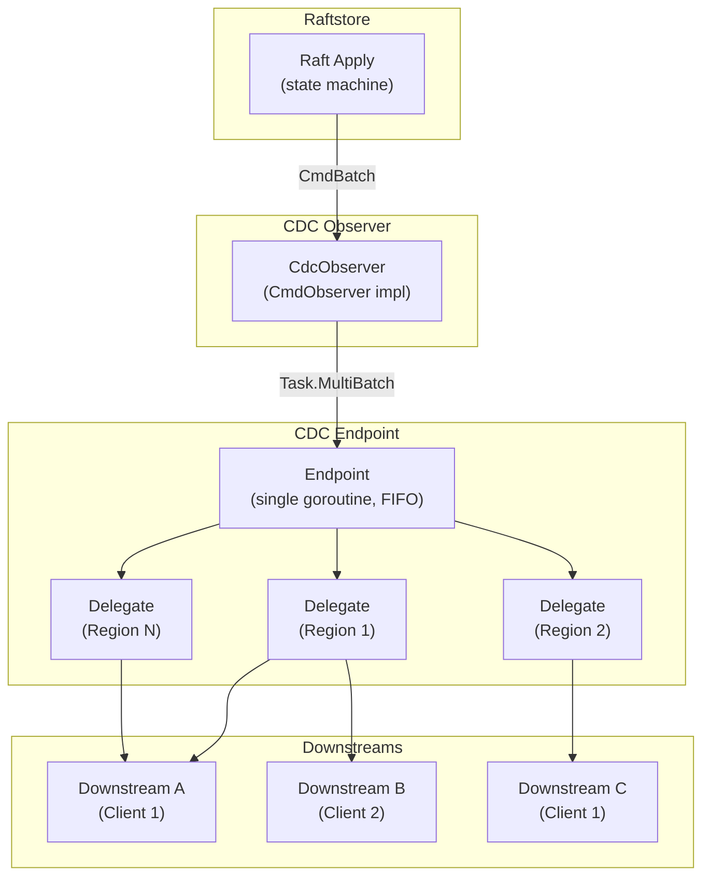
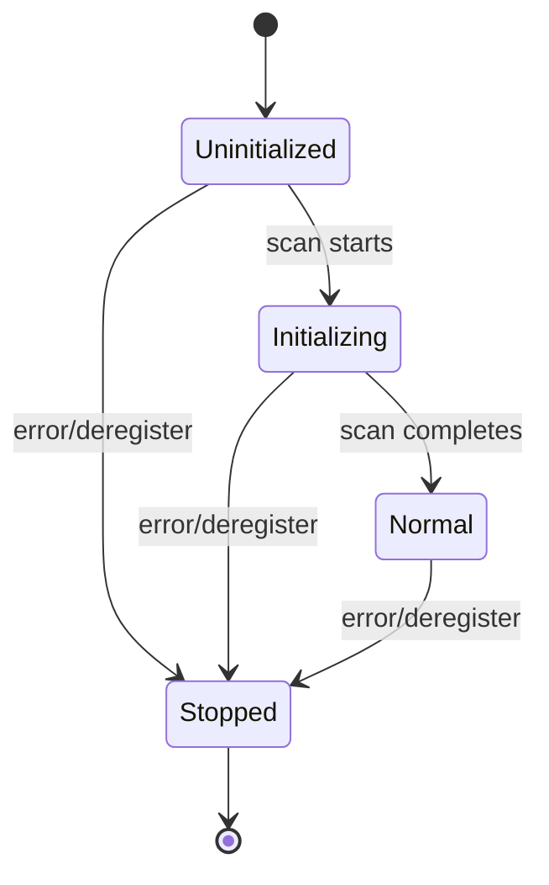
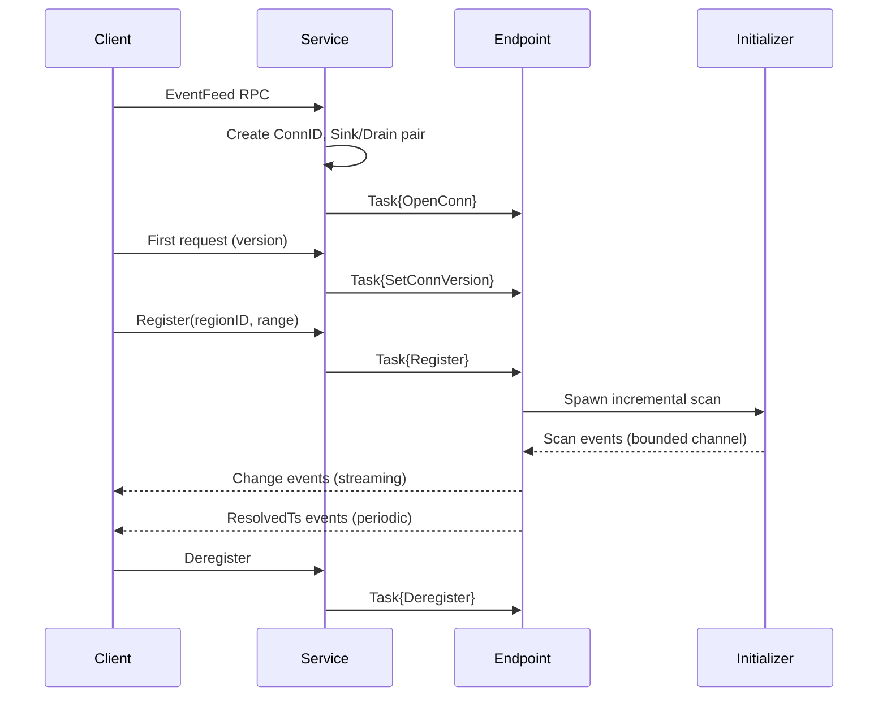
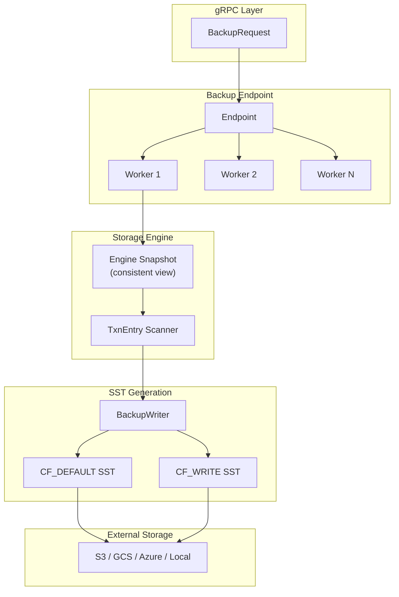
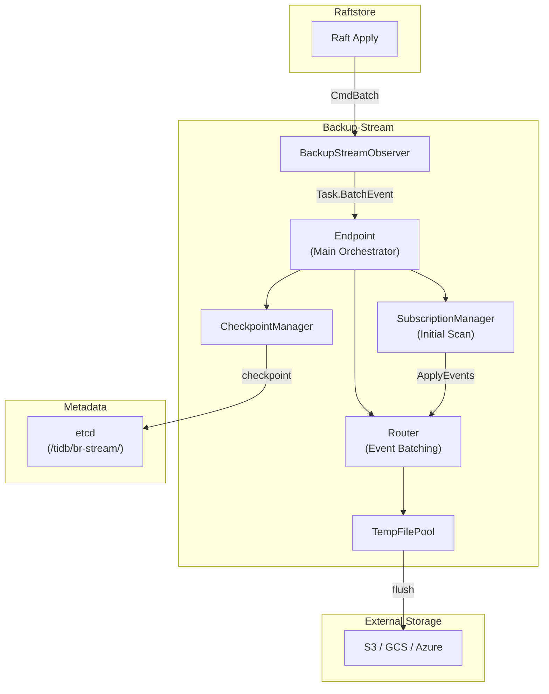
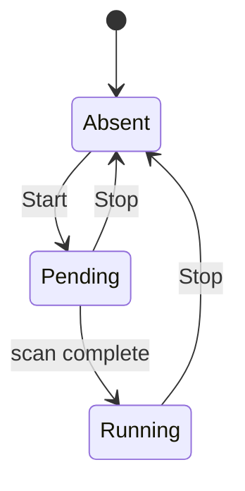
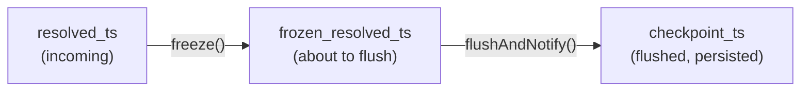
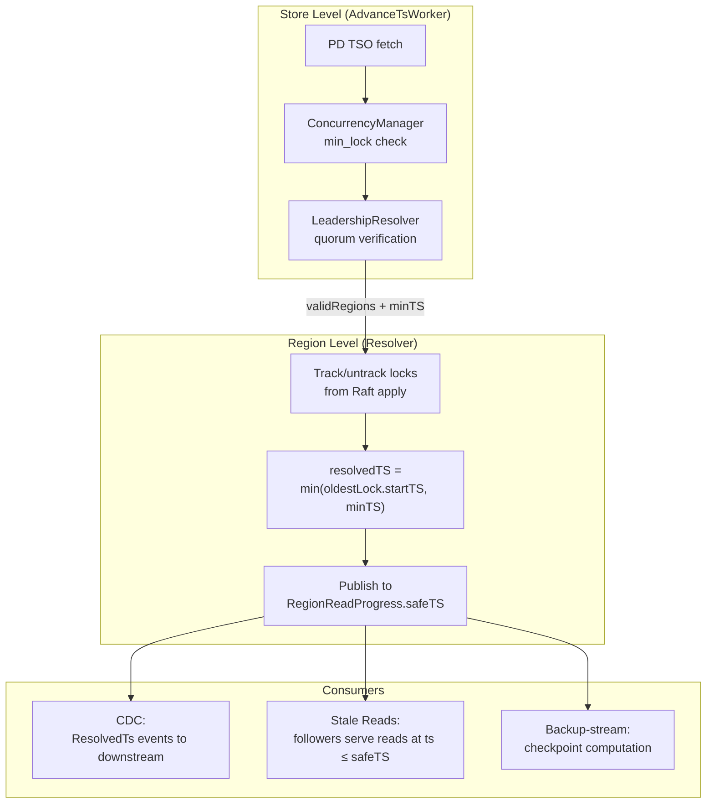
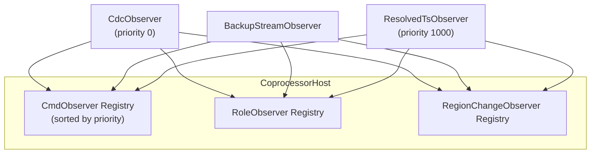

# CDC and Backup

This document specifies gookvs's Change Data Capture (CDC), full backup, log backup (PITR), and resolved timestamp subsystems. These components share a common raftstore observer pattern for capturing data changes and cooperate to provide real-time change streaming, point-in-time backup, and consistent read timestamps.

> **Reference**: [impl_docs/cdc_and_backup.md](../impl_docs/cdc_and_backup.md) — TiKV's Rust-based CDC, backup, and resolved timestamp subsystems that gookvs draws from.

**Cross-references**: [Architecture Overview](00_architecture_overview.md), [Raft and Replication](02_raft_and_replication.md), [Transaction and MVCC](03_transaction_and_mvcc.md), [gRPC API and Server](05_grpc_api_and_server.md)

---

## 1. CDC Architecture

### 1.1 Overview

CDC captures data changes from gookvs's Raft apply path and streams them to downstream consumers (primarily TiCDC). The architecture follows a producer-consumer pattern with three layers:

1. **Observer Layer** (`CdcObserver`): Hooks into raftstore to capture applied commands
2. **Delegate Layer** (`Delegate`): Per-region event processing, filtering, and old value retrieval
3. **Service/Endpoint Layer**: Manages client connections, task coordination, and event distribution



### 1.2 Event Generation from Raft Apply

CDC events originate from the raftstore's apply path. The `CdcObserver` implements the `CmdObserver` interface and is registered with the `CoprocessorHost`:

```
Raft Apply (state machine)
    ↓
CdcObserver.OnFlushAppliedCmdBatch()
    ├── Creates region snapshot (prevents old value GC during processing)
    ├── Creates oldValueCallback closure (captures snapshot)
    ├── Allocates memory quota for the batch
    └── Schedules Task{Type: MultiBatch, batches: []CmdBatch, oldValueCb}

Endpoint goroutine (single-goroutine, FIFO processing)
    ↓
For each CmdBatch in MultiBatch:
    ├── Looks up or creates Delegate for regionID
    └── Calls delegate.OnBatch(batch, oldValueCb)

Delegate.OnBatch()
    ├── Validates batch belongs to this delegate (ObserveID match)
    ├── Extracts mutations from each Cmd (Puts, Deletes, Locks)
    ├── Calls oldValueCb for each mutation needing old values
    ├── Creates EventRow for each KV change:
    │   ├── Key, Value (post-mutation)
    │   ├── OldValue (fetched from snapshot)
    │   ├── OpType (Put/Delete)
    │   ├── StartTS, CommitTS
    │   └── TxnSource (BDR/PITR tracking)
    ├── Updates lock tracking for resolved TS
    └── Calls applyToDownstreams() to fan out events
```

### 1.3 Delegate Model

Each observed region has a `Delegate` that manages event processing and multiple downstream subscribers:

```go
// Delegate manages CDC event processing for a single region.
type Delegate struct {
    RegionID    uint64
    Handle      ObserveHandle          // Link to raftstore observer (ObserveID for ABA protection)
    MemoryQuota *MemoryQuota           // Global memory quota (shared)
    LockTracker LockTracker            // Transaction lock tracking for resolved TS
    Downstreams []*Downstream          // Multiple subscribers per region
    TxnExtraOp  atomic.Value           // TxnExtraOp for old value fetch control
    Failed      bool                   // Marks delegate as failed (no more events)
}

// LockTracker tracks in-flight transactions for resolved timestamp computation.
type LockTracker interface {
    TrackLock(key []byte, startTS uint64)
    UntrackLock(key []byte)
    MinTS() uint64
}
```

#### Downstream State Machine

Each `Downstream` (one per client subscription per region) follows this state machine:



**State semantics:**
- `Uninitialized`: Created but incremental scan not yet started. No events accepted.
- `Initializing`: Incremental scan in progress. Change events accepted (from Raft apply) but resolved TS events not sent.
- `Normal`: Fully operational. Both change events and resolved TS events flow to client.
- `Stopped`: Terminal state after error or deregistration.

```go
// DownstreamState represents the lifecycle state of a downstream subscriber.
type DownstreamState int32

const (
    DownstreamStateUninitialized DownstreamState = iota
    DownstreamStateInitializing
    DownstreamStateNormal
    DownstreamStateStopped
)

// Downstream represents a single client subscription to a region.
type Downstream struct {
    ID            DownstreamID
    Peer          string               // Client IP address
    RegionEpoch   RegionEpoch          // Region version at subscription time
    ConnID        ConnID               // Connection identifier
    KvAPI         ChangeDataRequestKvAPI // TiDB or RawKV mode
    FilterLoop    bool                 // Filter looped transactions (BDR)
    ObservedRange ObservedRange        // Key range filter [startKey, endKey)
    Sink          *EventSink           // Event channel to client
    State         atomic.Int32         // DownstreamState (lock-free)
    AdvancedTo    uint64               // Latest resolved TS sent
}
```

### 1.4 Event Filtering and Assembly

Events pass through multiple filtering stages before reaching the client:

```
applyToDownstreams(entries []EventRow)
    └── For each downstream:
        ├── Check state: readyForChangeEvents()? (Initializing or Normal)
        ├── Apply ObservedRange filter: startKey <= key < endKey
        ├── Apply KvAPI filter: TiDB vs RawKV mode
        ├── Apply FilterLoop: skip if txnSource != 0 && filterLoop (BDR loop detection)
        └── Send filtered EventEntries to downstream's Sink
```

#### Event Batching

Events are batched at multiple levels for efficiency:

| Level | Mechanism | Limits |
|-------|-----------|--------|
| **EventBatcher** (per-connection) | Groups events and resolved TS separately | Max 64 events or 6 MB per response |
| **Channel** (Sink/Drain pair) | Observed events: unbounded (force-allocated); Scanned events: bounded (128 capacity) | Memory quota enforcement per event |
| **gRPC** | HTTP/2 flow control | Window size limits |

### 1.5 CDC Streaming Protocol

#### Connection Lifecycle



#### Feature Gates

Protocol capabilities negotiated via HTTP/2 headers:

| Feature | Min Version | Description |
|---------|-------------|-------------|
| `BATCH_RESOLVED_TS` | v4.0.8 | Batch resolved TS events |
| `VALIDATE_CLUSTER_ID` | v5.3.0 | Cluster ID validation |
| `STREAM_MULTIPLEXING` | explicit | Multiple regions per stream |

#### Task Types

```go
// Task represents a unit of work processed by the CDC endpoint.
type Task struct {
    Type TaskType
    // Fields populated based on Type
}

type TaskType int

const (
    TaskRegister        TaskType = iota // Subscribe to a region
    TaskDeregister                      // Unsubscribe (region/request/connection level)
    TaskOpenConn                        // New client connection
    TaskSetConnVersion                  // Set protocol version
    TaskMultiBatch                      // Process Raft apply events
    TaskMinTS                           // Advance resolved timestamp
    TaskChangeConfig                    // Dynamic configuration update
    TaskValidate                        // Validation queries
)

// DeregisterScope determines what to deregister.
type DeregisterScope int

const (
    DeregisterRegion   DeregisterScope = iota // Single region
    DeregisterRequest                         // Single request
    DeregisterDelegate                        // All downstreams for region
    DeregisterConn                            // All subscriptions for connection
)
```

### 1.6 Incremental Scan (Initializer)

When a downstream subscribes to a region, an `Initializer` performs a snapshot scan to establish the starting point before incremental events flow:

```go
// Initializer performs the initial snapshot scan for a new CDC subscription.
type Initializer struct {
    RegionID  uint64
    Sink      *EventSink           // Bounded channel for scanned events
    Resolver  *Resolver            // For lock tracking during scan
}

// Run executes the incremental scan.
func (init *Initializer) Run(ctx context.Context, snap EngineSnapshot, keyRange KeyRange) error {
    // 1. Scan KV range [startKey, endKey) in batches
    // 2. Convert existing KV pairs to EventRows
    // 3. Send to downstream via bounded sink channel
    // 4. On completion: transition downstream Initializing → Normal
    // 5. Enable resolved TS advancement for this downstream
}
```

During initialization, incremental events from Raft apply are still processed (the downstream accepts change events in `Initializing` state). This ensures no events are lost between the snapshot point and the start of incremental streaming.

### 1.7 Old Value Handling

CDC needs old values (pre-mutation values) for downstream consumers to construct complete change events.

```go
// OldValueCache is an LRU cache for pre-mutation values.
type OldValueCache struct {
    cache       *lru.Cache[Key, OldValueEntry]
    accessCount atomic.Int64
    missCount   atomic.Int64
}

// OldValue represents a pre-mutation value.
type OldValue struct {
    Type OldValueType
    // Value or reference depending on Type
}

type OldValueType int

const (
    OldValueNone          OldValueType = iota // Key didn't exist before mutation
    OldValueImmediate                         // Small value cached inline
    OldValueTimestamp                         // Reference to previous version's timestamp
    OldValueSeekWrite                         // Write metadata reference
    OldValueUnspecified                       // Unknown / not yet fetched
)
```

**Old value fetch flow:**
1. Check LRU cache (hit → return cached value)
2. On cache miss: seek in CF_WRITE for the key at query timestamp
3. Check GC fence (value must not be GC'd)
4. Fetch from CF_DEFAULT if needed (for long values)
5. Update cache and metrics

### 1.8 Transaction Source Tracking

`TxnSource` is a bitmask that tracks the origin of transactions for BDR (Bidirectional Replication) and other purposes:

```go
// TxnSource is a bitmask tracking transaction origin.
type TxnSource uint64

const (
    // Bits 0-7: CDC write source ID (1-255) for BDR sync loop detection
    TxnSourceCDCMask   TxnSource = 0xFF
    // Bits 8-15: Lossy DDL reorg backfill tracking
    TxnSourceDDLMask   TxnSource = 0xFF00
    // Bit 16: Lightning physical import mode flag
    TxnSourceLightning TxnSource = 1 << 16
)
```

When `FilterLoop` is enabled on a downstream and `txnSource != 0`, the event is skipped to prevent infinite replication loops in BDR setups.

### 1.9 Memory Quota

CDC enforces memory limits at multiple layers:

| Layer | Enforcement | Behavior |
|-------|-------------|----------|
| **Global MemoryQuota** | Allocated during `OnFlushAppliedCmdBatch()` | Force allocation (never drops observed events) |
| **Sink (observed events)** | Unbounded channel | Force-allocated |
| **Sink (scanned events)** | Bounded channel (128) | Backpressure via blocking |
| **OldValueCache** | LRU with configurable capacity | Eviction when full |
| **Connection Watchdog** | Warning at 60s idle; force deregister at 1200s idle + >99.9% quota used | Prevents stalled connections from exhausting quota |

### 1.10 Error Handling and Deregistration

| Trigger | Action |
|---------|--------|
| Leader election (NotLeader) | Deregister all downstreams for region |
| Region split/merge/destroy | Deregister region |
| Client request | Explicit deregister |
| Connection close | Deregister all subscriptions for connection |
| Delegate failure | Mark delegate as failed, stop all events |

Error propagation follows the observer pattern: `CdcObserver` receives raftstore events (role changes, region changes) and schedules `Task{Deregister}` with appropriate error information for the endpoint to handle.

---

## 2. Raftstore Observer Pattern

CDC, backup-stream, and resolved_ts all use the same raftstore coprocessor observer pattern to capture state changes. The `CoprocessorHost` provides the registration infrastructure.

### 2.1 Observer Interfaces

Three interfaces define the observer contract in Go:

```go
// CmdObserver is notified when Raft commands are applied.
type CmdObserver interface {
    // OnFlushAppliedCmdBatch is called after flushing applied commands to the state machine.
    OnFlushAppliedCmdBatch(maxLevel ObserveLevel, batches []CmdBatch, engine KvEngine)

    // OnAppliedCurrentTerm is called when leader first applies on its term.
    OnAppliedCurrentTerm(role StateRole, region *Region)
}

// RoleObserver is notified when peer roles change.
type RoleObserver interface {
    // OnRoleChange is called when peer role changes (Leader/Follower/Candidate).
    // Note: may be delayed — not guaranteed realtime.
    OnRoleChange(ctx *ObserverContext, change *RoleChange)
}

// RegionChangeObserver is notified when a region changes.
type RegionChangeObserver interface {
    // OnRegionChanged is called when a region changes (split, merge, destroy, update).
    OnRegionChanged(ctx *ObserverContext, event RegionChangeEvent, role StateRole)

    // PrePersist is called before writing to KvEngine. Returns false to block the write.
    PrePersist(ctx *ObserverContext, isFinished bool, cmd *RaftCmdRequest) bool
}
```

**Divergence from TiKV**: TiKV uses Rust traits with a `Coprocessor` supertrait. gookvs uses Go interfaces directly — composition via embedding replaces trait inheritance.

### 2.2 ObserveLevel

Each region subscription specifies an `ObserveLevel` that determines what data is captured:

```go
type ObserveLevel int

const (
    ObserveLevelNone         ObserveLevel = iota // No observation
    ObserveLevelLockRelated                      // Only CF_LOCK and CF_WRITE (used by resolved_ts)
    ObserveLevelAll                              // All CFs including CF_DEFAULT (used by CDC, backup-stream)
)
```

The maximum observe level across all registered observers determines what data the raftstore includes in `CmdBatch`. When only resolved_ts is observing (no CDC or backup-stream), `maxLevel = LockRelated` and CF_DEFAULT data is omitted to save memory.

### 2.3 Registration

Each observer registers with the `CoprocessorHost` with a priority. Lower priority numbers execute first:

| Component | CmdObserver Priority | RoleObserver Priority | RegionChangeObserver Priority |
|-----------|--------------------|--------------------|------------------------------|
| CDC | 0 | 100 | 100 |
| Backup-stream | — | 100 | 100 |
| Resolved TS | 1000 | 100 | 100 |

Resolved TS uses priority 1000 (lowest) for `CmdObserver` to ensure it runs last and sees the complete command batch after CDC and backup-stream have processed it.

```go
// CoprocessorHost manages observer registration and dispatch.
type CoprocessorHost struct {
    cmdObservers          []registeredObserver[CmdObserver]
    roleObservers         []registeredObserver[RoleObserver]
    regionChangeObservers []registeredObserver[RegionChangeObserver]
}

type registeredObserver[T any] struct {
    Priority int
    Observer T
}

// RegisterCmdObserver registers an observer with the given priority.
func (h *CoprocessorHost) RegisterCmdObserver(priority int, obs CmdObserver)
```

### 2.4 CmdBatch Structure

```go
// CmdBatch represents a batch of applied Raft commands for a single region.
type CmdBatch struct {
    ObserveID ObserveID   // Unique subscription identifier (ABA protection)
    RegionID  uint64
    Cmds      []Cmd       // Applied commands
}

// Cmd represents a single applied Raft command.
type Cmd struct {
    Index    uint64             // Raft log index
    Term     uint64             // Raft term
    Request  *RaftCmdRequest    // The command
    Response *RaftCmdResponse   // The result
}
```

The `ObserveID` prevents ABA problems: if a region is deregistered and re-registered, a new `ObserveID` is generated so stale batches from the old subscription are discarded.

---

## 3. Full Backup

### 3.1 Overview

The full backup component exports consistent snapshots of gookvs data to external storage as SST files. It operates on a per-region basis with configurable concurrency.

**Key design point**: Full backup uses **direct engine snapshots**, NOT the raftstore observer pattern — it is fundamentally different from CDC and backup-stream.



### 3.2 Backup Request Pipeline

```
BackupRequest (gRPC)
    ↓
Endpoint.HandleBackupTask()
    ├── Validate API version compatibility (V1/V1TTL/V2)
    ├── Create ExternalStorage backend (S3, GCS, Azure, local)
    └── Spawn N backup worker goroutines (N = configured numThreads)

Each worker:
    ↓
progress.Forward() — Find next region to backup
    ├── Seek regions from RegionInfoProvider
    ├── Filter by peer availability and role
    └── Return BackupRange
    ↓
BackupRange.Backup() (TxnKV) or BackupRawKV() (RawKV)
    ├── Capture engine snapshot (consistent view)
    ├── Create scanner (TxnEntryScanner or cursor)
    └── Feed entries to BackupWriter
    ↓
BackupWriter — Buffer entries into in-memory SST files
    ├── Separate CF_DEFAULT and CF_WRITE column families
    ├── Add data_key prefix (z) to keys
    ├── Calculate CRC64-XOR checksum
    └── Split files when exceeding sstMaxSize
    ↓
SaveAndBuildFile()
    ├── Encrypt with AES-256-CTR (IV per file)
    ├── Compute SHA256 integrity hash
    ├── Rate-limit upload
    └── ExternalStorage.Write() — Upload to backend
    ↓
BackupResponse (gRPC streaming) — Stream results to client
```

### 3.3 SST File Writing

```go
// BackupWriter manages two SST writers, one per column family.
type BackupWriter struct {
    Name        string
    Default     *SSTWriter   // CF_DEFAULT (user values)
    Write       *SSTWriter   // CF_WRITE (transaction metadata)
    RateLimiter *rate.Limiter
    SSTMaxSize  uint64
    Cipher      CipherInfo
}

// SSTWriter accumulates KV pairs into an in-memory SST file.
type SSTWriter struct {
    writer     SSTFileWriter
    TotalKVs   uint64
    TotalBytes uint64
    Checksum   uint64          // Running CRC64-XOR
}

// AddEntry writes a key-value pair to the appropriate column family SST.
func (bw *BackupWriter) AddEntry(cf string, key, value []byte) error

// SaveAndBuild finalizes SST files and uploads to external storage.
func (bw *BackupWriter) SaveAndBuild(ctx context.Context, storage ExternalStorage) ([]FileMeta, error)
```

**File naming convention:**
```
{storeID}_{regionID}_{sha256(startKey)}_{backendName}.sst
```

### 3.4 External Storage Abstraction

The `ExternalStorage` interface provides a unified abstraction for cloud and local storage, shared by both full backup and backup-stream:

```go
// ExternalStorage provides a unified interface for external storage backends.
type ExternalStorage interface {
    // Name returns the storage backend name (e.g., "s3", "gcs", "local").
    Name() string

    // URL returns the storage URL.
    URL() (string, error)

    // Write uploads data to external storage.
    Write(ctx context.Context, name string, reader io.Reader, contentLength int64) error

    // Read reads a file from external storage.
    Read(ctx context.Context, name string) (io.ReadCloser, error)

    // ReadRange reads a byte range from a file.
    ReadRange(ctx context.Context, name string, offset, length int64) (io.ReadCloser, error)

    // ListPrefix lists objects with the given prefix.
    ListPrefix(ctx context.Context, prefix string) iter.Seq2[BlobObject, error]

    // Delete removes a file from external storage.
    Delete(ctx context.Context, name string) error
}
```

### 3.5 External Storage Library Options

| Option | Pros | Cons | Recommendation |
|--------|------|------|----------------|
| **gocloud.dev/blob** (Go CDK) | Unified API for S3/GCS/Azure/local; well-maintained by Google; portable URL scheme (`s3://`, `gs://`, `azblob://`); supports streaming reads/writes | Adds dependency on Go CDK; may lag behind provider-specific features; limited control over retry/timeout policies | **Recommended** — best balance of portability and maintenance |
| **Provider-specific SDKs** (aws-sdk-go-v2, cloud.google.com/go/storage, azure-sdk-for-go) | Full feature access; best performance; official support; direct control over retry/auth/region | Three separate dependencies; different APIs; wrapper interface needed; more code to maintain | Good for performance-critical paths; use as fallback behind ExternalStorage interface |
| **minio-go** | S3-compatible; works with S3, MinIO, and any S3-compatible store; single dependency | S3 protocol only (no native GCS/Azure); community-maintained | Suitable if only S3-compatible backends are needed |

**Decision**: Implement `ExternalStorage` interface with **gocloud.dev/blob** as the default backend for cross-cloud portability. Optionally allow **provider-specific SDKs** as alternative backends for environments requiring maximum performance or advanced features.

### 3.6 Disk Snapshot Support

Modern backup approach using the Raft snapshot mechanism for faster, more consistent backups:

```go
// DiskSnapBackup coordinates Raft-level disk snapshots for backup.
type DiskSnapBackup struct {
    Handle       SnapshotBrHandle
    Rejector     *PrepareDiskSnapObserver  // Prevents writes during snapshot
    ActiveStream atomic.Int64              // Active stream count
}
```

**Flow:**
1. **UpdateLease**: Client periodically refreshes backup lease. Server validates lease hasn't expired. Prevents regions from applying writes during backup.
2. **WaitApply**: Broadcasts `SnapshotBrWaitApplyRequest` to leader peers. Waits for write buffer flush completion.
3. **Finish**: Resets lease state and closes gRPC stream.

### 3.7 Resource Management

```go
// SoftLimit dynamically adjusts backup worker concurrency based on CPU usage.
type SoftLimit struct {
    cpuStats    CPUStatistics
    keepRemain  int           // Reserved cores for non-backup work
    semaphore   *semaphore.Weighted
}

// Adjust recalculates the concurrency quota based on current CPU usage.
func (sl *SoftLimit) Adjust() int
```

- Dynamically adjusts worker count based on CPU usage
- Background goroutine periodically recalculates quota
- Configuration: `EnableAutoTune`, `AutoTuneRefreshInterval`, `AutoTuneRemainThreads`

---

## 4. Backup-Stream (PITR / Log Backup)

### 4.1 Overview

The backup-stream component implements continuous log backup for Point-In-Time Recovery (PITR). It captures incremental changes from gookvs via the raftstore observer pattern and writes them to external storage, enabling restoration to any point in time.



### 4.2 Subscription Tracking and State Machine

Each region follows a state machine for observation:



```go
// SubscribeState represents the observation state of a region.
type SubscribeState interface {
    subscribeState()
}

// PendingSubscription is preparing for observation (initial scan queued).
type PendingSubscription struct {
    Region *Region
}

// ActiveSubscription is fully active with resolver tracking.
type ActiveSubscription struct {
    Meta     *Region
    Handle   ObserveHandle
    Resolver *TwoPhaseResolver
}

// SubscriptionTracer tracks per-region observation state (thread-safe).
type SubscriptionTracer struct {
    regions sync.Map // regionID → SubscribeState
}
```

### 4.3 TwoPhaseResolver

The `TwoPhaseResolver` handles the concurrency challenge between initial scanning (phase 1) and incremental events (phase 2):

```go
// TwoPhaseResolver wraps the base Resolver to handle concurrent initial scan
// and incremental events.
type TwoPhaseResolver struct {
    resolver    *Resolver              // Base resolver from resolved_ts component
    futureLocks []FutureLock           // Locks from phase 2 buffered during phase 1
    stableTS    *uint64                // If non-nil, phase 1 is still active
}

// FutureLock represents a lock event buffered during phase 1.
type FutureLock struct {
    Type       FutureLockType
    Key        []byte
    StartTS    uint64
    Generation uint64
}

type FutureLockType int

const (
    FutureLockLock   FutureLockType = iota
    FutureLockUnlock
)
```

**Phase 1 (initial scan):**
- `TrackPhaseOneLock()`: Track locks found during scanning
- Incremental locks/unlocks from Raft apply are buffered in `futureLocks`
- `Resolve()` returns `min(stableTS, resolver.Resolve())` — capped at scan start point

**Phase 2 (incremental):**
- `PhaseOneDone()`: Transition to phase 2. Replays all buffered `futureLocks` into the resolver.
- `TrackLock()` / `UntrackLock()`: Directly update resolver
- `Resolve()` returns resolver's resolved TS without cap

### 4.4 Event Loading (Initial Scanning)

```go
// EventLoader performs MVCC delta scanning for initial data load.
type EventLoader struct {
    Scanner    *DeltaScanner
    Region     *Region
    EntryBatch []TxnEntry   // Batch buffer (1024 entries)
}

// InitialDataLoader manages the full scan lifecycle.
type InitialDataLoader struct {
    Semaphore *semaphore.Weighted   // Concurrency limit
    Router    *Router               // Event destination
}
```

**Flow:**
1. Acquire concurrency semaphore permit
2. Capture snapshot from coprocessor (with retry, up to 24 attempts)
3. Create EventLoader with DeltaScanner for region's key range
4. Batch entries (1024 at a time) with memory quota tracking
5. Convert TxnEntry to ApplyEvent
6. Send events to Router
7. On completion: call `PhaseOneDone()` on TwoPhaseResolver
8. Transition region to Running state

**Retry backoff**: Exponential from 1s to 16s max, up to 24 attempts. OOM backoff: 60s with jitter.

### 4.5 Event Routing and Processing

```go
// ApplyEvents represents a batch of KV events for a region.
type ApplyEvents struct {
    Events           []ApplyEvent
    RegionID         uint64
    RegionResolvedTS uint64
}

// ApplyEvent represents a single KV change event.
type ApplyEvent struct {
    Key     []byte
    Value   []byte
    CF      string       // CF_DEFAULT or CF_WRITE
    CmdType CmdType      // Put or Delete
}
```

CF_LOCK operations are processed for lock tracking but not emitted as data events.

### 4.6 Checkpoint Management

The `CheckpointManager` implements a three-phase checkpoint lifecycle:



```go
// CheckpointManager implements three-phase checkpoint lifecycle.
type CheckpointManager struct {
    checkpointTS       map[uint64]LastFlushTS  // Flushed checkpoints
    frozenResolvedTS   map[uint64]LastFlushTS  // About-to-flush
    resolvedTS         map[uint64]LastFlushTS  // Incoming (unfrozen)
    subscriberCh       chan SubscriptionOp     // To subscription manager
}

// Freeze moves resolvedTS → frozenResolvedTS before a flush.
func (cm *CheckpointManager) Freeze()

// FlushAndNotify moves frozen → checkpointTS after flush completes.
func (cm *CheckpointManager) FlushAndNotify(results []FlushResult)
```

### 4.7 Temporary File Management

Events are buffered to temporary files before flushing to external storage:

```go
// TempFilePool manages in-memory event buffers with swap-to-disk under pressure.
type TempFilePool struct {
    files           map[string]*TempFile
    compressionType CompressionType
    encryption      *BackupEncryptionManager
}
```

**Features:**
- Configurable compression type
- In-memory buffer with swap-to-disk under memory pressure
- Transparent encryption with per-file IV generation
- Reference counting and cleanup

### 4.8 Metadata Storage (Etcd)

Backup-stream persists metadata to etcd for coordination across gookvs nodes:

```
/tidb/br-stream/
    ├── info/<task_name>                           → StreamBackupTaskInfo (protobuf)
    ├── ranges/<task_name>/<start_key>             → end_key
    ├── checkpoint/<task_name>/
    │   ├── store/<store_id>                       → ts (uint64, big-endian)
    │   ├── region/<region_id>/<epoch_version>     → ts
    │   └── central_global                         → ts
    ├── storage-checkpoint/<task_name>/<store_id>  → ts
    ├── pause/<task_name>                          → "" (existence = paused)
    └── last-error/<task_name>/<store_id>          → StreamBackupError (protobuf)
```

```go
// MetadataClient manages backup-stream metadata in etcd.
type MetadataClient struct {
    StoreID    uint64
    Caches     sync.Map              // taskName → CheckpointCache
    MetaStore  MetaStore             // etcd client abstraction
}

// InitTask initializes checkpoint for store if not present.
func (mc *MetadataClient) InitTask(ctx context.Context, taskName string) error

// ReportLastError uploads fatal error to etcd.
func (mc *MetadataClient) ReportLastError(ctx context.Context, taskName string, err error) error

// GlobalCheckpoint gets coordinator-computed global checkpoint.
func (mc *MetadataClient) GlobalCheckpoint(ctx context.Context, taskName string) (uint64, error)
```

### 4.9 Observer Pattern (Backup-Stream)

```go
// BackupStreamObserver captures KV changes for regions matching configured ranges.
type BackupStreamObserver struct {
    Scheduler chan<- Task
    Ranges    sync.RWMutex // protects rangeSet
    RangeSet  *SegmentSet  // Key ranges to observe
}
```

**Filtering**: Only processes regions whose key range overlaps with registered observation ranges. Uses `SegmentSet` for efficient range intersection. When no ranges are registered (`IsHibernating() = true`), events are completely skipped.

### 4.10 End-to-End Data Flow

#### Incremental Event Flow

```
1. KV write applied in region via Raft
2. BackupStreamObserver.OnFlushAppliedCmdBatch()
3. Task{BatchEvent} sent to Endpoint
4. Endpoint converts CmdBatch → ApplyEvents, updates locks
5. Router buffers events in temp files (with compression/encryption)
6. Periodically or on demand: Task{ForceFlush}
7. Router batches into DataFileGroup, computes checksums
8. Writes to external storage (S3, GCS, etc.)
```

#### Checkpoint Update Flow

```
1. SubscriptionTracer.ResolveWith(minTS, regions)
   → For each region's TwoPhaseResolver, compute checkpoint
2. CheckpointManager.ResolveRegions(results)
   → Updates resolvedTS map
3. On flush: CheckpointManager.Freeze()
   → Moves resolvedTS → frozenResolvedTS
4. On flush completion: CheckpointManager.FlushAndNotify(results)
   → Moves frozen → checkpointTS
   → Notifies subscribers with FlushEvent
   → Persists to metadata store
```

---

## 5. Resolved Timestamp

### 5.1 Overview

Resolved Timestamp (Resolved TS) tracks the minimum timestamp guarantee: all transactions with `commitTS ≤ resolvedTS` have been fully observed. This enables:
- **CDC**: Downstream consumers know they have received all changes up to resolvedTS
- **Stale reads**: Followers can serve reads at timestamps ≤ resolvedTS without Raft round-trips
- **Backup-stream**: Checkpoint computation for PITR consistency

**Invariant**: `resolvedTS = min(oldestInFlightTxn.startTS, latestPD_TSO)`

If there are no in-flight locks, resolvedTS advances to the latest available PD timestamp.

### 5.2 Resolver (Per-Region Lock Tracking)

```go
// Resolver tracks in-flight transaction locks per-region for resolved TS computation.
type Resolver struct {
    RegionID    uint64

    // Normal transaction tracking
    locksByKey  map[string]uint64                // key → startTS
    lockTSHeap  *btree.BTreeG[lockHeapEntry]     // sorted by startTS (O(1) min)

    // Large transaction tracking (separate for efficiency)
    largeTxns              map[uint64]TxnLocks        // startTS → {count, sampleKey}
    largeTxnKeyRep         map[string]uint64           // key → startTS
    txnStatusCache         *TxnStatusCache             // Cache for large txn status

    ResolvedTS  uint64                             // Current resolved timestamp
    MinTS       uint64                             // Min TS for advancement
    TrackedIdx  uint64                             // Highest Raft index processed

    ReadProgress *RegionReadProgress               // For stale read serving
    MemoryQuota  *MemoryQuota
    Stopped      bool
}

type TxnLocks struct {
    Count     int
    SampleKey []byte
}
```

#### Dual Lock Tracking Strategy

**Normal transactions (generation=0):**
- Tracked via `locksByKey` (key → startTS) + `lockTSHeap` (startTS → TxnLocks)
- Full key-level tracking
- Memory: ~(keyLen + 8 bytes) per lock

**Large transactions (generation>0):**
- Tracked separately in `largeTxns` map
- Uses `TxnStatusCache` to look up `minCommitTS` instead of just `startTS`
- Only stores a representative key (not all keys) to reduce memory
- Status cache entries: `Ongoing{minCommitTS}`, `Committed{commitTS}`, `RolledBack`

#### Core Operations

```go
// TrackLock registers a new lock for resolved TS tracking.
func (r *Resolver) TrackLock(startTS uint64, key []byte, index uint64, generation uint64)

// UntrackLock removes a lock when committed or rolled back.
func (r *Resolver) UntrackLock(key []byte, index uint64)

// Resolve computes the current resolved timestamp.
func (r *Resolver) Resolve(minTS uint64, now time.Time, source TsSource) uint64 {
    // 1. oldestNormal = lockTSHeap.Min()            // BTree min = O(log n)
    // 2. oldestLarge = min(largeTxns[*].minCommitTS)
    //    (filtering out Committed/RolledBack via TxnStatusCache)
    // 3. oldest = min(oldestNormal, oldestLarge)
    // 4. newResolvedTS = min(oldest, minTS)
    // 5. r.ResolvedTS = max(r.ResolvedTS, newResolvedTS)  // Never decreases
    // 6. Update RegionReadProgress.safeTS for stale reads
    // 7. Return r.ResolvedTS
}
```

**Memory management:**
- Every lock tracks its heap size for quota accounting
- Aggressive map shrinking every 10 seconds
- Warning on shutdown if >64MB of tracked locks remain

**Divergence from TiKV**: TiKV uses `BTreeMap` for O(1) min lookup. Go's standard `map` is unordered, so gookvs uses a `btree.BTreeG` (e.g., from `github.com/tidwall/btree` or `github.com/google/btree`) for sorted lock tracking.

### 5.3 AdvanceTsWorker (Store-Level Advancement)

The `AdvanceTsWorker` periodically advances resolved TS across all regions on the store:

```go
// AdvanceTsWorker periodically advances resolved TS for all regions.
type AdvanceTsWorker struct {
    PDClient           PDClient
    Scheduler          chan<- Task
    ConcurrencyManager *ConcurrencyManager
    LastPDTso          struct {
        sync.Mutex
        TS   uint64
        Time time.Time
    }
}
```

#### Advancement Flow

```
Every advanceTSInterval:
    1. Fetch latest PD TSO
    2. Update ConcurrencyManager.maxTS (for async commit)
    3. Check CM for global min memory lock:
       if CM.GlobalMinLock() < PD_TSO:
           minTS = CM.GlobalMinLock()
           tsSource = MemoryLock
       else:
           minTS = PD_TSO
           tsSource = PdTso
    4. Verify leadership via LeadershipResolver
    5. Schedule Task{ResolvedTsAdvanced{validRegions, minTS, tsSource}}
    6. Re-schedule next advancement round
```

#### LeadershipResolver (Multi-Store Quorum Verification)

Before advancing resolved TS, leadership must be verified across the cluster to prevent split-brain:

```go
// LeadershipResolver verifies region leadership via quorum checks.
type LeadershipResolver struct {
    TikvClients       map[uint64]*grpc.ClientConn  // Cached gRPC connections
    StoreID           uint64                       // Local store ID
    ReadProgressReg   *RegionReadProgressRegistry
}

// Resolve verifies leadership for the given regions and returns valid ones.
func (lr *LeadershipResolver) Resolve(ctx context.Context, regions []ObserveRegion, minTS uint64) ([]uint64, error)
```

**Verification process:**
1. **Local check**: If region has quorum on local store, resolve immediately
2. **Batch CheckLeader RPCs**: Send batched requests to remote stores (gzip compressed for large payloads)
3. **Quorum validation**: `(respVoters + respIncomingVoters) >= (voters + incomingVoters)/2 + 1`
4. **Return valid regions**: Only regions with confirmed quorum leadership are advanced

### 5.4 Observer (Resolved TS)

```go
// ResolvedTsObserver captures lock changes from raftstore for resolved TS tracking.
type ResolvedTsObserver struct {
    Scheduler   chan<- Task
    MemoryQuota *MemoryQuota
}
```

**Registration priorities:**
- `CmdObserver`: priority 1000 (runs last — sees complete command batch)
- `RoleObserver`: priority 100
- `RegionChangeObserver`: priority 100

**Lock-only filter optimization:**
- When ONLY resolved_ts observing (CDC not active): keep CF_LOCK and CF_WRITE, drop CF_DEFAULT
- When both CDC and resolved_ts observing: keep all operations

This optimization reduces memory consumption when only resolved_ts is tracking a region.

### 5.5 Scanner (Initialization)

When a region becomes leader, existing locks must be discovered:

```go
// ScannerPool manages concurrent lock scanning for newly-elected leaders.
type ScannerPool struct {
    Workers   int                     // goroutine pool size
    Semaphore *semaphore.Weighted     // concurrency limit (default: 4)
}

// ScanTask describes a lock scan for a region.
type ScanTask struct {
    Handle       ObserveHandle
    Region       *Region
    CheckpointTS uint64
    Backoff      time.Duration       // Backoff before starting
    CancelCh     <-chan struct{}     // Cancellation signal
}
```

**Scan execution:**
1. **Backoff** (optional, exponential: 10^(retry-1) for re-registration after errors)
2. **Get snapshot** (up to 3 attempts)
3. **Scan locks** (batched, 128 entries per batch): only Put and Delete lock types (skips Lock, Pessimistic)
4. **Complete**: signal scan done to endpoint

### 5.6 Endpoint (Orchestration)

```go
// ResolvedTsEndpoint orchestrates per-region lock tracking and TS advancement.
type ResolvedTsEndpoint struct {
    Regions       map[uint64]*ObserveRegion   // Per-region state
    AdvanceWorker *AdvanceTsWorker            // Store-level advancement
    ScannerPool   *ScannerPool                // Lock scanning workers
    MemoryQuota   *MemoryQuota
    ScanSemaphore *semaphore.Weighted
    Config        ResolvedTsConfig
}

// ObserveRegion tracks a single region's resolved TS state.
type ObserveRegion struct {
    Meta           *Region
    Handle         ObserveHandle
    Resolver       *Resolver
    ResolverStatus ResolverStatus
}

type ResolverStatus int

const (
    ResolverStatusPending ResolverStatus = iota // Scan in progress, buffering locks
    ResolverStatusReady                         // Scan complete, tracking live
)
```

**Task processing:**

| Task | Pending State | Ready State |
|------|---------------|-------------|
| `RegisterRegion` | Create ObserveRegion, spawn scanner | — |
| `ChangeLog` | Buffer locks in pending vec | Directly update resolver |
| `ScanLocks` | Track scanned locks; on done: transition → Ready, replay buffered | — |
| `ResolvedTsAdvanced` | — | Call resolver.Resolve() for each valid region |
| `DeRegisterRegion` | Cancel scanner, remove | Remove |

### 5.7 Resolved TS Propagation



### 5.8 Diagnostics

- **Slow region detection**: Logs region ID, gap from current time, lock details, min memory lock from ConcurrencyManager
  - Leader threshold: `expectedInterval + 1s` grace
  - Follower threshold: `2 × expectedInterval + 1s` grace
- **Diagnosis callback**: Returns stopped flag, resolvedTS, trackedIndex, numLocks, numTransactions

---

## 6. Component Interactions

### 6.1 Shared Observer Registration

All three components (CDC, backup-stream, resolved_ts) register with the same `CoprocessorHost`:



Each observer independently processes events and manages its own subscriptions, but they share the same raftstore hooks. The `ObserveLevel` of the `CmdBatch` is the maximum requested by any active observer.

### 6.2 CDC ↔ Resolved TS

- CDC uses resolved TS to generate `ResolvedTs` events for downstream consumers
- CDC's `Delegate` maintains its own `LockTracker` independently from the resolved_ts component's `Resolver`
- Both share the `ConcurrencyManager` for in-memory lock visibility

### 6.3 Backup-Stream ↔ Resolved TS

- Backup-stream's `TwoPhaseResolver` wraps the `Resolver` from the resolved_ts component
- Checkpoint computation directly depends on resolved TS values
- Both use the same `MemoryQuota` accounting pattern
- Backup-stream adds the two-phase initialization protocol on top of the base resolver

### 6.4 Full Backup Independence

Full backup operates independently of CDC and resolved_ts:
- Uses engine snapshots directly (not raftstore observer pattern)
- Does not track or compute resolved timestamps
- Can use disk snapshot mode for Raft-level consistency
- Shares `ExternalStorage` abstraction with backup-stream

---

## 7. Design Divergences from TiKV

| Aspect | TiKV (Rust) | gookvs (Go) | Rationale |
|--------|-------------|-------------|-----------|
| **Observer traits** | Rust traits with `Coprocessor` supertrait | Go interfaces with composition | Go interfaces are structurally typed; no trait inheritance needed |
| **Lock-free state** | `AtomicCell<DownstreamState>` | `atomic.Int32` for state enum | Go atomics are simpler; same lock-free semantics |
| **Delegate fan-out** | `Vec<Downstream>` with index-based access | `[]*Downstream` slice | Identical pattern in Go |
| **Event channels** | Rust MPSC channels (bounded/unbounded) | Go buffered/unbuffered channels | Native Go channel semantics; select for multiplexing |
| **LRU cache** | Custom `LruCache` | `github.com/hashicorp/golang-lru` or `groupcache/lru` | Well-tested Go LRU libraries available |
| **Concurrent map** | `DashMap` for SubscriptionTracer | `sync.Map` | Go stdlib concurrent map; same sharded locking semantics |
| **Sorted lock set** | `BTreeMap<TimeStamp, TxnLocks>` | `btree.BTreeG` (tidwall/btree or google/btree) | Go stdlib lacks sorted map; B-tree libraries provide O(log n) min |
| **Endpoint thread model** | Single-threaded tokio runtime per endpoint | Single goroutine with channel-based task queue | Go scheduler handles goroutine scheduling |
| **Memory quota** | `Arc<MemoryQuota>` with atomic ops | `*MemoryQuota` with `atomic.Int64` | Same pattern; Go uses pointer sharing instead of Arc |
| **Temp file swap** | Custom swap-to-disk with mmap | `os.File` with `bufio.Writer`; swap via `os.Rename` | Simpler Go I/O; mmap not needed for sequential writes |
| **Metadata store** | etcd client (rust-etcd) | `go.etcd.io/etcd/client/v3` | Official Go etcd client; native integration |
| **Semaphore** | tokio `Semaphore` | `golang.org/x/sync/semaphore.Weighted` | Standard Go semaphore implementation |
