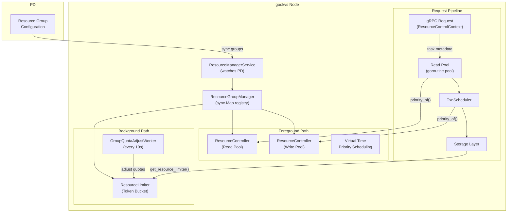
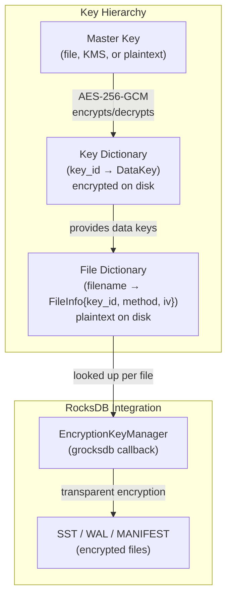
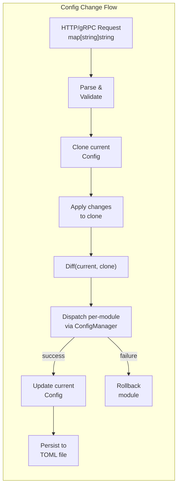
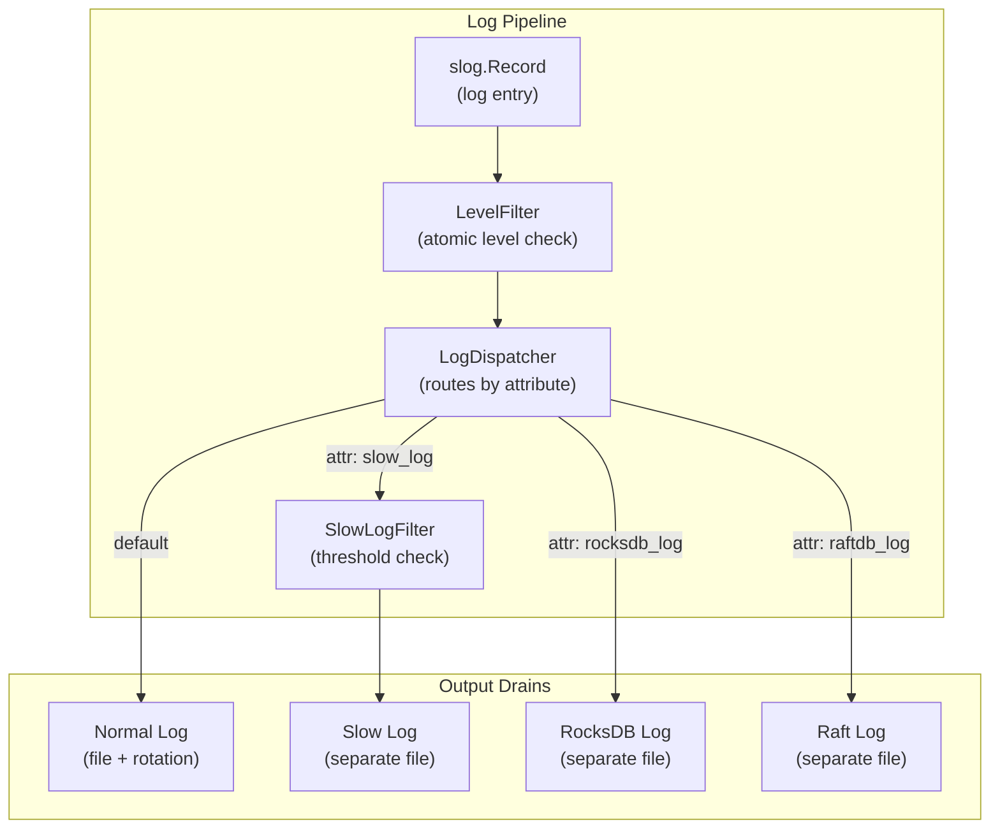

# Resource Control, Security, and Configuration

This document specifies gookvs's resource control (multi-tenant quota and priority scheduling), encryption at rest, TLS security, configuration system (runtime-changeable config hierarchy), and logging/diagnostics subsystems. These form the operational infrastructure enabling multi-tenancy, data protection, and runtime management.

> **Reference**: [impl_docs/resource_control_security_config.md](../impl_docs/resource_control_security_config.md) — TiKV's Rust-based resource control, encryption, security, and configuration subsystems that gookvs draws from.

**Cross-references**: [Architecture Overview](00_architecture_overview.md), [gRPC API and Server](05_grpc_api_and_server.md), [Raft and Replication](02_raft_and_replication.md), [Transaction and MVCC](03_transaction_and_mvcc.md)

---

## 1. Resource Control

### 1.1 Architecture Overview

gookvs implements a multi-tenant resource control system that enforces CPU and I/O quotas across **resource groups**. Resource groups are managed by PD (Placement Driver) and synced to gookvs nodes. The system uses virtual-time priority scheduling for foreground tasks and token bucket rate limiting for background tasks.

**Core Components:**

| Component | Package | Role |
|-----------|---------|------|
| `ResourceGroupManager` | `internal/resourcecontrol` | Central registry of resource groups; holds `sync.Map` of groups and references to controllers |
| `ResourceController` | `internal/resourcecontrol` | Per-pool (read/write) priority scheduler using virtual time; implements task priority provider interface |
| `ResourceLimiter` | `internal/resourcecontrol` | Token bucket rate limiter for CPU (microseconds) and I/O (bytes) for background tasks |
| `QuotaLimiter` | `internal/resourcecontrol` | Single-resource-type limiter (CPU or IO) with atomic statistics tracking |
| `ResourceManagerService` | `internal/resourcecontrol` | Watches PD for group config changes; reports consumption back to PD |
| `GroupQuotaAdjustWorker` | `internal/resourcecontrol` | Background goroutine that dynamically adjusts background task quotas based on system utilization |



### 1.2 Resource Group Model

Resource groups are configured in PD and synced to gookvs nodes via the `ResourceManagerService`. Each group has:

- **RU (Request Unit) Quota** — an abstract cost unit combining CPU and I/O
- **Priority Level** — High (11–16), Medium (7–10, default), or Low (1–6)
- **Background Source Types** — job types (e.g., `"br"`, `"lightning"`) matched against request source
- **Optional ResourceLimiter** — for background tasks only

```go
// ResourceGroup holds the state for one resource group.
type ResourceGroup struct {
    pb             *pdpb.ResourceGroup      // Protobuf definition from PD
    limiter        *ResourceLimiter          // Token bucket for background tasks (nil if foreground-only)
    bgSourceTypes  map[string]struct{}       // Background job type matching
    fallbackDefault bool                     // Fall back to default group if unmatched
}

// ResourceGroupManager is the central registry.
type ResourceGroupManager struct {
    groups         sync.Map                  // name → *ResourceGroup
    readController  *ResourceController      // Priority scheduler for read pool
    writeController *ResourceController      // Priority scheduler for write pool
}
```

A **default resource group** always exists and is used when a request does not specify a group.

**Request Source Format:** `{external|internal}_{tidb_req_source}_{source_task_name}`

### 1.3 RU (Request Unit) Cost Model

Resource consumption is measured in Request Units (RU). The default pricing model (configured from PD):

| Metric | Default Cost |
|--------|-------------|
| Read base cost | 1/8 RU per read |
| Read byte cost | 1/(64×1024) RU per byte |
| Read CPU cost | 1/3 RU per millisecond of CPU |
| Write base cost | 1.0 RU per write |
| Write byte cost | 1/1024 RU per byte |

```
read_ru  = (read_cpu_ms_cost × cpu_consumed_ms) + (read_cost_per_byte × read_bytes)
write_ru = write_cost_per_byte × write_bytes
```

Consumption statistics are periodically reported back to PD for billing and quota enforcement.

### 1.4 Priority Scheduling (Virtual Time Algorithm)

The `ResourceController` implements priority scheduling for the goroutine worker pool using a **virtual time** algorithm. This ensures fair CPU time allocation proportional to each group's RU quota.

```go
// ResourceController implements task priority scheduling for one pool (read or write).
type ResourceController struct {
    mu       sync.RWMutex
    trackers map[string]*PriorityTracker   // group_name → tracker
}

// PriorityTracker tracks virtual time for one resource group.
type PriorityTracker struct {
    groupPriority uint64           // High=11-16, Medium=7-10, Low=1-6
    virtualTime   atomic.Uint64   // Monotonically advancing virtual clock
    weight        float64          // max_ru_quota / group_ru_quota × 10.0
}

// PriorityOf returns the scheduling priority for a task.
// Lower return value = higher scheduling priority.
func (rc *ResourceController) PriorityOf(meta TaskMetadata) uint64 {
    tracker := rc.trackers[meta.GroupName]
    // Priority = (group_priority << 60) | virtual_time
    return (tracker.groupPriority << 60) + tracker.virtualTime.Load()
}

// Consume advances virtual time after task execution.
func (rc *ResourceController) Consume(groupName string, resourceType ResourceType, delta uint64) {
    tracker := rc.trackers[groupName]
    var vtDelta uint64
    if resourceType == ResourceTypeRead {
        vtDelta = uint64(float64(defaultPriorityPerReadTask) * tracker.weight) // 50µs × weight
    } else {
        vtDelta = uint64(float64(delta) * tracker.weight)
    }
    tracker.virtualTime.Add(vtDelta)
}
```

**Periodic virtual time balancing** (every 1 second): find minimum virtual time across all active groups, advance lagging groups toward the minimum to prevent starvation, and reset all if approaching overflow (`math.MaxUint64 / 16`).

**Task Metadata Propagation:**

```
gRPC ResourceControlContext (in request)
    ↓ encode
TaskMetadata (priority + group_name)
    ↓ set in context.Context
Worker pool goroutine
    ↓ read by
ResourceController.PriorityOf()
    ↓ determines
Task queue ordering in worker pool
```

### 1.5 Token Bucket Rate Limiting

Background tasks use a `ResourceLimiter` with separate CPU and I/O token buckets:

```go
// ResourceLimiter rate-limits background tasks.
type ResourceLimiter struct {
    cpuLimiter  *QuotaLimiter   // Tokens = microseconds of CPU time
    ioLimiter   *QuotaLimiter   // Tokens = bytes (read + write)
    isBackground bool
}

// QuotaLimiter is a single-resource token bucket.
type QuotaLimiter struct {
    limiter      *rate.Limiter   // golang.org/x/time/rate; 1-second refill
    totalWaitDur atomic.Int64    // Cumulative wait time (microseconds)
    readBytes    atomic.Uint64
    writeBytes   atomic.Uint64
    reqCount     atomic.Uint64
}

// Consume returns the wait duration before the task may proceed.
// Minimum wait duration is 1ms to avoid busy-spinning.
func (ql *QuotaLimiter) Consume(ctx context.Context, tokens int) (time.Duration, error) {
    reservation := ql.limiter.ReserveN(time.Now(), tokens)
    delay := reservation.Delay()
    if delay < time.Millisecond {
        delay = time.Millisecond
    }
    select {
    case <-time.After(delay):
        return delay, nil
    case <-ctx.Done():
        reservation.Cancel()
        return 0, ctx.Err()
    }
}
```

### 1.6 Background Quota Adjustment

The `GroupQuotaAdjustWorker` runs every 10 seconds and dynamically adjusts background task quotas based on system resource utilization:

```
FUNCTION adjustBackgroundQuotas():
    // 1. Measure system utilization
    totalCPU := runtime.NumCPU()
    currentUsed := observedUtilization()
    backgroundConsumed := sum(backgroundGroupConsumption)

    // 2. Calculate available budget (reserve 20% for foreground spikes)
    available := (totalQuota - currentUsed + backgroundConsumed) × 0.8

    // 3. Allocate across background groups
    // Minimum floor: 10% of total per group
    // Sort by (expectedCostRate / ruQuota) for balanced allocation
    IF available >= sum(expectedCosts):
        // Sufficient: each group gets max(expected, minimumShare)
    ELSE:
        // Constrained: allocate by RU share proportion
```

**Priority Control Strategy** (configurable, default Moderate):
- **Aggressive:** Targets 50% utilization (favors high-priority tasks)
- **Moderate:** Targets 70% utilization (balanced)
- **Conservative:** Targets 90% utilization (favors throughput)

### 1.7 Integration with Request Pipeline

Resource control integrates at multiple points in the request processing pipeline:

```
gRPC Request (ResourceControlContext)
    ↓
┌───────────────────────────────────────────┐
│ Read Pool (goroutine worker pool)         │
│  ResourceController → priority scheduling │
│  controlledTask → CPU consumption track   │
│  limitedTask → token bucket waiting       │
└───────────────────────────────────────────┘
    ↓
┌───────────────────────────────────────────┐
│ TxnScheduler                              │
│  ResourceController → write task priority │
│  QuotaLimiter → quota delay after exec    │
└───────────────────────────────────────────┘
    ↓
┌───────────────────────────────────────────┐
│ Storage Layer                             │
│  GetResourceLimiter() per command         │
│  Background task token bucket enforcement │
└───────────────────────────────────────────┘
```

**Read Pool Double-Wrapping Pattern:**
1. `controlledTask` — wraps the task goroutine to track CPU time via `ResourceController.Consume()`
2. `limitedTask` (via `WithResourceLimiter()`) — wraps again for token bucket delay enforcement

**Go Design Divergence:** TiKV uses `ControlledFuture` and `LimitedFuture` wrapping Rust futures. gookvs uses goroutine middleware pattern — each wrapper is a function that takes a `func()` task and returns a `func()` with additional behavior.

### 1.8 Library Options for Rate Limiting

| Option | Pros | Cons | Recommendation |
|--------|------|------|----------------|
| **`golang.org/x/time/rate`** | Stdlib-adjacent, well-tested, simple API, `ReserveN` for non-blocking checks | No built-in per-key limiting; single token type per limiter | **Recommended** — covers QuotaLimiter needs |
| **`uber-go/ratelimit`** | Leaky bucket with jitter support; predictable latency | No reservation API; blocking-only; less flexible for dual CPU/IO buckets | Not recommended |
| **`juju/ratelimit`** | Simple token bucket with `TakeAvailable` | Less maintained; no context-aware waiting | Not recommended |

---

## 2. Encryption at Rest

### 2.1 Architecture Overview

gookvs implements **transparent encryption at rest** using a two-tier key hierarchy. All file-level encryption is transparent to upper layers via RocksDB's (grocksdb) encryption environment integration.



### 2.2 Key Hierarchy

#### Master Key

The master key protects the key dictionary. It is never used to encrypt data files directly.

| Backend | Description |
|---------|-------------|
| `PlaintextBackend` | No encryption (testing only) |
| `FileBackend` | Hex-encoded 256-bit key in a 65-byte file; uses AES-256-GCM to encrypt key dictionary |
| `KmsBackend` | Cloud KMS (AWS, Azure, GCP); 10-second timeout per operation; caches encrypted data key |
| `MultiMasterKeyBackend` | Multiple keys for backup/restore operations |

```go
// MasterKeyConfig determines the master key source.
type MasterKeyConfig struct {
    Type     string      // "plaintext", "file", "kms"
    FilePath string      // For "file" type: path to hex-encoded key
    KMS      *KMSConfig  // For "kms" type
}

type KMSConfig struct {
    KeyID    string // KMS key identifier
    Region   string // Cloud region
    Endpoint string // KMS endpoint URL
    Vendor   string // "aws", "azure", or "gcp"
}

// MasterKey is the interface for all master key backends.
type MasterKey interface {
    Encrypt(plaintext []byte) ([]byte, error)
    Decrypt(ciphertext []byte) ([]byte, error)
}
```

#### Data Keys

Data keys are generated randomly and used for actual file encryption. Each data key has a unique 64-bit ID.

**Supported Encryption Methods:**

| Method | Key Length | Mode |
|--------|-----------|------|
| AES-128-CTR | 16 bytes | Counter mode, 16-byte IV |
| AES-192-CTR | 24 bytes | Counter mode, 16-byte IV |
| AES-256-CTR | 32 bytes | Counter mode, 16-byte IV |
| SM4-CTR | 16 bytes | Counter mode (Chinese national standard) |

### 2.3 DataKeyManager

The `DataKeyManager` is the central coordinator for all encryption operations.

```go
// DataKeyManager manages the encryption key lifecycle.
type DataKeyManager struct {
    fileDict      sync.Map             // filename → *FileInfo (lock-free hot path)
    fileDictFile  *sync.Mutex          // protects persistent file dictionary
    keyDict       sync.Mutex           // protects key dictionary
    currentKeyID  atomic.Uint64        // lock-free current key lookup
    rotationPeriod time.Duration       // default: 7 days
    method        EncryptionMethod     // active encryption algorithm
    rotateCh      chan rotateTask       // channel to background goroutine
    basePath      string               // dictionary storage path
}

// FileInfo holds per-file encryption metadata.
type FileInfo struct {
    KeyID  uint64
    Method EncryptionMethod
    IV     [16]byte
}

// File Operations (grocksdb integration):
func (m *DataKeyManager) GetFile(fname string) (*FileInfo, error)    // lookup
func (m *DataKeyManager) NewFile(fname string) (*FileInfo, error)    // create (new IV, current key)
func (m *DataKeyManager) DeleteFile(fname string) error              // remove
func (m *DataKeyManager) LinkFile(src, dst string) error             // copy metadata
func (m *DataKeyManager) RenameFile(src, dst string) error           // move metadata
```

### 2.4 Key Rotation

A background goroutine checks every 10 minutes whether the current data key has exceeded its rotation period:

```
Background goroutine:
    LOOP:
        WAIT min(10 minutes, rotationPeriod)

        currentKey := keyDict[currentKeyID]
        IF currentKey.CreationTime + rotationPeriod < time.Now():
            // Generate new data key
            newID, newKey := generateDataKey(method)

            // Add to key dictionary
            keyDict[newID] = DataKey{Key: newKey, ...}

            // Re-encrypt key dictionary with master key and save to disk
            encryptedDict := masterKey.Encrypt(serialize(keyDict))
            writeToDisk(encryptedDict)

            // Atomically update current key ID
            currentKeyID.Store(newID)
```

**Master Key Rotation:** gookvs supports seamless master key rotation via `PreviousMasterKey` config. During startup, if decryption with the current master key fails, it falls back to `PreviousMasterKey`.

### 2.5 RocksDB Integration

grocksdb's `EncryptionKeyManager` callback interface is implemented by a wrapper that delegates to `DataKeyManager`:

```go
// EncryptionKeyManagerAdapter adapts DataKeyManager to grocksdb's interface.
type EncryptionKeyManagerAdapter struct {
    manager *DataKeyManager
}

// On startup:
// if DataKeyManager is configured:
//     env = grocksdb.NewEncryptedEnv(baseEnv, adapter)
//     // All SST, WAL, MANIFEST files encrypted transparently
// else:
//     env = baseEnv  // No encryption
```

The encryption is completely transparent to the storage and transaction layers above RocksDB.

### 2.6 Library Options for Cryptography

| Option | Pros | Cons | Recommendation |
|--------|------|------|----------------|
| **`crypto/aes` + `crypto/cipher` (stdlib)** | No external dependency; hardware-accelerated AES-NI on amd64; well-audited | SM4-CTR requires external package | **Recommended** for AES modes |
| **`github.com/emmansun/gmsm`** | SM4-CTR support; pure Go with amd64/arm64 assembly optimization | Additional dependency | **Recommended** for SM4 support |
| **`golang.org/x/crypto`** | Additional cipher modes (XChaCha20) | Not needed for TiKV-compatible methods | Not needed |

---

## 3. TLS and Security

### 3.1 SecurityConfig

```go
// SecurityConfig controls all TLS and access control settings.
type SecurityConfig struct {
    CAPath          string            // CA certificate file (PEM)
    CertPath        string            // Server/client certificate file (PEM)
    KeyPath         string            // Private key file (PEM)
    OverrideSSLTarget string          // Test override for SSL target name
    CertAllowedCN  map[string]struct{} // Allowed client Common Names (mTLS)
    RedactInfoLog  RedactOption       // Log redaction for sensitive data
    Encryption     EncryptionConfig   // Encryption at rest config (nested)
}
```

**Validation Rule:** All three files (CAPath, CertPath, KeyPath) must be either all present or all absent. Partial configuration is rejected at startup.

### 3.2 SecurityManager

The `SecurityManager` provides TLS-enabled gRPC connection construction:

```go
// SecurityManager manages TLS credentials for both server and client.
type SecurityManager struct {
    cfg *SecurityConfig
}

// ServerTLSConfig returns a tls.Config for the gRPC server.
// Uses tls.Config.GetCertificate for hot-reload support.
func (sm *SecurityManager) ServerTLSConfig() (*tls.Config, error) {
    if sm.cfg.CAPath == "" {
        return nil, nil // Plaintext
    }
    return &tls.Config{
        GetCertificate: sm.certificateReloader(),
        ClientAuth:     tls.RequireAndVerifyClientCert,
        ClientCAs:      sm.loadCACertPool(),
        // ...
    }, nil
}

// ClientTLSCredentials returns grpc.DialOption for TLS client connections.
func (sm *SecurityManager) ClientTLSCredentials() grpc.DialOption {
    if sm.cfg.CAPath == "" {
        return grpc.WithTransportCredentials(insecure.NewCredentials())
    }
    // Load CA, cert, key → tls.Config → credentials.NewTLS()
    return grpc.WithTransportCredentials(creds)
}
```

### 3.3 Mutual TLS (mTLS) Enforcement

When `CertAllowedCN` is configured, the server enforces mutual TLS with Common Name validation:

```go
// CNCheckInterceptor is a gRPC unary interceptor for CN validation.
func CNCheckInterceptor(allowedCN map[string]struct{}) grpc.UnaryServerInterceptor {
    return func(ctx context.Context, req interface{},
        info *grpc.UnaryServerInfo, handler grpc.UnaryHandler) (interface{}, error) {

        p, ok := peer.FromContext(ctx)
        if !ok || p.AuthInfo == nil {
            return nil, status.Error(codes.Unauthenticated, "no client certificate")
        }
        tlsInfo := p.AuthInfo.(credentials.TLSInfo)
        cn := tlsInfo.State.PeerCertificates[0].Subject.CommonName
        if _, allowed := allowedCN[cn]; !allowed {
            return nil, status.Errorf(codes.PermissionDenied, "CN %q not allowed", cn)
        }
        return handler(ctx, req)
    }
}
```

**Go Design Divergence:** TiKV uses grpcio's `ServerChecker` callback. gookvs uses a standard gRPC unary/stream interceptor, which is the idiomatic grpc-go pattern for per-request authentication.

### 3.4 Certificate Hot-Reload

gookvs supports zero-downtime certificate rotation using `tls.Config.GetCertificate`:

```go
// certificateReloader returns a function that reloads certificates when files change.
func (sm *SecurityManager) certificateReloader() func(*tls.ClientHelloInfo) (*tls.Certificate, error) {
    var (
        mu       sync.RWMutex
        cert     *tls.Certificate
        lastMod  time.Time
    )
    return func(_ *tls.ClientHelloInfo) (*tls.Certificate, error) {
        modTime := fileModTime(sm.cfg.CertPath)
        mu.RLock()
        if modTime.Equal(lastMod) && cert != nil {
            defer mu.RUnlock()
            return cert, nil
        }
        mu.RUnlock()

        // Reload
        mu.Lock()
        defer mu.Unlock()
        newCert, err := tls.LoadX509KeyPair(sm.cfg.CertPath, sm.cfg.KeyPath)
        if err != nil {
            // Graceful degradation: keep using previous certificate
            return cert, nil
        }
        cert = &newCert
        lastMod = modTime
        return cert, nil
    }
}
```

**Go Design Divergence:** TiKV uses grpcio's `ServerCredentialsFetcher` with `is_modified()` polling. gookvs leverages `tls.Config.GetCertificate`, which is called on every TLS handshake — the callback internally checks file modification timestamps, providing equivalent behavior with no custom polling loop.

### 3.5 Log Redaction

| Value | Behavior |
|-------|----------|
| `Off` (default) | Full data in logs |
| `On` | Sensitive data replaced with `?` |
| `Marker` | Sensitive data wrapped with markers for selective filtering |

---

## 4. Configuration System

### 4.1 Config Struct Hierarchy

The root `Config` struct contains all configuration as a nested hierarchy of sub-config structs. Each sub-config is tagged for runtime changeability:

```go
// Config is the root configuration struct for gookvs.
type Config struct {
    Log            LogConfig            `toml:"log"            online:"submodule"`
    Memory         MemoryConfig         `toml:"memory"         online:"submodule"`
    Quota          QuotaConfig          `toml:"quota"          online:"submodule"`
    ReadPool       ReadPoolConfig       `toml:"readpool"       online:"submodule"`
    Server         ServerConfig         `toml:"server"         online:"submodule"`
    Storage        StorageConfig        `toml:"storage"        online:"submodule"`
    PD             PDConfig             `toml:"pd"             online:"skip"`
    RaftStore      RaftStoreConfig      `toml:"raft-store"     online:"submodule"`
    Coprocessor    CoprocessorConfig    `toml:"coprocessor"    online:"submodule"`
    RocksDB        RocksDBConfig        `toml:"rocksdb"        online:"submodule"`
    RaftDB         RaftDBConfig         `toml:"raftdb"         online:"submodule"`
    Security       SecurityConfig       `toml:"security"       online:"submodule"`
    Import         ImportConfig         `toml:"import"         online:"submodule"`
    Backup         BackupConfig         `toml:"backup"         online:"submodule"`
    LogBackup      LogBackupConfig      `toml:"log-backup"     online:"submodule"`
    PessimisticTxn PessimisticTxnConfig `toml:"pessimistic-txn" online:"submodule"`
    GC             GCConfig             `toml:"gc"             online:"submodule"`
    Split          SplitConfig          `toml:"split"          online:"submodule"`
    CDC            CDCConfig            `toml:"cdc"            online:"submodule"`
    ResolvedTS     ResolvedTSConfig     `toml:"resolved-ts"    online:"submodule"`
    ResourceControl ResourceControlConfig `toml:"resource-control" online:"submodule"`
    CfgPath        string               `toml:"-"              online:"hidden"`
    SlowLogFile    string               `toml:"slow-log-file"  online:"skip"`
    SlowLogThreshold Duration           `toml:"slow-log-threshold" online:"skip"`
}
```

**Tag semantics:**
- `online:"submodule"` — Field is itself an online-changeable struct; changes propagated recursively
- `online:"skip"` — Startup-only; not eligible for runtime change
- `online:"hidden"` — Internal/deprecated; hidden from config serialization
- (no tag) — Field supports direct online change

### 4.2 Online Config Change Model

gookvs uses a **diff-update model** for runtime configuration changes, replacing TiKV's `OnlineConfig` derive macro with Go reflection and struct tags.

```go
// ConfigChange represents a set of configuration changes.
type ConfigChange map[string]ConfigValue

// ConfigValue is a sum type for configuration values.
type ConfigValue interface {
    configValue() // marker interface
}

// Concrete ConfigValue types:
type (
    DurationValue  time.Duration
    SizeValue      uint64        // bytes
    Uint64Value    uint64
    Float64Value   float64
    Int32Value     int32
    BoolValue      bool
    StringValue    string
    ModuleValue    ConfigChange  // nested sub-config changes
    SkipValue      struct{}      // field not eligible for online change
)
```

```go
// OnlineConfig provides diff/update operations for runtime config changes.
type OnlineConfig interface {
    Diff(other OnlineConfig) ConfigChange
    Update(change ConfigChange) error
}
```

**Go Design Divergence:** TiKV uses the `#[online_config]` derive macro to generate `diff()`, `update()`, and `get_encoder()` methods. gookvs uses Go reflection (`reflect` package) to walk struct fields at runtime, reading `online` struct tags to determine changeability. This trades compile-time code generation for runtime flexibility.



### 4.3 ConfigController

The `ConfigController` is the runtime config change coordinator:

```go
// ConfigController coordinates runtime configuration changes.
type ConfigController struct {
    mu         sync.Mutex
    current    *Config
    managers   map[Module]ConfigManager
}

// Module identifies a configurable subsystem.
type Module int

const (
    ModuleReadPool Module = iota
    ModuleServer
    ModuleRaftStore
    ModuleCoprocessor
    ModuleRocksDB
    ModuleRaftDB
    ModuleStorage
    ModuleSecurity
    ModuleEncryption
    ModuleBackup
    ModulePessimisticTxn
    ModuleGC
    ModuleSplit
    ModuleCDC
    ModuleResolvedTS
    ModuleResourceControl
    ModuleLogBackup
    ModuleQuota
    ModuleLog
    ModuleMemory
    // ...
)

// ConfigManager handles side effects of config changes for one module.
type ConfigManager interface {
    Dispatch(change ConfigChange) error
}
```

**Online Config Change Flow:**

```
FUNCTION Update(changes map[string]string) error:
    // 1. VALIDATION PHASE
    candidate := current.Clone()
    candidate.Apply(changes)
    if err := candidate.Validate(); err != nil {
        return err
    }
    diff := current.Diff(candidate)

    // 2. DISPATCH PHASE
    FOR each (module, moduleChange) in diff:
        IF manager, ok := managers[module]; ok:
            if err := manager.Dispatch(moduleChange); err != nil {
                // Rollback this module only; other modules may still succeed
                return fmt.Errorf("module %s: %w", module, err)
            }
            current.Update(moduleChange)

    // 3. PERSISTENCE PHASE
    mergeChangesToTOML(configFile, changes)
```

**Key Properties:**
- **Atomic per-module:** If a module's dispatch fails, that module's changes are rolled back; other modules may still succeed
- **Validation before dispatch:** Config constraints are checked before any side effects
- **Persistent by default:** Changes written back to TOML file
- **File reload:** `UpdateFromTOMLFile()` reloads the entire config file and computes diff from current state

### 4.4 ConfigManager Implementations

Each module implements `ConfigManager` to handle the side effects of config changes:

| Manager | Module | Side Effects |
|---------|--------|-------------|
| `LogConfigManager` | Log | Updates global log level atomically via `slog.SetDefault()` |
| `MemoryConfigManager` | Memory | Activates/deactivates heap profiling via `runtime.MemProfileRate` |
| `StorageConfigManager` | Storage | Updates block cache capacity, flow controller, scheduler pool size |
| `RocksDBConfigManager` | RocksDB | Calls grocksdb `SetOptions()` per column family; updates background jobs |
| `RaftStoreConfigManager` | RaftStore | Updates Raft timers, region size limits, tick intervals via channel send |

**Implementation Pattern:**
1. Extract specific fields from `ConfigChange`
2. Apply runtime changes (call engine APIs, update atomics, toggle features)
3. Handle nested `ModuleValue` for sub-configs
4. Log changes with `slog.Info("update config", "module", moduleName, "changes", changes)`
5. Return error only for actual failures (validation errors, engine errors)

### 4.5 Configuration Loading and Validation

**Startup Flow:**

```
1. Parse CLI flags (--config, --log-level, --log-file, --data-dir, --pd-endpoints, ...)
2. Load Config:
   IF --config provided:
       config = LoadConfigFromTOML(path)
       warnUnrecognizedKeys(path)           // Warn about unknown fields
   ELSE:
       config = DefaultConfig()
3. Apply CLI overrides:
   overwriteConfigWithFlags(&config, flags)
4. Validate and persist:
   validateAndPersistConfig(&config, persist)
```

**Validation Pipeline:**

```
1. Load last_gookvs.toml from data directory (previous config snapshot)
2. compatibleAdjust(lastCfg)             // Inherit deprecated field values
3. config.Validate()                      // Check all constraints:
   - Path setup and consistency
   - RocksDB path validation
   - Block cache auto-sizing (default: 45% of system memory)
   - Resource-based optimization
4. checkCriticalConfig(lastCfg)           // Prevent accidental breaking changes
5. Persist to last_gookvs.toml            // Snapshot for next startup
```

**Readable Types:**

```go
// ReadableSize parses human-readable size strings: "1GB", "256MB", "4KB" → bytes
type ReadableSize uint64

// ReadableDuration parses human-readable duration strings: "1h", "30s", "500ms" → time.Duration
type ReadableDuration time.Duration
```

### 4.6 Library Options for Configuration Parsing

| Option | Pros | Cons | Recommendation |
|--------|------|------|----------------|
| **`github.com/BurntSushi/toml`** | De facto Go TOML library; full TOML v1.0 support; struct tag-based decoding | No built-in schema validation | **Recommended** |
| **`github.com/pelletier/go-toml/v2`** | Faster parsing; strict mode for unknown keys; TOML v1.0 | Less widespread; API differences from v1 | Alternative |
| **`github.com/spf13/viper`** | Multi-format (TOML/YAML/JSON/env); file watching; remote config | Heavy dependency; overkill for single-format TOML | Not recommended |

---

## 5. Logging and Diagnostics

### 5.1 Logging Architecture

gookvs uses Go's `log/slog` (stdlib, Go 1.21+) as the primary logging framework, with a custom multi-handler that routes logs to separate outputs based on log attributes.



### 5.2 LogDispatcher

```go
// LogDispatcher routes log records to different handlers based on attributes.
type LogDispatcher struct {
    normal   slog.Handler   // Default handler
    slow     slog.Handler   // Slow log handler (with threshold filter)
    rocksdb  slog.Handler   // RocksDB-specific handler
    raft     slog.Handler   // Raft-specific handler
}

func (d *LogDispatcher) Handle(ctx context.Context, r slog.Record) error {
    // Route by checking for routing attributes
    switch {
    case hasAttr(r, "slow_log"):
        return d.slow.Handle(ctx, r)
    case hasAttr(r, "rocksdb_log"):
        return d.rocksdb.Handle(ctx, r)
    case hasAttr(r, "raftdb_log"):
        return d.raft.Handle(ctx, r)
    default:
        return d.normal.Handle(ctx, r)
    }
}
```

**Go Design Divergence:** TiKV uses slog (Rust) with tag-based routing via `LogDispatcher`. gookvs uses Go's `log/slog` with attribute-based routing — structurally identical but uses slog `Attr` values instead of slog tags. The `slog.Handler` interface provides the same extensibility as Rust slog's `Drain` trait.

### 5.3 Log Formats

**Text Format (TiDB-compatible):**
```
[2024/01/15 10:30:45.123 +08:00] [INFO] [server.go:256] [msg] key1=value1 key2=value2
```

**JSON Format:**
```json
{"time":"2024-01-15T10:30:45.123+08:00","level":"INFO","source":"server.go:256","msg":"msg","key1":"value1"}
```

### 5.4 Slow Log

The slow log captures operations that exceed a configurable threshold (default: 1 second).

```go
// SlowLogHandler wraps a handler with threshold-based filtering.
type SlowLogHandler struct {
    inner     slog.Handler
    threshold time.Duration
}

func (h *SlowLogHandler) Handle(ctx context.Context, r slog.Record) error {
    // Check "takes" attribute for duration
    var takes time.Duration
    r.Attrs(func(a slog.Attr) bool {
        if a.Key == "takes" {
            takes = a.Value.Duration()
            return false
        }
        return true
    })
    if takes <= h.threshold {
        return nil // Suppress: not slow enough
    }
    return h.inner.Handle(ctx, r)
}
```

**Usage Pattern:**
```go
slog.Info("slow operation", "slow_log", true, "takes", elapsed)
```

### 5.5 Log Level Runtime Changes

Log level can be changed at runtime without restart via the online config system:

```go
// logLevel is the global atomic log level.
var logLevel atomic.Value // stores slog.Level

// LevelFilter checks the global level before passing to the inner handler.
type LevelFilter struct {
    inner slog.Handler
}

func (f *LevelFilter) Enabled(_ context.Context, level slog.Level) bool {
    return level >= logLevel.Load().(slog.Level)
}

// LogConfigManager handles runtime log config changes.
type LogConfigManager struct{}

func (m *LogConfigManager) Dispatch(change ConfigChange) error {
    if lvl, ok := change["level"]; ok {
        logLevel.Store(parseLevel(lvl))
    }
    return nil
}
```

### 5.6 File Rotation

```go
// RotatingFileLogger manages log file rotation.
type RotatingFileLogger struct {
    maxSize    int64 // Maximum file size in bytes before rotation
    maxBackups int   // Number of rotated files to keep
    maxAge     int   // Maximum age in days before deletion
}
```

### 5.7 Library Options for Logging

| Option | Pros | Cons | Recommendation |
|--------|------|------|----------------|
| **`log/slog` (stdlib)** | Zero dependency; structured logging; `Handler` interface for custom routing; Go 1.21+ | No built-in file rotation; basic text format | **Recommended** as core framework |
| **`go.uber.org/zap`** | Highest performance; structured; rich field types | External dependency; Handler interface differs from slog | Use as `slog.Handler` backend via `zapslog` |
| **`github.com/rs/zerolog`** | Zero-allocation; JSON-first; very fast | No slog adapter; different API paradigm | Not recommended |
| **`gopkg.in/natefinch/lumberjack.v2`** | File rotation with size/age/count limits; implements `io.Writer` | Rotation only; no formatting | **Recommended** for file rotation |

**Recommended Combination:** `log/slog` as the API surface + `zap` core as the `slog.Handler` backend (via `zapslog.NewHandler`) for production performance + `lumberjack` for file rotation. This gives stdlib API compatibility, high performance, and production-grade file management.

---

## 6. Design Divergences from TiKV

| Area | TiKV | gookvs | Rationale |
|------|------|--------|-----------|
| Resource group registry | `DashMap` (concurrent sharded HashMap) | `sync.Map` | Go's built-in concurrent map; same semantics |
| Priority scheduling | YATP `TaskPriorityProvider` trait | Interface with `PriorityOf()` method | Go interface replaces Rust trait |
| Token bucket | Custom `Limiter` struct | `golang.org/x/time/rate.Limiter` | Well-tested stdlib-adjacent implementation |
| Atomic statistics | `AtomicU64` | `atomic.Uint64` | Go 1.19+ typed atomics |
| OnlineConfig derive macro | `#[online_config]` proc macro generates `diff()/update()/get_encoder()` | Go reflection + struct tags (`online:"submodule"`) | Go lacks proc macros; reflection is idiomatic |
| ConfigChange type | `HashMap<String, ConfigValue>` enum | `map[string]ConfigValue` interface | Same semantics, Go interface sum type |
| ConfigManager dispatch | Trait impl per module | Interface impl per module | Direct mapping |
| Logging framework | slog (Rust) with custom `LogDispatcher` Drain | `log/slog` (Go) with custom `LogDispatcher` Handler | Structural equivalence; Go has stdlib slog since 1.21 |
| Log tag routing | slog Rust tags (`# "slow_log"`) | slog attributes (`"slow_log"`, true) | Go slog uses attributes instead of tags |
| Certificate hot-reload | grpcio `ServerCredentialsFetcher` with `is_modified()` polling | `tls.Config.GetCertificate` callback | Built-in Go TLS hook; no custom polling |
| mTLS enforcement | grpcio `ServerChecker` callback | gRPC unary/stream interceptor | Idiomatic grpc-go pattern |
| Encryption | openssl bindings | `crypto/aes` + `crypto/cipher` stdlib | Go stdlib has hardware-accelerated AES-NI |

---

## 7. Cross-References

- **Request flow and flow control integration:** See [gRPC API and Server](05_grpc_api_and_server.md) §3 (Flow Control)
- **RocksDB engine configuration:** See [Key Encoding and Data Formats](01_key_encoding_and_data_formats.md)
- **Raft configuration (timers, region limits):** See [Raft and Replication](02_raft_and_replication.md)
- **CDC and backup configuration:** See [CDC and Backup](06_cdc_and_backup.md)
- **Transaction configuration (pessimistic locks, GC):** See [Transaction and MVCC](03_transaction_and_mvcc.md)
