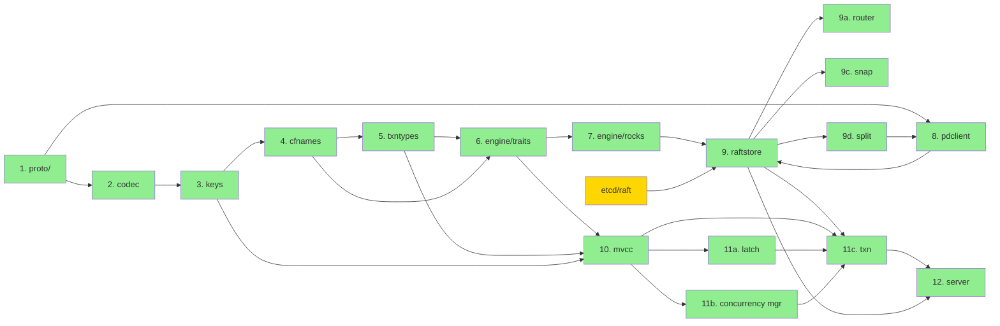

# gookvs Priority and Scope

This document organizes all components and features identified in the architecture overview into priority tiers, providing a roadmap for implementation. It will be updated incrementally as each subsystem design document is completed.

> **Reference**: [Architecture Overview](00_architecture_overview.md) — component dependency graph and package layout that seeds this ranking.

## 1. Summary Table

| Component | Tier | Complexity | Dependencies | Status | TiKV Test Area |
|-----------|------|------------|--------------|--------|----------------|
| **Foundational codec** (`pkg/codec`) | 1 – Essential | S | None | designed | `components/codec/` tests, `fuzz/codec` |
| **Key encoding** (`pkg/keys`) | 1 – Essential | S | codec | designed | `components/keys/` tests |
| **Transaction types** (`pkg/txntypes`) | 1 – Essential | M | codec, keys | designed | `components/txn_types/` tests |
| **Column family constants** (`pkg/cfnames`) | 1 – Essential | S | None | designed | N/A (constants only) |
| **Engine trait abstraction** (`internal/engine/traits`) | 1 – Essential | M | cfnames | designed | `components/engine_traits/` tests |
| **RocksDB engine backend** (`internal/engine/rocks`) | 1 – Essential | L | engine/traits, cfnames | designed | `components/engine_rocks/` tests |
| **Raft consensus & region management** (`internal/raftstore`) | 1 – Essential | XL | engine/rocks, pdclient, keys, etcd/raft | designed | `components/raftstore/` tests, `tests/integrations/raftstore/` |
| **MVCC reader/writer** (`internal/storage/mvcc`) | 1 – Essential | L | engine/traits, txntypes, keys, cfnames | designed | `src/storage/mvcc/` tests |
| **Transaction scheduler & Percolator actions** (`internal/storage/txn`) | 1 – Essential | XL | mvcc, raftstore | designed | `src/storage/txn/` tests, `tests/integrations/storage/` |
| **Latch & concurrency control** (`internal/storage/txn/latch`) | 1 – Essential | M | txn | designed | `src/storage/txn/latch.rs` tests |
| **ConcurrencyManager** (`internal/storage/txn/concurrency`) | 1 – Essential | M | txn, txntypes | designed | `components/concurrency_manager/` tests |
| **PD client** (`pkg/pdclient`) | 1 – Essential | L | proto | designed | `components/pd_client/` tests |
| **gRPC server & service layer** (`internal/server`) | 1 – Essential | L | storage/txn, raftstore, pdclient | designed | `src/server/` tests, `tests/integrations/server/` |
| **Protobuf definitions** (`proto/`) | 1 – Essential | S | None (reuse kvproto) | designed | N/A (generated code) |
| **Configuration system** (`internal/config`) | 2 – Important | M | None | designed | `tests/integrations/config/` |
| **Region split** (`internal/raftstore/split`) | 1 – Essential | L | raftstore, pdclient | designed | `tests/integrations/raftstore/` split tests |
| **Snapshot generation & application** (`internal/raftstore/snap`) | 1 – Essential | L | raftstore, engine/rocks | designed | `components/raftstore/` snap tests |
| **Channel-based message dispatch** (`internal/raftstore/router`) | 1 – Essential | M | raftstore | designed | N/A (Go-specific replacement for batch-system) |
| **Inter-node Raft transport** (`internal/server/transport`) | 2 – Important | L | server, raftstore | designed | `src/server/raft_client.rs` tests |
| **Coprocessor framework** (`internal/coprocessor`) | 2 – Important | XL | mvcc, engine/traits | designed | `components/tidb_query_*/` tests, `src/coprocessor/` tests |
| **Flow control & backpressure** | 2 – Important | M | server, raftstore, storage | designed | `components/server/src/` flow control tests |
| **HTTP status/diagnostics server** (`internal/server/status`) | 2 – Important | M | config, server | designed | `src/server/status_server/` tests |
| **TLS & mTLS** (`internal/security`) | 2 – Important | M | config | designed | `components/security/` tests |
| **Logging & diagnostics** (`internal/log`) | 2 – Important | M | config | designed | Adapt TiKV log format tests; test LogDispatcher routing |
| **Resource control** (`internal/resource`) | 3 – Nice-to-have | L | config, storage, raftstore | designed | `components/resource_control/` tests |
| **Encryption at rest** (`internal/security/encryption`) | 3 – Nice-to-have | L | engine, config | designed | `components/encryption/` tests |
| **CDC** (`internal/cdc`) | 3 – Nice-to-have | XL | raftstore, mvcc | designed | `components/cdc/` tests |
| **Full backup** (`internal/backup`) | 3 – Nice-to-have | L | engine/traits, pdclient | designed | `components/backup/` tests |
| **GC manager** (`internal/storage/gc`) | 3 – Nice-to-have | L | mvcc, pdclient, engine/rocks | designed | `src/server/gc_worker/` tests |
| **Compaction filter GC** (`internal/engine/rocks/gc_filter`) | 3 – Nice-to-have | M | engine/rocks, mvcc | designed | `src/storage/mvcc/compaction_filter.rs` tests |
| **Resolved timestamp** (`internal/resolved_ts`) | 3 – Nice-to-have | L | raftstore, mvcc, txntypes | designed | `components/resolved_ts/` tests |
| **Async commit & 1PC** (`internal/storage/txn`) | 2 – Important | M | txn, concurrency manager | designed | `src/storage/txn/actions/` async commit tests |
| **Pessimistic transactions** (`internal/storage/txn`) | 2 – Important | L | txn, latch | designed | `src/storage/txn/actions/` pessimistic tests |
| **Log backup / PITR** (`internal/backup/stream`) | 4 – Optional | XL | backup, raftstore, cdc observer | designed | `components/backup-stream/` tests |
| **Coprocessor V2 plugins** | 4 – Optional | L | coprocessor, engine | designed | `components/test_coprocessor_plugin/` |
| **Online config change** | 4 – Optional | M | config | designed | `tests/integrations/config/` dynamic tests |
| **Admin CLI** (`cmd/gookvs-ctl`) | 4 – Optional | M | engine, raftstore, pdclient | designed | `cmd/tikv-ctl/` tests |
| **Region merge** | 4 – Optional | XL | raftstore, pdclient | designed | `tests/integrations/raftstore/` merge tests |

## 2. Tier Definitions

### Tier 1 – Essential
Components required for a **minimal functioning distributed transactional KV store**. Without these, gookvs cannot serve a single `KvGet`/`KvPrewrite`/`KvCommit`. This tier forms the critical path from client request to durable replicated write.

### Tier 2 – Important
Components needed for **production viability**: query push-down (coprocessor) for TiDB integration, secure communication (TLS), operational visibility (status server, flow control), and reliable inter-node transport. A cluster without Tier 2 can process basic KV operations but cannot run TiDB SQL workloads or operate safely in production.

### Tier 3 – Nice-to-have
Operational and ecosystem features that enable **data lifecycle management** and **resource governance**: change capture, backup/restore, garbage collection, and resource quotas. These are essential for production operations but not for functional correctness.

### Tier 4 – Optional
Advanced features, operational tooling, and optimizations that can be **deferred until core functionality is stable**: log backup, plugin extensibility, runtime config changes, admin tooling, and complex admin operations like region merge.

## 3. Recommended Tier 1 Implementation Order

The dependency graph constrains the implementation order within Tier 1. The recommended sequence is:

```
Step 1:  proto/          ← reuse kvproto .proto files, generate Go code
Step 2:  pkg/codec       ← memcomparable byte encoding, number encoding, VarInt
Step 3:  pkg/keys        ← user key ↔ internal key, local key builders (Raft/region state keys)
Step 4:  pkg/cfnames     ← column family name constants (CF_DEFAULT, CF_LOCK, CF_WRITE, CF_RAFT)
Step 5:  pkg/txntypes    ← Lock, Write, Mutation structs; binary serialization (byte-identical to TiKV)
Step 6:  internal/engine/traits  ← KvEngine, Snapshot, WriteBatch interfaces (uses cfnames)
Step 7:  internal/engine/rocks   ← RocksDB backend via grocksdb (4 column families)
Step 8:  pkg/pdclient            ← PD client: bootstrap, heartbeats, TSO
Step 9a: internal/raftstore/router   ← Channel-based message dispatch (sync.Map Router, PeerMsg/StoreMsg)
Step 9b: internal/raftstore          ← Raft consensus via etcd/raft, PeerStorage, peer goroutine loop, apply worker pool
Step 9c: internal/raftstore/snap     ← Snapshot generation (SST export), application (ingest), transfer (chunked gRPC)
Step 9d: internal/raftstore/split    ← Region split (split-check worker, BatchSplit admin command, post-apply peer creation)
Step 10:  internal/storage/mvcc          ← MvccTxn (write accumulator), MvccReader, PointGetter, Scanner
Step 11a: internal/storage/txn/latch     ← Latch system (sorted key hash acquisition for deadlock-free serialization)
Step 11b: internal/storage/txn/concurrency ← ConcurrencyManager (max_ts tracking, in-memory lock table)
Step 11c: internal/storage/txn           ← TxnScheduler, Percolator actions (prewrite/commit/rollback/check_txn_status)
Step 12:  internal/server                ← gRPC server, KV service RPCs, routing
```



> All Tier 1 components are now **designed** (green). etcd/raft is an external dependency (gold).

**Rationale**: Each step produces testable output that subsequent steps can build on. Steps 1–7 can be unit-tested in isolation. Step 8 (PD client) can be tested against a real PD instance. Steps 9–12 require integration testing with the prior layers.

### Milestone checkpoints

| Milestone | After step | What it proves |
|-----------|-----------|----------------|
| **M1: Encoding correctness** | 5 | Keys encode/decode correctly, Lock/Write serialize/deserialize byte-identically to TiKV |
| **M2: Engine reads/writes** | 7 | Can store and retrieve data in RocksDB via Go interfaces across 4 column families |
| **M3: Single-node Raft** | 9b | A single region can propose and apply entries via etcd/raft RawNode loop |
| **M3a: Snapshot** | 9c | Snapshot generation (SST export) and application (ingest) works for a region |
| **M3b: Region split** | 9d | A region can split when exceeding size threshold |
| **M4a: MVCC reads/writes** | 10 | MvccTxn can accumulate writes; MvccReader/PointGetter/Scanner read from engine snapshot |
| **M4b: Latch & concurrency** | 11b | Latch system serializes conflicting keys; ConcurrencyManager tracks max_ts correctly |
| **M4c: Transactions** | 11c | Percolator 2PC works on a single node (prewrite + commit + get via TxnScheduler) |
| **M5: End-to-end** | 12 | A TiKV-compatible client can connect and execute KV operations |

## 4. TiKV Test Area Mapping

For each component, the corresponding TiKV test directories provide reference test cases that can be adapted for gookvs:

| gookvs Component | TiKV Test Sources | Adaptation Notes |
|------------------|-------------------|------------------|
| codec, keys | `components/codec/src/` (inline tests), `components/keys/src/` (inline tests) | Direct port; test memcomparable encoding edge cases, descending uint64 |
| cfnames | N/A (constants only) | Verify CF names match TiKV exactly: `"default"`, `"lock"`, `"write"`, `"raft"` |
| txntypes | `components/txn_types/src/` (Lock/Write serialize round-trip tests) | Port serialization tests; Lock/Write binary format must be byte-identical to TiKV |
| engine | `components/engine_rocks/src/` tests, `components/engine_test/` | Adapt engine conformance tests to Go interface |
| raftstore (core) | `components/raftstore/src/store/` tests, `tests/integrations/raftstore/` | Complex; start with single-region propose/apply happy path using etcd/raft RawNode |
| raftstore (router) | N/A (Go-specific) | Test `sync.Map` Router send/receive, mailbox full backpressure, register/unregister |
| raftstore (snap) | `components/raftstore/src/store/snap/` tests | Port SST generation/application; test checksum validation, CF_RAFT exclusion |
| raftstore (split) | `tests/integrations/raftstore/` split tests | Port split-check and BatchSplit apply; test epoch version increment, peer creation |
| raftstore (merge) | `tests/integrations/raftstore/` merge tests | Defer until Tier 4; three-phase protocol is XL complexity |
| mvcc | `src/storage/mvcc/` reader/writer tests | Port point-get, scan, write-conflict tests; test MvccTxn write accumulation separately from MvccReader |
| txn (actions) | `src/storage/txn/actions/` tests | Port prewrite/commit/rollback/check_txn_status action tests; actions are standalone functions, not methods |
| txn (scheduler) | `src/storage/txn/scheduler.rs` tests, `tests/integrations/storage/` | Port latch acquisition ordering, TxnScheduler dispatch, memory quota enforcement |
| txn (latch) | `src/storage/txn/latch.rs` tests | Port sorted-hash-based latch tests; verify deadlock-freedom invariant |
| txn (concurrency) | `components/concurrency_manager/` tests | Port max_ts tracking, in-memory lock table, async commit correctness tests |
| GC | `src/server/gc_worker/` tests, `src/storage/mvcc/compaction_filter.rs` tests | Port 3-state machine (Rewind→RemoveIdempotent→RemoveAll); test both active GC and compaction filter paths |
| resolved TS | `components/resolved_ts/` tests | Port Resolver dual lock tracking (BTreeMap + TxnStatusCache); test AdvanceTsWorker quorum verification |
| pdclient | `components/pd_client/` tests | Test against real PD; mock for unit tests |
| server | `src/server/` tests, `tests/integrations/server/` | Port gRPC integration tests |
| coprocessor | `src/coprocessor/` tests, `components/tidb_query_*/` tests | Large surface; start with TableScan + Selection |
| cdc | `components/cdc/` tests | Port event generation and streaming tests |
| backup | `components/backup/` tests | Port SST export pipeline tests |

## 5. Design Decision Impact on Dependencies

This section tracks how design decisions made in completed subsystem documents affect dependency relationships and implementation priorities.

### From Key Encoding and Data Formats (01)

| Decision | Impact |
|----------|--------|
| **Lock/Write binary format must be byte-identical to TiKV** | txntypes serialization tests must cross-validate against TiKV test vectors; no room for format divergence |
| **grocksdb recommended as primary RocksDB binding** | engine/rocks depends on CGo build toolchain; affects CI setup and cross-compilation story |
| **Column families are a shared contract** | Extracted `cfnames` package as a dependency for engine/traits, engine/rocks, mvcc, and txntypes |
| **Codec uses Go append-to-dst convention** | All encoding functions return `[]byte` via append pattern — downstream consumers (keys, txntypes) inherit this API style |
| **Protobuf types live at RPC boundary only** | Internal types (Lock, Write, Mutation) are Go structs with proto-conversion methods, not generated code |
| **Short value optimization (≤255B inline in CF_WRITE)** | MVCC reader must check `Write.ShortValue` before falling back to CF_DEFAULT lookup — impacts mvcc reader interface |

### From Raft and Replication (02)

| Decision | Impact |
|----------|--------|
| **etcd/raft selected as Raft library** | External Go dependency `go.etcd.io/raft/v3`; poll-based `Ready` API enables 1:1 mapping of TiKV's raftstore integration logic; no built-in transport (need custom `MessageRouter`) |
| **Goroutine-per-peer with channel mailbox** | `sync.Map` Router replaces TiKV's DashMap + batch-system; simplifies implementation but sacrifices fine-grained batch control; may need message coalescing optimization later |
| **Apply worker pool separate from peer goroutines** | Prevents I/O-bound RocksDB writes from blocking Raft ticks; shared apply channel with pool of workers consuming `ApplyTask` structs |
| **Region merge designed but deferred to Tier 4** | Three-phase protocol (PrepareMerge → CommitMerge → Cleanup) with rollback — XL complexity; not needed for basic functionality; split is Tier 1, merge is optional |
| **Snapshot uses per-CF SST export + chunked gRPC transfer** | Snapshot gen worker scans `[start_key, end_key)` per CF (DEFAULT, LOCK, WRITE); CF_RAFT excluded; 1 MiB chunks over dedicated gRPC stream; affects engine/rocks interface (needs `IngestExternalFile` support) |
| **Leader lease (9s < election timeout) for local reads** | Same semantics as TiKV; `Lease` struct tracks suspect/valid/expired states; avoids ReadIndex round-trip for reads under lease |
| **CmdEpochChecker limits concurrent admin commands** | At most 2 epoch-changing admin commands in flight (one version-changing, one conf_ver-changing); affects proposal pipeline design |

### From Transaction and MVCC (03)

| Decision | Impact |
|----------|--------|
| **Transaction actions are standalone functions, not methods** | `Prewrite(txn, reader, props, mutation)` pattern — actions take `(MvccTxn, MvccReader, ...)` as args; enables independent unit testing of each action without full Storage setup |
| **MvccTxn (write-only) / MvccReader (read-only) separation** | Clean read/write path split; MvccTxn accumulates writes in memory and flushes to WriteBatch; MvccReader wraps engine Snapshot — different lifecycle management |
| **ConcurrencyManager tracks max_ts for async commit correctness** | `min_commit_ts > max_ts` invariant ensures no reader misses uncommitted async commit data; requires ConcurrencyManager as a separate component integrated into both read and write paths |
| **Latch system uses sorted key hash acquisition** | Deadlock-free serialization without a deadlock detector; key hashes sorted before acquisition — total ordering prevents cycles; latch is internal to TxnScheduler but logically separate |
| **GC uses 3-state machine + compaction filter dual path** | Active GC (GcManager) and RocksDB compaction filter share the same per-key state machine (Rewind→RemoveIdempotent→RemoveAll); compaction filter requires engine/rocks integration (custom CompactionFilterFactory) |
| **1PC caches locks in locksFor1PC, not CF_LOCK** | Avoids writing and immediately deleting lock records; converts directly to CF_WRITE at commit — reduces write amplification; TxnScheduler must detect 1PC eligibility (single-region, small txn) |
| **Pessimistic locks are invisible to readers** | LockTypePessimistic is skipped during lock conflict checks on read path — only Put/Delete/Lock types block readers; simplifies MVCC reader logic but requires careful upgrade path during prewrite |
| **Resolved TS uses dual lock tracking** | Normal locks in `BTreeMap<TimeStamp, TxnLocks>` for O(1) min lookup; large transactions use separate `TxnStatusCache` for `min_commit_ts` — two data structures with different access patterns; affects resolved_ts component design |
| **Scanner SEEK_BOUND=32 optimization** | Try `Next()` up to 32 times before falling back to `Seek()` — amortizes seek cost in dense key ranges; Scanner implementation must track this heuristic |

### From Coprocessor (04)

| Decision | Impact |
|----------|--------|
| **RPN expression evaluation (flat postfix, not trees)** | Expression engine uses stack-based batch evaluation with `RPNExpression` flat vector; `go generate` or generics replace TiKV's `#[rpn_fn]` macro for type-specialized dispatch |
| **BatchExecutor interface with lazy ColumnVec** | All executors implement `BatchExecutor` interface; `ColumnVec` provides lazy decoding with `sync.Pool` buffer recycling to reduce GC pressure |
| **Aggregation two-interface pattern** | `AggrFunction` (factory) + `AggrFunctionState` (accumulator) — maps cleanly to Go without derive macros |
| **Go plugin vs WASM for Coprocessor V2** | `plugin` package is Linux/macOS only; `wazero` (pure Go WASM) is the cross-platform fallback for plugin extensibility |
| **context.Context replaces custom Deadline** | Idiomatic Go cancellation and deadline propagation for memory/time quota enforcement |

### From gRPC API and Server (05)

| Decision | Impact |
|----------|--------|
| **Three dispatch helper functions replace TiKV's three macros** | `handleReadRequest()`, `handleTxnCommand()`, `handleBatchCmd()` — Go generics handle type parameterization where macros aren't available |
| **grpc-go native interceptors for middleware** | `ChainUnaryInterceptor`/`ChainStreamInterceptor` sufficient for clusterID, resource control, metrics, quota limiter — no external middleware library needed |
| **BatchCommands is primary transport** | Individual RPCs mainly for debugging/admin; `BatchCommands` bidirectional stream is the primary TiDB→gookvs transport |
| **net/http/pprof for diagnostics** | CPU/heap/goroutine profiling out of the box; eliminates need for pprof-rs equivalent |
| **tls.Config.GetCertificate for hot-reload** | Built-in TLS hook for zero-downtime certificate rotation without filesystem watchers |
| **RaftClient with lock-free queues** | `sync.Pool` + channel-based per-connection message queues; seahash(region_id) for connection selection; dedicated snapshot stream (1MB chunks) |

### From CDC and Backup (06)

| Decision | Impact |
|----------|--------|
| **gocloud.dev/blob for external storage** | Unified S3/GCS/Azure/local abstraction with portable URL scheme — shared by backup and backup-stream |
| **Single goroutine + channel for CDC/resolved_ts endpoints** | Replaces TiKV's single-threaded tokio runtime; FIFO task processing via buffered channel |
| **tidwall/btree or google/btree for sorted lock tracking** | Go lacks stdlib BTreeMap; external library needed for Resolver's O(1) min-lock lookup |
| **go.etcd.io/etcd/client/v3 for backup-stream metadata** | Native Go etcd client for PITR metadata storage under `/tidb/br-stream/` |
| **Full backup uses direct engine snapshots, NOT observer pattern** | Fundamentally different from CDC/backup-stream; BackupWriter operates on engine Snapshot directly |

### From Resource Control, Security, and Config (07)

| Decision | Impact |
|----------|--------|
| **golang.org/x/time/rate for token bucket** | Well-tested stdlib-adjacent implementation; `ReserveN()` for non-blocking quota checks |
| **Go reflection + struct tags for online config** | `reflect` package walks struct fields at runtime reading `online:"submodule/skip/hidden"` tags — trades compile-time generation for runtime flexibility |
| **BurntSushi/toml for config parsing** | De facto Go TOML library with struct tag-based decoding |
| **log/slog + zap backend + lumberjack rotation** | Stdlib API surface (slog) + production performance (zap via zapslog) + file rotation (lumberjack) |
| **crypto/aes stdlib + emmansun/gmsm for SM4** | Hardware-accelerated AES-NI via stdlib; SM4-CTR via external package for Chinese national standard support |
| **ConfigController per-module rollback** | If one module's dispatch fails, only that module rolls back — matches TiKV's behavior, not all-or-nothing |

## 6. Recommended Tier 2–4 Implementation Order

### Tier 2 – Important (after Tier 1 M5 milestone)

```
Step T2-1: internal/config              ← Config struct hierarchy, TOML loading, validation pipeline
Step T2-2: internal/log                 ← log/slog + LogDispatcher + slow log + file rotation (lumberjack)
Step T2-3: internal/security            ← SecurityManager, TLS, mTLS CNCheckInterceptor
Step T2-4: internal/server/transport    ← RaftClient, inter-node Raft message transport, snapshot transfer
Step T2-5: internal/server/status       ← HTTP status server (pprof, metrics, config endpoints)
Step T2-6: internal/server (flow ctrl)  ← Flow control & backpressure (read pool EWMA, write flow controller, scheduler quota)
Step T2-7: internal/coprocessor         ← DAG executor pipeline, RPN expressions, aggregations
Step T2-8: internal/storage/txn (async) ← Async commit & 1PC optimizations
Step T2-9: internal/storage/txn (pess)  ← Pessimistic transactions (acquire/upgrade/rollback)
```

| Milestone | After step | What it proves |
|-----------|-----------|----------------|
| **M6: Config & security** | T2-3 | Config loads from TOML, runtime changes propagate, TLS/mTLS works |
| **M7: Production transport** | T2-5 | Inter-node Raft transport with batching, status server for diagnostics |
| **M8: SQL-ready** | T2-7 | TiDB can push down queries; coprocessor executes DAG plans |
| **M9: Optimized txn** | T2-9 | Async commit reduces latency; pessimistic locking for interactive txns |

### Tier 3 – Nice-to-have (after Tier 2 M8 milestone)

```
Step T3-1: internal/resource            ← ResourceGroupManager, ResourceController, QuotaLimiter
Step T3-2: internal/security/encryption ← DataKeyManager, key rotation, grocksdb encryption env
Step T3-3: internal/storage/gc          ← GcManager + compaction filter GC
Step T3-4: internal/resolved_ts         ← Resolver, AdvanceTsWorker, lock tracking
Step T3-5: internal/cdc                 ← CdcObserver, Delegate, Endpoint, streaming
Step T3-6: internal/backup              ← Full backup (SST export, ExternalStorage via gocloud.dev/blob)
```

| Milestone | After step | What it proves |
|-----------|-----------|----------------|
| **M10: Resource governance** | T3-2 | Multi-tenant quota enforcement, encryption at rest |
| **M11: Data lifecycle** | T3-4 | GC reclaims old versions, resolved TS advances for downstream consumers |
| **M12: Change capture & backup** | T3-6 | CDC streams changes; backup exports consistent snapshots |

### Tier 4 – Optional (after Tier 3 as needed)

```
Step T4-1: internal/config (online)     ← ConfigController, ConfigManager dispatch, runtime config API
Step T4-2: cmd/gookvs-ctl              ← Admin CLI (inspect regions, dump SST, trigger manual operations)
Step T4-3: internal/coprocessor (v2)    ← Plugin system (Go plugin or wazero WASM)
Step T4-4: internal/backup/stream       ← Log backup / PITR (TwoPhaseResolver, checkpoint lifecycle)
Step T4-5: internal/raftstore (merge)   ← Region merge (three-phase PrepareMerge → CommitMerge → Cleanup)
```

## 7. Executive Summary

### Total Estimated Effort by Tier

| Tier | Components | S | M | L | XL | Estimated Relative Effort |
|------|-----------|---|---|---|----|----|
| **Tier 1 – Essential** | 17 | 4 | 5 | 5 | 3 | ~60% of total |
| **Tier 2 – Important** | 9 | 0 | 4 | 2 | 3 | ~25% of total |
| **Tier 3 – Nice-to-have** | 7 | 0 | 1 | 4 | 2 | ~10% of total |
| **Tier 4 – Optional** | 5 | 0 | 2 | 1 | 2 | ~5% of total |
| **Total** | **38** | **4** | **12** | **12** | **10** | **100%** |

**All 38 components across 4 tiers are now designed.** The design documents (00–07) provide complete specifications covering:

- **Architecture & encoding** (00, 01): System structure, key encoding, data formats
- **Consensus & replication** (02): Raft via etcd/raft, region lifecycle, snapshots, split
- **Transactions** (03): Percolator protocol, MVCC, GC, resolved timestamp
- **Query execution** (04): Coprocessor DAG pipeline, RPN expressions, plugins
- **Server layer** (05): gRPC API, flow control, PD client, Raft transport
- **Data lifecycle** (06): CDC, full backup, log backup/PITR
- **Operations** (07): Resource control, encryption, TLS, config, logging

### Critical Path

The critical path to a functioning distributed transactional KV store runs through Tier 1 (steps 1–12), culminating in milestone M5 (end-to-end KV operations). The three XL-complexity components on this path — **raftstore**, **txn**, and **coprocessor** — represent the highest implementation risk and should receive the most thorough testing.

### Key Implementation Risks

1. **grocksdb CGo boundary**: Performance overhead and debugging difficulty at the CGo boundary; mitigated by keeping the engine interface narrow
2. **etcd/raft integration complexity**: While the API maps 1:1 from raft-rs, the goroutine-per-peer model is untested at TiKV's scale of regions
3. **Byte-identical serialization**: Lock/Write binary format compatibility is a hard constraint — any divergence breaks client compatibility
4. **GC dual-path complexity**: Active GC and compaction filter sharing the same state machine requires careful synchronization

## 8. Cross-References

> All design documents (00–07) are complete. Each component in the summary table links to its design document via the table below.

| Document | Components Covered |
|----------|-------------------|
| [Architecture Overview](00_architecture_overview.md) | System structure, dependency graph, goroutine model |
| [Key Encoding and Data Formats](01_key_encoding_and_data_formats.md) | codec, keys, txntypes, column families |
| [Raft and Replication](02_raft_and_replication.md) | raftstore, region lifecycle, snapshots |
| [Transaction and MVCC](03_transaction_and_mvcc.md) | mvcc, txn, Percolator protocol, GC |
| [Coprocessor](04_coprocessor.md) | coprocessor framework, executors, expressions |
| [gRPC API and Server](05_grpc_api_and_server.md) | server, transport, flow control |
| [CDC and Backup](06_cdc_and_backup.md) | cdc, backup, PITR, resolved TS |
| [Resource Control, Security, and Config](07_resource_control_security_config.md) | resource control, encryption, TLS, config |
