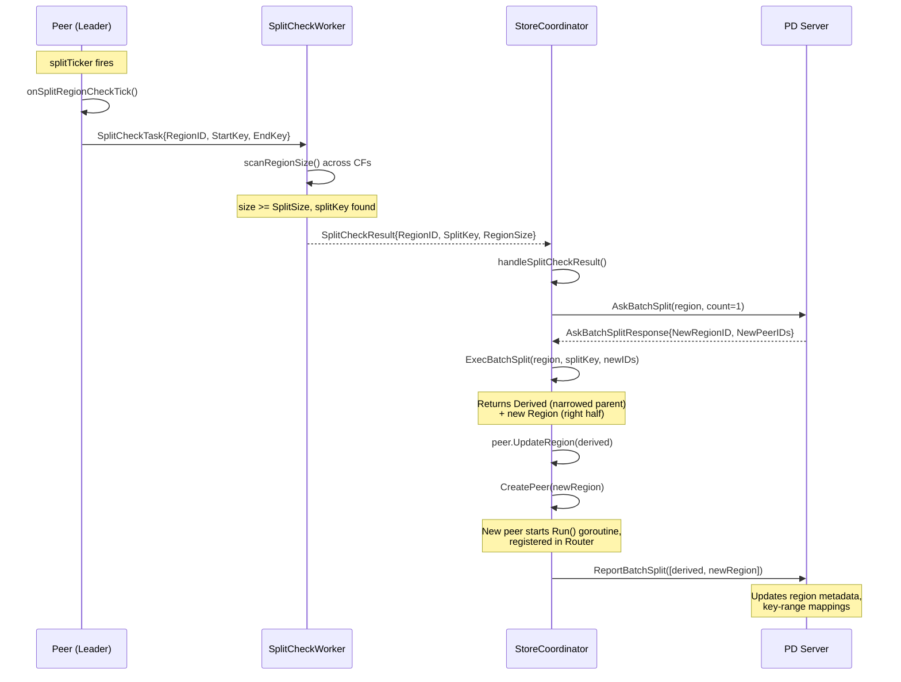

# 04. PD-Coordinated Region Split

## 1. Overview

Region split in gookv has all the individual pieces implemented but they are not wired together into an end-to-end flow. This document designs the integration that connects periodic split checking in each Peer, PD-based ID allocation, split execution, new peer creation, and split reporting.

### Current State: Pieces Exist But Not Wired

| Component | File | Status |
|-----------|------|--------|
| `SplitCheckWorker` | `internal/raftstore/split/checker.go:59` | Fully implemented: scans CFs, finds midpoint split key, returns `SplitCheckResult` |
| `SplitCheckTask` / `SplitCheckResult` | `internal/raftstore/split/checker.go:25-37` | Defined with `RegionID`, `SplitKey`, `RegionSize` |
| `ExecBatchSplit()` | `internal/raftstore/split/checker.go:189` | Fully implemented: creates new `metapb.Region` objects with correct key ranges and peer mappings |
| `PeerTickSplitRegionCheck` | `internal/raftstore/msg.go:49` | Defined as a tick type constant, never handled in `Peer.Run()` |
| `AskBatchSplit()` | `pkg/pdclient/client.go:309` | Fully implemented: sends `AskBatchSplitRequest`, receives `SplitID` (new region ID + peer IDs) |
| `ReportBatchSplit()` | `pkg/pdclient/client.go:324` | Fully implemented: sends all new region metadata to PD |
| `PDTaskReportBatchSplit` | `internal/server/pd_worker.go:24` | Task type defined and handled in `processTask()` |
| `StoreCoordinator.CreatePeer()` | `internal/server/coordinator.go:286` | Fully implemented: creates peer, wires send/apply/PD channels, registers in router |
| `Peer.Run()` split tick | `internal/raftstore/peer.go:202` | No split check ticker exists; only `gcTicker` is created |
| Split check result handler | -- | Not implemented anywhere |
| Key-to-region routing | `internal/server/coordinator.go` | Only `ProposeModifies(regionID, ...)` exists; no `ResolveRegionForKey()` |

### Goal

Wire these components so that:
1. Each Peer leader periodically checks its region size.
2. When a region exceeds the threshold, the coordinator asks PD for new IDs.
3. The coordinator executes the split, creates new peers, and reports to PD.
4. Subsequent writes are routed to the correct region by key range.

---

## 2. Peer Changes: Split Check Ticker

### 2.1 New PeerConfig Fields

Add split check configuration to `PeerConfig` in `internal/raftstore/peer.go`:

```go
type PeerConfig struct {
    // ... existing fields ...

    // SplitCheckTickInterval is how often the split check tick fires.
    // Default: 10s. Set to 0 to disable.
    SplitCheckTickInterval time.Duration
}
```

Default in `DefaultPeerConfig()`:

```go
SplitCheckTickInterval: 10 * time.Second,
```

### 2.2 New Channel on Peer

Add a channel for submitting split check tasks:

```go
type Peer struct {
    // ... existing fields ...

    // splitCheckCh sends SplitCheckTask to the SplitCheckWorker.
    // May be nil if split checking is not configured.
    splitCheckCh chan<- split.SplitCheckTask
}

// SetSplitCheckCh sets the channel for sending split check tasks.
func (p *Peer) SetSplitCheckCh(ch chan<- split.SplitCheckTask) {
    p.splitCheckCh = ch
}
```

### 2.3 Split Check Ticker in `Peer.Run()`

Add a third ticker to the event loop in `Peer.Run()`, following the same pattern as `gcTicker`:

```go
func (p *Peer) Run(ctx context.Context) {
    ticker := time.NewTicker(p.cfg.RaftBaseTickInterval)
    defer ticker.Stop()

    var gcTicker *time.Ticker
    if p.cfg.RaftLogGCTickInterval > 0 {
        gcTicker = time.NewTicker(p.cfg.RaftLogGCTickInterval)
        defer gcTicker.Stop()
    }

    var splitTicker *time.Ticker
    if p.cfg.SplitCheckTickInterval > 0 {
        splitTicker = time.NewTicker(p.cfg.SplitCheckTickInterval)
        defer splitTicker.Stop()
    }

    for {
        select {
        case <-ctx.Done():
            p.stopped.Store(true)
            return
        case <-ticker.C:
            p.rawNode.Tick()
        // gcTicker and splitTicker cases ...
        case <-splitTickerCh(splitTicker):
            p.onSplitRegionCheckTick()
        case msg, ok := <-p.Mailbox:
            if !ok {
                p.stopped.Store(true)
                return
            }
            p.handleMessage(msg)
        }

        p.handleReady()
    }
}

// splitTickerCh returns the ticker's channel or a nil channel (blocks forever).
func splitTickerCh(t *time.Ticker) <-chan time.Time {
    if t == nil {
        return nil
    }
    return t.C
}
```

Note: The actual implementation will merge all ticker cases into a single select (Go allows `nil` channels in select -- they simply block). This avoids the duplicated select blocks in the current code.

### 2.4 `onSplitRegionCheckTick()`

Only the leader submits split check tasks:

```go
func (p *Peer) onSplitRegionCheckTick() {
    if !p.isLeader.Load() {
        return
    }
    if p.splitCheckCh == nil {
        return
    }

    task := split.SplitCheckTask{
        RegionID: p.regionID,
        Region:   p.region,
        StartKey: p.region.GetStartKey(),
        EndKey:   p.region.GetEndKey(),
        Policy:   split.CheckPolicyScan,
    }

    // Non-blocking send; drop if worker is busy.
    select {
    case p.splitCheckCh <- task:
    default:
    }
}
```

---

## 3. Coordinator Changes

### 3.1 SplitCheckWorker Ownership

The `StoreCoordinator` creates and owns the `SplitCheckWorker`. Add to `StoreCoordinatorConfig`:

```go
type StoreCoordinatorConfig struct {
    // ... existing fields ...
    SplitCheckCfg split.SplitCheckWorkerConfig
}
```

Add to `StoreCoordinator`:

```go
type StoreCoordinator struct {
    // ... existing fields ...
    splitWorker *split.SplitCheckWorker
}
```

### 3.2 Worker Lifecycle

In `NewStoreCoordinator()`:

```go
splitWorker := split.NewSplitCheckWorker(cfg.Engine, cfg.SplitCheckCfg)
go splitWorker.Run()
```

In `Stop()`:

```go
if sc.splitWorker != nil {
    sc.splitWorker.Stop()
}
```

### 3.3 Wiring Peers to the Worker

In `BootstrapRegion()` and `CreatePeer()`, after creating the peer:

```go
if sc.splitWorker != nil {
    peer.SetSplitCheckCh(sc.splitWorker.TaskCh())
}
```

This requires adding a `TaskCh()` method to `SplitCheckWorker`:

```go
// TaskCh returns the task channel for external producers (Peer goroutines).
func (w *SplitCheckWorker) TaskCh() chan<- SplitCheckTask {
    return w.taskCh
}
```

### 3.4 Split Check Result Handler Goroutine

A new goroutine in the coordinator consumes results from the `SplitCheckWorker.ResultCh()`:

```go
func (sc *StoreCoordinator) runSplitResultHandler(ctx context.Context) {
    if sc.splitWorker == nil {
        return
    }
    for {
        select {
        case <-ctx.Done():
            return
        case result := <-sc.splitWorker.ResultCh():
            if result.SplitKey != nil {
                sc.handleSplitCheckResult(result)
            }
        }
    }
}
```

This goroutine is started alongside the peer goroutines (launched from `NewStoreCoordinator()` or a new `Start()` method).

---

## 4. Split Execution Flow

### 4.1 `handleSplitCheckResult()`

This method orchestrates the full split sequence:

```go
func (sc *StoreCoordinator) handleSplitCheckResult(result split.SplitCheckResult) {
    sc.mu.RLock()
    peer, ok := sc.peers[result.RegionID]
    sc.mu.RUnlock()
    if !ok || !peer.IsLeader() {
        return // Region gone or no longer leader
    }

    region := peer.Region() // need to add Region() getter to Peer

    // Step 1: Ask PD for new region IDs and peer IDs.
    ctx, cancel := context.WithTimeout(context.Background(), 5*time.Second)
    defer cancel()

    pdClient := sc.getPDClient()
    if pdClient == nil {
        return // No PD -- cannot coordinate split
    }

    askResp, err := pdClient.AskBatchSplit(ctx, region, 1)
    if err != nil {
        slog.Warn("ask batch split failed", "region", result.RegionID, "err", err)
        return
    }
    if len(askResp.GetIds()) == 0 {
        return
    }

    splitID := askResp.GetIds()[0]

    // Step 2: Execute the split (metadata only -- creates new Region objects).
    splitResult, err := split.ExecBatchSplit(
        region,
        [][]byte{result.SplitKey},
        []uint64{splitID.GetNewRegionId()},
        [][]uint64{splitID.GetNewPeerIds()},
    )
    if err != nil {
        slog.Warn("exec batch split failed", "region", result.RegionID, "err", err)
        return
    }

    // Step 3: Update the parent region's metadata (narrowed key range).
    peer.UpdateRegion(splitResult.Derived)

    // Step 4: Create new peers for the split-off regions.
    for _, newRegion := range splitResult.Regions {
        var newPeerID uint64
        for _, p := range newRegion.GetPeers() {
            if p.GetStoreId() == sc.storeID {
                newPeerID = p.GetId()
                break
            }
        }
        if newPeerID == 0 {
            continue // This store is not a member of the new region
        }

        req := &raftstore.CreatePeerRequest{
            Region: newRegion,
            PeerID: newPeerID,
        }
        if err := sc.CreatePeer(req); err != nil {
            slog.Warn("create peer for split region failed",
                "newRegion", newRegion.GetId(), "err", err)
        }
    }

    // Step 5: Report the split to PD.
    allRegions := make([]*metapb.Region, 0, len(splitResult.Regions)+1)
    allRegions = append(allRegions, splitResult.Derived)
    allRegions = append(allRegions, splitResult.Regions...)

    if sc.pdTaskCh != nil {
        task := PDTask{
            Type: PDTaskReportBatchSplit,
            Data: allRegions,
        }
        select {
        case sc.pdTaskCh <- task:
        default:
            slog.Warn("PD task channel full, split report dropped")
        }
    }
}
```

### 4.2 Required Additions to Peer

Two new methods on `Peer`:

```go
// Region returns the current region metadata.
func (p *Peer) Region() *metapb.Region {
    return p.region
}

// UpdateRegion updates the region metadata (e.g., after split narrows the key range).
func (p *Peer) UpdateRegion(region *metapb.Region) {
    p.region = region
}
```

### 4.3 PD Client Access in Coordinator

The coordinator needs access to the PD client for `AskBatchSplit`. Add to `StoreCoordinatorConfig` and `StoreCoordinator`:

```go
type StoreCoordinatorConfig struct {
    // ... existing fields ...
    PDClient pdclient.Client // Optional: for PD-coordinated split
}

type StoreCoordinator struct {
    // ... existing fields ...
    pdClient pdclient.Client
}

func (sc *StoreCoordinator) getPDClient() pdclient.Client {
    return sc.pdClient
}
```

---

## 5. Key-to-Region Routing: `ResolveRegionForKey()`

Currently, `ProposeModifies()` takes an explicit `regionID` (always 1 in `cmd/gookv-server/main.go`). After split, multiple regions exist and the server must route writes to the correct one.

### 5.1 Design

Add a method to `StoreCoordinator`:

```go
// ResolveRegionForKey returns the region ID whose key range contains the given key.
// Returns 0 if no matching region is found.
func (sc *StoreCoordinator) ResolveRegionForKey(key []byte) uint64 {
    sc.mu.RLock()
    defer sc.mu.RUnlock()

    for regionID, peer := range sc.peers {
        region := peer.Region()
        startKey := region.GetStartKey()
        endKey := region.GetEndKey()

        if len(startKey) > 0 && bytes.Compare(key, startKey) < 0 {
            continue
        }
        if len(endKey) > 0 && bytes.Compare(key, endKey) >= 0 {
            continue
        }
        return regionID
    }
    return 0
}
```

For a small number of regions, linear scan is acceptable. If performance becomes an issue, the coordinator can maintain a sorted interval tree (same approach as `MetadataStore.GetRegionByKey()` in `internal/pd/server.go:428`).

### 5.2 Usage in `tikvService` Handlers

Replace the hard-coded `regionID=1` in handlers like `KvPrewrite`, `KvCommit`, `RawPut`, etc.:

```go
// Before (hard-coded):
if err := coord.ProposeModifies(1, modifies, 10*time.Second); err != nil { ... }

// After (key-routed):
regionID := coord.ResolveRegionForKey(primaryKey)
if regionID == 0 {
    return nil, status.Errorf(codes.NotFound, "no region for key")
}
if err := coord.ProposeModifies(regionID, modifies, 10*time.Second); err != nil { ... }
```

For multi-key operations (e.g., `KvPrewrite` with multiple mutations), keys may span multiple regions. The handler groups mutations by region and proposes each group separately. This is deferred to a follow-up design -- for now, all mutations in a single request are assumed to target the same region (same as TiKV's per-region RPC model).

---

## 6. Sequence Diagram



---

## 7. E2E Test Plan

### Test 1: `TestSplitCheckDetectsLargeRegion`

Verify the split check worker correctly identifies regions that exceed the size threshold.

1. Start a single-node cluster with `SplitSize=1KB` (low threshold for testing).
2. Write 100 key-value pairs totaling ~5KB via `RawPut`.
3. Manually schedule a `SplitCheckTask` for region 1.
4. Read from `ResultCh()`.
5. Assert `SplitKey` is non-nil and falls roughly in the middle of the key range.

### Test 2: `TestPDCoordinatedSplitEndToEnd`

Full integration test of the split flow.

1. Start PD server and a 1-node gookv cluster with `SplitSize=1KB`.
2. Bootstrap region 1 covering `["", "")` (full key space).
3. Write enough data to exceed the split threshold.
4. Wait for the split check ticker to fire (or reduce `SplitCheckTickInterval` to 1s).
5. Wait up to 30s for `coordinator.RegionCount() == 2`.
6. Verify region 1 has a non-empty `EndKey`.
7. Verify the new region's `StartKey` equals region 1's `EndKey`.
8. Query PD via `GetRegion()` for a key in each half -- verify they return different region IDs.

### Test 3: `TestSplitRoutesWritesToCorrectRegion`

Verify that after split, writes are routed to the correct region.

1. Complete the setup from Test 2 (two regions after split).
2. Identify the split key boundary.
3. `RawPut` a key in the left half -- verify it goes through region 1.
4. `RawPut` a key in the right half -- verify it goes through the new region.
5. `RawGet` both keys and verify correct values.

### Test 4: `TestSplitWithMultiNodeCluster`

Verify split works across a multi-node Raft cluster.

1. Start PD server and a 3-node gookv cluster with `SplitSize=1KB`.
2. Write data to trigger split.
3. Wait for all 3 nodes to have `RegionCount() == 2`.
4. Verify all nodes agree on region boundaries.
5. Write and read data across both regions from the leader node.

### Test 5: `TestSplitReportedToPD`

Verify PD receives and stores the split metadata.

1. Complete a split (use Test 2 setup).
2. Call `pdClient.GetRegion()` with a key in the left half.
3. Call `pdClient.GetRegion()` with a key in the right half.
4. Verify the two calls return different region IDs and matching key ranges.

### Test 6: `TestNoSplitWhenBelowThreshold`

Verify split does not trigger for small regions.

1. Start a cluster with `SplitSize=96MB` (default).
2. Write a few small key-value pairs.
3. Wait 2 split check intervals.
4. Verify `RegionCount()` remains 1.
