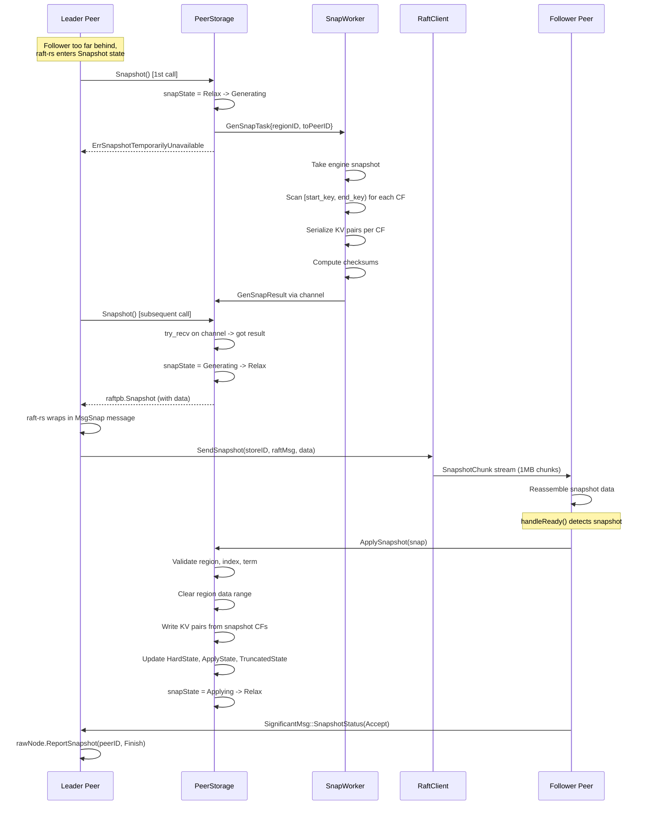
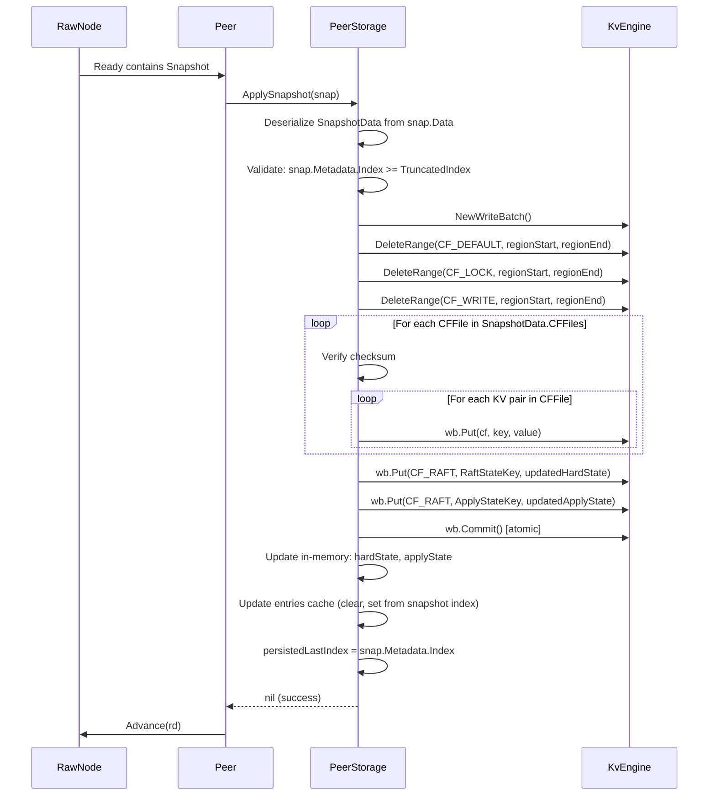
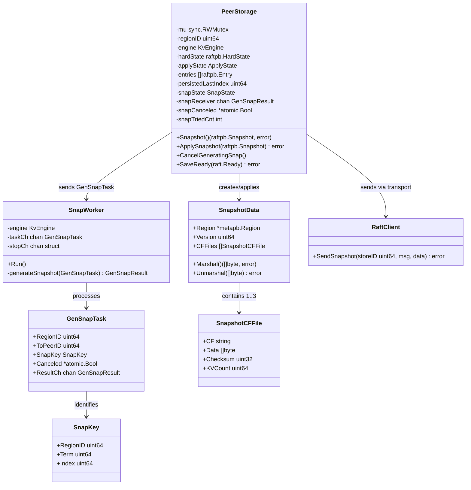

# Raft Snapshot: SST Export/Ingest and Snapshot Transfer

## Overview

This document specifies the design for implementing Raft snapshot generation, transfer, and application in gookvs. Currently, `PeerStorage.Snapshot()` in `internal/raftstore/storage.go` returns a minimal empty snapshot containing only `TruncatedIndex` and `TruncatedTerm` metadata. No actual data is serialized, no SST files are created, no snapshot send/receive logic exists, and `ApplySnapshot` is not implemented.

The snapshot mechanism is critical for two scenarios:
1. **New peer catch-up**: When a new peer joins a Raft group (via conf-change), it may be too far behind to catch up via log replication. The leader sends a snapshot containing the full region state.
2. **Slow follower recovery**: When a follower falls behind past the leader's truncated log index, entries are no longer available. A snapshot is required.

In TiKV, snapshot generation is asynchronous: `PeerStorage::snapshot()` returns `SnapshotTemporarilyUnavailable` on the first call, triggers a background generation task, and returns the completed snapshot on a subsequent call. The snapshot data consists of per-CF SST files covering the region's key range `[start_key, end_key)`, excluding `CF_RAFT` data.

## TiKV Reference

### PeerStorage::snapshot() (peer_storage.rs)

TiKV's `snapshot()` method implements a state machine pattern:

1. **First call**: If `SnapState` is `Relax`, create a `GenSnapTask` with a `canceled` flag and a `receiver` channel, send it to the snapshot worker, set state to `Generating`, and return `SnapshotTemporarilyUnavailable`.
2. **Subsequent calls while generating**: Check the `receiver` channel via `try_recv()`. If still empty, return `SnapshotTemporarilyUnavailable`. If a result arrives, validate it and return the snapshot.
3. **Retry limit**: After `MAX_SNAP_TRY_CNT` (5) failed attempts, return a hard error.

### Snapshot Data Format (snap.rs)

TiKV snapshots use SST files per column family:

- **CFs included**: `CF_DEFAULT`, `CF_LOCK`, `CF_WRITE` (CF_RAFT is excluded)
- **Version**: `SNAPSHOT_VERSION = 2` for raftstore v1
- **File naming**: `gen_{region_id}_{term}_{index}_{cf}.sst` for generated, `rev_` prefix for received
- **Metadata**: Protobuf `RaftSnapshotData` containing region info, version, checksums, and CF file list

### Snapshot Transfer (transport)

- Chunks are sent via the gRPC `Snapshot` streaming RPC
- Each chunk is a `SnapshotChunk` message; the first chunk carries `RaftMessage` metadata
- Chunk size is typically 1 MiB
- The receiver reassembles chunks, validates checksums, and reports status back via `SignificantMsg::SnapshotStatus`

### Snapshot Application (peer FSM)

On the receiving peer:
1. Validate region metadata and snapshot index
2. Set `SnapState::Applying`
3. Clear existing data for the region key range
4. Ingest SST files into the KV engine
5. Update persisted state atomically: `HardState.commit`, `last_index`, `applied_index`, `truncated_state`
6. Resume normal Raft replication from `snapshot_index`

## Proposed Go Design

### Core Types

```go
// Package raftstore

// SnapState represents the state machine for snapshot generation.
type SnapState int

const (
    SnapStateRelax      SnapState = iota // No snapshot activity
    SnapStateGenerating                   // Async generation in progress
    SnapStateApplying                     // Being applied by this peer
)

// SnapKey uniquely identifies a snapshot.
type SnapKey struct {
    RegionID uint64
    Term     uint64
    Index    uint64
}

// GenSnapTask is the request sent to the snapshot generation worker.
type GenSnapTask struct {
    RegionID  uint64
    ToPeerID  uint64
    SnapKey   SnapKey
    Canceled  *atomic.Bool
    ResultCh  chan<- GenSnapResult
}

// GenSnapResult is the outcome of snapshot generation.
type GenSnapResult struct {
    Snapshot raftpb.Snapshot
    Err      error
}

// SnapshotData holds the serialized snapshot payload.
// Serialized as the Data field of raftpb.Snapshot.
type SnapshotData struct {
    Region   *metapb.Region
    Version  uint64
    CFFiles  []SnapshotCFFile
}

// SnapshotCFFile represents one column family's data in the snapshot.
type SnapshotCFFile struct {
    CF       string
    Data     []byte   // Serialized KV pairs for this CF within the region range
    Checksum uint32
    KVCount  uint64
}
```

### PeerStorage Changes

```go
// Updated PeerStorage fields
type PeerStorage struct {
    // ... existing fields ...

    // Snapshot state machine
    snapState     SnapState
    snapReceiver  <-chan GenSnapResult
    snapCanceled  *atomic.Bool
    snapTriedCnt  int
}

// Snapshot generates or returns a pending snapshot.
// Returns raft.ErrSnapshotTemporarilyUnavailable while generating.
func (s *PeerStorage) Snapshot() (raftpb.Snapshot, error)

// ApplySnapshot installs a received snapshot, updating all persisted state.
func (s *PeerStorage) ApplySnapshot(snap raftpb.Snapshot) error

// CancelGeneratingSnap cancels any in-progress snapshot generation.
func (s *PeerStorage) CancelGeneratingSnap()
```

### Snapshot Generation Worker

```go
// Package raftstore

// SnapWorker runs as a background goroutine processing snapshot generation tasks.
type SnapWorker struct {
    engine    traits.KvEngine
    region    *metapb.Region
    taskCh    <-chan GenSnapTask
    stopCh    <-chan struct{}
}

// Run processes snapshot generation tasks.
func (w *SnapWorker) Run()

// generateSnapshot creates a snapshot by scanning all CFs for the region's key range.
func (w *SnapWorker) generateSnapshot(task GenSnapTask) GenSnapResult
```

### Peer Integration

```go
// In Peer.handleReady():
// After processing committed entries, check for snapshot in Ready:
//   if !raft.IsEmptySnap(rd.Snapshot) {
//       s.storage.ApplySnapshot(rd.Snapshot)
//   }

// In Peer.handleMessage():
// Handle PeerMsgTypeSignificant with SnapshotStatus to report
// snapshot send results back to raft-rs via rawNode.ReportSnapshot().
```

### Transport Integration

The existing `RaftClient.SendSnapshot()` in `internal/server/transport/transport.go` already implements chunked snapshot transfer via gRPC. It sends `SnapshotChunk` messages with 1 MiB chunks. This will be used as-is, with the caller providing the serialized snapshot data.

## Processing Flows

### Snapshot Generation and Transfer



### Snapshot Apply Detail



## Data Structures



## Error Handling

| Error Condition | Handling |
|----------------|----------|
| Snapshot generation cancelled (leader changed) | `snapCanceled` flag checked by worker; discard result, return to `Relax` |
| Snapshot generation exceeds retry limit | After 5 attempts, return hard error to raft-rs; raft-rs will retry later |
| Checksum mismatch on received snapshot | Reject snapshot, report `SnapshotStatus(Reject)` to leader |
| Snapshot index regression (stale snapshot) | Skip application, snapshot is obsolete |
| Engine write failure during apply | Return error; peer stays in inconsistent state, must retry or restart |
| Network failure during transfer | Transport returns error; leader reports `SnapshotStatus(Reject)` to raft-rs, which will retry |
| Channel disconnected (worker crashed) | Detect via channel close; reset to `Relax`, increment `snapTriedCnt` |

## Testing Strategy

### Unit Tests

1. **TestSnapshotGenerationRoundTrip**: Create a PeerStorage with known data. Call `Snapshot()`, verify it returns `ErrSnapshotTemporarilyUnavailable`. Simulate worker producing a result. Call `Snapshot()` again, verify valid snapshot with correct metadata and CF data.

2. **TestSnapshotApply**: Create empty PeerStorage. Apply a snapshot with known KV data. Verify all keys are readable from the engine. Verify `ApplyState`, `HardState`, and `TruncatedState` are updated correctly.

3. **TestSnapshotCancellation**: Start snapshot generation, cancel it, verify state returns to `Relax`.

4. **TestSnapshotRetryLimit**: Simulate repeated generation failures. Verify hard error after `maxSnapTryCnt` attempts.

5. **TestSnapshotChecksumValidation**: Apply snapshot with corrupted checksum. Verify rejection.

6. **TestSnapshotStateTransitions**: Verify the `SnapState` state machine transitions: `Relax -> Generating -> Relax`, `Relax -> Applying -> Relax`.

### Integration Tests

7. **TestSnapshotTransferE2E**: Set up a 3-node cluster. Add a new peer. Verify it receives a snapshot and catches up to the leader's state.

8. **TestSlowFollowerSnapshot**: Write enough data to trigger log truncation. Stop a follower, let it fall behind. Restart it. Verify it receives a snapshot and recovers.

9. **TestSnapshotDuringLeaderChange**: Start snapshot generation, trigger leader election. Verify snapshot is cancelled and new leader generates a fresh one.

## Implementation Steps

1. **Define snapshot types** (`internal/raftstore/snapshot.go`):
   - `SnapState`, `SnapKey`, `SnapshotData`, `SnapshotCFFile`
   - Serialization/deserialization methods (protobuf or custom binary encoding)

2. **Implement SnapWorker** (`internal/raftstore/snap_worker.go`):
   - Background goroutine with task channel
   - `generateSnapshot()`: take engine snapshot, scan region key range per CF, serialize, compute checksums

3. **Update PeerStorage.Snapshot()** (`internal/raftstore/storage.go`):
   - Replace the current stub with the async state machine pattern
   - Add `snapState`, `snapReceiver`, `snapCanceled`, `snapTriedCnt` fields

4. **Implement PeerStorage.ApplySnapshot()** (`internal/raftstore/storage.go`):
   - Deserialize `SnapshotData`, validate, clear region data, write KV pairs, update all state atomically

5. **Update Peer.handleReady()** (`internal/raftstore/peer.go`):
   - Check `rd.Snapshot` and call `ApplySnapshot()` when present
   - Handle `SignificantMsg::SnapshotStatus` for reporting snapshot results

6. **Wire SnapWorker into store startup** (`internal/raftstore/store.go`):
   - Start SnapWorker goroutine, pass task channel to PeerStorage instances

7. **Connect transport** (`internal/server/transport/transport.go`):
   - The existing `SendSnapshot()` already handles chunked transfer
   - Add snapshot receive handler in the gRPC server to reassemble chunks and deliver to the target peer

8. **Write tests**: Unit tests for each component, integration test for end-to-end flow

## Dependencies

| Component | Status | Notes |
|-----------|--------|-------|
| `PeerStorage` (storage.go) | Exists | Stub `Snapshot()` to be replaced |
| `KvEngine` traits (traits.go) | Exists | `NewSnapshot()`, `DeleteRange()`, iterator support all present |
| `RaftClient.SendSnapshot()` (transport.go) | Exists | Chunked 1MB transfer via gRPC already implemented |
| `keys.RaftLogKey/ApplyStateKey` (keys.go) | Exists | Key encoding for persisted state |
| `cfnames` (cfnames/) | Exists | CF name constants (`CFDefault`, `CFLock`, `CFWrite`, `CFRaft`) |
| `metapb.Region` (kvproto) | Exists | Region metadata protobuf |
| `raft_serverpb.SnapshotChunk` (kvproto) | Exists | Used by transport layer |
| gRPC Snapshot receive handler | Not implemented | Server-side handler to receive snapshot stream |
| `SnapWorker` | Not implemented | New component for async snapshot generation |
