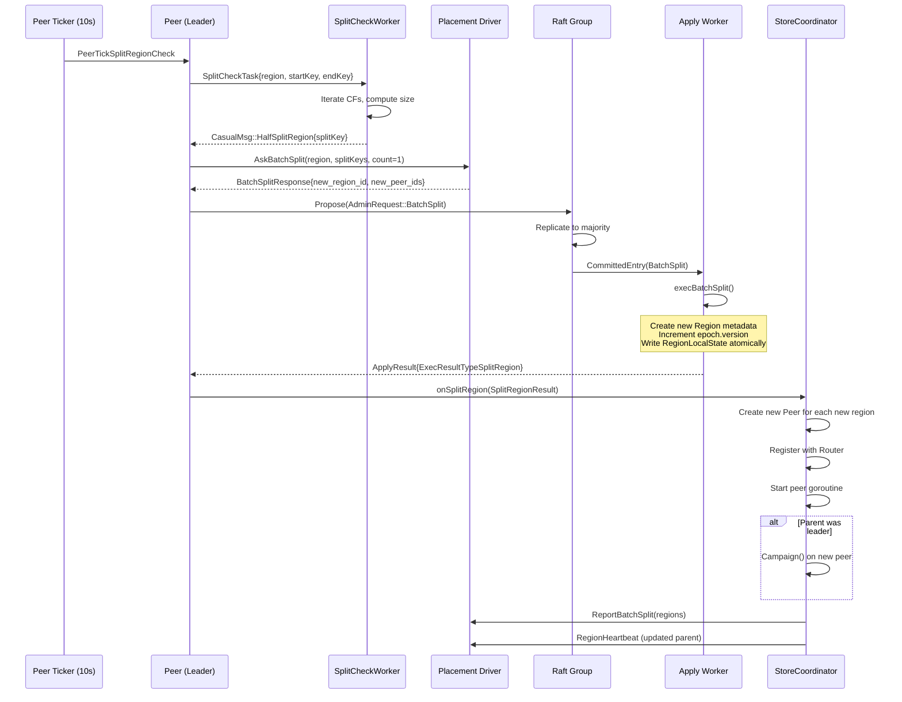
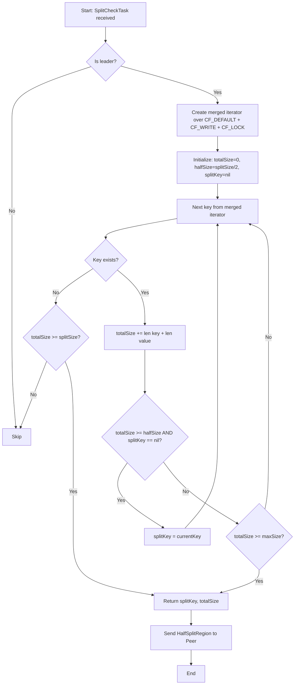

# Region Split

## 1. Overview

Region split divides a single Raft region into multiple regions with non-overlapping key ranges when the region size exceeds a configurable threshold. This is fundamental to horizontal scalability: without split, all data lives in one Raft group, creating a single-node bottleneck for both storage and throughput.

gookvs currently defines the data structures for split (`PeerTickSplitRegionCheck`, `ExecResultTypeSplitRegion`, `SplitRegionResult` in `internal/raftstore/msg.go`) but has no handler, no size estimation, no split key calculation, no split execution, and no split proposal path. This document specifies the complete design for region split in gookvs.

**Scope**: This document covers size-based automatic split and admin-triggered manual split. Table-boundary-aware split (`SplitRegionOnTable`) is deferred to a follow-up.

## 2. TiKV Reference

TiKV's region split spans three subsystems:

### 2.1 Split Check Worker

File: `components/raftstore/src/store/worker/split_check.rs`

- A background worker (`SplitCheckRunner`) that runs outside the Raft event loop.
- Scheduled by `PeerTick::SplitRegionCheck` (default every 10s, leader only).
- Iterates all CFs (`CF_DEFAULT`, `CF_WRITE`, `CF_LOCK`) via a merged iterator to compute total region size.
- If size exceeds `region_split_size` (default 96 MiB), determines a split key near the midpoint.
- Sends `CasualMessage::HalfSplitRegion` back to the peer FSM with the computed split key.
- Supports multiple check policies: `Scan` (iterate all keys), `Approximate` (use RocksDB properties), `UseKey` (externally provided key).

### 2.2 Split Proposal Path

File: `components/raftstore/src/store/fsm/peer.rs` (lines 6582-6658)

1. Peer receives `CasualMessage::HalfSplitRegion` or `CasualMessage::SplitRegion`.
2. `on_prepare_split_region()` validates the request (leader check, epoch check, key range check).
3. Sends `PdTask::AskBatchSplit` to PD, which allocates new `region_id` and `peer_id` values.
4. PD responds with `BatchSplitResponse` containing the allocated IDs.
5. Peer proposes an `AdminRequest::BatchSplit` via Raft with the split keys and allocated IDs.

### 2.3 Split Execution (Apply)

File: `components/raftstore/src/store/fsm/apply.rs` (lines 2632-2810)

1. `exec_batch_split()` is called when a committed `BatchSplit` entry is applied.
2. Increments `region_epoch.version` by the number of new regions.
3. Creates `metapb::Region` for each new region: assigns IDs, sets key ranges, copies peer list with new peer IDs.
4. The `right_derive` flag controls whether the original region ID goes to the left or right partition.
5. Writes all new region states atomically to the KV engine.
6. Returns `ExecResult::SplitRegion { regions, derived, new_split_regions }`.

### 2.4 Post-Apply (Ready)

File: `components/raftstore/src/store/fsm/peer.rs` (lines 4643-4821)

1. `on_ready_split_region()` updates in-memory metadata (`StoreMeta`).
2. Updates `region_ranges` BTreeMap with new boundaries.
3. Creates a new `PeerFsm` for each new region on this store.
4. If the parent was leader, new peers campaign immediately (election).
5. Reports new regions to PD via `ReportBatchSplit`.
6. Roughly estimates size for new regions by dividing parent size equally.

## 3. Proposed Go Design

### 3.1 SplitChecker

A new `SplitChecker` runs as a goroutine-based worker, separate from the peer event loop, to avoid blocking Raft ticking during potentially expensive key iteration.

```go
// Package: internal/raftstore/split

// SplitCheckTask is sent from the peer to the split check worker.
type SplitCheckTask struct {
    RegionID   uint64
    Region     *metapb.Region
    StartKey   []byte
    EndKey     []byte
    Policy     CheckPolicy  // Scan or Approximate
}

// CheckPolicy controls how the split checker estimates size.
type CheckPolicy int
const (
    CheckPolicyScan        CheckPolicy = iota  // Iterate all keys
    CheckPolicyApproximate                      // Use engine properties
)

// SplitCheckResult is sent back from the worker to the peer.
type SplitCheckResult struct {
    RegionID   uint64
    SplitKey   []byte           // Computed midpoint key
    RegionSize uint64           // Estimated region size in bytes
}

// SplitCheckWorker runs split checks in a background goroutine.
type SplitCheckWorker struct {
    engine        traits.KvEngine
    router        *router.Router
    splitSize     uint64   // from config: RegionSplitSize
    maxSize       uint64   // from config: RegionMaxSize
    splitKeys     uint64   // from config: RegionSplitKeys
    maxKeys       uint64   // from config: RegionMaxKeys
    taskCh        chan SplitCheckTask
    stopCh        chan struct{}
}

func (w *SplitCheckWorker) Run()
func (w *SplitCheckWorker) Stop()
func (w *SplitCheckWorker) checkRegion(task SplitCheckTask)
func (w *SplitCheckWorker) scanRegionSize(startKey, endKey []byte) (size uint64, splitKey []byte, err error)
```

**Size estimation algorithm** (`scanRegionSize`):
1. Create iterators for `CF_DEFAULT`, `CF_WRITE`, `CF_LOCK`.
2. Iterate all keys in `[startKey, endKey)`, accumulating `len(key) + len(value)` for each entry.
3. When accumulated size passes `splitSize / 2`, record the current key as the candidate split key.
4. If total size exceeds `splitSize`, return the candidate split key and total size.
5. If total size is below `splitSize`, return with `splitKey = nil` (no split needed).

### 3.2 Peer Integration

The peer event loop gains a new tick handler and a new message type:

```go
// In peer.go handleMessage(), add case for PeerMsgTypeCasual:
case PeerMsgTypeCasual:
    casual := msg.Data.(*CasualMsg)
    p.onCasualMsg(casual)

// CasualMsg in msg.go
type CasualMsg struct {
    Type CasualMsgType
    Data interface{}
}

type CasualMsgType int
const (
    CasualMsgTypeHalfSplitRegion CasualMsgType = iota
    CasualMsgTypeSplitRegion
    CasualMsgTypeRegionApproximateSize
)

// HalfSplitRegionData contains the split key from the checker.
type HalfSplitRegionData struct {
    RegionEpoch *metapb.RegionEpoch
    SplitKey    []byte
}
```

**Tick handler for PeerTickSplitRegionCheck** (runs every 10s):
1. Skip if not leader.
2. Skip if a split check is already in progress.
3. Skip if a split is currently being applied.
4. Send `SplitCheckTask` to the `SplitCheckWorker` channel.

### 3.3 Split Proposal Flow

When the peer receives `CasualMsgTypeHalfSplitRegion`:

```go
func (p *Peer) onHalfSplitRegion(data *HalfSplitRegionData) {
    // 1. Validate: must be leader
    // 2. Validate: region epoch matches
    // 3. Validate: split key is within region range
    // 4. Call pdClient.AskBatchSplit() to get new region/peer IDs
    // 5. Build AdminRequest with BatchSplit
    // 6. Propose via Raft
}
```

The PD interaction happens asynchronously. The peer sends a goroutine to call `AskBatchSplit` and, on success, sends back a `PeerMsg` with the proposal. This avoids blocking the event loop on network I/O.

### 3.4 Split Execution (Apply Worker)

A new function in the apply path handles `AdminCmdType_BatchSplit`:

```go
// Package: internal/raftstore

func execBatchSplit(
    region *metapb.Region,
    req *raft_cmdpb.AdminRequest,
    engine traits.KvEngine,
    storeID uint64,
) (*SplitRegionResult, error) {
    // 1. Validate split request (keys ascending, within region range)
    // 2. Clone the derived region, increment epoch.version
    // 3. For each split request:
    //    a. Create new metapb.Region with allocated IDs
    //    b. Set key range: [prevKey, splitKey)
    //    c. Copy peer list, assign new peer IDs
    // 4. Write all new RegionLocalState to engine atomically (WriteBatch)
    // 5. Return SplitRegionResult{Derived, Regions}
}
```

### 3.5 Post-Split: New Peer Creation

In `StoreCoordinator`, after the apply result is delivered back to the peer:

```go
func (sc *StoreCoordinator) onSplitRegion(result *SplitRegionResult) {
    // 1. Update in-memory region metadata (sc.peers, sc.router)
    // 2. For each new region:
    //    a. Create a new Peer (no bootstrap peers -- uses persisted state from apply)
    //    b. Register with router
    //    c. Start the peer goroutine
    //    d. If parent was leader: trigger Campaign() on the new peer
    // 3. Report to PD via ReportBatchSplit
}
```

### 3.6 Region Metadata Update

The region metadata must be updated atomically in both the KV engine and in-memory structures:

- **On disk**: Each new region gets a `RegionLocalState` entry keyed by `region_state_key(region_id)` in `CF_RAFT`.
- **In memory**: The `StoreCoordinator.peers` map and the `Router` are updated to include new regions.
- **Epoch**: The parent region's `region_epoch.version` is incremented by the number of new regions. All new regions inherit this epoch.

## 4. Processing Flows

### 4.1 Full Split Flow



### 4.2 Split Key Calculation



## 5. Data Structures

```mermaid
classDiagram
    class SplitCheckWorker {
        -engine: KvEngine
        -router: *Router
        -splitSize: uint64
        -maxSize: uint64
        -taskCh: chan SplitCheckTask
        -stopCh: chan struct{}
        +Run()
        +Stop()
        +Schedule(task SplitCheckTask)
        -checkRegion(task SplitCheckTask)
        -scanRegionSize(startKey, endKey []byte) (uint64, []byte, error)
    }

    class SplitCheckTask {
        +RegionID: uint64
        +Region: *metapb.Region
        +StartKey: []byte
        +EndKey: []byte
        +Policy: CheckPolicy
    }

    class SplitRegionResult {
        +Derived: *metapb.Region
        +Regions: []*metapb.Region
    }

    class CasualMsg {
        +Type: CasualMsgType
        +Data: interface{}
    }

    class HalfSplitRegionData {
        +RegionEpoch: *metapb.RegionEpoch
        +SplitKey: []byte
    }

    class Peer {
        -regionID: uint64
        -region: *metapb.Region
        -splitCheckInProgress: bool
        -approximateSize: uint64
        +onSplitRegionCheckTick()
        +onHalfSplitRegion(data *HalfSplitRegionData)
        +proposeBatchSplit(splitKeys [][]byte, resp *pdpb.AskBatchSplitResponse)
    }

    class StoreCoordinator {
        -peers: map[uint64]*Peer
        -pdClient: pdclient.Client
        +onSplitRegion(result *SplitRegionResult)
        -createSplitPeer(region *metapb.Region, parentWasLeader bool)
    }

    SplitCheckWorker --> SplitCheckTask : processes
    SplitCheckWorker --> CasualMsg : produces
    CasualMsg --> HalfSplitRegionData : contains
    Peer --> SplitCheckWorker : schedules tasks
    Peer --> SplitRegionResult : receives from apply
    StoreCoordinator --> SplitRegionResult : handles
    StoreCoordinator --> Peer : creates new peers
```

## 6. Error Handling

| Error Condition | Detection | Recovery |
|----------------|-----------|----------|
| Split key outside region range | `execBatchSplit` validation | Reject the admin request; log error |
| Split keys not in ascending order | `execBatchSplit` validation | Reject the admin request; log error |
| Epoch mismatch during proposal | `onHalfSplitRegion` epoch check | Drop the split request; next tick will retry with fresh epoch |
| PD `AskBatchSplit` failure | Network error or PD error response | Log and retry on next split check tick (10s) |
| Not leader when proposing | Leader check before proposal | Silently skip; follower does not initiate splits |
| Engine write failure during apply | `WriteBatch.Commit()` error | Fatal: log and panic (data integrity cannot be guaranteed) |
| New region ID collision (already exists) | Check `RegionLocalState` in engine before creating | Skip creating the duplicate region; log warning |
| Split during snapshot generation | Check `isGeneratingSnapshot` flag | Delay split check (skip up to 3 ticks, then proceed) |

**Idempotency**: The split apply function checks whether a region with the new ID already has a persisted `RegionLocalState`. If it does, the region is skipped. This handles the case where a split is replayed after a crash.

## 7. Testing Strategy

### 7.1 Unit Tests

| Test | Description |
|------|-------------|
| `TestScanRegionSize` | Populate a region with known data, verify size estimation accuracy |
| `TestSplitKeyAtMidpoint` | Verify split key is near the size midpoint |
| `TestExecBatchSplit_SingleSplit` | Apply a single split, verify two resulting regions with correct key ranges and epoch |
| `TestExecBatchSplit_MultiSplit` | Apply a batch split with 3 split keys, verify 4 resulting regions |
| `TestExecBatchSplit_RightDerive` | Verify that with `right_derive=true`, the original region ID is assigned to the rightmost region |
| `TestExecBatchSplit_InvalidKeys` | Verify error for out-of-range keys and non-ascending keys |
| `TestExecBatchSplit_EpochIncrement` | Verify `region_epoch.version` increases by the number of new regions |
| `TestExecBatchSplit_Idempotent` | Apply the same split twice, verify second is a no-op |
| `TestSplitCheckSkipNonLeader` | Verify tick handler is a no-op when not leader |

### 7.2 Integration Tests

| Test | Description |
|------|-------------|
| `TestSplitE2E_SingleNode` | Single-node cluster: write enough data to trigger split, verify two regions exist and both serve reads |
| `TestSplitE2E_ThreeNode` | Three-node cluster: trigger split, verify all nodes have the new region metadata and can serve reads |
| `TestSplitDuringWrite` | Continuous writes during split, verify no data loss and no stale reads |
| `TestSplitAndPDReport` | Verify `ReportBatchSplit` is called with correct region list after split |
| `TestSplitNewPeerElection` | After split, verify the new region's peer campaigns and elects a leader |

### 7.3 TiKV Reference Tests

Port relevant tests from `tikv/tests/integrations/raftstore/`:
- `test_split_region`
- `test_auto_split`
- `test_split_epoch`

Use table-driven tests with `testify/assert`.

## 8. Configuration

The following configuration fields (already defined in `internal/config/config.go`) govern split behavior:

| Config Field | TOML Key | Default | Description |
|-------------|----------|---------|-------------|
| `RaftStoreConfig.RegionMaxSize` | `raft-store.region-max-size` | 144 MB | Region size hard limit. Logs warning if exceeded. |
| `RaftStoreConfig.RegionSplitSize` | `raft-store.region-split-size` | 96 MB | Threshold that triggers split check. |
| `CoprocessorConfig.RegionMaxKeys` | `coprocessor.region-max-keys` | 1,440,000 | Key count hard limit. |
| `CoprocessorConfig.RegionSplitKeys` | `coprocessor.region-split-keys` | 960,000 | Key count threshold for split. |
| `CoprocessorConfig.SplitRegionOnTable` | `coprocessor.split-region-on-table` | false | Table-boundary-aware split (deferred). |

**New config fields to add**:

| Config Field | TOML Key | Default | Description |
|-------------|----------|---------|-------------|
| `RaftStoreConfig.SplitRegionCheckTickInterval` | `raft-store.split-region-check-tick-interval` | `10s` | Interval for the split check tick. |
| `RaftStoreConfig.RegionSplitCheckDiff` | `raft-store.region-split-check-diff` | `6 MB` | Minimum size change since last check before a new check runs. |

## 9. Implementation Steps

1. **Add `CasualMsg` type and handler** -- Extend `msg.go` with `CasualMsg`, `CasualMsgType`, `HalfSplitRegionData`. Add `PeerMsgTypeCasual` handling in `peer.go:handleMessage()`.

2. **Implement `SplitCheckWorker`** -- Create `internal/raftstore/split/checker.go` with `SplitCheckWorker`, `SplitCheckTask`, and the merged-iterator size estimation logic.

3. **Add split check tick handler** -- In `peer.go`, handle `PeerTickSplitRegionCheck`: skip if not leader, schedule `SplitCheckTask` to the worker.

4. **Implement PD interaction** -- In the peer, on receiving `HalfSplitRegion`, call `pdClient.AskBatchSplit()` asynchronously and, on success, propose the `BatchSplit` admin command.

5. **Implement `execBatchSplit`** -- In the apply path, handle `AdminCmdType_BatchSplit`: validate, create new regions, write `RegionLocalState` atomically, return `SplitRegionResult`.

6. **Implement post-split peer creation** -- In `StoreCoordinator.onSplitRegion()`, create new `Peer` instances, register with the router, start goroutines, and trigger campaigns if needed.

7. **Implement PD reporting** -- Call `pdClient.ReportBatchSplit()` after split completion. Trigger region heartbeats for updated regions.

8. **Add split check tick scheduling** -- Wire the `PeerTickSplitRegionCheck` tick into the peer's periodic timer system (10s interval).

9. **Write unit tests** -- Per section 7.1.

10. **Write integration tests** -- Per section 7.2.

## 10. Dependencies

| Dependency | Status | Notes |
|-----------|--------|-------|
| Conf Change (peer add/remove) | Partial (section 3.4 of 08_not_yet_implemented.md) | Split creates new peers with new IDs; the conf change mechanism is needed to propagate membership changes. Currently, conf changes update `RawNode` but not cluster-level state. |
| PD Integration (`AskBatchSplit`, `ReportBatchSplit`) | Implemented | `pkg/pdclient/client.go` has both `AskBatchSplit` and `ReportBatchSplit` with full gRPC implementations. |
| PD Heartbeat Loop | Stub (section 3.6 of 08_not_yet_implemented.md) | After split, the peer should heartbeat to PD with updated region info. The heartbeat tick handler must be implemented. |
| Apply Worker / Admin Command Path | Partial | The current apply path (`StoreCoordinator.applyEntries`) handles only normal entries. Admin command dispatch (including `BatchSplit`) must be added. |
| `RegionLocalState` persistence | Not implemented | A mechanism to persist `RegionLocalState` keyed by `region_state_key(region_id)` in `CF_RAFT` is needed. |
| Router region range index | Not implemented | An in-memory BTreeMap mapping `end_key -> region_id` is needed for routing requests to the correct region after split. Currently, `Router` uses a flat `sync.Map` by region ID. |

## 11. File Layout

```
internal/raftstore/
  msg.go             -- Extended: CasualMsg, CasualMsgType, HalfSplitRegionData
  peer.go            -- Extended: split check tick handler, onHalfSplitRegion, onSplitResult
  split/
    checker.go       -- SplitCheckWorker, SplitCheckTask, size estimation
    checker_test.go  -- Unit tests for size estimation and split key selection
    exec.go          -- execBatchSplit, validateBatchSplit
    exec_test.go     -- Unit tests for split execution
internal/server/
  coordinator.go     -- Extended: onSplitRegion, createSplitPeer
```
