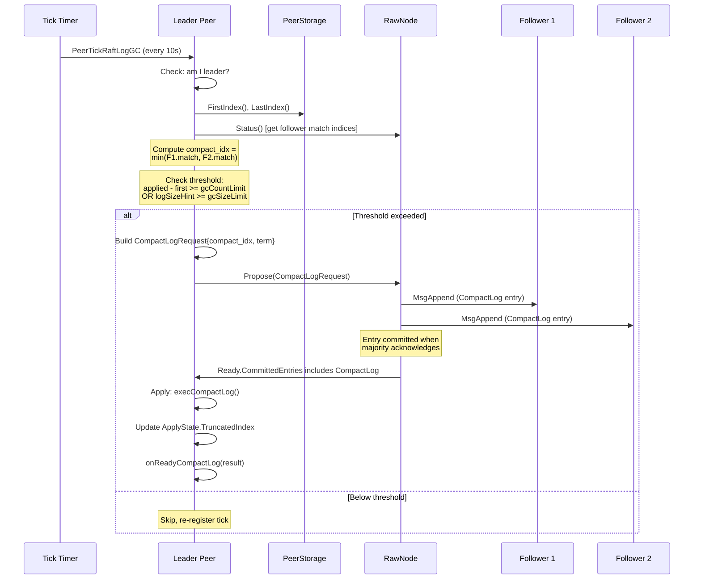
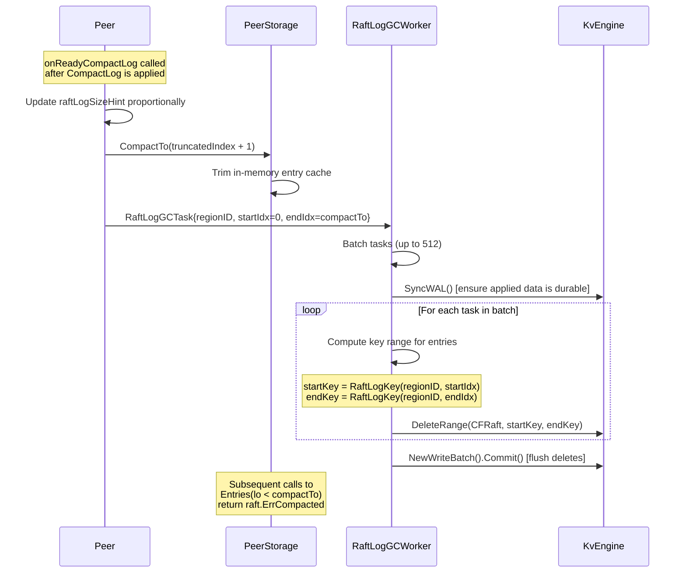
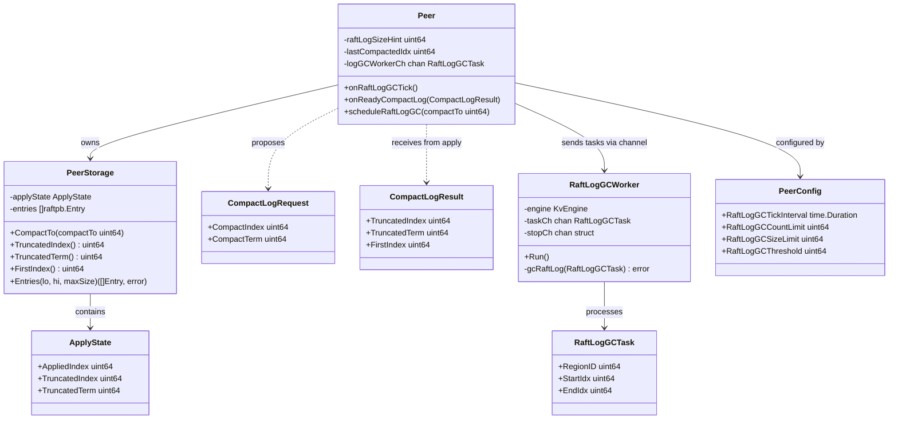

# Raft Log GC / Truncation

## Overview

This document specifies the design for implementing Raft log garbage collection (log compaction/truncation) in gookvs. The purpose of log GC is to prevent unbounded growth of the Raft log by periodically removing entries that have been applied to the state machine and are no longer needed for replication.

**Current state**: The tick type `PeerTickRaftLogGC` and the execution result type `ExecResultTypeCompactLog` are defined in `internal/raftstore/msg.go`, but neither is handled. The `ApplyState.TruncatedIndex` in `internal/raftstore/storage.go` is initialized at `RaftInitLogIndex` (5) and never advanced. No Raft log entries are ever deleted from the engine. Over time, this causes unbounded storage growth.

In TiKV, log GC is a periodic process driven by the `PeerTick::RaftLogGc` tick (default interval: 10 seconds). The leader evaluates how many log entries can be safely removed, proposes a `CompactLog` admin command through Raft, and upon apply, the truncated state is advanced. A separate background worker then physically deletes the log entries from the Raft engine.

## TiKV Reference

### Log GC Trigger (fsm/peer.rs: `on_raft_gc_log_tick`)

The leader-only tick evaluates compaction candidates:

1. **Skip conditions**: Not leader, peer is stopped, pending removal, or not initialized.
2. **Compute `compact_idx`**: Determined by the minimum of:
   - `replicated_idx`: The minimum `match_index` across all followers (ensures all replicas have the entries).
   - `applied_idx - 1`: Cannot truncate entries that haven't been applied yet.
3. **Threshold check**: Only compact if `(applied_idx - first_index) >= raft_log_gc_count_limit` (default 72000 entries) OR `raft_log_size_hint >= raft_log_gc_size_limit` (default 72 MiB).
4. **Force compact**: If `(applied_idx - first_index) >= raft_log_gc_count_limit * 3`, force compact even if the replicated index is not optimal.
5. **Propose CompactLog**: Create an admin request with `compact_index` and `compact_term`, propose through Raft consensus.

### CompactLog Apply (fsm/apply.rs: `exec_compact_log`)

When the committed `CompactLog` entry is applied:

1. Validate `compact_index > first_index` (no-op if already compacted past this point).
2. Validate `compact_term != 0` (reject old-format commands).
3. Call `compact_raft_log()` which updates `apply_state.truncated_state.index` and `apply_state.truncated_state.term`.
4. Return `ExecResult::CompactLog { state, first_index, has_pending }`.

Note: The actual log entry deletion does NOT happen during apply. Only the truncated state metadata is updated.

### Post-Apply Handling (fsm/peer.rs: `on_ready_compact_log`)

After the apply result is received by the peer FSM:

1. Update `raft_log_size_hint` proportionally based on remaining entries.
2. Schedule the actual log deletion to the `RaftLogGC` background worker with `compact_to = state.index + 1`.
3. Compact the in-memory entry cache.
4. Cancel any in-progress snapshot generation if it targets an index before `compact_to`.

### Physical Log Deletion (worker/raftlog_gc.rs)

The `RaftLogGC` worker:

1. Batches deletion tasks (up to `MAX_GC_REGION_BATCH = 512` regions per flush).
2. Syncs the KV engine WAL first (ensures applied data is durable before removing logs).
3. Calls `raft_engine.gc(region_id, start_idx, end_idx)` to delete entries in the range `[start_idx, end_idx)`.
4. Flushes periodically or when the batch is full.

## Proposed Go Design

### Core Types

```go
// Package raftstore

// CompactLogRequest represents a log compaction admin command.
type CompactLogRequest struct {
    CompactIndex uint64
    CompactTerm  uint64
}

// CompactLogResult is returned after applying a CompactLog command.
type CompactLogResult struct {
    TruncatedIndex uint64
    TruncatedTerm  uint64
    FirstIndex     uint64
}

// RaftLogGCTask is a unit of work for the background log deletion worker.
type RaftLogGCTask struct {
    RegionID uint64
    StartIdx uint64  // Inclusive
    EndIdx   uint64  // Exclusive
}
```

### Configuration

```go
// Added to PeerConfig
type PeerConfig struct {
    // ... existing fields ...

    // RaftLogGCTickInterval is how often the log GC tick fires.
    RaftLogGCTickInterval time.Duration // default: 10s

    // RaftLogGCCountLimit triggers compaction when excess entry count exceeds this.
    RaftLogGCCountLimit uint64 // default: 72000

    // RaftLogGCSizeLimit triggers compaction when estimated log size exceeds this.
    RaftLogGCSizeLimit uint64 // default: 72 MiB

    // RaftLogGCThreshold is the minimum number of entries to keep.
    RaftLogGCThreshold uint64 // default: 50
}
```

### PeerStorage Changes

```go
// New methods on PeerStorage

// CompactTo removes entries from the in-memory cache up to compactTo.
func (s *PeerStorage) CompactTo(compactTo uint64)

// TruncatedIndex returns the current truncated index.
func (s *PeerStorage) TruncatedIndex() uint64

// TruncatedTerm returns the current truncated term.
func (s *PeerStorage) TruncatedTerm() uint64
```

### Peer Changes

```go
// New fields on Peer
type Peer struct {
    // ... existing fields ...

    // raftLogSizeHint tracks estimated size of the Raft log.
    raftLogSizeHint uint64

    // lastCompactedIdx tracks the last index scheduled for GC.
    lastCompactedIdx uint64

    // logGCWorkerCh sends deletion tasks to the background worker.
    logGCWorkerCh chan<- RaftLogGCTask
}

// New methods on Peer

// onRaftLogGCTick is called periodically to evaluate log compaction.
func (p *Peer) onRaftLogGCTick()

// onReadyCompactLog handles the apply result of a CompactLog command.
func (p *Peer) onReadyCompactLog(result CompactLogResult)

// scheduleRaftLogGC sends a deletion task to the background worker.
func (p *Peer) scheduleRaftLogGC(compactTo uint64)
```

### Background Log GC Worker

```go
// RaftLogGCWorker runs as a background goroutine deleting compacted log entries.
type RaftLogGCWorker struct {
    engine  traits.KvEngine
    taskCh  <-chan RaftLogGCTask
    stopCh  <-chan struct{}
}

// Run processes log deletion tasks.
func (w *RaftLogGCWorker) Run()

// gcRaftLog deletes entries in [startIdx, endIdx) for a region.
func (w *RaftLogGCWorker) gcRaftLog(task RaftLogGCTask) error
```

### Apply Worker Integration

```go
// In the apply worker, when processing admin commands:
// Check for CompactLog type, execute exec_compact_log logic,
// return ExecResult with ExecResultTypeCompactLog.

func execCompactLog(applyState *ApplyState, req CompactLogRequest) (*CompactLogResult, error) {
    firstIndex := applyState.TruncatedIndex + 1
    if req.CompactIndex <= firstIndex {
        return nil, nil // Already compacted past this point
    }
    if req.CompactTerm == 0 {
        return nil, fmt.Errorf("compact term is zero")
    }
    if req.CompactIndex > applyState.AppliedIndex {
        return nil, fmt.Errorf("compact index %d > applied index %d",
            req.CompactIndex, applyState.AppliedIndex)
    }

    oldFirstIndex := firstIndex
    applyState.TruncatedIndex = req.CompactIndex
    applyState.TruncatedTerm = req.CompactTerm

    return &CompactLogResult{
        TruncatedIndex: req.CompactIndex,
        TruncatedTerm:  req.CompactTerm,
        FirstIndex:     oldFirstIndex,
    }, nil
}
```

## Processing Flows

### Log GC Trigger and Proposal Flow



### Log Truncation and Physical Deletion



## Data Structures



## Error Handling

| Error Condition | Handling |
|----------------|----------|
| `compact_index <= first_index` | No-op: already compacted past this point. Log at debug level and skip. |
| `compact_term == 0` | Reject: old-format command. Return error from `execCompactLog`. |
| `compact_index > applied_index` | Programming error: return error. The proposing logic must ensure `compact_index <= applied_index`. |
| Engine `DeleteRange` failure | Log error, increment failure counter. The GC worker will retry on next flush. Stale entries remain but do not affect correctness. |
| WAL sync failure before deletion | Panic. Data durability cannot be guaranteed if WAL sync fails. This matches TiKV behavior. |
| GC worker channel full | Drop the task. The next `PeerTickRaftLogGC` tick will re-evaluate and resubmit. |
| Peer is not leader when tick fires | Skip entirely. Only the leader tracks follower match indices and proposes CompactLog. |

## Testing Strategy

### Unit Tests

1. **TestExecCompactLog**: Verify `execCompactLog()` correctly updates `TruncatedIndex` and `TruncatedTerm`. Test boundary conditions: compact at first_index (no-op), compact at applied_index (valid), compact beyond applied_index (error).

2. **TestCompactLogIdempotent**: Apply CompactLog with the same index twice. Verify second call is a no-op.

3. **TestPeerStorageCompactTo**: Populate PeerStorage with entries 1-100. Call `CompactTo(50)`. Verify `Entries(1, 50)` returns `ErrCompacted`. Verify `Entries(50, 100)` still works.

4. **TestOnRaftLogGCTick_BelowThreshold**: Set up peer with few entries. Verify tick does not propose CompactLog.

5. **TestOnRaftLogGCTick_AboveThreshold**: Set up peer with entries exceeding `RaftLogGCCountLimit`. Verify tick proposes CompactLog with correct `compact_idx`.

6. **TestOnRaftLogGCTick_SlowFollower**: Set up leader with one slow follower. Verify `compact_idx` is bounded by the slow follower's match index.

7. **TestRaftLogGCWorker**: Send deletion tasks to the worker. Verify entries are physically deleted from the engine.

8. **TestOnReadyCompactLog**: Simulate apply result delivery. Verify `raftLogSizeHint` is updated proportionally and GC task is scheduled.

### Integration Tests

9. **TestLogGCE2E**: Start a 3-node cluster. Write enough data to trigger log GC. Verify truncated index advances and old entries are deleted.

10. **TestLogGCWithSlowFollower**: Start a 3-node cluster. Pause one follower. Write data. Verify log GC does not truncate past the slow follower's match index.

11. **TestLogGCRecovery**: Trigger log GC, then restart a node. Verify `TruncatedIndex` is correctly recovered from the engine and `Entries()` correctly returns `ErrCompacted` for truncated entries.

## Implementation Steps

1. **Add configuration fields** (`internal/raftstore/peer.go`):
   - Add `RaftLogGCTickInterval`, `RaftLogGCCountLimit`, `RaftLogGCSizeLimit`, `RaftLogGCThreshold` to `PeerConfig` with defaults.

2. **Implement `execCompactLog()`** (`internal/raftstore/apply.go` or similar):
   - Validate inputs, update `ApplyState.TruncatedIndex` and `TruncatedTerm`.
   - Return `CompactLogResult`.

3. **Implement `PeerStorage.CompactTo()`** (`internal/raftstore/storage.go`):
   - Trim the in-memory entry cache to remove entries before `compactTo`.
   - The existing `firstIndexLocked()` already returns `TruncatedIndex + 1`, so `Entries()` will automatically return `ErrCompacted` for indices below the new truncated index.

4. **Implement `RaftLogGCWorker`** (`internal/raftstore/raftlog_gc_worker.go`):
   - Background goroutine reading from a task channel.
   - For each task: compute `RaftLogKey` range, call `engine.DeleteRange(CFRaft, startKey, endKey)`.
   - Batch tasks and sync WAL before deletion.

5. **Implement `Peer.onRaftLogGCTick()`** (`internal/raftstore/peer.go`):
   - Check leader status and entry count threshold.
   - Compute `compact_idx` from follower match indices via `rawNode.Status()`.
   - Propose `CompactLogRequest` through Raft.

6. **Implement `Peer.onReadyCompactLog()`** (`internal/raftstore/peer.go`):
   - Update `raftLogSizeHint`, call `storage.CompactTo()`, schedule GC task.

7. **Wire tick into `Peer.Run()`** (`internal/raftstore/peer.go`):
   - Add a separate ticker for `RaftLogGCTickInterval` (or handle via `PeerTickRaftLogGC` in the existing tick dispatch).
   - Handle `ExecResultTypeCompactLog` in `onApplyResult()`.

8. **Wire GC worker into store startup**:
   - Start `RaftLogGCWorker` goroutine, share task channel with all peers.

9. **Persist ApplyState on CompactLog** (`internal/raftstore/storage.go`):
   - Ensure `ApplyState` (with updated `TruncatedIndex`/`TruncatedTerm`) is persisted to the engine using `ApplyStateKey`.

10. **Write tests**: Unit tests for each function, integration tests for end-to-end flow.

## Dependencies

| Component | Status | Notes |
|-----------|--------|-------|
| `PeerStorage` (storage.go) | Exists | `TruncatedIndex` field exists but never advanced |
| `ApplyState` (storage.go) | Exists | Has `TruncatedIndex` and `TruncatedTerm` fields |
| `PeerTickRaftLogGC` (msg.go) | Defined | Tick type exists but is never scheduled or handled |
| `ExecResultTypeCompactLog` (msg.go) | Defined | Result type exists but is never produced or consumed |
| `keys.RaftLogKey` / `RaftLogKeyRange` (keys.go) | Exists | Key encoding for log entries and range scans |
| `KvEngine.DeleteRange` (traits.go) | Exists | Used for physical deletion of log entries |
| `KvEngine.SyncWAL` (traits.go) | Exists | Used before log deletion to ensure durability |
| Apply worker | Partially exists | Needs `execCompactLog` integration |
| `RaftLogGCWorker` | Not implemented | New background worker component |
