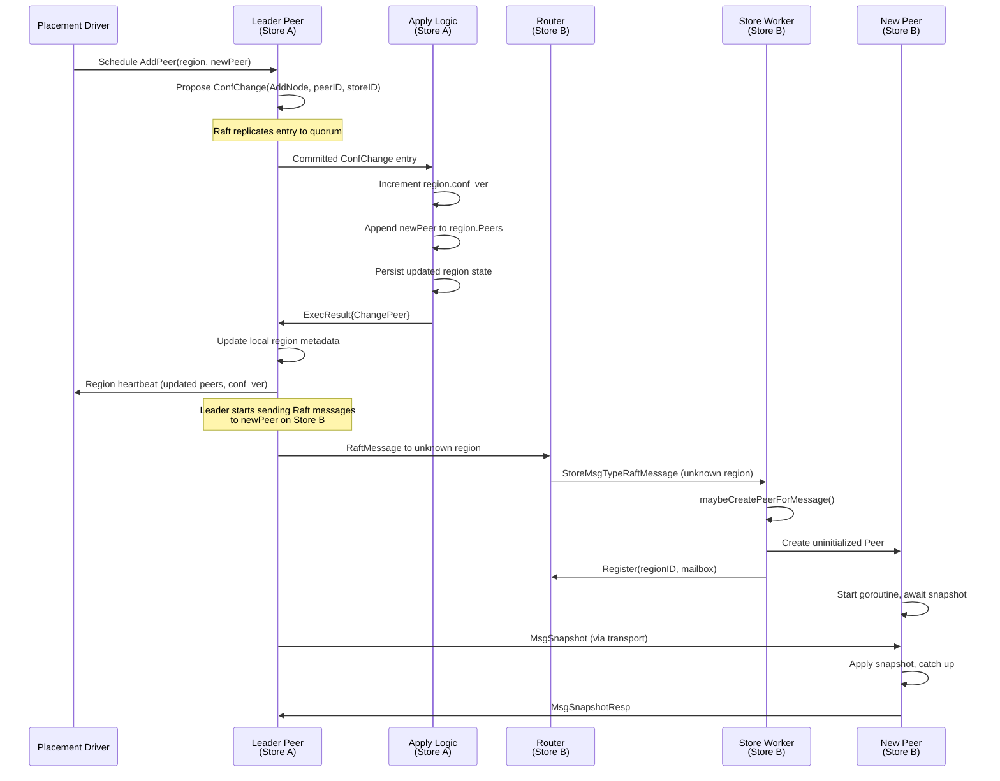
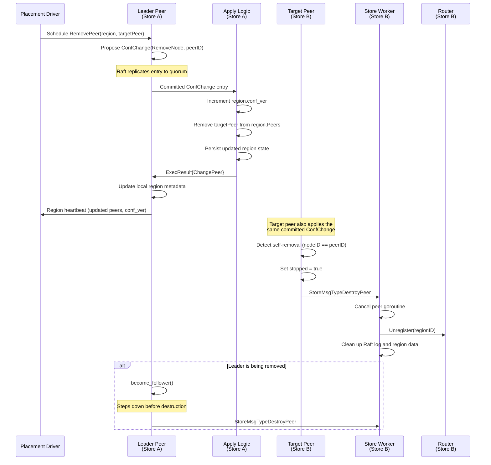

# Raft Configuration Changes (Peer Add/Remove)

This document specifies the design for completing Raft configuration change support in gookvs. Currently, `ConfChange` entries are parsed and applied to `RawNode` (updating Raft internal state), but no cluster-level actions follow: no peer creation/destruction on remote stores, no region metadata update, and no PD notification.

> **Reference**: [tikv_impl_docs/raft_and_replication.md](../../tikv_impl_docs/raft_and_replication.md) section 1.7 (Configuration Changes) and section 2.4 (Peer Creation). TiKV source: `components/raftstore/src/store/fsm/apply.rs` (`exec_change_peer`) and `components/raftstore/src/store/fsm/peer.rs` (`on_ready_change_peer`, `destroy_peer`).

---

## 1. Overview

### 1.1 Current State

The following pieces exist but are disconnected:

| Component | Location | Status |
|-----------|----------|--------|
| `ConfChange` / `ConfChangeV2` parsing in `handleReady()` | `internal/raftstore/peer.go:289-301` | Applies to `RawNode` only, no side effects |
| `ExecResultTypeChangePeer` result type | `internal/raftstore/msg.go:85` | Defined but never produced |
| `StoreMsgTypeCreatePeer` / `StoreMsgTypeDestroyPeer` | `internal/raftstore/msg.go:102-103` | Defined but no handler exists |
| `Router.Register()` / `Router.Unregister()` | `internal/raftstore/router/router.go` | Functional, used by `StoreCoordinator` |
| `StoreCoordinator.BootstrapRegion()` | `internal/server/coordinator.go` | Creates peers but only at bootstrap time |

### 1.2 Goal

Complete the conf change flow so that:
1. **AddPeer**: A new peer is created on the target store, registered with the Router, and starts replicating.
2. **RemovePeer**: The target peer is destroyed, unregistered from the Router, and its data cleaned up.
3. Region metadata (`metapb.Region.Peers`) is updated atomically with conf_ver increment.
4. PD is notified of membership changes (via region heartbeat).

---

## 2. TiKV Reference

### 2.1 Apply-Side: `exec_change_peer` (apply.rs)

TiKV's apply worker handles conf changes in the apply thread (separate from the Raft FSM):

1. Increments `conf_ver` in `RegionEpoch`.
2. For `AddNode`: appends the new peer to `region.peers` (or promotes a learner to voter).
3. For `RemoveNode`: removes the peer from `region.peers`. If removing self, sets `pending_remove = true` and `stopped = true`.
4. For `AddLearnerNode`: appends the peer with learner role.
5. Persists updated region state via `write_peer_state()`.
6. Returns `ExecResult::ChangePeer` containing the updated region and change metadata.

### 2.2 FSM-Side: `on_ready_change_peer` (peer.rs)

After the apply worker returns the result, the peer FSM:

1. Calls `raft_group.apply_conf_change()` to update Raft's internal voter/learner sets.
2. Updates the region in the store metadata (`update_region()`).
3. For `AddNode`/`AddLearnerNode`: adds the peer to heartbeat tracking; if leader, pings the new peer to trigger snapshot transfer.
4. For `RemoveNode`: removes the peer from heartbeat tracking and cache. If removing self, calls `destroy_peer()`.
5. If leader: immediately sends a PD heartbeat with the updated region.
6. If the removed peer was the leader itself, steps down via `become_follower()`.

### 2.3 Peer Creation on Remote Store

TiKV creates uninitialized peers reactively:

1. Leader starts sending Raft messages to the new peer ID on the target store.
2. The target store receives a `RaftMessage` for an unknown region.
3. The store creates an uninitialized `PeerFsm`, registers it, and the new peer catches up via snapshot.

gookvs will use a similar reactive approach, but also support explicit `StoreMsgTypeCreatePeer` for cases where PD orchestrates the creation directly.

### 2.4 Peer Destruction

1. Mark `pending_remove` to reject new proposals and messages.
2. Cancel the peer goroutine context.
3. Unregister from Router.
4. Clean up Raft log and region data from the engine.
5. Remove from `StoreCoordinator.peers` map.

---

## 3. Proposed Go Design

### 3.1 Store Worker Goroutine

A new `storeWorker` goroutine consumes messages from `Router.StoreCh()`. This is the missing piece that handles `StoreMsgTypeCreatePeer` and `StoreMsgTypeDestroyPeer`.

```go
// storeWorker runs in StoreCoordinator and handles store-level messages.
func (sc *StoreCoordinator) runStoreWorker(ctx context.Context) {
    for {
        select {
        case <-ctx.Done():
            return
        case msg := <-sc.router.StoreCh():
            sc.handleStoreMsg(msg)
        }
    }
}

func (sc *StoreCoordinator) handleStoreMsg(msg raftstore.StoreMsg) {
    switch msg.Type {
    case raftstore.StoreMsgTypeCreatePeer:
        req := msg.Data.(*CreatePeerRequest)
        sc.createPeer(req)
    case raftstore.StoreMsgTypeDestroyPeer:
        req := msg.Data.(*DestroyPeerRequest)
        sc.destroyPeer(req)
    case raftstore.StoreMsgTypeRaftMessage:
        // Handle Raft messages for unknown regions (trigger peer creation).
        raftMsg := msg.Data.(*raft_serverpb.RaftMessage)
        sc.maybeCreatePeerForMessage(raftMsg)
    }
}
```

### 3.2 New Data Structures

```go
// CreatePeerRequest is sent via StoreMsgTypeCreatePeer to create a new peer.
type CreatePeerRequest struct {
    Region *metapb.Region
    PeerID uint64
}

// DestroyPeerRequest is sent via StoreMsgTypeDestroyPeer to destroy a peer.
type DestroyPeerRequest struct {
    RegionID uint64
    PeerID   uint64
}

// ChangePeerResult carries the result of a conf change back to the peer FSM.
type ChangePeerResult struct {
    Index      uint64              // Raft log index of the conf change
    ChangeType eraftpb.ConfChangeType
    Peer       *metapb.Peer       // The peer being added or removed
    Region     *metapb.Region     // Updated region metadata
}
```

### 3.3 Enhanced `handleReady()` in Peer

The current `handleReady()` only calls `rawNode.ApplyConfChange()`. The enhanced version will:

1. Parse the conf change to extract the target peer and change type.
2. Update `p.region.Peers` (add or remove the peer entry).
3. Increment `p.region.RegionEpoch.ConfVer`.
4. Produce an `ExecResult` with `ExecResultTypeChangePeer`.
5. If removing self, set `p.stopped` and signal destruction.

```go
func (p *Peer) applyConfChangeEntry(e raftpb.Entry) *ChangePeerResult {
    if e.Type == raftpb.EntryConfChange {
        var cc raftpb.ConfChange
        if err := cc.Unmarshal(e.Data); err != nil {
            return nil
        }
        p.rawNode.ApplyConfChange(cc)
        return p.processConfChange(cc.Type, cc.NodeID, e.Index)
    } else if e.Type == raftpb.EntryConfChangeV2 {
        var cc raftpb.ConfChangeV2
        if err := cc.Unmarshal(e.Data); err != nil {
            return nil
        }
        p.rawNode.ApplyConfChange(cc)
        // Process each individual change in the V2 batch.
        for _, change := range cc.Changes {
            return p.processConfChange(change.Type, change.NodeID, e.Index)
        }
    }
    return nil
}

func (p *Peer) processConfChange(
    changeType raftpb.ConfChangeType,
    nodeID uint64,
    index uint64,
) *ChangePeerResult {
    // Build the updated region by cloning and modifying Peers list.
    region := proto.Clone(p.region).(*metapb.Region)
    region.RegionEpoch.ConfVer++

    var targetPeer *metapb.Peer
    switch changeType {
    case raftpb.ConfChangeAddNode:
        // Peer info must be encoded in the ConfChange context.
        targetPeer = decodePeerFromContext(/* ... */)
        region.Peers = append(region.Peers, targetPeer)
    case raftpb.ConfChangeRemoveNode:
        targetPeer, region.Peers = removePeerByID(region.Peers, nodeID)
    case raftpb.ConfChangeAddLearnerNode:
        targetPeer = decodePeerFromContext(/* ... */)
        region.Peers = append(region.Peers, targetPeer)
    }

    p.region = region

    // If removing self, mark for destruction.
    if changeType == raftpb.ConfChangeRemoveNode && nodeID == p.peerID {
        p.stopped.Store(true)
    }

    return &ChangePeerResult{
        Index:      index,
        ChangeType: changeType,
        Peer:       targetPeer,
        Region:     region,
    }
}
```

### 3.4 Peer Creation Flow in StoreCoordinator

```go
func (sc *StoreCoordinator) createPeer(req *CreatePeerRequest) error {
    sc.mu.Lock()
    defer sc.mu.Unlock()

    regionID := req.Region.GetId()
    if _, exists := sc.peers[regionID]; exists {
        return fmt.Errorf("peer for region %d already exists", regionID)
    }

    // Create an uninitialized peer (no bootstrap peers -- will catch up via snapshot).
    peer, err := raftstore.NewPeer(
        regionID, req.PeerID, sc.storeID,
        req.Region, sc.engine, sc.cfg,
        nil, // nil peers = non-bootstrap, recover from engine or start empty
    )
    if err != nil {
        return err
    }

    // Wire send/apply functions (same as BootstrapRegion).
    peer.SetSendFunc(func(msgs []raftpb.Message) { /* ... */ })
    peer.SetApplyFunc(func(regionID uint64, entries []raftpb.Entry) { /* ... */ })

    // Register and start.
    if err := sc.router.Register(regionID, peer.Mailbox); err != nil {
        return err
    }

    ctx, cancel := context.WithCancel(context.Background())
    done := make(chan struct{})
    sc.peers[regionID] = peer
    sc.cancels[regionID] = cancel
    sc.dones[regionID] = done

    go func() {
        peer.Run(ctx)
        close(done)
    }()

    return nil
}
```

### 3.5 Peer Destruction Flow in StoreCoordinator

```go
func (sc *StoreCoordinator) destroyPeer(req *DestroyPeerRequest) error {
    sc.mu.Lock()
    defer sc.mu.Unlock()

    regionID := req.RegionID
    cancel, ok := sc.cancels[regionID]
    if !ok {
        return fmt.Errorf("peer for region %d not found", regionID)
    }

    // 1. Cancel the peer goroutine.
    cancel()
    <-sc.dones[regionID]

    // 2. Unregister from Router.
    sc.router.Unregister(regionID)

    // 3. Clean up Raft log and region data from engine.
    sc.cleanupRegionData(regionID)

    // 4. Remove from internal maps.
    delete(sc.peers, regionID)
    delete(sc.cancels, regionID)
    delete(sc.dones, regionID)

    return nil
}

func (sc *StoreCoordinator) cleanupRegionData(regionID uint64) {
    // Delete raft log entries, hard state, and apply state for this region.
    // Uses engine.DeleteRange() on raft log key prefix.
}
```

### 3.6 Reactive Peer Creation from Unknown RaftMessage

When a store receives a Raft message for an unknown region (the leader has added this store but the peer does not exist yet), the store worker creates the peer:

```go
func (sc *StoreCoordinator) maybeCreatePeerForMessage(msg *raft_serverpb.RaftMessage) {
    regionID := msg.GetRegionId()

    // Check if peer already exists.
    if sc.router.HasRegion(regionID) {
        return
    }

    // Build a minimal region from the RaftMessage metadata.
    region := &metapb.Region{
        Id: regionID,
        Peers: []*metapb.Peer{
            msg.GetFromPeer(),
            msg.GetToPeer(),
        },
    }

    req := &CreatePeerRequest{
        Region: region,
        PeerID: msg.GetToPeer().GetId(),
    }
    sc.createPeer(req)
}
```

### 3.7 PD Notification

After a conf change is applied and the region metadata is updated, the leader sends a region heartbeat to PD with the new peer list and incremented `conf_ver`. This reuses the PD heartbeat mechanism (currently stubbed at `PeerTickPdHeartbeat`). The conf change completion triggers an immediate heartbeat rather than waiting for the next tick.

---

## 4. Processing Flows

### 4.1 AddPeer Sequence



### 4.2 RemovePeer Sequence



---

## 5. Data Structures

```mermaid
classDiagram
    class Peer {
        -regionID uint64
        -peerID uint64
        -storeID uint64
        -region *metapb.Region
        -rawNode *raft.RawNode
        -stopped atomic.Bool
        +handleReady()
        +applyConfChangeEntry(entry) *ChangePeerResult
        +processConfChange(type, nodeID, index) *ChangePeerResult
    }

    class StoreCoordinator {
        -storeID uint64
        -peers map[uint64]*Peer
        -cancels map[uint64]CancelFunc
        -router *Router
        -client *RaftClient
        +runStoreWorker(ctx)
        +handleStoreMsg(msg)
        +createPeer(req) error
        +destroyPeer(req) error
        +maybeCreatePeerForMessage(msg)
        +cleanupRegionData(regionID)
    }

    class Router {
        -peers sync.Map
        -storeCh chan StoreMsg
        +Register(regionID, ch) error
        +Unregister(regionID)
        +Send(regionID, msg) error
        +SendStore(msg) error
        +HasRegion(regionID) bool
    }

    class CreatePeerRequest {
        +Region *metapb.Region
        +PeerID uint64
    }

    class DestroyPeerRequest {
        +RegionID uint64
        +PeerID uint64
    }

    class ChangePeerResult {
        +Index uint64
        +ChangeType ConfChangeType
        +Peer *metapb.Peer
        +Region *metapb.Region
    }

    class StoreMsg {
        +Type StoreMsgType
        +Data interface{}
    }

    class ExecResult {
        +Type ExecResultType
        +Data interface{}
    }

    StoreCoordinator --> Router : routes messages
    StoreCoordinator --> Peer : manages lifecycle
    StoreCoordinator ..> CreatePeerRequest : consumes
    StoreCoordinator ..> DestroyPeerRequest : consumes
    Peer ..> ChangePeerResult : produces
    ChangePeerResult --> ExecResult : wrapped as Data
    StoreMsg ..> CreatePeerRequest : carries
    StoreMsg ..> DestroyPeerRequest : carries
    Router --> StoreMsg : delivers via StoreCh
```

---

## 6. Error Handling

### 6.1 Target Store Unreachable

When the leader cannot send Raft messages to the newly added peer's store:
- The leader's transport layer reports `StoreUnreachable` (via `StoreMsgTypeStoreUnreachable`).
- The leader retries message sending on subsequent heartbeat ticks.
- PD monitors the pending peer via heartbeat reports and may cancel the conf change or schedule a replacement if the peer remains uninitialized for too long.
- No rollback of the conf change is needed: the Raft group continues operating with the old quorum until the new peer catches up.

### 6.2 Duplicate Peer Creation

- `Router.Register()` returns `ErrPeerAlreadyRegistered` if the region is already registered.
- `StoreCoordinator.createPeer()` checks `sc.peers` map before creating.
- Both checks prevent duplicate peers from being created.

### 6.3 Stale Conf Change

- Region epoch (`conf_ver`) is checked on every admin request proposal. If the epoch in the request is stale (lower than current), the proposal is rejected.
- On apply side, if the conf change refers to a peer that does not exist (for RemoveNode) or already exists (for AddNode), the apply returns an error and the conf change is effectively a no-op.

### 6.4 Self-Removal as Leader

- If the leader removes itself, it must first step down via `become_follower()` before destruction.
- This ensures the Raft group can elect a new leader before the old leader's state is cleaned up.
- The peer sets `stopped = true` and sends `StoreMsgTypeDestroyPeer` to the store worker.

### 6.5 Conf Change During Snapshot Transfer

- If a peer is currently handling a snapshot, destruction is delayed until snapshot processing completes.
- The `DestroyPeerRequest` is re-queued or the peer checks a `pendingDestroy` flag after snapshot application.

### 6.6 Concurrent Conf Changes

- etcd/raft enforces that only one conf change can be pending at a time (the `PendingConfIndex` mechanism).
- Attempting to propose a second conf change while one is uncommitted results in a proposal rejection by `RawNode.ProposeConfChange()`.

---

## 7. Testing Strategy

### 7.1 Unit Tests

| Test Case | Description |
|-----------|-------------|
| `TestProcessConfChangeAddNode` | Verify `processConfChange` adds peer to region and increments `conf_ver` |
| `TestProcessConfChangeRemoveNode` | Verify peer removal from region and `conf_ver` increment |
| `TestProcessConfChangeSelfRemoval` | Verify `stopped` is set when removing self |
| `TestProcessConfChangeDuplicateAdd` | Verify error when adding already-existing peer |
| `TestProcessConfChangeRemoveMissing` | Verify error when removing non-existent peer |
| `TestCreatePeerRequest` | Verify `StoreCoordinator.createPeer` registers peer with Router |
| `TestDestroyPeerRequest` | Verify `StoreCoordinator.destroyPeer` unregisters and cleans up |
| `TestDuplicateCreatePeer` | Verify second creation attempt returns error |
| `TestMaybeCreatePeerForMessage` | Verify reactive peer creation from unknown RaftMessage |

### 7.2 Integration Tests

| Test Case | Description |
|-----------|-------------|
| `TestAddPeerE2E` | 3-node cluster: add 4th peer, verify it receives snapshot and replicates |
| `TestRemovePeerE2E` | 3-node cluster: remove 1 peer, verify 2-node cluster continues operating |
| `TestAddRemovePeerSequence` | Add then remove a peer, verify region metadata consistency |
| `TestLeaderSelfRemoval` | Leader removes itself, verify new leader elected and cluster continues |
| `TestConfChangeWithUnreachableStore` | Add peer on unreachable store, verify cluster remains functional |
| `TestConfChangeRegionEpoch` | Verify `conf_ver` monotonically increases across multiple conf changes |
| `TestConcurrentConfChanges` | Propose two conf changes simultaneously, verify only one is accepted |

### 7.3 TiKV Test Case Mapping

Port relevant test cases from TiKV's `raftstore/src/store/fsm/` test suite:
- `test_conf_change_basic` -- basic add/remove peer
- `test_conf_change_remove_leader` -- leader self-removal
- `test_conf_change_stale_epoch` -- stale epoch rejection
- `test_redundant_conf_change_by_snapshot` -- conf change overtaken by snapshot

---

## 8. Implementation Steps

### Step 1: Data Structures and Message Types

- Define `CreatePeerRequest`, `DestroyPeerRequest`, `ChangePeerResult` in `internal/raftstore/msg.go`.
- No new files needed; extend existing msg.go.
- **Deliverable**: Compile check passes.

### Step 2: Enhanced `handleReady()` Conf Change Processing

- Refactor `peer.go:handleReady()` to call `applyConfChangeEntry()` for each conf change entry.
- Implement `processConfChange()` that updates `p.region.Peers` and increments `conf_ver`.
- Return `ChangePeerResult` that gets wrapped into `ExecResult`.
- **Deliverable**: Unit tests for `processConfChange` pass.

### Step 3: Store Worker Goroutine

- Add `runStoreWorker()` to `StoreCoordinator`.
- Implement `handleStoreMsg()` dispatching for `CreatePeer` and `DestroyPeer`.
- Start the store worker goroutine in `StoreCoordinator` initialization (or add a `Start()` method).
- **Deliverable**: Unit tests for store worker message handling pass.

### Step 4: Peer Creation

- Implement `StoreCoordinator.createPeer()` -- similar to `BootstrapRegion()` but for non-bootstrap (nil peers).
- Implement `maybeCreatePeerForMessage()` for reactive creation from unknown Raft messages.
- Wire into `HandleRaftMessage()` to route unknown-region messages to store worker.
- **Deliverable**: Unit test verifying new peer creation and Router registration.

### Step 5: Peer Destruction

- Implement `StoreCoordinator.destroyPeer()` -- cancel goroutine, unregister, clean up engine data.
- Implement `cleanupRegionData()` to delete Raft log entries and region state from engine.
- Wire self-removal detection in `Peer.handleReady()` to send `StoreMsgTypeDestroyPeer`.
- **Deliverable**: Unit test verifying peer destruction and cleanup.

### Step 6: PD Heartbeat Integration

- After conf change completion, trigger an immediate PD region heartbeat (when `PeerTickPdHeartbeat` is implemented).
- For now, log the conf change completion and updated region metadata.
- **Deliverable**: Log output verification in integration test.

### Step 7: Integration Tests

- Implement `TestAddPeerE2E` and `TestRemovePeerE2E` using multi-node test harness.
- Verify region metadata consistency across all nodes after conf changes.
- **Deliverable**: All integration tests pass.

### Step 8: Leader Self-Removal

- Handle the edge case where the leader is the removed peer.
- Implement `become_follower()` call before destruction.
- **Deliverable**: `TestLeaderSelfRemoval` passes.

---

## 9. Dependencies

### 9.1 Prerequisites

| Dependency | Status | Impact |
|------------|--------|--------|
| `Router.Register` / `Unregister` | Implemented | Used directly for peer lifecycle |
| `StoreCoordinator.BootstrapRegion` | Implemented | Template for `createPeer` |
| `RaftClient` transport | Implemented | Sends Raft messages to new peers |
| `Peer.Run` goroutine model | Implemented | New peers reuse the same model |
| `metapb.Region` / `metapb.Peer` protobuf types | Implemented | Region metadata manipulation |

### 9.2 Related Features (Not Required but Interact)

| Feature | Interaction |
|---------|-------------|
| Raft Snapshot (3.1) | New peers need snapshots to catch up; currently stubbed |
| PD Heartbeat (3.6) | Conf changes should trigger immediate heartbeat; currently stubbed |
| Region Split (3.2) | Split creates new regions that may later need conf changes |
| Raft Log GC (3.3) | Log compaction must not truncate uncommitted conf change entries |

### 9.3 Implementation Order Note

Snapshot support (section 3.1 in `08_not_yet_implemented.md`) is a soft dependency: without it, newly added peers cannot catch up via snapshot and must replay the entire Raft log from the beginning. For initial implementation, this is acceptable in test scenarios with short logs. For production use, snapshot support must be completed first.
