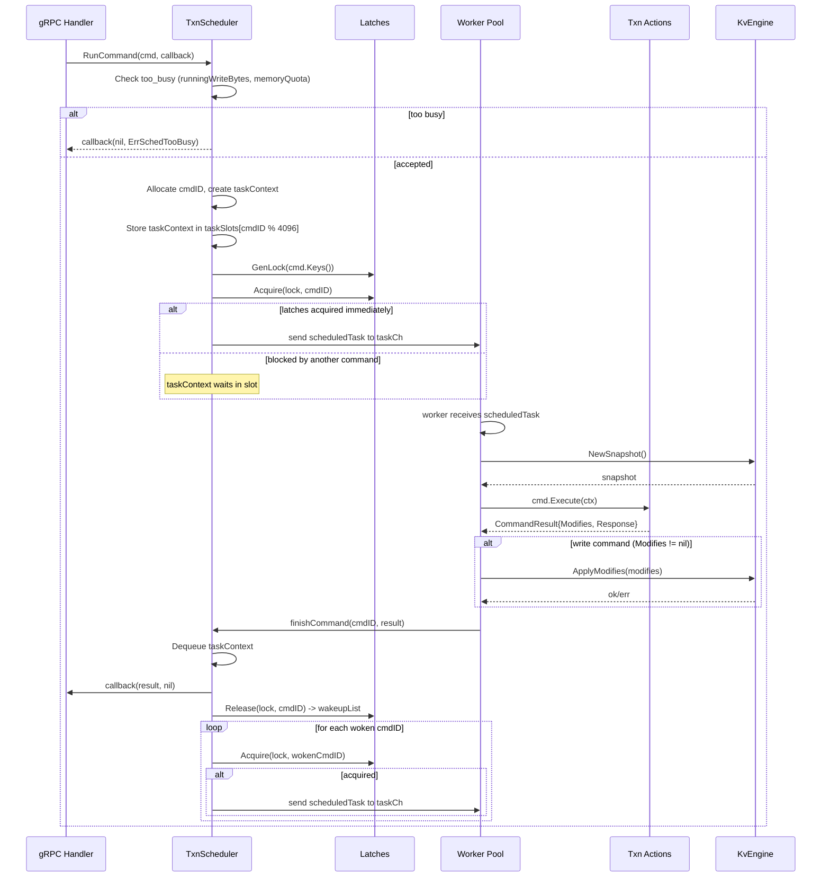
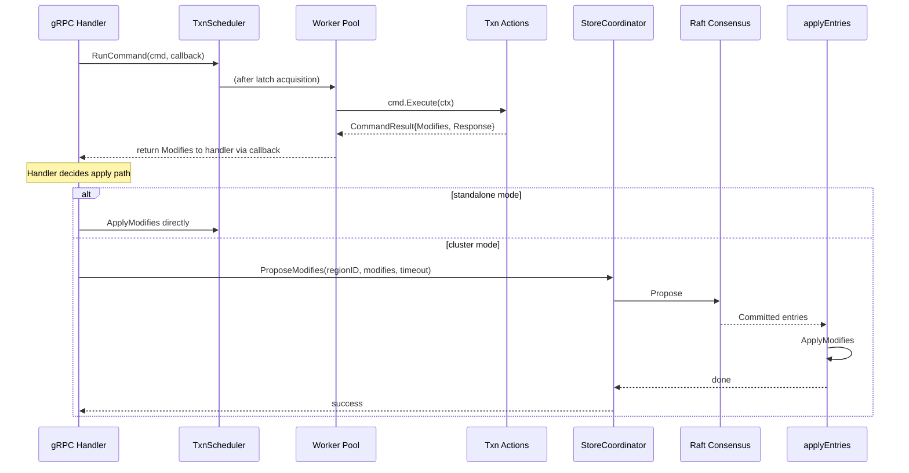

# 05 TxnScheduler: Command Dispatcher for Transaction Processing

## 1. Overview

The TxnScheduler is a command queue and worker pool that sits between the gRPC service layer (`tikvService`) and the MVCC/transaction execution layer. Today, `Storage` methods (`Prewrite`, `Commit`, `BatchRollback`, etc.) perform latch acquisition, snapshot creation, MVCC execution, and engine writes inline on the gRPC handler goroutine. The scheduler extracts this work into an asynchronous pipeline:

1. **Accept** -- the gRPC handler wraps the request into a `Command` and submits it to the scheduler with a callback.
2. **Latch** -- the scheduler acquires key-level latches; if blocked, the command waits until woken.
3. **Execute** -- a worker goroutine from a fixed-size pool takes the command, obtains a snapshot, runs the MVCC logic, and produces either a read result or a set of `[]mvcc.Modify` writes.
4. **Write** -- for write commands, the modifications are applied to the engine (standalone) or proposed via Raft (cluster mode).
5. **Callback** -- the result is delivered to the gRPC handler via the callback, which sends the gRPC response.

This design decouples request admission from execution, enables backpressure via the worker pool and memory quota, and properly integrates `SchedulerConcurrency` from `config.go` (currently defined but unused).

---

## 2. TiKV Reference

TiKV's `TxnScheduler` (in `src/storage/txn/scheduler.rs`) follows this architecture:

| Component | TiKV (Rust) | gookvs Target (Go) |
|---|---|---|
| Scheduler struct | `TxnScheduler<E, L>` wrapping `Arc<TxnSchedulerInner<L>>` | `TxnScheduler` struct |
| Command ID generator | `AtomicU64` (`id_alloc`) | `atomic.Uint64` |
| Task context storage | `Vec<CachePadded<Mutex<HashMap<u64, TaskContext>>>>` (4096 sharded slots) | `[]sync.Mutex` protecting `map[uint64]*TaskContext` (sharded) |
| Latch management | `Latches` in `TxnSchedulerInner` | Existing `latch.Latches` |
| Worker pool | `SchedPool` (tokio thread pool) | Fixed goroutine pool (`workerCount` goroutines reading from a channel) |
| Concurrency manager | `ConcurrencyManager` in inner | Existing `concurrency.Manager` |
| Memory quota | `MemoryQuota` (atomic CAS) | Existing `flow.MemoryQuota` |
| Flow control | `running_write_bytes` + `FlowController` | `runningWriteBytes` atomic + existing `flow.FlowController` |
| Callback | `StorageCallback` enum (boxed closures) | `func(CommandResult)` callback |
| Command type | `Command` enum with per-variant `process_write`/`process_read` | `Command` interface with `Execute` method |

Key behavioral details from TiKV:

- **`run_cmd`**: Entry point. Checks `too_busy` (write bytes threshold + flow controller). Allocates a command ID, creates a `Task`, and calls `schedule_command`.
- **`schedule_command`**: Stores a `TaskContext` in the sharded slot map, attempts `latches.acquire`. If acquired immediately, calls `execute`. If not, the command waits; when latches are released, `try_to_wake_up` re-attempts acquisition.
- **`execute`**: Spawns an async task on the worker pool. Obtains a snapshot, then calls `process` (which dispatches to `process_read` or `process_write` depending on command type).
- **`process_write`**: Runs the command's MVCC logic against the snapshot, producing a `WriteResult` containing `to_be_write: WriteData` (modifications) and a `ProcessResult`. The modifications are written to the engine; on completion, `on_write_finished` fires.
- **`on_write_finished`**: Dequeues the `TaskContext`, invokes the callback with the `ProcessResult`, and releases latches (waking any blocked commands).
- **Latch wakeup**: `release_latches` returns a wakeup list; for each woken command ID, `try_to_wake_up` re-attempts latch acquisition and, if successful, calls `execute`.

---

## 3. Proposed Go Design

### 3.1 Package Location

`internal/storage/txn/scheduler/` -- new package.

### 3.2 Command Interface

```go
// CommandKind identifies the type of scheduler command.
type CommandKind int

const (
    CmdPrewrite CommandKind = iota
    CmdCommit
    CmdBatchRollback
    CmdCleanup
    CmdCheckTxnStatus
    CmdPessimisticLock
    CmdPessimisticRollback
)

// Command represents a transaction command to be executed by the scheduler.
type Command interface {
    // Kind returns the command type for metrics and logging.
    Kind() CommandKind

    // Keys returns the keys involved, used for latch acquisition.
    Keys() [][]byte

    // NeedFlowControl returns true for write commands that should be
    // subject to backpressure.
    NeedFlowControl() bool

    // Execute runs the command against the given snapshot/engine.
    // Returns modifications to apply and a result to deliver to the caller.
    // For read-only commands (e.g. CheckTxnStatus), modifies will be nil.
    Execute(ctx CommandContext) (*CommandResult, error)
}
```

### 3.3 Supporting Types

```go
// CommandContext provides the execution environment for a command.
type CommandContext struct {
    Engine  traits.KvEngine
    ConcMgr *concurrency.Manager
}

// CommandResult holds the output of command execution.
type CommandResult struct {
    Modifies []mvcc.Modify  // nil for read-only commands
    Response interface{}     // command-specific result (e.g. []error for Prewrite)
}

// Callback is invoked when a command completes.
type Callback func(result *CommandResult, err error)

// TaskContext tracks the state of a scheduled command.
type taskContext struct {
    cmd        Command
    cmdID      uint64
    lock       *latch.Lock
    callback   Callback
    writeBytes int
    enqueueAt  time.Time
}
```

### 3.4 TxnScheduler Struct

```go
type TxnScheduler struct {
    // Latch table for key serialization (size = SchedulerConcurrency from config)
    latches *latch.Latches

    // Sharded task context storage: cmdID -> taskContext
    taskSlots []taskSlot  // length = 4096
    idAlloc   atomic.Uint64

    // Worker pool
    taskCh    chan scheduledTask  // buffered channel, capacity = workerCount * 4
    workerWg  sync.WaitGroup

    // Flow control
    runningWriteBytes atomic.Int64
    pendingWriteThreshold int64
    memoryQuota *flow.MemoryQuota

    // Shared dependencies
    engine  traits.KvEngine
    concMgr *concurrency.Manager

    // Lifecycle
    ctx    context.Context
    cancel context.CancelFunc
}

type taskSlot struct {
    mu    sync.Mutex
    tasks map[uint64]*taskContext
}

type scheduledTask struct {
    cmdID uint64
    task  *taskContext
}
```

### 3.5 Constructor

```go
func New(cfg Config) *TxnScheduler {
    ctx, cancel := context.WithCancel(context.Background())
    s := &TxnScheduler{
        latches:               latch.New(cfg.SchedulerConcurrency),
        taskSlots:             make([]taskSlot, 4096),
        taskCh:                make(chan scheduledTask, cfg.WorkerCount*4),
        pendingWriteThreshold: cfg.PendingWriteThreshold,
        memoryQuota:           flow.NewMemoryQuota(cfg.MemoryQuotaBytes),
        engine:                cfg.Engine,
        concMgr:               cfg.ConcurrencyManager,
        ctx:                   ctx,
        cancel:                cancel,
    }
    for i := range s.taskSlots {
        s.taskSlots[i].tasks = make(map[uint64]*taskContext)
    }
    // Start worker goroutines
    for i := 0; i < cfg.WorkerCount; i++ {
        s.workerWg.Add(1)
        go s.worker()
    }
    return s
}
```

### 3.6 Config

```go
type Config struct {
    SchedulerConcurrency int              // latch slot count (from config.StorageConfig)
    WorkerCount          int              // goroutine pool size (default: runtime.NumCPU())
    PendingWriteThreshold int64           // bytes; reject if exceeded
    MemoryQuotaBytes     int64            // scheduler memory quota
    Engine               traits.KvEngine
    ConcurrencyManager   *concurrency.Manager
}
```

---

## 4. Processing Flows

### 4.1 Command Lifecycle (Sequence Diagram)



### 4.2 Cluster Mode Write Path

When a `StoreCoordinator` is present, the scheduler's write application step changes: instead of calling `ApplyModifies` directly, the `CommandResult.Modifies` are proposed via Raft. The callback is invoked only after Raft consensus and apply.



---

## 5. Data Structures

### 5.1 Component Relationships

```mermaid
classDiagram
    class TxnScheduler {
        -latches *latch.Latches
        -taskSlots []taskSlot
        -idAlloc atomic.Uint64
        -taskCh chan scheduledTask
        -runningWriteBytes atomic.Int64
        -memoryQuota *flow.MemoryQuota
        -engine traits.KvEngine
        -concMgr *concurrency.Manager
        +RunCommand(cmd Command, cb Callback)
        +Stop()
        -worker()
        -scheduleCommand(task, cmdID)
        -finishCommand(cmdID, result, err)
        -tryToWakeUp(cmdID)
        -tooBusy() bool
    }

    class Command {
        <<interface>>
        +Kind() CommandKind
        +Keys() [][]byte
        +NeedFlowControl() bool
        +Execute(ctx CommandContext) *CommandResult, error
    }

    class PrewriteCommand {
        +Mutations []txn.Mutation
        +Primary []byte
        +StartTS txntypes.TimeStamp
        +LockTTL uint64
    }

    class CommitCommand {
        +Keys [][]byte
        +StartTS txntypes.TimeStamp
        +CommitTS txntypes.TimeStamp
    }

    class RollbackCommand {
        +Keys [][]byte
        +StartTS txntypes.TimeStamp
    }

    class CleanupCommand {
        +Key []byte
        +StartTS txntypes.TimeStamp
    }

    class CheckTxnStatusCommand {
        +PrimaryKey []byte
        +StartTS txntypes.TimeStamp
    }

    class taskContext {
        -cmd Command
        -cmdID uint64
        -lock *latch.Lock
        -callback Callback
        -writeBytes int
        -enqueueAt time.Time
    }

    class taskSlot {
        -mu sync.Mutex
        -tasks map~uint64, taskContext~
    }

    TxnScheduler "1" *-- "4096" taskSlot
    TxnScheduler ..> Command : dispatches
    taskSlot "1" *-- "*" taskContext
    taskContext --> Command : holds
    PrewriteCommand ..|> Command
    CommitCommand ..|> Command
    RollbackCommand ..|> Command
    CleanupCommand ..|> Command
    CheckTxnStatusCommand ..|> Command
    TxnScheduler --> "latch.Latches" : uses
    TxnScheduler --> "flow.MemoryQuota" : uses
    TxnScheduler --> "concurrency.Manager" : passes to commands
```

---

## 6. Error Handling

### 6.1 Admission Errors

| Condition | Error | Behavior |
|---|---|---|
| `runningWriteBytes >= pendingWriteThreshold` | `flow.ErrSchedTooBusy` | Callback invoked immediately with error; command never enters the latch queue |
| `memoryQuota.Acquire` fails | `flow.ErrSchedTooBusy` | Same as above |
| Scheduler stopped (`ctx.Done()`) | `context.Canceled` | Callback invoked with cancellation error |

### 6.2 Execution Errors

Errors from `cmd.Execute()` (write conflicts, lock conflicts, lock-not-found) are propagated through the callback as the `error` argument. These are logical errors that the gRPC handler converts to `kvrpcpb.KeyError` responses -- they are not gRPC-level errors.

### 6.3 Engine Write Errors

If `ApplyModifies` fails (I/O error, corruption), the error is delivered through the callback. In cluster mode, Raft proposal failures (timeout, leader change) are handled by `StoreCoordinator.ProposeModifies` and surfaced to the gRPC handler.

### 6.4 Latch Deadlock Prevention

The existing `latch.Latches` already prevents deadlocks via sorted acquisition order. The scheduler adds no new deadlock vectors because each command's latches are fully released before any woken command begins execution.

---

## 7. Testing Strategy

### 7.1 Unit Tests (`internal/storage/txn/scheduler/scheduler_test.go`)

| Test Case | Description |
|---|---|
| `TestRunCommandBasic` | Submit a Prewrite command; verify callback receives correct result. |
| `TestConcurrentNonOverlappingKeys` | Submit N commands with disjoint key sets; verify all complete without serialization. |
| `TestLatchSerialization` | Submit two Prewrite commands with overlapping keys; verify they execute serially (second waits for first). |
| `TestLatchWakeup` | After the first command releases latches, verify the blocked command is woken and completes. |
| `TestTooBusy` | Set `pendingWriteThreshold` low; submit enough writes to trigger rejection; verify `ErrSchedTooBusy`. |
| `TestMemoryQuotaRejection` | Set memory quota low; verify commands are rejected when quota is exhausted. |
| `TestGracefulStop` | Call `Stop()`; verify in-flight commands complete and no new commands are accepted. |
| `TestCommandKinds` | Submit each command kind (Commit, Rollback, Cleanup, CheckTxnStatus); verify correct dispatch and result. |
| `TestCallbackInvocation` | Verify the callback is invoked exactly once per submitted command, even on error. |

### 7.2 Integration Tests

| Test Case | Description |
|---|---|
| `TestSchedulerEndToEnd` | Wire TxnScheduler into Storage; run a full Prewrite+Commit cycle through the scheduler. |
| `TestSchedulerWithRaft` | In cluster mode, verify that scheduler-produced modifies are correctly proposed and applied via Raft. |
| `TestHighConcurrency` | Run 100 concurrent transactions with random key overlap; verify no data corruption and all callbacks complete. |

### 7.3 TiKV Test Case References

The TiKV scheduler tests in `src/storage/txn/scheduler.rs` and `src/storage/mod.rs` cover:
- Busy rejection (`test_scheduler_too_busy`)
- Latch contention and wakeup
- Command deadline enforcement
- Write flow control threshold

These should be adapted to Go table-driven tests using `testify/assert`.

---

## 8. Implementation Steps

### Step 1: Define Command Interface and Concrete Types

- Create `internal/storage/txn/scheduler/command.go`.
- Define the `Command` interface, `CommandKind`, `CommandContext`, `CommandResult`, `Callback`.
- Implement `PrewriteCommand`, `CommitCommand`, `RollbackCommand`, `CleanupCommand`, `CheckTxnStatusCommand`.
- Each concrete command's `Execute` method extracts the existing logic from `Storage.Prewrite`, `Storage.Commit`, etc. (snapshot creation, MvccTxn creation, action calls).

### Step 2: Implement TxnScheduler Core

- Create `internal/storage/txn/scheduler/scheduler.go`.
- Implement `New`, `RunCommand`, `Stop`.
- Implement `scheduleCommand` (latch acquisition + dispatch to worker pool or enqueue).
- Implement `worker` goroutine loop (receive from `taskCh`, execute, finish).
- Implement `finishCommand` (dequeue context, invoke callback, release latches, wake up blocked commands).
- Implement `tryToWakeUp` (re-acquire latches for a woken command, dispatch if successful).
- Implement `tooBusy` check using `runningWriteBytes` and `memoryQuota`.

### Step 3: Integrate with Storage

- Modify `internal/server/storage.go`:
  - Add a `scheduler *scheduler.TxnScheduler` field.
  - Replace direct latch/action/apply logic in `Prewrite`, `Commit`, `BatchRollback`, `Cleanup` with `scheduler.RunCommand(cmd, callback)`.
  - For `PrewriteModifies` / `CommitModifies` (cluster mode), the callback returns `CommandResult.Modifies` without applying.
  - Read-only operations (`Get`, `Scan`, `BatchGet`, `CheckTxnStatus`) can bypass the scheduler initially (they don't need latch serialization in the current design).
- Remove the `latches`, `concMgr`, `mu`, `nextCmdID` fields from `Storage` (moved into scheduler).
- Wire `SchedulerConcurrency` from `config.StorageConfig` to `scheduler.Config.SchedulerConcurrency`.

### Step 4: Async Result Delivery

- For standalone mode: the callback writes the result to a channel or `sync.WaitGroup`-guarded result slot. The gRPC handler blocks on this channel (converting async scheduler execution back to synchronous gRPC response).
- For cluster mode: the callback returns modifies; the gRPC handler then calls `coordinator.ProposeModifies` (existing flow unchanged).

### Step 5: Add Metrics

- `sched_commands_total` (counter, labeled by `CommandKind`)
- `sched_latch_wait_duration_seconds` (histogram)
- `sched_command_duration_seconds` (histogram, labeled by `CommandKind`)
- `sched_running_write_bytes` (gauge)
- `sched_too_busy_total` (counter)
- `sched_worker_pool_size` (gauge)

### Step 6: Tests

- Implement unit tests per Section 7.1.
- Implement integration tests per Section 7.2.
- Verify existing `storage_test.go` tests still pass with the scheduler interposed.

---

## 9. Dependencies

| Dependency | Package | Status |
|---|---|---|
| Latch system | `internal/storage/txn/latch` | Exists; used as-is |
| ConcurrencyManager | `internal/storage/txn/concurrency` | Exists; passed to commands via `CommandContext` |
| MemoryQuota | `internal/server/flow` | Exists; `flow.MemoryQuota` with `Acquire`/`Release` |
| FlowController | `internal/server/flow` | Exists; `flow.FlowController` with `ShouldDrop` |
| SchedulerConcurrency config | `internal/config` | Exists but unused; will be wired to scheduler |
| MVCC / Txn actions | `internal/storage/mvcc`, `internal/storage/txn` | Exist; command `Execute` methods call these directly |
| Engine traits | `internal/engine/traits` | Exists; `KvEngine`, `Snapshot`, `WriteBatch` |
| StoreCoordinator | `internal/server` | Exists; integration point for cluster-mode write path |
