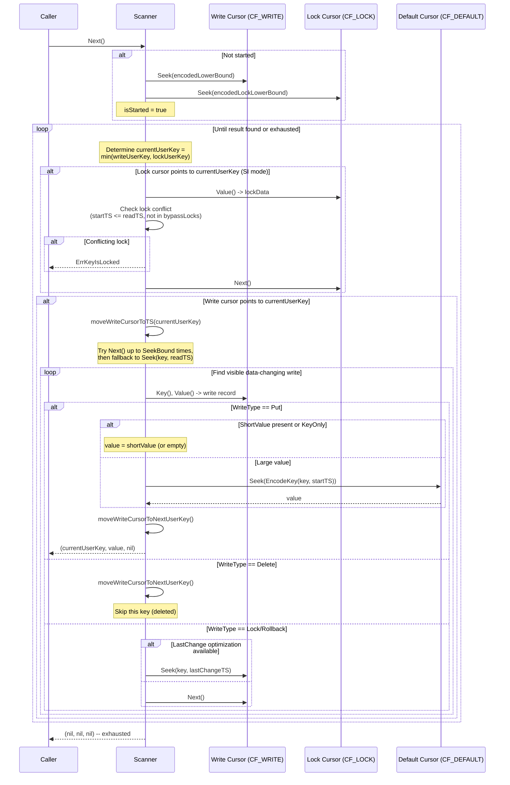
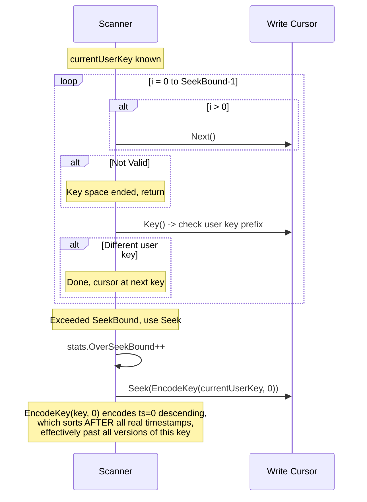
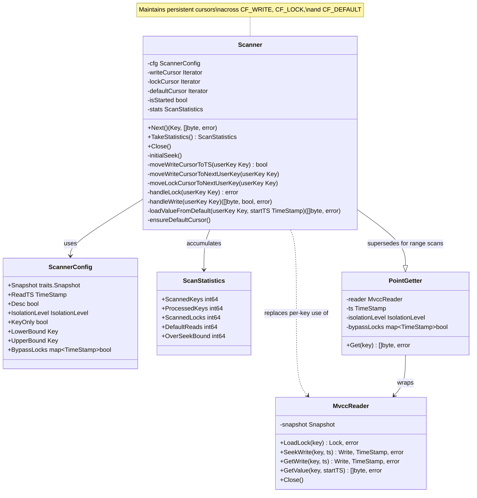

# MVCC Range Scanner

## 1. Overview

The MVCC Scanner provides efficient range-scan reads over multi-versioned data. It replaces the current ad-hoc approach in `server/storage.go:Scan()`, which creates a new `PointGetter` per key and uses a `visited` map for deduplication. The Scanner maintains persistent iterator cursors across CF_WRITE, CF_LOCK, and CF_DEFAULT, yielding one key-value pair per unique user key visible at a given read timestamp.

### Goals

- **Efficiency**: Maintain iterator position across keys; avoid per-key `PointGetter` instantiation and redundant seeks.
- **Correctness**: Full MVCC visibility semantics -- lock checking under SI, version skipping (Lock/Rollback records), LastChange optimization, short-value inlining.
- **Forward and backward scanning**: Support both ascending and descending key order.
- **Statistics**: Track scanned keys, processed keys, bytes read, and over-seek-bound events.

### Current State (Problem)

In `internal/server/storage.go`, `Scan()` iterates CF_WRITE with a single iterator but:

1. Creates a `PointGetter` per user key, which internally creates **new** seeks into CF_WRITE and CF_LOCK for every key -- O(n) seeks for n keys.
2. Uses a `map[string]bool` (`visited`) for key deduplication, wasting memory.
3. Performs an incorrect seek to skip to the next user key (the comment at line 144-151 acknowledges the confusion around ts=0 encoding).
4. Does not support backward scanning or `keyOnly` mode at the MVCC layer.

---

## 2. TiKV Reference

TiKV's scanner implementation lives in `src/storage/mvcc/reader/scanner/`:

| File | Component | Purpose |
|------|-----------|---------|
| `mod.rs` | `ScannerBuilder`, `ScannerConfig`, `Scanner` enum | Builder pattern, shared config, forward/backward dispatch |
| `forward.rs` | `ForwardScanner<S, P>`, `LatestKvPolicy`, `Cursors` | Generic forward scanner with pluggable scan policies |
| `backward.rs` | `BackwardKvScanner` | Reverse-order scanner |

### Key Design Patterns from TiKV

1. **Dual-cursor advancement**: The forward scanner simultaneously tracks a write cursor and a lock cursor. At each step, it computes `current_user_key = min(user_key(write_cursor), lock_cursor)` and determines which cursors have data for that key (`has_write`, `has_lock`).

2. **ScanPolicy trait**: TiKV uses a generic `ScanPolicy` trait with `handle_lock()` and `handle_write()` methods, enabling different scan modes (latest KV, entry scan, delta scan) via the same `ForwardScanner` core. For gookvs, we simplify to two concrete modes: forward KV and backward KV.

3. **SEEK_BOUND optimization**: When advancing the write cursor to the read timestamp or to the next user key, TiKV first tries `Next()` up to `SEEK_BOUND` (8) times. If the target is not found, it falls back to `Seek()`. This avoids expensive seeks when versions are few.

4. **Lazy default cursor**: The CF_DEFAULT cursor is only created when the first large value (no short value) is encountered, saving resources for key-only scans or datasets with mostly short values.

5. **Lock checking**: Under SI isolation, the lock cursor is advanced in lockstep with the write cursor. When a lock exists for `current_user_key` with `startTS <= readTS` and is not in the bypass set, the scanner returns `ErrKeyIsLocked`. Under RC isolation, no lock cursor is created.

6. **LastChange optimization**: When encountering Lock or Rollback write records, if `LastChange.EstimatedVersions >= SEEK_BOUND`, the scanner jumps directly to `LastChange.TS` instead of iterating through non-data-changing records one by one.

---

## 3. Proposed Go Design

### 3.1 ScannerConfig

```go
// ScannerConfig holds configuration for creating a Scanner.
type ScannerConfig struct {
    // Snapshot to scan over (required).
    Snapshot traits.Snapshot

    // ReadTS is the MVCC read timestamp (required).
    ReadTS txntypes.TimeStamp

    // Desc enables backward (descending key order) scanning.
    Desc bool

    // IsolationLevel controls lock checking behavior.
    // SI (default): check CF_LOCK and error on conflicting locks.
    // RC: skip lock checking entirely.
    IsolationLevel IsolationLevel

    // KeyOnly skips value retrieval when true.
    // Only keys are returned; values are empty byte slices.
    KeyOnly bool

    // LowerBound is the inclusive start of the scan range (encoded user key).
    // nil means scan from the beginning of the key space.
    LowerBound Key

    // UpperBound is the exclusive end of the scan range (encoded user key).
    // nil means scan to the end of the key space.
    UpperBound Key

    // BypassLocks is a set of lock start timestamps to ignore.
    BypassLocks map[txntypes.TimeStamp]bool
}
```

### 3.2 ScanStatistics

```go
// ScanStatistics tracks performance counters during a scan.
type ScanStatistics struct {
    // ScannedKeys is the total number of CF_WRITE entries examined.
    ScannedKeys int64

    // ProcessedKeys is the number of user keys returned to the caller.
    ProcessedKeys int64

    // ScannedLocks is the number of CF_LOCK entries examined.
    ScannedLocks int64

    // DefaultReads is the number of CF_DEFAULT point reads for large values.
    DefaultReads int64

    // OverSeekBound counts how many times the Next() loop exceeded
    // SeekBound and fell back to Seek().
    OverSeekBound int64
}
```

### 3.3 Scanner struct

```go
// Scanner performs MVCC-aware range scans with persistent cursor state.
type Scanner struct {
    cfg ScannerConfig

    // Cursors -- created once and reused across all keys.
    writeCursor   traits.Iterator // CF_WRITE, always present
    lockCursor    traits.Iterator // CF_LOCK, nil under RC isolation
    defaultCursor traits.Iterator // CF_DEFAULT, lazily created

    // isStarted tracks whether initial seek has been performed.
    isStarted bool

    // stats accumulates scan statistics.
    stats ScanStatistics
}
```

### 3.4 Constructor

```go
// NewScanner creates a Scanner from the given configuration.
// The caller must call Scanner.Close() when done.
func NewScanner(cfg ScannerConfig) *Scanner {
    s := &Scanner{cfg: cfg}

    // Always create a write cursor.
    s.writeCursor = cfg.Snapshot.NewIterator(cfnames.CFWrite, traits.IterOptions{
        LowerBound: encodeLowerBound(cfg.LowerBound, cfg.ReadTS, cfg.Desc),
        UpperBound: encodeUpperBound(cfg.UpperBound, cfg.Desc),
    })

    // Create lock cursor only for SI isolation.
    if cfg.IsolationLevel == IsolationLevelSI {
        s.lockCursor = cfg.Snapshot.NewIterator(cfnames.CFLock, traits.IterOptions{
            LowerBound: encodeLockBound(cfg.LowerBound),
            UpperBound: encodeLockBound(cfg.UpperBound),
        })
    }

    return s
}
```

### 3.5 Public API

```go
// Next returns the next visible key-value pair, or (nil, nil, nil) when exhausted.
// Under SI isolation, returns ErrKeyIsLocked if a conflicting lock is found.
func (s *Scanner) Next() (key Key, value []byte, err error)

// TakeStatistics returns the accumulated statistics and resets the counters.
func (s *Scanner) TakeStatistics() ScanStatistics

// Close releases all iterator resources.
func (s *Scanner) Close()
```

---

## 4. Processing Flows

### 4.1 Forward Scan Flow



### 4.2 moveWriteCursorToNextUserKey Flow

This helper advances the write cursor past all remaining versions of the current user key.



---

## 5. Data Structures



---

## 6. Error Handling

| Condition | Behavior |
|-----------|----------|
| Conflicting lock under SI | Return `ErrKeyIsLocked` with `LockInfo` containing key, startTS, primary, TTL, lockType |
| Lock with `startTS` in `BypassLocks` | Skip the lock, proceed to write records |
| Pessimistic lock (`LockTypePessimistic`) | Skip -- pessimistic locks are invisible to readers |
| Iterator error | Propagate the underlying engine error immediately |
| Missing CF_DEFAULT value (data corruption) | Return error: `"scanner: default value not found for key %x at startTS %d"` |
| Write cursor exhausted mid-key | Treat the key as having no visible version (skip) |
| `UpperBound` reached | Return `(nil, nil, nil)` -- scan complete |

---

## 7. Testing Strategy

### 7.1 Unit Tests (table-driven, testify/assert)

| Test Case | Description |
|-----------|-------------|
| `TestForwardScanBasic` | Scan 10 keys with one version each, verify order and values |
| `TestForwardScanMultipleVersions` | 3 keys with 5 versions each, read at middle timestamp, verify correct version |
| `TestForwardScanDeletes` | Mix of Put and Delete writes, verify deleted keys are skipped |
| `TestForwardScanLockConflict` | SI scan encounters a conflicting lock, returns `ErrKeyIsLocked` |
| `TestForwardScanBypassLocks` | Lock exists but startTS is in bypass set, value is returned |
| `TestForwardScanPessimisticLock` | Pessimistic locks are skipped transparently |
| `TestForwardScanRCIsolation` | RC scan skips all lock checking |
| `TestForwardScanKeyOnly` | `KeyOnly=true` returns empty values |
| `TestForwardScanRangeBounds` | LowerBound and UpperBound correctly limit output |
| `TestForwardScanRollbackAndLockRecords` | Write records of type Lock/Rollback are skipped, LastChange optimization is exercised |
| `TestForwardScanLastChangeOptimization` | Key with >= SeekBound Lock/Rollback records uses LastChange jump |
| `TestForwardScanShortAndLongValues` | Mix of short values (inlined) and large values (CF_DEFAULT lookup) |
| `TestForwardScanEmptyRange` | No keys in range, returns nil immediately |
| `TestForwardScanStatistics` | Verify ScannedKeys, ProcessedKeys, OverSeekBound counters |
| `TestBackwardScanBasic` | Backward scan returns keys in descending order |
| `TestBackwardScanMultipleVersions` | Backward scan picks correct version at read timestamp |
| `TestBackwardScanLockConflict` | SI backward scan with conflicting lock |
| `TestBackwardScanRangeBounds` | UpperBound and LowerBound work correctly in reverse |

### 7.2 Integration Test

| Test Case | Description |
|-----------|-------------|
| `TestScanIntegration` | End-to-end: `server/storage.go:Scan()` using Scanner, comparing results with current PointGetter-based approach for equivalence |

### 7.3 Benchmark

| Benchmark | Description |
|-----------|-------------|
| `BenchmarkScanVsPointGetter` | Compare Scanner vs current PointGetter-per-key approach on 1000 keys with 10 versions each |

---

## 8. Implementation Steps

### Step 1: Add `ScanStatistics` and `ScannerConfig` types

- File: `internal/storage/mvcc/scanner.go`
- Define `ScannerConfig` and `ScanStatistics` structs.
- Add helper functions for encoding scan bounds.

### Step 2: Implement `ForwardScanner`

- File: `internal/storage/mvcc/scanner.go`
- Implement `Scanner` struct with forward-scan logic.
- Core methods: `Next()`, `initialSeek()`, `moveWriteCursorToTS()`, `moveWriteCursorToNextUserKey()`, `handleLock()`, `handleWrite()`.
- Lazy `defaultCursor` creation via `ensureDefaultCursor()`.

### Step 3: Add backward scan support

- Extend `Scanner` with `Desc` mode.
- Use `SeekForPrev` / `Prev` on cursors instead of `Seek` / `Next`.
- Implement `moveWriteCursorToPrevUserKey()`.
- In the dual-cursor loop, compute `currentUserKey = max(writeUserKey, lockUserKey)` instead of `min`.

### Step 4: Write unit tests

- File: `internal/storage/mvcc/scanner_test.go`
- Implement all test cases from Section 7.1.
- Use the in-memory engine (`btreeengine`) for isolation.

### Step 5: Integrate into `server/storage.go`

- Replace the ad-hoc iteration logic in `Scan()` with `NewScanner()` + `Next()` loop.
- Remove the `visited` map and per-key `PointGetter` creation.
- Pass `keyOnly` through to `ScannerConfig.KeyOnly`.

### Step 6: Add benchmarks and validate

- File: `internal/storage/mvcc/scanner_bench_test.go`
- Implement `BenchmarkScanVsPointGetter`.
- Validate correctness by running the existing `TestKvScan` server test against the new implementation.

---

## 9. Dependencies

| Dependency | Package | Purpose |
|------------|---------|---------|
| `traits.Snapshot` | `internal/engine/traits` | Read-only snapshot for creating iterators |
| `traits.Iterator` | `internal/engine/traits` | Cursor over CF_WRITE, CF_LOCK, CF_DEFAULT |
| `txntypes.Write` | `pkg/txntypes` | Deserialize write records via `UnmarshalWrite` |
| `txntypes.Lock` | `pkg/txntypes` | Deserialize lock records via `UnmarshalLock` |
| `txntypes.TimeStamp` | `pkg/txntypes` | MVCC timestamps and comparison |
| `cfnames` | `pkg/cfnames` | Column family name constants |
| `codec` | `pkg/codec` | Key encoding/decoding (`EncodeBytes`, `EncodeUint64Desc`) |
| `mvcc.EncodeKey` | `internal/storage/mvcc` | Encode user key + timestamp for CF_WRITE/CF_DEFAULT seeks |
| `mvcc.EncodeLockKey` | `internal/storage/mvcc` | Encode user key for CF_LOCK seeks |
| `mvcc.DecodeKey` | `internal/storage/mvcc` | Extract user key and commitTS from encoded CF_WRITE keys |
| `mvcc.TruncateToUserKey` | `internal/storage/mvcc` | Strip timestamp suffix for user key comparison |
| `mvcc.SeekBound` | `internal/storage/mvcc` | Threshold for Next-vs-Seek and LastChange optimization |
