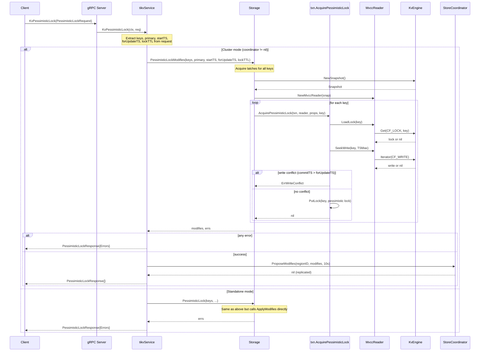
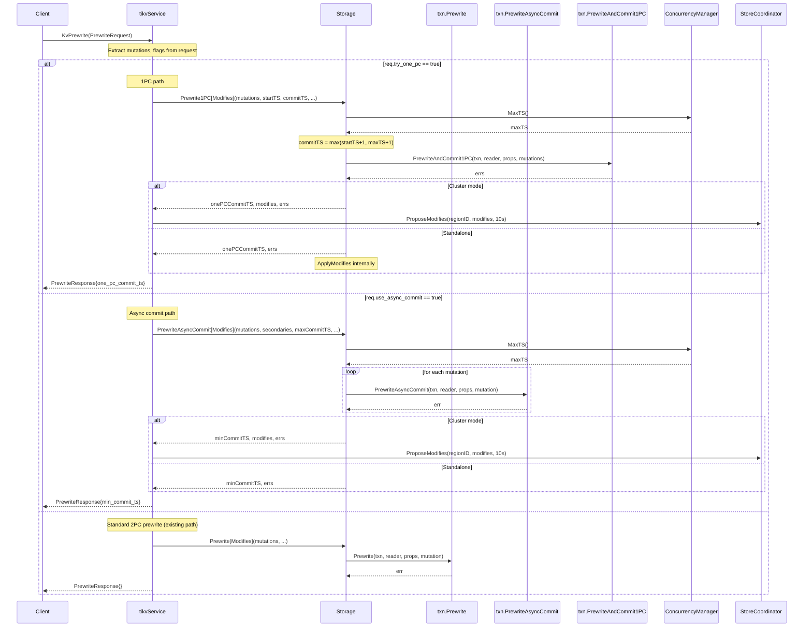
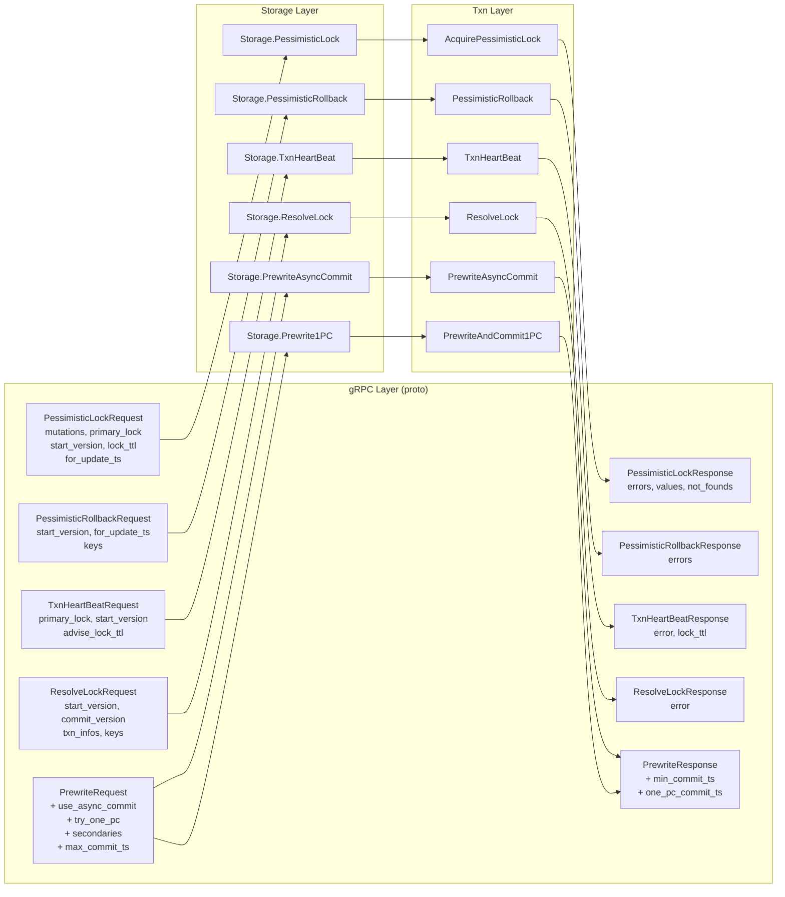

# 07 RPC Wiring: Pessimistic Lock, ResolveLock, TxnHeartBeat, Async Commit / 1PC Endpoints

## 1. Overview

This document specifies the gRPC endpoint wiring for four categories of transaction operations that have existing internal implementations but lack gRPC-level exposure:

1. **Pessimistic Lock endpoints** -- `KvPessimisticLock`, `KVPessimisticRollback`
2. **Lock resolution** -- `KvResolveLock`
3. **Lock TTL extension** -- `KvTxnHeartBeat`
4. **KvPrewrite enhancement** -- route to `PrewriteAsyncCommit` or `PrewriteAndCommit1PC` based on request flags

### Current State

| Feature | Transaction Layer | gRPC Endpoint |
|---|---|---|
| `AcquirePessimisticLock` | `internal/storage/txn/pessimistic.go` | Stub (unimplemented) |
| `PrewritePessimistic` | `internal/storage/txn/pessimistic.go` | Not wired |
| `PessimisticRollback` | `internal/storage/txn/pessimistic.go` | Stub (unimplemented) |
| `PrewriteAsyncCommit` | `internal/storage/txn/async_commit.go` | Not wired (KvPrewrite always uses standard path) |
| `PrewriteAndCommit1PC` | `internal/storage/txn/async_commit.go` | Not wired (KvPrewrite always uses standard path) |
| `CheckAsyncCommitStatus` | `internal/storage/txn/async_commit.go` | Not wired |
| ResolveLock | Not implemented | Stub (unimplemented) |
| TxnHeartBeat | Not implemented | Stub (unimplemented) |

### Scope

This design covers:
- Four new gRPC handler implementations in `internal/server/server.go`
- Four new `Storage` methods in `internal/server/storage.go`
- Two new transaction-layer functions (`ResolveLock`, `TxnHeartBeat`) in `internal/storage/txn/actions.go`
- Modified `KvPrewrite` handler and `Storage.Prewrite`/`Storage.PrewriteModifies` to support async commit and 1PC flags
- New `BatchCommands` sub-command routing for all new endpoints
- Dual-mode (standalone / cluster via Raft) support for all write operations

---

## 2. TiKV Reference

### 2.1 Request Routing in TiKV

In TiKV (`src/server/service/kv.rs`), all four endpoints use the `txn_command_future!` macro, which converts a gRPC request into a `TypedCommand`, schedules it through `Storage::sched_txn_command()`, acquires latches, executes the command, and returns the result:

```
kv_pessimistic_lock    -> future_acquire_pessimistic_lock -> AcquirePessimisticLock command
kv_pessimistic_rollback -> future_pessimistic_rollback    -> PessimisticRollback command
kv_resolve_lock        -> future_resolve_lock             -> ResolveLock command
kv_txn_heart_beat      -> future_txn_heart_beat           -> TxnHeartBeat command
kv_prewrite            -> future_prewrite                 -> Prewrite command (handles async commit / 1PC internally)
```

### 2.2 TiKV Prewrite with Async Commit / 1PC

TiKV's `PrewriteRequest` carries `use_async_commit` (bool), `try_one_pc` (bool), `secondaries` (repeated bytes), and `max_commit_ts` (uint64). The `Prewrite` command internally dispatches to the appropriate prewrite variant. The response carries `min_commit_ts` and `one_pc_commit_ts` to signal which optimization was applied.

### 2.3 TiKV ResolveLock

`ResolveLockRequest` carries either:
- `start_version` + `commit_version`: resolve a single transaction's locks (commit if `commit_version > 0`, rollback if `commit_version == 0`)
- `txn_infos`: batch resolve multiple transactions in one call
- `keys`: optionally limit resolution to specific keys

The command scans for all locks belonging to the transaction and commits or rolls them back.

### 2.4 TiKV TxnHeartBeat

`TxnHeartBeatRequest` carries `primary_lock`, `start_version`, and `advise_lock_ttl`. The command loads the lock on the primary key and updates its TTL if the advised TTL is larger. Returns the current TTL in the response.

---

## 3. Proposed Go Design

### 3.1 Proto Message Summary

From `proto/kvrpcpb.proto`:

| Message | Key Fields |
|---|---|
| `PessimisticLockRequest` | `mutations`, `primary_lock`, `start_version`, `lock_ttl`, `for_update_ts`, `wait_timeout` |
| `PessimisticLockResponse` | `region_error`, `errors`, `values`, `not_founds` |
| `PessimisticRollbackRequest` | `start_version`, `for_update_ts`, `keys` |
| `PessimisticRollbackResponse` | `region_error`, `errors` |
| `TxnHeartBeatRequest` | `primary_lock`, `start_version`, `advise_lock_ttl` |
| `TxnHeartBeatResponse` | `region_error`, `error`, `lock_ttl` |
| `ResolveLockRequest` | `start_version`, `commit_version`, `txn_infos`, `keys` |
| `ResolveLockResponse` | `region_error`, `error` |
| `PrewriteRequest` (existing) | `use_async_commit`, `try_one_pc`, `secondaries`, `max_commit_ts` |
| `PrewriteResponse` (existing) | `min_commit_ts`, `one_pc_commit_ts` |

### 3.2 New Storage Methods

Added to `internal/server/storage.go`:

```go
// PessimisticLock acquires pessimistic locks on the given keys.
func (s *Storage) PessimisticLock(keys [][]byte, primary []byte, startTS, forUpdateTS txntypes.TimeStamp, lockTTL uint64) []error

// PessimisticLockModifies returns []mvcc.Modify for cluster mode.
func (s *Storage) PessimisticLockModifies(keys [][]byte, primary []byte, startTS, forUpdateTS txntypes.TimeStamp, lockTTL uint64) ([]mvcc.Modify, []error)

// PessimisticRollback removes pessimistic locks for the given keys.
func (s *Storage) PessimisticRollbackStorage(keys [][]byte, startTS, forUpdateTS txntypes.TimeStamp) []error

// PessimisticRollbackModifies returns []mvcc.Modify for cluster mode.
func (s *Storage) PessimisticRollbackModifies(keys [][]byte, startTS, forUpdateTS txntypes.TimeStamp) ([]mvcc.Modify, []error)

// TxnHeartBeat extends the TTL of a transaction's primary lock.
func (s *Storage) TxnHeartBeat(primaryKey []byte, startTS txntypes.TimeStamp, adviseLockTTL uint64) (uint64, error)

// TxnHeartBeatModifies returns the lock TTL and []mvcc.Modify for cluster mode.
func (s *Storage) TxnHeartBeatModifies(primaryKey []byte, startTS txntypes.TimeStamp, adviseLockTTL uint64) (uint64, []mvcc.Modify, error)

// ResolveLock resolves all locks for a transaction (commit or rollback).
func (s *Storage) ResolveLock(startTS, commitTS txntypes.TimeStamp, keys [][]byte) error

// ResolveLockModifies returns []mvcc.Modify for cluster mode.
func (s *Storage) ResolveLockModifies(startTS, commitTS txntypes.TimeStamp, keys [][]byte) ([]mvcc.Modify, error)

// PrewriteAsyncCommit performs prewrite with async commit support (standalone).
func (s *Storage) PrewriteAsyncCommit(mutations []txn.Mutation, primary []byte, startTS txntypes.TimeStamp, lockTTL uint64, secondaries [][]byte, maxCommitTS txntypes.TimeStamp) (txntypes.TimeStamp, []error)

// PrewriteAsyncCommitModifies (cluster mode variant).
func (s *Storage) PrewriteAsyncCommitModifies(mutations []txn.Mutation, primary []byte, startTS txntypes.TimeStamp, lockTTL uint64, secondaries [][]byte, maxCommitTS txntypes.TimeStamp) (txntypes.TimeStamp, []mvcc.Modify, []error)

// Prewrite1PC performs prewrite+commit in a single step (standalone).
func (s *Storage) Prewrite1PC(mutations []txn.Mutation, primary []byte, startTS, commitTS txntypes.TimeStamp, lockTTL uint64) (txntypes.TimeStamp, []error)

// Prewrite1PCModifies (cluster mode variant).
func (s *Storage) Prewrite1PCModifies(mutations []txn.Mutation, primary []byte, startTS, commitTS txntypes.TimeStamp, lockTTL uint64) (txntypes.TimeStamp, []mvcc.Modify, []error)
```

### 3.3 New Transaction Layer Functions

Added to `internal/storage/txn/actions.go`:

```go
// TxnHeartBeat updates the TTL of an existing lock.
// Returns the actual TTL set on the lock.
func TxnHeartBeat(txn *MvccTxn, reader *MvccReader, primaryKey Key, startTS TimeStamp, adviseTTL uint64) (uint64, error)

// ResolveLock resolves a single key's lock for a given transaction.
// If commitTS > 0, the lock is committed; if commitTS == 0, the lock is rolled back.
func ResolveLock(txn *MvccTxn, reader *MvccReader, key Key, startTS, commitTS TimeStamp) error
```

### 3.4 New gRPC Handlers

Added to `internal/server/server.go`:

```go
func (svc *tikvService) KvPessimisticLock(ctx context.Context, req *kvrpcpb.PessimisticLockRequest) (*kvrpcpb.PessimisticLockResponse, error)
func (svc *tikvService) KVPessimisticRollback(ctx context.Context, req *kvrpcpb.PessimisticRollbackRequest) (*kvrpcpb.PessimisticRollbackResponse, error)
func (svc *tikvService) KvTxnHeartBeat(ctx context.Context, req *kvrpcpb.TxnHeartBeatRequest) (*kvrpcpb.TxnHeartBeatResponse, error)
func (svc *tikvService) KvResolveLock(ctx context.Context, req *kvrpcpb.ResolveLockRequest) (*kvrpcpb.ResolveLockResponse, error)
```

Modified: `KvPrewrite` handler to check `use_async_commit` and `try_one_pc` flags.

### 3.5 BatchCommands Routing

The `handleBatchCmd` switch statement in `server.go` must add cases for:

```go
case *tikvpb.BatchCommandsRequest_Request_PessimisticLock:
case *tikvpb.BatchCommandsRequest_Request_PessimisticRollback:
case *tikvpb.BatchCommandsRequest_Request_TxnHeartBeat:
case *tikvpb.BatchCommandsRequest_Request_ResolveLock:
```

---

## 4. Processing Flows

### 4.1 Pessimistic Lock Acquisition Flow



### 4.2 Modified KvPrewrite Flow with Async Commit / 1PC



---

## 5. Data Structures

### 5.1 Request/Response Mapping



---

## 6. Error Handling

### 6.1 Error Mapping

All new endpoints use the existing `errToKeyError` function for consistent error conversion. Additional error cases:

| Condition | Error Type | Proto Field |
|---|---|---|
| Another txn holds lock | `ErrKeyIsLocked` | `KeyError.Locked` (with `LockInfo`) |
| Write conflict (commitTS > forUpdateTS) | `ErrWriteConflict` | `KeyError.Conflict` |
| Pessimistic lock not found during prewrite | `ErrTxnLockNotFound` | `KeyError.TxnLockNotFound` |
| Lock not found for heartbeat | `ErrTxnLockNotFound` | `KeyError.TxnLockNotFound` |
| Raft proposal failure | gRPC `Unavailable` | gRPC status error |
| Already committed transaction | `ErrAlreadyCommitted` | `KeyError.Abort` |

### 6.2 ResolveLock Error Semantics

`ResolveLock` is lenient: if a lock does not exist for a key, it is silently skipped (the lock may have already been resolved). Errors only occur for storage-level failures.

### 6.3 TxnHeartBeat Error Semantics

If the lock does not exist or belongs to a different transaction, `TxnHeartBeat` returns `ErrTxnLockNotFound`. The caller (typically a TiDB coordinator) will then check the transaction status.

---

## 7. Cluster Mode Considerations

All new write endpoints follow the existing dual-mode pattern established by `KvPrewrite` and `KvCommit`:

1. **Standalone mode** (`coordinator == nil`): The `Storage` method acquires latches, executes the transaction operation, and calls `ApplyModifies` directly.
2. **Cluster mode** (`coordinator != nil`): The `Storage.*Modifies` variant acquires latches, executes the transaction operation, and returns `[]mvcc.Modify`. The gRPC handler then calls `coordinator.ProposeModifies(regionID, modifies, 10s)` to replicate via Raft.

For `TxnHeartBeat`, the operation modifies a single lock in CF_LOCK, so it generates a single `Modify` (a Put to CF_LOCK with the updated TTL).

For `ResolveLock`, the operation may touch many keys. In cluster mode, all resulting modifies (unlock + write records) are batched into a single Raft proposal. If the key set is large, this should be bounded (e.g., max 256 keys per proposal) with the handler issuing multiple proposals if needed.

---

## 8. Testing Strategy

### 8.1 Unit Tests

File: `internal/storage/txn/actions_test.go` (extend existing)

| Test | Description |
|---|---|
| `TestTxnHeartBeat_ExtendTTL` | Lock exists, advise larger TTL, verify TTL updated |
| `TestTxnHeartBeat_SmallerTTL` | Lock exists, advise smaller TTL, verify TTL unchanged |
| `TestTxnHeartBeat_LockNotFound` | No lock exists, verify `ErrTxnLockNotFound` |
| `TestTxnHeartBeat_WrongStartTS` | Lock exists with different startTS, verify error |
| `TestResolveLock_Commit` | Lock exists, commitTS > 0, verify lock removed and write record created |
| `TestResolveLock_Rollback` | Lock exists, commitTS == 0, verify lock removed and rollback record created |
| `TestResolveLock_NoLock` | No lock exists, verify no error (idempotent) |
| `TestResolveLock_MultipleKeys` | Multiple keys with locks, verify all resolved |

### 8.2 Storage Layer Tests

File: `internal/server/storage_test.go` (extend existing)

| Test | Description |
|---|---|
| `TestStorage_PessimisticLock` | Acquire pessimistic lock, verify lock in engine |
| `TestStorage_PessimisticLock_Conflict` | Acquire lock, attempt from different txn, verify conflict |
| `TestStorage_PessimisticRollback` | Acquire then rollback, verify lock removed |
| `TestStorage_TxnHeartBeat` | Prewrite, heartbeat, verify TTL extended |
| `TestStorage_ResolveLock_Commit` | Prewrite keys, resolve with commitTS, verify committed |
| `TestStorage_ResolveLock_Rollback` | Prewrite keys, resolve with commitTS=0, verify rolled back |
| `TestStorage_PrewriteAsyncCommit` | Prewrite with async commit, verify lock fields |
| `TestStorage_Prewrite1PC` | Prewrite with 1PC, verify write records (no locks) |

### 8.3 gRPC Handler Tests

File: `internal/server/server_test.go` (extend existing)

| Test | Description |
|---|---|
| `TestKvPessimisticLock_RPC` | Full gRPC round-trip for pessimistic lock |
| `TestKvPessimisticRollback_RPC` | Full gRPC round-trip for pessimistic rollback |
| `TestKvTxnHeartBeat_RPC` | Full gRPC round-trip for heartbeat |
| `TestKvResolveLock_RPC` | Full gRPC round-trip for resolve lock |
| `TestKvPrewrite_AsyncCommit_RPC` | KvPrewrite with `use_async_commit=true`, verify `min_commit_ts` in response |
| `TestKvPrewrite_1PC_RPC` | KvPrewrite with `try_one_pc=true`, verify `one_pc_commit_ts` in response |
| `TestBatchCommands_PessimisticLock` | Verify new sub-commands work through BatchCommands |

### 8.4 Integration Tests

| Test | Description |
|---|---|
| `TestPessimisticTxn_E2E` | Full pessimistic txn lifecycle: lock -> prewrite -> commit |
| `TestAsyncCommit_E2E` | Async commit prewrite -> async resolution -> verify data visible |
| `Test1PC_E2E` | 1PC prewrite -> verify data immediately visible |
| `TestResolveLock_AfterCrash` | Simulate abandoned txn, resolve its locks, verify cleanup |

---

## 9. Implementation Steps

### Step 1: Transaction Layer Functions

- Add `TxnHeartBeat` function to `internal/storage/txn/actions.go`
- Add `ResolveLock` function to `internal/storage/txn/actions.go`
- Add unit tests for both functions

### Step 2: Storage Methods -- Pessimistic Operations

- Add `PessimisticLock` / `PessimisticLockModifies` to `internal/server/storage.go`
- Add `PessimisticRollbackStorage` / `PessimisticRollbackModifies` to `internal/server/storage.go`
- Follow the existing latch-acquire, snapshot, execute, apply/return pattern
- Add storage-level tests

### Step 3: Storage Methods -- ResolveLock and TxnHeartBeat

- Add `ResolveLock` / `ResolveLockModifies` to `internal/server/storage.go`
- Add `TxnHeartBeat` / `TxnHeartBeatModifies` to `internal/server/storage.go`
- For `ResolveLock`: scan CF_LOCK for locks matching `startTS`, then commit or rollback each
- Add storage-level tests

### Step 4: Storage Methods -- Async Commit and 1PC Prewrite

- Add `PrewriteAsyncCommit` / `PrewriteAsyncCommitModifies` to `internal/server/storage.go`
- Add `Prewrite1PC` / `Prewrite1PCModifies` to `internal/server/storage.go`
- Wire `concMgr.MaxTS()` for `MinCommitTS` and `CommitTS` calculation
- Add storage-level tests

### Step 5: gRPC Handlers

- Implement `KvPessimisticLock`, `KVPessimisticRollback`, `KvTxnHeartBeat`, `KvResolveLock` in `internal/server/server.go`
- Each handler follows the dual-mode pattern (standalone vs. cluster)
- Modify `KvPrewrite` to check `req.GetUseAsyncCommit()` and `req.GetTryOnePc()` flags
- Add response fields: `min_commit_ts`, `one_pc_commit_ts`
- Add gRPC-level tests

### Step 6: BatchCommands Routing

- Add four new cases to the `handleBatchCmd` switch in `internal/server/server.go`
- Add BatchCommands integration tests

### Step 7: End-to-End Tests

- Implement pessimistic transaction lifecycle test
- Implement async commit end-to-end test
- Implement 1PC end-to-end test
- Implement resolve lock after abandoned transaction test

---

## 10. Dependencies

### Internal Dependencies

| Component | Path | Dependency Type |
|---|---|---|
| `txn.AcquirePessimisticLock` | `internal/storage/txn/pessimistic.go` | Existing, used directly |
| `txn.PrewritePessimistic` | `internal/storage/txn/pessimistic.go` | Existing, used by modified KvPrewrite |
| `txn.PessimisticRollback` | `internal/storage/txn/pessimistic.go` | Existing, used directly |
| `txn.PrewriteAsyncCommit` | `internal/storage/txn/async_commit.go` | Existing, used by modified KvPrewrite |
| `txn.PrewriteAndCommit1PC` | `internal/storage/txn/async_commit.go` | Existing, used by modified KvPrewrite |
| `txn.CheckAsyncCommitStatus` | `internal/storage/txn/async_commit.go` | Existing, potentially used by ResolveLock |
| `txn.Commit` | `internal/storage/txn/actions.go` | Existing, used by ResolveLock |
| `txn.Rollback` | `internal/storage/txn/actions.go` | Existing, used by ResolveLock |
| `concurrency.Manager` | `internal/storage/txn/concurrency/manager.go` | Existing, MaxTS() for async commit / 1PC |
| `latch.Latches` | `internal/storage/txn/latch/latch.go` | Existing, latch acquisition |
| `mvcc.MvccReader` | `internal/storage/mvcc/reader.go` | Existing, lock and write reads |
| `mvcc.MvccTxn` | `internal/storage/mvcc/txn.go` | Existing, modification accumulation |
| `StoreCoordinator` | `internal/server/coordinator.go` | Existing, Raft proposal for cluster mode |

### External Dependencies

| Dependency | Purpose |
|---|---|
| `github.com/pingcap/kvproto/pkg/kvrpcpb` | Proto message types for requests/responses |
| `github.com/pingcap/kvproto/pkg/tikvpb` | gRPC service interface and BatchCommands types |

### Proto Fields Required

The following proto fields must be accessible via generated Go code (already present in kvproto):

- `PrewriteRequest.GetUseAsyncCommit() bool`
- `PrewriteRequest.GetTryOnePc() bool`
- `PrewriteRequest.GetSecondaries() [][]byte`
- `PrewriteRequest.GetMaxCommitTs() uint64`
- `PrewriteResponse.MinCommitTs` (settable)
- `PrewriteResponse.OnePcCommitTs` (settable)
- `PessimisticLockRequest.GetForUpdateTs() uint64`
- `PessimisticLockRequest.GetWaitTimeout() int64`
- `TxnHeartBeatRequest.GetAdviseLockTtl() uint64`
- `ResolveLockRequest.GetCommitVersion() uint64`
- `ResolveLockRequest.GetTxnInfos() []*TxnInfo`
