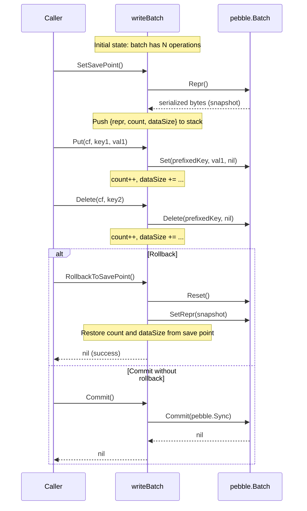
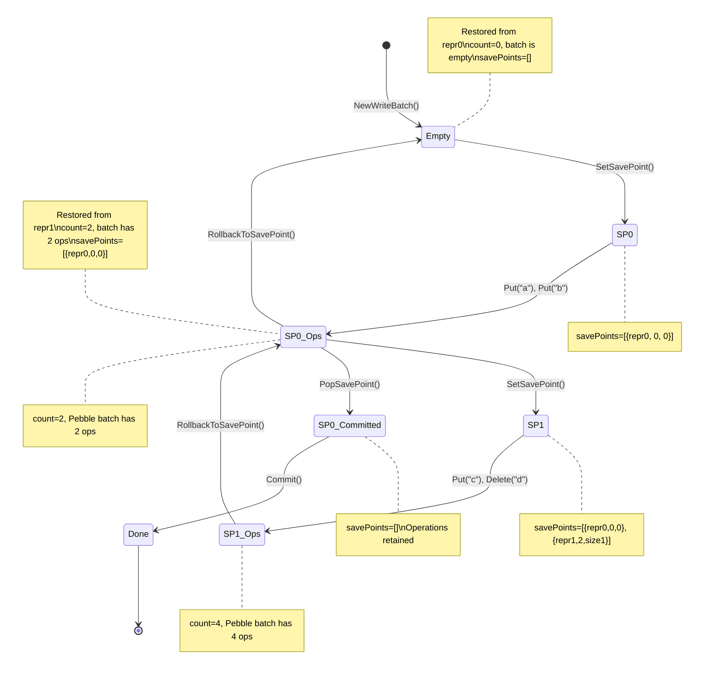

# WriteBatch.RollbackToSavePoint Workaround

## 1. Problem Statement

The `WriteBatch.RollbackToSavePoint()` method in `internal/engine/rocks/engine.go` (lines 363-375) is a non-functional stub. It pops the save point from the stack but does not actually undo any operations added since the save point was set. The source comment states: "Pebble batches don't support save points natively."

This matters because TiKV's raftstore-v2 uses save points as a safety mechanism during Raft log apply: before applying each entry, a save point is set on the write batch; if apply fails, the write batch is rolled back to discard the partial writes from the failed entry. Without a working rollback, a failed apply would leave corrupted partial mutations in the batch, which would then be committed along with subsequent successful entries.

### Current Implementation

```go
func (wb *writeBatch) RollbackToSavePoint() error {
    wb.mu.Lock()
    defer wb.mu.Unlock()
    if len(wb.savePoints) == 0 {
        return fmt.Errorf("rocks: no save point set")
    }
    // Pebble batches don't support save points natively.
    wb.savePoints = wb.savePoints[:len(wb.savePoints)-1]
    return nil
}
```

### TiKV Reference Behavior

In TiKV, RocksDB's `WriteBatch` has native `SetSavePoint()` / `RollbackToSavePoint()` methods that track the serialized batch buffer position and truncate back to it on rollback. The `engine_traits` trait requires all engine implementations to support this:

- **RocksDB engine** (`engine_rocks/src/write_batch.rs`): Delegates directly to the RocksDB C API `set_save_point()` / `rollback_to_save_point()`, which truncates the internal serialized command buffer.
- **In-memory engine** (`in_memory_engine/src/write_batch.rs`): Records `self.buffer.len()` at save point time, then calls `self.buffer.truncate(sp)` on rollback -- a pure Rust-level operation on a `Vec<WriteBatchEntry>`.
- **Raftstore-v2 usage** (`raftstore-v2/src/operation/command/mod.rs`, lines 617-627): Sets a save point before each Raft entry apply, rolls back on apply error to discard partial writes.

## 2. Design Options Analysis

### Option A: Operation Replay Buffer

Record all operations in a parallel log. On rollback, discard operations added since the save point and replay the retained ones into a fresh `pebble.Batch`.

- **Pros**: Conceptually simple; exact semantic match with TiKV.
- **Cons**: Doubles memory usage (operations stored both in Pebble batch and replay buffer). Replay is O(n) in total batch size on rollback. High GC pressure from rebuilding the batch.

### Option B: Nested Batch (Child Batch at Save Point)

When `SetSavePoint()` is called, stash the current `pebble.Batch` and start a new one. On `Commit`, merge child into parent. On rollback, discard the child batch.

- **Pros**: Clean isolation between save point levels; rollback is O(1) (just discard the child).
- **Cons**: Pebble's `Batch` does not support merging two batches together. Would require manual iteration over the child batch's internal representation, which is fragile. Multiple nesting levels create a stack of batches with complex commit ordering.

### Option C: Copy-on-SavePoint (Chosen Approach)

When `SetSavePoint()` is called, snapshot the Pebble batch's internal state by copying its serialized representation. On rollback, restore from the snapshot.

- **Pros**: Semantically exact rollback. Rollback is O(s) where s = snapshot size (memcpy). No need to track individual operations. Works with arbitrary nesting. Pebble's `Batch` supports `Reset()` followed by replaying from a byte buffer via `SetRepr()` and `Repr()`.
- **Cons**: Memory cost proportional to batch size at each save point. For very large batches with many save points, memory usage could be high.

### Decision: Option C -- Copy-on-SavePoint

This approach is chosen because:

1. **Pebble API support**: `pebble.Batch` exposes `Repr() []byte` (serialize batch to bytes) and has a constructor `SetRepr(data []byte)` (set batch from serialized bytes). This gives us a clean snapshot/restore mechanism.
2. **Semantic correctness**: Restoring from a byte snapshot produces an identical batch state, matching TiKV's behavior exactly.
3. **Simplicity**: The implementation is straightforward -- no need to track individual operations or manage nested batch hierarchies.
4. **Performance**: In practice, save points are used sparingly (once per Raft entry apply). The typical batch size at save point time is small (a few KB), making the copy cost negligible.

## 3. Detailed Design

### 3.1 Data Structure Changes

The `writeBatch` struct gains a `snapshots` field that stores the serialized batch state at each save point:

```go
type writeBatch struct {
    batch      *pebble.Batch
    count      int
    dataSize   int
    savePoints []savePointState  // changed from []int
    mu         sync.Mutex
}

type savePointState struct {
    repr     []byte  // serialized batch state via Batch.Repr()
    count    int     // operation count at save point
    dataSize int     // data size at save point
}
```

### 3.2 Method Implementations

#### SetSavePoint

```go
func (wb *writeBatch) SetSavePoint() {
    wb.mu.Lock()
    defer wb.mu.Unlock()
    repr := wb.batch.Repr()
    snapshot := make([]byte, len(repr))
    copy(snapshot, repr)
    wb.savePoints = append(wb.savePoints, savePointState{
        repr:     snapshot,
        count:    wb.count,
        dataSize: wb.dataSize,
    })
}
```

#### RollbackToSavePoint

```go
func (wb *writeBatch) RollbackToSavePoint() error {
    wb.mu.Lock()
    defer wb.mu.Unlock()
    if len(wb.savePoints) == 0 {
        return fmt.Errorf("rocks: no save point set")
    }
    sp := wb.savePoints[len(wb.savePoints)-1]
    wb.savePoints = wb.savePoints[:len(wb.savePoints)-1]

    // Restore batch state from snapshot.
    wb.batch.Reset()
    if err := wb.batch.SetRepr(sp.repr); err != nil {
        return fmt.Errorf("rocks: restore save point: %w", err)
    }
    wb.count = sp.count
    wb.dataSize = sp.dataSize
    return nil
}
```

#### PopSavePoint (New Method)

TiKV's `WriteBatch` trait also includes `pop_save_point()` which removes the save point without rolling back. This should be added to the interface:

```go
func (wb *writeBatch) PopSavePoint() error {
    wb.mu.Lock()
    defer wb.mu.Unlock()
    if len(wb.savePoints) == 0 {
        return fmt.Errorf("rocks: no save point set")
    }
    wb.savePoints = wb.savePoints[:len(wb.savePoints)-1]
    return nil
}
```

#### Clear

The existing `Clear()` method already resets `savePoints` to nil, which is correct -- clearing the batch should also discard all save points.

### 3.3 Interface Changes

The `traits.WriteBatch` interface should add `PopSavePoint()`:

```go
type WriteBatch interface {
    // ... existing methods ...
    SetSavePoint()
    PopSavePoint() error              // NEW
    RollbackToSavePoint() error
    Commit() error
}
```

### 3.4 Pebble API Verification

The design relies on two `pebble.Batch` methods:

- **`Repr() []byte`**: Returns the serialized representation of the batch. Available in Pebble v1.1.x. The returned byte slice is a copy of the internal batch data.
- **`SetRepr(data []byte) error`**: Sets the batch contents from a serialized representation. The batch must be empty (call `Reset()` first). Available in Pebble v1.1.x.

If `SetRepr` is not available in pebble v1.1.5, the fallback approach is to create a new `pebble.Batch` from the serialized data using `db.NewBatchWithRepr(repr)` or by applying the batch reader. This needs verification during implementation.

**Fallback if neither Repr/SetRepr are available**: Use the operation log approach (Option A) with a `[]batchOp` slice where each `batchOp` records the operation type, CF, key, and value. This is less efficient but does not depend on Pebble internals.

## 4. Processing Flow

### 4.1 Save Point and Rollback Sequence



### 4.2 Nested Save Points



## 5. Raftstore Integration Context

The primary consumer of save points in gookvs will be the raftstore apply loop. The pattern mirrors TiKV's raftstore-v2:

```
for each raft entry in committed_entries:
    wb.SetSavePoint()
    result, err := applyEntry(wb, entry)
    if err != nil:
        wb.RollbackToSavePoint()   // discard partial writes from failed entry
        respondWithError(err)
        continue
    wb.PopSavePoint()              // accept the writes
    respondWithResult(result)
wb.Commit()                        // atomically apply all accepted entries
```

This ensures that a single failed entry does not corrupt the write batch for subsequent entries.

## 6. Performance Considerations

| Aspect | Impact | Mitigation |
|--------|--------|------------|
| Memory overhead at SetSavePoint | O(batch_size) copy | Batch size is typically small at save point time (beginning of entry apply) |
| Rollback cost | O(snapshot_size) memcpy + batch reset | Rollback is the error path, not the hot path |
| PopSavePoint cost | O(1) slice truncation | Free the snapshot bytes for GC |
| Multiple nested save points | Linear stack growth | In practice, nesting depth is 1-2 levels |
| GC pressure from snapshot copies | One allocation per SetSavePoint | Consider sync.Pool for snapshot buffers if profiling shows pressure |

### Memory Usage Estimate

For a typical Raft entry apply:
- Batch at save point time: 0-10 KB (prior committed entries in the same batch)
- Save point snapshot: same 0-10 KB
- Maximum nesting depth: 1 (one save point per entry)
- Total overhead: negligible compared to Raft log entries in memory

## 7. Testing Strategy

Port the following TiKV `engine_traits_tests::write_batch` test cases to Go:

| TiKV Test | Behavior Verified |
|-----------|-------------------|
| `save_point_rollback_none` | Error when no save point exists |
| `save_point_rollback_one` | Single save point rollback discards all ops |
| `save_point_rollback_two` | Two nested save points both roll back correctly |
| `save_point_rollback_partial` | Rollback only discards ops after save point, preserves earlier ops |
| `save_point_pop_rollback` | Pop then rollback pops two levels, rolls back to first |
| `save_point_rollback_after_write` | Rollback after Commit clears the batch (batch is reusable) |
| `save_point_same_rollback_one` | Multiple save points at same position, one rollback |
| `save_point_same_rollback_all` | Multiple save points at same position, all rolled back |
| `save_point_all_commands` | Put, Delete, DeleteRange all rolled back correctly |
| `save_points_and_counts` | Count() and DataSize() reflect rollback/pop state |

Additional Go-specific tests:

| Test | Behavior Verified |
|------|-------------------|
| `TestSavePointConcurrency` | Thread-safe SetSavePoint/Rollback under concurrent access |
| `TestSavePointWithCFPrefix` | Rollback correctly restores CF-prefixed keys |
| `TestRollbackThenCommit` | After rollback, remaining ops commit correctly |

## 8. Files to Modify

| File | Change |
|------|--------|
| `internal/engine/traits/traits.go` | Add `PopSavePoint() error` to `WriteBatch` interface |
| `internal/engine/rocks/engine.go` | Replace `savePoints []int` with `[]savePointState`; implement `SetSavePoint()`, `RollbackToSavePoint()`, `PopSavePoint()` with copy-on-savepoint logic |
| `internal/engine/rocks/engine_test.go` | Add comprehensive save point test cases ported from TiKV |

## 9. Risks and Mitigations

| Risk | Likelihood | Impact | Mitigation |
|------|-----------|--------|------------|
| `Repr()`/`SetRepr()` not available in pebble v1.1.5 | Medium | Blocks chosen approach | Fall back to operation log (Option A); verify API before implementation |
| Batch state corruption on SetRepr with non-empty batch | Low | Data corruption | Always call `Reset()` before `SetRepr()`; add defensive checks |
| Performance regression from snapshot copies on hot path | Low | Throughput reduction | Benchmark before/after; typical batch sizes are small |
| Interface change breaks callers | Low | Compilation errors | `PopSavePoint()` is additive; existing callers don't use it yet |
