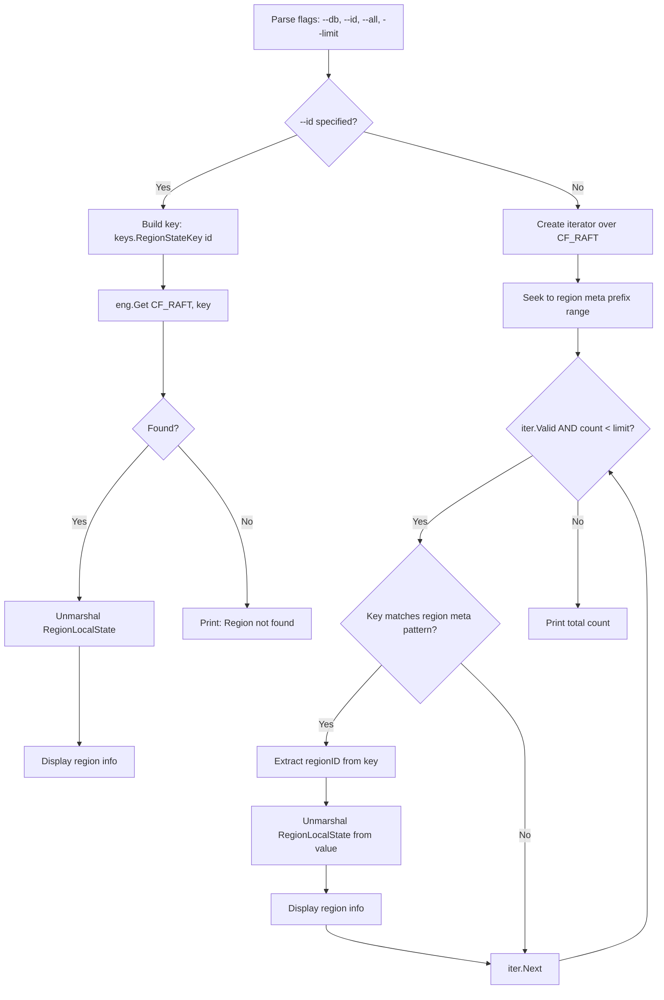
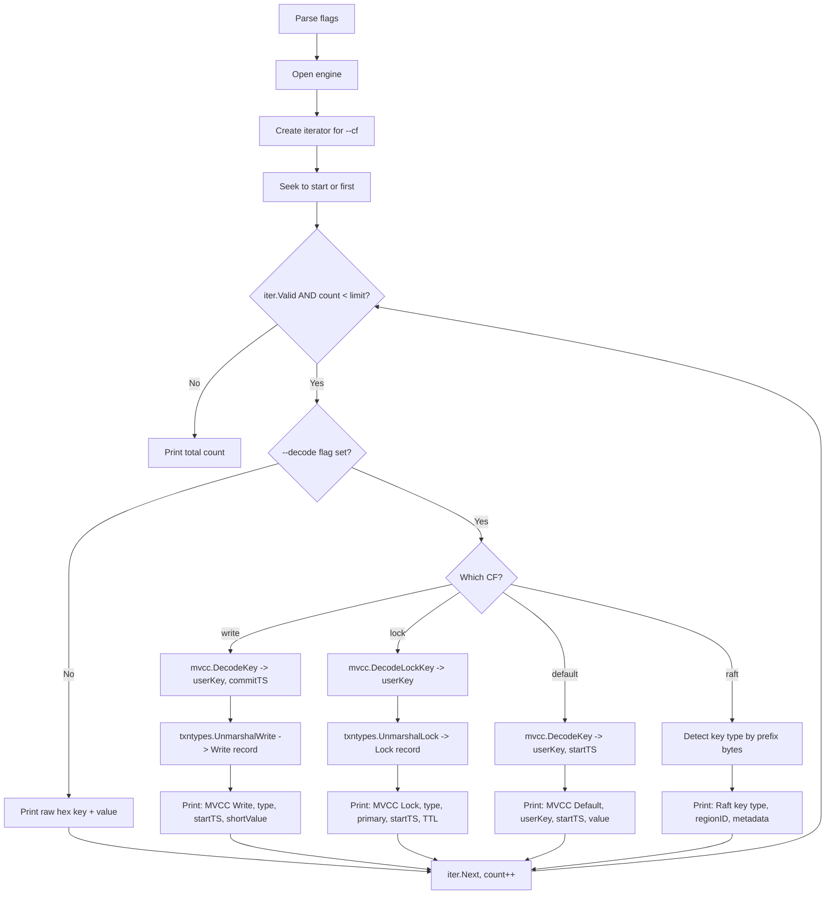
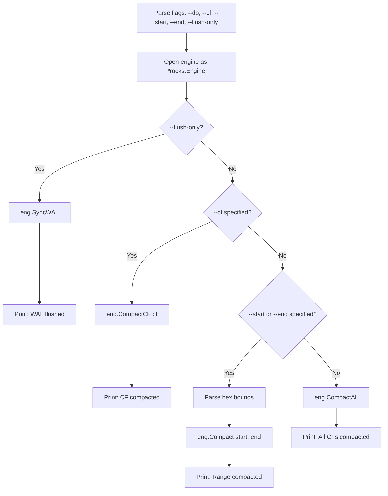
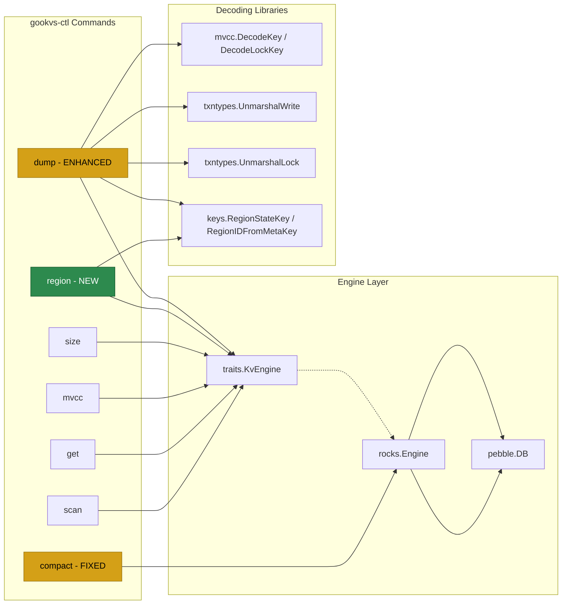

# CLI Improvements: region, dump, compact

## 1. Overview

This document covers three improvements to the `gookvs-ctl` admin CLI (`cmd/gookvs-ctl/main.go`):

1. **`region` command**: Implement the currently-listed-but-missing region metadata inspection command.
2. **`dump` command enhancement**: Add MVCC key decoding and Write/Lock record parsing to the existing raw hex dump.
3. **`compact` command fix**: Replace the misleading `SyncWAL()` call with actual Pebble LSM-tree compaction.

### Current State Summary

| Command | Current Status | Problem |
|---------|---------------|---------|
| `region` | Listed in usage string but no handler; falls through to "Unknown command" | Not implemented at all |
| `dump` | Raw hex iteration only (`hex(key)\thex(value)`) | No MVCC key decoding, no Write/Lock parsing, no structured output |
| `compact` | Calls `eng.SyncWAL()` which maps to `pebble.DB.Flush()` | Only flushes WAL/memtable; not actual LSM compaction. Misleading success message |

## 2. Feature 1: `region` Command

### 2.1 Purpose

Inspect region metadata stored in the `raft` column family. This allows operators to see which regions exist, their key ranges, peer lists, and state (Normal, Tombstone, etc.).

### 2.2 Key Encoding for Region Metadata

Region metadata is stored in `CF_RAFT` using keys constructed by `pkg/keys.RegionStateKey()`:

```
Format: [LocalPrefix=0x01][RegionMetaPrefix=0x03][regionID: 8B BigEndian][RegionStateSuffix=0x01]
```

The value is a protobuf-encoded `RegionLocalState` message containing:
- `state`: PeerState (Normal, Applying, Tombstone, Merging)
- `region`: Region metadata (id, start_key, end_key, peers, region_epoch)

### 2.3 Command Design

```
Usage:
  gookvs-ctl region [options]

Flags:
  --db <path>      Path to data directory (required)
  --id <uint64>    Show specific region by ID
  --all            List all regions (default behavior if --id not given)
  --limit <int>    Maximum regions to display (default: 100)
```

#### Output Format (--all mode)

```
Region ID: 1
  State:     Normal
  StartKey:  (empty)
  EndKey:    (empty)
  Peers:     [{id:1 store_id:1}, {id:2 store_id:2}, {id:3 store_id:3}]
  Epoch:     conf_ver:1 version:1
---
Region ID: 2
  State:     Normal
  StartKey:  7480000000000000ff0100000000000000f8
  EndKey:    7480000000000000ff0200000000000000f8
  Peers:     [{id:4 store_id:1}, {id:5 store_id:2}]
  Epoch:     conf_ver:1 version:2
---
Total: 2 regions
```

### 2.4 Implementation Approach

1. Open the engine at the given `--db` path.
2. If `--id` is specified, construct `keys.RegionStateKey(id)`, read from `CF_RAFT`, unmarshal as `RegionLocalState`, and display.
3. If `--all` (default), iterate over `CF_RAFT` scanning for keys matching the region meta prefix pattern `[0x01][0x03][...][0x01]`. For each key, extract the region ID via `keys.RegionIDFromMetaKey()`, unmarshal the value, and display.

### 2.5 Region Command Processing Flow



### 2.6 Key Detection Logic

To identify region state keys while iterating CF_RAFT, check:

```go
func isRegionStateKey(key []byte) bool {
    // RegionStateKey format: [0x01][0x03][8 bytes regionID][0x01]
    // Total length: 11 bytes
    return len(key) == 11 &&
        key[0] == keys.LocalPrefix &&
        key[1] == keys.RegionMetaPrefix &&
        key[10] == keys.RegionStateSuffix
}
```

## 3. Feature 2: Enhanced `dump` Command

### 3.1 Purpose

Transform the raw hex dump into a structured output that decodes MVCC keys, Write records, and Lock records. This makes the dump command useful for diagnosing transaction issues without requiring manual hex decoding.

### 3.2 Current vs. Proposed Output

**Current output** (raw hex):

```
7a7480000000000000ff0100000000000000f8010000000000000005	500a00760548656c6c6f
```

**Proposed output** (structured, with `--decode` flag):

```
[MVCC Write] UserKey: 7480000000000000ff01  CommitTS: 5
  WriteType: Put  StartTS: 10  ShortValue: "Hello"
---
[MVCC Lock] UserKey: 7480000000000000ff02
  LockType: Put  Primary: 7480...ff01  StartTS: 15  TTL: 3000
---
[MVCC Default] UserKey: 7480000000000000ff01  StartTS: 10
  Value: 48656c6c6f (5 bytes)
```

### 3.3 Command Design

```
Usage:
  gookvs-ctl dump [options]

Flags:
  --db <path>      Path to data directory (required)
  --cf <name>      Column family (default, lock, write, raft) (default: "default")
  --limit <int>    Maximum entries to dump (default: 50)
  --decode         Decode MVCC keys and record values (default: false)
  --start <hex>    Start key in hex (inclusive)
  --end <hex>      End key in hex (exclusive)
```

When `--decode` is not specified, the existing raw hex output is preserved for backward compatibility.

### 3.4 Decoding Logic by Column Family

#### CF_WRITE (`--cf write --decode`)

Keys are MVCC-encoded: `EncodeBytes(userKey) + EncodeUint64Desc(commitTS)`.

1. Decode key via `mvcc.DecodeKey(key)` to get `(userKey, commitTS)`.
2. Decode value via `txntypes.UnmarshalWrite(value)` to get Write record.
3. Display: write type, start TS, short value (if present), overlapped rollback flag, GC fence.

#### CF_LOCK (`--cf lock --decode`)

Keys are encoded user keys: `EncodeBytes(userKey)` (no timestamp).

1. Decode key via `mvcc.DecodeLockKey(key)` to get `userKey`.
2. Decode value via `txntypes.UnmarshalLock(value)` to get Lock record.
3. Display: lock type, primary key, start TS, TTL, for-update TS, min-commit TS, async commit, secondaries count.

#### CF_DEFAULT (`--cf default --decode`)

Keys are MVCC-encoded: `EncodeBytes(userKey) + EncodeUint64Desc(startTS)`.

1. Decode key via `mvcc.DecodeKey(key)` to get `(userKey, startTS)`.
2. Value is the raw user value (not a structured record).
3. Display: user key hex, start TS, value as printable or hex.

#### CF_RAFT (`--cf raft --decode`)

Keys use the local key format. Detect key type by prefix:

- `[0x01][0x02][regionID][0x01][logIndex]`: Raft log entry
- `[0x01][0x02][regionID][0x02]`: Raft hard state
- `[0x01][0x02][regionID][0x03]`: Apply state
- `[0x01][0x03][regionID][0x01]`: Region state

Display the key type and decoded region ID / log index.

### 3.5 Dump Decode Processing Flow



### 3.6 Error Handling for Decode

If decoding fails for any entry (corrupted data, unexpected format), the entry falls back to raw hex output with a `[DECODE ERROR]` prefix. This ensures the dump command never crashes on malformed data.

## 4. Feature 3: Actual Compaction

### 4.1 Problem

The current `compact` command calls `eng.SyncWAL()` which maps to `pebble.DB.Flush()`. This only flushes the memtable to L0 SST files -- it does not trigger LSM-tree compaction (merging L0 files into L1, L1 into L2, etc.). The success message "Compaction triggered successfully" is misleading.

### 4.2 Pebble Compact API

Pebble v1.1.x provides `db.Compact(start, end []byte, parallelize bool) error` which triggers a manual compaction over the specified key range. To compact the entire database, pass the full key range.

### 4.3 Command Design

```
Usage:
  gookvs-ctl compact [options]

Flags:
  --db <path>      Path to data directory (required)
  --cf <name>      Column family to compact (default: all CFs)
  --start <hex>    Start key in hex (inclusive); empty = beginning of CF
  --end <hex>      End key in hex (exclusive); empty = end of CF
  --flush-only     Only flush WAL/memtable (old behavior)
```

### 4.4 Implementation Approach

#### Exposing Compact on the Engine

Add a `Compact()` method to the `KvEngine` interface or, more pragmatically, expose it directly on the `rocks.Engine` type since this is an admin operation not needed by the storage layer:

```go
// In internal/engine/rocks/engine.go
func (e *Engine) Compact(start, end []byte) error {
    return e.db.Compact(start, end, true /* parallelize */)
}

// CompactCF compacts a specific column family's key range.
func (e *Engine) CompactCF(cf string) error {
    prefix, err := cfPrefix(cf)
    if err != nil {
        return err
    }
    start := []byte{prefix}
    end := cfUpperBound(prefix)
    return e.db.Compact(start, end, true)
}

// CompactAll compacts the entire database across all CFs.
func (e *Engine) CompactAll() error {
    return e.db.Compact(nil, nil, true)
}
```

#### Updated cmdCompact

```go
func cmdCompact(args []string) {
    fs := flag.NewFlagSet("compact", flag.ExitOnError)
    dbPath := fs.String("db", "", "Path to data directory")
    cf := fs.String("cf", "", "Column family (empty = all)")
    startKey := fs.String("start", "", "Start key (hex)")
    endKey := fs.String("end", "", "End key (hex)")
    flushOnly := fs.Bool("flush-only", false, "Only flush WAL/memtable")
    fs.Parse(args)

    if *dbPath == "" {
        fmt.Fprintln(os.Stderr, "Error: --db is required")
        os.Exit(1)
    }

    eng := openDBRocks(*dbPath)  // returns *rocks.Engine, not traits.KvEngine
    defer eng.Close()

    if *flushOnly {
        if err := eng.SyncWAL(); err != nil {
            fmt.Fprintf(os.Stderr, "Error flushing WAL: %v\n", err)
            os.Exit(1)
        }
        fmt.Println("WAL flushed successfully.")
        return
    }

    if *cf != "" {
        fmt.Printf("Compacting CF %s...\n", *cf)
        if err := eng.CompactCF(*cf); err != nil {
            fmt.Fprintf(os.Stderr, "Error compacting CF %s: %v\n", *cf, err)
            os.Exit(1)
        }
    } else if *startKey != "" || *endKey != "" {
        // Custom range compaction
        start, end := parseHexBounds(*startKey, *endKey)
        if err := eng.Compact(start, end); err != nil {
            fmt.Fprintf(os.Stderr, "Error compacting range: %v\n", err)
            os.Exit(1)
        }
    } else {
        fmt.Println("Compacting all column families...")
        if err := eng.CompactAll(); err != nil {
            fmt.Fprintf(os.Stderr, "Error compacting: %v\n", err)
            os.Exit(1)
        }
    }

    fmt.Println("Compaction completed successfully.")
}
```

### 4.5 Engine Method Access

The current `openDB()` returns `traits.KvEngine`, which does not include `Compact()`. Two approaches:

**Option A**: Add `Compact(start, end []byte) error` to the `KvEngine` interface. This changes the interface for all implementations.

**Option B** (chosen): Create a separate `openDBRocks()` helper that returns `*rocks.Engine` directly. The compact command is admin-only and does not need the abstraction.

```go
func openDBRocks(path string) *rocks.Engine {
    eng, err := rocks.Open(path)
    if err != nil {
        fmt.Fprintf(os.Stderr, "Error opening database at %s: %v\n", path, err)
        os.Exit(1)
    }
    return eng
}
```

### 4.6 Compact Command Processing Flow



## 5. Integration with Existing CLI Structure

### 5.1 Updated Command Dispatch

The `main()` switch statement and `RunCommand()` function both need the `region` case added:

```go
case "region":
    cmdRegion(args)
```

### 5.2 Updated Usage String

```go
const usage = `gookvs-ctl - Admin CLI for gookvs

Usage:
  gookvs-ctl <command> [options]

Commands:
  scan        Scan keys in a column family
  get         Get a single key
  mvcc        Show MVCC info for a key
  region      Inspect region metadata
  compact     Trigger manual compaction
  dump        Dump key-value pairs (with optional MVCC decoding)
  size        Show approximate data size

Global Options:
  --db <path>   Path to the data directory (required)
  --cf <name>   Column family (default, lock, write, raft)
`
```

## 6. CLI Command Relationship Diagram



## 7. Files to Modify

| File | Changes |
|------|---------|
| `cmd/gookvs-ctl/main.go` | Add `cmdRegion()` function; update `main()` and `RunCommand()` switch; enhance `cmdDump()` with `--decode` flag; rewrite `cmdCompact()` with real compaction; add `openDBRocks()` helper |
| `internal/engine/rocks/engine.go` | Add `Compact()`, `CompactCF()`, `CompactAll()` methods on `Engine` |
| `pkg/keys/keys.go` | No changes needed (key construction/parsing functions already exist) |
| `internal/storage/mvcc/key.go` | No changes needed (DecodeKey, DecodeLockKey already exist) |
| `pkg/txntypes/write.go` | No changes needed (UnmarshalWrite already exists) |
| `pkg/txntypes/lock.go` | No changes needed (UnmarshalLock already exists) |

## 8. Testing Strategy

### 8.1 Region Command Tests

| Test | Description |
|------|-------------|
| `TestCmdRegionNotFound` | Query non-existent region ID returns "not found" |
| `TestCmdRegionSingle` | Store one region, retrieve by --id, verify output |
| `TestCmdRegionAll` | Store multiple regions, list all, verify count and ordering |
| `TestCmdRegionLimit` | Store 10 regions with --limit 3, verify only 3 displayed |
| `TestCmdRegionEmptyDB` | Empty database returns "Total: 0 regions" |

### 8.2 Dump Decode Tests

| Test | Description |
|------|-------------|
| `TestCmdDumpWriteCFDecode` | Write a Put record to CF_WRITE, dump with --decode, verify fields |
| `TestCmdDumpLockCFDecode` | Write a Lock record to CF_LOCK, dump with --decode, verify fields |
| `TestCmdDumpDefaultCFDecode` | Write MVCC value to CF_DEFAULT, dump with --decode, verify key/ts |
| `TestCmdDumpRaftCFDecode` | Write region state to CF_RAFT, dump with --decode, verify regionID |
| `TestCmdDumpRawFallback` | Without --decode flag, output is raw hex (backward compatible) |
| `TestCmdDumpDecodeError` | Corrupt value gracefully falls back to hex with error prefix |

### 8.3 Compact Command Tests

| Test | Description |
|------|-------------|
| `TestCmdCompactAll` | Insert data, compact all, verify no error and data still readable |
| `TestCmdCompactSingleCF` | Compact specific CF, verify no error |
| `TestCmdCompactFlushOnly` | --flush-only flag triggers SyncWAL, not Compact |
| `TestCmdCompactEmptyDB` | Compact empty database succeeds without error |

## 9. Risks and Mitigations

| Risk | Likelihood | Impact | Mitigation |
|------|-----------|--------|------------|
| `pebble.DB.Compact()` not available in v1.1.5 | Low | Blocks compact fix | Pebble v1.1.x includes `Compact()`; verify in go doc. Fallback: `db.Flush()` + document limitation |
| RegionLocalState protobuf not importable | Medium | Blocks region command | The protobuf type is in `kvproto` (already a dependency). Verify correct import path during implementation |
| Decode errors crash the dump command | Low | CLI unusable | All decode paths wrapped in error checks with fallback to raw hex output |
| Compact on large database blocks for extended time | Medium | Operator confusion | Print progress message; document that compaction may take minutes on large DBs |
| Breaking change to compact command behavior | Medium | Operator scripts break | Preserve old behavior behind `--flush-only` flag; change default to actual compaction |
