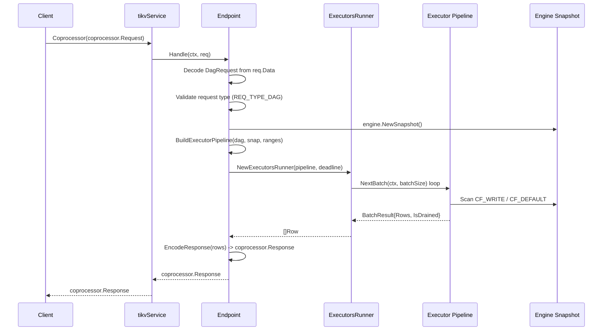
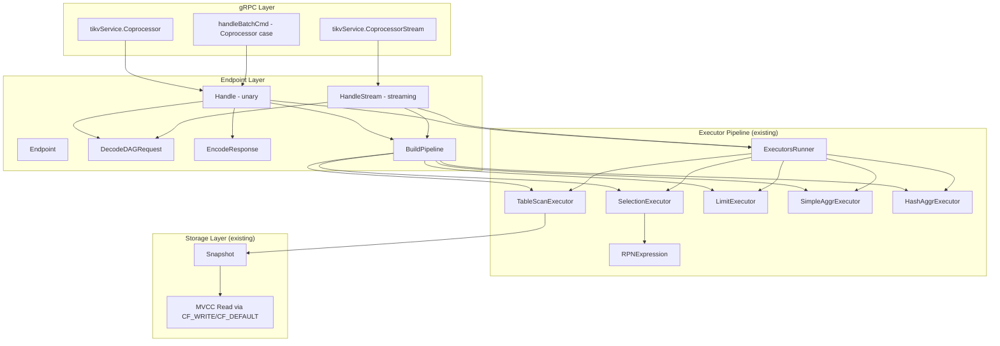

# Design: Coprocessor gRPC Integration

## 1. Overview

This document describes how to wire gookvs's existing local coprocessor executor pipeline (TableScan, Selection, Limit, Aggregation, RPN expressions, ExecutorsRunner) into the gRPC layer, exposing it as TiKV-compatible `Coprocessor` and `CoprocessorStream` RPCs.

### 1.1 Current State

The coprocessor package (`internal/coprocessor/coprocessor.go`) contains a fully functional local executor pipeline:

- **Executors**: `TableScanExecutor`, `SelectionExecutor`, `LimitExecutor`, `SimpleAggrExecutor`, `HashAggrExecutor`
- **Expression evaluation**: `RPNExpression` with stack-based evaluation, comparison/arithmetic/logic operators
- **Pipeline driver**: `ExecutorsRunner` with exponential batch growth (32 -> 1024)
- **Endpoint struct**: Defined with a `KvEngine` field but has no public methods

What is missing:

| Gap | Description |
|-----|-------------|
| No gRPC endpoint | `tikvService.Coprocessor()` does not exist; falls to `UnimplementedTikvServer` |
| No proto decoding | No code to parse `coprocessor.Request` / `DagRequest` protobuf into executor pipeline |
| No `Endpoint.Handle()` | The `Endpoint` struct has a constructor but no request handling method |
| No streaming support | `CoprocessorStream` RPC is not implemented |
| No response encoding | No code to serialize executor output back to `coprocessor.Response` |
| No BatchCommands routing | The `handleBatchCmd` switch does not have a `Coprocessor` case |

### 1.2 Target Protobuf Messages

From `proto/coprocessor.proto`:

- **`coprocessor.Request`**: `context`, `tp` (request type), `data` (serialized DagRequest), `start_ts`, `ranges[]`, `paging_size`, cache fields
- **`coprocessor.Response`**: `data` (serialized SelectResponse), `region_error`, `locked`, `other_error`, `range`, `exec_details`

The `data` field in `Request` carries a serialized `tipb.DAGRequest` (from the TiDB protobuf definitions), which contains `executors[]` and `output_offsets[]`.

## 2. Architecture

### 2.1 Request Flow



### 2.2 Component Diagram



## 3. Detailed Design

### 3.1 DAG Request Decoding

A new `DecodeDAGRequest` function parses the protobuf payload from `coprocessor.Request.Data`:

```go
// DAGRequest represents a decoded push-down query plan.
type DAGRequest struct {
    Executors     []ExecutorDesc
    OutputOffsets []uint32
    StartTS       txntypes.TimeStamp
    EncodeType    EncodeType
    PagingSize    uint64
}

// ExecutorDesc describes a single executor in the pipeline.
type ExecutorDesc struct {
    Type       ExecType
    TableScan  *TableScanDesc   // non-nil when Type == ExecTypeTableScan
    Selection  *SelectionDesc   // non-nil when Type == ExecTypeSelection
    Limit      *LimitDesc       // non-nil when Type == ExecTypeLimit
    Aggregation *AggregationDesc // non-nil when Type == ExecTypeAggregation
}
```

**Request type dispatch**: The `coprocessor.Request.tp` field determines the handler:

| Type Code | Handler | gookvs Support |
|-----------|---------|----------------|
| `REQ_TYPE_DAG` (103) | DAG executor pipeline | Phase 1 |
| `REQ_TYPE_ANALYZE` (104) | Statistics collection | Future |
| `REQ_TYPE_CHECKSUM` (105) | Data integrity | Future |

Phase 1 only implements `REQ_TYPE_DAG`. Other types return `ErrUnsupportedExecutor`.

### 3.2 Executor Pipeline Builder

`BuildPipeline` constructs the executor chain bottom-up from `DAGRequest.Executors`:

```go
func (ep *Endpoint) BuildPipeline(
    dag *DAGRequest,
    snap traits.Snapshot,
    ranges []KeyRange,
) (BatchExecutor, error) {
    if len(dag.Executors) == 0 {
        return nil, ErrUnsupportedExecutor
    }

    // First executor must be a scan (leaf).
    var exec BatchExecutor
    first := dag.Executors[0]
    switch first.Type {
    case ExecTypeTableScan:
        exec = NewTableScanExecutor(snap, ranges, dag.StartTS,
            first.TableScan.ColCount, first.TableScan.Desc)
    default:
        return nil, fmt.Errorf("%w: first executor must be TableScan", ErrUnsupportedExecutor)
    }

    // Wrap with subsequent executors.
    for _, desc := range dag.Executors[1:] {
        switch desc.Type {
        case ExecTypeSelection:
            predicates := decodeRPNPredicates(desc.Selection)
            exec = NewSelectionExecutor(exec, predicates)
        case ExecTypeLimit:
            exec = NewLimitExecutor(exec, int(desc.Limit.Limit))
        case ExecTypeAggregation:
            // Choose SimpleAggr vs HashAggr based on group-by columns.
            exec = buildAggregationExecutor(exec, desc.Aggregation)
        default:
            return nil, fmt.Errorf("%w: executor type %d", ErrUnsupportedExecutor, desc.Type)
        }
    }

    return exec, nil
}
```

**Validation**: Before building, `CheckSupported(dag)` validates all executor descriptors. Unsupported operators cause the request to be rejected so the client (TiDB) can fall back to local execution.

### 3.3 Endpoint.Handle() -- Unary Request

```go
func (ep *Endpoint) Handle(ctx context.Context, req *coprocessor.Request) (*coprocessor.Response, error) {
    resp := &coprocessor.Response{}

    // 1. Validate request type.
    if req.Tp != REQ_TYPE_DAG {
        resp.OtherError = "unsupported request type"
        return resp, nil
    }

    // 2. Decode DagRequest from req.Data.
    dag, err := DecodeDAGRequest(req.Data, txntypes.TimeStamp(req.StartTs))
    if err != nil {
        resp.OtherError = err.Error()
        return resp, nil
    }

    // 3. Convert proto key ranges.
    ranges := convertKeyRanges(req.Ranges)

    // 4. Acquire engine snapshot.
    snap := ep.engine.NewSnapshot()
    defer snap.Close()

    // 5. Build executor pipeline.
    pipeline, err := ep.BuildPipeline(dag, snap, ranges)
    if err != nil {
        resp.OtherError = err.Error()
        return resp, nil
    }

    // 6. Run pipeline with deadline.
    deadline := extractDeadline(ctx)
    runner := NewExecutorsRunner(pipeline, deadline)
    rows, err := runner.Run(ctx)
    if err != nil {
        resp.OtherError = err.Error()
        return resp, nil
    }

    // 7. Encode rows into response data.
    resp.Data = encodeSelectResponse(rows, dag.OutputOffsets)
    return resp, nil
}
```

### 3.4 Response Encoding

Executor output rows are encoded into a `tipb.SelectResponse` protobuf (serialized into `coprocessor.Response.Data`):

```go
func encodeSelectResponse(rows []Row, outputOffsets []uint32) []byte {
    // Build tipb.Chunk objects from rows, respecting outputOffsets.
    // Each Chunk contains encoded row data in TiDB's row format.
    // Multiple chunks may be used if the total data exceeds chunk size limits.
    ...
}
```

The encoding respects `DAGRequest.EncodeType`:
- **TypeDefault**: Row-by-row encoding with Datum serialization
- **TypeChunk**: Column-oriented chunk encoding (more efficient for large result sets)

Phase 1 implements TypeDefault only.

### 3.5 gRPC Handler Wiring

Add the `Coprocessor` method to `tikvService` in `internal/server/server.go`:

```go
func (svc *tikvService) Coprocessor(
    ctx context.Context,
    req *coprocessor.Request,
) (*coprocessor.Response, error) {
    ep := coprocessorPkg.NewEndpoint(svc.server.storage.Engine())
    return ep.Handle(ctx, req)
}
```

The `Endpoint` instance can be cached on the `Server` struct for reuse rather than created per-request.

Add the `Coprocessor` case to `handleBatchCmd`:

```go
case *tikvpb.BatchCommandsRequest_Request_Coprocessor:
    r, _ := svc.Coprocessor(ctx, cmd.Coprocessor)
    resp.Cmd = &tikvpb.BatchCommandsResponse_Response_Coprocessor{Coprocessor: r}
```

### 3.6 Streaming Support (CoprocessorStream)

The `CoprocessorStream` RPC uses server-side streaming to deliver results incrementally:

```go
func (svc *tikvService) CoprocessorStream(
    req *coprocessor.Request,
    stream tikvpb.Tikv_CoprocessorStreamServer,
) error {
    ep := coprocessorPkg.NewEndpoint(svc.server.storage.Engine())
    return ep.HandleStream(stream.Context(), req, func(resp *coprocessor.Response) error {
        return stream.Send(resp)
    })
}
```

The `HandleStream` method runs the executor pipeline but sends results in batches rather than accumulating all rows:

```go
func (ep *Endpoint) HandleStream(
    ctx context.Context,
    req *coprocessor.Request,
    sender func(*coprocessor.Response) error,
) error {
    // Same setup as Handle: decode, build pipeline.
    // Instead of runner.Run(), loop with NextBatch directly:
    batchSize := 32
    for {
        result, err := pipeline.NextBatch(ctx, batchSize)
        if err != nil { return err }

        if len(result.Rows) > 0 {
            resp := &coprocessor.Response{
                Data: encodeSelectResponse(result.Rows, dag.OutputOffsets),
            }
            if err := sender(resp); err != nil { return err }
        }

        if result.IsDrained { break }
        batchSize = min(batchSize*2, 1024)
    }
    return nil
}
```

### 3.7 Key Range to Region Mapping

In standalone mode, key ranges from the request are used directly. In cluster mode with Raft:

1. The client (TiDB) already routes the coprocessor request to the correct TiKV node based on region metadata from PD
2. The `coprocessor.Request.Context` contains `region_id` and `region_epoch`
3. The endpoint validates that the requested key ranges fall within the region's key range
4. If ranges span multiple regions, the client splits the request (not the server)

For gookvs Phase 1, region validation is deferred; all key ranges are served from the local engine.

## 4. Error Handling

| Error Condition | Response Field | Behavior |
|----------------|----------------|----------|
| Unsupported request type | `other_error` | Client falls back to local execution |
| Unsupported executor | `other_error` | Client falls back to local execution |
| Key locked by transaction | `locked` | Client resolves lock and retries |
| Region error (stale epoch) | `region_error` | Client refreshes region cache |
| Deadline exceeded | `other_error` | Client retries with fresh request |
| Expression eval error | `other_error` | Reported as query error |

## 5. Implementation Plan

### Phase 1: Core Unary RPC

1. Define `ExecType`, `DAGRequest`, `ExecutorDesc` types for proto decoding
2. Implement `DecodeDAGRequest()` to parse `tipb.DAGRequest` protobuf
3. Implement `Endpoint.BuildPipeline()` to construct executor chain from descriptors
4. Implement `encodeSelectResponse()` for TypeDefault encoding
5. Implement `Endpoint.Handle()` orchestrating decode -> build -> run -> encode
6. Wire `tikvService.Coprocessor()` in `server.go`
7. Add `Coprocessor` case to `handleBatchCmd`
8. Unit tests: end-to-end from proto request to proto response

### Phase 2: Streaming and Paging

1. Implement `Endpoint.HandleStream()` with incremental batch delivery
2. Wire `tikvService.CoprocessorStream()` in `server.go`
3. Support `paging_size` for resumable scans (return `range` in response for cursor)
4. Integration tests: large result set streaming

### Phase 3: Region-Aware Execution

1. Validate key ranges against region boundaries
2. Return `region_error` for stale epoch or wrong region
3. Lock checking via ConcurrencyManager before snapshot acquisition

## 6. Test Strategy

### Unit Tests

- `TestDecodeDAGRequest`: Verify protobuf -> DAGRequest parsing
- `TestBuildPipeline`: Verify executor chain construction from descriptors
- `TestEndpointHandle`: End-to-end unary request/response through the pipeline
- `TestEndpointHandleStream`: Verify streaming delivers incremental results
- `TestUnsupportedType`: Verify graceful rejection of non-DAG requests

### Integration Tests

- gRPC client -> `Coprocessor` RPC -> scan with filter -> verify results
- `CoprocessorStream` -> verify all batches received
- `BatchCommands` with embedded `Coprocessor` sub-request

## 7. Dependencies

| Dependency | Location | Status |
|------------|----------|--------|
| `coprocessor.proto` generated Go code | `proto/coprocessor.proto` | Available |
| `tipb.DAGRequest` protobuf | External `tipb` proto | Needs import or local definition |
| `BatchExecutor` interface | `internal/coprocessor/coprocessor.go` | Implemented |
| `ExecutorsRunner` | `internal/coprocessor/coprocessor.go` | Implemented |
| `traits.KvEngine` / `Snapshot` | `internal/engine/traits/traits.go` | Implemented |
| `tikvpb.TikvServer` interface | Generated from `proto/tikvpb.proto` | Available |

## 8. Considerations

### Performance

- **Snapshot reuse**: One snapshot per request, shared across all executor reads
- **Batch growth**: Exponential batch sizing (32 -> 1024) amortizes per-batch overhead
- **Streaming threshold**: For result sets > 10,000 rows, streaming is preferred to avoid memory pressure

### Simplifications vs TiKV

| TiKV Feature | gookvs Decision |
|-------------|-----------------|
| Column-oriented `LazyBatchColumnVec` | Row-oriented `[]Row` (simpler, adequate for initial scale) |
| `logical_rows` index filtering | Direct row copying in `SelectionExecutor` |
| Read pool (YATP) scheduling | Direct goroutine execution (Go scheduler handles concurrency) |
| Memory quota enforcement | Deferred to Phase 3 |
| Result caching (`cache_if_match_version`) | Not implemented initially |
| IndexScan executor | Not implemented initially (TableScan only) |
