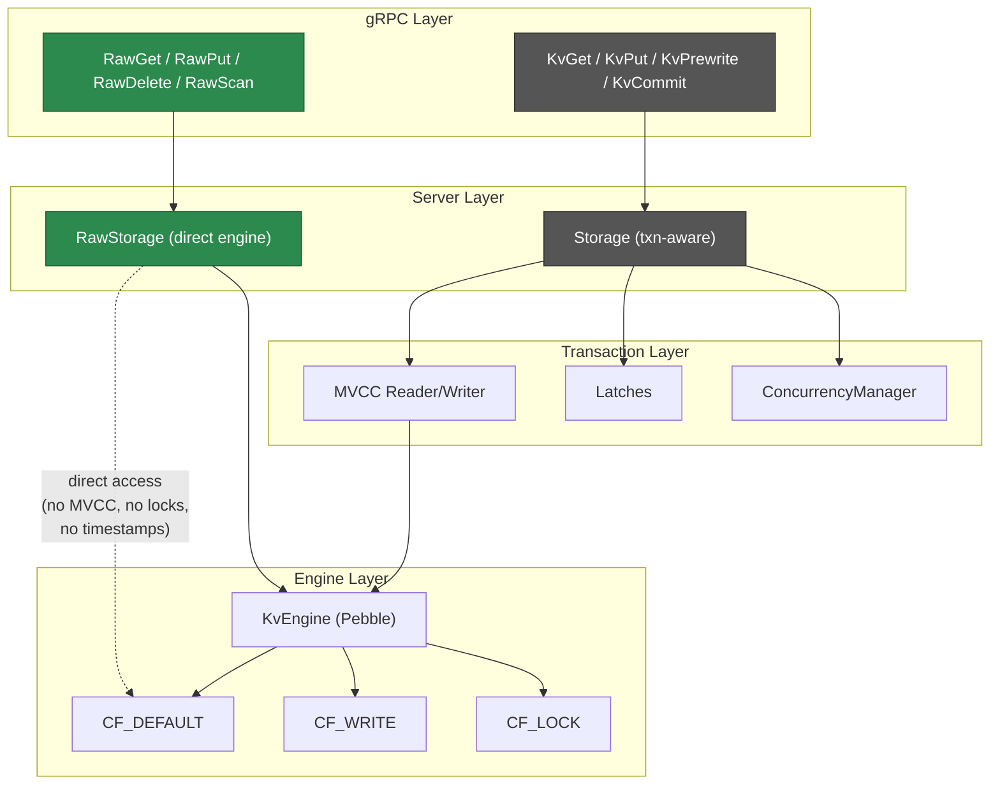
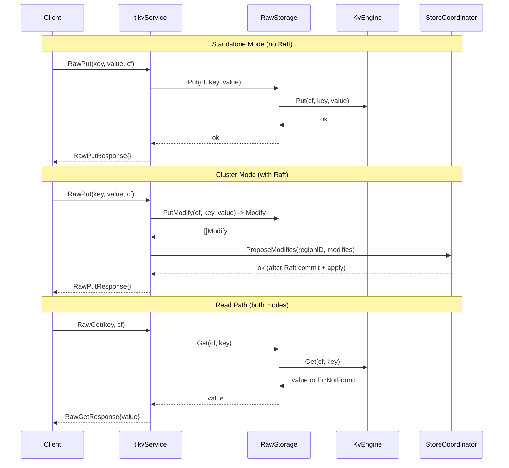

# Design: Raw KV API (RawGet/RawPut/RawDelete/RawScan)

## 1. Overview

This document describes the design for implementing the Raw KV API in gookvs. Raw KV operations bypass the MVCC/transaction layer entirely, providing direct key-value access to the underlying storage engine. This is the simplest storage interface TiKV exposes and is used by applications that do not need transactional guarantees.

### 1.1 Current State

From `impl_doc_0318/08_not_yet_implemented.md` section 3.17:

- The kvproto defines `RawGet`, `RawPut`, `RawDelete`, `RawScan`, `RawBatchGet`, `RawBatchPut`, `RawBatchDelete`, `RawDeleteRange`, and `RawBatchScan` RPCs
- None are implemented on `tikvService`; all fall through to `UnimplementedTikvServer`
- No raw KV path exists in `Storage`
- No function matching `RawGet|RawPut|RawDelete|RawScan` exists in any `.go` file

### 1.2 Target Protobuf Messages

From `proto/kvrpcpb.proto`:

| Message | Key Fields |
|---------|-----------|
| `RawGetRequest` | `context`, `key`, `cf` |
| `RawGetResponse` | `region_error`, `error`, `value`, `not_found` |
| `RawPutRequest` | `context`, `key`, `value`, `cf`, `ttl` |
| `RawPutResponse` | `region_error`, `error` |
| `RawDeleteRequest` | `context`, `key`, `cf` |
| `RawDeleteResponse` | `region_error`, `error` |
| `RawScanRequest` | `context`, `start_key`, `limit`, `key_only`, `cf`, `reverse`, `end_key` |
| `RawScanResponse` | `region_error`, `kvs[]` |
| `RawBatchGetRequest` | `context`, `keys[]`, `cf` |
| `RawBatchGetResponse` | `region_error`, `pairs[]` |
| `RawBatchPutRequest` | `context`, `pairs[]`, `cf`, `ttls[]` |
| `RawBatchPutResponse` | `region_error`, `error` |
| `RawBatchDeleteRequest` | `context`, `keys[]`, `cf` |
| `RawBatchDeleteResponse` | `region_error`, `error` |
| `RawDeleteRangeRequest` | `context`, `start_key`, `end_key`, `cf` |
| `RawDeleteRangeResponse` | `region_error`, `error` |

## 2. Architecture

### 2.1 Raw KV vs Transactional KV Data Path



The key architectural difference: Raw KV reads and writes go directly to the engine without touching MVCC keys, lock checking, or timestamp management. Raw keys are stored as-is in `CF_DEFAULT` (or a caller-specified column family), not encoded with MVCC timestamps.

### 2.2 Request Processing Flow



## 3. Detailed Design

### 3.1 RawStorage Type

A new `RawStorage` type in `internal/server/` provides direct engine access without MVCC:

```go
// RawStorage provides non-transactional key-value operations
// directly against the storage engine.
type RawStorage struct {
    engine traits.KvEngine
}

func NewRawStorage(engine traits.KvEngine) *RawStorage {
    return &RawStorage{engine: engine}
}
```

#### Column Family Resolution

Raw KV requests specify a column family via a string field (`cf`). If empty, it defaults to `CF_DEFAULT`:

```go
func (rs *RawStorage) resolveCF(cf string) string {
    if cf == "" {
        return cfnames.CFDefault
    }
    return cf
}
```

### 3.2 Read Operations

#### RawGet

```go
func (rs *RawStorage) Get(cf string, key []byte) ([]byte, error) {
    cf = rs.resolveCF(cf)
    value, err := rs.engine.Get(cf, key)
    if err != nil {
        if errors.Is(err, traits.ErrNotFound) {
            return nil, nil // not found -> nil value, no error
        }
        return nil, err
    }
    return value, nil
}
```

#### RawBatchGet

```go
func (rs *RawStorage) BatchGet(cf string, keys [][]byte) ([]KvPair, error) {
    cf = rs.resolveCF(cf)
    pairs := make([]KvPair, 0, len(keys))
    snap := rs.engine.NewSnapshot()
    defer snap.Close()

    for _, key := range keys {
        value, err := snap.Get(cf, key)
        if err != nil {
            if errors.Is(err, traits.ErrNotFound) {
                continue // skip not-found keys
            }
            return nil, err
        }
        pairs = append(pairs, KvPair{Key: key, Value: value})
    }
    return pairs, nil
}
```

#### RawScan

```go
func (rs *RawStorage) Scan(cf string, startKey, endKey []byte, limit uint32, keyOnly bool, reverse bool) ([]KvPair, error) {
    cf = rs.resolveCF(cf)
    snap := rs.engine.NewSnapshot()
    defer snap.Close()

    opts := traits.IterOptions{}
    if !reverse {
        opts.LowerBound = startKey
        if len(endKey) > 0 {
            opts.UpperBound = endKey
        }
    } else {
        if len(endKey) > 0 {
            opts.LowerBound = endKey
        }
        opts.UpperBound = startKey
    }

    iter := snap.NewIterator(cf, opts)
    defer iter.Close()

    if reverse {
        iter.SeekToLast()
    } else {
        iter.SeekToFirst()
    }

    var pairs []KvPair
    for iter.Valid() && uint32(len(pairs)) < limit {
        key := append([]byte(nil), iter.Key()...)
        var value []byte
        if !keyOnly {
            value = append([]byte(nil), iter.Value()...)
        }
        pairs = append(pairs, KvPair{Key: key, Value: value})

        if reverse {
            iter.Prev()
        } else {
            iter.Next()
        }
    }

    if err := iter.Error(); err != nil {
        return nil, err
    }
    return pairs, nil
}
```

### 3.3 Write Operations

#### RawPut (Standalone)

```go
func (rs *RawStorage) Put(cf string, key, value []byte) error {
    cf = rs.resolveCF(cf)
    return rs.engine.Put(cf, key, value)
}
```

#### RawBatchPut (Standalone)

```go
func (rs *RawStorage) BatchPut(cf string, pairs []KvPair) error {
    cf = rs.resolveCF(cf)
    wb := rs.engine.NewWriteBatch()
    for _, p := range pairs {
        if err := wb.Put(cf, p.Key, p.Value); err != nil {
            return err
        }
    }
    return wb.Commit()
}
```

#### RawDelete (Standalone)

```go
func (rs *RawStorage) Delete(cf string, key []byte) error {
    cf = rs.resolveCF(cf)
    return rs.engine.Delete(cf, key)
}
```

#### RawBatchDelete (Standalone)

```go
func (rs *RawStorage) BatchDelete(cf string, keys [][]byte) error {
    cf = rs.resolveCF(cf)
    wb := rs.engine.NewWriteBatch()
    for _, key := range keys {
        if err := wb.Delete(cf, key); err != nil {
            return err
        }
    }
    return wb.Commit()
}
```

#### RawDeleteRange (Standalone)

```go
func (rs *RawStorage) DeleteRange(cf string, startKey, endKey []byte) error {
    cf = rs.resolveCF(cf)
    return rs.engine.DeleteRange(cf, startKey, endKey)
}
```

### 3.4 Write Operations (Cluster Mode via Raft)

In cluster mode, writes must be proposed through Raft for replication. The pattern mirrors the existing transactional write path in `server.go`:

```go
func (rs *RawStorage) PutModify(cf string, key, value []byte) mvcc.Modify {
    cf = rs.resolveCF(cf)
    return mvcc.Modify{
        Type:  mvcc.ModifyTypePut,
        CF:    cf,
        Key:   key,
        Value: value,
    }
}

func (rs *RawStorage) DeleteModify(cf string, key []byte) mvcc.Modify {
    cf = rs.resolveCF(cf)
    return mvcc.Modify{
        Type: mvcc.ModifyTypeDelete,
        CF:   cf,
        Key:  key,
    }
}
```

The gRPC handler checks for `coordinator != nil` to determine mode:

```go
if coord := svc.server.coordinator; coord != nil {
    // Cluster mode: propose via Raft.
    modify := svc.server.rawStorage.PutModify(cf, key, value)
    if err := coord.ProposeModifies(regionID, []mvcc.Modify{modify}, 10*time.Second); err != nil {
        resp.Error = fmt.Sprintf("raft propose failed: %v", err)
    }
} else {
    // Standalone mode: direct write.
    if err := svc.server.rawStorage.Put(cf, key, value); err != nil {
        resp.Error = err.Error()
    }
}
```

### 3.5 gRPC Handler Implementations

All handlers follow the same pattern established by existing KvGet/KvPut handlers:

```go
// RawGet implements the RawGet RPC.
func (svc *tikvService) RawGet(ctx context.Context, req *kvrpcpb.RawGetRequest) (*kvrpcpb.RawGetResponse, error) {
    resp := &kvrpcpb.RawGetResponse{}

    value, err := svc.server.rawStorage.Get(req.GetCf(), req.GetKey())
    if err != nil {
        resp.Error = err.Error()
        return resp, nil
    }
    if value == nil {
        resp.NotFound = true
    } else {
        resp.Value = value
    }
    return resp, nil
}

// RawPut implements the RawPut RPC.
func (svc *tikvService) RawPut(ctx context.Context, req *kvrpcpb.RawPutRequest) (*kvrpcpb.RawPutResponse, error) {
    resp := &kvrpcpb.RawPutResponse{}

    if coord := svc.server.coordinator; coord != nil {
        modify := svc.server.rawStorage.PutModify(req.GetCf(), req.GetKey(), req.GetValue())
        if err := coord.ProposeModifies(1, []mvcc.Modify{modify}, 10*time.Second); err != nil {
            return nil, status.Errorf(codes.Unavailable, "raft propose failed: %v", err)
        }
    } else {
        if err := svc.server.rawStorage.Put(req.GetCf(), req.GetKey(), req.GetValue()); err != nil {
            resp.Error = err.Error()
        }
    }
    return resp, nil
}

// RawDelete implements the RawDelete RPC.
func (svc *tikvService) RawDelete(ctx context.Context, req *kvrpcpb.RawDeleteRequest) (*kvrpcpb.RawDeleteResponse, error) {
    resp := &kvrpcpb.RawDeleteResponse{}

    if coord := svc.server.coordinator; coord != nil {
        modify := svc.server.rawStorage.DeleteModify(req.GetCf(), req.GetKey())
        if err := coord.ProposeModifies(1, []mvcc.Modify{modify}, 10*time.Second); err != nil {
            return nil, status.Errorf(codes.Unavailable, "raft propose failed: %v", err)
        }
    } else {
        if err := svc.server.rawStorage.Delete(req.GetCf(), req.GetKey()); err != nil {
            resp.Error = err.Error()
        }
    }
    return resp, nil
}

// RawScan implements the RawScan RPC.
func (svc *tikvService) RawScan(ctx context.Context, req *kvrpcpb.RawScanRequest) (*kvrpcpb.RawScanResponse, error) {
    resp := &kvrpcpb.RawScanResponse{}

    pairs, err := svc.server.rawStorage.Scan(
        req.GetCf(), req.GetStartKey(), req.GetEndKey(),
        req.GetLimit(), req.GetKeyOnly(), req.GetReverse(),
    )
    if err != nil {
        return nil, status.Errorf(codes.Internal, "raw scan failed: %v", err)
    }

    for _, p := range pairs {
        resp.Kvs = append(resp.Kvs, &kvrpcpb.KvPair{Key: p.Key, Value: p.Value})
    }
    return resp, nil
}
```

Batch operations (`RawBatchGet`, `RawBatchPut`, `RawBatchDelete`, `RawDeleteRange`) follow the same structure.

### 3.6 BatchCommands Integration

Add Raw KV cases to `handleBatchCmd` in `server.go`:

```go
case *tikvpb.BatchCommandsRequest_Request_RawGet:
    r, _ := svc.RawGet(ctx, cmd.RawGet)
    resp.Cmd = &tikvpb.BatchCommandsResponse_Response_RawGet{RawGet: r}

case *tikvpb.BatchCommandsRequest_Request_RawPut:
    r, _ := svc.RawPut(ctx, cmd.RawPut)
    resp.Cmd = &tikvpb.BatchCommandsResponse_Response_RawPut{RawPut: r}

case *tikvpb.BatchCommandsRequest_Request_RawDelete:
    r, _ := svc.RawDelete(ctx, cmd.RawDelete)
    resp.Cmd = &tikvpb.BatchCommandsResponse_Response_RawDelete{RawDelete: r}

case *tikvpb.BatchCommandsRequest_Request_RawScan:
    r, _ := svc.RawScan(ctx, cmd.RawScan)
    resp.Cmd = &tikvpb.BatchCommandsResponse_Response_RawScan{RawScan: r}

// Similarly for RawBatchGet, RawBatchPut, RawBatchDelete, RawDeleteRange
```

### 3.7 Server Initialization

Add `RawStorage` to the `Server` struct and initialize it alongside `Storage`:

```go
type Server struct {
    cfg         ServerConfig
    grpcServer  *grpc.Server
    storage     *Storage
    rawStorage  *RawStorage   // NEW
    coordinator *StoreCoordinator
    // ...
}

func NewServer(cfg ServerConfig, storage *Storage) *Server {
    // ...
    s.rawStorage = NewRawStorage(storage.Engine())
    // ...
}
```

This requires exposing the engine from `Storage`:

```go
func (s *Storage) Engine() traits.KvEngine {
    return s.engine
}
```

## 4. Key Design Decisions

### 4.1 No MVCC Encoding for Raw Keys

Raw keys are stored as-is, without MVCC timestamp encoding. This means:
- Raw keys and transactional keys occupy separate namespaces (transactional keys have MVCC suffix)
- Raw operations must not access keys written by the transactional API and vice versa
- TiKV enforces this separation; gookvs follows the same rule

### 4.2 Column Family Support

Raw operations support a `cf` field to target specific column families. In practice:
- Most raw KV usage targets `CF_DEFAULT`
- `CF_WRITE` and `CF_LOCK` are reserved for the transactional layer
- Clients should not write to transactional CFs via the raw API

### 4.3 TTL Support (Deferred)

The protobuf messages include `ttl` fields for key expiration. TiKV implements TTL via a special value encoding (API V2 / RawKV TTL mode). This is deferred for gookvs:
- Phase 1 ignores TTL fields
- Phase 2 could encode TTL in a value prefix and run a background expiration goroutine

### 4.4 CAS (Compare-And-Swap) Support (Deferred)

`RawPutRequest.for_cas` and `RawCompareAndSwap` RPC provide atomic CAS semantics. Deferred for Phase 2.

## 5. Error Handling

| Error Condition | Response Field | Behavior |
|----------------|----------------|----------|
| Key not found (Get) | `not_found = true` | Normal -- not an error |
| Engine error (I/O, corruption) | `error` string | Client retries or reports |
| Invalid column family | `error` string | Client fixes request |
| Raft propose failure (cluster mode) | gRPC UNAVAILABLE | Client retries with backoff |
| Region error (wrong node) | `region_error` | Client refreshes region cache |

## 6. Implementation Plan

### Phase 1: Core Single-Key Operations

1. Create `RawStorage` type in `internal/server/raw_storage.go`
2. Implement `Get`, `Put`, `Delete` methods
3. Implement `Scan` with forward/reverse support
4. Add `RawGet`, `RawPut`, `RawDelete`, `RawScan` to `tikvService`
5. Add `rawStorage` field to `Server` struct
6. Unit tests for all operations

### Phase 2: Batch Operations

1. Implement `BatchGet`, `BatchPut`, `BatchDelete`, `DeleteRange`
2. Add `RawBatchGet`, `RawBatchPut`, `RawBatchDelete`, `RawDeleteRange` to `tikvService`
3. Add all Raw KV cases to `handleBatchCmd`
4. Integration tests via gRPC client

### Phase 3: Cluster Mode

1. Implement `PutModify`, `DeleteModify`, `DeleteRangeModify` for Raft proposal
2. Add coordinator-aware branching in all write handlers
3. Test with multi-node cluster setup

### Phase 4: Advanced Features (Optional)

1. TTL support with value-prefix encoding and expiration goroutine
2. `RawCompareAndSwap` atomic CAS operation
3. `RawBatchScan` for multiple range scans
4. `RawGetKeyTTL` for TTL inspection

## 7. Test Strategy

### Unit Tests

- `TestRawGet_Found`: Put a key, RawGet returns it
- `TestRawGet_NotFound`: RawGet on missing key returns `not_found`
- `TestRawPut_Overwrite`: Put same key twice, verify latest value
- `TestRawDelete`: Put then Delete, verify not found
- `TestRawScan_Forward`: Put multiple keys, scan forward with limit
- `TestRawScan_Reverse`: Scan in reverse order
- `TestRawScan_KeyOnly`: Scan returning only keys
- `TestRawScan_WithBounds`: Scan with start_key and end_key
- `TestRawBatchGet`: Batch get with mix of found/not-found keys
- `TestRawBatchPut_Atomic`: Batch put commits atomically
- `TestRawBatchDelete`: Batch delete multiple keys
- `TestRawDeleteRange`: Delete range removes all keys in [start, end)
- `TestRawCFSupport`: Operations targeting different column families

### Integration Tests

- gRPC client -> `RawPut` -> `RawGet` -> verify round-trip
- gRPC client -> `RawPut` multiple -> `RawScan` -> verify order and limit
- `BatchCommands` with embedded `RawGet`/`RawPut` sub-requests
- Cluster mode: `RawPut` on leader -> `RawGet` from follower (after replication)

### Isolation Tests

- Verify Raw KV keys do not interfere with transactional MVCC keys
- Verify `KvGet` does not see raw-put keys and vice versa

## 8. Dependencies

| Dependency | Location | Status |
|------------|----------|--------|
| `kvrpcpb` proto generated Go code | `proto/kvrpcpb.proto` | Available |
| `tikvpb.TikvServer` interface | `proto/tikvpb.proto` | Available |
| `traits.KvEngine` | `internal/engine/traits/traits.go` | Implemented |
| `mvcc.Modify` | `internal/storage/mvcc/` | Implemented |
| `StoreCoordinator.ProposeModifies` | `internal/server/coordinator.go` | Implemented |
| `Storage.Engine()` accessor | `internal/server/storage.go` | Needs addition |

## 9. Comparison with TiKV Implementation

| Aspect | TiKV | gookvs |
|--------|------|--------|
| Raw KV store | `src/storage/raw/store.rs` with V1/V1Ttl/V2 variants | Single `RawStorage` type |
| Key format | API V2 encodes keys with `r` prefix for namespace isolation | Direct keys (V1 style) |
| TTL | Value-prefix encoding with background compaction filter | Deferred |
| CAS | `raw_compare_and_swap()` with atomic guarantees | Deferred |
| Write path | Callback-based async with Raft proposal | Synchronous with optional Raft proposal |
| Read path | Snapshot-based with statistics tracking | Direct engine access |
| Read pool | YATP thread pool scheduling | Go goroutine (native scheduler) |
