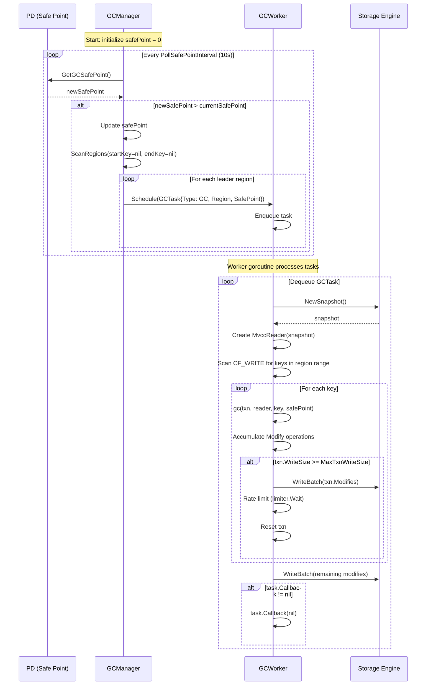
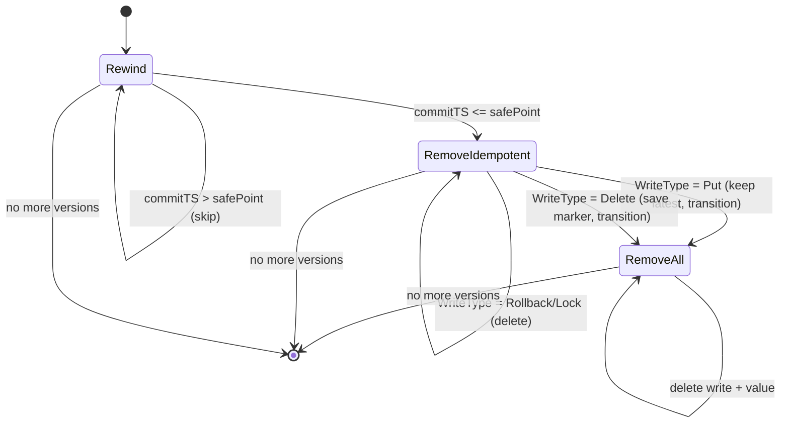

# 12. GC Worker

## 1. Overview

The GC (Garbage Collection) worker is responsible for reclaiming stale MVCC versions from the storage engine. In gookvs's Percolator-based MVCC model, every Put or Delete creates a new version in CF_WRITE (and potentially CF_DEFAULT). Without GC, the storage engine would grow without bound.

The GC subsystem consists of three layers:

1. **Safe Point Management** -- A timestamp obtained from PD below which all transactions have finalized (committed or rolled back). Versions older than the safe point are eligible for deletion, subject to per-key retention rules.
2. **GC Manager** -- A background goroutine that periodically polls PD for safe point updates and dispatches GC tasks to the GC worker.
3. **GC Worker** -- A task executor that processes GC tasks by scanning CF_WRITE and deleting obsolete versions using the MVCC GC algorithm.
4. **KvGC gRPC Endpoint** -- Allows external clients (e.g., TiDB's GC leader) to trigger GC for a specific region.

**Package location:** `internal/storage/gc/`

---

## 2. TiKV Reference

### 2.1 Architecture (from `tikv_impl_docs/transaction_and_mvcc.md` section 12)

TiKV's GC architecture is a three-tier system:

```
PD (safe_point)
    |
    v
GcManager (10s poll interval)
    |
    v
GcWorker (task executor)
    |
    +-- MvccGc (per-key, state machine)
    +-- GcKeys (batch keys from compaction filter)
    +-- Compaction Filter (passive GC during SST compaction)
```

### 2.2 Safe Point Semantics

The safe point is a PD-managed timestamp guaranteeing that all transactions with `commit_ts <= safe_point` have fully committed or rolled back. PD exposes `GetGCSafePoint` and `UpdateGCSafePoint` RPCs (defined in `proto/pdpb.proto`).

### 2.3 MVCC GC Algorithm (`tikv/src/storage/txn/actions/gc.rs`)

Per-key GC uses a three-state machine:

- **Rewind(safe_point):** Skip write records with `commitTS > safe_point`.
- **RemoveIdempotent:** Once below safe_point, remove Rollback/Lock records. On encountering Put, keep it (latest version) and transition to RemoveAll. On Delete, save it for potential removal and transition to RemoveAll.
- **RemoveAll:** Delete all remaining older versions (both CF_WRITE and CF_DEFAULT entries).

Key invariant: the latest data-changing version (Put or Delete) at or below the safe point is always preserved.

### 2.4 GcTask Types (`tikv/src/server/gc_worker/gc_worker.rs`)

| Task | Description |
|------|-------------|
| `Gc` | GC a region: scan all keys in the region's key range |
| `GcKeys` | GC a specific set of keys (from compaction filter) |
| `UnsafeDestroyRange` | Delete all data in a key range (used for dropped tables) |

### 2.5 Rate Limiting

TiKV uses a `Limiter` to cap GC write throughput (`max_write_bytes_per_sec`), preventing GC from saturating disk I/O and impacting foreground reads/writes. The GC worker calls `limiter.blocking_consume(write_size)` before flushing each batch.

### 2.6 Batch Size Control

TiKV's `MAX_TXN_WRITE_SIZE` (32 KB) limits the accumulated modification size per GC key. When exceeded, GC for that key is paused and resumed in the next round (`is_completed = false`).

### 2.7 GC Fence

The `gc_fence` field on Write records prevents incorrect reads on stale followers. When GC deletes a version that has `has_overlapped_rollback = true`, it must set `gc_fence` on the surviving version to the next version's `commit_ts`. gookvs must implement this for correctness.

---

## 3. Proposed Go Design

### 3.1 Package Structure

```
internal/storage/gc/
    gc_worker.go        -- GCWorker: task executor with worker goroutine
    gc_manager.go       -- GCManager: safe point polling, task dispatch
    gc.go               -- MVCC GC algorithm (per-key state machine)
    gc_config.go        -- GCConfig: tuning parameters
    gc_worker_test.go   -- Unit tests
    gc_test.go          -- MVCC GC algorithm tests
```

### 3.2 GCConfig

```go
// GCConfig holds tunable parameters for the GC subsystem.
type GCConfig struct {
    // PollSafePointInterval is how often GCManager polls PD for safe point updates.
    PollSafePointInterval time.Duration // default: 10s

    // MaxWriteBytesPerSec limits GC write throughput (0 = unlimited).
    MaxWriteBytesPerSec int64 // default: 0 (unlimited)

    // MaxTxnWriteSize is the maximum accumulated write batch size per key
    // before pausing GC and continuing in the next round.
    MaxTxnWriteSize int // default: 32 * 1024

    // BatchKeys is the number of keys to scan per GC batch.
    BatchKeys int // default: 512
}
```

### 3.3 GCInfo

```go
// GCInfo contains statistics from GC processing of a single key.
type GCInfo struct {
    FoundVersions   int
    DeletedVersions int
    IsCompleted     bool
}
```

### 3.4 GCTask

```go
// GCTaskType identifies the kind of GC work.
type GCTaskType int

const (
    GCTaskTypeGC GCTaskType = iota          // GC a region
    GCTaskTypeGCKeys                         // GC specific keys
    GCTaskTypeUnsafeDestroyRange             // Delete a key range
)

// GCTask represents a unit of GC work.
type GCTask struct {
    Type      GCTaskType
    Region    *metapb.Region         // for GCTaskTypeGC
    SafePoint txntypes.TimeStamp
    Keys      []mvcc.Key             // for GCTaskTypeGCKeys
    StartKey  []byte                 // for GCTaskTypeUnsafeDestroyRange
    EndKey    []byte                 // for GCTaskTypeUnsafeDestroyRange
    Callback  func(error)            // optional completion callback
}
```

### 3.5 SafePointProvider

```go
// SafePointProvider abstracts PD safe point retrieval for testability.
type SafePointProvider interface {
    GetGCSafePoint(ctx context.Context) (txntypes.TimeStamp, error)
}

// PDSafePointProvider implements SafePointProvider via PD client.
type PDSafePointProvider struct {
    client pdclient.Client
}

func (p *PDSafePointProvider) GetGCSafePoint(ctx context.Context) (txntypes.TimeStamp, error) {
    // Calls PD's GetGCSafePoint RPC
    // Returns the safe_point as txntypes.TimeStamp
}
```

### 3.6 GCWorker

```go
// GCWorker executes GC tasks using a pool of worker goroutines.
type GCWorker struct {
    engine    traits.KvEngine
    taskCh    chan GCTask
    config    *GCConfig
    limiter   *rate.Limiter          // golang.org/x/time/rate

    // Statistics (atomic)
    keysScanned    atomic.Int64
    versionsDeleted atomic.Int64
    bytesReclaimed atomic.Int64

    stopCh chan struct{}
    wg     sync.WaitGroup
}

func NewGCWorker(engine traits.KvEngine, config *GCConfig) *GCWorker
func (w *GCWorker) Start(ctx context.Context)
func (w *GCWorker) Stop()
func (w *GCWorker) Schedule(task GCTask) error
func (w *GCWorker) Stats() GCWorkerStats
```

### 3.7 GCManager

```go
// GCManager polls PD for safe point updates and dispatches GC tasks.
type GCManager struct {
    safePointProvider SafePointProvider
    worker           *GCWorker
    storeID          uint64
    regionProvider   RegionInfoProvider  // to enumerate leader regions

    safePoint atomic.Uint64
    config    *GCConfig

    stopCh chan struct{}
    wg     sync.WaitGroup
}

func NewGCManager(
    provider SafePointProvider,
    worker *GCWorker,
    storeID uint64,
    regionProvider RegionInfoProvider,
    config *GCConfig,
) *GCManager

func (m *GCManager) Start(ctx context.Context)
func (m *GCManager) Stop()
```

### 3.8 RegionInfoProvider

```go
// RegionInfoProvider enumerates regions on this store for GC scheduling.
type RegionInfoProvider interface {
    // ScanRegions returns regions whose key range overlaps [startKey, endKey).
    // If endKey is nil, scans to the end.
    ScanRegions(startKey, endKey []byte) ([]*metapb.Region, error)

    // IsLeader returns true if this store is the Raft leader for the given region.
    IsLeader(regionID uint64) bool
}
```

---

## 4. Processing Flows

### 4.1 GC Manager Lifecycle



### 4.2 Per-Key MVCC GC State Machine



---

## 5. Data Structures

### 5.1 Component Relationships

```mermaid
classDiagram
    class GCManager {
        -safePointProvider SafePointProvider
        -worker *GCWorker
        -storeID uint64
        -regionProvider RegionInfoProvider
        -safePoint atomic.Uint64
        -config *GCConfig
        +Start(ctx context.Context)
        +Stop()
        -pollSafePoint(ctx context.Context)
        -gcAllRegions(safePoint TimeStamp)
    }

    class GCWorker {
        -engine traits.KvEngine
        -taskCh chan GCTask
        -config *GCConfig
        -limiter *rate.Limiter
        -keysScanned atomic.Int64
        -versionsDeleted atomic.Int64
        +Start(ctx context.Context)
        +Stop()
        +Schedule(task GCTask) error
        +Stats() GCWorkerStats
        -processTask(task GCTask) error
        -gcRegion(region Region, safePoint TimeStamp) error
        -gcKeys(keys []Key, safePoint TimeStamp) error
    }

    class GCConfig {
        +PollSafePointInterval time.Duration
        +MaxWriteBytesPerSec int64
        +MaxTxnWriteSize int
        +BatchKeys int
    }

    class GCTask {
        +Type GCTaskType
        +Region *metapb.Region
        +SafePoint TimeStamp
        +Keys []Key
        +StartKey []byte
        +EndKey []byte
        +Callback func(error)
    }

    class GCInfo {
        +FoundVersions int
        +DeletedVersions int
        +IsCompleted bool
    }

    class SafePointProvider {
        <<interface>>
        +GetGCSafePoint(ctx) (TimeStamp, error)
    }

    class PDSafePointProvider {
        -client pdclient.Client
        +GetGCSafePoint(ctx) (TimeStamp, error)
    }

    class RegionInfoProvider {
        <<interface>>
        +ScanRegions(startKey, endKey) ([]*Region, error)
        +IsLeader(regionID uint64) bool
    }

    GCManager --> SafePointProvider
    GCManager --> GCWorker
    GCManager --> RegionInfoProvider
    GCManager --> GCConfig
    GCWorker --> GCConfig
    GCWorker ..> GCTask : processes
    GCWorker ..> GCInfo : returns
    PDSafePointProvider ..|> SafePointProvider
    GCWorker --> "traits.KvEngine"
```

### 5.2 CF Layout and GC Targets

For a single user key `k` with multiple versions:

| commitTS | CF_WRITE | CF_DEFAULT | GC Action (safe_point=50) |
|----------|----------|------------|---------------------------|
| 70 | Put(startTS=65) | value@65 | Keep (above safe_point) |
| 50 | Lock(startTS=45) | -- | Delete (Rollback/Lock below safe_point) |
| 40 | Put(startTS=35) | value@35 | Keep (latest Put at or below safe_point) |
| 30 | Delete(startTS=25) | -- | Delete (older than latest) |
| 20 | Put(startTS=15) | value@15 | Delete write + Delete CF_DEFAULT value |
| 10 | Put(startTS=5) | value@5 | Delete write + Delete CF_DEFAULT value |

---

## 6. MVCC GC Algorithm (Go Implementation)

### 6.1 Core Function

```go
// GC performs garbage collection on a single key, removing obsolete MVCC versions.
// It scans CF_WRITE from newest to oldest, applying the state machine to decide
// which write records (and their corresponding CF_DEFAULT values) to delete.
//
// Returns GCInfo with statistics. If GCInfo.IsCompleted is false, the key has
// more versions to clean and should be retried in the next GC round.
func GC(
    txn *mvcc.MvccTxn,
    reader *mvcc.MvccReader,
    key mvcc.Key,
    safePoint txntypes.TimeStamp,
) (*GCInfo, error)
```

### 6.2 State Machine States

```go
type gcState int

const (
    gcStateRewind          gcState = iota // Skip versions above safePoint
    gcStateRemoveIdempotent               // Remove Lock/Rollback, keep first Put/Delete
    gcStateRemoveAll                      // Remove all remaining older versions
)
```

### 6.3 Delete Logic

When deleting a write record:
1. Call `txn.DeleteWrite(key, commitTS)` to remove the CF_WRITE entry.
2. If the write is a `Put` with no `ShortValue` (large value stored in CF_DEFAULT), call `txn.DeleteValue(key, write.StartTS)` to remove the CF_DEFAULT entry.
3. If the write is a `Delete` in `RemoveAll` state, it is the saved delete marker -- only delete if all older versions have been successfully removed.

### 6.4 GC Fence Handling

When the latest retained version has `HasOverlappedRollback = true` and we delete the version immediately below it, we must update the retained version's `GCFence` field. This is deferred to a later implementation step since it requires a PutWrite to update the existing record.

---

## 7. KvGC gRPC Endpoint

The `KvGC` RPC is defined in `proto/tikvpb.proto` and `proto/kvrpcpb.proto`:

```protobuf
// tikvpb.proto
rpc KvGC(kvrpcpb.GCRequest) returns (kvrpcpb.GCResponse) {}

// kvrpcpb.proto
message GCRequest {
    Context context = 1;
    uint64 safe_point = 2;
}

message GCResponse {
    errorpb.Error region_error = 1;
    KeyError error = 2;
}
```

The server handler will:
1. Extract the region from the request context.
2. Create a `GCTask{Type: GCTaskTypeGC, Region: region, SafePoint: safe_point}`.
3. Schedule it on the GCWorker.
4. Wait for the callback and return the result.

---

## 8. Error Handling

| Error Condition | Handling |
|----------------|----------|
| PD unreachable | Log warning, retry on next poll interval. Do not advance safe point. |
| Safe point regression | Log error, ignore the regressed value. Safe point must be monotonically increasing. |
| Engine write failure | Return error to task callback. The key will be retried in the next GC round. |
| Region not leader | Skip the region. GCManager only schedules tasks for leader regions. |
| Snapshot creation failure | Log error, skip this GC round. |
| Rate limiter context cancelled | Abort current task, drain remaining tasks. |
| MaxTxnWriteSize exceeded | Flush accumulated writes, mark key as incomplete, continue to next key. |
| Task queue full | Return `ErrGCTaskQueueFull` from `Schedule()`. GCManager will retry. |

---

## 9. Testing Strategy

### 9.1 Unit Tests (gc_test.go)

Port from TiKV's `src/storage/txn/actions/gc.rs::tests`:

1. **test_gc**: Multiple versions with Put, Delete, Lock, Rollback. Verify correct version retention at various safe points.
   - Sequence: Put@10, Put@20, Delete@30, Put@40, Lock@50, Rollback@55
   - GC at safe_point=12: keep Put@10, verify readable
   - GC at safe_point=22: keep Put@20, old Put deleted
   - GC at safe_point=32: Delete@30 kept, everything older deleted
   - GC at safe_point=60: Put@40 kept, Lock/Rollback removed

2. **test_gc_short_value**: Same as above but with values <= 255 bytes (inlined in Write records). Verify no CF_DEFAULT cleanup needed.

3. **test_gc_large_value**: Values > 255 bytes. Verify CF_DEFAULT entries are correctly deleted.

4. **test_gc_incomplete**: Verify that when `MaxTxnWriteSize` is exceeded mid-key, `IsCompleted` is false and the key is correctly GC'd on retry.

5. **test_gc_delete_only**: Key with only Delete versions. Verify all versions are removed.

6. **test_gc_no_versions**: Key with no write records. Verify no-op.

### 9.2 GCWorker Tests (gc_worker_test.go)

1. **test_gc_worker_region**: Set up a region with multiple keys, trigger GC, verify all keys are cleaned.
2. **test_gc_worker_rate_limiting**: Verify that GC respects `MaxWriteBytesPerSec`.
3. **test_gc_worker_task_queue_full**: Verify `ErrGCTaskQueueFull` is returned when the queue is full.
4. **test_gc_manager_safe_point_poll**: Verify GCManager correctly polls and dispatches on safe point updates.
5. **test_gc_manager_no_regression**: Verify that a regressed safe point is ignored.

### 9.3 Integration Tests

1. **test_gc_end_to_end**: Write multiple versions via 2PC, advance safe point, trigger GC, verify old versions are gone and latest is preserved.
2. **test_gc_concurrent_reads**: Run GC concurrently with reads at various timestamps. Verify reads above the safe point are unaffected.

### 9.4 Test Helpers

```go
// MockSafePointProvider returns a configurable safe point for testing.
type MockSafePointProvider struct {
    safePoint atomic.Uint64
}

func (m *MockSafePointProvider) GetGCSafePoint(_ context.Context) (txntypes.TimeStamp, error) {
    return txntypes.TimeStamp(m.safePoint.Load()), nil
}

func (m *MockSafePointProvider) SetSafePoint(ts txntypes.TimeStamp) {
    m.safePoint.Store(uint64(ts))
}
```

---

## 10. Implementation Steps

### Step 1: MVCC GC Algorithm (`gc.go`)

Implement the per-key `GC()` function with the three-state machine (Rewind, RemoveIdempotent, RemoveAll). This is the core algorithm with no external dependencies beyond `MvccTxn` and `MvccReader`.

**Dependencies:** `internal/storage/mvcc` (MvccTxn, MvccReader), `pkg/txntypes` (Write, TimeStamp)

### Step 2: GC Algorithm Tests (`gc_test.go`)

Port TiKV's `test_gc` and `test_gc_with_compaction_filter` test cases. Use the in-memory engine for testing.

**Dependencies:** Step 1, `internal/engine` (test engine)

### Step 3: GCConfig and GCInfo (`gc_config.go`)

Define configuration struct with defaults and the GCInfo statistics struct.

**Dependencies:** None

### Step 4: GCWorker (`gc_worker.go`)

Implement the task executor with:
- Task channel and worker goroutine
- Region GC: scan CF_WRITE with an iterator, call `GC()` per key
- Rate limiting via `golang.org/x/time/rate`
- Batch flushing when `MaxTxnWriteSize` is exceeded
- Statistics tracking

**Dependencies:** Steps 1-3, `internal/engine/traits` (KvEngine, Iterator)

### Step 5: Safe Point Provider (`gc_worker.go`)

Implement `PDSafePointProvider` by adding `GetGCSafePoint` and `UpdateGCSafePoint` methods to `pdclient.Client` interface. The underlying gRPC calls use the existing `GetGCSafePointRequest`/`UpdateGCSafePointRequest` proto messages.

**Dependencies:** `pkg/pdclient`, `proto/pdpb.proto` (already has the message definitions)

### Step 6: GCManager (`gc_manager.go`)

Implement the background polling goroutine:
- Poll PD for safe point updates
- Enumerate leader regions via `RegionInfoProvider`
- Dispatch `GCTask` for each leader region
- Handle safe point advancement during a GC round (rewinding pattern)

**Dependencies:** Steps 4-5, `RegionInfoProvider` (from raftstore)

### Step 7: KvGC gRPC Handler

Wire the `KvGC` endpoint in the gRPC server to schedule a `GCTask` on the `GCWorker`.

**Dependencies:** Step 4, `internal/server` (gRPC service registration)

### Step 8: GCWorker Integration with Server Startup

Register `GCManager` and `GCWorker` in the server lifecycle (start on boot, stop on shutdown).

**Dependencies:** Steps 6-7

---

## 11. Dependencies

### Required (must exist before implementation)

| Component | Location | Needed For |
|-----------|----------|------------|
| MvccTxn | `internal/storage/mvcc/txn.go` | Write accumulator for GC deletions |
| MvccReader | `internal/storage/mvcc/reader.go` | SeekWrite for version scanning |
| Write / TimeStamp | `pkg/txntypes/` | Version record types |
| KvEngine / Iterator | `internal/engine/traits/traits.go` | Storage access, CF_WRITE scanning |
| WriteBatch | `internal/engine/traits/traits.go` | Atomic batch writes |
| DeleteRange | `internal/engine/traits/traits.go` | UnsafeDestroyRange task |

### Required (must be added)

| Component | Location | Needed For |
|-----------|----------|------------|
| GetGCSafePoint | `pkg/pdclient/client.go` | New method on Client interface |
| UpdateGCSafePoint | `pkg/pdclient/client.go` | New method on Client interface |
| RegionInfoProvider | `internal/raftstore/` or `internal/storage/gc/` | Enumerate leader regions |
| MVCC Scanner | `internal/storage/mvcc/` (design doc 06) | Efficient key-range iteration in CF_WRITE |

### Optional (nice to have)

| Component | Purpose |
|-----------|---------|
| Compaction Filter | Passive GC during RocksDB compaction (optimization, not in initial scope) |
| GC Fence updates | Correctness for stale follower reads with overlapped rollbacks |
