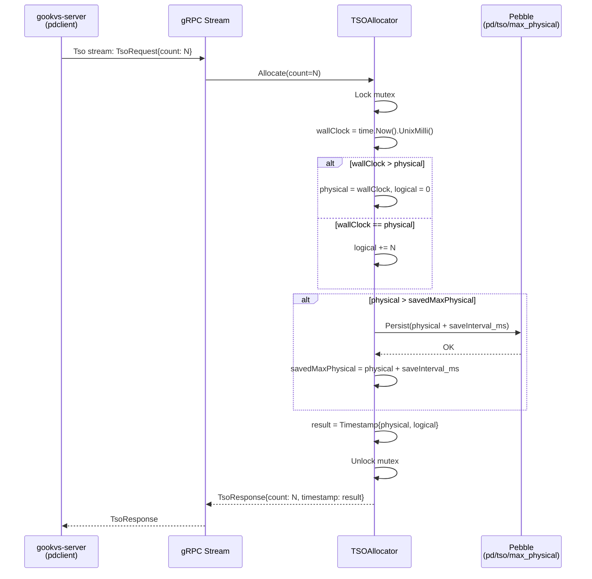
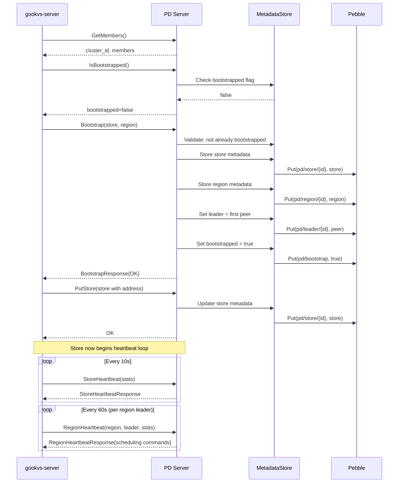
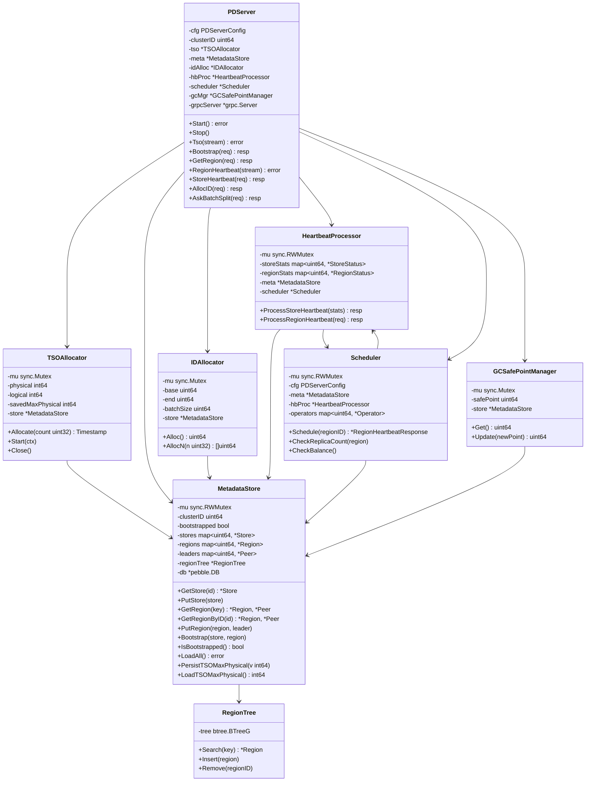

# 13 PD Server: Embedded Placement Driver for gookvs

## 1. Overview

gookvs currently depends on an external PD server (the same PD used by TiKV/TiDB) for cluster coordination. This document designs a self-contained PD server implementation that can run either as a **separate binary** (`cmd/gookvs-pd/main.go`) or in **embedded mode** within `gookvs-server`. The PD server is the cluster brain responsible for:

- **TSO (Timestamp Oracle)**: globally unique, monotonically increasing timestamps for MVCC transactions
- **Cluster metadata storage**: store and region registries with persistence
- **Region scheduling**: balance regions across stores via heartbeat-driven scheduling decisions
- **Heartbeat processing**: receive store/region heartbeats, track cluster health, issue scheduling commands
- **ID allocation**: monotonic unique IDs for stores, regions, and peers
- **Split coordination**: allocate IDs for region splits, record completed splits
- **GC safe point management**: track and update the garbage collection safe point
- **Bootstrap flow**: initialize the cluster with the first store and region

### Current State

| Component | Status |
|---|---|
| `pkg/pdclient/Client` interface | Fully implemented (13 methods) |
| `pkg/pdclient/grpcClient` | Fully implemented, speaks `pdpb.PD` gRPC service |
| `pkg/pdclient/MockClient` | In-memory mock with 14 test cases |
| `proto/pdpb.proto` | Full proto definition (kvproto-compatible) |
| PD server | **Does not exist** |
| `--pd-endpoints` flag | Accepted but PD client not instantiated in `main.go` |
| Heartbeat loops | Methods implemented in client, not wired in raftstore |

### Scope

This design covers implementing the server side of all RPCs that the `pdclient.Client` interface consumes, plus supporting RPCs (`GetMembers`, `GetGCSafePoint`, `UpdateGCSafePoint`, `GetAllStores`). The PD server will implement the `pdpb.PD` gRPC service interface generated from `proto/pdpb.proto`.

**In scope** (16 RPCs):

| RPC | Style | Priority |
|---|---|---|
| `GetMembers` | Unary | P0 -- required for client connection init |
| `Tso` | Bidirectional stream | P0 -- required for transactions |
| `Bootstrap` | Unary | P0 -- required for cluster init |
| `IsBootstrapped` | Unary | P0 -- required for cluster init |
| `AllocID` | Unary | P0 -- required for store/region/peer ID allocation |
| `GetStore` | Unary | P0 -- required for address resolution |
| `PutStore` | Unary | P0 -- required for store registration |
| `GetAllStores` | Unary | P1 -- useful for admin/diagnostics |
| `StoreHeartbeat` | Unary | P0 -- required for cluster health |
| `RegionHeartbeat` | Bidirectional stream | P0 -- required for scheduling |
| `GetRegion` | Unary | P0 -- required for key routing |
| `GetRegionByID` | Unary | P0 -- required for region lookup |
| `AskBatchSplit` | Unary | P0 -- required for region split |
| `ReportBatchSplit` | Unary | P0 -- required for split completion |
| `GetGCSafePoint` | Unary | P1 -- required for MVCC GC |
| `UpdateGCSafePoint` | Unary | P1 -- required for MVCC GC |

**Out of scope**: `ScanRegions`, `BatchScanRegions`, `ScatterRegion`, `SyncRegions`, `GetOperator`, `SyncMaxTS`, `SplitRegions`, `SplitAndScatterRegions`, `GetDCLocationInfo`, `StoreGlobalConfig`, `LoadGlobalConfig`, `WatchGlobalConfig`, `ReportBuckets`, `ReportMinResolvedTS`, `SetExternalTimestamp`, `GetExternalTimestamp`, `GetMinTS`, `GetClusterInfo`, `GetClusterConfig`, `PutClusterConfig`, `IsSnapshotRecovering`, `QueryRegion`, all GCSafePointV2/barrier RPCs. These will return `Unimplemented` and can be added later.

---

## 2. TiKV/PD Reference

### 2.1 PD's Role in the TiKV Ecosystem

From `tikv_impl_docs/architecture_overview.md`:

- TiKV nodes do **not** discover each other directly. All coordination flows through PD.
- PD maintains the authoritative mapping of regions to stores.
- Each TiKV node connects to PD via configured `pd_endpoints` and calls `GetMembers` to discover the cluster ID.
- **Store heartbeats** report store-level stats (capacity, usage, region count) periodically.
- **Region heartbeats** are sent by each region leader reporting region stats; PD returns scheduling commands (AddPeer, RemovePeer, TransferLeader, SplitRegion, Merge).
- **TSO** provides globally unique, monotonically increasing timestamps. The PD client uses a persistent bidirectional gRPC stream for TSO requests.
- **PdStoreAddrResolver** maps store IDs to network addresses using PD's `GetStore` RPC.

### 2.2 PD Architecture (TiDB PD)

In the TiDB ecosystem, PD is a separate Go project (`github.com/tikv/pd`) that:
- Uses **embedded etcd** for leader election, metadata persistence, and high availability (3-node or 5-node Raft via etcd).
- Stores all metadata (stores, regions, cluster config) in etcd's key-value store.
- Runs scheduling algorithms that analyze heartbeat data and generate operators (AddPeer, TransferLeader, etc.).
- Provides a TSO service that allocates timestamps using `physical (wall clock ms) << 18 | logical (counter)`.

### 2.3 Simplifications for gookvs

gookvs does not need the full complexity of TiDB PD. Key simplifications:

| TiDB PD | gookvs PD |
|---|---|
| etcd-based 3/5-node HA | Single-node PD (sufficient for gookvs scope) |
| etcd key-value metadata store | Embedded Pebble (already a dependency) for persistence |
| Complex scheduling with 20+ scheduler types | Simple balancing: region count balance + split coordination |
| Dashboard, TSO microservice, keyspace management | None |
| Multiple DC location TSO | Single TSO |

---

## 3. Proposed Go Design

### 3.1 Package Layout

```
internal/pd/
    server.go          -- PDServer struct, gRPC service registration, lifecycle
    tso.go             -- TSO allocator (timestamp oracle)
    metadata.go        -- MetadataStore: stores, regions, cluster state
    heartbeat.go       -- HeartbeatProcessor: store/region heartbeat handling
    scheduler.go       -- Scheduler: region balancing decisions
    id_alloc.go        -- IDAllocator: monotonic ID generation
    gc.go              -- GC safe point management
    config.go          -- PDServerConfig

cmd/gookvs-pd/
    main.go            -- Standalone PD binary entry point
```

### 3.2 PDServer Struct

```go
// PDServer implements the pdpb.PDServer gRPC interface.
type PDServer struct {
    pdpb.UnimplementedPDServer

    cfg       PDServerConfig
    clusterID uint64

    tso       *TSOAllocator
    meta      *MetadataStore
    idAlloc   *IDAllocator
    hbProc    *HeartbeatProcessor
    scheduler *Scheduler
    gcMgr     *GCSafePointManager

    grpcServer *grpc.Server
    listener   net.Listener

    ctx    context.Context
    cancel context.CancelFunc
    wg     sync.WaitGroup
}
```

### 3.3 PDServerConfig

```go
type PDServerConfig struct {
    // ListenAddr is the gRPC listen address (e.g., "0.0.0.0:2379").
    ListenAddr string

    // DataDir is the directory for persistent metadata storage.
    DataDir string

    // ClusterID identifies this cluster. All requests must carry this ID.
    ClusterID uint64

    // TSO configuration.
    TSOSaveInterval  time.Duration // How often to persist TSO to disk (default: 3s)
    TSOUpdatePhysicalInterval time.Duration // Interval for advancing physical clock (default: 50ms)

    // Scheduling configuration.
    MaxPeerCount          int   // Target replication factor (default: 3)
    RegionScheduleLimit   int   // Max concurrent region scheduling operators (default: 64)
    LeaderScheduleLimit   int   // Max concurrent leader transfer operators (default: 4)

    // Heartbeat configuration.
    StoreHeartbeatInterval  time.Duration // Expected interval (default: 10s)
    RegionHeartbeatInterval time.Duration // Expected interval (default: 60s)
}
```

### 3.4 TSO Allocator

The TSO allocator generates globally unique, monotonically increasing timestamps. Each timestamp is composed of `physical << 18 | logical`, matching TiKV's format.

```go
type TSOAllocator struct {
    mu sync.Mutex

    // Current timestamp state.
    physical int64 // milliseconds since Unix epoch
    logical  int64 // counter within the same physical ms

    // Persisted maximum physical timestamp (prevents regression on restart).
    // On restart, physical is set to max(wall_clock, savedMaxPhysical + 1ms).
    savedMaxPhysical int64

    // Persistence backend.
    store *MetadataStore

    // Config.
    saveInterval          time.Duration
    updatePhysicalInterval time.Duration

    // Background goroutine control.
    ctx    context.Context
    cancel context.CancelFunc
}
```

**Key invariants**:
1. `physical` must never decrease, even across restarts.
2. `logical` resets to 0 when `physical` advances.
3. `logical` must not exceed `2^18 - 1` (262143) per physical millisecond.
4. Before serving TSO requests, the allocator persists `physical + saveInterval` to disk, creating a "window". If it crashes, it restarts from the saved value, guaranteeing monotonicity.

**Allocation algorithm**:
1. Lock the mutex.
2. Read the current wall clock in milliseconds.
3. If `wallClock > physical`: set `physical = wallClock`, `logical = 0`.
4. If `wallClock == physical`: increment `logical`. If `logical >= maxLogical`, wait and retry.
5. If `wallClock < physical`: use existing `physical`, increment `logical` (clock went backward; physical stays ahead).
6. If `physical` has advanced past `savedMaxPhysical`, persist the new window (`physical + saveInterval_ms`) to disk.
7. Return `Timestamp{Physical: physical, Logical: logical}`.

### 3.5 Metadata Store

The MetadataStore manages all cluster metadata with persistence via Pebble.

```go
type MetadataStore struct {
    mu sync.RWMutex

    clusterID    uint64
    bootstrapped bool

    // In-memory indexes (rebuilt from Pebble on startup).
    stores  map[uint64]*metapb.Store      // storeID -> Store
    regions map[uint64]*metapb.Region     // regionID -> Region
    leaders map[uint64]*metapb.Peer       // regionID -> leader Peer

    // Region key range index for GetRegion(key) lookups.
    // Sorted by start_key for binary search.
    regionTree *RegionTree

    // Persistent storage.
    db *pebble.DB
}
```

**Pebble key layout**:

| Key prefix | Value | Purpose |
|---|---|---|
| `pd/cluster_id` | `uint64` | Cluster ID |
| `pd/bootstrap` | `bool` | Bootstrap flag |
| `pd/store/{storeID}` | `metapb.Store` (protobuf) | Store metadata |
| `pd/region/{regionID}` | `metapb.Region` (protobuf) | Region metadata |
| `pd/leader/{regionID}` | `metapb.Peer` (protobuf) | Region leader |
| `pd/tso/max_physical` | `int64` | Last persisted TSO physical upper bound |
| `pd/id/next` | `uint64` | Next allocatable ID |
| `pd/gc/safe_point` | `uint64` | GC safe point |

**RegionTree**: A sorted data structure (e.g., `btree.BTreeG`) that indexes regions by `[start_key, end_key)` for O(log n) key-to-region lookups.

### 3.6 Heartbeat Processor

```go
type HeartbeatProcessor struct {
    mu sync.RWMutex

    // Store status tracking.
    storeStats map[uint64]*StoreStatus

    // Region status tracking.
    regionStats map[uint64]*RegionStatus

    // Reference to metadata and scheduler for generating responses.
    meta      *MetadataStore
    scheduler *Scheduler
}

type StoreStatus struct {
    Store         *metapb.Store
    Stats         *pdpb.StoreStats
    LastHeartbeat time.Time
}

type RegionStatus struct {
    Region          *metapb.Region
    Leader          *metapb.Peer
    DownPeers       []*pdpb.PeerStats
    PendingPeers    []*metapb.Peer
    ApproximateSize uint64
    ApproximateKeys uint64
    BytesWritten    uint64
    BytesRead       uint64
    LastHeartbeat   time.Time
}
```

### 3.7 Scheduler

The scheduler analyzes heartbeat data and generates scheduling operators returned in `RegionHeartbeatResponse`.

```go
type Scheduler struct {
    mu sync.RWMutex

    cfg       PDServerConfig
    meta      *MetadataStore
    hbProc    *HeartbeatProcessor

    // Pending operators per region (at most one per region).
    operators map[uint64]*Operator
}

type OperatorKind int

const (
    OpAddPeer OperatorKind = iota
    OpRemovePeer
    OpTransferLeader
)

type Operator struct {
    Kind     OperatorKind
    RegionID uint64
    Peer     *metapb.Peer       // target peer for add/remove/transfer
    Created  time.Time
}
```

**Scheduling strategies** (initial implementation):

1. **Replica repair**: If a region has fewer peers than `MaxPeerCount` and there are available stores, emit `ChangePeer{AddPeer}`.
2. **Over-replication repair**: If a region has more peers than `MaxPeerCount`, emit `ChangePeer{RemovePeer}` for the peer on the least loaded store (by region count).
3. **Region count balance**: If the difference in region counts between the most loaded and least loaded stores exceeds a threshold, emit `TransferLeader` or move a peer.

### 3.8 ID Allocator

```go
type IDAllocator struct {
    mu   sync.Mutex
    base uint64 // next ID to allocate
    end  uint64 // upper bound of current pre-allocated batch

    batchSize uint64        // how many IDs to pre-allocate per persistence (default: 1000)
    store     *MetadataStore
}
```

**Algorithm**: Pre-allocate IDs in batches. When `base == end`, persist `end + batchSize` to disk, then set `end = end + batchSize`. This minimizes disk writes (one write per 1000 IDs) while guaranteeing no ID reuse on crash.

### 3.9 GC Safe Point Manager

```go
type GCSafePointManager struct {
    mu        sync.Mutex
    safePoint uint64
    store     *MetadataStore
}
```

Simple manager that tracks the global GC safe point. `UpdateGCSafePoint` only moves the safe point forward (never backward).

---

## 4. Processing Flows

### 4.1 TSO Allocation Flow



### 4.2 Cluster Bootstrap Flow



### 4.3 Region Heartbeat Processing

When a region leader sends a heartbeat:

1. **Update metadata**: Update region info (epoch, key range, peers) in MetadataStore if the heartbeat carries a newer epoch.
2. **Update leader**: Record the current leader peer.
3. **Update stats**: Record region size, keys, traffic in HeartbeatProcessor.
4. **Check scheduling**: Ask the Scheduler if any operator should be issued for this region.
5. **Return response**: If an operator exists, include the corresponding scheduling command (`change_peer`, `transfer_leader`, `split_region`, `merge`) in the response.

### 4.4 Region Split Coordination

1. Store detects region exceeds size threshold.
2. Store calls `AskBatchSplit(region, split_count)`.
3. PD allocates `split_count` sets of `{new_region_id, new_peer_ids[]}` via IDAllocator.
4. PD returns `AskBatchSplitResponse` with allocated IDs.
5. Store executes the split locally via Raft admin command.
6. Store calls `ReportBatchSplit(regions)` with the resulting regions.
7. PD updates MetadataStore: original region gets updated key range, new regions are inserted.

---

## 5. Data Structures



---

## 6. RPC Implementation Details

### 6.1 GetMembers

Returns the PD server's identity so clients can discover the cluster ID. Since gookvs PD runs as a single node, the response contains one member.

```go
func (s *PDServer) GetMembers(ctx context.Context, req *pdpb.GetMembersRequest) (*pdpb.GetMembersResponse, error) {
    return &pdpb.GetMembersResponse{
        Header: s.responseHeader(),
        Members: []*pdpb.Member{{
            Name:       s.cfg.Name,
            MemberId:   s.cfg.MemberID,
            ClientUrls: []string{s.cfg.ListenAddr},
        }},
        Leader: &pdpb.Member{
            Name:       s.cfg.Name,
            MemberId:   s.cfg.MemberID,
            ClientUrls: []string{s.cfg.ListenAddr},
        },
    }, nil
}
```

### 6.2 Tso (Bidirectional Stream)

The TSO RPC is a bidirectional stream. The server reads `TsoRequest` messages and responds with `TsoResponse` messages in a loop.

```go
func (s *PDServer) Tso(stream pdpb.PD_TsoServer) error {
    for {
        req, err := stream.Recv()
        if err == io.EOF {
            return nil
        }
        if err != nil {
            return err
        }
        if err := s.validateClusterID(req.GetHeader()); err != nil {
            // Send error response and continue
            stream.Send(&pdpb.TsoResponse{Header: s.errorHeader(err)})
            continue
        }
        ts, err := s.tso.Allocate(req.GetCount())
        if err != nil {
            stream.Send(&pdpb.TsoResponse{Header: s.errorHeader(err)})
            continue
        }
        stream.Send(&pdpb.TsoResponse{
            Header:    s.responseHeader(),
            Count:     req.GetCount(),
            Timestamp: ts,
        })
    }
}
```

### 6.3 RegionHeartbeat (Bidirectional Stream)

The region heartbeat is also a bidirectional stream. The server reads heartbeat requests and may send scheduling commands back. Not every request triggers a response; responses are sent only when there is a scheduling action.

```go
func (s *PDServer) RegionHeartbeat(stream pdpb.PD_RegionHeartbeatServer) error {
    for {
        req, err := stream.Recv()
        if err == io.EOF {
            return nil
        }
        if err != nil {
            return err
        }
        resp, err := s.hbProc.ProcessRegionHeartbeat(req)
        if err != nil {
            // Log but continue processing
            continue
        }
        if resp != nil {
            if err := stream.Send(resp); err != nil {
                return err
            }
        }
    }
}
```

### 6.4 GetRegion (Key Lookup)

Uses the RegionTree for O(log n) lookup:

```go
func (s *PDServer) GetRegion(ctx context.Context, req *pdpb.GetRegionRequest) (*pdpb.GetRegionResponse, error) {
    region, leader := s.meta.GetRegionByKey(req.GetRegionKey())
    if region == nil {
        return &pdpb.GetRegionResponse{Header: s.responseHeader()}, nil
    }
    return &pdpb.GetRegionResponse{
        Header: s.responseHeader(),
        Region: region,
        Leader: leader,
    }, nil
}
```

### 6.5 AskBatchSplit

```go
func (s *PDServer) AskBatchSplit(ctx context.Context, req *pdpb.AskBatchSplitRequest) (*pdpb.AskBatchSplitResponse, error) {
    count := req.GetSplitCount()
    region := req.GetRegion()
    peerCount := uint32(len(region.GetPeers()))

    var ids []*pdpb.SplitID
    for i := uint32(0); i < count; i++ {
        newRegionID := s.idAlloc.Alloc()
        newPeerIDs := s.idAlloc.AllocN(peerCount)
        ids = append(ids, &pdpb.SplitID{
            NewRegionId: newRegionID,
            NewPeerIds:  newPeerIDs,
        })
    }
    return &pdpb.AskBatchSplitResponse{
        Header: s.responseHeader(),
        Ids:    ids,
    }, nil
}
```

---

## 7. Error Handling

### 7.1 Error Types

The PD server uses the `pdpb.Error` message with `ErrorType` enum for structured errors:

| Error Type | When |
|---|---|
| `NOT_BOOTSTRAPPED` | Any data operation before `Bootstrap` is called |
| `ALREADY_BOOTSTRAPPED` | Second call to `Bootstrap` |
| `REGION_NOT_FOUND` | `GetRegionByID` with unknown ID |
| `STORE_TOMBSTONE` | Accessing a tombstoned store |
| `UNKNOWN` | Unexpected internal errors |

### 7.2 Cluster ID Validation

Every request carries a `RequestHeader.cluster_id`. The server validates this matches its own cluster ID. Mismatched cluster IDs return an error header. Exception: `GetMembers` and `GetClusterInfo` do not require cluster ID validation (the client uses them to discover the cluster ID).

### 7.3 TSO Safety

- If the system clock goes backward, the TSO allocator continues using the last known `physical` value and increments `logical`. This is safe as long as `logical` does not overflow.
- If `logical` overflows (262144 allocations in a single millisecond), the allocator waits until the next millisecond.
- On restart, the allocator reads `savedMaxPhysical` from Pebble and sets `physical = max(wallClock, savedMaxPhysical)`, ensuring monotonicity.

### 7.4 Metadata Consistency

- All metadata mutations (PutStore, PutRegion, Bootstrap) are persisted to Pebble before returning success.
- The in-memory maps are updated after successful persistence.
- On startup, `MetadataStore.LoadAll()` rebuilds all in-memory indexes from Pebble.

### 7.5 Epoch Staleness

Region heartbeats carry a `RegionEpoch` (conf_ver + version). The heartbeat processor rejects heartbeats with an epoch older than what is currently stored, preventing stale updates from overwriting newer metadata.

---

## 8. Testing Strategy

### 8.1 Unit Tests

| Component | Test File | Key Test Cases |
|---|---|---|
| TSOAllocator | `tso_test.go` | Monotonicity, clock backward handling, restart persistence, overflow handling, concurrent allocation (100 goroutines) |
| MetadataStore | `metadata_test.go` | Bootstrap, store CRUD, region CRUD, key-to-region lookup, epoch comparison, persistence and recovery |
| IDAllocator | `id_alloc_test.go` | Sequential allocation, batch allocation, persistence across restarts, no gaps after crash |
| HeartbeatProcessor | `heartbeat_test.go` | Store heartbeat tracking, region heartbeat with epoch update, stale heartbeat rejection |
| Scheduler | `scheduler_test.go` | Under-replicated region triggers AddPeer, over-replicated triggers RemovePeer, balanced cluster produces no operators |
| GCSafePointManager | `gc_test.go` | Get/update, forward-only invariant |

### 8.2 Integration Tests

| Test | Description |
|---|---|
| `TestPDServerBootstrap` | Start PD server, connect with `pdclient.grpcClient`, bootstrap, verify `IsBootstrapped` returns true |
| `TestPDServerTSO` | Allocate 10000 timestamps via gRPC stream, verify strict monotonicity |
| `TestPDServerTSORestart` | Allocate timestamps, stop server, restart, verify new timestamps are greater than pre-crash timestamps |
| `TestPDServerStoreHeartbeat` | Register store, send heartbeats, verify store stats are tracked |
| `TestPDServerRegionHeartbeat` | Bootstrap with region, send region heartbeat, verify metadata update |
| `TestPDServerSplitFlow` | Full split flow: AskBatchSplit -> (simulate split) -> ReportBatchSplit -> verify two regions exist |
| `TestPDServerGetRegion` | Bootstrap with region spanning all keys, verify GetRegion returns it for any key |
| `TestPDServerSchedulingAddPeer` | Create a region with fewer peers than MaxPeerCount, send heartbeat, verify AddPeer response |
| `TestPDClientWithPDServer` | Use `pkg/pdclient.grpcClient` against the PD server for all 13 Client interface methods |

### 8.3 Compatibility Tests

- Verify that `pdclient.grpcClient` can connect to our PD server with no code changes.
- Verify that the existing `MockClient` behavior matches the PD server behavior for all common flows.

---

## 9. Implementation Steps

### Phase 1: Core Infrastructure (P0)

1. **`internal/pd/config.go`**: Define `PDServerConfig` with defaults.
2. **`internal/pd/metadata.go`**: Implement `MetadataStore` with Pebble persistence, `LoadAll`, `PutStore`, `GetStore`, `PutRegion`, `GetRegion`, `GetRegionByKey`, `RegionTree`.
3. **`internal/pd/id_alloc.go`**: Implement `IDAllocator` with batch pre-allocation and persistence.
4. **`internal/pd/tso.go`**: Implement `TSOAllocator` with persistence, clock backward protection, and background physical clock advancement.
5. **`internal/pd/server.go`**: Implement `PDServer` with gRPC registration and lifecycle. Implement `GetMembers`, `Tso`, `Bootstrap`, `IsBootstrapped`, `AllocID`, `GetStore`, `PutStore`, `GetRegion`, `GetRegionByID`.
6. **`cmd/gookvs-pd/main.go`**: Standalone binary with flags: `--listen-addr`, `--data-dir`, `--cluster-id`.
7. **Tests**: Unit tests for each component + integration test connecting `grpcClient` to the server.

### Phase 2: Heartbeats and Scheduling (P0)

8. **`internal/pd/heartbeat.go`**: Implement `HeartbeatProcessor` for store and region heartbeats.
9. **`internal/pd/scheduler.go`**: Implement basic `Scheduler` (replica count repair only).
10. **RPC handlers**: Implement `StoreHeartbeat`, `RegionHeartbeat` in `server.go`.
11. **Tests**: Heartbeat processing, scheduling decisions.

### Phase 3: Split and GC (P0-P1)

12. **Split RPCs**: Implement `AskBatchSplit`, `ReportBatchSplit` in `server.go`.
13. **`internal/pd/gc.go`**: Implement `GCSafePointManager`.
14. **RPC handlers**: Implement `GetGCSafePoint`, `UpdateGCSafePoint`, `GetAllStores`.
15. **Tests**: Split flow end-to-end, GC safe point.

### Phase 4: Integration with gookvs-server (P0)

16. **Embedded mode**: Add `--embedded-pd` flag to `cmd/gookvs-server/main.go` that starts a PD server in-process.
17. **Wire PD client**: Instantiate `pdclient.Client` in `main.go` using `--pd-endpoints`, replacing the static `--initial-cluster` approach.
18. **Heartbeat loops**: Wire `StoreHeartbeat` and `ReportRegionHeartbeat` calls from the store coordinator.
19. **Store address resolver**: Implement `PDStoreAddrResolver` that calls `PD.GetStore` to resolve store IDs to addresses.

### Phase 5: Balance Scheduling (P1)

20. **Region count balancer**: Add region count balance scheduler that generates TransferLeader and MovePeer operators.
21. **Leader balance**: Add leader count balance scheduler.
22. **Tests**: Multi-store balancing scenarios.

---

## 10. Dependencies

| Dependency | Purpose | Status |
|---|---|---|
| `github.com/pingcap/kvproto/pkg/pdpb` | Generated gRPC service and message types | Already in go.mod |
| `github.com/pingcap/kvproto/pkg/metapb` | Store, Region, Peer proto types | Already in go.mod |
| `google.golang.org/grpc` | gRPC server framework | Already in go.mod |
| `github.com/cockroachdb/pebble` | Persistent metadata storage | Already in go.mod (used by engine) |
| `github.com/google/btree` | In-memory B-tree for RegionTree | **New dependency** (or use `sync.Map` + sorted slice) |
| `github.com/stretchr/testify` | Test assertions | Already in go.mod |

### Alternative: No New Dependencies

The `RegionTree` can be implemented with a sorted slice of regions and binary search, avoiding the `google/btree` dependency. With typical cluster sizes (hundreds to low thousands of regions), a sorted slice with `sort.Search` is efficient enough.

---

## 11. Embedded Mode vs. Standalone Mode

### Standalone Mode (`cmd/gookvs-pd/main.go`)

- PD runs as a separate process.
- Multiple gookvs-server instances connect to it via `--pd-endpoints`.
- Matches the TiKV production deployment model.
- Suitable for multi-node clusters.

### Embedded Mode (`--embedded-pd` flag in gookvs-server)

- PD runs inside the gookvs-server process on a separate goroutine and port.
- Simplifies single-node development and testing.
- The gookvs-server creates a `pdclient.Client` pointing to `localhost:{embedded-pd-port}`.
- Useful for integration tests and local development.

Both modes use the same `internal/pd` package; only the startup path differs.
